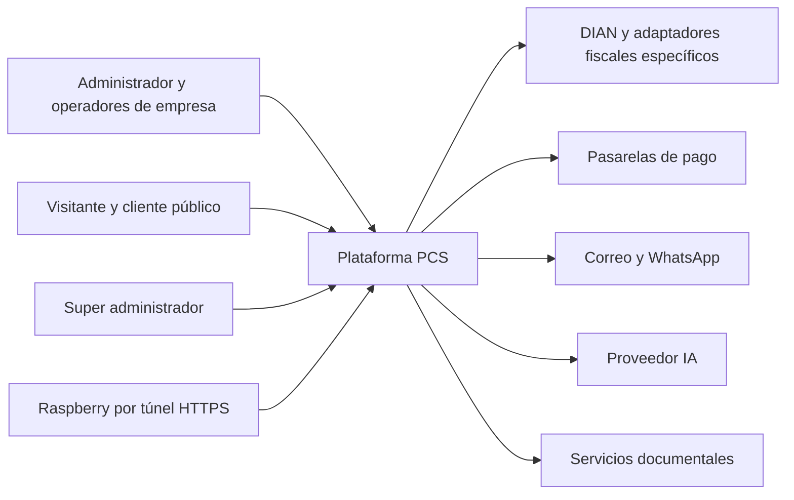
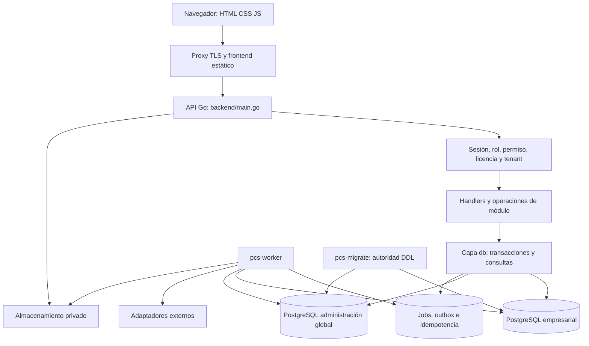
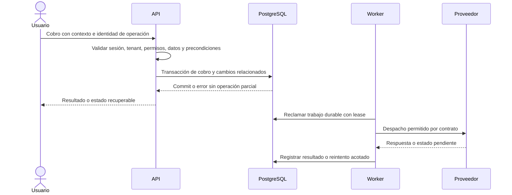

# Descripción de arquitectura de PCS

Estado: Vigente. Responsable: Coordinación técnica. Revisión documental: 2026-09-05.

## Entidad, alcance y fuentes

Entidad descrita: plataforma PCS, sus procesos de aplicación, datos empresariales, superficies web y fronteras con servicios externos. Describe el diseño y puntos de implementación presentes en el árbol local; no una topología productiva inspeccionada. El detalle por módulo permanece en el [mapa](../mapa_modulos.md), [estructura del código](../diagramas/estructura_del_codigo.md), [BD](../estructura_bd.md) y [contratos](../gobernanza_tecnica/contratos/README.md).

## Interesados y vistas

| Interesado | Preocupación | Vista que la responde |
| --- | --- | --- |
| Empresa y operador POS | Continuidad, datos propios, pagos consistentes | Contexto, ejecución, datos |
| Ingeniería y agentes | Ubicar cambios, evitar duplicación, entender límites | Componentes, correspondencias, decisiones |
| QA y seguridad | Autorización, reintentos, evidencia y privacidad | Ejecución, amenazas y trazabilidad |
| Operación | Despliegue, recuperación, saturación y colas | Despliegue y escalamiento |
| Producto y dirección técnica | Disponibilidad real, costo y evolución | Restricciones, riesgos y estado de entrega |

## Vista de contexto

Cada flecha cruza un contrato de confianza. El acceso público tiene un alcance reducido; el rol super se valida en servidor. Proveedores y dispositivos no eligen libremente tenant ni estados finales. La aprobación de una pasarela o un acuse fiscal se interpreta mediante el adaptador correspondiente.

## Vista de componentes y despliegue lógico

Los nodos PostgreSQL muestran responsabilidades lógicas; no implican servidores físicos separados. El sistema es un monolito modular con roles de ejecución separados, no una migración a microservicios. Los handlers aún concentran lógica y existe deuda documentada; la figura no acredita una separación perfecta de capas.

## Correspondencias con el repositorio

| Elemento | Fuente comprobable | Regla de cambio |
| --- | --- | --- |
| Registro HTTP y arranque | [main.go](../../backend/main.go) | Mantener rutas y wrappers sincronizados con contratos |
| Autorización y tenant | [empresa_permisos.go](../../backend/handlers/empresa_permisos.go), [tenant_context.go](../../backend/handlers/tenant_context.go) | Validar relación del usuario y pertenencia de IDs secundarios |
| Migrador | [pcs-migrate](../../backend/cmd/pcs-migrate/main.go), [catálogo](../../backend/db/platform_migrations.go) | Migración nueva, checksum, lock, target y prueba de esquema |
| Worker y entrega | [pcs-worker](../../backend/cmd/pcs-worker/main.go), [outbox](../../backend/internal/platform/outbox/dispatcher.go) | Reintentos y consumidores idempotentes; observar pendientes y fallos |
| Readiness | [runtime_health.go](../../backend/handlers/runtime_health.go) | No sustituye pruebas de negocio ni aceptación externa |
| Entornos | [Compose plataforma](../../deploy/docker-compose.platform.yml), [staging](../../deploy/docker-compose.staging.yml), [release](../../deploy/docker-compose.release.yml) | Revisar archivos efectivos, volúmenes, configuración privada y digests |
| Interfaz | [web](../../web/), [API móvil](../api/mobile_api_v1.md) | Reutilizar operación canónica; no duplicar regla POS por canal |

## Vista de ejecución: venta y efectos diferidos

Secuencia conceptual del diseño: revisar el contrato específico para transacción, clave de idempotencia, captura fiscal y evento aplicables. Una outbox no garantiza entrega exactamente una vez al proveedor; se requieren deduplicación, reconciliación y estados explícitos. Un timeout externo no autoriza repetir un cobro o regenerar un documento firmado sin consultar su operación original.

## Vista de datos y confianza

Datos empresariales se aíslan por `empresa_id`; Vida y preferencias personales añaden `usuario_id`. Administración global vive en el contexto super, con permisos explícitos. Contratos y fuentes fiscales selladas conservan identidad y origen; la representación impresa no cambia el documento fiscal. Ver [gobierno de datos](gobierno_datos.md) y [amenazas](../seguridad/modelo_amenazas_y_privacidad.md).

## Escalamiento: condiciones, no promesas

| Cambio de escala | Evidencia previa requerida | Riesgo que controla |
| --- | --- | --- |
| Más API | Sesiones y límites coherentes entre réplicas; storage privado realmente compartido (`object` no tiene adaptador operativo); mismo esquema y artefacto | Archivos ausentes, sesiones divergentes, abuso o drift |
| Más workers | Reclamo con leases, recuperación e idempotencia demostrados bajo concurrencia | Duplicar pagos, notificaciones o documentos |
| Más conexiones | Presupuesto de pools por proceso × réplicas, reserva de administración y prueba con PostgreSQL | Agotar conexiones y degradar todos los tenants |
| Más tenants/datos | Planes SQL, índices por filtros reales, paginación y carga representativa | Vecino ruidoso, scans completos y latencia creciente |
| Fallo de host/storage | Restore medido de ambas bases y archivos consistentes; claves recuperables por canal privado | Pérdida de datos o documentos ilegibles |
| Extracción de un módulo | ADR, contrato, ownership de datos y transacciones, plan de migración y rollback | Duplicar reglas y escrituras sin atomicidad |

No fijar un número de usuarios concurrentes sin perfil de carga y medición. Usar los [SLO](../gobernanza_tecnica/slo_sla_operativo.md) existentes como objetivos. El presupuesto de capacidad debe registrar tamaño de datos, mezcla de operaciones, réplicas, hardware, duración, p95, errores y saturación.

## Decisiones, alternativas y deuda

Se conservan Go/PostgreSQL, frontend estático y monolito modular por las [decisiones existentes](../decisiones_tecnicas.md); esta tarea no aprueba nuevas tecnologías. Los ADR multiempresa y runtime están en [gobernanza](../gobernanza_tecnica/README.md). La decisión documental se registra en ADR-0003.

Las contradicciones de bootstrap, fuentes fiscales y planes se retiraron de los contextos de entrada y se conservaron como historia. Los inventarios técnicos pueden estar desactualizados: el informe general detectó drift y el cierre de reparaciones del 2026-09-05 registra su regeneración local. Deben contrastarse durante el cambio funcional correspondiente. Consultar [riesgos](../gobernanza_tecnica/riesgos_y_brechas.md) antes de elevar objetivos de disponibilidad.
