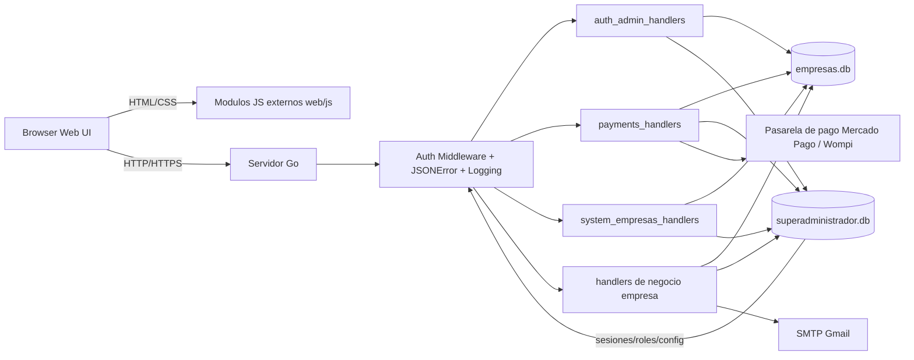

# Diagrama de arquitectura del sistema

Fecha: 2026-04-01

Componentes:
- Frontend: paginas HTML y scripts externos en `web/` y `web/js/`.
- Backend: servidor Go con handlers segmentados por dominio en `backend/handlers/`.
- Persistencia: SQLite separada por contexto global y empresarial.
- Integraciones: SMTP para validacion de correo y pasarelas para pagos.
