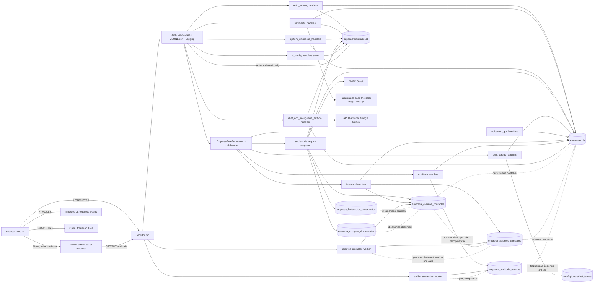

# Diagrama de arquitectura del sistema

Fecha: 2026-04-04

Componentes:
- Frontend: paginas HTML y scripts externos en `web/` y `web/js/`.
- Backend: servidor Go con handlers segmentados por dominio en `backend/handlers/`.
- Persistencia: SQLite separada por contexto global y empresarial.
- Colaboracion interna: modulo `chat_y_tareas` con adjuntos en `web/uploads/chat_tareas/` y metadatos en `empresas.db`.
- Geolocalizacion empresarial: modulo `ubicacion_gps` con mapa OpenStreetMap y almacenamiento de recorridos por `empresa_id`.
- Finanzas empresariales: modulo `finanzas` con configuracion por empresa, gestion de periodos contables (abrir/cerrar), retenciones y registro de ingresos/egresos con comprobantes.
- Contabilidad integrada: procesamiento por lotes de `empresa_eventos_contables` hacia `empresa_asientos_contables` con control de idempotencia por hash y trazabilidad de intentos/errores.
- Contabilidad automatizada: worker periodico de asientos con politica configurable por entorno (`ASIENTOS_WORKER_INTERVAL_MINUTES`, `ASIENTOS_WORKER_BATCH_SIZE`, `ASIENTOS_WORKER_MAX_RETRIES`).
- Conciliacion contable por periodo: el modulo `finanzas` consulta eventos y asientos por periodo con endpoint `action=conciliacion_periodo` y vista operativa en `web/administrar_empresa/finanzas.html`.
- Exportacion unificada de tablero: `GET /api/empresa/finanzas/movimientos?action=tablero_export&format=csv|json` entrega descargas por rango con bloques operativos/financieros/contables, `estado_resultados` y `balance_general` para consumo directivo.
- Auditoria empresarial: registro no bloqueante de acciones criticas (`C/U/D/A`) desde middleware de permisos hacia `empresa_auditoria_eventos`, con consulta filtrable por empresa.
- Auditoria empresarial UI: pagina `web/administrar_empresa/auditoria.html` para filtros de consulta y ejecucion de retencion manual.
- Retencion automatica de auditoria: worker periodico en backend que elimina eventos expirados por `fecha_expiracion` (con fallback por `retencion_dias`).
- Chat IA empresarial: modulo `chat_con_inteligencia_artificial` con alcance por `empresa_id`, limites free-tier, auditoria de consultas/respuestas y persistencia de `modelo_preferido` por cuenta Google (`empresa_id + admin_email`), usando Google Gemini.
- Configuracion IA super: endpoint administrativo para credencial Gemini con almacenamiento seguro en `superadministrador.db`.
- Seguridad por rol/empresa: middleware de permisos empresariales para rutas criticas de ventas, inventario, finanzas, clientes, compras/proveedores, facturacion y seguridad/usuarios; incluye cobertura en `chat_tareas`, `ubicacion_gps` y `productos/imagen`.
- Ventas/carritos: el dominio `carritos_compras` expone `estado_venta` derivado (`venta_abierta`, `venta_cerrada`, `venta_pagada`, `venta_suspendida`) para estandarizar ciclo de vida comercial en API y reportes.
- Ventas/carritos: el handler aplica validacion de transiciones y devuelve `409` en cambios de estado no permitidos y `404` cuando el carrito objetivo no existe.
- Eventos contables: el backend registra eventos por modulo en `empresa_eventos_contables` como base para asientos automaticos y trazabilidad financiera.
- Eventos contables (extension 2026-04-04): se emiten eventos desde ventas, facturacion, compras/proveedores y finanzas (movimientos + periodos) usando helper comun no bloqueante en handlers.
- Eventos contables (transaccional 2026-04-04): facturacion y compras exponen acciones `emitir/anular/nota_credito` y `emitir_orden/recepcionar_compra/contabilizar_compra` para trazar ciclo documental inicial.
- Ciclo documental transaccional (2026-04-04): facturacion y compras validan `estado_actual` con reglas de transicion y devuelven `409` en transiciones invalidas; en transiciones validas exponen `estado_anterior` y `estado_nuevo`.
- Persistencia canonica documental (2026-04-04): los ciclos transaccionales de facturacion/compras guardan estado en tablas dedicadas y enlazan `empresa_eventos_contables.entidad_id` al ID estable de `empresa_facturacion_documentos` / `empresa_compras_documentos`.
- Integraciones: SMTP para validacion de correo y pasarelas para pagos.
