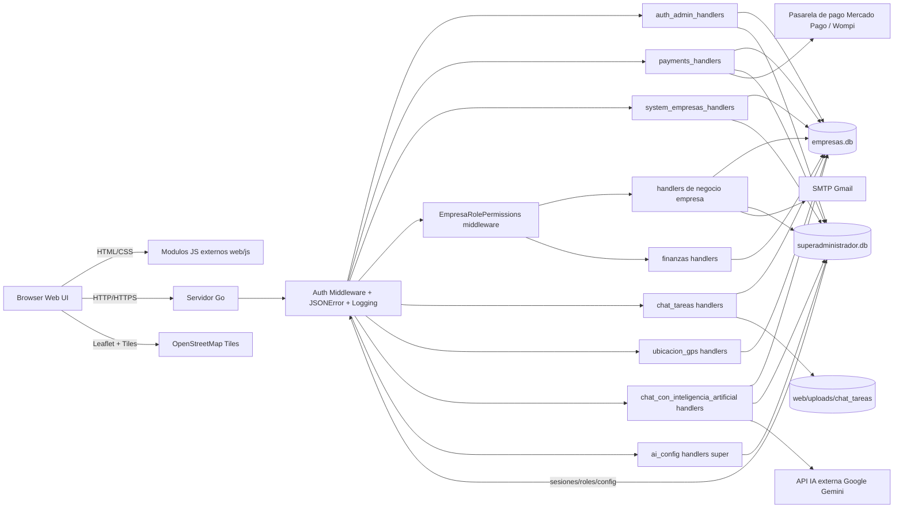

# Diagrama de arquitectura del sistema

Fecha: 2026-04-04

Componentes:
- Frontend: paginas HTML y scripts externos en `web/` y `web/js/`.
- Backend: servidor Go con handlers segmentados por dominio en `backend/handlers/`.
- Persistencia: SQLite separada por contexto global y empresarial.
- Colaboracion interna: modulo `chat_y_tareas` con adjuntos en `web/uploads/chat_tareas/` y metadatos en `empresas.db`.
- Geolocalizacion empresarial: modulo `ubicacion_gps` con mapa OpenStreetMap y almacenamiento de recorridos por `empresa_id`.
- Finanzas empresariales: modulo `finanzas` con configuracion por empresa, gestion de periodos contables (abrir/cerrar), retenciones y registro de ingresos/egresos con comprobantes.
- Chat IA empresarial: modulo `chat_con_inteligencia_artificial` con alcance por `empresa_id`, limites free-tier, auditoria de consultas/respuestas y persistencia de `modelo_preferido` por cuenta Google (`empresa_id + admin_email`), usando Google Gemini.
- Configuracion IA super: endpoint administrativo para credencial Gemini con almacenamiento seguro en `superadministrador.db`.
- Seguridad por rol/empresa: middleware de permisos empresariales para rutas criticas de ventas, inventario y finanzas antes de ejecutar handlers de negocio.
- Integraciones: SMTP para validacion de correo y pasarelas para pagos.
