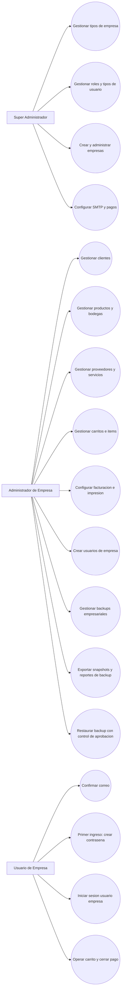

# Diagrama de casos de uso

Fecha: 2026-04-07

Notas:
- El usuario de empresa queda habilitado solo despues de confirmar correo y crear contrasena.
- El administrador de empresa gestiona operacion comercial y configuraciones por empresa.
- La restauracion de backup es una operacion sensible y se audita con control de permisos de aprobacion.
