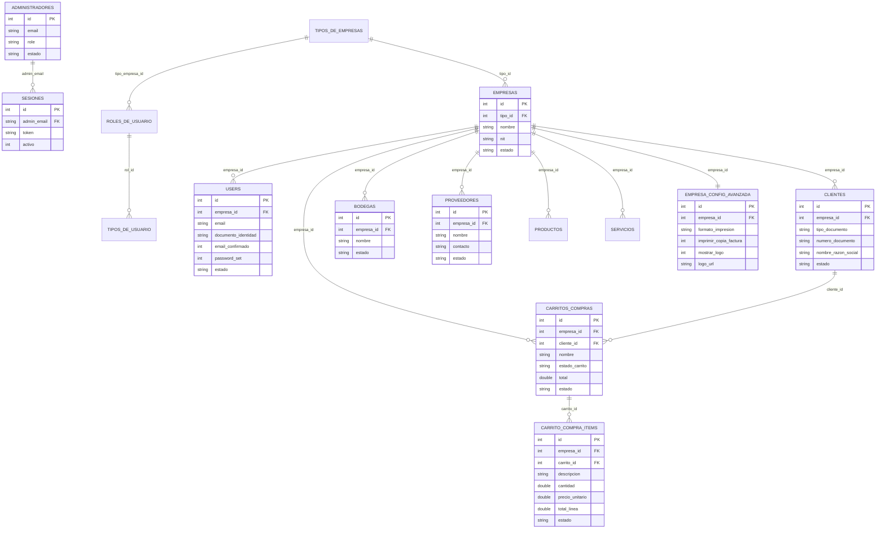

# Diagrama entidad-relacion

Fecha: 2026-04-01

Notas:
- Este diagrama resume las entidades principales del flujo multiempresa.
- Para cambios de esquema, actualizar este documento junto con `descripcion_de_las_bases_De_datos`.
