# Diagrama entidad-relacion

Fecha: 2026-04-05

```mermaid
erDiagram
    ADMINISTRADORES ||--o{ SESIONES : "admin_email"
    TIPOS_DE_EMPRESAS ||--o{ ROLES_DE_USUARIO : "tipo_empresa_id"
    ROLES_DE_USUARIO ||--o{ TIPOS_DE_USUARIO : "rol_id"
    TIPOS_DE_EMPRESAS ||--o{ EMPRESAS : "tipo_id"

    EMPRESAS ||--o{ USERS : "empresa_id"
    EMPRESAS ||--o{ CLIENTES : "empresa_id"
    EMPRESAS ||--o{ BODEGAS : "empresa_id"
    EMPRESAS ||--o{ CATEGORIAS_PRODUCTOS : "empresa_id"
    EMPRESAS ||--o{ PROVEEDORES : "empresa_id"
    EMPRESAS ||--o{ PRODUCTOS : "empresa_id"
    EMPRESAS ||--o{ SERVICIOS : "empresa_id"
    EMPRESAS ||--o{ CARRITOS_COMPRAS : "empresa_id"
    EMPRESAS ||--o{ EMPRESA_TARIFAS_POR_DIA : "empresa_id"
    EMPRESAS ||--|| EMPRESA_COMISIONES_SERVICIO_CONFIGURACION : "empresa_id"
    EMPRESAS ||--o{ EMPRESA_COMISIONES_SERVICIO_MOVIMIENTOS : "empresa_id"
    EMPRESAS ||--|| EMPRESA_CONFIGURACION_OPERATIVA : "empresa_id"
    EMPRESAS ||--o{ EMPRESA_CONFIGURACION_OPERATIVA_ROLES : "empresa_id"
    EMPRESAS ||--o{ EMPRESA_FINANZAS_MOVIMIENTOS : "empresa_id"
    EMPRESAS ||--o{ EMPRESA_FINANZAS_PERIODOS : "empresa_id"
    EMPRESAS ||--|| EMPRESA_FINANZAS_CONFIGURACION : "empresa_id"
    EMPRESAS ||--o{ EMPRESA_CIERRES_CAJA : "empresa_id"
    EMPRESAS ||--o{ EMPRESA_FACTURACION_DOCUMENTOS : "empresa_id"
    EMPRESAS ||--o{ EMPRESA_COMPRAS_DOCUMENTOS : "empresa_id"
    EMPRESAS ||--o{ EMPRESA_EVENTOS_CONTABLES : "empresa_id"
    EMPRESAS ||--o{ EMPRESA_ASIENTOS_CONTABLES : "empresa_id"
    EMPRESAS ||--o{ EMPRESA_AUDITORIA_EVENTOS : "empresa_id"
    EMPRESAS ||--o{ EMPRESA_AI_CONSULTAS : "empresa_id"
    EMPRESAS ||--o{ EMPRESA_AI_USO_DIARIO : "empresa_id"
    EMPRESAS ||--o{ EMPRESA_AI_MODELO_PREFERIDO : "empresa_id"
    EMPRESAS ||--|| EMPRESA_CONFIG_AVANZADA : "empresa_id"
    EMPRESAS ||--o{ FACTURACION_ELECTRONICA_PAIS : "empresa_id"
    EMPRESAS ||--o{ CHAT_TAREAS_CONVERSACIONES : "empresa_id"
    EMPRESAS ||--o{ CHAT_TAREAS : "empresa_id"
    EMPRESAS ||--o{ EMPRESA_GPS_DISPOSITIVOS : "empresa_id"
    EMPRESAS ||--o{ EMPRESA_GPS_RECORRIDOS : "empresa_id"

    CLIENTES ||--o{ CARRITOS_COMPRAS : "cliente_id"
    PROVEEDORES ||--o{ EMPRESA_COMPRAS_DOCUMENTOS : "proveedor_id"
    CARRITOS_COMPRAS ||--o{ CARRITO_COMPRA_ITEMS : "carrito_id"
    CARRITOS_COMPRAS ||--o{ EMPRESA_COMISIONES_SERVICIO_MOVIMIENTOS : "carrito_id"
    CARRITO_COMPRA_ITEMS ||--o{ EMPRESA_COMISIONES_SERVICIO_MOVIMIENTOS : "carrito_item_id"
    SERVICIOS ||--o{ EMPRESA_COMISIONES_SERVICIO_MOVIMIENTOS : "servicio_id"
    CATEGORIAS_PRODUCTOS ||--o{ PRODUCTOS : "categoria_id"
    EMPRESA_EVENTOS_CONTABLES ||--o{ EMPRESA_ASIENTOS_CONTABLES : "evento_contable_id"
    CHAT_TAREAS_CONVERSACIONES ||--o{ CHAT_TAREAS_PARTICIPANTES : "conversacion_id"
    CHAT_TAREAS_CONVERSACIONES ||--o{ CHAT_TAREAS_MENSAJES : "conversacion_id"
    CHAT_TAREAS_CONVERSACIONES ||--o{ CHAT_TAREAS : "conversacion_id"
    CHAT_TAREAS_MENSAJES ||--o{ CHAT_TAREAS_ADJUNTOS : "mensaje_id"
    EMPRESA_GPS_DISPOSITIVOS ||--o{ EMPRESA_GPS_RECORRIDOS : "dispositivo_id"

    ADMINISTRADORES {
      int id PK
      string email
      string role
      string estado
    }
    SESIONES {
      int id PK
      string admin_email FK
      string token
      int activo
    }
    EMPRESAS {
      int id PK
      int tipo_id FK
      string nombre
      string nit
      string estado
    }
    USERS {
      int id PK
      int empresa_id FK
      string email
      string documento_identidad
      int email_confirmado
      int password_set
      string estado
    }
    CLIENTES {
      int id PK
      int empresa_id FK
      string tipo_documento
      string numero_documento
      string nombre_razon_social
      string estado
    }
    BODEGAS {
      int id PK
      int empresa_id FK
      string nombre
      string estado
    }
    CATEGORIAS_PRODUCTOS {
      int id PK
      int empresa_id FK
      string codigo
      string nombre
      string color_hex
      int orden
      string estado
    }
    PROVEEDORES {
      int id PK
      int empresa_id FK
      string nombre
      string contacto
      string estado
    }
    PRODUCTOS {
      int id PK
      int empresa_id FK
      int categoria_id FK
      string sku
      string codigo_barras
      string nombre
      string categoria
      string estado
    }
    CARRITOS_COMPRAS {
      int id PK
      int empresa_id FK
      int cliente_id FK
      string nombre
      string estado_carrito
      double total
      string estado
    }
    CARRITO_COMPRA_ITEMS {
      int id PK
      int empresa_id FK
      int carrito_id FK
      string descripcion
      double cantidad
      double precio_unitario
      double total_linea
      string estado
    }
    EMPRESA_TARIFAS_POR_DIA {
      int id PK
      int empresa_id FK
      int estacion_id
      string estacion_codigo
      string estacion_nombre
      string servicio_nombre
      double valor_dia
      string hora_check_in
      string hora_check_out
      string moneda
      int prioridad
      int aplicar_automaticamente
      string estado
    }
    EMPRESA_COMISIONES_SERVICIO_CONFIGURACION {
      int id PK
      int empresa_id FK
      int habilitar_comisiones
      double porcentaje_comision
      string filtro_servicio
      int aplicar_automaticamente
      string estado
    }
    EMPRESA_COMISIONES_SERVICIO_MOVIMIENTOS {
      int id PK
      int empresa_id FK
      int carrito_id FK
      int carrito_item_id FK
      int servicio_id FK
      string servicio_codigo
      string servicio_nombre
      string servicio_categoria
      string usuario_origen
      string usuario_lavador
      double base_servicio
      double porcentaje_comision
      double monto_comision
      string fecha_movimiento
      string estado
    }
    EMPRESA_CONFIGURACION_OPERATIVA {
      int id PK
      int empresa_id FK
      int metodo_pago_efectivo
      int metodo_pago_tarjeta_credito
      int metodo_pago_tarjeta_debito
      int metodo_pago_transferencia_bancaria
      int metodo_pago_mixto
      int metodo_pago_codigo_descuento
      int habilitar_propinas
      int habilitar_comisiones
      string estado
    }
    EMPRESA_CONFIGURACION_OPERATIVA_ROLES {
      int id PK
      int empresa_id FK
      string rol
      int metodo_pago_efectivo
      int metodo_pago_tarjeta_credito
      int metodo_pago_tarjeta_debito
      int metodo_pago_transferencia_bancaria
      int metodo_pago_mixto
      int metodo_pago_codigo_descuento
      int habilitar_propinas
      int habilitar_comisiones
      string estado
    }
    EMPRESA_FINANZAS_MOVIMIENTOS {
      int id PK
      int empresa_id FK
      string tipo_movimiento
      string codigo
      string periodo_contable
      string categoria
      string concepto
      double total_retenciones
      double total
      double total_neto
      string numero_comprobante
      string estado
    }
    EMPRESA_FINANZAS_PERIODOS {
      int id PK
      int empresa_id FK
      string periodo
      string fecha_inicio
      string fecha_fin
      string estado
      string fecha_cierre
      string cerrado_por
    }
    EMPRESA_FINANZAS_CONFIGURACION {
      int id PK
      int empresa_id FK
      int habilitar_ingresos
      int habilitar_egresos
      string moneda
      string prefijo_ingreso
      string prefijo_egreso
      string formato_impresion
      int requiere_aprobacion
      string integracion_contable_destino
      string cuenta_caja_bancos
      string cuenta_ingresos
      string cuenta_iva_generado
      string cuenta_gastos
      string cuenta_iva_descontable
      string cuenta_retenciones_cobrar
      string cuenta_retenciones_pagar
      string cuentas_ingreso_categoria
      string cuentas_egreso_categoria
      string estado
    }
    EMPRESA_CIERRES_CAJA {
      int id PK
      int empresa_id FK
      int sucursal_id
      string caja_codigo
      string turno
      string fecha_operacion
      string estado_cierre
      double apertura_monto
      double ingresos_efectivo
      double egresos_efectivo
      double retiros_efectivo
      double caja_teorica
      double caja_fisica
      double diferencia_caja
      int tiene_incidencia
      string estado
    }
    EMPRESA_FACTURACION_DOCUMENTOS {
      int id PK
      int empresa_id FK
      string tipo_documento
      string documento_codigo
      string estado_documento
      string estado_anterior
      string evento_ultimo
      string periodo_contable
      double monto_total
      string moneda
      int entidad_relacionada_id
      string estado
    }
    EMPRESA_COMPRAS_DOCUMENTOS {
      int id PK
      int empresa_id FK
      int proveedor_id FK
      string tipo_documento
      string documento_codigo
      string estado_documento
      string estado_anterior
      string evento_ultimo
      string periodo_contable
      double monto_total
      string moneda
      int entidad_relacionada_id
      string estado
    }
    EMPRESA_EVENTOS_CONTABLES {
      int id PK
      int empresa_id FK
      string modulo
      string evento
      string entidad
      int entidad_id
      string documento_tipo
      string documento_codigo
      string periodo_contable
      double monto_total
      string moneda
      int procesado
      int intentos_procesamiento
      int asiento_contable_id
      string fecha_evento
      string estado
    }
    EMPRESA_ASIENTOS_CONTABLES {
      int id PK
      int empresa_id FK
      int evento_contable_id FK
      string modulo
      string evento
      string periodo_contable
      string documento_codigo
      double total_debito
      double total_credito
      double diferencia
      string hash_idempotencia
      string estado
    }
    EMPRESA_AUDITORIA_EVENTOS {
      int id PK
      int empresa_id FK
      string modulo
      string accion
      string recurso
      int recurso_id
      string metodo_http
      string endpoint
      string resultado
      int codigo_http
      string request_id
      int retencion_dias
      string fecha_evento
      string estado
    }
    EMPRESA_AI_CONSULTAS {
      int id PK
      int empresa_id FK
      string provider
      string model_id
      string pregunta
      double total_tokens
      string plan_actual
      string fecha_consulta
      string estado
    }
    EMPRESA_AI_USO_DIARIO {
      int id PK
      int empresa_id FK
      string provider
      string model_id
      string fecha_uso
      int consultas_total
      double tokens_total
      string plan_actual
      string estado
    }
    EMPRESA_AI_MODELO_PREFERIDO {
      int id PK
      int empresa_id FK
      string admin_email
      string provider
      string model_id
      string estado
    }
    EMPRESA_CONFIG_AVANZADA {
      int id PK
      int empresa_id FK
      string formato_impresion
      int imprimir_copia_factura
      int mostrar_logo
      string logo_url
      string color_carrito_activo
      string color_carrito_inactivo
    }
    FACTURACION_ELECTRONICA_PAIS {
      int id PK
      int empresa_id FK
      string pais_codigo
      string pais_nombre
      string moneda_codigo
      string proveedor
      string ambiente
      string identificador_fiscal
      string prefijo_factura
      string estado
    }
    CHAT_TAREAS_CONVERSACIONES {
      int id PK
      int empresa_id FK
      string titulo
      string prioridad
      string estado_conversacion
      string estado
    }
    CHAT_TAREAS_PARTICIPANTES {
      int id PK
      int empresa_id FK
      int conversacion_id FK
      string participante_tipo
      int participante_ref_id
      string email
      string estado
    }
    CHAT_TAREAS_MENSAJES {
      int id PK
      int empresa_id FK
      int conversacion_id FK
      string autor_tipo
      string autor_email
      string tipo_mensaje
      string estado
    }
    CHAT_TAREAS_ADJUNTOS {
      int id PK
      int empresa_id FK
      int mensaje_id FK
      string tipo_archivo
      string file_url
      string estado
    }
    CHAT_TAREAS {
      int id PK
      int empresa_id FK
      int conversacion_id FK
      string titulo
      string estado_tarea
      int porcentaje_avance
      string estado
    }
    EMPRESA_GPS_DISPOSITIVOS {
      int id PK
      int empresa_id FK
      string codigo
      string nombre
      string estado
      string ultimo_reporte_en
    }
    EMPRESA_GPS_RECORRIDOS {
      int id PK
      int empresa_id FK
      int dispositivo_id FK
      float latitud
      float longitud
      float precision_metros
      float velocidad_kmh
      string capturado_en
      string estado
    }
```

Notas:
- Este diagrama resume las entidades principales del flujo multiempresa.
- Para cambios de esquema, actualizar este documento junto con `descripcion_de_las_bases_De_datos`.
