# Diagrama Entidad Relacion

Actualizacion: 2026-05-13

Este DER resume el nucleo relacional vigente del proyecto.
No reemplaza el detalle fisico de [estructura_bd.md](/D:/powerfulcontrolsystem/documentos/estructura_bd.md), pero si fija una vista canonica y visual de las relaciones principales entre `pcs_empresas` y `pcs_superadministrador`.

## Alcance

- `pcs_empresas`: empresa, usuarios, clientes, catalogo, ventas, finanzas, facturacion, CRM y backups.
- `pcs_superadministrador`: tipos de empresa, roles, licencias, administradores, soporte SaaS y correos masivos.
- Se priorizan relaciones estructurales y de negocio mas importantes; las relaciones logicas secundarias permanecen documentadas en `documentos/estructura_bd.md`.

## DER canonico

```mermaid
erDiagram
    EMPRESAS {
        bigint id PK
        string nombre
        string slug
        string estado
    }

    USERS {
        bigint id PK
        bigint empresa_id FK
        bigint rol_usuario_id FK
        string email
        string documento_identidad
        string role
    }

    CLIENTES {
        bigint id PK
        bigint empresa_id FK
        string numero_documento
        string nombre
        string email
    }

    CATEGORIAS_PRODUCTOS {
        bigint id PK
        bigint empresa_id FK
        string codigo
        string nombre
    }

    PRODUCTOS {
        bigint id PK
        bigint empresa_id FK
        bigint categoria_id FK
        bigint bodega_principal_id FK
        string sku
        string nombre
    }

    SERVICIOS {
        bigint id PK
        bigint empresa_id FK
        string codigo
        string nombre
        string categoria
    }

    CARRITOS_COMPRAS {
        bigint id PK
        bigint empresa_id FK
        bigint cliente_id FK
        string codigo
        string canal_venta
        string estado
    }

    CARRITO_COMPRA_ITEMS {
        bigint id PK
        bigint empresa_id FK
        bigint carrito_id FK
        string tipo_item
        bigint referencia_id
        string descripcion
    }

    EMPRESA_FINANZAS_MOVIMIENTOS {
        bigint id PK
        bigint empresa_id FK
        bigint cierre_caja_id FK
        string tipo
        decimal total
        string documento_codigo
    }

    EMPRESA_FACTURACION_DOCUMENTOS {
        bigint id PK
        bigint empresa_id FK
        string tipo_documento
        string documento_codigo
        string estado_dian
    }

    CRM_LEADS {
        bigint id PK
        bigint empresa_id FK
        string codigo
        string nombre
        string email
    }

    CRM_INTERACCIONES {
        bigint id PK
        bigint empresa_id FK
        bigint lead_id FK
        bigint cliente_id FK
        string tipo_interaccion
    }

    EMPRESA_BACKUPS {
        bigint id PK
        bigint empresa_id FK
        string codigo
        string nombre
    }

    EMPRESA_BACKUPS_RESTAURACIONES {
        bigint id PK
        bigint empresa_id FK
        bigint backup_id FK
        string codigo_backup
    }

    TIPOS_DE_EMPRESAS {
        bigint id PK
        string nombre
        string estado
    }

    ROLES_DE_USUARIO {
        bigint id PK
        bigint tipo_empresa_id FK
        string nombre
    }

    ROLES_DE_USUARIO_PERMISOS {
        bigint id PK
        bigint rol_id FK
        string modulo
        string accion
    }

    ROLES_DE_USUARIO_PAGINAS_PERMISOS {
        bigint id PK
        bigint rol_id FK
        string pagina
        string permiso
    }

    LICENCIAS {
        bigint id PK
        bigint empresa_id FK
        bigint tipo_id FK
        string nombre
        int max_cajas_simultaneas
        string estado
    }

    TIPO_EMPRESA_PRECONFIGURACIONES {
        bigint id PK
        bigint tipo_empresa_id FK
        string nombre
        string enabled
    }

    ADMINISTRADORES {
        bigint id PK
        string email
        string role
        string estado
    }

    CONFIGURACIONES {
        bigint id PK
        string config_key
        string config_value
    }

    SUPER_TICKETS_AYUDA {
        bigint id PK
        bigint empresa_id FK
        string codigo
        string categoria
        string prioridad
        string estado
    }

    SUPER_TICKET_AYUDA_MENSAJES {
        bigint id PK
        bigint ticket_id FK
        string autor_tipo
        string mensaje
        bool interno
    }

    SUPER_CORREOS_MASIVOS {
        bigint id PK
        string categoria
        string asunto
        string estado
    }

    SUPER_CORREOS_MASIVOS_DESTINATARIOS {
        bigint id PK
        bigint correo_masivo_id FK
        bigint empresa_id FK
        string destinatario_email
        string estado_envio
    }

    EMPRESAS ||--o{ USERS : empresa_id
    EMPRESAS ||--o{ CLIENTES : empresa_id
    EMPRESAS ||--o{ CATEGORIAS_PRODUCTOS : empresa_id
    EMPRESAS ||--o{ PRODUCTOS : empresa_id
    EMPRESAS ||--o{ SERVICIOS : empresa_id
    EMPRESAS ||--o{ CARRITOS_COMPRAS : empresa_id
    EMPRESAS ||--o{ EMPRESA_FINANZAS_MOVIMIENTOS : empresa_id
    EMPRESAS ||--o{ EMPRESA_FACTURACION_DOCUMENTOS : empresa_id
    EMPRESAS ||--o{ CRM_LEADS : empresa_id
    EMPRESAS ||--o{ CRM_INTERACCIONES : empresa_id
    EMPRESAS ||--o{ EMPRESA_BACKUPS : empresa_id
    EMPRESAS ||--o{ LICENCIAS : empresa_id
    EMPRESAS ||--o{ SUPER_TICKETS_AYUDA : empresa_id
    EMPRESAS ||--o{ SUPER_CORREOS_MASIVOS_DESTINATARIOS : empresa_id

    ROLES_DE_USUARIO ||--o{ USERS : rol_usuario_id
    CATEGORIAS_PRODUCTOS ||--o{ PRODUCTOS : categoria_id
    CLIENTES ||--o{ CARRITOS_COMPRAS : cliente_id
    CARRITOS_COMPRAS ||--o{ CARRITO_COMPRA_ITEMS : carrito_id
    CLIENTES ||--o{ CRM_INTERACCIONES : cliente_id
    CRM_LEADS ||--o{ CRM_INTERACCIONES : lead_id
    EMPRESA_BACKUPS ||--o{ EMPRESA_BACKUPS_RESTAURACIONES : backup_id

    TIPOS_DE_EMPRESAS ||--o{ ROLES_DE_USUARIO : tipo_empresa_id
    TIPOS_DE_EMPRESAS ||--o{ TIPO_EMPRESA_PRECONFIGURACIONES : tipo_empresa_id
    ROLES_DE_USUARIO ||--o{ ROLES_DE_USUARIO_PERMISOS : rol_id
    ROLES_DE_USUARIO ||--o{ ROLES_DE_USUARIO_PAGINAS_PERMISOS : rol_id

    LICENCIAS }o--|| TIPOS_DE_EMPRESAS : tipo_id
    SUPER_TICKETS_AYUDA ||--o{ SUPER_TICKET_AYUDA_MENSAJES : ticket_id
    SUPER_CORREOS_MASIVOS ||--o{ SUPER_CORREOS_MASIVOS_DESTINATARIOS : correo_masivo_id
```

## Notas de lectura

- `empresas` es la raiz multiempresa del nucleo operativo.
- `users`, `clientes`, `productos`, `servicios`, `carritos_compras` y `empresa_finanzas_movimientos` representan el circuito central de operacion.
- `licencias` vive en `pcs_superadministrador`, pero se relaciona con `empresas.id` para gobernar capacidades efectivas por compania.
- `super_tickets_ayuda` y `super_correos_masivos_destinatarios` tambien enlazan con `empresa_id`, porque forman parte de la operacion SaaS transversal.
- Las verticales empresariales reutilizan este nucleo y agregan tablas especializadas documentadas en `documentos/estructura_bd.md`.
