# Diagrama de flujo de procesos

Fecha: 2026-04-05

```mermaid
flowchart TD
    A[Administrador crea usuario de empresa] --> B[Generar token de confirmacion]
    B --> C[Enviar correo SMTP]
    C -->|Falla| D[Rollback: usuario no se registra]
    C -->|Exito| E[Usuario abre enlace de confirmacion]
    E --> F[Correo confirmado: estado activo]
    F --> G[Usuario abre login_usuario]
    G --> H{Tiene contrasena?}
    H -->|No| I[Crear contrasena primer ingreso]
    I --> J[Guardar hash/salt]
    H -->|Si| K[Autenticacion email+password]
    J --> K
    K --> L[Sesion iniciada]

    SA0[Super administrador abre configuracion avanzada] --> SA1[Gestionar credencial IA de Google Gemini]
    SA1 --> SA2[Guardar en endpoint super de configuracion IA]
    SA2 --> SA3[Registrar cuenta Google autenticada que actualiza credenciales]
    SA3 --> AI1

    L --> L0[Abrir administrar_empresa]
    L0 --> AUTHZ[Middleware permisos valida rol y empresa_id por modulo]
    L0 --> L1[Cargar Inicio por defecto en Panel de la Empresa]
    L1 --> L1A[Abrir Centro de Ayuda]
    L1A --> L1B[Consultar menu interno y APIs operativas]
    L1 --> L11[Usuario navega a una subpagina del panel]
    L11 --> L12[Guardar subpagina actual en sessionStorage]
    L12 --> L13[Al presionar F5, restaurar la misma subpagina]

    L --> S0[Configurar colores de estado del carrito en Configuración de empresa]
    S0 --> S1[Guardar color activo/inactivo en configuración avanzada]
    S1 --> S2[Sincronizar estaciones con carritos en estado inactivo/cerrado]
    S2 --> S3[Abrir módulo estaciones]
    S3 --> S3A[Opcional: usar boton Inactivar carritos de estaciones]
    S3A --> S3B[Aplicar desactivar + cerrar en carritos EST-empresa-*]
    S3B --> S4[Tarjetas inician inactivas]
    S3 --> S4[Tarjetas inician inactivas]
    S4 --> S5[Usuario selecciona estación]
    S5 --> S6[Activar carrito de estación y registrar activado_en]
    S6 --> S7[Tarjeta activa muestra color configurado y fecha/hora de entrada]
    S7 --> S8[Finalizar compra en carrito de estación]
    S8 --> S9[Marcar carrito inactivo/cerrado]
    S9 --> S10[Tarjeta vuelve a estado inactivo y oculta fecha/hora]

    AUTHZ --> M
    AUTHZ --> N
    AUTHZ --> F0
    AUTHZ --> T
    AUTHZ --> G0
    AUTHZ --> Z
    AUTHZ --> AU0[Ejecutar accion critica autorizada]
    AU0 --> AU1[Registrar auditoria no bloqueante]
    AU1 --> AU2[Persistir empresa_auditoria_eventos]
    AU2 --> AU3[Consultar auditoria en panel empresa]
    AU3 --> AU31[Aplicar filtros avanzados por codigo_http y recurso_id]
    AU31 --> AU32[Exportar trazabilidad filtrada en CSV y JSON]
    AU3 --> AU4[Aplicar retencion manual por dias]
    AU2 --> AU5[Worker programado de retencion]
    AU5 --> AU6[Purgar eventos expirados por fecha_expiracion]

    L --> M[Crear cliente de venta]
    L --> N[Crear bodega y proveedor]
    L --> CM0[Entrar al modulo compras dedicado]
    CM0 --> CM1[Registrar documento en /api/empresa/compras/documentos]
    CM1 --> CP0
    N --> CP0[Ejecutar accion compras emitir_orden/recepcionar/contabilizar]
    CP0 --> CP1{Transicion valida segun estado_actual?}
    CP1 -->|No| CP2[Responder 409 y no registrar evento]
    CP1 -->|Si| CP3[Persistir documento canonico de compra]
    CP3 --> CP4[Registrar evento con entidad_id canonico]
    L --> N0[Administrar categorias de productos por empresa]
    N0 --> N1[Crear/editar/activar categorias]
    N1 --> N2[Asignar categoria al producto desde selector]
    N2 --> O
    M --> O[Crear carrito]
    N --> O
    O --> P[Agregar items al carrito]
    O --> O1[Configurar lector de barras por empresa]
    O1 --> P0[Escanear codigo de barras o SKU]
    P0 --> P
    P --> P1[Descontar inventario por item producto agregado]
    P1 --> Q[Calcular totales]
    Q --> R[Pagar carrito]
    R --> R1[Conservar descuento de inventario al cerrar venta]
    R1 --> S[Cerrar carrito y guardar resumen de pago]
    S --> S11[Registrar evento contable de venta]
    S11 --> RP0[Entrar al modulo reportes]
    RP0 --> RF0[Consultar tablero financiero-operativo action=tablero]
    RF0 --> RF1[Renderizar KPI operativos financieros y contables]
    RF1 --> RF2[Renderizar estado de resultados y balance general]
    RF2 --> RF3[Exportar tablero unificado CSV JSON por rango]
    RP0 --> RPD0[Consultar catalogo de datasets action=catalogo]
    RPD0 --> RPD1[Seleccionar dataset empresarial operativo o contable]
    RPD1 --> RPD2[Cargar dataset action=dataset]
    RPD2 --> RPD3[Renderizar tabla profesional y resumen del dataset]
    RPD3 --> RPD4[Exportar dataset JSON CSV TXT XLS]
    RPD3 --> RPD5[Exportar suite completa action=export format=json]
    RP0 --> RP1[Filtrar ventas cerradas por rango de fechas]
    RP1 --> RP2[Calcular KPIs: ventas, ingresos y ticket promedio]
    RP2 --> RP3[Construir reporte de ventas por fecha]
    RP3 --> RP31[Construir reporte de productos por fecha]
    RP31 --> RP32[Construir reporte de compras de productos por fecha]
    RP32 --> RP33[Consultar inventario actual por bodega y KPI bajo minimo]
    RP33 --> RP4[Consultar configuracion de impresion vigente]
    RP4 --> RP5[Visualizar vista previa de formato POS/Carta]

    L --> F0[Entrar al modulo finanzas]
    F0 --> F1[Consultar configuracion financiera por empresa]
    F1 --> F2[Definir categorias, prefijos, formato y plan de cuentas contable]
    F2 --> F21[Configurar destino externo: generico, SIIGO, World Office o Alegra]
    F21 --> F22[Gestionar periodo contable: abierto/cerrado]
    F22 --> C0[Gestionar cierre de caja por sucursal y caja]
    C0 --> C1[Abrir caja con base inicial de efectivo]
    C1 --> C2[Registrar ingresos, egresos y retiros del turno]
    C2 --> C3[Calcular caja teorica]
    C3 --> C4[Capturar arqueo de caja fisica]
    C4 --> C5{Diferencia supera umbral?}
    C5 -->|Si| C6[Marcar incidencia para revision]
    C5 -->|No| C7[Cerrar caja]
    C6 --> C7
    C7 --> C8[Aprobar cierre por rol autorizado]
    F22 --> F3[Registrar ingreso o egreso con comprobante]
    F3 --> F31[Calcular total bruto, retenciones y total neto]
    F31 --> F4[Filtrar movimientos y calcular balance]
    F4 --> FA0[Consultar eventos contables pendientes]
    FA0 --> FA00[Worker automatico por intervalo y politica]
    FA00 --> FA1
    FA0 --> FA1[Ejecutar action=procesar_asientos por lote]
    FA1 --> FA2[Persistir empresa_asientos_contables con hash_idempotencia]
    FA2 --> FA3[Marcar evento procesado o error con intentos]
    FA3 --> FA4[Consultar action=conciliacion_periodo]
    FA4 --> FA5[Comparar eventos procesados vs asientos por periodo]
    FA5 --> FA6[Clasificar estado conciliado o con alertas]
    FA6 --> F41
    F4 --> F41[Navegar pestañas: Todos, Ingresos o Egresos]
    F41 --> F42[Exportar libro filtrado]
    F42 --> F421[Excel CSV y PDF]
    F42 --> F43[Generar asientos con cuentas parametrizadas por empresa y categoria]
    F43 --> F44[Incluir perfil contable y proyeccion ERP en JSON]
    F42 --> F45[Generar plantilla dedicada SIIGO CSV]
    F42 --> F46[Generar balance de prueba CSV]
    F42 --> F47[Generar estado de resultados CSV]
    F42 --> F48[Generar libro diario, libro mayor y balance general CSV]
    F42 --> F5[Imprimir comprobante financiero Carta/POS]

    L --> AI0[Entrar al modulo chat con inteligencia artificial]
    AI0 --> AI1[Cargar Gemini empresarial para la empresa seleccionada]
    AI1 --> AI15[Resolver cuenta Google autenticada y modelo preferido]
    AI15 --> AI16[Registrar preferencia Gemini para la cuenta Google]
    AI16 --> AI2[Validar alcance por empresa_id y limite diario free-tier]
    AI2 --> AI3[Construir contexto empresarial desde la base de datos]
    AI3 --> AI4[Consultar proveedor IA externo Google Gemini]
    AI4 --> AI5[Registrar pregunta/respuesta y acumular uso diario]
    AI5 --> AI6[Mostrar respuesta o sugerir upgrade de plan]

    L --> T[Administrador abre modulo chat_y_tareas]
    T --> U[Crear conversacion por empresa]
    U --> V[Agregar participantes de la empresa]
    V --> W[Intercambiar mensajes y adjuntos foto/voz]
    W --> X[Crear tareas vinculadas a la conversacion]
    X --> Y[Actualizar avance: pendiente/en_progreso/completada]

    L --> G0[Entrar a modulo ubicacion_gps]
    G0 --> G1[Registrar dispositivos GPS por empresa]
    G1 --> G2[Mostrar dispositivos en mapa OpenStreetMap]
    G2 --> G3[Iniciar tracking automatico cada 10 segundos]
    G3 --> G4[Guardar punto en empresa_gps_recorridos]
    G4 --> G5[Actualizar ultima posicion en empresa_gps_dispositivos]
    G5 --> G6[Visualizar recorrido historico por dispositivo]

    L --> Z[Entrar a modulo facturacion electronica]
    Z --> Z1[Detectar pais automaticamente tz/lang/config empresa]
    Z1 --> Z2[Mostrar bandera del pais detectado en menu flotante]
    Z2 --> Z3[Configurar parametros FE por pais CO/PA/EC]
    Z3 --> Z31[Si no existe configuracion FE, prellenar desde configuracion avanzada]
    Z31 --> Z4[Guardar configuracion por empresa y pais]
    Z4 --> Z5[Ejecutar accion transaccional emitir/anular/nota_credito]
    Z5 --> Z6{Transicion valida segun estado_actual?}
    Z6 -->|No| Z7[Responder 409 y no registrar evento]
    Z6 -->|Si| Z8[Persistir documento canonico de facturacion]
    Z8 --> Z9[Registrar evento con entidad_id canonico]
```

Resultado esperado:
- Flujo completo desde onboarding de usuario hasta cierre de venta con carrito pagado.
- Flujo colaborativo interno por empresa para comunicacion operativa y seguimiento de tareas.
- Al abrir el Panel de la Empresa, la subpagina inicial predeterminada es Inicio.
- En `super/licencias_resumen`, el conteo refleja solo licencias activas asignadas a empresa.
- En `seleccionar_empresa`, la seccion de licencias se filtra por empresas creadas por el usuario autenticado.
- El sistema detecta país para facturación electrónica y muestra su bandera en el menú flotante.
- En `estaciones`, los carritos de estación inician inactivos, se activan al seleccionar la estación y vuelven a inactivos al finalizar la compra.
- En `estaciones`, la tarjeta activa muestra fecha y hora de entrada (`activado_en`), y las inactivas no muestran esa marca.
- En `configuracion_de_estaciones`, existe accion manual para forzar inactivacion/cierre masivo de carritos de estaciones.
- En `administrar_empresa`, `super_administrador` y `seleccionar_empresa`, al recargar con F5 se restaura la subpagina/vista que estaba abierta.
- En `administrar_productos`, el catálogo de `categorias_productos` permite filtrar y asignar categorías de forma consistente por `empresa_id`.
- En `ubicacion_gps`, cada dispositivo puede registrar su recorrido automaticamente cada 10 segundos y visualizarse sobre mapa de codigo abierto.
- En `reportes`, el usuario consulta ventas cerradas por rango, indicadores clave y top comerciales, con validacion visual de formato de impresion POS/Carta.
- En `carrito_de_compras`, al agregar items de tipo producto se descuenta inventario y, al cerrar la venta, el descuento se mantiene aplicado.
- En `reportes`, se dispone de reportes profesionales por rango de fechas: ventas, productos y compras de productos.
- En `reportes`, el tablero financiero-operativo puede exportarse en formato unificado `CSV/JSON` por rango, incluyendo `estado_resultados` y `balance_general`.
- En `reportes`, existe un centro profesional de datasets por empresa con selector de nivel (`empresarial`, `operativo`, `contable`) y vista tabular dinamica.
- En `reportes`, los datasets se exportan en `JSON`, `CSV`, `TXT` y `XLS`, y la suite consolidada se exporta en `JSON`.
- En `ayuda`, existe un menu interno con accesos rapidos y una seccion de APIs principales para operacion diaria.
- En `configuracion`, las opciones del lector de barras se gestionan por empresa y aplican al flujo operativo del carrito.
- En `reportes`, se agrega tabla de inventario actual por bodega y KPI de productos bajo minimo.
- En `finanzas`, cada empresa administra ingresos y egresos con configuracion propia, comprobantes y soporte de impresion.
- En `finanzas`, el flujo de caja operativo permite apertura, arqueo, cierre y aprobacion de caja por `sucursal_id` y `caja_codigo`.
- En `finanzas`, la interfaz operativa de cierres de caja permite ejecutar acciones de ciclo desde la tabla (cerrar, reabrir, aprobar, anular), junto con activacion/desactivacion y filtros por estado/rango.
- En `finanzas/cierres_caja`, la validacion UAT por rol confirma autorizacion esperada: `admin_empresa` aprueba, `cajero` y `supervisor_sucursal` no aprueban bajo politica financiera actual.
- En `finanzas`, el libro financiero se consulta por pestañas (`Todos`, `Ingresos`, `Egresos`) y puede exportarse por rango a Excel (CSV), PDF y JSON contable para integración externa.
- En `finanzas/asientos_contables`, la API permite consultar asientos canonicos (`GET`) y ejecutar procesamiento manual por lotes (`POST/PUT action=procesar_asientos`) con `max_reintentos` opcional.
- En backend, un worker automatico procesa eventos contables pendientes por lotes con politica configurable de intervalo, tamaño de lote y limite de reintentos.
- En `finanzas/asientos_contables`, la API expone `GET action=conciliacion_periodo` para comparar por periodo los eventos contables vs asientos canonicos y detectar pendientes, errores y descuadres.
- En `administrar_empresa/finanzas`, existe vista de conciliacion por periodo con filtros de rango/periodo y KPIs de estado de conciliacion.
- En `auditoria/eventos`, la API permite consultar trazabilidad por filtros (`GET`) y aplicar retencion manual (`PUT/POST action=retener|purgar`) por `empresa_id`.
- En `administrar_empresa/auditoria`, la UI permite consultar eventos con filtros de modulo/accion/usuario/request/rango y filtros avanzados por `codigo_http`/`recurso_id`, exportar resultados a CSV/JSON y ejecutar purga manual por dias de retencion.
- En backend, un worker periodico elimina eventos expirados de auditoria usando `fecha_expiracion` (con fallback por `retencion_dias` para registros legacy).
- En `finanzas`, el JSON contable usa cuentas parametrizadas por empresa/categoria e incluye perfil de referencia para ERP destino.
- En `finanzas`, existe plantilla dedicada SIIGO en CSV y exportaciones de `balance de prueba` y `estado de resultados` para trabajo contable/directivo.
- En `finanzas`, los movimientos quedan asociados a `periodo_contable`; al cerrar un periodo se bloquean edición, activación/desactivación y eliminación hasta reabrir.
- En `finanzas`, cada movimiento calcula total bruto, retenciones (`fuente`, `ICA`, `IVA`) y total neto antes de persistir/exportar.
- En `finanzas`, también se exportan `libro diario`, `libro mayor` y `balance general` en CSV.
- En `chat_con_inteligencia_artificial`, el alcance de consultas queda restringido por `empresa_id` y validacion del usuario autenticado.
- En `chat_con_inteligencia_artificial`, el sistema controla limite free-tier diario por `empresa/proveedor/modelo` y muestra opcion de upgrade cuando aplica.
- En `chat_con_inteligencia_artificial`, cada consulta/respuesta queda auditada junto con metrica de tokens para trazabilidad operativa.
- En rutas criticas de `ventas`, `inventario`, `finanzas`, `clientes`, `compras/proveedores`, `facturacion` y `seguridad/usuarios`, el middleware valida rol y alcance de `empresa_id` antes de ejecutar operaciones sensibles.
- En rutas operativas de `chat_tareas`, `ubicacion_gps` y `productos/imagen`, el middleware aplica politicas por modulo para mantener control uniforme de acceso.
- En `carritos_compra`, cada lectura de carrito expone `estado_venta` estandarizado (`venta_abierta`, `venta_cerrada`, `venta_pagada`, `venta_suspendida`) para normalizar decisiones operativas y reportes.
- En acciones de carrito (`activar_estacion`, `pagar_estacion`, `activar/desactivar`, `cerrar/reabrir`), la API responde `estado_venta` para trazabilidad inmediata del ciclo de venta.
- En acciones de ciclo de venta, el backend bloquea transiciones no permitidas (doble pago, reabrir pagada, activar estacion pagada sin `reset_items=1`) con `409`, y usa `404` cuando el carrito no existe.
- En cierre y cambios operativos de venta, se registra un evento contable (`empresa_eventos_contables`) para habilitar integracion contable por modulo.
- En `reportes`, la vista consume `GET /api/empresa/finanzas/movimientos?action=tablero` para mostrar KPI financieros y contables junto a los KPI operativos.
- En `reportes`, el tablero incluye `estado_resultados` y `balance_general` con base en asientos canonicos procesados por periodo.
- En `finanzas`, la accion `procesar_asientos` requiere permiso de aprobacion (`A`) en el middleware de roles.
- En middleware de permisos por empresa, toda accion critica autorizada (`C/U/D/A`) registra auditoria no bloqueante con modulo, accion, recurso, resultado HTTP y metadatos de trazabilidad.
- En acciones criticas de `ventas`, `compras` y `facturacion`, la auditoria automatica conserva metadata de negocio (`carrito_id`, `proveedor_id`, `entidad_id`, `documento_codigo`) para trazabilidad operacional.
- En `facturacion_electronica`, al guardar configuracion FE por pais se registra evento contable de modulo `facturacion` para trazabilidad de parametrizacion fiscal.
- En `facturacion_electronica`, acciones transaccionales (`emitir`, `anular`, `nota_credito`) registran eventos `factura_emitida`, `factura_anulada` y `nota_credito_emitida`.
- En `proveedores`, las operaciones de alta, actualizacion, activacion/desactivacion y eliminacion registran eventos del modulo `compras`.
- En `proveedores`, acciones transaccionales (`emitir_orden`, `recepcionar_compra`, `contabilizar_compra`) registran eventos de orden y ciclo contable de compra.
- En `administrar_empresa/compras`, el modulo dedicado permite crear, consultar y ejecutar ciclo documental de compras sobre `/api/empresa/compras/documentos`.
- En acciones transaccionales de `facturacion_electronica` y `proveedores`, el backend valida `estado_actual` y responde `409` cuando la transicion no corresponde al ciclo documental.
- En transacciones documentales validas, la API devuelve `estado_anterior` y `estado_nuevo`, y los persiste en el payload del evento contable para auditoria.
- En transacciones de facturacion y compras, `empresa_eventos_contables.entidad_id` corresponde al ID canonico persistido en `empresa_facturacion_documentos` o `empresa_compras_documentos`.
- En `finanzas`, el alta de movimientos y el cierre/reapertura de periodos registran eventos contables del modulo `finanzas`.
- La estrategia de asientos contables se define sobre consumo por lotes de eventos pendientes con idempotencia por referencia canonica documental y marcacion de procesamiento por resultado.
- En pruebas de seguridad de endpoints protegidos, se valida extraccion de `empresa_id` desde `multipart/form-data` para `chat_tareas/mensajes/adjunto` y denegacion por rol en `ubicacion_gps/dispositivos`.
- En `super/configuracion_avanzada`, la tarjeta IA permite guardar credenciales de 5 modelos populares y registrar la cuenta Google del administrador que realiza el cambio.
