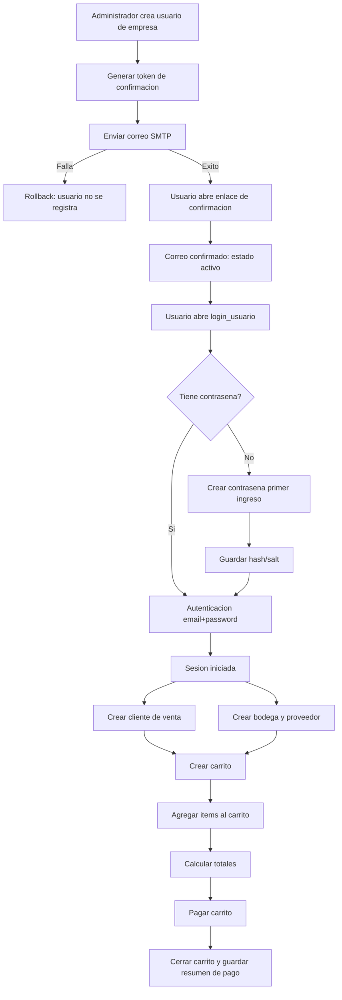

# Diagrama de flujo de procesos

Fecha: 2026-04-01

```mermaid
flowchart TD
    A[Administrador crea usuario de empresa] --> B[Generar token de confirmacion]
    B --> C[Enviar correo SMTP]
    C -->|Falla| D[Rollback: usuario no se registra]
    C -->|Exito| E[Usuario abre enlace de confirmacion]
    E --> F[Correo confirmado: estado activo]
    F --> G[Usuario abre login_usuario]
    G --> H{Tiene contrasena?}
    H -->|No| I[Crear contrasena primer ingreso]
    I --> J[Guardar hash/salt]
    H -->|Si| K[Autenticacion email+password]
    J --> K
    K --> L[Sesion iniciada]

    L --> M[Crear cliente de venta]
    L --> N[Crear bodega y proveedor]
    M --> O[Crear carrito]
    N --> O
    O --> P[Agregar items al carrito]
    P --> Q[Calcular totales]
    Q --> R[Pagar carrito]
    R --> S[Cerrar carrito y guardar resumen de pago]
```

Resultado esperado:
- Flujo completo desde onboarding de usuario hasta cierre de venta con carrito pagado.
