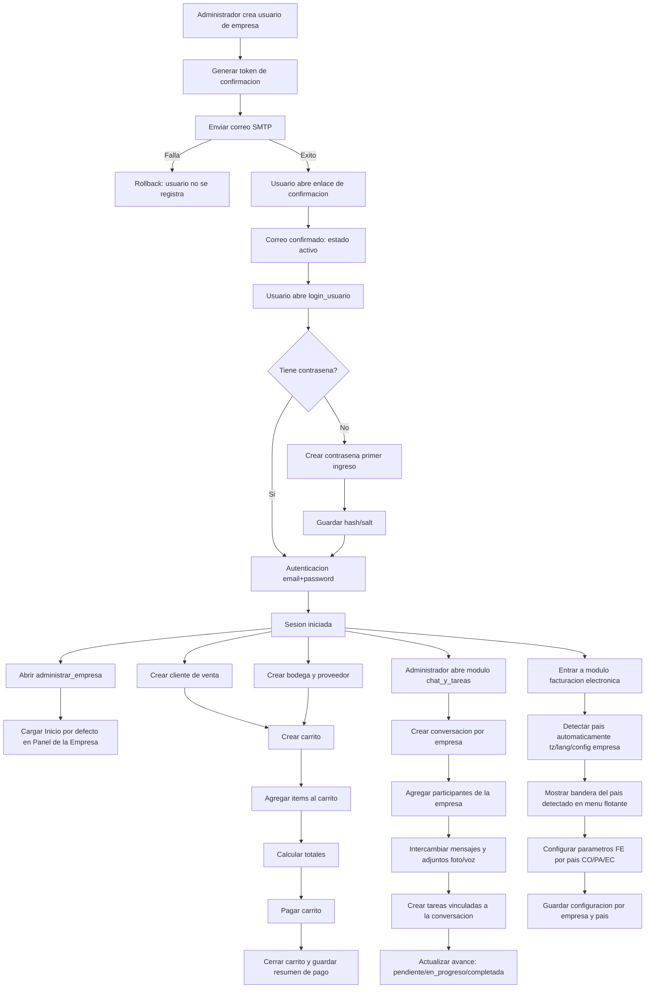

# Diagrama de flujo de procesos

Fecha: 2026-04-01

Resultado esperado:
- Flujo completo desde onboarding de usuario hasta cierre de venta con carrito pagado.
- Flujo colaborativo interno por empresa para comunicacion operativa y seguimiento de tareas.
- Al abrir el Panel de la Empresa, la subpagina inicial predeterminada es Inicio.
- En `super/licencias_resumen`, el conteo refleja solo licencias activas asignadas a empresa.
- En `seleccionar_empresa`, la seccion de licencias se filtra por empresas creadas por el usuario autenticado.
- El sistema detecta país para facturación electrónica y muestra su bandera en el menú flotante.
