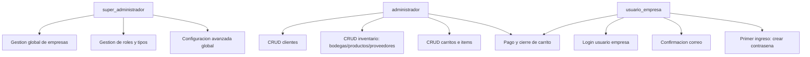
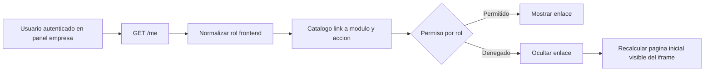

# Diagrama de roles y permisos

Fecha: 2026-04-01

Matriz resumida:

| Permiso | super_administrador | administrador | usuario_empresa |
|---|---|---|---|
| Gestion global del sistema | Si | No | No |
| Gestion operativa por empresa | Parcial | Si | Parcial |
| Confirmar correo | No | No | Si |
| Crear contrasena primer ingreso | No | No | Si |
| Login en login_usuario | No | No | Si |

## Actualizacion 2026-04-04 (catalogo de permisos frontend en panel empresa)

Objetivo: ocultar opciones del menu lateral de `administrar_empresa` segun rol autenticado sin reemplazar la validacion backend (el backend sigue siendo la autoridad final).

Cobertura aplicada:

- Archivo de catalogo: `web/js/administrar_empresa.js`.
- Fuente de rol autenticado: endpoint `GET /me`.
- Matriz de evaluacion frontend alineada a modulos y acciones de permisos (`ventas`, `inventario`, `finanzas`, `clientes`, `facturacion`, `seguridad`).
