# Diagramas del sistema PCS para super administrador y Codex

Actualizacion: 2026-07-07

Este documento concentra los 15 diagramas solicitados para que el super administrador los vea en paginas propias y para que Codex pueda leer la fuente tecnica en texto. La fuente visual del panel vive en `web/js/super_diagramas_data.js` y cada pagina estatica esta en `web/super/diagramas/`.

Para documentacion tecnica ampliada y escalable, usar tambien
`documentos/diagramas/documentacion_tecnica_completa.md`. Ese paquete agrega
ERD PostgreSQL extraido del backend con catalogo completo de tablas y atributos,
casos de uso, clases UML, secuencias, actividades, estados, componentes,
despliegue, paquetes, mapa de navegacion y flujo de datos. Su manifiesto para
Codex vive en `documentos/diagramas/documentacion_tecnica_completa_manifest.json`.

## Indice

- [Diagrama de modulos del sistema](#modulos) -> `/super/diagramas/modulos.html`
- [Diagrama de base de datos / ERD](#erd) -> `/super/diagramas/base_de_datos_erd.html`
- [Diagrama multiempresa / multi-tenant](#multiempresa) -> `/super/diagramas/multiempresa.html`
- [Diagrama general de arquitectura](#arquitectura) -> `/super/diagramas/arquitectura.html`
- [Diagrama de flujo de ventas POS](#ventas-pos) -> `/super/diagramas/ventas_pos.html`
- [Diagrama de flujo de facturacion electronica DIAN](#dian) -> `/super/diagramas/facturacion_dian.html`
- [Diagrama de flujo de inventario](#inventario) -> `/super/diagramas/inventario.html`
- [Diagrama de usuarios, roles y permisos](#roles-permisos) -> `/super/diagramas/roles_permisos.html`
- [Diagrama de API / endpoints](#api-endpoints) -> `/super/diagramas/api_endpoints.html`
- [Diagrama de despliegue / infraestructura](#despliegue) -> `/super/diagramas/despliegue.html`
- [Diagrama de seguridad](#seguridad) -> `/super/diagramas/seguridad.html`
- [Diagrama de auditoria y logs](#auditoria-logs) -> `/super/diagramas/auditoria_logs.html`
- [Diagrama de reportes](#reportes) -> `/super/diagramas/reportes.html`
- [Diagrama de integraciones externas](#integraciones) -> `/super/diagramas/integraciones.html`
- [Diagrama de agentes automaticos](#agentes) -> `/super/diagramas/agentes_automaticos.html`

## Diagrama de modulos del sistema {#modulos}

Agrupa las areas principales del POS multiempresa para ubicar cambios, permisos y documentacion por modulo.

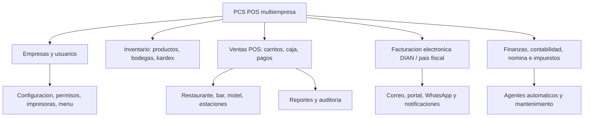

## Diagrama de base de datos / ERD {#erd}

Resume las tablas principales y relaciones por dominio. El detalle fisico completo sigue en documentos/estructura_bd.md.

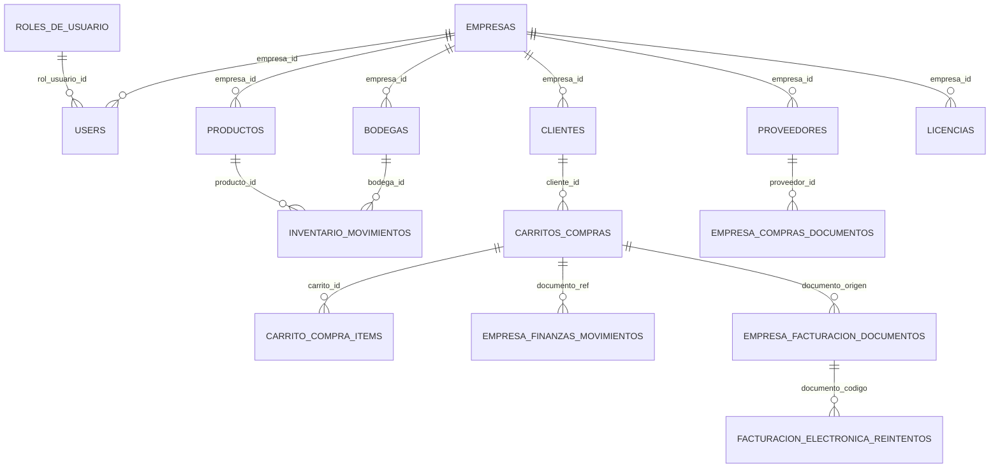

## Diagrama multiempresa / multi-tenant {#multiempresa}

Muestra como cada tabla operativa debe filtrar por empresa_id y como el super administrador gobierna configuraciones globales.

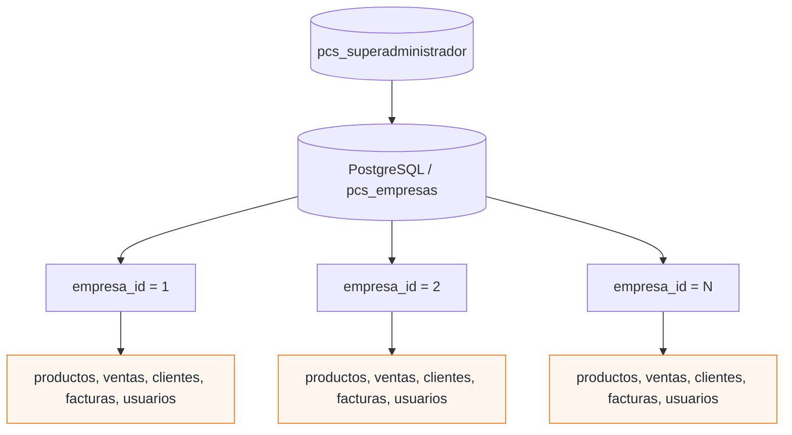

## Diagrama general de arquitectura {#arquitectura}

Conecta navegador, frontend estatico, API Go, PostgreSQL, servicios externos y despliegue Docker/VPS.

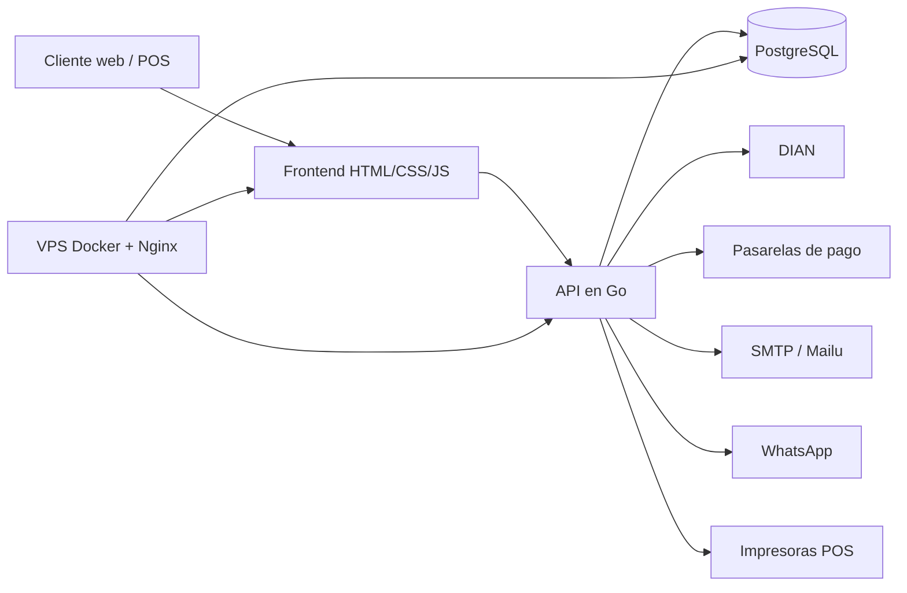

## Diagrama de flujo de ventas POS {#ventas-pos}

Describe el flujo operativo desde seleccion de empresa hasta inventario, caja, impresion y factura electronica si aplica.

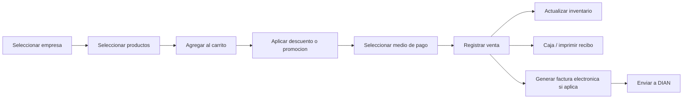

## Diagrama de flujo de facturacion electronica DIAN {#dian}

Ordena la emision DIAN Colombia: validacion, UBL, firma, envio, acuse, CUFE/PDF y correo al cliente.

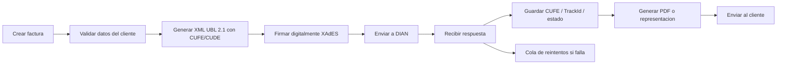

## Diagrama de flujo de inventario {#inventario}

Relaciona entradas, salidas, traslados, kardex y reportes de existencias por empresa y bodega.

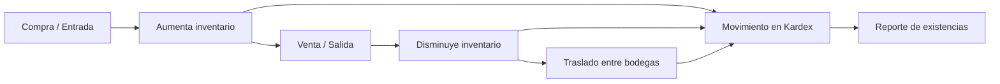

## Diagrama de usuarios, roles y permisos {#roles-permisos}

Ubica roles super y empresariales. La autorizacion final vive en backend, wrappers y matriz por modulo.

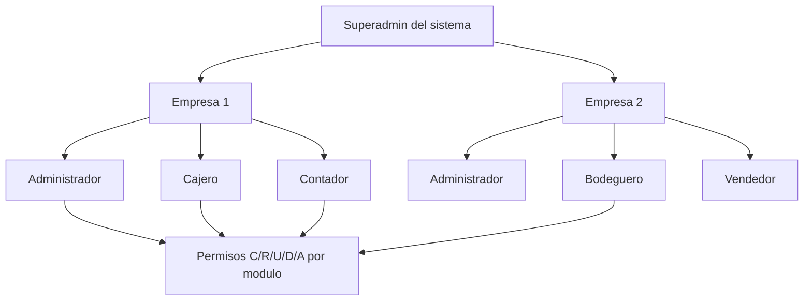

## Diagrama de API / endpoints {#api-endpoints}

Organiza las rutas por familias para ubicar handlers, wrappers de permisos y validaciones de empresa_id.

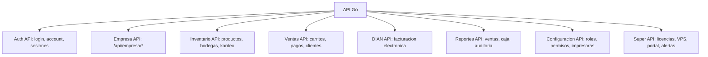

## Diagrama de despliegue / infraestructura {#despliegue}

Muestra dominio, proxy, Docker, base de datos, correo, backups y flujo GitHub hacia VPS.

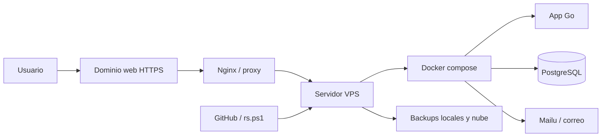

## Diagrama de seguridad {#seguridad}

Resume autenticacion, sesiones, roles, aislamiento por empresa, auditoria, HTTPS y proteccion de secretos.

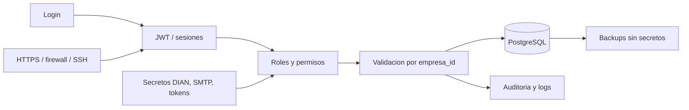

## Diagrama de auditoria y logs {#auditoria-logs}

Estandariza quien hizo que, en que empresa, modulo, fecha, IP y con que resultado.

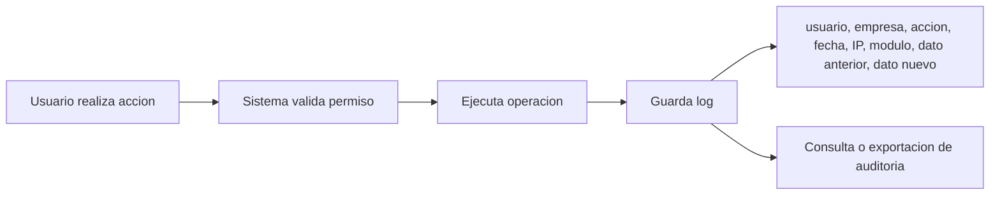

## Diagrama de reportes {#reportes}

Mapa los reportes principales que consumen ventas, compras, inventario, caja, fiscalidad y utilidad.

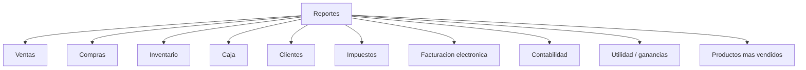

## Diagrama de integraciones externas {#integraciones}

Lista dependencias externas y equipos que el sistema puede usar sin mezclar secretos con documentacion.

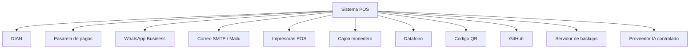

## Diagrama de agentes automaticos {#agentes}

Ubica agentes internos de soporte, monitoreo y programacion asistida. Codex usa estos diagramas como referencia del repo, no como permiso para ejecutar acciones externas.

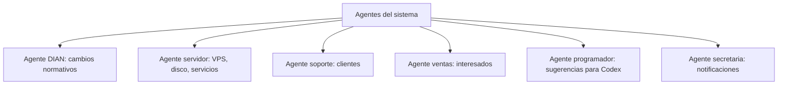
