# Documentacion tecnica completa con diagramas PCS

Actualizacion: 2026-07-09

Este paquete documenta la arquitectura vigente de PCS en formato legible para humanos y para Codex. Los diagramas estan en Mermaid y el manifiesto estructurado esta en `documentos/diagramas/documentacion_tecnica_completa_manifest.json`.

Alcance: los atributos de base de datos se extraen desde sentencias `CREATE TABLE` del backend Go/PostgreSQL. Las FKs fisicas se listan solo cuando aparecen declaradas con `REFERENCES` o `FOREIGN KEY`. Las relaciones marcadas como logicas reflejan contratos de aplicacion por columnas como `empresa_id`, `cliente_id` y `producto_id`, sin afirmar que exista constraint fisico si el SQL no lo declara.

## Indice

- Arquitectura general
- Mapa de modulos
- Mapa de navegacion
- Diagrama Entidad-Relacion PostgreSQL
- Casos de uso
- Clases UML
- Secuencias
- Actividades
- Estados
- Componentes
- Despliegue
- Paquetes
- Flujo de datos
- Catalogo completo de tablas

## Arquitectura general

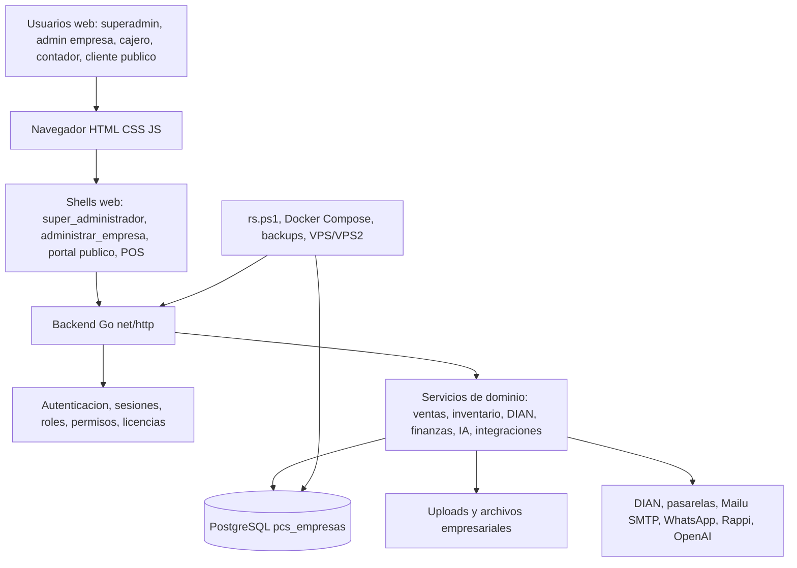

## Mapa de modulos

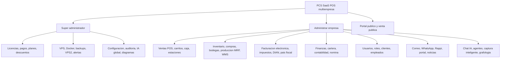

## Mapa de navegacion

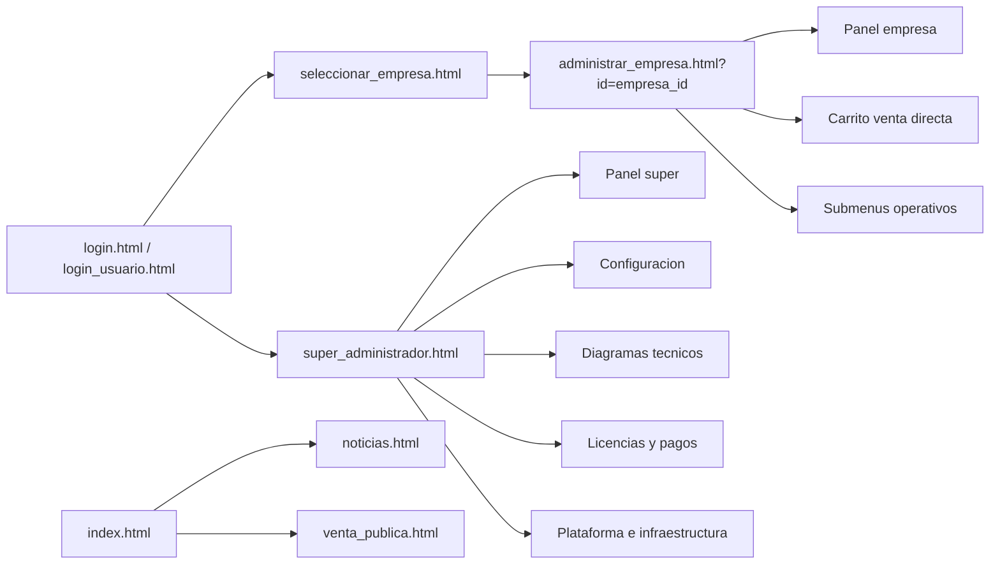

## Diagrama Entidad-Relacion PostgreSQL

### ERD global resumido por dominios

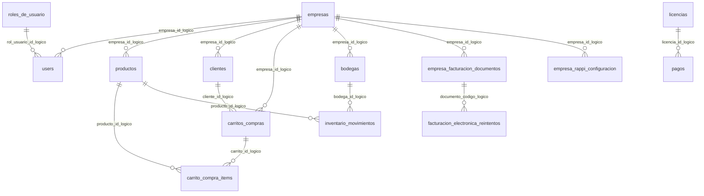

### Tablas por dominio

#### Acceso, seguridad y auditoria


#### Canales e integraciones

```mermaid
flowchart TB
  empresa_email_corporativo["empresa_email_corporativo"]
  empresa_portal_contador_comunicaciones["empresa_portal_contador_comunicaciones"]
  empresa_portal_contador_obligaciones["empresa_portal_contador_obligaciones"]
  empresa_portal_contador_solicitudes["empresa_portal_contador_solicitudes"]
  empresa_portal_terceros["empresa_portal_terceros"]
  empresa_rappi_configuracion["empresa_rappi_configuracion"]
  empresa_rappi_ordenes["empresa_rappi_ordenes"]
  portal_visitas_paises["portal_visitas_paises"]
```

#### Empresas y configuracion


#### Facturacion electronica


#### Finanzas, impuestos y RRHH


#### IA, soporte y colaboracion


#### Inventario, compras y produccion


#### Operativo transversal


#### Superadmin y licencias


#### Ventas, caja y clientes


## Casos de uso

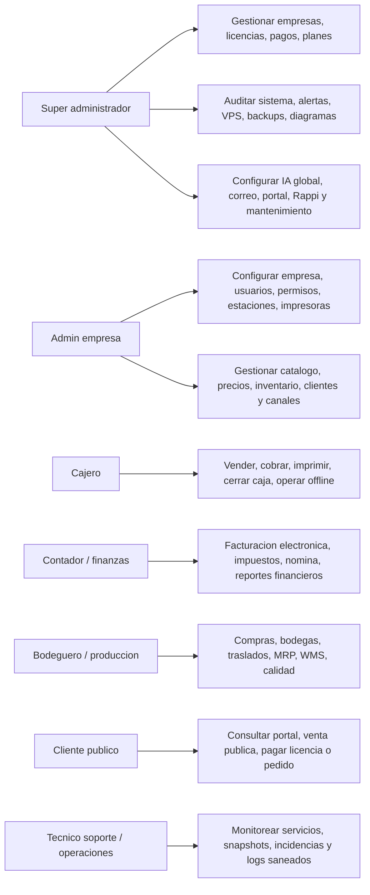

## Diagrama de Clases UML

```mermaid
classDiagram
  class Empresa {+id +nombre +nit +tipo +configuracion}
  class Usuario {+id +empresa_id +rol_usuario_id +email +estado}
  class RolUsuario {+id +nombre +permisos}
  class Producto {+id +empresa_id +sku +precio +stock}
  class Cliente {+id +empresa_id +documento +contacto}
  class Carrito {+id +empresa_id +estado +total +caja}
  class CarritoItem {+id +carrito_id +producto_id +cantidad +precio}
  class FacturaElectronica {+id +empresa_id +numero_legal +cufe +estado_dian}
  class Licencia {+id +empresa_id +plan_id +estado +vigencia}
  class RappiConfig {+empresa_id +base_url +stores +webhook}
  class AuthService {+ResolverSesion() +ValidarPermiso()}
  class EmpresaService {+ResolverEmpresa() +ValidarAislamiento()}
  class VentaService {+AgregarItem() +PagarEstacion() +CerrarCaja()}
  class InventarioService {+ReservarStock() +RegistrarKardex()}
  class FacturacionService {+GenerarUBL() +FirmarXAdES() +EnviarDIAN()}
  class IntegracionService {+EnviarCorreo() +ProcesarWebhook() +ConsumirProveedor()}
  Empresa "1" --> "*" Usuario
  RolUsuario "1" --> "*" Usuario
  Empresa "1" --> "*" Producto
  Empresa "1" --> "*" Cliente
  Empresa "1" --> "*" Carrito
  Carrito "1" --> "*" CarritoItem
  Producto "1" --> "*" CarritoItem
  Carrito "1" --> "0..1" FacturaElectronica
  Empresa "1" --> "*" Licencia
  Empresa "1" --> "0..1" RappiConfig
  AuthService --> EmpresaService
  VentaService --> InventarioService
  VentaService --> FacturacionService
  IntegracionService --> RappiConfig
```

## Diagramas de Secuencia

### Login y resolucion de empresa

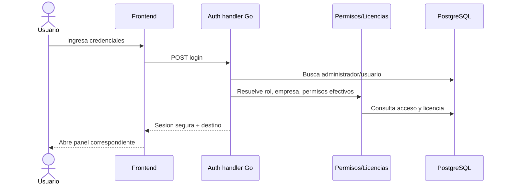

### Venta POS con inventario y caja

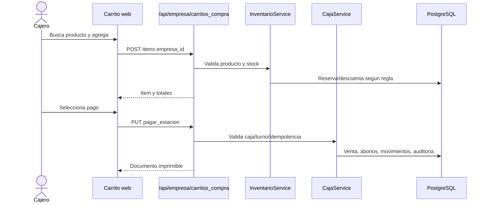

### Facturacion electronica DIAN

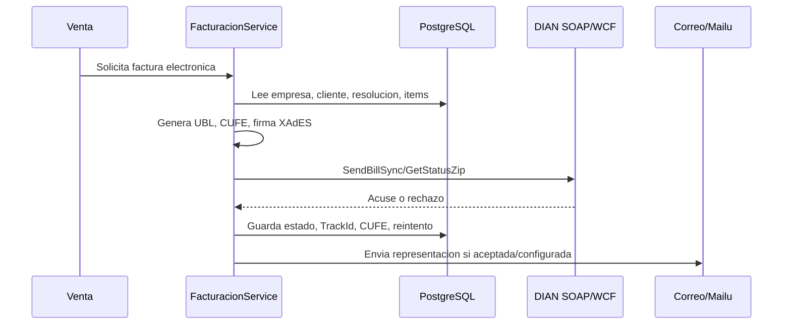

### Webhook Rappi separado por empresa

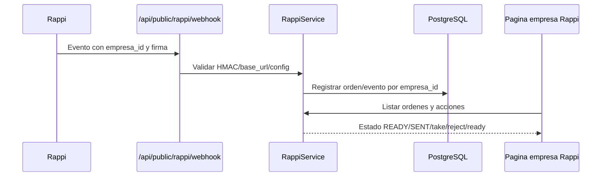

## Diagramas de Actividades

### Cierre de venta

```mermaid
flowchart TB
  A[Inicio venta] --> B{Caja abierta?}
  B -- No --> C[Abrir caja autorizada]
  B -- Si --> D[Agregar productos]
  C --> D
  D --> E[Validar stock/precios/cliente]
  E --> F{Factura electronica?}
  F -- No --> G[Registrar venta POS]
  F -- Si --> H[Generar documento fiscal]
  H --> I{DIAN acepta?}
  I -- Si --> J[Guardar CUFE y enviar correo]
  I -- No --> K[Guardar rechazo y cola/reintento]
  G --> L[Actualizar caja, auditoria e impresion]
  J --> L
  K --> L
```

### Despliegue rs

```mermaid
flowchart TB
  A[Ejecutar scripts rs.ps1] --> B[Preflight]
  B --> C{Preflight OK?}
  C -- No --> X[Detener y corregir causa]
  C -- Si --> D[Actualizar repositorio]
  D --> E[Sincronizar VPS]
  E --> F[Reconstruir/reiniciar Docker]
  F --> G[Validar salud local y publica]
  G --> H[Reportar resultado sin secretos]
```

## Diagramas de Estados

```mermaid
stateDiagram-v2
  [*] --> CarritoAbierto
  CarritoAbierto --> ConItems: agregar producto
  ConItems --> EnPago: iniciar cobro
  EnPago --> Cerrado: pago idempotente OK
  EnPago --> Pendiente: offline o reintento
  Pendiente --> Cerrado: sincronizacion OK
  Cerrado --> [*]
```

```mermaid
stateDiagram-v2
  [*] --> FacturaCreada
  FacturaCreada --> EnviadaDIAN
  EnviadaDIAN --> Aceptada: StatusCode 00 / IsValid true
  EnviadaDIAN --> Rechazada: reglas DIAN
  EnviadaDIAN --> PendienteAcuse: batch en proceso
  Rechazada --> ReintentoProgramado
  PendienteAcuse --> Aceptada
  ReintentoProgramado --> EnviadaDIAN
```

```mermaid
stateDiagram-v2
  [*] --> LicenciaPendiente
  LicenciaPendiente --> Activa: pago aprobado o trial
  Activa --> PorVencer
  PorVencer --> Vencida
  Vencida --> Activa: renovacion aprobada
  Activa --> Suspendida: regla administrativa
```

## Diagrama de Componentes

```mermaid
flowchart TB
  subgraph Web[Frontend estatico]
    SuperUI[Super administrador]
    EmpresaUI[Administrar empresa]
    POSUI[Carrito POS]
    PublicUI[Portal publico]
  end
  subgraph Backend[Backend Go]
    Handlers[Handlers HTTP]
    Middleware[Sesion, permisos, licencia]
    DBPkg[Paquete db]
    Services[Servicios dominio]
    Integrations[Clientes externos]
  end
  Web --> Handlers
  Handlers --> Middleware
  Handlers --> Services
  Services --> DBPkg
  DBPkg --> PG[(PostgreSQL)]
  Integrations --> DIAN[DIAN]
  Integrations --> Mailu[Mailu SMTP]
  Integrations --> Pay[Wompi/Epayco]
  Integrations --> Rappi[Rappi]
  Integrations --> OpenAI[OpenAI]
```

## Diagrama de Despliegue

```mermaid
flowchart LR
  Dev[Workspace Windows Codex] --> Git[Git/GitHub]
  Dev --> RS[scripts/rs.ps1]
  RS --> VPS[VPS principal]
  VPS --> Nginx[Nginx/HTTPS]
  VPS --> Compose[Docker Compose]
  Compose --> BackendC[pcs-backend]
  Compose --> FrontC[pcs-frontend/edge]
  Compose --> PostgresC[pcs-postgres]
  Compose --> MailuC[Mailu perfil mail]
  VPS --> Backups[Backups/snapshots]
  VPS2[VPS2 Nextcloud/monitoreo] -. snapshot .-> SuperUI[Panel VPS2 super]
```

## Diagrama de Paquetes

```mermaid
flowchart TB
  Repo[D:/powerfulcontrolsystem]
  Repo --> BackendPkg[backend]
  BackendPkg --> HandlersPkg[handlers]
  BackendPkg --> DBLayer[db]
  BackendPkg --> Internal[internal dominio]
  Repo --> WebPkg[web]
  WebPkg --> AdminEmpresa[administrar_empresa pages]
  WebPkg --> SuperPages[super pages]
  WebPkg --> JSPkg[js compartido]
  Repo --> ScriptsPkg[scripts despliegue y operacion]
  Repo --> DeployPkg[deploy Docker/VPS]
  Repo --> DocsPkg[documentos]
  DocsPkg --> DiagramasPkg[diagramas y manifiestos]
```

## Diagrama de Flujo de Datos

```mermaid
flowchart LR
  Actor[Usuario / integracion externa] --> UI[Frontend PCS]
  UI --> API[API Go]
  API --> Validacion[Validacion sesion rol permiso licencia empresa_id]
  Validacion --> Escritura[Mutaciones idempotentes]
  Validacion --> Lectura[Consultas filtradas]
  Escritura --> DB[(PostgreSQL)]
  Lectura --> DB
  DB --> Reportes[Reportes, auditoria, paneles]
  API --> Externos[DIAN, Rappi, pasarelas, correo, WhatsApp, IA]
  Externos --> API
  API --> Logs[Eventos saneados, alertas, buzon]
```

## Catalogo completo de tablas PostgreSQL extraidas

Total de tablas extraidas: 365.

### Acceso, seguridad y auditoria

#### admin_empresa_compartida

Fuente: backend/db/empresa_admin_compartida.go

| Columna | Tipo | PK | FK fisica | Not null | Default/Unique |
|---|---|---:|---|---:|---|
| id | BIGSERIAL | si |  | no |  |
| empresa_id | BIGINT | no |  | si |  |
| admin_email | TEXT | no |  | si |  |
| compartido_por_email | TEXT | no |  | no |  |
| invitacion_id | BIGINT | no |  | no |  |
| nivel_acceso | TEXT | no |  | no | default |
| modulos_permitidos | TEXT | no |  | no |  |
| puede_compartir | BOOLEAN | no |  | no | default |
| fecha_aceptada | TEXT | no |  | no |  |
| fecha_revocada | TEXT | no |  | no |  |
| fecha_creacion | TEXT | no |  | no | default |
| fecha_actualizacion | TEXT | no |  | no | default |
| usuario_creador | TEXT | no |  | no |  |
| estado | TEXT | no |  | no | default |
| observaciones | TEXT | no |  | no |  |

#### admin_empresa_compartida_invitaciones

Fuente: backend/db/empresa_admin_compartida.go

| Columna | Tipo | PK | FK fisica | Not null | Default/Unique |
|---|---|---:|---|---:|---|
| id | BIGSERIAL | si |  | no |  |
| empresa_id | BIGINT | no |  | si |  |
| admin_email | TEXT | no |  | si |  |
| invitado_por_email | TEXT | no |  | no |  |
| token_hash | TEXT | no |  | si |  |
| nivel_acceso | TEXT | no |  | no | default |
| modulos_permitidos | TEXT | no |  | no |  |
| puede_compartir | BOOLEAN | no |  | no | default |
| mensaje | TEXT | no |  | no |  |
| expira_en | TEXT | no |  | no |  |
| aceptada_en | TEXT | no |  | no |  |
| rechazada_en | TEXT | no |  | no |  |
| revocada_en | TEXT | no |  | no |  |
| fecha_creacion | TEXT | no |  | no | default |
| fecha_actualizacion | TEXT | no |  | no | default |
| usuario_creador | TEXT | no |  | no |  |
| estado | TEXT | no |  | no | default |
| observaciones | TEXT | no |  | no |  |

#### admin_principal_delegaciones

Fuente: backend/db/admin_principal_delegaciones.go

| Columna | Tipo | PK | FK fisica | Not null | Default/Unique |
|---|---|---:|---|---:|---|
| id | BIGSERIAL | si |  | no |  |
| admin_email | TEXT | no |  | si |  |
| principal_email | TEXT | no |  | si |  |
| invitado_por_email | TEXT | no |  | no |  |
| token_hash | TEXT | no |  | no |  |
| expira_en | TEXT | no |  | no |  |
| fecha_aceptada | TEXT | no |  | no |  |
| fecha_revocada | TEXT | no |  | no |  |
| fecha_creacion | TEXT | no |  | no | default |
| fecha_actualizacion | TEXT | no |  | no | default |
| usuario_creador | TEXT | no |  | no |  |
| estado | TEXT | no |  | no | default |
| observaciones | TEXT | no |  | no |  |

#### administradores

Fuente: backend/scripts/seed_postgres_super.sql

| Columna | Tipo | PK | FK fisica | Not null | Default/Unique |
|---|---|---:|---|---:|---|
| id | BIGSERIAL | si |  | no |  |
| email | TEXT | no |  | no | unique |
| name | TEXT | no |  | no |  |
| role | TEXT | no |  | no | default |
| photo | TEXT | no |  | no |  |
| fecha_creacion | TIMESTAMP | no |  | no | default |
| fecha_actualizacion | TIMESTAMP | no |  | no | default |
| usuario_creador | TEXT | no |  | no |  |
| estado | TEXT | no |  | no | default |
| observaciones | TEXT | no |  | no |  |

#### empresa_configuracion_operativa_roles

Fuente: backend/db/configuracion_operativa.go

| Columna | Tipo | PK | FK fisica | Not null | Default/Unique |
|---|---|---:|---|---:|---|
| id | BIGSERIAL | si |  | no |  |
| empresa_id | INTEGER | no |  | si |  |
| rol | TEXT | no |  | si |  |
| metodo_pago_efectivo | INTEGER | no |  | no | default |
| metodo_pago_tarjeta_credito | INTEGER | no |  | no | default |
| metodo_pago_tarjeta_debito | INTEGER | no |  | no | default |
| metodo_pago_transferencia_bancaria | INTEGER | no |  | no | default |
| metodo_pago_mixto | INTEGER | no |  | no | default |
| metodo_pago_codigo_descuento | INTEGER | no |  | no | default |
| habilitar_propinas | INTEGER | no |  | no | default |
| habilitar_comisiones | INTEGER | no |  | no | default |
| fecha_creacion | TEXT | no |  | no | default |
| fecha_actualizacion | TEXT | no |  | no | default |
| usuario_creador | TEXT | no |  | no |  |
| estado | TEXT | no |  | no | default |
| observaciones | TEXT | no |  | no |  |

#### empresa_control_electrico_config

Fuente: backend/db/control_electrico.go

| Columna | Tipo | PK | FK fisica | Not null | Default/Unique |
|---|---|---:|---|---:|---|
| id | BIGSERIAL | si |  | no |  |
| empresa_id | INTEGER | no |  | si |  |
| habilitado | INTEGER | no |  | no | default |
| raspberry_ip | TEXT | no |  | no |  |
| raspberry_port | INTEGER | no |  | no | default |
| api_path | TEXT | no |  | no | default |
| api_token | TEXT | no |  | no |  |
| timeout_ms | INTEGER | no |  | no | default |
| auto_sync_estaciones | INTEGER | no |  | no | default |
| fail_safe_on_error | INTEGER | no |  | no | default |
| fecha_creacion | TEXT | no |  | no | default |
| fecha_actualizacion | TEXT | no |  | no | default |
| usuario_creador | TEXT | no |  | no |  |
| estado | TEXT | no |  | no | default |
| observaciones | TEXT | no |  | no |  |

#### empresa_control_electrico_eventos

Fuente: backend/db/control_electrico.go

| Columna | Tipo | PK | FK fisica | Not null | Default/Unique |
|---|---|---:|---|---:|---|
| id | BIGSERIAL | si |  | no |  |
| empresa_id | INTEGER | no |  | si |  |
| estacion_id | INTEGER | no |  | no |  |
| rele_id | INTEGER | no |  | no |  |
| raspberry_id | INTEGER | no |  | no |  |
| gpio_pin | INTEGER | no |  | no |  |
| comando | TEXT | no |  | no |  |
| estado_objetivo | TEXT | no |  | no |  |
| resultado | TEXT | no |  | no |  |
| http_status | INTEGER | no |  | no | default |
| raspberry_ip | TEXT | no |  | no |  |
| response_body | TEXT | no |  | no |  |
| error | TEXT | no |  | no |  |
| fecha_evento | TEXT | no |  | no | default |
| actor | TEXT | no |  | no |  |
| origen | TEXT | no |  | no |  |
| metadata_json | TEXT | no |  | no |  |

#### empresa_control_electrico_lecturas

Fuente: backend/db/control_electrico.go

| Columna | Tipo | PK | FK fisica | Not null | Default/Unique |
|---|---|---:|---|---:|---|
| id | BIGSERIAL | si |  | no |  |
| empresa_id | INTEGER | no |  | si |  |
| estacion_id | INTEGER | no |  | no |  |
| rele_id | INTEGER | no |  | no |  |
| origen | TEXT | no |  | no |  |
| estado | TEXT | no |  | no |  |
| consumo_w | REAL | no |  | no | default |
| consumo_kwh | REAL | no |  | no | default |
| voltaje_v | REAL | no |  | no | default |
| corriente_a | REAL | no |  | no | default |
| fecha_lectura | TEXT | no |  | no | default |
| metadata_json | TEXT | no |  | no |  |

#### empresa_control_electrico_raspberry_pis

Fuente: backend/db/control_electrico.go

| Columna | Tipo | PK | FK fisica | Not null | Default/Unique |
|---|---|---:|---|---:|---|
| id | BIGSERIAL | si |  | no |  |
| empresa_id | INTEGER | no |  | si |  |
| codigo | TEXT | no |  | no |  |
| nombre | TEXT | no |  | no |  |
| tipo_controlador | TEXT | no |  | no | default |
| proveedor | TEXT | no |  | no |  |
| base_url | TEXT | no |  | no |  |
| raspberry_ip | TEXT | no |  | si |  |
| raspberry_port | INTEGER | no |  | no | default |
| api_path | TEXT | no |  | no | default |
| api_token | TEXT | no |  | no |  |
| timeout_ms | INTEGER | no |  | no | default |
| fecha_creacion | TEXT | no |  | no | default |
| fecha_actualizacion | TEXT | no |  | no | default |
| usuario_creador | TEXT | no |  | no |  |
| estado | TEXT | no |  | no | default |
| observaciones | TEXT | no |  | no |  |

#### empresa_control_electrico_reglas

Fuente: backend/db/control_electrico.go

| Columna | Tipo | PK | FK fisica | Not null | Default/Unique |
|---|---|---:|---|---:|---|
| id | BIGSERIAL | si |  | no |  |
| empresa_id | INTEGER | no |  | si |  |
| nombre | TEXT | no |  | no |  |
| sensor_codigo | TEXT | no |  | no |  |
| sensor_tipo | TEXT | no |  | no |  |
| condicion | TEXT | no |  | no | default |
| valor | TEXT | no |  | no |  |
| accion | TEXT | no |  | no | default |
| estacion_id | INTEGER | no |  | no |  |
| rele_id | INTEGER | no |  | no |  |
| alarma_habilitada | INTEGER | no |  | no | default |
| severidad | TEXT | no |  | no | default |
| mensaje | TEXT | no |  | no |  |
| fecha_creacion | TEXT | no |  | no | default |
| fecha_actualizacion | TEXT | no |  | no | default |
| usuario_creador | TEXT | no |  | no |  |
| estado | TEXT | no |  | no | default |

#### empresa_control_electrico_reles

Fuente: backend/db/control_electrico.go

| Columna | Tipo | PK | FK fisica | Not null | Default/Unique |
|---|---|---:|---|---:|---|
| id | BIGSERIAL | si |  | no |  |
| empresa_id | INTEGER | no |  | si |  |
| raspberry_id | INTEGER | no |  | no |  |
| estacion_id | INTEGER | no |  | si |  |
| estacion_codigo | TEXT | no |  | no |  |
| estacion_nombre | TEXT | no |  | no |  |
| salida_codigo | TEXT | no |  | no | default |
| tipo_carga | TEXT | no |  | no | default |
| integracion_tipo | TEXT | no |  | no | default |
| fabricante | TEXT | no |  | no |  |
| modelo | TEXT | no |  | no |  |
| entity_id | TEXT | no |  | no |  |
| device_id | TEXT | no |  | no |  |
| capability | TEXT | no |  | no |  |
| comando_on | TEXT | no |  | no |  |
| comando_off | TEXT | no |  | no |  |
| monitoreo_habilitado | INTEGER | no |  | no | default |
| potencia_w | REAL | no |  | no | default |
| sensor_consumo_entity_id | TEXT | no |  | no |  |
| ultimo_consumo_w | REAL | no |  | no | default |
| ultimo_consumo_kwh | REAL | no |  | no | default |
| ultimo_voltaje_v | REAL | no |  | no | default |
| ultimo_corriente_a | REAL | no |  | no | default |
| gpio_pin | INTEGER | no |  | si |  |
| relay_name | TEXT | no |  | no |  |
| active_high | INTEGER | no |  | no | default |
| pulso_ms | INTEGER | no |  | no | default |
| modo | TEXT | no |  | no | default |
| programacion_habilitada | INTEGER | no |  | no | default |
| hora_encendido | TEXT | no |  | no |  |
| hora_apagado | TEXT | no |  | no |  |
| programacion_dias | TEXT | no |  | no | default |
| programacion_timezone | TEXT | no |  | no | default |
| ultima_programacion_on | TEXT | no |  | no |  |
| ultima_programacion_off | TEXT | no |  | no |  |
| imagen_url | TEXT | no |  | no |  |
| ultimo_estado | TEXT | no |  | no | default |
| ultimo_comando | TEXT | no |  | no |  |
| ultimo_error | TEXT | no |  | no |  |
| ultima_sincronizacion | TEXT | no |  | no |  |
| fecha_creacion | TEXT | no |  | no | default |
| fecha_actualizacion | TEXT | no |  | no | default |
| usuario_creador | TEXT | no |  | no |  |
| estado | TEXT | no |  | no | default |
| observaciones | TEXT | no |  | no |  |

#### empresa_permisos_modulos

Fuente: backend/db/empresa_permisos_finos.go

| Columna | Tipo | PK | FK fisica | Not null | Default/Unique |
|---|---|---:|---|---:|---|
| id | BIGSERIAL | si |  | no |  |
| empresa_id | INTEGER | no |  | si |  |
| modulo | TEXT | no |  | si |  |
| accion | TEXT | no |  | si |  |
| permitido | INTEGER | no |  | si | default |
| fecha_creacion | TEXT | no |  | no | default |
| fecha_actualizacion | TEXT | no |  | no | default |
| usuario_creador | TEXT | no |  | no |  |
| estado | TEXT | no |  | no | default |
| observaciones | TEXT | no |  | no |  |

#### empresa_permisos_paginas

Fuente: backend/db/empresa_permisos_finos.go

| Columna | Tipo | PK | FK fisica | Not null | Default/Unique |
|---|---|---:|---|---:|---|
| id | BIGSERIAL | si |  | no |  |
| empresa_id | INTEGER | no |  | si |  |
| pagina_clave | TEXT | no |  | si |  |
| permitido | INTEGER | no |  | si | default |
| fecha_creacion | TEXT | no |  | no | default |
| fecha_actualizacion | TEXT | no |  | no | default |
| usuario_creador | TEXT | no |  | no |  |
| estado | TEXT | no |  | no | default |
| observaciones | TEXT | no |  | no |  |

#### logistica_envios

Fuente: backend/db/modulos_faltantes.go

| Columna | Tipo | PK | FK fisica | Not null | Default/Unique |
|---|---|---:|---|---:|---|
| id | BIGSERIAL | si |  | no |  |
| empresa_id | INTEGER | no |  | si |  |
| codigo | TEXT | no |  | si |  |
| cliente_id | INTEGER | no |  | no | default |
| cliente_nombre | TEXT | no |  | no |  |
| documento_referencia | TEXT | no |  | no |  |
| direccion_entrega | TEXT | no |  | no |  |
| ruta_id | INTEGER | no |  | no | default |
| transportista_id | INTEGER | no |  | no | default |
| fecha_programada | TEXT | no |  | no |  |
| fecha_salida | TEXT | no |  | no |  |
| fecha_entrega | TEXT | no |  | no |  |
| estado_envio | TEXT | no |  | no | default |
| costo_envio | REAL | no |  | no | default |
| latitud | REAL | no |  | no | default |
| longitud | REAL | no |  | no | default |
| observaciones_seguimiento | TEXT | no |  | no |  |
| fecha_creacion | TEXT | no |  | no | default |
| fecha_actualizacion | TEXT | no |  | no | default |
| usuario_creador | TEXT | no |  | no |  |
| estado | TEXT | no |  | no | default |
| observaciones | TEXT | no |  | no |  |

#### logistica_rutas

Fuente: backend/db/modulos_faltantes.go

| Columna | Tipo | PK | FK fisica | Not null | Default/Unique |
|---|---|---:|---|---:|---|
| id | BIGSERIAL | si |  | no |  |
| empresa_id | INTEGER | no |  | si |  |
| codigo | TEXT | no |  | si |  |
| nombre | TEXT | no |  | no |  |
| origen | TEXT | no |  | no |  |
| destino | TEXT | no |  | no |  |
| distancia_km | REAL | no |  | no | default |
| tiempo_estimado_min | REAL | no |  | no | default |
| estado_ruta | TEXT | no |  | no | default |
| fecha_creacion | TEXT | no |  | no | default |
| fecha_actualizacion | TEXT | no |  | no | default |
| usuario_creador | TEXT | no |  | no |  |
| estado | TEXT | no |  | no | default |
| observaciones | TEXT | no |  | no |  |

#### logistica_transportistas

Fuente: backend/db/modulos_faltantes.go

| Columna | Tipo | PK | FK fisica | Not null | Default/Unique |
|---|---|---:|---|---:|---|
| id | BIGSERIAL | si |  | no |  |
| empresa_id | INTEGER | no |  | si |  |
| codigo | TEXT | no |  | si |  |
| nombre | TEXT | no |  | no |  |
| documento | TEXT | no |  | no |  |
| telefono | TEXT | no |  | no |  |
| email | TEXT | no |  | no |  |
| placa | TEXT | no |  | no |  |
| vehiculo_tipo | TEXT | no |  | no |  |
| capacidad_carga | REAL | no |  | no | default |
| estado_transportista | TEXT | no |  | no | default |
| fecha_creacion | TEXT | no |  | no | default |
| fecha_actualizacion | TEXT | no |  | no | default |
| usuario_creador | TEXT | no |  | no |  |
| estado | TEXT | no |  | no | default |
| observaciones | TEXT | no |  | no |  |

#### roles_de_usuario

Fuente: backend/db/roles_tipos_usuario.go

| Columna | Tipo | PK | FK fisica | Not null | Default/Unique |
|---|---|---:|---|---:|---|
| id | BIGSERIAL | si |  | no |  |
| tipo_empresa_id | BIGINT | no |  | si |  |
| nombre | TEXT | no |  | si |  |
| descripcion | TEXT | no |  | no |  |
| fecha_creacion | TEXT | no |  | no | default |
| fecha_actualizacion | TEXT | no |  | no | default |
| usuario_creador | TEXT | no |  | no |  |
| estado | TEXT | no |  | no | default |
| observaciones | TEXT | no |  | no |  |

#### roles_de_usuario_paginas_permisos

Fuente: backend/db/roles_permisos_usuario.go

| Columna | Tipo | PK | FK fisica | Not null | Default/Unique |
|---|---|---:|---|---:|---|
| id | BIGSERIAL | si |  | no |  |
| rol_id | INTEGER | no |  | si |  |
| pagina_clave | TEXT | no |  | si |  |
| permitido | INTEGER | no |  | si | default |
| fecha_creacion | TEXT | no |  | no | default |
| fecha_actualizacion | TEXT | no |  | no | default |
| usuario_creador | TEXT | no |  | no |  |
| estado | TEXT | no |  | no | default |
| observaciones | TEXT | no |  | no |  |

#### roles_de_usuario_permisos

Fuente: backend/db/roles_permisos_usuario.go

| Columna | Tipo | PK | FK fisica | Not null | Default/Unique |
|---|---|---:|---|---:|---|
| id | BIGSERIAL | si |  | no |  |
| rol_id | INTEGER | no |  | si |  |
| modulo | TEXT | no |  | si |  |
| accion | TEXT | no |  | si |  |
| permitido | INTEGER | no |  | si | default |
| fecha_creacion | TEXT | no |  | no | default |
| fecha_actualizacion | TEXT | no |  | no | default |
| usuario_creador | TEXT | no |  | no |  |
| estado | TEXT | no |  | no | default |
| observaciones | TEXT | no |  | no |  |

#### users

Fuente: backend/db/usuarios_empresa.go

| Columna | Tipo | PK | FK fisica | Not null | Default/Unique |
|---|---|---:|---|---:|---|
| id | BIGSERIAL | si |  | no |  |
| email | TEXT | no |  | no | unique |
| name | TEXT | no |  | no |  |
| role | TEXT | no |  | no | default |
| empresa_id | BIGINT | no |  | no |  |
| documento_identidad | TEXT | no |  | no |  |
| rol_usuario_id | BIGINT | no |  | no |  |
| foto_url | TEXT | no |  | no |  |
| control_aseo_estaciones | INTEGER | no |  | no | default |
| email_confirmado | INTEGER | no |  | no | default |
| email_confirm_token | TEXT | no |  | no |  |
| email_confirm_expira | TEXT | no |  | no |  |
| email_confirmado_en | TEXT | no |  | no |  |
| password_hash | TEXT | no |  | no |  |
| password_salt | TEXT | no |  | no |  |
| password_set | INTEGER | no |  | no | default |
| password_actualizada_en | TEXT | no |  | no |  |
| login_failed_attempts | INTEGER | no |  | no | default |
| login_failed_last_at | TEXT | no |  | no |  |
| login_locked_until | TEXT | no |  | no |  |
| password_reset_token | TEXT | no |  | no |  |
| password_reset_expira | TEXT | no |  | no |  |
| password_reset_requested_en | TEXT | no |  | no |  |
| acepta_contrato | INTEGER | no |  | no | default |
| contrato_version_aceptada | INTEGER | no |  | no | default |
| fecha_acepta_contrato | TEXT | no |  | no |  |
| fecha_creacion | TEXT | no |  | no | default |
| fecha_actualizacion | TEXT | no |  | no | default |
| usuario_creador | TEXT | no |  | no |  |
| estado | TEXT | no |  | no | default |
| observaciones | TEXT | no |  | no |  |

#### usuario_configuracion

Fuente: backend/db/usuario_config_schema.go

| Columna | Tipo | PK | FK fisica | Not null | Default/Unique |
|---|---|---:|---|---:|---|
| email | TEXT | si |  | no |  |
| apariencia | TEXT | no |  | no | default |
| fecha_actualizacion | TEXT | no |  | no | default |

### Canales e integraciones

#### empresa_email_corporativo

Fuente: backend/db/email_corporativo.go

| Columna | Tipo | PK | FK fisica | Not null | Default/Unique |
|---|---|---:|---|---:|---|
| id | BIGSERIAL | si |  | no |  |
| empresa_id | BIGINT | no |  | si |  |
| empresa_nombre | TEXT | no |  | no |  |
| email | TEXT | no |  | si |  |
| local_part | TEXT | no |  | no |  |
| domain | TEXT | no |  | no |  |
| webmail_url | TEXT | no |  | no |  |
| estado_provision | TEXT | no |  | no | default |
| provision_provider | TEXT | no |  | no | default |
| provision_attempts | INTEGER | no |  | no | default |
| fecha_provision | TIMESTAMPTZ | no |  | no |  |
| ultimo_error | TEXT | no |  | no |  |
| initial_password_enc | TEXT | no |  | no |  |
| initial_password_encrypted | INTEGER | no |  | no | default |
| fecha_creacion | TIMESTAMPTZ | no |  | no | default |
| fecha_actualizacion | TIMESTAMPTZ | no |  | no | default |
| usuario_creador | TEXT | no |  | no |  |
| estado | TEXT | no |  | no | default |
| observaciones | TEXT | no |  | no |  |

#### empresa_portal_contador_comunicaciones

Fuente: backend/db/portal_contador.go

| Columna | Tipo | PK | FK fisica | Not null | Default/Unique |
|---|---|---:|---|---:|---|
| id | BIGSERIAL | si |  | no |  |
| empresa_id | INTEGER | no |  | si |  |
| cliente_id | INTEGER | no |  | si |  |
| canal | TEXT | no |  | no | default |
| asunto | TEXT | no |  | no |  |
| mensaje | TEXT | no |  | no |  |
| fecha_mensaje | TEXT | no |  | no | default |
| leido_cliente | INTEGER | no |  | no | default |
| fecha_creacion | TEXT | no |  | no | default |
| fecha_actualizacion | TEXT | no |  | no | default |
| usuario_creador | TEXT | no |  | no |  |
| observaciones | TEXT | no |  | no |  |

#### empresa_portal_contador_obligaciones

Fuente: backend/db/portal_contador.go

| Columna | Tipo | PK | FK fisica | Not null | Default/Unique |
|---|---|---:|---|---:|---|
| id | BIGSERIAL | si |  | no |  |
| empresa_id | INTEGER | no |  | si |  |
| cliente_id | INTEGER | no |  | si |  |
| codigo | TEXT | no |  | si |  |
| tipo | TEXT | no |  | no | default |
| periodo | TEXT | no |  | no |  |
| fecha_vencimiento | TEXT | no |  | no |  |
| estado_obligacion | TEXT | no |  | no | default |
| prioridad | TEXT | no |  | no | default |
| valor_estimado | REAL | no |  | no | default |
| responsable | TEXT | no |  | no |  |
| fecha_presentacion | TEXT | no |  | no |  |
| soporte_url | TEXT | no |  | no |  |
| fecha_creacion | TEXT | no |  | no | default |
| fecha_actualizacion | TEXT | no |  | no | default |
| usuario_creador | TEXT | no |  | no |  |
| observaciones | TEXT | no |  | no |  |

#### empresa_portal_contador_solicitudes

Fuente: backend/db/portal_contador.go

| Columna | Tipo | PK | FK fisica | Not null | Default/Unique |
|---|---|---:|---|---:|---|
| id | BIGSERIAL | si |  | no |  |
| empresa_id | INTEGER | no |  | si |  |
| cliente_id | INTEGER | no |  | si |  |
| codigo | TEXT | no |  | si |  |
| titulo | TEXT | no |  | si |  |
| categoria | TEXT | no |  | no | default |
| fecha_solicitud | TEXT | no |  | no | default |
| fecha_limite | TEXT | no |  | no |  |
| estado_solicitud | TEXT | no |  | no | default |
| prioridad | TEXT | no |  | no | default |
| responsable | TEXT | no |  | no |  |
| respuesta | TEXT | no |  | no |  |
| soporte_url | TEXT | no |  | no |  |
| fecha_creacion | TEXT | no |  | no | default |
| fecha_actualizacion | TEXT | no |  | no | default |
| usuario_creador | TEXT | no |  | no |  |
| observaciones | TEXT | no |  | no |  |

#### empresa_portal_terceros

Fuente: backend/db/portal_terceros_certificados.go

| Columna | Tipo | PK | FK fisica | Not null | Default/Unique |
|---|---|---:|---|---:|---|
| id | BIGSERIAL | si |  | no |  |
| empresa_id | INTEGER | no |  | si |  |
| tipo_tercero | TEXT | no |  | no | default |
| tipo_documento | TEXT | no |  | no | default |
| documento | TEXT | no |  | si |  |
| dv | TEXT | no |  | no |  |
| razon_social | TEXT | no |  | si |  |
| email | TEXT | no |  | no |  |
| telefono | TEXT | no |  | no |  |
| direccion | TEXT | no |  | no |  |
| ciudad | TEXT | no |  | no |  |
| regimen | TEXT | no |  | no | default |
| estado | TEXT | no |  | no | default |
| acceso_token | TEXT | no |  | no |  |
| observaciones | TEXT | no |  | no |  |
| fecha_creacion | TEXT | no |  | no | default |
| fecha_actualizacion | TEXT | no |  | no | default |
| usuario_creador | TEXT | no |  | no |  |

#### empresa_rappi_configuracion

Fuente: backend/db/rappi.go

| Columna | Tipo | PK | FK fisica | Not null | Default/Unique |
|---|---|---:|---|---:|---|
| id | BIGSERIAL | si |  | no |  |
| empresa_id | INTEGER | no |  | si |  |
| activo | INTEGER | no |  | si | default |
| ambiente | TEXT | no |  | si | default |
| country_domain | TEXT | no |  | si | default |
| new_domain | TEXT | no |  | si | default |
| client_id | TEXT | no |  | no |  |
| client_secret_ref | TEXT | no |  | no |  |
| webhook_secret_ref | TEXT | no |  | no |  |
| store_integration_id | TEXT | no |  | no |  |
| rappi_store_id | TEXT | no |  | no |  |
| auto_tomar_ordenes | INTEGER | no |  | si | default |
| cooking_time_minutes | INTEGER | no |  | si | default |
| crear_venta_interna | INTEGER | no |  | si | default |
| observaciones | TEXT | no |  | no |  |
| fecha_creacion | TIMESTAMP | no |  | no | default |
| fecha_actualizacion | TIMESTAMP | no |  | no | default |
| usuario_creador | TEXT | no |  | no |  |
| estado | TEXT | no |  | si | default |

#### empresa_rappi_ordenes

Fuente: backend/db/rappi.go

| Columna | Tipo | PK | FK fisica | Not null | Default/Unique |
|---|---|---:|---|---:|---|
| id | BIGSERIAL | si |  | no |  |
| empresa_id | INTEGER | no |  | si |  |
| rappi_order_id | TEXT | no |  | si |  |
| rappi_store_id | TEXT | no |  | no |  |
| store_integration_id | TEXT | no |  | no |  |
| estado_rappi | TEXT | no |  | no |  |
| estado_local | TEXT | no |  | no |  |
| total | NUMERIC | no |  | no | default |
| moneda | TEXT | no |  | no | default |
| items_json | TEXT | no |  | no |  |
| raw_payload_json | TEXT | no |  | no |  |
| origen | TEXT | no |  | no |  |
| fecha_creacion | TIMESTAMP | no |  | no | default |
| fecha_actualizacion | TIMESTAMP | no |  | no | default |
| usuario_creador | TEXT | no |  | no |  |
| estado | TEXT | no |  | si | default |
| observaciones | TEXT | no |  | no |  |

#### portal_visitas_paises

Fuente: backend/handlers/portal_visitas.go

| Columna | Tipo | PK | FK fisica | Not null | Default/Unique |
|---|---|---:|---|---:|---|
| pais_codigo | TEXT | no |  | si |  |
| fecha | DATE | no |  | si | default |
| visitas | BIGINT | no |  | si | default |
| actualizado_en | TIMESTAMPTZ | no |  | si | default |

### Empresas y configuracion

#### empresa_alquileres_activos

Fuente: backend/db/alquileres.go

| Columna | Tipo | PK | FK fisica | Not null | Default/Unique |
|---|---|---:|---|---:|---|
| id | BIGSERIAL | si |  | no |  |
| empresa_id | BIGINT | no |  | si |  |
| servicio_id | BIGINT | no |  | no |  |
| codigo | TEXT | no |  | si |  |
| nombre | TEXT | no |  | si |  |
| categoria_id | BIGINT | no |  | no |  |
| tipo_activo | TEXT | no |  | no | default |
| marca | TEXT | no |  | no |  |
| modelo | TEXT | no |  | no |  |
| serie | TEXT | no |  | no |  |
| placa | TEXT | no |  | no |  |
| sede | TEXT | no |  | no | default |
| estado | TEXT | no |  | no | default |
| valor_reposicion | NUMERIC(14,2) | no |  | no | default |
| costo_base_hora | NUMERIC(14,2) | no |  | no | default |
| deposito_sugerido | NUMERIC(14,2) | no |  | no | default |
| usa_gps | INTEGER | no |  | no | default |
| requiere_checklist | INTEGER | no |  | no | default |
| requiere_licencia | INTEGER | no |  | no | default |
| url_foto | TEXT | no |  | no |  |
| latitud_actual | NUMERIC(12,8) | no |  | no | default |
| longitud_actual | NUMERIC(12,8) | no |  | no | default |
| fecha_ultima_ubicacion | TEXT | no |  | no |  |
| notas | TEXT | no |  | no |  |
| fecha_creacion | TEXT | no |  | no | default |
| fecha_actualizacion | TEXT | no |  | no | default |
| usuario_creador | TEXT | no |  | no |  |

#### empresa_alquileres_config

Fuente: backend/db/alquileres.go

| Columna | Tipo | PK | FK fisica | Not null | Default/Unique |
|---|---|---:|---|---:|---|
| empresa_id | BIGINT | si |  | no |  |
| nombre_sistema | TEXT | no |  | no | default |
| moneda | TEXT | no |  | no | default |
| permitir_reservas | INTEGER | no |  | no | default |
| permitir_gps | INTEGER | no |  | no | default |
| requerir_deposito | INTEGER | no |  | no | default |
| permitir_kilometraje | INTEGER | no |  | no | default |
| requerir_checklist | INTEGER | no |  | no | default |
| permitir_entrega_domicilio | INTEGER | no |  | no | default |
| alertar_vencimiento_horas | INTEGER | no |  | no | default |
| deposito_base_sugerido | NUMERIC(14,2) | no |  | no | default |
| fecha_actualizacion | TEXT | no |  | no | default |
| usuario_creador | TEXT | no |  | no |  |

#### empresa_alquileres_contratos

Fuente: backend/db/alquileres.go

| Columna | Tipo | PK | FK fisica | Not null | Default/Unique |
|---|---|---:|---|---:|---|
| id | BIGSERIAL | si |  | no |  |
| empresa_id | BIGINT | no |  | si |  |
| codigo | TEXT | no |  | si |  |
| tipo_registro | TEXT | no |  | no | default |
| activo_id | BIGINT | no |  | si |  |
| cliente_id | BIGINT | no |  | no |  |
| servicio_id | BIGINT | no |  | no |  |
| carrito_id | BIGINT | no |  | no |  |
| carrito_item_id | BIGINT | no |  | no |  |
| cliente_nombre | TEXT | no |  | si |  |
| cliente_documento | TEXT | no |  | no |  |
| cliente_telefono | TEXT | no |  | no |  |
| cliente_email | TEXT | no |  | no |  |
| responsable_empresa | TEXT | no |  | no |  |
| tarifa_id | BIGINT | no |  | no |  |
| modalidad_cobro | TEXT | no |  | no | default |
| fecha_reserva | TEXT | no |  | no |  |
| fecha_inicio | TEXT | no |  | no |  |
| fecha_fin_prevista | TEXT | no |  | no |  |
| fecha_entrega_real | TEXT | no |  | no |  |
| fecha_devolucion_real | TEXT | no |  | no |  |
| estado | TEXT | no |  | no | default |
| cantidad | INTEGER | no |  | no | default |
| horas_planeadas | NUMERIC(14,2) | no |  | no | default |
| dias_planeados | NUMERIC(14,2) | no |  | no | default |
| kilometros_incluidos | NUMERIC(14,2) | no |  | no | default |
| deposito | NUMERIC(14,2) | no |  | no | default |
| valor_base | NUMERIC(14,2) | no |  | no | default |
| descuento | NUMERIC(14,2) | no |  | no | default |
| impuestos | NUMERIC(14,2) | no |  | no | default |
| total | NUMERIC(14,2) | no |  | no | default |
| saldo_pendiente | NUMERIC(14,2) | no |  | no | default |
| origen_entrega | TEXT | no |  | no |  |
| destino_devolucion | TEXT | no |  | no |  |
| observaciones | TEXT | no |  | no |  |
| requiere_garantia | INTEGER | no |  | no | default |
| gps_tracking_activo | INTEGER | no |  | no | default |
| latitud_actual | NUMERIC(12,8) | no |  | no | default |
| longitud_actual | NUMERIC(12,8) | no |  | no | default |
| fecha_ultima_ubicacion | TEXT | no |  | no |  |
| fecha_creacion | TEXT | no |  | no | default |
| fecha_actualizacion | TEXT | no |  | no | default |
| usuario_creador | TEXT | no |  | no |  |

#### empresa_alquileres_mantenimientos

Fuente: backend/db/alquileres.go

| Columna | Tipo | PK | FK fisica | Not null | Default/Unique |
|---|---|---:|---|---:|---|
| id | BIGSERIAL | si |  | no |  |
| empresa_id | BIGINT | no |  | si |  |
| activo_id | BIGINT | no |  | si |  |
| tipo | TEXT | no |  | no | default |
| prioridad | TEXT | no |  | no | default |
| estado | TEXT | no |  | no | default |
| fecha_programada | TEXT | no |  | no |  |
| fecha_cierre | TEXT | no |  | no |  |
| proveedor | TEXT | no |  | no |  |
| costo_estimado | NUMERIC(14,2) | no |  | no | default |
| costo_real | NUMERIC(14,2) | no |  | no | default |
| descripcion | TEXT | no |  | no |  |
| observaciones | TEXT | no |  | no |  |
| fecha_creacion | TEXT | no |  | no | default |
| fecha_actualizacion | TEXT | no |  | no | default |
| usuario_creador | TEXT | no |  | no |  |

#### empresa_alquileres_tarifas

Fuente: backend/db/alquileres.go

| Columna | Tipo | PK | FK fisica | Not null | Default/Unique |
|---|---|---:|---|---:|---|
| id | BIGSERIAL | si |  | no |  |
| empresa_id | BIGINT | no |  | si |  |
| servicio_id | BIGINT | no |  | no |  |
| codigo | TEXT | no |  | si |  |
| nombre | TEXT | no |  | si |  |
| categoria_id | BIGINT | no |  | no |  |
| modalidad_cobro | TEXT | no |  | no | default |
| precio_base | NUMERIC(14,2) | no |  | no | default |
| precio_hora | NUMERIC(14,2) | no |  | no | default |
| precio_dia | NUMERIC(14,2) | no |  | no | default |
| precio_semana | NUMERIC(14,2) | no |  | no | default |
| precio_mes | NUMERIC(14,2) | no |  | no | default |
| kilometros_incluidos | NUMERIC(14,2) | no |  | no | default |
| deposito_minimo | NUMERIC(14,2) | no |  | no | default |
| estado | TEXT | no |  | no | default |
| fecha_creacion | TEXT | no |  | no | default |
| fecha_actualizacion | TEXT | no |  | no | default |
| usuario_creador | TEXT | no |  | no |  |

#### empresa_alquileres_ubicaciones

Fuente: backend/db/alquileres.go

| Columna | Tipo | PK | FK fisica | Not null | Default/Unique |
|---|---|---:|---|---:|---|
| id | BIGSERIAL | si |  | no |  |
| empresa_id | BIGINT | no |  | si |  |
| activo_id | BIGINT | no |  | no |  |
| contrato_id | BIGINT | no |  | no |  |
| latitud | NUMERIC(12,8) | no |  | si |  |
| longitud | NUMERIC(12,8) | no |  | si |  |
| velocidad | NUMERIC(12,2) | no |  | no | default |
| precision_metros | NUMERIC(12,2) | no |  | no | default |
| fuente | TEXT | no |  | no | default |
| referencia | TEXT | no |  | no |  |
| fecha_registro | TEXT | no |  | no | default |
| usuario_creador | TEXT | no |  | no |  |

#### empresa_apartamentos_turisticos_config

Fuente: backend/db/apartamentos_turisticos.go

| Columna | Tipo | PK | FK fisica | Not null | Default/Unique |
|---|---|---:|---|---:|---|
| empresa_id | BIGINT | si |  | no |  |
| nombre_sistema | TEXT | no |  | no | default |
| moneda | TEXT | no |  | no | default |
| hora_check_in | TEXT | no |  | no | default |
| hora_check_out | TEXT | no |  | no | default |
| deposito_porcentaje | NUMERIC(7,2) | no |  | no | default |
| impuesto_porcentaje | NUMERIC(7,2) | no |  | no | default |
| auto_programar_limpieza | INTEGER | no |  | no | default |
| permitir_reservas_publicas | INTEGER | no |  | no | default |
| requerir_documento_huesped | INTEGER | no |  | no | default |
| fecha_actualizacion | TEXT | no |  | no | default |
| usuario_creador | TEXT | no |  | no |  |

#### empresa_apartamentos_turisticos_reservas

Fuente: backend/db/apartamentos_turisticos.go

| Columna | Tipo | PK | FK fisica | Not null | Default/Unique |
|---|---|---:|---|---:|---|
| id | BIGSERIAL | si |  | no |  |
| empresa_id | BIGINT | no |  | si |  |
| apartamento_id | BIGINT | no |  | si |  |
| cliente_id | BIGINT | no |  | no |  |
| servicio_id | BIGINT | no |  | no |  |
| carrito_id | BIGINT | no |  | no |  |
| carrito_item_id | BIGINT | no |  | no |  |
| codigo_reserva | TEXT | no |  | si |  |
| huesped_nombre | TEXT | no |  | si |  |
| huesped_documento | TEXT | no |  | no |  |
| huesped_telefono | TEXT | no |  | no |  |
| huesped_email | TEXT | no |  | no |  |
| cantidad_huespedes | INTEGER | no |  | no | default |
| fecha_entrada | TEXT | no |  | si |  |
| fecha_salida | TEXT | no |  | si |  |
| noches | INTEGER | no |  | no | default |
| canal | TEXT | no |  | no | default |
| metodo_pago | TEXT | no |  | no | default |
| estado_reserva | TEXT | no |  | no | default |
| estado_pago | TEXT | no |  | no | default |
| subtotal | NUMERIC(14,2) | no |  | no | default |
| limpieza | NUMERIC(14,2) | no |  | no | default |
| impuestos | NUMERIC(14,2) | no |  | no | default |
| deposito | NUMERIC(14,2) | no |  | no | default |
| total | NUMERIC(14,2) | no |  | no | default |
| saldo_pendiente | NUMERIC(14,2) | no |  | no | default |
| codigo_acceso | TEXT | no |  | no |  |
| observaciones | TEXT | no |  | no |  |
| fecha_check_in | TEXT | no |  | no |  |
| fecha_check_out | TEXT | no |  | no |  |
| fecha_creacion | TEXT | no |  | no | default |
| fecha_actualizacion | TEXT | no |  | no | default |
| usuario_creador | TEXT | no |  | no |  |

#### empresa_apartamentos_turisticos_tareas

Fuente: backend/db/apartamentos_turisticos.go

| Columna | Tipo | PK | FK fisica | Not null | Default/Unique |
|---|---|---:|---|---:|---|
| id | BIGSERIAL | si |  | no |  |
| empresa_id | BIGINT | no |  | si |  |
| apartamento_id | BIGINT | no |  | si |  |
| reserva_id | BIGINT | no |  | no | default |
| tipo | TEXT | no |  | no | default |
| prioridad | TEXT | no |  | no | default |
| estado | TEXT | no |  | no | default |
| responsable | TEXT | no |  | no |  |
| fecha_programada | TEXT | no |  | no |  |
| fecha_cierre | TEXT | no |  | no |  |
| costo_estimado | NUMERIC(14,2) | no |  | no | default |
| costo_real | NUMERIC(14,2) | no |  | no | default |
| descripcion | TEXT | no |  | no |  |
| fecha_creacion | TEXT | no |  | no | default |
| fecha_actualizacion | TEXT | no |  | no | default |
| usuario_creador | TEXT | no |  | no |  |

#### empresa_apartamentos_turisticos_tarifas

Fuente: backend/db/apartamentos_turisticos.go

| Columna | Tipo | PK | FK fisica | Not null | Default/Unique |
|---|---|---:|---|---:|---|
| id | BIGSERIAL | si |  | no |  |
| empresa_id | BIGINT | no |  | si |  |
| apartamento_id | BIGINT | no |  | no | default |
| nombre | TEXT | no |  | si |  |
| canal | TEXT | no |  | no | default |
| fecha_desde | TEXT | no |  | no |  |
| fecha_hasta | TEXT | no |  | no |  |
| precio_noche | NUMERIC(14,2) | no |  | no | default |
| minimo_noches | INTEGER | no |  | no | default |
| descuento_semanal | NUMERIC(7,2) | no |  | no | default |
| descuento_mensual | NUMERIC(7,2) | no |  | no | default |
| estado | TEXT | no |  | no | default |
| fecha_creacion | TEXT | no |  | no | default |
| fecha_actualizacion | TEXT | no |  | no | default |
| usuario_creador | TEXT | no |  | no |  |

#### empresa_apartamentos_turisticos_unidades

Fuente: backend/db/apartamentos_turisticos.go

| Columna | Tipo | PK | FK fisica | Not null | Default/Unique |
|---|---|---:|---|---:|---|
| id | BIGSERIAL | si |  | no |  |
| empresa_id | BIGINT | no |  | si |  |
| servicio_id | BIGINT | no |  | no |  |
| codigo | TEXT | no |  | si |  |
| nombre | TEXT | no |  | si |  |
| tipo | TEXT | no |  | no | default |
| ubicacion | TEXT | no |  | no |  |
| capacidad | INTEGER | no |  | no | default |
| habitaciones | INTEGER | no |  | no | default |
| camas | INTEGER | no |  | no | default |
| banos | INTEGER | no |  | no | default |
| precio_base_noche | NUMERIC(14,2) | no |  | no | default |
| tarifa_limpieza | NUMERIC(14,2) | no |  | no | default |
| deposito_sugerido | NUMERIC(14,2) | no |  | no | default |
| estado_operativo | TEXT | no |  | no | default |
| estado_ocupacion | TEXT | no |  | no | default |
| url_foto | TEXT | no |  | no |  |
| amenidades | TEXT | no |  | no |  |
| reglas_casa | TEXT | no |  | no |  |
| notas | TEXT | no |  | no |  |
| fecha_creacion | TEXT | no |  | no | default |
| fecha_actualizacion | TEXT | no |  | no | default |
| usuario_creador | TEXT | no |  | no |  |

#### empresa_backups

Fuente: backend/db/backups_empresariales.go

| Columna | Tipo | PK | FK fisica | Not null | Default/Unique |
|---|---|---:|---|---:|---|
| id | BIGSERIAL | si |  | no |  |
| empresa_id | INTEGER | no |  | si |  |
| codigo | TEXT | no |  | si |  |
| nombre | TEXT | no |  | si |  |
| descripcion | TEXT | no |  | no |  |
| version_schema | TEXT | no |  | si | default |
| alcance | TEXT | no |  | si | default |
| tipo_backup | TEXT | no |  | si | default |
| include_tables_json | TEXT | no |  | no | default |
| exclude_tables_json | TEXT | no |  | no | default |
| total_tablas | INTEGER | no |  | no | default |
| total_registros | INTEGER | no |  | no | default |
| tamano_bytes | INTEGER | no |  | no | default |
| hash_contenido | TEXT | no |  | no |  |
| snapshot_json | TEXT | no |  | si |  |
| metadata_json | TEXT | no |  | no | default |
| restaurado_en | TEXT | no |  | no |  |
| restaurado_por | TEXT | no |  | no |  |
| fecha_creacion | TEXT | no |  | no | default |
| fecha_actualizacion | TEXT | no |  | no | default |
| usuario_creador | TEXT | no |  | no |  |
| estado | TEXT | no |  | no | default |
| observaciones | TEXT | no |  | no |  |

#### empresa_backups_restauraciones

Fuente: backend/db/backups_empresariales.go

| Columna | Tipo | PK | FK fisica | Not null | Default/Unique |
|---|---|---:|---|---:|---|
| id | BIGSERIAL | si |  | no |  |
| empresa_id | INTEGER | no |  | si |  |
| backup_id | INTEGER | no |  | si |  |
| codigo_backup | TEXT | no |  | no |  |
| tablas_restauradas | INTEGER | no |  | no | default |
| registros_restaurados | INTEGER | no |  | no | default |
| tablas_omitidas_json | TEXT | no |  | no | default |
| resultado | TEXT | no |  | no | default |
| detalle_json | TEXT | no |  | no | default |
| fecha_creacion | TEXT | no |  | no | default |
| fecha_actualizacion | TEXT | no |  | no | default |
| usuario_creador | TEXT | no |  | no |  |
| estado | TEXT | no |  | no | default |
| observaciones | TEXT | no |  | no |  |

#### empresa_calculadora_configuracion

Fuente: backend/db/calculadora_operativa.go

| Columna | Tipo | PK | FK fisica | Not null | Default/Unique |
|---|---|---:|---|---:|---|
| id | BIGSERIAL | si |  | no |  |
| empresa_id | INTEGER | no |  | si | unique |
| integrar_carritos | INTEGER | no |  | no | default |
| integrar_cotizaciones | INTEGER | no |  | no | default |
| fecha_creacion | TEXT | no |  | no | default |
| fecha_actualizacion | TEXT | no |  | no | default |
| usuario_creador | TEXT | no |  | no |  |
| estado | TEXT | no |  | no | default |
| observaciones | TEXT | no |  | no |  |

#### empresa_calculadora_operaciones

Fuente: backend/db/calculadora_operativa.go

| Columna | Tipo | PK | FK fisica | Not null | Default/Unique |
|---|---|---:|---|---:|---|
| id | BIGSERIAL | si |  | no |  |
| empresa_id | INTEGER | no |  | si |  |
| expresion | TEXT | no |  | si |  |
| resultado | TEXT | no |  | si |  |
| etiquetas_json | TEXT | no |  | no | default |
| cliente_id | INTEGER | no |  | no | default |
| cliente_nombre | TEXT | no |  | no |  |
| documento_tipo | TEXT | no |  | no |  |
| documento_codigo | TEXT | no |  | no |  |
| carrito_id | INTEGER | no |  | no | default |
| cotizacion_id | INTEGER | no |  | no | default |
| fecha_operacion | TEXT | no |  | no | default |
| metadata_json | TEXT | no |  | no | default |
| fecha_creacion | TEXT | no |  | no | default |
| fecha_actualizacion | TEXT | no |  | no | default |
| usuario_creador | TEXT | no |  | no |  |
| estado | TEXT | no |  | no | default |
| observaciones | TEXT | no |  | no |  |

#### empresa_calendario_tributario

Fuente: backend/db/declaraciones_tributarias.go

| Columna | Tipo | PK | FK fisica | Not null | Default/Unique |
|---|---|---:|---|---:|---|
| id | BIGSERIAL | si |  | no |  |
| empresa_id | INTEGER | no |  | si |  |
| tipo_declaracion | TEXT | no |  | si |  |
| anio | INTEGER | no |  | si |  |
| periodo | TEXT | no |  | si |  |
| periodicidad | TEXT | no |  | no | default |
| fecha_desde | TEXT | no |  | si |  |
| fecha_hasta | TEXT | no |  | si |  |
| fecha_vencimiento | TEXT | no |  | si |  |
| digito_nit_desde | INTEGER | no |  | no | default |
| digito_nit_hasta | INTEGER | no |  | no | default |
| estado | TEXT | no |  | no | default |
| observaciones | TEXT | no |  | no |  |
| usuario_creador | TEXT | no |  | no |  |
| fecha_creacion | TEXT | no |  | no | default |

#### empresa_camaras

Fuente: backend/db/camaras.go

| Columna | Tipo | PK | FK fisica | Not null | Default/Unique |
|---|---|---:|---|---:|---|
| id | BIGSERIAL | si |  | no |  |
| empresa_id | INTEGER | no |  | si |  |
| nombre | TEXT | no |  | si |  |
| ubicacion | TEXT | no |  | no |  |
| dvr_nombre | TEXT | no |  | no |  |
| dvr_host | TEXT | no |  | no |  |
| canal | TEXT | no |  | no |  |
| fabricante | TEXT | no |  | no |  |
| modelo | TEXT | no |  | no |  |
| protocolo_origen | TEXT | no |  | no | default |
| url_stream | TEXT | no |  | no |  |
| url_snapshot | TEXT | no |  | no |  |
| url_embed | TEXT | no |  | no |  |
| visor_tipo | TEXT | no |  | no | default |
| usuario_ref | TEXT | no |  | no |  |
| password_ref | TEXT | no |  | no |  |
| estacion_id | INTEGER | no |  | no | default |
| cargar_en_estaciones | INTEGER | no |  | no | default |
| orden | INTEGER | no |  | no | default |
| activa | INTEGER | no |  | no | default |
| fecha_creacion | TEXT | no |  | no | default |
| fecha_actualizacion | TEXT | no |  | no | default |
| usuario_creador | TEXT | no |  | no |  |
| estado | TEXT | no |  | no | default |
| observaciones | TEXT | no |  | no |  |

#### empresa_carnets

Fuente: backend/db/carnets_empresa.go

| Columna | Tipo | PK | FK fisica | Not null | Default/Unique |
|---|---|---:|---|---:|---|
| id | BIGSERIAL | si |  | no |  |
| empresa_id | INTEGER | no |  | si |  |
| plantilla_id | INTEGER | no |  | no |  |
| usuario_id | INTEGER | no |  | no |  |
| codigo | TEXT | no |  | si |  |
| tipo_persona | TEXT | no |  | no | default |
| nombre_completo | TEXT | no |  | si |  |
| documento | TEXT | no |  | no |  |
| cargo | TEXT | no |  | no |  |
| area | TEXT | no |  | no |  |
| email | TEXT | no |  | no |  |
| telefono | TEXT | no |  | no |  |
| foto_url | TEXT | no |  | no |  |
| nivel_acceso | TEXT | no |  | no | default |
| grupo_sanguineo | TEXT | no |  | no |  |
| contacto_emergencia | TEXT | no |  | no |  |
| telefono_emergencia | TEXT | no |  | no |  |
| fecha_emision | TEXT | no |  | no |  |
| fecha_vencimiento | TEXT | no |  | no |  |
| qr_payload | TEXT | no |  | no |  |
| estado_carnet | TEXT | no |  | no | default |
| ultima_impresion | TEXT | no |  | no |  |
| fecha_creacion | TEXT | no |  | no | default |
| fecha_actualizacion | TEXT | no |  | no | default |
| usuario_creador | TEXT | no |  | no |  |
| estado | TEXT | no |  | no | default |
| observaciones | TEXT | no |  | no |  |

#### empresa_carnets_eventos

Fuente: backend/db/carnets_empresa.go

| Columna | Tipo | PK | FK fisica | Not null | Default/Unique |
|---|---|---:|---|---:|---|
| id | BIGSERIAL | si |  | no |  |
| empresa_id | INTEGER | no |  | si |  |
| carnet_id | INTEGER | no |  | si |  |
| evento | TEXT | no |  | si |  |
| detalle | TEXT | no |  | no |  |
| fecha_creacion | TEXT | no |  | no | default |
| usuario_creador | TEXT | no |  | no |  |
| estado | TEXT | no |  | no | default |

#### empresa_carnets_plantillas

Fuente: backend/db/carnets_empresa.go

| Columna | Tipo | PK | FK fisica | Not null | Default/Unique |
|---|---|---:|---|---:|---|
| id | BIGSERIAL | si |  | no |  |
| empresa_id | INTEGER | no |  | si |  |
| nombre | TEXT | no |  | si |  |
| tipo | TEXT | no |  | no | default |
| orientacion | TEXT | no |  | no | default |
| ancho_mm | INTEGER | no |  | no | default |
| alto_mm | INTEGER | no |  | no | default |
| color_primario | TEXT | no |  | no | default |
| color_secundario | TEXT | no |  | no | default |
| color_texto | TEXT | no |  | no | default |
| mostrar_logo | INTEGER | no |  | no | default |
| mostrar_foto | INTEGER | no |  | no | default |
| mostrar_qr | INTEGER | no |  | no | default |
| mostrar_codigo_barras | INTEGER | no |  | no | default |
| campos_visibles | TEXT | no |  | no | default |
| diseno_json | TEXT | no |  | no |  |
| es_predeterminada | INTEGER | no |  | no | default |
| fecha_creacion | TEXT | no |  | no | default |
| fecha_actualizacion | TEXT | no |  | no | default |
| usuario_creador | TEXT | no |  | no |  |
| estado | TEXT | no |  | no | default |
| observaciones | TEXT | no |  | no |  |

#### empresa_centros_costo

Fuente: backend/db/centros_costo.go

| Columna | Tipo | PK | FK fisica | Not null | Default/Unique |
|---|---|---:|---|---:|---|
| id | BIGSERIAL | si |  | no |  |
| empresa_id | BIGINT | no |  | si |  |
| codigo | TEXT | no |  | si |  |
| nombre | TEXT | no |  | si |  |
| tipo | TEXT | no |  | no | default |
| nivel | INTEGER | no |  | no | default |
| padre_id | BIGINT | no |  | no | default |
| padre_codigo | TEXT | no |  | no |  |
| responsable | TEXT | no |  | no |  |
| sucursal | TEXT | no |  | no |  |
| area | TEXT | no |  | no |  |
| unidad_negocio | TEXT | no |  | no |  |
| meta_margen_pct | NUMERIC(8,2) | no |  | no | default |
| estado | TEXT | no |  | no | default |
| fecha_inicio | TEXT | no |  | no |  |
| fecha_fin | TEXT | no |  | no |  |
| observaciones | TEXT | no |  | no |  |
| fecha_creacion | TEXT | no |  | no | default |
| fecha_actualizacion | TEXT | no |  | no | default |
| usuario_creador | TEXT | no |  | no |  |

#### empresa_centros_costo_presupuestos

Fuente: backend/db/centros_costo.go

| Columna | Tipo | PK | FK fisica | Not null | Default/Unique |
|---|---|---:|---|---:|---|
| id | BIGSERIAL | si |  | no |  |
| empresa_id | BIGINT | no |  | si |  |
| centro_costo_id | BIGINT | no |  | no | default |
| centro_costo_codigo | TEXT | no |  | si |  |
| periodo | TEXT | no |  | si |  |
| escenario | TEXT | no |  | no | default |
| ingresos_presupuesto | NUMERIC(14,2) | no |  | no | default |
| egresos_presupuesto | NUMERIC(14,2) | no |  | no | default |
| meta_margen_pct | NUMERIC(8,2) | no |  | no | default |
| responsable | TEXT | no |  | no |  |
| estado | TEXT | no |  | no | default |
| observaciones | TEXT | no |  | no |  |
| fecha_creacion | TEXT | no |  | no | default |
| fecha_actualizacion | TEXT | no |  | no | default |
| usuario_creador | TEXT | no |  | no |  |

#### empresa_centros_costo_reglas

Fuente: backend/db/centros_costo.go

| Columna | Tipo | PK | FK fisica | Not null | Default/Unique |
|---|---|---:|---|---:|---|
| id | BIGSERIAL | si |  | no |  |
| empresa_id | BIGINT | no |  | si |  |
| centro_costo_id | BIGINT | no |  | no | default |
| centro_costo_codigo | TEXT | no |  | si |  |
| nombre | TEXT | no |  | si |  |
| origen_modulo | TEXT | no |  | no | default |
| categoria | TEXT | no |  | no |  |
| tercero_patron | TEXT | no |  | no |  |
| cuenta_patron | TEXT | no |  | no |  |
| porcentaje | NUMERIC(8,2) | no |  | no | default |
| prioridad | INTEGER | no |  | no | default |
| activa | INTEGER | no |  | no | default |
| estado | TEXT | no |  | no | default |
| observaciones | TEXT | no |  | no |  |
| fecha_creacion | TEXT | no |  | no | default |
| fecha_actualizacion | TEXT | no |  | no | default |
| usuario_creador | TEXT | no |  | no |  |

#### empresa_certificados_tributarios

Fuente: backend/db/portal_terceros_certificados.go

| Columna | Tipo | PK | FK fisica | Not null | Default/Unique |
|---|---|---:|---|---:|---|
| id | BIGSERIAL | si |  | no |  |
| empresa_id | INTEGER | no |  | si |  |
| tercero_id | INTEGER | no |  | si |  |
| tipo_certificado | TEXT | no |  | no | default |
| numero_certificado | TEXT | no |  | si |  |
| anio | INTEGER | no |  | no | default |
| periodo_desde | TEXT | no |  | no |  |
| periodo_hasta | TEXT | no |  | no |  |
| concepto | TEXT | no |  | no |  |
| base_valor | REAL | no |  | no | default |
| retencion_fuente | REAL | no |  | no | default |
| retencion_iva | REAL | no |  | no | default |
| retencion_ica | REAL | no |  | no | default |
| otros_valores | REAL | no |  | no | default |
| total_certificado | REAL | no |  | no | default |
| moneda | TEXT | no |  | no | default |
| estado | TEXT | no |  | no | default |
| firma_nombre | TEXT | no |  | no |  |
| firma_cargo | TEXT | no |  | no |  |
| sello_url | TEXT | no |  | no |  |
| public_token | TEXT | no |  | no |  |
| fecha_emision | TEXT | no |  | no |  |
| fecha_envio | TEXT | no |  | no |  |
| enviado_a_email | TEXT | no |  | no |  |
| fecha_anulacion | TEXT | no |  | no |  |
| observaciones | TEXT | no |  | no |  |
| fecha_creacion | TEXT | no |  | no | default |
| fecha_actualizacion | TEXT | no |  | no | default |
| usuario_creador | TEXT | no |  | no |  |

#### empresa_certificados_tributarios_descargas

Fuente: backend/db/portal_terceros_certificados.go

| Columna | Tipo | PK | FK fisica | Not null | Default/Unique |
|---|---|---:|---|---:|---|
| id | BIGSERIAL | si |  | no |  |
| empresa_id | INTEGER | no |  | si |  |
| certificado_id | INTEGER | no |  | si |  |
| tercero_id | INTEGER | no |  | si |  |
| canal | TEXT | no |  | no | default |
| ip | TEXT | no |  | no |  |
| user_agent | TEXT | no |  | no |  |
| validacion_clave | TEXT | no |  | no |  |
| fecha_descarga | TEXT | no |  | no | default |

#### empresa_cobranza_campanas

Fuente: backend/db/cobranza.go

| Columna | Tipo | PK | FK fisica | Not null | Default/Unique |
|---|---|---:|---|---:|---|
| id | BIGSERIAL | si |  | no |  |
| empresa_id | INTEGER | no |  | si |  |
| codigo | TEXT | no |  | si |  |
| nombre | TEXT | no |  | si |  |
| tipo | TEXT | no |  | no | default |
| canal_principal | TEXT | no |  | no | default |
| segmento | TEXT | no |  | no | default |
| fecha_inicio | TEXT | no |  | no |  |
| fecha_fin | TEXT | no |  | no |  |
| estado_campana | TEXT | no |  | no | default |
| meta_recaudo | REAL | no |  | no | default |
| valor_asignado | REAL | no |  | no | default |
| valor_recuperado | REAL | no |  | no | default |
| contactos_programados | INTEGER | no |  | no | default |
| contactos_realizados | INTEGER | no |  | no | default |
| fecha_creacion | TEXT | no |  | no | default |
| fecha_actualizacion | TEXT | no |  | no | default |
| usuario_creador | TEXT | no |  | no |  |
| estado | TEXT | no |  | no | default |
| observaciones | TEXT | no |  | no |  |

#### empresa_cobranza_gestiones

Fuente: backend/db/cobranza.go

| Columna | Tipo | PK | FK fisica | Not null | Default/Unique |
|---|---|---:|---|---:|---|
| id | BIGSERIAL | si |  | no |  |
| empresa_id | INTEGER | no |  | si |  |
| cuenta_id | INTEGER | no |  | no | default |
| campana_id | INTEGER | no |  | no | default |
| plantilla_id | INTEGER | no |  | no | default |
| cliente_id | INTEGER | no |  | no | default |
| cliente_nombre | TEXT | no |  | no |  |
| documento_codigo | TEXT | no |  | no |  |
| canal | TEXT | no |  | no | default |
| resultado | TEXT | no |  | no | default |
| fecha_gestion | TEXT | no |  | no | default |
| fecha_proximo_contacto | TEXT | no |  | no |  |
| valor_compromiso | REAL | no |  | no | default |
| promesa_fecha | TEXT | no |  | no |  |
| promesa_estado | TEXT | no |  | no | default |
| mensaje | TEXT | no |  | no |  |
| contacto | TEXT | no |  | no |  |
| fecha_creacion | TEXT | no |  | no | default |
| fecha_actualizacion | TEXT | no |  | no | default |
| usuario_creador | TEXT | no |  | no |  |
| estado | TEXT | no |  | no | default |
| observaciones | TEXT | no |  | no |  |

#### empresa_cobranza_plantillas

Fuente: backend/db/cobranza.go

| Columna | Tipo | PK | FK fisica | Not null | Default/Unique |
|---|---|---:|---|---:|---|
| id | BIGSERIAL | si |  | no |  |
| empresa_id | INTEGER | no |  | si |  |
| codigo | TEXT | no |  | si |  |
| nombre | TEXT | no |  | si |  |
| canal | TEXT | no |  | no | default |
| asunto | TEXT | no |  | no |  |
| cuerpo | TEXT | no |  | no |  |
| dias_mora_desde | INTEGER | no |  | no | default |
| dias_mora_hasta | INTEGER | no |  | no | default |
| prioridad | INTEGER | no |  | no | default |
| activa | INTEGER | no |  | no | default |
| fecha_creacion | TEXT | no |  | no | default |
| fecha_actualizacion | TEXT | no |  | no | default |
| usuario_creador | TEXT | no |  | no |  |
| estado | TEXT | no |  | no | default |
| observaciones | TEXT | no |  | no |  |

#### empresa_cobranza_promesas

Fuente: backend/db/cobranza.go

| Columna | Tipo | PK | FK fisica | Not null | Default/Unique |
|---|---|---:|---|---:|---|
| id | BIGSERIAL | si |  | no |  |
| empresa_id | INTEGER | no |  | si |  |
| cuenta_id | INTEGER | no |  | no | default |
| gestion_id | INTEGER | no |  | no | default |
| cliente_nombre | TEXT | no |  | no |  |
| documento_codigo | TEXT | no |  | no |  |
| valor_prometido | REAL | no |  | no | default |
| fecha_promesa | TEXT | no |  | no |  |
| estado_promesa | TEXT | no |  | no | default |
| fecha_cumplimiento | TEXT | no |  | no |  |
| fecha_creacion | TEXT | no |  | no | default |
| fecha_actualizacion | TEXT | no |  | no | default |
| usuario_creador | TEXT | no |  | no |  |
| observaciones | TEXT | no |  | no |  |

#### empresa_comisiones_servicio_configuracion

Fuente: backend/db/comisiones_servicio.go

| Columna | Tipo | PK | FK fisica | Not null | Default/Unique |
|---|---|---:|---|---:|---|
| id | BIGSERIAL | si |  | no |  |
| empresa_id | INTEGER | no |  | si | unique |
| habilitar_comisiones | INTEGER | no |  | no | default |
| porcentaje_comision | REAL | no |  | no | default |
| filtro_servicio | TEXT | no |  | no | default |
| aplicar_automaticamente | INTEGER | no |  | no | default |
| fecha_creacion | TEXT | no |  | no | default |
| fecha_actualizacion | TEXT | no |  | no | default |
| usuario_creador | TEXT | no |  | no |  |
| estado | TEXT | no |  | no | default |
| observaciones | TEXT | no |  | no |  |

#### empresa_comisiones_servicio_escalas

Fuente: backend/db/comisiones_servicio.go

| Columna | Tipo | PK | FK fisica | Not null | Default/Unique |
|---|---|---:|---|---:|---|
| id | BIGSERIAL | si |  | no |  |
| empresa_id | INTEGER | no |  | si |  |
| rol_operacion | TEXT | no |  | no |  |
| servicio_filtro | TEXT | no |  | no |  |
| porcentaje_comision | REAL | no |  | no | default |
| tope_comision | REAL | no |  | no | default |
| prioridad | INTEGER | no |  | no | default |
| fecha_creacion | TEXT | no |  | no | default |
| fecha_actualizacion | TEXT | no |  | no | default |
| usuario_creador | TEXT | no |  | no |  |
| estado | TEXT | no |  | no | default |
| observaciones | TEXT | no |  | no |  |

#### empresa_comisiones_servicio_movimientos

Fuente: backend/db/comisiones_servicio.go

| Columna | Tipo | PK | FK fisica | Not null | Default/Unique |
|---|---|---:|---|---:|---|
| id | BIGSERIAL | si |  | no |  |
| empresa_id | INTEGER | no |  | si |  |
| carrito_id | INTEGER | no |  | no | default |
| carrito_item_id | INTEGER | no |  | no | default |
| servicio_id | INTEGER | no |  | no | default |
| servicio_codigo | TEXT | no |  | no |  |
| servicio_nombre | TEXT | no |  | no |  |
| servicio_categoria | TEXT | no |  | no |  |
| usuario_origen | TEXT | no |  | no |  |
| usuario_origen_id | INTEGER | no |  | no | default |
| usuario_lavador | TEXT | no |  | no |  |
| usuario_lavador_id | INTEGER | no |  | no | default |
| rol_operacion | TEXT | no |  | no |  |
| escala_id | INTEGER | no |  | no | default |
| venta_referencia | TEXT | no |  | no |  |
| moneda | TEXT | no |  | no | default |
| base_servicio | REAL | no |  | no | default |
| porcentaje_comision | REAL | no |  | no | default |
| monto_comision_bruto | REAL | no |  | no | default |
| tope_comision_aplicado | REAL | no |  | no | default |
| monto_comision | REAL | no |  | no | default |
| origen_movimiento | TEXT | no |  | no | default |
| ajuste_manual | INTEGER | no |  | no | default |
| referencia_ajuste | TEXT | no |  | no |  |
| ajuste_estado | TEXT | no |  | no | default |
| aprobado_por | TEXT | no |  | no |  |
| aprobado_en | TEXT | no |  | no |  |
| liquidacion_nomina_id | INTEGER | no |  | no | default |
| periodo_liquidacion_desde | TEXT | no |  | no |  |
| periodo_liquidacion_hasta | TEXT | no |  | no |  |
| liquidado_en | TEXT | no |  | no |  |
| liquidado_por | TEXT | no |  | no |  |
| fecha_movimiento | TEXT | no |  | no | default |
| fecha_creacion | TEXT | no |  | no | default |
| fecha_actualizacion | TEXT | no |  | no | default |
| usuario_creador | TEXT | no |  | no |  |
| estado | TEXT | no |  | no | default |
| observaciones | TEXT | no |  | no |  |

#### empresa_configuracion_avanzada

Fuente: backend/db/empresa_configuracion_avanzada.go

| Columna | Tipo | PK | FK fisica | Not null | Default/Unique |
|---|---|---:|---|---:|---|
| id | BIGSERIAL | si |  | no |  |
| empresa_id | INTEGER | no |  | si | unique |
| modo_documento_venta | TEXT | no |  | no | default |
| enviar_email_venta | INTEGER | no |  | no | default |
| enviar_factura_electronica_venta | INTEGER | no |  | no | default |
| facturacion_frecuencia_automatica_activa | INTEGER | no |  | no | default |
| facturacion_frecuencia_cada_n_no | INTEGER | no |  | no | default |
| facturacion_frecuencia_contador | INTEGER | no |  | no | default |
| tipo_documento_emisor | TEXT | no |  | no | default |
| nit | TEXT | no |  | no |  |
| digito_verificacion | TEXT | no |  | no |  |
| razon_social | TEXT | no |  | no |  |
| nombre_comercial | TEXT | no |  | no |  |
| regimen_fiscal | TEXT | no |  | no |  |
| responsabilidad_tributaria | TEXT | no |  | no |  |
| tipo_persona_fiscal | TEXT | no |  | no |  |
| naturaleza_juridica | TEXT | no |  | no |  |
| regimen_tributario_colombia | TEXT | no |  | no |  |
| iva_responsabilidad | TEXT | no |  | no |  |
| inc_responsabilidad | TEXT | no |  | no |  |
| responsabilidades_rut_json | TEXT | no |  | no |  |
| obligaciones_fiscales_json | TEXT | no |  | no |  |
| email_facturacion | TEXT | no |  | no |  |
| telefono_facturacion | TEXT | no |  | no |  |
| direccion_fiscal | TEXT | no |  | no |  |
| departamento | TEXT | no |  | no |  |
| municipio | TEXT | no |  | no |  |
| pais_codigo | TEXT | no |  | no | default |
| codigo_postal | TEXT | no |  | no |  |
| ambiente_fe | TEXT | no |  | no | default |
| tipo_operacion | TEXT | no |  | no | default |
| prefijo_factura | TEXT | no |  | no |  |
| resolucion_numero | TEXT | no |  | no |  |
| resolucion_fecha_desde | TEXT | no |  | no |  |
| resolucion_fecha_hasta | TEXT | no |  | no |  |
| consecutivo_desde | INTEGER | no |  | no | default |
| consecutivo_hasta | INTEGER | no |  | no | default |
| proximo_consecutivo | INTEGER | no |  | no | default |
| formato_impresion | TEXT | no |  | no | default |
| imprimir_venta | INTEGER | no |  | no | default |
| imprimir_factura_electronica | INTEGER | no |  | no | default |
| imprimir_copia_factura | INTEGER | no |  | no | default |
| mostrar_deducido_impuesto_factura | INTEGER | no |  | no | default |
| impresion_recibo_items_json | TEXT | no |  | no |  |
| impresion_corte_items_json | TEXT | no |  | no |  |
| impresion_factura_fuente_pos | INTEGER | no |  | no | default |
| impresion_factura_fuente_carta | INTEGER | no |  | no | default |
| impresion_reporte_fuente_pos | INTEGER | no |  | no | default |
| impresion_reporte_fuente_carta | INTEGER | no |  | no | default |
| mostrar_logo | INTEGER | no |  | no | default |
| mostrar_logo_empresa | INTEGER | no |  | no | default |
| mostrar_logo_factura | INTEGER | no |  | no | default |
| mostrar_logo_sistema | INTEGER | no |  | no | default |
| logo_url | TEXT | no |  | no |  |
| logo_factura_url | TEXT | no |  | no |  |
| pie_factura | TEXT | no |  | no |  |
| notas_legales | TEXT | no |  | no |  |
| color_carrito_activo | TEXT | no |  | no | default |
| color_carrito_inactivo | TEXT | no |  | no | default |
| color_estacion_disponible | TEXT | no |  | no | default |
| color_estacion_ocupada | TEXT | no |  | no | default |
| color_estacion_sucia | TEXT | no |  | no | default |
| color_estacion_alerta_tiempo | TEXT | no |  | no | default |
| moneda_codigo | TEXT | no |  | no | default |
| sistema_numerico | TEXT | no |  | no | default |
| usar_decimales | INTEGER | no |  | no | default |
| cantidad_decimales | INTEGER | no |  | no | default |
| fecha_creacion | TEXT | no |  | no | default |
| fecha_actualizacion | TEXT | no |  | no | default |
| usuario_creador | TEXT | no |  | no |  |
| estado | TEXT | no |  | no | default |
| observaciones | TEXT | no |  | no |  |

#### empresa_configuracion_general

Fuente: backend/db/empresa_configuracion_general.go

| Columna | Tipo | PK | FK fisica | Not null | Default/Unique |
|---|---|---:|---|---:|---|
| id | ` + idDefinition + ` | no |  | no |  |
| empresa_id | INTEGER | no |  | si | unique |
| imprimir_orden_servicio | INTEGER | no |  | no | default |
| area_despacho | TEXT | no |  | no |  |
| copias_orden_servicio | INTEGER | no |  | no | default |
| nota_orden_servicio | TEXT | no |  | no |  |
| descuentos_habilitados | INTEGER | no |  | no | default |
| permitir_descuento_porcentaje | INTEGER | no |  | no | default |
| permitir_descuento_codigo | INTEGER | no |  | no | default |
| permitir_descuento_valor | INTEGER | no |  | no | default |
| codigos_descuento | TEXT | no |  | no |  |
| lector_codigo_barras_habilitado | INTEGER | no |  | no | default |
| lector_codigo_barras_autofoco | INTEGER | no |  | no | default |
| lector_codigo_barras_acumular | INTEGER | no |  | no | default |
| caja_nombre | TEXT | no |  | no |  |
| caja_codigo | TEXT | no |  | no |  |
| caja_activa | INTEGER | no |  | no | default |
| cajas_simultaneas_habilitadas | INTEGER | no |  | no | default |
| max_cajas_simultaneas_empresa | INTEGER | no |  | no | default |
| cajon_monedero_habilitado | INTEGER | no |  | no | default |
| abrir_cajon_al_pagar_carrito | INTEGER | no |  | no | default |
| abrir_cajon_al_cerrar_transaccion | INTEGER | no |  | no | default |
| cajon_monedero_metodo | TEXT | no |  | no | default |
| cajon_monedero_impresora_funcionalidad | TEXT | no |  | no | default |
| cajon_monedero_comando | TEXT | no |  | no | default |
| caja_observaciones | TEXT | no |  | no |  |
| clima_ciudad | TEXT | no |  | no |  |
| clima_region | TEXT | no |  | no |  |
| clima_pais | TEXT | no |  | no |  |
| clima_pais_codigo | TEXT | no |  | no |  |
| clima_moneda | TEXT | no |  | no |  |
| clima_latitud | REAL | no |  | no | default |
| clima_longitud | REAL | no |  | no | default |
| clima_nombre | TEXT | no |  | no |  |
| clima_fuente | TEXT | no |  | no |  |
| fecha_creacion | TEXT | no |  | no | default |
| fecha_actualizacion | TEXT | no |  | no | default |
| usuario_creador | TEXT | no |  | no |  |
| estado | TEXT | no |  | no | default |
| observaciones | TEXT | no |  | no |  |

#### empresa_configuracion_operativa

Fuente: backend/db/configuracion_operativa.go

| Columna | Tipo | PK | FK fisica | Not null | Default/Unique |
|---|---|---:|---|---:|---|
| id | BIGSERIAL | si |  | no |  |
| empresa_id | INTEGER | no |  | si | unique |
| metodo_pago_efectivo | INTEGER | no |  | no | default |
| metodo_pago_tarjeta_credito | INTEGER | no |  | no | default |
| metodo_pago_tarjeta_debito | INTEGER | no |  | no | default |
| metodo_pago_transferencia_bancaria | INTEGER | no |  | no | default |
| metodo_pago_mixto | INTEGER | no |  | no | default |
| metodo_pago_codigo_descuento | INTEGER | no |  | no | default |
| habilitar_propinas | INTEGER | no |  | no | default |
| habilitar_comisiones | INTEGER | no |  | no | default |
| permitir_ingresos_manuales | INTEGER | no |  | no | default |
| permitir_egresos_manuales | INTEGER | no |  | no | default |
| fecha_creacion | TEXT | no |  | no | default |
| fecha_actualizacion | TEXT | no |  | no | default |
| usuario_creador | TEXT | no |  | no |  |
| estado | TEXT | no |  | no | default |
| observaciones | TEXT | no |  | no |  |

#### empresa_configuracion_operativa_politicas

Fuente: backend/db/configuracion_operativa.go

| Columna | Tipo | PK | FK fisica | Not null | Default/Unique |
|---|---|---:|---|---:|---|
| id | BIGSERIAL | si |  | no |  |
| empresa_id | INTEGER | no |  | si |  |
| canal_venta | TEXT | no |  | no | default |
| sucursal_id | INTEGER | no |  | no | default |
| turno | TEXT | no |  | no | default |
| prioridad | INTEGER | no |  | no | default |
| metodo_pago_efectivo | INTEGER | no |  | no | default |
| metodo_pago_tarjeta_credito | INTEGER | no |  | no | default |
| metodo_pago_tarjeta_debito | INTEGER | no |  | no | default |
| metodo_pago_transferencia_bancaria | INTEGER | no |  | no | default |
| metodo_pago_mixto | INTEGER | no |  | no | default |
| metodo_pago_codigo_descuento | INTEGER | no |  | no | default |
| habilitar_propinas | INTEGER | no |  | no | default |
| habilitar_comisiones | INTEGER | no |  | no | default |
| fecha_creacion | TEXT | no |  | no | default |
| fecha_actualizacion | TEXT | no |  | no | default |
| usuario_creador | TEXT | no |  | no |  |
| estado | TEXT | no |  | no | default |
| observaciones | TEXT | no |  | no |  |

#### empresa_cuentas_por_cobrar

Fuente: backend/db/modulos_faltantes.go

| Columna | Tipo | PK | FK fisica | Not null | Default/Unique |
|---|---|---:|---|---:|---|
| id | BIGSERIAL | si |  | no |  |
| empresa_id | INTEGER | no |  | si |  |
| codigo | TEXT | no |  | si |  |
| cliente_id | INTEGER | no |  | no | default |
| cliente_nombre | TEXT | no |  | no |  |
| documento_tipo | TEXT | no |  | no |  |
| documento_codigo | TEXT | no |  | no |  |
| fecha_emision | TEXT | no |  | no |  |
| fecha_vencimiento | TEXT | no |  | no |  |
| dias_mora | INTEGER | no |  | no | default |
| valor_original | REAL | no |  | no | default |
| valor_pagado | REAL | no |  | no | default |
| saldo | REAL | no |  | no | default |
| estado_cartera | TEXT | no |  | no | default |
| moneda | TEXT | no |  | no | default |
| periodo_contable | TEXT | no |  | no |  |
| referencia_pagos_json | TEXT | no |  | no |  |
| fecha_ultimo_pago | TEXT | no |  | no |  |
| conciliado_en | TEXT | no |  | no |  |
| conciliado_por | TEXT | no |  | no |  |
| fecha_creacion | TEXT | no |  | no | default |
| fecha_actualizacion | TEXT | no |  | no | default |
| usuario_creador | TEXT | no |  | no |  |
| estado | TEXT | no |  | no | default |
| observaciones | TEXT | no |  | no |  |

#### empresa_cuentas_por_pagar

Fuente: backend/db/modulos_faltantes.go

| Columna | Tipo | PK | FK fisica | Not null | Default/Unique |
|---|---|---:|---|---:|---|
| id | BIGSERIAL | si |  | no |  |
| empresa_id | INTEGER | no |  | si |  |
| codigo | TEXT | no |  | si |  |
| proveedor_id | INTEGER | no |  | no | default |
| proveedor_nombre | TEXT | no |  | no |  |
| documento_tipo | TEXT | no |  | no |  |
| documento_codigo | TEXT | no |  | no |  |
| fecha_emision | TEXT | no |  | no |  |
| fecha_vencimiento | TEXT | no |  | no |  |
| dias_mora | INTEGER | no |  | no | default |
| valor_original | REAL | no |  | no | default |
| valor_pagado | REAL | no |  | no | default |
| saldo | REAL | no |  | no | default |
| estado_cartera | TEXT | no |  | no | default |
| moneda | TEXT | no |  | no | default |
| periodo_contable | TEXT | no |  | no |  |
| referencia_pagos_json | TEXT | no |  | no |  |
| fecha_ultimo_pago | TEXT | no |  | no |  |
| conciliado_en | TEXT | no |  | no |  |
| conciliado_por | TEXT | no |  | no |  |
| fecha_creacion | TEXT | no |  | no | default |
| fecha_actualizacion | TEXT | no |  | no | default |
| usuario_creador | TEXT | no |  | no |  |
| estado | TEXT | no |  | no | default |
| observaciones | TEXT | no |  | no |  |

#### empresa_datafonos_config

Fuente: backend/db/datafonos.go

| Columna | Tipo | PK | FK fisica | Not null | Default/Unique |
|---|---|---:|---|---:|---|
| id | BIGSERIAL | si |  | no |  |
| empresa_id | INTEGER | no |  | si |  |
| proveedor | TEXT | no |  | si |  |
| nombre | TEXT | no |  | no |  |
| terminal_id | TEXT | no |  | no |  |
| comercio_id | TEXT | no |  | no |  |
| api_base_url | TEXT | no |  | no |  |
| crear_pago_path | TEXT | no |  | no |  |
| consultar_pago_path | TEXT | no |  | no |  |
| auth_mode | TEXT | no |  | no | default |
| auth_header | TEXT | no |  | no |  |
| api_key_ref | TEXT | no |  | no |  |
| timeout_ms | INTEGER | no |  | no | default |
| moneda | TEXT | no |  | no | default |
| metodo_pago_pos | TEXT | no |  | no | default |
| activo | INTEGER | no |  | no | default |
| fecha_creacion | TEXT | no |  | no | default |
| fecha_actualizacion | TEXT | no |  | no | default |
| usuario_creador | TEXT | no |  | no |  |
| estado | TEXT | no |  | no | default |
| observaciones | TEXT | no |  | no |  |

#### empresa_datafonos_transacciones

Fuente: backend/db/datafonos.go

| Columna | Tipo | PK | FK fisica | Not null | Default/Unique |
|---|---|---:|---|---:|---|
| id | BIGSERIAL | si |  | no |  |
| empresa_id | INTEGER | no |  | si |  |
| config_id | INTEGER | no |  | no | default |
| proveedor | TEXT | no |  | si |  |
| carrito_id | INTEGER | no |  | no | default |
| referencia | TEXT | no |  | si |  |
| monto | REAL | no |  | no | default |
| moneda | TEXT | no |  | no | default |
| cliente_nombre | TEXT | no |  | no |  |
| cliente_documento | TEXT | no |  | no |  |
| cliente_email | TEXT | no |  | no |  |
| cliente_telefono | TEXT | no |  | no |  |
| estado_pago | TEXT | no |  | no | default |
| provider_transaction_id | TEXT | no |  | no |  |
| codigo_autorizacion | TEXT | no |  | no |  |
| mensaje_respuesta | TEXT | no |  | no |  |
| request_json | TEXT | no |  | no |  |
| response_json | TEXT | no |  | no |  |
| ultima_consulta_json | TEXT | no |  | no |  |
| validado | INTEGER | no |  | no | default |
| error_mensaje | TEXT | no |  | no |  |
| fecha_solicitud | TEXT | no |  | no | default |
| fecha_confirmacion | TEXT | no |  | no |  |
| fecha_creacion | TEXT | no |  | no | default |
| fecha_actualizacion | TEXT | no |  | no | default |
| usuario_creador | TEXT | no |  | no |  |
| estado | TEXT | no |  | no | default |
| observaciones | TEXT | no |  | no |  |

#### empresa_documentos_firmas

Fuente: backend/db/modulos_faltantes.go

| Columna | Tipo | PK | FK fisica | Not null | Default/Unique |
|---|---|---:|---|---:|---|
| id | BIGSERIAL | si |  | no |  |
| empresa_id | INTEGER | no |  | si |  |
| codigo | TEXT | no |  | si |  |
| documento_gestion_id | INTEGER | no |  | no | default |
| tipo_firma | TEXT | no |  | no | default |
| firmante_nombre | TEXT | no |  | no |  |
| firmante_documento | TEXT | no |  | no |  |
| firmante_email | TEXT | no |  | no |  |
| certificado_serial | TEXT | no |  | no |  |
| algoritmo_firma | TEXT | no |  | no | default |
| hash_firma | TEXT | no |  | no |  |
| fecha_firma | TEXT | no |  | no |  |
| validez_hasta | TEXT | no |  | no |  |
| estado_firma | TEXT | no |  | no | default |
| fecha_creacion | TEXT | no |  | no | default |
| fecha_actualizacion | TEXT | no |  | no | default |
| usuario_creador | TEXT | no |  | no |  |
| estado | TEXT | no |  | no | default |
| observaciones | TEXT | no |  | no |  |

#### empresa_documentos_gestion

Fuente: backend/db/modulos_faltantes.go

| Columna | Tipo | PK | FK fisica | Not null | Default/Unique |
|---|---|---:|---|---:|---|
| id | BIGSERIAL | si |  | no |  |
| empresa_id | INTEGER | no |  | si |  |
| codigo | TEXT | no |  | si |  |
| modulo | TEXT | no |  | no |  |
| entidad | TEXT | no |  | no |  |
| entidad_id | INTEGER | no |  | no | default |
| documento_codigo | TEXT | no |  | no |  |
| nombre_documento | TEXT | no |  | no |  |
| tipo_documento | TEXT | no |  | no |  |
| mime_type | TEXT | no |  | no |  |
| url_archivo | TEXT | no |  | no |  |
| hash_archivo | TEXT | no |  | no |  |
| tamano_bytes | INTEGER | no |  | no | default |
| version | TEXT | no |  | no | default |
| estado_documento | TEXT | no |  | no | default |
| fecha_creacion | TEXT | no |  | no | default |
| fecha_actualizacion | TEXT | no |  | no | default |
| usuario_creador | TEXT | no |  | no |  |
| estado | TEXT | no |  | no | default |
| observaciones | TEXT | no |  | no |  |

#### empresa_domicilios_config

Fuente: backend/db/domicilios.go

| Columna | Tipo | PK | FK fisica | Not null | Default/Unique |
|---|---|---:|---|---:|---|
| empresa_id | BIGINT | si |  | no |  |
| nombre_sistema | TEXT | no |  | no | default |
| nombre_portal | TEXT | no |  | no | default |
| moneda | TEXT | no |  | no | default |
| radio_cobertura_km | NUMERIC(10,2) | no |  | no | default |
| radio_asignacion_km | NUMERIC(10,2) | no |  | no | default |
| tarifa_base | NUMERIC(12,2) | no |  | no | default |
| tarifa_km | NUMERIC(12,2) | no |  | no | default |
| comision_porcentaje | NUMERIC(8,2) | no |  | no | default |
| tiempo_preparacion_default_min | INTEGER | no |  | no | default |
| domiciliarios_por_ronda | INTEGER | no |  | no | default |
| auto_asignar | INTEGER | no |  | no | default |
| permitir_pedidos_publicos | INTEGER | no |  | no | default |
| exigir_codigo_entrega | INTEGER | no |  | no | default |
| latitud_base | NUMERIC(12,8) | no |  | no | default |
| longitud_base | NUMERIC(12,8) | no |  | no | default |
| fecha_actualizacion | TEXT | no |  | no | default |
| usuario_creador | TEXT | no |  | no |  |

#### empresa_domicilios_couriers

Fuente: backend/db/domicilios.go

| Columna | Tipo | PK | FK fisica | Not null | Default/Unique |
|---|---|---:|---|---:|---|
| id | BIGSERIAL | si |  | no |  |
| empresa_id | BIGINT | no |  | si |  |
| codigo | TEXT | no |  | si |  |
| nombre | TEXT | no |  | si |  |
| documento | TEXT | no |  | si |  |
| telefono | TEXT | no |  | no |  |
| email | TEXT | no |  | no |  |
| vehiculo_tipo | TEXT | no |  | no |  |
| vehiculo_placa | TEXT | no |  | no |  |
| zona_base | TEXT | no |  | no |  |
| pin_hash | TEXT | no |  | no |  |
| pin_salt | TEXT | no |  | no |  |
| token_sesion | TEXT | no |  | no |  |
| token_expira | TEXT | no |  | no |  |
| ultima_latitud | NUMERIC(12,8) | no |  | no | default |
| ultima_longitud | NUMERIC(12,8) | no |  | no | default |
| ultima_precision_metros | NUMERIC(10,2) | no |  | no | default |
| ultima_velocidad_kmh | NUMERIC(10,2) | no |  | no | default |
| ultimo_reporte_en | TEXT | no |  | no |  |
| online | INTEGER | no |  | no | default |
| disponible | INTEGER | no |  | no | default |
| estado | TEXT | no |  | no | default |
| fecha_creacion | TEXT | no |  | no | default |
| fecha_actualizacion | TEXT | no |  | no | default |
| usuario_creador | TEXT | no |  | no |  |
| observaciones | TEXT | no |  | no |  |

#### empresa_domicilios_menu_items

Fuente: backend/db/domicilios.go

| Columna | Tipo | PK | FK fisica | Not null | Default/Unique |
|---|---|---:|---|---:|---|
| id | BIGSERIAL | si |  | no |  |
| empresa_id | BIGINT | no |  | si |  |
| restaurant_id | BIGINT | no |  | si |  |
| servicio_id | BIGINT | no |  | no |  |
| codigo | TEXT | no |  | no |  |
| nombre | TEXT | no |  | si |  |
| descripcion | TEXT | no |  | no |  |
| categoria | TEXT | no |  | no |  |
| precio | NUMERIC(12,2) | no |  | si | default |
| imagen_url | TEXT | no |  | no |  |
| disponible | INTEGER | no |  | no | default |
| tiempo_preparacion_min | INTEGER | no |  | no | default |
| orden | INTEGER | no |  | no | default |
| fecha_creacion | TEXT | no |  | no | default |
| fecha_actualizacion | TEXT | no |  | no | default |

#### empresa_domicilios_offers

Fuente: backend/db/domicilios.go

| Columna | Tipo | PK | FK fisica | Not null | Default/Unique |
|---|---|---:|---|---:|---|
| id | BIGSERIAL | si |  | no |  |
| empresa_id | BIGINT | no |  | si |  |
| order_id | BIGINT | no |  | si |  |
| courier_id | BIGINT | no |  | si |  |
| distancia_km | NUMERIC(10,2) | no |  | no | default |
| tiempo_aproximado_min | NUMERIC(10,2) | no |  | no | default |
| estado | TEXT | no |  | no | default |
| fecha_oferta | TEXT | no |  | no | default |
| fecha_respuesta | TEXT | no |  | no |  |
| observaciones | TEXT | no |  | no |  |

#### empresa_domicilios_order_items

Fuente: backend/db/domicilios.go

| Columna | Tipo | PK | FK fisica | Not null | Default/Unique |
|---|---|---:|---|---:|---|
| id | BIGSERIAL | si |  | no |  |
| empresa_id | BIGINT | no |  | si |  |
| order_id | BIGINT | no |  | si |  |
| menu_item_id | BIGINT | no |  | no |  |
| servicio_id | BIGINT | no |  | no |  |
| carrito_item_id | BIGINT | no |  | no |  |
| nombre | TEXT | no |  | si |  |
| cantidad | NUMERIC(12,2) | no |  | si | default |
| precio_unit | NUMERIC(12,2) | no |  | si | default |
| subtotal | NUMERIC(12,2) | no |  | si | default |
| notas | TEXT | no |  | no |  |

#### empresa_domicilios_orders

Fuente: backend/db/domicilios.go

| Columna | Tipo | PK | FK fisica | Not null | Default/Unique |
|---|---|---:|---|---:|---|
| id | BIGSERIAL | si |  | no |  |
| empresa_id | BIGINT | no |  | si |  |
| restaurant_id | BIGINT | no |  | si |  |
| cliente_id | BIGINT | no |  | no |  |
| carrito_id | BIGINT | no |  | no |  |
| courier_id | BIGINT | no |  | no |  |
| codigo_pedido | TEXT | no |  | si |  |
| codigo_entrega | TEXT | no |  | no |  |
| token_cliente | TEXT | no |  | no |  |
| cliente_nombre | TEXT | no |  | si |  |
| cliente_telefono | TEXT | no |  | si |  |
| cliente_direccion | TEXT | no |  | si |  |
| cliente_latitud | NUMERIC(12,8) | no |  | no | default |
| cliente_longitud | NUMERIC(12,8) | no |  | no | default |
| metodo_pago | TEXT | no |  | no | default |
| estado | TEXT | no |  | no | default |
| canal | TEXT | no |  | no | default |
| notas_cliente | TEXT | no |  | no |  |
| notas_internas | TEXT | no |  | no |  |
| subtotal | NUMERIC(12,2) | no |  | no | default |
| tarifa_domicilio | NUMERIC(12,2) | no |  | no | default |
| propina | NUMERIC(12,2) | no |  | no | default |
| descuento | NUMERIC(12,2) | no |  | no | default |
| total | NUMERIC(12,2) | no |  | no | default |
| distancia_estimada_km | NUMERIC(10,2) | no |  | no | default |
| tiempo_estimado_min | NUMERIC(10,2) | no |  | no | default |
| fecha_pedido | TEXT | no |  | no | default |
| fecha_confirmacion | TEXT | no |  | no |  |
| fecha_listo | TEXT | no |  | no |  |
| fecha_recogida | TEXT | no |  | no |  |
| fecha_entrega | TEXT | no |  | no |  |
| fecha_cancelacion | TEXT | no |  | no |  |

#### empresa_domicilios_restaurantes

Fuente: backend/db/domicilios.go

| Columna | Tipo | PK | FK fisica | Not null | Default/Unique |
|---|---|---:|---|---:|---|
| id | BIGSERIAL | si |  | no |  |
| empresa_id | BIGINT | no |  | si |  |
| codigo | TEXT | no |  | si |  |
| nombre | TEXT | no |  | si |  |
| categoria | TEXT | no |  | no |  |
| responsable | TEXT | no |  | no |  |
| telefono | TEXT | no |  | no |  |
| email | TEXT | no |  | no |  |
| direccion | TEXT | no |  | no |  |
| latitud | NUMERIC(12,8) | no |  | no | default |
| longitud | NUMERIC(12,8) | no |  | no | default |
| tiempo_preparacion_min | INTEGER | no |  | no | default |
| comision_porcentaje | NUMERIC(8,2) | no |  | no | default |
| acepta_pedidos | INTEGER | no |  | no | default |
| estado | TEXT | no |  | no | default |
| pin_hash | TEXT | no |  | no |  |
| pin_salt | TEXT | no |  | no |  |
| token_sesion | TEXT | no |  | no |  |
| token_expira | TEXT | no |  | no |  |
| fecha_creacion | TEXT | no |  | no | default |
| fecha_actualizacion | TEXT | no |  | no | default |
| usuario_creador | TEXT | no |  | no |  |
| observaciones | TEXT | no |  | no |  |

#### empresa_estacion_aseo_eventos

Fuente: backend/db/empresa_estacion_aseo.go

| Columna | Tipo | PK | FK fisica | Not null | Default/Unique |
|---|---|---:|---|---:|---|
| id | BIGSERIAL | si |  | no |  |
| empresa_id | BIGINT | no |  | si |  |
| estacion_id | BIGINT | no |  | si |  |
| estacion_nombre | TEXT | no |  | no |  |
| sucia_desde | TEXT | no |  | si |  |
| aseo_fin | TEXT | no |  | no |  |
| duracion_segundos | BIGINT | no |  | no | default |
| usuario_id | BIGINT | no |  | no | default |
| usuario_email | TEXT | no |  | no |  |
| usuario_nombre | TEXT | no |  | no |  |
| rol_nombre | TEXT | no |  | no |  |
| origen | TEXT | no |  | no |  |
| estado | TEXT | no |  | no | default |
| observaciones | TEXT | no |  | no |  |
| fecha_creacion | TEXT | no |  | no | default |
| fecha_actualizacion | TEXT | no |  | no | default |

#### empresa_estacion_prefs

Fuente: backend/db/empresa_estacion_prefs.go

| Columna | Tipo | PK | FK fisica | Not null | Default/Unique |
|---|---|---:|---|---:|---|
| id | BIGSERIAL | si |  | no |  |
| empresa_id | BIGINT | no |  | si |  |
| estacion_id | BIGINT | no |  | si |  |
| clave | TEXT | no |  | si |  |
| valor | TEXT | no |  | no |  |
| fecha_creacion | TIMESTAMP | no |  | no | default |
| fecha_actualizacion | TIMESTAMP | no |  | no | default |
| usuario_creador | TEXT | no |  | no |  |
| estado | TEXT | no |  | no | default |
| observaciones | TEXT | no |  | no |  |

#### empresa_gimnasio_acceso_config

Fuente: backend/db/gimnasio.go

| Columna | Tipo | PK | FK fisica | Not null | Default/Unique |
|---|---|---:|---|---:|---|
| id | BIGSERIAL | si |  | no |  |
| empresa_id | INTEGER | no |  | si | unique |
| modo_validacion_principal | TEXT | no |  | no | default |
| permitir_rfid | INTEGER | no |  | no | default |
| permitir_nfc | INTEGER | no |  | no | default |
| permitir_qr | INTEGER | no |  | no | default |
| permitir_pin | INTEGER | no |  | no | default |
| permitir_biometria | INTEGER | no |  | no | default |
| permitir_facial | INTEGER | no |  | no | default |
| anti_passback_minutos | INTEGER | no |  | no | default |
| minutos_tolerancia_mora | INTEGER | no |  | no | default |
| estado | TEXT | no |  | no | default |
| fecha_actualizacion | TEXT | no |  | no | default |
| usuario_creador | TEXT | no |  | no |  |

#### empresa_gimnasio_clases

Fuente: backend/db/gimnasio.go

| Columna | Tipo | PK | FK fisica | Not null | Default/Unique |
|---|---|---:|---|---:|---|
| id | BIGSERIAL | si |  | no |  |
| empresa_id | INTEGER | no |  | si |  |
| nombre | TEXT | no |  | si |  |
| categoria | TEXT | no |  | no |  |
| entrenador_id | INTEGER | no |  | no |  |
| sede | TEXT | no |  | no |  |
| canal | TEXT | no |  | no |  |
| cupos | INTEGER | no |  | no | default |
| duracion_minutos | INTEGER | no |  | no | default |
| fecha_programada | TEXT | no |  | no |  |
| estado | TEXT | no |  | no | default |
| precio | REAL | no |  | no | default |
| descripcion | TEXT | no |  | no |  |
| fecha_creacion | TEXT | no |  | no | default |
| fecha_actualizacion | TEXT | no |  | no | default |
| usuario_creador | TEXT | no |  | no |  |

#### empresa_gimnasio_dispositivos_acceso

Fuente: backend/db/gimnasio.go

| Columna | Tipo | PK | FK fisica | Not null | Default/Unique |
|---|---|---:|---|---:|---|
| id | BIGSERIAL | si |  | no |  |
| empresa_id | INTEGER | no |  | si |  |
| nombre | TEXT | no |  | si |  |
| tipo_dispositivo | TEXT | no |  | si |  |
| ubicacion | TEXT | no |  | no |  |
| sede | TEXT | no |  | no |  |
| canal | TEXT | no |  | no |  |
| estado | TEXT | no |  | no | default |
| identificador | TEXT | no |  | no |  |
| observaciones | TEXT | no |  | no |  |
| fecha_creacion | TEXT | no |  | no | default |
| fecha_actualizacion | TEXT | no |  | no | default |
| usuario_creador | TEXT | no |  | no |  |

#### empresa_gimnasio_entrenadores

Fuente: backend/db/gimnasio.go

| Columna | Tipo | PK | FK fisica | Not null | Default/Unique |
|---|---|---:|---|---:|---|
| id | BIGSERIAL | si |  | no |  |
| empresa_id | INTEGER | no |  | si |  |
| nombre_completo | TEXT | no |  | si |  |
| especialidad | TEXT | no |  | no |  |
| telefono | TEXT | no |  | no |  |
| email | TEXT | no |  | no |  |
| certificaciones | TEXT | no |  | no |  |
| estado | TEXT | no |  | no | default |
| disponibilidad | TEXT | no |  | no |  |
| observaciones | TEXT | no |  | no |  |
| fecha_creacion | TEXT | no |  | no | default |
| fecha_actualizacion | TEXT | no |  | no | default |
| usuario_creador | TEXT | no |  | no |  |

#### empresa_gimnasio_eventos_acceso

Fuente: backend/db/gimnasio.go

| Columna | Tipo | PK | FK fisica | Not null | Default/Unique |
|---|---|---:|---|---:|---|
| id | BIGSERIAL | si |  | no |  |
| empresa_id | INTEGER | no |  | si |  |
| socio_id | INTEGER | no |  | no |  |
| credencial_id | INTEGER | no |  | no |  |
| dispositivo_id | INTEGER | no |  | no |  |
| codigo_credencial | TEXT | no |  | no |  |
| metodo_acceso | TEXT | no |  | no |  |
| resultado | TEXT | no |  | no | default |
| motivo | TEXT | no |  | no |  |
| fecha_evento | TEXT | no |  | no | default |
| canal | TEXT | no |  | no |  |
| sede | TEXT | no |  | no |  |
| observaciones | TEXT | no |  | no |  |
| usuario_creador | TEXT | no |  | no |  |

#### empresa_gimnasio_inscripciones

Fuente: backend/db/gimnasio.go

| Columna | Tipo | PK | FK fisica | Not null | Default/Unique |
|---|---|---:|---|---:|---|
| id | BIGSERIAL | si |  | no |  |
| empresa_id | INTEGER | no |  | si |  |
| socio_id | INTEGER | no |  | si |  |
| clase_id | INTEGER | no |  | si |  |
| estado | TEXT | no |  | no | default |
| fecha_inscripcion | TEXT | no |  | no | default |
| asistencia_marcada | INTEGER | no |  | no | default |
| observaciones | TEXT | no |  | no |  |
| fecha_creacion | TEXT | no |  | no | default |
| usuario_creador | TEXT | no |  | no |  |

#### empresa_gimnasio_pagos

Fuente: backend/db/gimnasio.go

| Columna | Tipo | PK | FK fisica | Not null | Default/Unique |
|---|---|---:|---|---:|---|
| id | BIGSERIAL | si |  | no |  |
| empresa_id | INTEGER | no |  | si |  |
| socio_id | INTEGER | no |  | si |  |
| cliente_id | INTEGER | no |  | no |  |
| plan_id | INTEGER | no |  | no |  |
| servicio_id | INTEGER | no |  | no |  |
| carrito_id | INTEGER | no |  | no |  |
| carrito_item_id | INTEGER | no |  | no |  |
| concepto | TEXT | no |  | si |  |
| monto | REAL | no |  | no | default |
| moneda | TEXT | no |  | no | default |
| metodo_pago | TEXT | no |  | no | default |
| canal | TEXT | no |  | no |  |
| sede | TEXT | no |  | no |  |
| estado | TEXT | no |  | no | default |
| referencia | TEXT | no |  | no |  |
| fecha_pago | TEXT | no |  | no | default |
| observaciones | TEXT | no |  | no |  |
| fecha_creacion | TEXT | no |  | no | default |
| usuario_creador | TEXT | no |  | no |  |

#### empresa_gimnasio_planes

Fuente: backend/db/gimnasio.go

| Columna | Tipo | PK | FK fisica | Not null | Default/Unique |
|---|---|---:|---|---:|---|
| id | BIGSERIAL | si |  | no |  |
| empresa_id | INTEGER | no |  | si |  |
| servicio_id | INTEGER | no |  | no |  |
| nombre | TEXT | no |  | si |  |
| descripcion | TEXT | no |  | no |  |
| precio | REAL | no |  | no | default |
| duracion_dias | INTEGER | no |  | no | default |
| clases_incluidas | INTEGER | no |  | no | default |
| acceso_ilimitado | INTEGER | no |  | no | default |
| sesiones_personalizadas | INTEGER | no |  | no | default |
| estado | TEXT | no |  | no | default |
| fecha_creacion | TEXT | no |  | no | default |
| fecha_actualizacion | TEXT | no |  | no | default |
| usuario_creador | TEXT | no |  | no |  |

#### empresa_gimnasio_socios

Fuente: backend/db/gimnasio.go

| Columna | Tipo | PK | FK fisica | Not null | Default/Unique |
|---|---|---:|---|---:|---|
| id | BIGSERIAL | si |  | no |  |
| empresa_id | INTEGER | no |  | si |  |
| cliente_id | INTEGER | no |  | no |  |
| codigo | TEXT | no |  | no |  |
| nombre_completo | TEXT | no |  | si |  |
| documento | TEXT | no |  | no |  |
| telefono | TEXT | no |  | no |  |
| email | TEXT | no |  | no |  |
| fecha_nacimiento | TEXT | no |  | no |  |
| genero | TEXT | no |  | no |  |
| objetivo | TEXT | no |  | no |  |
| estado | TEXT | no |  | no | default |
| plan_id | INTEGER | no |  | no |  |
| fecha_inicio_plan | TEXT | no |  | no |  |
| fecha_fin_plan | TEXT | no |  | no |  |
| saldo | REAL | no |  | no | default |
| contacto_emergencia_nombre | TEXT | no |  | no |  |
| contacto_emergencia_telefono | TEXT | no |  | no |  |
| observaciones | TEXT | no |  | no |  |
| fecha_creacion | TEXT | no |  | no | default |
| fecha_actualizacion | TEXT | no |  | no | default |
| usuario_creador | TEXT | no |  | no |  |

#### empresa_gps_dispositivos

Fuente: backend/db/ubicacion_gps.go

| Columna | Tipo | PK | FK fisica | Not null | Default/Unique |
|---|---|---:|---|---:|---|
| id | BIGSERIAL | si |  | no |  |
| empresa_id | INTEGER | no |  | si |  |
| codigo | TEXT | no |  | si |  |
| nombre | TEXT | no |  | si |  |
| descripcion | TEXT | no |  | no |  |
| marca | TEXT | no |  | no |  |
| modelo | TEXT | no |  | no |  |
| tipo_dispositivo | TEXT | no |  | no | default |
| proveedor | TEXT | no |  | no |  |
| identificador_hardware | TEXT | no |  | no |  |
| telefono_sim | TEXT | no |  | no |  |
| placa_activo | TEXT | no |  | no |  |
| activo_referencia | TEXT | no |  | no |  |
| intervalo_reporte_segundos | INTEGER | no |  | no | default |
| protocolo | TEXT | no |  | no | default |
| ultima_bateria_porcentaje | REAL | no |  | no | default |
| ultima_senal_porcentaje | REAL | no |  | no | default |
| ultima_latitud | REAL | no |  | no |  |
| ultima_longitud | REAL | no |  | no |  |
| ultima_precision_metros | REAL | no |  | no | default |
| ultima_velocidad_kmh | REAL | no |  | no | default |
| ultimo_reporte_en | TEXT | no |  | no |  |
| fecha_creacion | TEXT | no |  | no | default |
| fecha_actualizacion | TEXT | no |  | no | default |
| usuario_creador | TEXT | no |  | no |  |
| estado | TEXT | no |  | no | default |
| observaciones | TEXT | no |  | no |  |

#### empresa_gps_recorridos

Fuente: backend/db/ubicacion_gps.go

| Columna | Tipo | PK | FK fisica | Not null | Default/Unique |
|---|---|---:|---|---:|---|
| id | BIGSERIAL | si |  | no |  |
| empresa_id | INTEGER | no |  | si |  |
| dispositivo_id | INTEGER | no |  | si |  |
| latitud | REAL | no |  | si |  |
| longitud | REAL | no |  | si |  |
| precision_metros | REAL | no |  | no | default |
| velocidad_kmh | REAL | no |  | no | default |
| rumbo_grados | REAL | no |  | no | default |
| altitud_metros | REAL | no |  | no | default |
| bateria_porcentaje | REAL | no |  | no | default |
| senal_porcentaje | REAL | no |  | no | default |
| evento | TEXT | no |  | no | default |
| fuente | TEXT | no |  | no | default |
| capturado_en | TEXT | no |  | no | default |
| fecha_creacion | TEXT | no |  | no | default |
| fecha_actualizacion | TEXT | no |  | no | default |
| usuario_creador | TEXT | no |  | no |  |
| estado | TEXT | no |  | no | default |
| observaciones | TEXT | no |  | no |  |

#### empresa_hoja_vida_alertas

Fuente: backend/db/hoja_vida_operativa.go

| Columna | Tipo | PK | FK fisica | Not null | Default/Unique |
|---|---|---:|---|---:|---|
| id | BIGSERIAL | si |  | no |  |
| empresa_id | INTEGER | no |  | si |  |
| entidad_id | INTEGER | no |  | si |  |
| titulo | TEXT | no |  | si |  |
| descripcion | TEXT | no |  | no |  |
| fecha_programada | TEXT | no |  | no |  |
| prioridad | TEXT | no |  | no | default |
| estado_alerta | TEXT | no |  | no | default |
| fecha_completada | TEXT | no |  | no |  |
| responsable | TEXT | no |  | no |  |
| fecha_creacion | TEXT | no |  | no | default |
| fecha_actualizacion | TEXT | no |  | no | default |
| usuario_creador | TEXT | no |  | no |  |
| estado | TEXT | no |  | no | default |
| observaciones | TEXT | no |  | no |  |

#### empresa_hoja_vida_entidades

Fuente: backend/db/hoja_vida_operativa.go

| Columna | Tipo | PK | FK fisica | Not null | Default/Unique |
|---|---|---:|---|---:|---|
| id | BIGSERIAL | si |  | no |  |
| empresa_id | INTEGER | no |  | si |  |
| tipo_entidad | TEXT | no |  | no | default |
| codigo | TEXT | no |  | no |  |
| nombre | TEXT | no |  | si |  |
| cliente_id | INTEGER | no |  | no |  |
| cliente_nombre | TEXT | no |  | no |  |
| identificacion | TEXT | no |  | no |  |
| marca | TEXT | no |  | no |  |
| modelo | TEXT | no |  | no |  |
| serie | TEXT | no |  | no |  |
| color | TEXT | no |  | no |  |
| fecha_nacimiento | TEXT | no |  | no |  |
| fecha_ingreso | TEXT | no |  | no |  |
| estado_operativo | TEXT | no |  | no | default |
| ultimo_evento_fecha | TEXT | no |  | no |  |
| proximo_evento_fecha | TEXT | no |  | no |  |
| metadata_json | TEXT | no |  | no |  |
| fecha_creacion | TEXT | no |  | no | default |
| fecha_actualizacion | TEXT | no |  | no | default |
| usuario_creador | TEXT | no |  | no |  |
| estado | TEXT | no |  | no | default |
| observaciones | TEXT | no |  | no |  |

#### empresa_hoja_vida_eventos

Fuente: backend/db/hoja_vida_operativa.go

| Columna | Tipo | PK | FK fisica | Not null | Default/Unique |
|---|---|---:|---|---:|---|
| id | BIGSERIAL | si |  | no |  |
| empresa_id | INTEGER | no |  | si |  |
| entidad_id | INTEGER | no |  | si |  |
| tipo_evento | TEXT | no |  | no | default |
| titulo | TEXT | no |  | si |  |
| descripcion | TEXT | no |  | no |  |
| fecha_evento | TEXT | no |  | no | default |
| fecha_proxima | TEXT | no |  | no |  |
| costo | REAL | no |  | no | default |
| responsable | TEXT | no |  | no |  |
| documento_referencia | TEXT | no |  | no |  |
| adjunto_url | TEXT | no |  | no |  |
| recurrente | INTEGER | no |  | no | default |
| recurrencia_dias | INTEGER | no |  | no | default |
| fecha_creacion | TEXT | no |  | no | default |
| fecha_actualizacion | TEXT | no |  | no | default |
| usuario_creador | TEXT | no |  | no |  |
| estado | TEXT | no |  | no | default |
| observaciones | TEXT | no |  | no |  |

#### empresa_horarios_trabajadores

Fuente: backend/db/horarios_trabajadores.go

| Columna | Tipo | PK | FK fisica | Not null | Default/Unique |
|---|---|---:|---|---:|---|
| id | BIGSERIAL | si |  | no |  |
| empresa_id | BIGINT | no |  | si |  |
| usuario_id | BIGINT | no |  | no |  |
| nombre_empleado | TEXT | no |  | si |  |
| cargo | TEXT | no |  | no |  |
| area | TEXT | no |  | no |  |
| sede | TEXT | no |  | no |  |
| fecha | TEXT | no |  | si |  |
| hora_inicio | TEXT | no |  | si |  |
| hora_fin | TEXT | no |  | si |  |
| descanso_minutos | INTEGER | no |  | no | default |
| turno_nombre | TEXT | no |  | no |  |
| tipo_turno | TEXT | no |  | no | default |
| canal | TEXT | no |  | no | default |
| color | TEXT | no |  | no |  |
| estado | TEXT | no |  | no | default |
| publicado | INTEGER | no |  | no | default |
| conflicto | INTEGER | no |  | no | default |
| requiere_cobertura | INTEGER | no |  | no | default |
| horas_programadas | NUMERIC(10,2) | no |  | no | default |
| observaciones | TEXT | no |  | no |  |
| fecha_creacion | TEXT | no |  | no | default |
| fecha_actualizacion | TEXT | no |  | no |  |
| usuario_creador | TEXT | no |  | no |  |

#### empresa_horarios_trabajadores_config

Fuente: backend/db/horarios_trabajadores.go

| Columna | Tipo | PK | FK fisica | Not null | Default/Unique |
|---|---|---:|---|---:|---|
| empresa_id | BIGINT | si |  | no |  |
| horas_objetivo_dia | NUMERIC(10,2) | no |  | no | default |
| horas_objetivo_semana | NUMERIC(10,2) | no |  | no | default |
| descanso_minimo_minutos | INTEGER | no |  | no | default |
| permitir_solapados | INTEGER | no |  | no | default |
| anticipacion_publicacion_horas | INTEGER | no |  | no | default |
| color_manana | TEXT | no |  | no | default |
| color_tarde | TEXT | no |  | no | default |
| color_noche | TEXT | no |  | no | default |
| color_libre | TEXT | no |  | no | default |
| fecha_actualizacion | TEXT | no |  | no | default |
| usuario_creador | TEXT | no |  | no |  |

#### empresa_importaciones_costeo

Fuente: backend/db/importaciones_costeo.go

| Columna | Tipo | PK | FK fisica | Not null | Default/Unique |
|---|---|---:|---|---:|---|
| id | BIGSERIAL | si |  | no |  |
| empresa_id | INTEGER | no |  | si |  |
| codigo | TEXT | no |  | si |  |
| proveedor | TEXT | no |  | no | default |
| pais_origen | TEXT | no |  | no | default |
| incoterm | TEXT | no |  | no | default |
| moneda_origen | TEXT | no |  | no | default |
| trm | REAL | no |  | no | default |
| fecha_documento | TEXT | no |  | si |  |
| fecha_estimada_llegada | TEXT | no |  | no |  |
| documento_referencia | TEXT | no |  | no |  |
| estado | TEXT | no |  | no | default |
| subtotal_origen | REAL | no |  | no | default |
| subtotal_cop | REAL | no |  | no | default |
| costos_nacionalizacion_cop | REAL | no |  | no | default |
| costo_total_cop | REAL | no |  | no | default |
| usuario_creador | TEXT | no |  | no |  |
| fecha_creacion | TEXT | no |  | no | default |
| fecha_actualizacion | TEXT | no |  | no | default |

#### empresa_importaciones_costeo_costos

Fuente: backend/db/importaciones_costeo.go

| Columna | Tipo | PK | FK fisica | Not null | Default/Unique |
|---|---|---:|---|---:|---|
| id | BIGSERIAL | si |  | no |  |
| empresa_id | INTEGER | no |  | si |  |
| importacion_id | INTEGER | no |  | si |  |
| tipo | TEXT | no |  | no | default |
| concepto | TEXT | no |  | si |  |
| base_distribucion | TEXT | no |  | no | default |
| valor_cop | REAL | no |  | no | default |
| tercero | TEXT | no |  | no |  |
| documento | TEXT | no |  | no |  |
| cuenta_contable | TEXT | no |  | no |  |
| estado | TEXT | no |  | no | default |
| usuario_creador | TEXT | no |  | no |  |
| fecha_creacion | TEXT | no |  | no | default |

#### empresa_importaciones_costeo_items

Fuente: backend/db/importaciones_costeo.go

| Columna | Tipo | PK | FK fisica | Not null | Default/Unique |
|---|---|---:|---|---:|---|
| id | BIGSERIAL | si |  | no |  |
| empresa_id | INTEGER | no |  | si |  |
| importacion_id | INTEGER | no |  | si |  |
| producto_id | INTEGER | no |  | no | default |
| producto_nombre | TEXT | no |  | si |  |
| sku | TEXT | no |  | no |  |
| cantidad | REAL | no |  | no | default |
| unidad | TEXT | no |  | no | default |
| peso_kg | REAL | no |  | no | default |
| volumen_m3 | REAL | no |  | no | default |
| costo_unitario_origen | REAL | no |  | no | default |
| costo_origen | REAL | no |  | no | default |
| costo_base_cop | REAL | no |  | no | default |
| costo_distribuido_cop | REAL | no |  | no | default |
| costo_unitario_final_cop | REAL | no |  | no | default |
| estado | TEXT | no |  | no | default |

#### empresa_impresoras

Fuente: backend/db/empresa_impresoras.go

| Columna | Tipo | PK | FK fisica | Not null | Default/Unique |
|---|---|---:|---|---:|---|
| id | BIGSERIAL | si |  | no |  |
| empresa_id | INTEGER | no |  | si |  |
| codigo | TEXT | no |  | si |  |
| nombre | TEXT | no |  | si |  |
| tipo_conexion | TEXT | no |  | no | default |
| direccion | TEXT | no |  | no |  |
| area_operativa | TEXT | no |  | no |  |
| formato_impresion | TEXT | no |  | no | default |
| es_predeterminada | INTEGER | no |  | no | default |
| fecha_creacion | TEXT | no |  | no | default |
| fecha_actualizacion | TEXT | no |  | no | default |
| usuario_creador | TEXT | no |  | no |  |
| estado | TEXT | no |  | no | default |
| observaciones | TEXT | no |  | no |  |

#### empresa_impresoras_cola

Fuente: backend/db/empresa_impresoras.go, backend/db/empresa_impresoras_cola_test.go

| Columna | Tipo | PK | FK fisica | Not null | Default/Unique |
|---|---|---:|---|---:|---|
| id | BIGSERIAL | si |  | no |  |
| empresa_id | INTEGER | no |  | si |  |
| estacion_id | INTEGER | no |  | no | default |
| agente_id | TEXT | no |  | no |  |
| impresora_id | INTEGER | no |  | no |  |
| funcionalidad | TEXT | no |  | no |  |
| tipo_documento | TEXT | no |  | no |  |
| referencia_tipo | TEXT | no |  | no |  |
| referencia_id | INTEGER | no |  | no | default |
| tipo_item | TEXT | no |  | no |  |
| titulo | TEXT | no |  | no |  |
| formato_impresion | TEXT | no |  | no | default |
| contenido_tipo | TEXT | no |  | no | default |
| contenido | TEXT | no |  | si |  |
| copias | INTEGER | no |  | no | default |
| prioridad | INTEGER | no |  | no | default |
| estado | TEXT | no |  | no | default |
| intentos | INTEGER | no |  | no | default |
| max_intentos | INTEGER | no |  | no | default |
| tomado_por | TEXT | no |  | no |  |
| tomado_en | TEXT | no |  | no |  |
| impreso_en | TEXT | no |  | no |  |
| ultimo_error | TEXT | no |  | no |  |
| metadata_json | TEXT | no |  | no |  |
| fecha_creacion | TEXT | no |  | no | default |
| fecha_actualizacion | TEXT | no |  | no | default |
| usuario_creador | TEXT | no |  | no |  |
| src | TEXT | no |  | no |  |
| required | TEXT | no |  | no |  |

#### empresa_impresoras_dispositivos

Fuente: backend/db/empresa_impresoras.go, backend/db/empresa_impresoras_cola_test.go

| Columna | Tipo | PK | FK fisica | Not null | Default/Unique |
|---|---|---:|---|---:|---|
| id | BIGSERIAL | si |  | no |  |
| empresa_id | INTEGER | no |  | si |  |
| dispositivo_id | TEXT | no |  | si |  |
| etiqueta | TEXT | no |  | no |  |
| caja_codigo | TEXT | no |  | no |  |
| estacion_id | INTEGER | no |  | no | default |
| funcionalidad | TEXT | no |  | no | default |
| impresora_id | INTEGER | no |  | si |  |
| fecha_creacion | TEXT | no |  | no | default |
| fecha_actualizacion | TEXT | no |  | no | default |
| usuario_creador | TEXT | no |  | no |  |
| estado | TEXT | no |  | no | default |
| observaciones | TEXT | no |  | no |  |
| src | TEXT | no |  | no |  |
| required | TEXT | no |  | no |  |

#### empresa_impresoras_funcionalidades

Fuente: backend/db/empresa_impresoras.go

| Columna | Tipo | PK | FK fisica | Not null | Default/Unique |
|---|---|---:|---|---:|---|
| id | BIGSERIAL | si |  | no |  |
| empresa_id | INTEGER | no |  | si |  |
| funcionalidad | TEXT | no |  | si |  |
| impresora_id | INTEGER | no |  | si |  |
| prioridad | INTEGER | no |  | no | default |
| fecha_creacion | TEXT | no |  | no | default |
| fecha_actualizacion | TEXT | no |  | no | default |
| usuario_creador | TEXT | no |  | no |  |
| estado | TEXT | no |  | no | default |
| observaciones | TEXT | no |  | no |  |

#### empresa_integraciones_apis

Fuente: backend/db/modulos_faltantes.go

| Columna | Tipo | PK | FK fisica | Not null | Default/Unique |
|---|---|---:|---|---:|---|
| id | BIGSERIAL | si |  | no |  |
| empresa_id | INTEGER | no |  | si |  |
| codigo | TEXT | no |  | si |  |
| nombre_integracion | TEXT | no |  | no |  |
| tipo_integracion | TEXT | no |  | no |  |
| base_url | TEXT | no |  | no |  |
| auth_tipo | TEXT | no |  | no |  |
| api_key_ref | TEXT | no |  | no |  |
| estado_integracion | TEXT | no |  | no | default |
| ultima_sincronizacion | TEXT | no |  | no |  |
| respuesta_ultimo_sync | TEXT | no |  | no |  |
| fecha_creacion | TEXT | no |  | no | default |
| fecha_actualizacion | TEXT | no |  | no | default |
| usuario_creador | TEXT | no |  | no |  |
| estado | TEXT | no |  | no | default |
| observaciones | TEXT | no |  | no |  |

#### empresa_parametros_legales_aplicados

Fuente: backend/db/empresa_colombia_defaults.go

| Columna | Tipo | PK | FK fisica | Not null | Default/Unique |
|---|---|---:|---|---:|---|
| id | BIGSERIAL | si |  | no |  |
| empresa_id | INTEGER | no |  | si |  |
| pais_codigo | TEXT | no |  | si | default |
| version | TEXT | no |  | si |  |
| auto_actualizar | INTEGER | no |  | no | default |
| fecha_ultima_revision | TEXT | no |  | no |  |
| fecha_aplicacion | TEXT | no |  | no | default |
| usuario_creador | TEXT | no |  | no |  |
| modo_aplicacion | TEXT | no |  | no | default |
| estado | TEXT | no |  | no | default |
| resumen_json | TEXT | no |  | no |  |
| observaciones | TEXT | no |  | no |  |
| fecha_creacion | TEXT | no |  | no | default |
| fecha_actualizacion | TEXT | no |  | no | default |

#### empresa_parqueadero_config

Fuente: backend/db/parqueadero.go

| Columna | Tipo | PK | FK fisica | Not null | Default/Unique |
|---|---|---:|---|---:|---|
| empresa_id | BIGINT | si |  | no |  |
| nombre | TEXT | no |  | no | default |
| prefijo_ticket | TEXT | no |  | no | default |
| moneda | TEXT | no |  | no | default |
| minutos_tolerancia | INTEGER | no |  | no | default |
| minutos_base | INTEGER | no |  | no | default |
| tarifa_base | NUMERIC(14,2) | no |  | no | default |
| minutos_fraccion | INTEGER | no |  | no | default |
| tarifa_fraccion | NUMERIC(14,2) | no |  | no | default |
| tarifa_dia_max | NUMERIC(14,2) | no |  | no | default |
| cobrar_fraccion_completa | INTEGER | no |  | no | default |
| iva_incluido | INTEGER | no |  | no | default |
| iva_porcentaje | NUMERIC(7,2) | no |  | no | default |
| salida_requiere_qr | INTEGER | no |  | no | default |
| imprimir_ticket_entrada | INTEGER | no |  | no | default |
| imprimir_recibo_salida | INTEGER | no |  | no | default |
| fecha_actualizacion | TEXT | no |  | no | default |
| usuario_creador | TEXT | no |  | no |  |

#### empresa_parqueadero_tickets

Fuente: backend/db/parqueadero.go

| Columna | Tipo | PK | FK fisica | Not null | Default/Unique |
|---|---|---:|---|---:|---|
| id | BIGSERIAL | si |  | no |  |
| empresa_id | BIGINT | no |  | si |  |
| codigo_ticket | TEXT | no |  | si |  |
| placa | TEXT | no |  | si |  |
| tipo_vehiculo | TEXT | no |  | no | default |
| cliente_id | BIGINT | no |  | no |  |
| servicio_id | BIGINT | no |  | no |  |
| carrito_id | BIGINT | no |  | no |  |
| carrito_item_id | BIGINT | no |  | no |  |
| cliente_nombre | TEXT | no |  | no |  |
| cliente_documento | TEXT | no |  | no |  |
| estado | TEXT | no |  | no | default |
| fecha_entrada | TEXT | no |  | no | default |
| fecha_salida | TEXT | no |  | no |  |
| minutos_cobrados | INTEGER | no |  | no | default |
| subtotal | NUMERIC(14,2) | no |  | no | default |
| impuestos | NUMERIC(14,2) | no |  | no | default |
| total | NUMERIC(14,2) | no |  | no | default |
| metodo_pago | TEXT | no |  | no |  |
| qr_token | TEXT | no |  | no |  |
| qr_payload | TEXT | no |  | no |  |
| observaciones | TEXT | no |  | no |  |
| usuario_creador | TEXT | no |  | no |  |
| usuario_cierre | TEXT | no |  | no |  |

#### empresa_payment_settings

Fuente: backend/db/venta_publica.go

| Columna | Tipo | PK | FK fisica | Not null | Default/Unique |
|---|---|---:|---|---:|---|
| id | BIGSERIAL | si |  | no |  |
| empresa_id | INTEGER | no |  | si |  |
| provider | TEXT | no |  | si |  |
| config | TEXT | no |  | no |  |
| activo | INTEGER | no |  | si | default |
| creado_en | DATETIME | no |  | no | default |
| actualizado_en | DATETIME | no |  | no | default |

#### empresa_plan_cuentas

Fuente: backend/db/modulos_faltantes.go

| Columna | Tipo | PK | FK fisica | Not null | Default/Unique |
|---|---|---:|---|---:|---|
| id | BIGSERIAL | si |  | no |  |
| empresa_id | INTEGER | no |  | si |  |
| codigo | TEXT | no |  | si |  |
| nombre | TEXT | no |  | si |  |
| tipo_cuenta | TEXT | no |  | no | default |
| naturaleza | TEXT | no |  | no | default |
| nivel | INTEGER | no |  | no | default |
| cuenta_padre_codigo | TEXT | no |  | no |  |
| admite_movimiento | INTEGER | no |  | no | default |
| aplica_impuesto | INTEGER | no |  | no | default |
| plantilla_tipo_empresa | TEXT | no |  | no | default |
| plantilla_codigo | TEXT | no |  | no |  |
| plantilla_version | TEXT | no |  | no | default |
| cuenta_clave | TEXT | no |  | no |  |
| requerida | INTEGER | no |  | no | default |
| orden_plantilla | INTEGER | no |  | no | default |
| fecha_creacion | TEXT | no |  | no | default |
| fecha_actualizacion | TEXT | no |  | no | default |
| usuario_creador | TEXT | no |  | no |  |
| estado | TEXT | no |  | no | default |
| observaciones | TEXT | no |  | no |  |

#### empresa_propiedad_horizontal_asambleas

Fuente: backend/db/propiedad_horizontal.go

| Columna | Tipo | PK | FK fisica | Not null | Default/Unique |
|---|---|---:|---|---:|---|
| id | BIGSERIAL | si |  | no |  |
| empresa_id | BIGINT | no |  | si |  |
| titulo | TEXT | no |  | si |  |
| tipo_asamblea | TEXT | no |  | no | default |
| fecha | TEXT | no |  | no |  |
| estado | TEXT | no |  | no | default |
| quorum_objetivo | NUMERIC(8,4) | no |  | no | default |
| quorum_actual | NUMERIC(8,4) | no |  | no | default |
| acta_url | TEXT | no |  | no |  |
| observaciones | TEXT | no |  | no |  |
| fecha_creacion | TEXT | no |  | no | default |
| usuario_creador | TEXT | no |  | no |  |

#### empresa_propiedad_horizontal_cargos

Fuente: backend/db/propiedad_horizontal.go

| Columna | Tipo | PK | FK fisica | Not null | Default/Unique |
|---|---|---:|---|---:|---|
| id | BIGSERIAL | si |  | no |  |
| empresa_id | BIGINT | no |  | si |  |
| unidad_id | BIGINT | no |  | si |  |
| servicio_id | BIGINT | no |  | no |  |
| periodo | TEXT | no |  | si |  |
| concepto | TEXT | no |  | si |  |
| tipo_cargo | TEXT | no |  | no | default |
| valor_base | NUMERIC(14,2) | no |  | no | default |
| interes_mora | NUMERIC(14,2) | no |  | no | default |
| descuento | NUMERIC(14,2) | no |  | no | default |
| total | NUMERIC(14,2) | no |  | no | default |
| saldo_pendiente | NUMERIC(14,2) | no |  | no | default |
| fecha_vencimiento | TEXT | no |  | no |  |
| estado | TEXT | no |  | no | default |
| observaciones | TEXT | no |  | no |  |
| fecha_creacion | TEXT | no |  | no | default |
| usuario_creador | TEXT | no |  | no |  |

#### empresa_propiedad_horizontal_config

Fuente: backend/db/propiedad_horizontal.go

| Columna | Tipo | PK | FK fisica | Not null | Default/Unique |
|---|---|---:|---|---:|---|
| empresa_id | BIGINT | si |  | no |  |
| nombre_copropiedad | TEXT | no |  | no |  |
| nit | TEXT | no |  | no |  |
| tipo_copropiedad | TEXT | no |  | no | default |
| direccion | TEXT | no |  | no |  |
| ciudad | TEXT | no |  | no |  |
| administrador | TEXT | no |  | no |  |
| telefono | TEXT | no |  | no |  |
| email | TEXT | no |  | no |  |
| interes_mora_mensual | NUMERIC(8,4) | no |  | no | default |
| dias_gracia | INTEGER | no |  | no | default |
| facturacion_electronica | INTEGER | no |  | no | default |
| permitir_portal_residente | INTEGER | no |  | no | default |
| fecha_actualizacion | TEXT | no |  | no | default |
| usuario_creador | TEXT | no |  | no |  |

#### empresa_propiedad_horizontal_personas

Fuente: backend/db/propiedad_horizontal.go

| Columna | Tipo | PK | FK fisica | Not null | Default/Unique |
|---|---|---:|---|---:|---|
| id | BIGSERIAL | si |  | no |  |
| empresa_id | BIGINT | no |  | si |  |
| unidad_id | BIGINT | no |  | no | default |
| cliente_id | BIGINT | no |  | no |  |
| tipo_relacion | TEXT | no |  | no | default |
| nombre | TEXT | no |  | si |  |
| documento | TEXT | no |  | no |  |
| telefono | TEXT | no |  | no |  |
| email | TEXT | no |  | no |  |
| contacto_emergencia | TEXT | no |  | no |  |
| estado | TEXT | no |  | no | default |
| observaciones | TEXT | no |  | no |  |
| fecha_creacion | TEXT | no |  | no | default |
| usuario_creador | TEXT | no |  | no |  |

#### empresa_propiedad_horizontal_pqrs

Fuente: backend/db/propiedad_horizontal.go

| Columna | Tipo | PK | FK fisica | Not null | Default/Unique |
|---|---|---:|---|---:|---|
| id | BIGSERIAL | si |  | no |  |
| empresa_id | BIGINT | no |  | si |  |
| unidad_id | BIGINT | no |  | no | default |
| tipo | TEXT | no |  | no | default |
| prioridad | TEXT | no |  | no | default |
| estado | TEXT | no |  | no | default |
| asunto | TEXT | no |  | si |  |
| descripcion | TEXT | no |  | no |  |
| responsable | TEXT | no |  | no |  |
| fecha_limite | TEXT | no |  | no |  |
| fecha_creacion | TEXT | no |  | no | default |
| usuario_creador | TEXT | no |  | no |  |

#### empresa_propiedad_horizontal_recaudos

Fuente: backend/db/propiedad_horizontal.go

| Columna | Tipo | PK | FK fisica | Not null | Default/Unique |
|---|---|---:|---|---:|---|
| id | BIGSERIAL | si |  | no |  |
| empresa_id | BIGINT | no |  | si |  |
| cargo_id | BIGINT | no |  | no | default |
| unidad_id | BIGINT | no |  | si |  |
| cliente_id | BIGINT | no |  | no |  |
| servicio_id | BIGINT | no |  | no |  |
| carrito_id | BIGINT | no |  | no |  |
| carrito_item_id | BIGINT | no |  | no |  |
| fecha_pago | TEXT | no |  | no |  |
| metodo_pago | TEXT | no |  | no | default |
| referencia | TEXT | no |  | no |  |
| valor_pagado | NUMERIC(14,2) | no |  | no | default |
| observaciones | TEXT | no |  | no |  |
| fecha_creacion | TEXT | no |  | no | default |
| usuario_creador | TEXT | no |  | no |  |

#### empresa_propiedad_horizontal_unidades

Fuente: backend/db/propiedad_horizontal.go

| Columna | Tipo | PK | FK fisica | Not null | Default/Unique |
|---|---|---:|---|---:|---|
| id | BIGSERIAL | si |  | no |  |
| empresa_id | BIGINT | no |  | si |  |
| servicio_id | BIGINT | no |  | no |  |
| codigo | TEXT | no |  | si |  |
| torre | TEXT | no |  | no |  |
| piso | TEXT | no |  | no |  |
| tipo_unidad | TEXT | no |  | no | default |
| area_m2 | NUMERIC(14,2) | no |  | no | default |
| coeficiente | NUMERIC(12,6) | no |  | no | default |
| cuota_base | NUMERIC(14,2) | no |  | no | default |
| parqueadero | TEXT | no |  | no |  |
| deposito | TEXT | no |  | no |  |
| estado | TEXT | no |  | no | default |
| observaciones | TEXT | no |  | no |  |
| fecha_creacion | TEXT | no |  | no | default |
| fecha_actualizacion | TEXT | no |  | no | default |
| usuario_creador | TEXT | no |  | no |  |

#### empresa_propinas_configuracion

Fuente: backend/db/propinas.go

| Columna | Tipo | PK | FK fisica | Not null | Default/Unique |
|---|---|---:|---|---:|---|
| id | BIGSERIAL | si |  | no |  |
| empresa_id | INTEGER | no |  | si | unique |
| habilitar_propina | INTEGER | no |  | no | default |
| porcentaje_propina | REAL | no |  | no | default |
| modo_distribucion | TEXT | no |  | no | default |
| aplicar_automaticamente | INTEGER | no |  | no | default |
| pais_fiscal | TEXT | no |  | no | default |
| regimen_fiscal | TEXT | no |  | no | default |
| tratamiento_fiscal | TEXT | no |  | no | default |
| porcentaje_impuesto_propina | REAL | no |  | no | default |
| fecha_creacion | TEXT | no |  | no | default |
| fecha_actualizacion | TEXT | no |  | no | default |
| usuario_creador | TEXT | no |  | no |  |
| estado | TEXT | no |  | no | default |
| observaciones | TEXT | no |  | no |  |

#### empresa_propinas_movimientos

Fuente: backend/db/propinas.go

| Columna | Tipo | PK | FK fisica | Not null | Default/Unique |
|---|---|---:|---|---:|---|
| id | BIGSERIAL | si |  | no |  |
| empresa_id | INTEGER | no |  | si |  |
| carrito_id | INTEGER | no |  | no | default |
| cierre_caja_id | INTEGER | no |  | no | default |
| venta_referencia | TEXT | no |  | no |  |
| usuario_origen | TEXT | no |  | no |  |
| usuario_origen_id | INTEGER | no |  | no | default |
| usuario_asignado | TEXT | no |  | no |  |
| usuario_asignado_id | INTEGER | no |  | no | default |
| modo_distribucion | TEXT | no |  | no | default |
| origen_movimiento | TEXT | no |  | no | default |
| ajuste_manual | INTEGER | no |  | no | default |
| referencia_ajuste | TEXT | no |  | no |  |
| moneda | TEXT | no |  | no | default |
| base_cobro | REAL | no |  | no | default |
| porcentaje_propina | REAL | no |  | no | default |
| monto_propina | REAL | no |  | no | default |
| fiscal_pais | TEXT | no |  | no | default |
| fiscal_regimen | TEXT | no |  | no | default |
| fiscal_tratamiento | TEXT | no |  | no | default |
| fiscal_porcentaje_impuesto | REAL | no |  | no | default |
| fiscal_impuesto_monto | REAL | no |  | no | default |
| fiscal_total | REAL | no |  | no | default |
| conciliado_en | TEXT | no |  | no |  |
| fecha_movimiento | TEXT | no |  | no | default |
| fecha_creacion | TEXT | no |  | no | default |
| fecha_actualizacion | TEXT | no |  | no | default |
| usuario_creador | TEXT | no |  | no |  |
| estado | TEXT | no |  | no | default |
| observaciones | TEXT | no |  | no |  |

#### empresa_reportes_ejecuciones

Fuente: backend/db/reportes_programacion.go

| Columna | Tipo | PK | FK fisica | Not null | Default/Unique |
|---|---|---:|---|---:|---|
| id | BIGSERIAL | si |  | no |  |
| empresa_id | INTEGER | no |  | si |  |
| programacion_id | INTEGER | no |  | no |  |
| dataset_key | TEXT | no |  | si |  |
| referencia | TEXT | no |  | no |  |
| formato_principal | TEXT | no |  | no | default |
| formatos_json | TEXT | no |  | no | default |
| estado_ejecucion | TEXT | no |  | no | default |
| ejecutado_en | TEXT | no |  | no | default |
| consistencia_estado | TEXT | no |  | no | default |
| consistencia_detalle_json | TEXT | no |  | no |  |
| salida_resumen_json | TEXT | no |  | no |  |
| error_detalle | TEXT | no |  | no |  |
| fecha_creacion | TEXT | no |  | no | default |
| fecha_actualizacion | TEXT | no |  | no | default |
| usuario_creador | TEXT | no |  | no |  |
| estado | TEXT | no |  | no | default |
| observaciones | TEXT | no |  | no |  |

#### empresa_reportes_plantillas

Fuente: backend/db/reportes_programacion.go

| Columna | Tipo | PK | FK fisica | Not null | Default/Unique |
|---|---|---:|---|---:|---|
| id | BIGSERIAL | si |  | no |  |
| empresa_id | INTEGER | no |  | si |  |
| codigo | TEXT | no |  | si |  |
| nombre | TEXT | no |  | si |  |
| dataset_key | TEXT | no |  | si |  |
| version | INTEGER | no |  | si | default |
| formato | TEXT | no |  | no | default |
| columnas_json | TEXT | no |  | no | default |
| config_json | TEXT | no |  | no | default |
| vigente | INTEGER | no |  | no | default |
| hash_contenido | TEXT | no |  | no |  |
| fecha_creacion | TEXT | no |  | no | default |
| fecha_actualizacion | TEXT | no |  | no | default |
| usuario_creador | TEXT | no |  | no |  |
| estado | TEXT | no |  | no | default |
| observaciones | TEXT | no |  | no |  |

#### empresa_reportes_programaciones

Fuente: backend/db/reportes_programacion.go

| Columna | Tipo | PK | FK fisica | Not null | Default/Unique |
|---|---|---:|---|---:|---|
| id | BIGSERIAL | si |  | no |  |
| empresa_id | INTEGER | no |  | si |  |
| nombre | TEXT | no |  | si |  |
| dataset_key | TEXT | no |  | si |  |
| nivel | TEXT | no |  | no | default |
| formatos | TEXT | no |  | no | default |
| parametros_json | TEXT | no |  | no | default |
| template_codigo | TEXT | no |  | no |  |
| template_version | INTEGER | no |  | no | default |
| frecuencia | TEXT | no |  | no | default |
| hora_envio | TEXT | no |  | no | default |
| timezone | TEXT | no |  | no | default |
| destinatarios | TEXT | no |  | no |  |
| ultimo_ejecutado_en | TEXT | no |  | no |  |
| proximo_ejecutado_en | TEXT | no |  | no |  |
| activa | INTEGER | no |  | no | default |
| validacion_consistencia | INTEGER | no |  | no | default |
| hash_ultima_ejecucion | TEXT | no |  | no |  |
| fecha_creacion | TEXT | no |  | no | default |
| fecha_actualizacion | TEXT | no |  | no | default |
| usuario_creador | TEXT | no |  | no |  |
| estado | TEXT | no |  | no | default |
| observaciones | TEXT | no |  | no |  |

#### empresa_rustdesk_devices

Fuente: backend/db/rustdesk.go

| Columna | Tipo | PK | FK fisica | Not null | Default/Unique |
|---|---|---:|---|---:|---|
| id | BIGSERIAL | si |  | no |  |
| empresa_id | INTEGER | no |  | si |  |
| rustdesk_id | TEXT | no |  | si |  |
| password | TEXT | no |  | no |  |
| nombre | TEXT | no |  | no |  |
| rol | TEXT | no |  | no | default |
| estado | TEXT | no |  | no | default |
| fecha_creacion | DATETIME | no |  | no | default |

#### empresa_sensor_puertas_devices

Fuente: backend/db/sensor_puertas.go

| Columna | Tipo | PK | FK fisica | Not null | Default/Unique |
|---|---|---:|---|---:|---|
| id | BIGSERIAL | si |  | no |  |
| empresa_id | INTEGER | no |  | si |  |
| device_id | TEXT | no |  | si |  |
| device_token_hash | TEXT | no |  | no |  |
| device_token_enc | TEXT | no |  | no |  |
| estacion_id | INTEGER | no |  | no |  |
| last_state | TEXT | no |  | no |  |
| last_seen | TEXT | no |  | no |  |
| fecha_creacion | TEXT | no |  | no | default |
| fecha_actualizacion | TEXT | no |  | no |  |
| usuario_creador | TEXT | no |  | no |  |
| estado | TEXT | no |  | no | default |
| observaciones | TEXT | no |  | no |  |

#### empresa_sensor_puertas_messages

Fuente: backend/db/sensor_puertas.go

| Columna | Tipo | PK | FK fisica | Not null | Default/Unique |
|---|---|---:|---|---:|---|
| id | BIGSERIAL | si |  | no |  |
| empresa_id | INTEGER | no |  | no |  |
| device_id | TEXT | no |  | no |  |
| estacion_id | INTEGER | no |  | no |  |
| message_text | TEXT | no |  | no |  |
| raw_text | TEXT | no |  | no |  |
| received_at | TEXT | no |  | no | default |
| procesado | INTEGER | no |  | no | default |

#### empresa_tarifas_motel

Fuente: backend/db/tarifas_motel.go

| Columna | Tipo | PK | FK fisica | Not null | Default/Unique |
|---|---|---:|---|---:|---|
| id | BIGSERIAL | si |  | no |  |
| empresa_id | INTEGER | no |  | si |  |
| estacion_id | INTEGER | no |  | si |  |
| estacion_codigo | TEXT | no |  | no |  |
| estacion_nombre | TEXT | no |  | no |  |
| nombre_plan | TEXT | no |  | si | default |
| tipo_plan | TEXT | no |  | si | default |
| categoria_habitacion | TEXT | no |  | no |  |
| dia_semana_desde | INTEGER | no |  | si | default |
| dia_semana_hasta | INTEGER | no |  | si | default |
| hora_inicio | TEXT | no |  | si | default |
| hora_fin | TEXT | no |  | si | default |
| minutos_incluidos | INTEGER | no |  | si | default |
| valor_base | REAL | no |  | si | default |
| minutos_extra | INTEGER | no |  | si | default |
| valor_extra | REAL | no |  | si | default |
| cobrar_por_fraccion | INTEGER | no |  | si | default |
| tolerancia_minutos | INTEGER | no |  | si | default |
| moneda | TEXT | no |  | no | default |
| prioridad | INTEGER | no |  | no | default |
| aplicar_automaticamente | INTEGER | no |  | si | default |
| fecha_creacion | TEXT | no |  | no | default |
| fecha_actualizacion | TEXT | no |  | no | default |
| usuario_creador | TEXT | no |  | no |  |
| estado | TEXT | no |  | no | default |
| observaciones | TEXT | no |  | no |  |

#### empresa_tarifas_por_minutos

Fuente: backend/db/tarifas_por_minutos.go

| Columna | Tipo | PK | FK fisica | Not null | Default/Unique |
|---|---|---:|---|---:|---|
| id | BIGSERIAL | si |  | no |  |
| empresa_id | INTEGER | no |  | si |  |
| estacion_id | INTEGER | no |  | si |  |
| estacion_codigo | TEXT | no |  | no |  |
| estacion_nombre | TEXT | no |  | no |  |
| dia_semana_desde | INTEGER | no |  | si | default |
| dia_semana_hasta | INTEGER | no |  | si | default |
| minutos_base | INTEGER | no |  | si | default |
| valor_base | REAL | no |  | si | default |
| minutos_extra | INTEGER | no |  | si | default |
| valor_extra | REAL | no |  | si | default |
| cobrar_por_fraccion | INTEGER | no |  | si | default |
| moneda | TEXT | no |  | no | default |
| prioridad | INTEGER | no |  | no | default |
| fecha_creacion | TEXT | no |  | no | default |
| fecha_actualizacion | TEXT | no |  | no | default |
| usuario_creador | TEXT | no |  | no |  |
| estado | TEXT | no |  | no | default |
| observaciones | TEXT | no |  | no |  |

#### empresa_tarifas_por_minutos_configuracion

Fuente: backend/db/tarifas_por_minutos.go

| Columna | Tipo | PK | FK fisica | Not null | Default/Unique |
|---|---|---:|---|---:|---|
| id | BIGSERIAL | si |  | no |  |
| empresa_id | INTEGER | no |  | si |  |
| redondeo_modo | TEXT | no |  | si | default |
| redondeo_unidad | REAL | no |  | si | default |
| monto_minimo_diario | REAL | no |  | si | default |
| monto_maximo_diario | REAL | no |  | si | default |
| margen_tolerancia_entrada_minutos | INTEGER | no |  | si | default |
| sensor_auto_activar_estacion | INTEGER | no |  | si | default |
| margen_desactivacion_habilitado | INTEGER | no |  | si | default |
| margen_desactivacion_minutos | INTEGER | no |  | si | default |
| fecha_creacion | TEXT | no |  | no | default |
| fecha_actualizacion | TEXT | no |  | no | default |
| usuario_creador | TEXT | no |  | no |  |
| estado | TEXT | no |  | no | default |
| observaciones | TEXT | no |  | no |  |

#### empresa_taxi_config

Fuente: backend/db/taxi_system.go

| Columna | Tipo | PK | FK fisica | Not null | Default/Unique |
|---|---|---:|---|---:|---|
| empresa_id | BIGINT | si |  | no |  |
| nombre_sistema | TEXT | no |  | no | default |
| nombre_portal | TEXT | no |  | no | default |
| radio_busqueda_km | NUMERIC(10,2) | no |  | no | default |
| conductores_por_ronda | INTEGER | no |  | no | default |
| timeout_oferta_segundos | INTEGER | no |  | no | default |
| permitir_registro_cliente | INTEGER | no |  | no | default |
| permitir_ubicacion_cliente | INTEGER | no |  | no | default |
| permitir_despacho_automatico | INTEGER | no |  | no | default |
| latitud_base | NUMERIC(12,8) | no |  | no | default |
| longitud_base | NUMERIC(12,8) | no |  | no | default |
| fecha_actualizacion | TEXT | no |  | no | default |
| usuario_creador | TEXT | no |  | no |  |

#### empresa_taxi_customers

Fuente: backend/db/taxi_system.go

| Columna | Tipo | PK | FK fisica | Not null | Default/Unique |
|---|---|---:|---|---:|---|
| id | BIGSERIAL | si |  | no |  |
| empresa_id | BIGINT | no |  | si |  |
| cliente_id | BIGINT | no |  | no |  |
| nombre | TEXT | no |  | si |  |
| documento | TEXT | no |  | no |  |
| telefono | TEXT | no |  | si |  |
| email | TEXT | no |  | no |  |
| pin_hash | TEXT | no |  | no |  |
| pin_salt | TEXT | no |  | no |  |
| token_sesion | TEXT | no |  | no |  |
| token_expira | TEXT | no |  | no |  |
| estado | TEXT | no |  | no | default |
| fecha_creacion | TEXT | no |  | no | default |
| fecha_actualizacion | TEXT | no |  | no | default |

#### empresa_taxi_drivers

Fuente: backend/db/taxi_system.go

| Columna | Tipo | PK | FK fisica | Not null | Default/Unique |
|---|---|---:|---|---:|---|
| id | BIGSERIAL | si |  | no |  |
| empresa_id | BIGINT | no |  | si |  |
| codigo | TEXT | no |  | si |  |
| nombre | TEXT | no |  | si |  |
| documento | TEXT | no |  | si |  |
| telefono | TEXT | no |  | no |  |
| email | TEXT | no |  | no |  |
| vehiculo_placa | TEXT | no |  | no |  |
| vehiculo_modelo | TEXT | no |  | no |  |
| vehiculo_tipo | TEXT | no |  | no |  |
| vehiculo_color | TEXT | no |  | no |  |
| licencia_conduccion | TEXT | no |  | no |  |
| gps_dispositivo_id | BIGINT | no |  | no | default |
| gps_codigo | TEXT | no |  | no |  |
| gps_tipo | TEXT | no |  | no | default |
| gps_proveedor | TEXT | no |  | no |  |
| gps_protocolo | TEXT | no |  | no | default |
| pin_hash | TEXT | no |  | no |  |
| pin_salt | TEXT | no |  | no |  |
| token_sesion | TEXT | no |  | no |  |
| token_expira | TEXT | no |  | no |  |
| ultima_latitud | NUMERIC(12,8) | no |  | no | default |
| ultima_longitud | NUMERIC(12,8) | no |  | no | default |
| ultima_precision_metros | NUMERIC(10,2) | no |  | no | default |
| ultima_velocidad_kmh | NUMERIC(10,2) | no |  | no | default |
| ultimo_reporte_en | TEXT | no |  | no |  |
| online | INTEGER | no |  | no | default |
| disponible | INTEGER | no |  | no | default |
| estado | TEXT | no |  | no | default |
| fecha_creacion | TEXT | no |  | no | default |
| fecha_actualizacion | TEXT | no |  | no | default |
| usuario_creador | TEXT | no |  | no |  |
| observaciones | TEXT | no |  | no |  |

#### empresa_taxi_offers

Fuente: backend/db/taxi_system.go

| Columna | Tipo | PK | FK fisica | Not null | Default/Unique |
|---|---|---:|---|---:|---|
| id | BIGSERIAL | si |  | no |  |
| empresa_id | BIGINT | no |  | si |  |
| request_id | BIGINT | no |  | si |  |
| conductor_id | BIGINT | no |  | si |  |
| distancia_km | NUMERIC(10,2) | no |  | no | default |
| tiempo_aproximado_min | NUMERIC(10,2) | no |  | no | default |
| estado | TEXT | no |  | no | default |
| fecha_oferta | TEXT | no |  | no | default |
| fecha_respuesta | TEXT | no |  | no |  |
| observaciones | TEXT | no |  | no |  |

#### empresa_taxi_requests

Fuente: backend/db/taxi_system.go

| Columna | Tipo | PK | FK fisica | Not null | Default/Unique |
|---|---|---:|---|---:|---|
| id | BIGSERIAL | si |  | no |  |
| empresa_id | BIGINT | no |  | si |  |
| customer_id | BIGINT | no |  | no |  |
| cliente_id | BIGINT | no |  | no |  |
| servicio_id | BIGINT | no |  | no |  |
| carrito_id | BIGINT | no |  | no |  |
| carrito_item_id | BIGINT | no |  | no |  |
| conductor_id | BIGINT | no |  | no |  |
| codigo_servicio | TEXT | no |  | si |  |
| cliente_nombre | TEXT | no |  | si |  |
| cliente_telefono | TEXT | no |  | si |  |
| cliente_documento | TEXT | no |  | no |  |
| recoger_texto | TEXT | no |  | si |  |
| recoger_latitud | NUMERIC(12,8) | no |  | si |  |
| recoger_longitud | NUMERIC(12,8) | no |  | si |  |
| destino_texto | TEXT | no |  | no |  |
| destino_latitud | NUMERIC(12,8) | no |  | no | default |
| destino_longitud | NUMERIC(12,8) | no |  | no | default |
| comparte_ubicacion_cliente | INTEGER | no |  | no | default |
| metodo_solicitud | TEXT | no |  | no | default |
| estado | TEXT | no |  | no | default |
| canal | TEXT | no |  | no | default |
| notas | TEXT | no |  | no |  |
| distancia_estimada_km | NUMERIC(10,2) | no |  | no | default |
| tiempo_estimado_min | NUMERIC(10,2) | no |  | no | default |
| tarifa_estimada | NUMERIC(12,2) | no |  | no | default |
| metodo_pago | TEXT | no |  | no |  |
| fecha_solicitud | TEXT | no |  | no | default |
| fecha_aceptacion | TEXT | no |  | no |  |
| fecha_inicio | TEXT | no |  | no |  |
| fecha_cierre | TEXT | no |  | no |  |

#### empresa_taxi_route_points

Fuente: backend/db/taxi_system.go

| Columna | Tipo | PK | FK fisica | Not null | Default/Unique |
|---|---|---:|---|---:|---|
| id | BIGSERIAL | si |  | no |  |
| empresa_id | BIGINT | no |  | si |  |
| request_id | BIGINT | no |  | no |  |
| conductor_id | BIGINT | no |  | no |  |
| actor_tipo | TEXT | no |  | si |  |
| latitud | NUMERIC(12,8) | no |  | si |  |
| longitud | NUMERIC(12,8) | no |  | si |  |
| precision_metros | NUMERIC(10,2) | no |  | no | default |
| velocidad_kmh | NUMERIC(10,2) | no |  | no | default |
| rumbo_grados | NUMERIC(10,2) | no |  | no | default |
| capturado_en | TEXT | no |  | no | default |

#### empresa_vehiculos_configuracion

Fuente: backend/db/vehiculos_registro.go

| Columna | Tipo | PK | FK fisica | Not null | Default/Unique |
|---|---|---:|---|---:|---|
| id | BIGSERIAL | si |  | no |  |
| empresa_id | INTEGER | no |  | si | unique |
| pais_codigo | TEXT | no |  | no | default |
| patente_regex | TEXT | no |  | no |  |
| patente_descripcion | TEXT | no |  | no |  |
| evitar_duplicado_activo | INTEGER | no |  | no | default |
| fecha_creacion | TEXT | no |  | no | default |
| fecha_actualizacion | TEXT | no |  | no | default |
| usuario_creador | TEXT | no |  | no |  |
| estado | TEXT | no |  | no | default |
| observaciones | TEXT | no |  | no |  |

#### empresa_vehiculos_registro

Fuente: backend/db/vehiculos_registro.go

| Columna | Tipo | PK | FK fisica | Not null | Default/Unique |
|---|---|---:|---|---:|---|
| id | BIGSERIAL | si |  | no |  |
| empresa_id | INTEGER | no |  | si |  |
| patente | TEXT | no |  | si |  |
| tipo_vehiculo | TEXT | no |  | no | default |
| marca | TEXT | no |  | no |  |
| modelo | TEXT | no |  | no |  |
| color | TEXT | no |  | no |  |
| propietario_nombre | TEXT | no |  | no |  |
| propietario_documento | TEXT | no |  | no |  |
| conductor_nombre | TEXT | no |  | no |  |
| conductor_documento | TEXT | no |  | no |  |
| motivo_ingreso | TEXT | no |  | no |  |
| referencia_externa | TEXT | no |  | no |  |
| fecha_ingreso | TEXT | no |  | no | default |
| fecha_salida | TEXT | no |  | no |  |
| estado_registro | TEXT | no |  | no | default |
| usuario_salida | TEXT | no |  | no |  |
| fecha_creacion | TEXT | no |  | no | default |
| fecha_actualizacion | TEXT | no |  | no | default |
| usuario_creador | TEXT | no |  | no |  |
| estado | TEXT | no |  | no | default |
| observaciones | TEXT | no |  | no |  |

#### empresas

Fuente: backend/scripts/seed_postgres_empresas.sql

| Columna | Tipo | PK | FK fisica | Not null | Default/Unique |
|---|---|---:|---|---:|---|
| id | BIGSERIAL | si |  | no |  |
| nombre | TEXT | no |  | no |  |
| nit | TEXT | no |  | no |  |
| fecha_creacion | TIMESTAMP | no |  | no | default |
| fecha_actualizacion | TIMESTAMP | no |  | no | default |
| usuario_creador | TEXT | no |  | no |  |
| estado | TEXT | no |  | no | default |
| observaciones | TEXT | no |  | no |  |

#### estacion_column_preferences

Fuente: backend/db/estacion_columnas_pref.go

| Columna | Tipo | PK | FK fisica | Not null | Default/Unique |
|---|---|---:|---|---:|---|
| id | BIGSERIAL | si |  | no |  |
| empresa_id | INTEGER | no |  | si |  |
| usuario_email | TEXT | no |  | no |  |
| rol_id | INTEGER | no |  | no |  |
| columnas | TEXT | no |  | si |  |
| fecha_creacion | TEXT | no |  | no | default |
| fecha_actualizacion | TEXT | no |  | no |  |
| usuario_creador | TEXT | no |  | no |  |
| estado | TEXT | no |  | no | default |
| observaciones | TEXT | no |  | no |  |

#### estacion_vip_codigos

Fuente: backend/db/estacion_vip_codigos.go

| Columna | Tipo | PK | FK fisica | Not null | Default/Unique |
|---|---|---:|---|---:|---|
| id | BIGSERIAL | si |  | no |  |
| empresa_id | INTEGER | no |  | si |  |
| estacion_id | INTEGER | no |  | si |  |
| carrito_id | INTEGER | no |  | si |  |
| codigo | TEXT | no |  | si |  |
| expira_en | TEXT | no |  | no |  |
| estado | TEXT | no |  | no | default |
| fecha_creacion | TEXT | no |  | no | default |
| usuario_creador | TEXT | no |  | no |  |
| observaciones | TEXT | no |  | no |  |

#### tipo_empresa_preconfiguraciones

Fuente: backend/db/tipo_empresa_preconfiguracion.go

| Columna | Tipo | PK | FK fisica | Not null | Default/Unique |
|---|---|---:|---|---:|---|
| id | BIGSERIAL | si |  | no |  |
| tipo_empresa_id | BIGINT | no |  | si | unique |
| enabled | INTEGER | no |  | no | default |
| nombre | TEXT | no |  | no |  |
| descripcion | TEXT | no |  | no |  |
| config_json | TEXT | no |  | no |  |
| fecha_creacion | TIMESTAMP | no |  | no | default |
| fecha_actualizacion | TIMESTAMP | no |  | no | default |
| usuario_creador | TEXT | no |  | no |  |
| estado | TEXT | no |  | no | default |

### Facturacion electronica

#### empresa_cierre_fiscal_eventos

Fuente: backend/db/cierre_fiscal.go

| Columna | Tipo | PK | FK fisica | Not null | Default/Unique |
|---|---|---:|---|---:|---|
| id | BIGSERIAL | si |  | no |  |
| empresa_id | BIGINT | no |  | si |  |
| periodo_id | BIGINT | no |  | no | default |
| periodo | TEXT | no |  | no |  |
| modulo | TEXT | no |  | no | default |
| accion | TEXT | no |  | no | default |
| resultado | TEXT | no |  | no | default |
| documento_tipo | TEXT | no |  | no |  |
| documento_id | BIGINT | no |  | no | default |
| fecha_operacion | TEXT | no |  | no |  |
| motivo | TEXT | no |  | no |  |
| usuario | TEXT | no |  | no |  |
| fecha_creacion | TEXT | no |  | no | default |

#### empresa_cierre_fiscal_excepciones

Fuente: backend/db/cierre_fiscal.go

| Columna | Tipo | PK | FK fisica | Not null | Default/Unique |
|---|---|---:|---|---:|---|
| id | BIGSERIAL | si |  | no |  |
| empresa_id | BIGINT | no |  | si |  |
| periodo_id | BIGINT | no |  | no | default |
| periodo | TEXT | no |  | si |  |
| modulo | TEXT | no |  | no | default |
| accion_permitida | TEXT | no |  | no | default |
| documento_tipo | TEXT | no |  | no |  |
| documento_id | BIGINT | no |  | no | default |
| fecha_operacion | TEXT | no |  | no |  |
| motivo | TEXT | no |  | si |  |
| aprobado_por | TEXT | no |  | no |  |
| expira_en | TEXT | no |  | no |  |
| usada | INTEGER | no |  | no | default |
| estado | TEXT | no |  | no | default |
| fecha_creacion | TEXT | no |  | no | default |
| usuario_creador | TEXT | no |  | no |  |

#### empresa_cierre_fiscal_periodos

Fuente: backend/db/cierre_fiscal.go

| Columna | Tipo | PK | FK fisica | Not null | Default/Unique |
|---|---|---:|---|---:|---|
| id | BIGSERIAL | si |  | no |  |
| empresa_id | BIGINT | no |  | si |  |
| periodo | TEXT | no |  | si |  |
| fecha_desde | TEXT | no |  | si |  |
| fecha_hasta | TEXT | no |  | si |  |
| tipo_cierre | TEXT | no |  | no | default |
| estado_periodo | TEXT | no |  | no | default |
| bloquea_ventas | INTEGER | no |  | no | default |
| bloquea_compras | INTEGER | no |  | no | default |
| bloquea_caja | INTEGER | no |  | no | default |
| bloquea_inventario | INTEGER | no |  | no | default |
| bloquea_contabilidad | INTEGER | no |  | no | default |
| bloquea_facturacion | INTEGER | no |  | no | default |
| cerrado_por | TEXT | no |  | no |  |
| fecha_cierre | TEXT | no |  | no |  |
| reabierto_por | TEXT | no |  | no |  |
| fecha_reapertura | TEXT | no |  | no |  |
| motivo | TEXT | no |  | no |  |
| observaciones | TEXT | no |  | no |  |
| fecha_creacion | TEXT | no |  | no | default |
| fecha_actualizacion | TEXT | no |  | no | default |
| usuario_creador | TEXT | no |  | no |  |

#### empresa_cierre_fiscal_politicas

Fuente: backend/db/cierre_fiscal.go

| Columna | Tipo | PK | FK fisica | Not null | Default/Unique |
|---|---|---:|---|---:|---|
| id | BIGSERIAL | si |  | no |  |
| empresa_id | BIGINT | no |  | si |  |
| modulo | TEXT | no |  | si |  |
| nombre | TEXT | no |  | si |  |
| bloqueo_automatico | INTEGER | no |  | no | default |
| dias_edicion_retroactiva | INTEGER | no |  | no | default |
| requiere_aprobacion_reapertura | INTEGER | no |  | no | default |
| permite_excepciones | INTEGER | no |  | no | default |
| notificar_cambios_post_cierre | INTEGER | no |  | no | default |
| estado | TEXT | no |  | no | default |
| observaciones | TEXT | no |  | no |  |
| fecha_creacion | TEXT | no |  | no | default |
| fecha_actualizacion | TEXT | no |  | no | default |
| usuario_creador | TEXT | no |  | no |  |

#### empresa_dian_configuracion

Fuente: backend/db/modulos_faltantes.go

| Columna | Tipo | PK | FK fisica | Not null | Default/Unique |
|---|---|---:|---|---:|---|
| id | BIGSERIAL | si |  | no |  |
| empresa_id | INTEGER | no |  | si |  |
| codigo | TEXT | no |  | si |  |
| nit | TEXT | no |  | no |  |
| digito_verificacion | TEXT | no |  | no |  |
| razon_social | TEXT | no |  | no |  |
| tipo_ambiente | TEXT | no |  | no | default |
| software_id | TEXT | no |  | no |  |
| software_pin | TEXT | no |  | no |  |
| usar_software_compartido | INTEGER | no |  | no | default |
| software_id_compartido_ref | TEXT | no |  | no |  |
| software_pin_compartido_ref | TEXT | no |  | no |  |
| modo_operacion_descripcion | TEXT | no |  | no |  |
| modo_operacion_fecha_inicio | TEXT | no |  | no |  |
| modo_operacion_fecha_termino | TEXT | no |  | no |  |
| test_set_id | TEXT | no |  | no |  |
| certificado_url | TEXT | no |  | no |  |
| certificado_clave_ref | TEXT | no |  | no |  |
| certificado_vencimiento | TEXT | no |  | no |  |
| certificado_vencimiento_en | TEXT | no |  | no |  |
| certificado_alerta_dias | INTEGER | no |  | no | default |
| certificado_alerta_ultimo_envio | TEXT | no |  | no |  |
| certificado_alerta_email | TEXT | no |  | no |  |
| certificado_ultima_carga_en | TEXT | no |  | no |  |
| certificado_archivo_original | TEXT | no |  | no |  |
| certificado_formato | TEXT | no |  | no |  |
| certificado_subject | TEXT | no |  | no |  |
| certificado_issuer | TEXT | no |  | no |  |
| certificado_serial | TEXT | no |  | no |  |
| certificado_clave_estado | TEXT | no |  | no |  |
| resolucion_alerta_dias | INTEGER | no |  | no | default |
| resolucion_alerta_ultimo_envio | TEXT | no |  | no |  |
| prefijo | TEXT | no |  | no |  |
| resolucion_numero | TEXT | no |  | no |  |
| resolucion_fecha_desde | TEXT | no |  | no |  |
| resolucion_fecha_hasta | TEXT | no |  | no |  |
| rango_desde | INTEGER | no |  | no | default |
| rango_hasta | INTEGER | no |  | no | default |
| consecutivo_actual | INTEGER | no |  | no | default |
| llave_tecnica | TEXT | no |  | no |  |
| set_documentos_requeridos | INTEGER | no |  | no | default |
| set_facturas_requeridas | INTEGER | no |  | no | default |
| set_notas_debito_requeridas | INTEGER | no |  | no | default |
| set_notas_credito_requeridas | INTEGER | no |  | no | default |
| set_documentos_aceptados_requeridos | INTEGER | no |  | no | default |
| set_facturas_aceptadas_requeridas | INTEGER | no |  | no | default |
| set_notas_debito_aceptadas_requeridas | INTEGER | no |  | no | default |
| set_notas_credito_aceptadas_requeridas | INTEGER | no |  | no | default |
| url_dian | TEXT | no |  | no |  |
| token_emisor_ref | TEXT | no |  | no |  |
| ultimo_envio | TEXT | no |  | no |  |
| estado_dian | TEXT | no |  | no | default |
| fecha_creacion | TEXT | no |  | no | default |
| fecha_actualizacion | TEXT | no |  | no | default |
| usuario_creador | TEXT | no |  | no |  |
| estado | TEXT | no |  | no | default |
| observaciones | TEXT | no |  | no |  |

#### empresa_dian_track_historial

Fuente: backend/db/modulos_faltantes.go

| Columna | Tipo | PK | FK fisica | Not null | Default/Unique |
|---|---|---:|---|---:|---|
| id | BIGSERIAL | si |  | no |  |
| empresa_id | INTEGER | no |  | si |  |
| documento_codigo | TEXT | no |  | no |  |
| tipo_documento | TEXT | no |  | no |  |
| track_id | TEXT | no |  | si |  |
| zip_key | TEXT | no |  | no |  |
| test_set_id | TEXT | no |  | no |  |
| ambiente | TEXT | no |  | no | default |
| endpoint | TEXT | no |  | no |  |
| operacion_envio | TEXT | no |  | no |  |
| operacion_acuse | TEXT | no |  | no |  |
| http_status_envio | INTEGER | no |  | no | default |
| http_status_acuse | INTEGER | no |  | no | default |
| estado_dian | TEXT | no |  | no | default |
| acuse_estado | TEXT | no |  | no | default |
| acuse_mensaje | TEXT | no |  | no |  |
| status_code | TEXT | no |  | no |  |
| status_description | TEXT | no |  | no |  |
| is_valid | TEXT | no |  | no |  |
| intento_consulta | INTEGER | no |  | no | default |
| respuesta_envio_json | TEXT | no |  | no |  |
| respuesta_acuse_json | TEXT | no |  | no |  |
| fecha_envio | TEXT | no |  | no |  |
| fecha_ultimo_acuse | TEXT | no |  | no |  |
| fecha_creacion | TEXT | no |  | no | default |
| fecha_actualizacion | TEXT | no |  | no | default |
| usuario_creador | TEXT | no |  | no |  |
| estado | TEXT | no |  | no | default |
| observaciones | TEXT | no |  | no |  |

#### empresa_domicilios_tracking

Fuente: backend/db/domicilios.go

| Columna | Tipo | PK | FK fisica | Not null | Default/Unique |
|---|---|---:|---|---:|---|
| id | BIGSERIAL | si |  | no |  |
| empresa_id | BIGINT | no |  | si |  |
| order_id | BIGINT | no |  | no |  |
| courier_id | BIGINT | no |  | no |  |
| actor_tipo | TEXT | no |  | si |  |
| latitud | NUMERIC(12,8) | no |  | si |  |
| longitud | NUMERIC(12,8) | no |  | si |  |
| precision_metros | NUMERIC(10,2) | no |  | no | default |
| velocidad_kmh | NUMERIC(10,2) | no |  | no | default |
| rumbo_grados | NUMERIC(10,2) | no |  | no | default |
| capturado_en | TEXT | no |  | no | default |

#### empresa_facturacion_documentos

Fuente: backend/db/documentos_transaccionales.go

| Columna | Tipo | PK | FK fisica | Not null | Default/Unique |
|---|---|---:|---|---:|---|
| id | BIGSERIAL | si |  | no |  |
| empresa_id | INTEGER | no |  | si |  |
| tipo_documento | TEXT | no |  | si |  |
| documento_codigo | TEXT | no |  | si |  |
| estado_documento | TEXT | no |  | si |  |
| estado_anterior | TEXT | no |  | no |  |
| evento_ultimo | TEXT | no |  | no |  |
| periodo_contable | TEXT | no |  | no |  |
| monto_total | REAL | no |  | no | default |
| moneda | TEXT | no |  | no | default |
| numero_legal | TEXT | no |  | no |  |
| codigo_validacion | TEXT | no |  | no |  |
| pais_codigo | TEXT | no |  | no |  |
| ambiente_fe | TEXT | no |  | no |  |
| fecha_documento | TEXT | no |  | no |  |
| entidad_relacionada_id | INTEGER | no |  | no |  |
| fecha_creacion | TEXT | no |  | no | default |
| fecha_actualizacion | TEXT | no |  | no | default |
| usuario_creador | TEXT | no |  | no |  |
| estado | TEXT | no |  | no | default |
| observaciones | TEXT | no |  | no |  |

#### facturacion_electronica_pais

Fuente: backend/db/facturacion_electronica.go

| Columna | Tipo | PK | FK fisica | Not null | Default/Unique |
|---|---|---:|---|---:|---|
| id | BIGSERIAL | si |  | no |  |
| empresa_id | INTEGER | no |  | si |  |
| pais_codigo | TEXT | no |  | si |  |
| pais_nombre | TEXT | no |  | si |  |
| moneda_codigo | TEXT | no |  | no |  |
| proveedor | TEXT | no |  | no |  |
| ambiente | TEXT | no |  | no | default |
| tipo_documento_emisor | TEXT | no |  | no |  |
| identificador_fiscal | TEXT | no |  | no |  |
| razon_social | TEXT | no |  | no |  |
| email_facturacion | TEXT | no |  | no |  |
| enviar_factura_email_cliente_auto | INTEGER | no |  | no | default |
| telefono_facturacion | TEXT | no |  | no |  |
| direccion_fiscal | TEXT | no |  | no |  |
| prefijo_factura | TEXT | no |  | no |  |
| resolucion_numero | TEXT | no |  | no |  |
| api_base_url | TEXT | no |  | no |  |
| campos_pais_json | TEXT | no |  | no | default |
| fecha_creacion | TEXT | no |  | no | default |
| fecha_actualizacion | TEXT | no |  | no | default |
| usuario_creador | TEXT | no |  | no |  |
| estado | TEXT | no |  | no | default |
| observaciones | TEXT | no |  | no |  |

#### facturacion_electronica_reintentos

Fuente: backend/db/facturacion_electronica.go

| Columna | Tipo | PK | FK fisica | Not null | Default/Unique |
|---|---|---:|---|---:|---|
| id | BIGSERIAL | si |  | no |  |
| empresa_id | INTEGER | no |  | si |  |
| tipo_documento | TEXT | no |  | si |  |
| documento_codigo | TEXT | no |  | si |  |
| pais_codigo | TEXT | no |  | si |  |
| proveedor | TEXT | no |  | no |  |
| ambiente | TEXT | no |  | no | default |
| estado_envio | TEXT | no |  | no | default |
| intentos | INTEGER | no |  | no | default |
| max_intentos | INTEGER | no |  | no | default |
| proximo_intento | TEXT | no |  | no |  |
| fecha_ultimo_intento | TEXT | no |  | no |  |
| ultimo_error | TEXT | no |  | no |  |
| respuesta_proveedor_json | TEXT | no |  | no |  |
| contingencia_activa | INTEGER | no |  | no | default |
| fecha_contingencia | TEXT | no |  | no |  |
| referencia_externa | TEXT | no |  | no |  |
| numero_legal | TEXT | no |  | no |  |
| codigo_validacion | TEXT | no |  | no |  |
| fecha_emision_legal | TEXT | no |  | no |  |
| fecha_creacion | TEXT | no |  | no | default |
| fecha_actualizacion | TEXT | no |  | no | default |
| usuario_creador | TEXT | no |  | no |  |
| estado | TEXT | no |  | no | default |
| observaciones | TEXT | no |  | no |  |

### Finanzas, impuestos y RRHH

#### empresa_asientos_contables

Fuente: backend/db/eventos_contables.go

| Columna | Tipo | PK | FK fisica | Not null | Default/Unique |
|---|---|---:|---|---:|---|
| id | BIGSERIAL | si |  | no |  |
| empresa_id | INTEGER | no |  | si |  |
| evento_contable_id | INTEGER | no |  | si |  |
| modulo | TEXT | no |  | si |  |
| evento | TEXT | no |  | si |  |
| fecha_asiento | TEXT | no |  | no | default |
| periodo_contable | TEXT | no |  | no |  |
| documento_tipo | TEXT | no |  | no |  |
| documento_codigo | TEXT | no |  | no |  |
| moneda | TEXT | no |  | no | default |
| total_debito | REAL | no |  | no | default |
| total_credito | REAL | no |  | no | default |
| diferencia | REAL | no |  | no | default |
| lineas_json | TEXT | no |  | no |  |
| hash_idempotencia | TEXT | no |  | si |  |
| payload_origen_json | TEXT | no |  | no |  |
| fecha_procesado | TEXT | no |  | no |  |
| procesado_por | TEXT | no |  | no |  |
| fecha_creacion | TEXT | no |  | no | default |
| fecha_actualizacion | TEXT | no |  | no | default |
| usuario_creador | TEXT | no |  | no |  |
| estado | TEXT | no |  | no | default |
| observaciones | TEXT | no |  | no |  |

#### empresa_asistencia_configuracion

Fuente: backend/db/asistencia_empleados.go

| Columna | Tipo | PK | FK fisica | Not null | Default/Unique |
|---|---|---:|---|---:|---|
| id | BIGSERIAL | si |  | no |  |
| empresa_id | INTEGER | no |  | si | unique |
| tolerancia_entrada_minutos | INTEGER | no |  | no | default |
| tolerancia_salida_minutos | INTEGER | no |  | no | default |
| hora_inicio_turno_manana | TEXT | no |  | no | default |
| hora_inicio_turno_tarde | TEXT | no |  | no | default |
| hora_inicio_turno_noche | TEXT | no |  | no | default |
| permitir_turno_nocturno | INTEGER | no |  | no | default |
| permitir_turno_cruzado | INTEGER | no |  | no | default |
| fecha_creacion | TEXT | no |  | no | default |
| fecha_actualizacion | TEXT | no |  | no | default |
| usuario_creador | TEXT | no |  | no |  |
| estado | TEXT | no |  | no | default |
| observaciones | TEXT | no |  | no |  |

#### empresa_asistencia_empleados

Fuente: backend/db/asistencia_empleados.go

| Columna | Tipo | PK | FK fisica | Not null | Default/Unique |
|---|---|---:|---|---:|---|
| id | BIGSERIAL | si |  | no |  |
| empresa_id | INTEGER | no |  | si |  |
| empleado_id | INTEGER | no |  | no | default |
| empleado_codigo | TEXT | no |  | no |  |
| empleado_nombre | TEXT | no |  | si |  |
| empleado_documento | TEXT | no |  | no |  |
| cargo | TEXT | no |  | no |  |
| turno | TEXT | no |  | no |  |
| fecha_asistencia | TEXT | no |  | no | default |
| hora_entrada | TEXT | no |  | no |  |
| hora_salida | TEXT | no |  | no |  |
| minutos_tarde | INTEGER | no |  | no | default |
| horas_trabajadas | REAL | no |  | no | default |
| estado_asistencia | TEXT | no |  | no | default |
| novedad | TEXT | no |  | no |  |
| fecha_creacion | TEXT | no |  | no | default |
| fecha_actualizacion | TEXT | no |  | no | default |
| usuario_creador | TEXT | no |  | no |  |
| estado | TEXT | no |  | no | default |
| observaciones | TEXT | no |  | no |  |

#### empresa_asistencia_periodos_cerrados

Fuente: backend/db/asistencia_empleados.go

| Columna | Tipo | PK | FK fisica | Not null | Default/Unique |
|---|---|---:|---|---:|---|
| id | BIGSERIAL | si |  | no |  |
| empresa_id | INTEGER | no |  | si |  |
| periodo_desde | TEXT | no |  | si |  |
| periodo_hasta | TEXT | no |  | si |  |
| fecha_cierre | TEXT | no |  | no | default |
| cerrado_por | TEXT | no |  | no |  |
| motivo | TEXT | no |  | no |  |
| fecha_creacion | TEXT | no |  | no | default |
| fecha_actualizacion | TEXT | no |  | no | default |
| usuario_creador | TEXT | no |  | no |  |
| estado | TEXT | no |  | no | default |
| observaciones | TEXT | no |  | no |  |

#### empresa_contabilidad_activos_depreciacion

Fuente: backend/db/contabilidad_colombia_avanzada.go

| Columna | Tipo | PK | FK fisica | Not null | Default/Unique |
|---|---|---:|---|---:|---|
| id | BIGSERIAL | si |  | no |  |
| empresa_id | INTEGER | no |  | si |  |
| activo_id | INTEGER | no |  | si |  |
| periodo | TEXT | no |  | si |  |
| fecha_calculo | TEXT | no |  | si |  |
| metodo | TEXT | no |  | no | default |
| base_depreciable | REAL | no |  | no | default |
| depreciacion_periodo | REAL | no |  | no | default |
| depreciacion_acumulada | REAL | no |  | no | default |
| valor_libros | REAL | no |  | no | default |
| asiento_contable_id | INTEGER | no |  | no | default |
| estado | TEXT | no |  | no | default |
| fecha_creacion | TEXT | no |  | no | default |
| usuario_creador | TEXT | no |  | no |  |

#### empresa_contabilidad_activos_eventos

Fuente: backend/db/contabilidad_colombia_avanzada.go

| Columna | Tipo | PK | FK fisica | Not null | Default/Unique |
|---|---|---:|---|---:|---|
| id | BIGSERIAL | si |  | no |  |
| empresa_id | INTEGER | no |  | si |  |
| activo_id | INTEGER | no |  | si |  |
| tipo | TEXT | no |  | si |  |
| fecha_evento | TEXT | no |  | si |  |
| ubicacion_origen | TEXT | no |  | no |  |
| ubicacion_destino | TEXT | no |  | no |  |
| responsable_origen | TEXT | no |  | no |  |
| responsable_destino | TEXT | no |  | no |  |
| valor | REAL | no |  | no | default |
| estado | TEXT | no |  | no | default |
| detalle | TEXT | no |  | no |  |
| usuario_creador | TEXT | no |  | no |  |
| fecha_creacion | TEXT | no |  | no | default |

#### empresa_contabilidad_activos_fijos

Fuente: backend/db/contabilidad_colombia_avanzada.go

| Columna | Tipo | PK | FK fisica | Not null | Default/Unique |
|---|---|---:|---|---:|---|
| id | BIGSERIAL | si |  | no |  |
| empresa_id | INTEGER | no |  | si |  |
| codigo | TEXT | no |  | si |  |
| nombre | TEXT | no |  | si |  |
| categoria | TEXT | no |  | no | default |
| fecha_compra | TEXT | no |  | si |  |
| costo | REAL | no |  | no | default |
| valor_residual | REAL | no |  | no | default |
| vida_util_meses | INTEGER | no |  | no | default |
| depreciacion_mensual | REAL | no |  | no | default |
| depreciacion_acumulada | REAL | no |  | no | default |
| valor_libros | REAL | no |  | no | default |
| cuenta_activo | TEXT | no |  | no | default |
| cuenta_depreciacion | TEXT | no |  | no | default |
| cuenta_gasto | TEXT | no |  | no | default |
| ubicacion | TEXT | no |  | no |  |
| responsable | TEXT | no |  | no |  |
| estado | TEXT | no |  | no | default |
| fecha_creacion | TEXT | no |  | no | default |
| fecha_actualizacion | TEXT | no |  | no | default |
| usuario_creador | TEXT | no |  | no |  |

#### empresa_contabilidad_cartera_cxp

Fuente: backend/db/contabilidad_colombia_avanzada.go

| Columna | Tipo | PK | FK fisica | Not null | Default/Unique |
|---|---|---:|---|---:|---|
| id | BIGSERIAL | si |  | no |  |
| empresa_id | INTEGER | no |  | si |  |
| tipo | TEXT | no |  | si |  |
| tercero_id | INTEGER | no |  | no | default |
| tercero_nombre | TEXT | no |  | si |  |
| documento | TEXT | no |  | si |  |
| fecha_emision | TEXT | no |  | si |  |
| fecha_vencimiento | TEXT | no |  | si |  |
| cuenta_codigo | TEXT | no |  | no | default |
| concepto | TEXT | no |  | si |  |
| valor_original | REAL | no |  | no | default |
| valor_pagado | REAL | no |  | no | default |
| saldo | REAL | no |  | no | default |
| estado | TEXT | no |  | no | default |
| origen_modulo | TEXT | no |  | no | default |
| referencia_externa | TEXT | no |  | no |  |
| fecha_creacion | TEXT | no |  | no | default |
| fecha_actualizacion | TEXT | no |  | no | default |
| usuario_creador | TEXT | no |  | no |  |

#### empresa_contabilidad_colombia_comprobantes

Fuente: backend/db/contabilidad_colombia.go

| Columna | Tipo | PK | FK fisica | Not null | Default/Unique |
|---|---|---:|---|---:|---|
| id | BIGSERIAL | si |  | no |  |
| empresa_id | INTEGER | no |  | si |  |
| codigo | TEXT | no |  | si |  |
| tipo_comprobante | TEXT | no |  | no | default |
| fecha_comprobante | TEXT | no |  | no | default |
| periodo_contable | TEXT | no |  | no |  |
| tercero_id | INTEGER | no |  | no | default |
| concepto | TEXT | no |  | si |  |
| origen_modulo | TEXT | no |  | no | default |
| referencia_externa | TEXT | no |  | no |  |
| estado | TEXT | no |  | no | default |
| total_debito | REAL | no |  | no | default |
| total_credito | REAL | no |  | no | default |
| diferencia | REAL | no |  | no | default |
| observaciones | TEXT | no |  | no |  |
| fecha_creacion | TEXT | no |  | no | default |
| fecha_actualizacion | TEXT | no |  | no | default |
| usuario_creador | TEXT | no |  | no |  |

#### empresa_contabilidad_colombia_config

Fuente: backend/db/contabilidad_colombia.go

| Columna | Tipo | PK | FK fisica | Not null | Default/Unique |
|---|---|---:|---|---:|---|
| empresa_id | INTEGER | si |  | no |  |
| nombre_sistema | TEXT | no |  | no | default |
| moneda | TEXT | no |  | no | default |
| periodo_actual | TEXT | no |  | no |  |
| puc_version | TEXT | no |  | no | default |
| base_niif | TEXT | no |  | no | default |
| bloquear_cierre | INTEGER | no |  | no | default |
| fecha_actualizacion | TEXT | no |  | no | default |
| usuario_creador | TEXT | no |  | no |  |

#### empresa_contabilidad_colombia_cuentas

Fuente: backend/db/contabilidad_colombia.go

| Columna | Tipo | PK | FK fisica | Not null | Default/Unique |
|---|---|---:|---|---:|---|
| id | BIGSERIAL | si |  | no |  |
| empresa_id | INTEGER | no |  | si |  |
| codigo | TEXT | no |  | si |  |
| nombre | TEXT | no |  | si |  |
| naturaleza | TEXT | no |  | no | default |
| tipo_cuenta | TEXT | no |  | no | default |
| cuenta_padre | TEXT | no |  | no |  |
| acepta_movimiento | INTEGER | no |  | no | default |
| tercero_requerido | INTEGER | no |  | no | default |
| impuesto_requerido | INTEGER | no |  | no | default |
| estado | TEXT | no |  | no | default |
| fecha_creacion | TEXT | no |  | no | default |
| fecha_actualizacion | TEXT | no |  | no | default |
| usuario_creador | TEXT | no |  | no |  |

#### empresa_contabilidad_colombia_eventos

Fuente: backend/db/contabilidad_colombia.go

| Columna | Tipo | PK | FK fisica | Not null | Default/Unique |
|---|---|---:|---|---:|---|
| id | BIGSERIAL | si |  | no |  |
| empresa_id | INTEGER | no |  | si |  |
| comprobante_id | INTEGER | no |  | no | default |
| tipo | TEXT | no |  | si |  |
| referencia | TEXT | no |  | no |  |
| estado_anterior | TEXT | no |  | no |  |
| estado_nuevo | TEXT | no |  | no |  |
| usuario | TEXT | no |  | no |  |
| detalle | TEXT | no |  | no |  |
| fecha_creacion | TEXT | no |  | no | default |

#### empresa_contabilidad_colombia_impuestos

Fuente: backend/db/contabilidad_colombia.go

| Columna | Tipo | PK | FK fisica | Not null | Default/Unique |
|---|---|---:|---|---:|---|
| id | BIGSERIAL | si |  | no |  |
| empresa_id | INTEGER | no |  | si |  |
| codigo | TEXT | no |  | si |  |
| nombre | TEXT | no |  | si |  |
| tipo | TEXT | no |  | no | default |
| porcentaje | REAL | no |  | no | default |
| cuenta_debito | TEXT | no |  | no |  |
| cuenta_credito | TEXT | no |  | no |  |
| estado | TEXT | no |  | no | default |
| fecha_creacion | TEXT | no |  | no | default |
| fecha_actualizacion | TEXT | no |  | no | default |
| usuario_creador | TEXT | no |  | no |  |

#### empresa_contabilidad_colombia_lineas

Fuente: backend/db/contabilidad_colombia.go

| Columna | Tipo | PK | FK fisica | Not null | Default/Unique |
|---|---|---:|---|---:|---|
| id | BIGSERIAL | si |  | no |  |
| empresa_id | INTEGER | no |  | si |  |
| comprobante_id | INTEGER | no |  | si |  |
| cuenta_codigo | TEXT | no |  | si |  |
| tercero_id | INTEGER | no |  | no | default |
| detalle | TEXT | no |  | no |  |
| debito | REAL | no |  | no | default |
| credito | REAL | no |  | no | default |
| base_gravable | REAL | no |  | no | default |
| impuesto_codigo | TEXT | no |  | no |  |
| centro_costo | TEXT | no |  | no |  |

#### empresa_contabilidad_colombia_periodos

Fuente: backend/db/contabilidad_colombia.go

| Columna | Tipo | PK | FK fisica | Not null | Default/Unique |
|---|---|---:|---|---:|---|
| id | BIGSERIAL | si |  | no |  |
| empresa_id | INTEGER | no |  | si |  |
| periodo | TEXT | no |  | si |  |
| estado | TEXT | no |  | no | default |
| total_debito | REAL | no |  | no | default |
| total_credito | REAL | no |  | no | default |
| diferencia | REAL | no |  | no | default |
| cerrado_por | TEXT | no |  | no |  |
| fecha_cierre | TEXT | no |  | no |  |
| observaciones | TEXT | no |  | no |  |
| fecha_creacion | TEXT | no |  | no | default |
| fecha_actualizacion | TEXT | no |  | no | default |
| usuario_creador | TEXT | no |  | no |  |

#### empresa_contabilidad_colombia_terceros

Fuente: backend/db/contabilidad_colombia.go

| Columna | Tipo | PK | FK fisica | Not null | Default/Unique |
|---|---|---:|---|---:|---|
| id | BIGSERIAL | si |  | no |  |
| empresa_id | INTEGER | no |  | si |  |
| tipo_documento | TEXT | no |  | no | default |
| documento | TEXT | no |  | si |  |
| digito_verificacion | TEXT | no |  | no |  |
| nombre | TEXT | no |  | si |  |
| tipo_tercero | TEXT | no |  | no | default |
| regimen_fiscal | TEXT | no |  | no | default |
| responsabilidades | TEXT | no |  | no |  |
| email | TEXT | no |  | no |  |
| telefono | TEXT | no |  | no |  |
| direccion | TEXT | no |  | no |  |
| municipio | TEXT | no |  | no |  |
| estado | TEXT | no |  | no | default |
| fecha_creacion | TEXT | no |  | no | default |
| fecha_actualizacion | TEXT | no |  | no | default |
| usuario_creador | TEXT | no |  | no |  |

#### empresa_contabilidad_documentos_soporte

Fuente: backend/db/contabilidad_colombia_avanzada.go

| Columna | Tipo | PK | FK fisica | Not null | Default/Unique |
|---|---|---:|---|---:|---|
| id | BIGSERIAL | si |  | no |  |
| empresa_id | INTEGER | no |  | si |  |
| proveedor_id | INTEGER | no |  | no | default |
| tipo_documento | TEXT | no |  | no | default |
| documento | TEXT | no |  | si |  |
| nombre_proveedor | TEXT | no |  | si |  |
| fecha_documento | TEXT | no |  | si |  |
| periodo | TEXT | no |  | si |  |
| concepto | TEXT | no |  | si |  |
| subtotal | REAL | no |  | no | default |
| iva | REAL | no |  | no | default |
| retenciones | REAL | no |  | no | default |
| total | REAL | no |  | no | default |
| cuds | TEXT | no |  | no |  |
| estado_dian | TEXT | no |  | no | default |
| respuesta_dian | TEXT | no |  | no |  |
| json_payload | TEXT | no |  | no |  |
| fecha_creacion | TEXT | no |  | no | default |
| fecha_actualizacion | TEXT | no |  | no | default |
| usuario_creador | TEXT | no |  | no |  |

#### empresa_contabilidad_exogena_formatos

Fuente: backend/db/contabilidad_colombia_avanzada.go

| Columna | Tipo | PK | FK fisica | Not null | Default/Unique |
|---|---|---:|---|---:|---|
| id | BIGSERIAL | si |  | no |  |
| empresa_id | INTEGER | no |  | si |  |
| formato | TEXT | no |  | si |  |
| version | TEXT | no |  | no | default |
| anio_gravable | INTEGER | no |  | si |  |
| concepto | TEXT | no |  | no | default |
| descripcion | TEXT | no |  | no | default |
| periodicidad | TEXT | no |  | no | default |
| estado | TEXT | no |  | no | default |
| ultima_generacion | TEXT | no |  | no |  |
| fecha_creacion | TEXT | no |  | no | default |
| fecha_actualizacion | TEXT | no |  | no | default |
| usuario_creador | TEXT | no |  | no |  |

#### empresa_contabilidad_exogena_registros

Fuente: backend/db/contabilidad_colombia_avanzada.go

| Columna | Tipo | PK | FK fisica | Not null | Default/Unique |
|---|---|---:|---|---:|---|
| id | BIGSERIAL | si |  | no |  |
| empresa_id | INTEGER | no |  | si |  |
| formato_id | INTEGER | no |  | si |  |
| tercero_id | INTEGER | no |  | no | default |
| tipo_documento | TEXT | no |  | no | default |
| documento | TEXT | no |  | si |  |
| digito_verificacion | TEXT | no |  | no |  |
| razon_social | TEXT | no |  | si |  |
| concepto | TEXT | no |  | no | default |
| cuenta_codigo | TEXT | no |  | no | default |
| base_valor | REAL | no |  | no | default |
| iva | REAL | no |  | no | default |
| retencion | REAL | no |  | no | default |
| total | REAL | no |  | no | default |
| validaciones | TEXT | no |  | no |  |
| estado | TEXT | no |  | no | default |
| fecha_creacion | TEXT | no |  | no | default |
| usuario_creador | TEXT | no |  | no |  |

#### empresa_contabilidad_nomina_electronica

Fuente: backend/db/contabilidad_colombia_avanzada.go

| Columna | Tipo | PK | FK fisica | Not null | Default/Unique |
|---|---|---:|---|---:|---|
| id | BIGSERIAL | si |  | no |  |
| empresa_id | INTEGER | no |  | si |  |
| empleado_id | INTEGER | no |  | no | default |
| tipo_documento | TEXT | no |  | no | default |
| documento | TEXT | no |  | si |  |
| nombre | TEXT | no |  | si |  |
| periodo | TEXT | no |  | si |  |
| fecha_pago | TEXT | no |  | si |  |
| salario_base | REAL | no |  | no | default |
| devengados | REAL | no |  | no | default |
| deducciones | REAL | no |  | no | default |
| total | REAL | no |  | no | default |
| cune | TEXT | no |  | no |  |
| estado_dian | TEXT | no |  | no | default |
| respuesta_dian | TEXT | no |  | no |  |
| json_payload | TEXT | no |  | no |  |
| fecha_creacion | TEXT | no |  | no | default |
| fecha_actualizacion | TEXT | no |  | no | default |
| usuario_creador | TEXT | no |  | no |  |

#### empresa_eventos_contables

Fuente: backend/db/eventos_contables.go

| Columna | Tipo | PK | FK fisica | Not null | Default/Unique |
|---|---|---:|---|---:|---|
| id | BIGSERIAL | si |  | no |  |
| empresa_id | INTEGER | no |  | si |  |
| modulo | TEXT | no |  | si |  |
| evento | TEXT | no |  | si |  |
| entidad | TEXT | no |  | si |  |
| entidad_id | INTEGER | no |  | no |  |
| documento_tipo | TEXT | no |  | no |  |
| documento_codigo | TEXT | no |  | no |  |
| periodo_contable | TEXT | no |  | no |  |
| monto_total | REAL | no |  | no | default |
| moneda | TEXT | no |  | no | default |
| payload_json | TEXT | no |  | no |  |
| origen | TEXT | no |  | no | default |
| fecha_evento | TEXT | no |  | no | default |
| procesado | INTEGER | no |  | no | default |
| fecha_procesado | TEXT | no |  | no |  |
| intentos_procesamiento | INTEGER | no |  | no | default |
| fecha_ultimo_intento | TEXT | no |  | no |  |
| error_procesamiento | TEXT | no |  | no |  |
| asiento_contable_id | INTEGER | no |  | no |  |
| fecha_creacion | TEXT | no |  | no | default |
| fecha_actualizacion | TEXT | no |  | no | default |
| usuario_creador | TEXT | no |  | no |  |
| estado | TEXT | no |  | no | default |
| observaciones | TEXT | no |  | no |  |

#### empresa_finanzas_bancos_movimientos

Fuente: backend/db/finanzas.go

| Columna | Tipo | PK | FK fisica | Not null | Default/Unique |
|---|---|---:|---|---:|---|
| id | BIGSERIAL | si |  | no |  |
| empresa_id | INTEGER | no |  | si |  |
| periodo_contable | TEXT | no |  | no |  |
| fecha_movimiento | TEXT | no |  | no | default |
| fecha_valor | TEXT | no |  | no |  |
| cuenta_bancaria | TEXT | no |  | no |  |
| banco_nombre | TEXT | no |  | no |  |
| tipo_movimiento | TEXT | no |  | si |  |
| descripcion | TEXT | no |  | no |  |
| referencia_bancaria | TEXT | no |  | no |  |
| documento_codigo | TEXT | no |  | no |  |
| moneda | TEXT | no |  | no | default |
| monto | REAL | no |  | no | default |
| total | REAL | no |  | no | default |
| movimiento_finanzas_id | INTEGER | no |  | no | default |
| estado_conciliacion | TEXT | no |  | no | default |
| conciliado_en | TEXT | no |  | no |  |
| conciliado_por | TEXT | no |  | no |  |
| origen | TEXT | no |  | no | default |
| hash_movimiento | TEXT | no |  | si |  |
| fecha_creacion | TEXT | no |  | no | default |
| fecha_actualizacion | TEXT | no |  | no | default |
| usuario_creador | TEXT | no |  | no |  |
| estado | TEXT | no |  | no | default |
| observaciones | TEXT | no |  | no |  |

#### empresa_finanzas_configuracion

Fuente: backend/db/finanzas.go

| Columna | Tipo | PK | FK fisica | Not null | Default/Unique |
|---|---|---:|---|---:|---|
| id | BIGSERIAL | si |  | no |  |
| empresa_id | INTEGER | no |  | si | unique |
| habilitar_ingresos | INTEGER | no |  | no | default |
| habilitar_egresos | INTEGER | no |  | no | default |
| moneda | TEXT | no |  | no | default |
| categorias_ingreso | TEXT | no |  | no |  |
| categorias_egreso | TEXT | no |  | no |  |
| prefijo_ingreso | TEXT | no |  | no | default |
| prefijo_egreso | TEXT | no |  | no | default |
| formato_impresion | TEXT | no |  | no | default |
| requiere_aprobacion | INTEGER | no |  | no | default |
| integracion_contable_destino | TEXT | no |  | no | default |
| cuenta_caja_bancos | TEXT | no |  | no | default |
| cuenta_ingresos | TEXT | no |  | no | default |
| cuenta_iva_generado | TEXT | no |  | no | default |
| cuenta_gastos | TEXT | no |  | no | default |
| cuenta_iva_descontable | TEXT | no |  | no | default |
| cuenta_retenciones_cobrar | TEXT | no |  | no | default |
| cuenta_retenciones_pagar | TEXT | no |  | no | default |
| cuentas_ingreso_categoria | TEXT | no |  | no |  |
| cuentas_egreso_categoria | TEXT | no |  | no |  |
| fecha_creacion | TEXT | no |  | no | default |
| fecha_actualizacion | TEXT | no |  | no | default |
| usuario_creador | TEXT | no |  | no |  |
| estado | TEXT | no |  | no | default |
| observaciones | TEXT | no |  | no |  |

#### empresa_finanzas_movimientos

Fuente: backend/db/finanzas.go

| Columna | Tipo | PK | FK fisica | Not null | Default/Unique |
|---|---|---:|---|---:|---|
| id | BIGSERIAL | si |  | no |  |
| empresa_id | INTEGER | no |  | si |  |
| tipo_movimiento | TEXT | no |  | si |  |
| codigo | TEXT | no |  | si |  |
| fecha_movimiento | TEXT | no |  | no | default |
| periodo_contable | TEXT | no |  | no |  |
| categoria | TEXT | no |  | no |  |
| subcategoria | TEXT | no |  | no |  |
| concepto | TEXT | no |  | no |  |
| descripcion | TEXT | no |  | no |  |
| metodo_pago | TEXT | no |  | no |  |
| moneda | TEXT | no |  | no | default |
| monto | REAL | no |  | no | default |
| impuesto | REAL | no |  | no | default |
| retencion_fuente | REAL | no |  | no | default |
| retencion_ica | REAL | no |  | no | default |
| retencion_iva | REAL | no |  | no | default |
| total_retenciones | REAL | no |  | no | default |
| total | REAL | no |  | no | default |
| total_neto | REAL | no |  | no | default |
| tercero_nombre | TEXT | no |  | no |  |
| tercero_documento | TEXT | no |  | no |  |
| tipo_comprobante | TEXT | no |  | no | default |
| numero_comprobante | TEXT | no |  | no |  |
| comprobante_url | TEXT | no |  | no |  |
| referencia_externa | TEXT | no |  | no |  |
| cierre_caja_id | INTEGER | no |  | no | default |
| caja_codigo | TEXT | no |  | no |  |
| caja_turno | TEXT | no |  | no |  |
| caja_sucursal_id | INTEGER | no |  | no | default |
| aprobado_por | TEXT | no |  | no |  |
| fecha_creacion | TEXT | no |  | no | default |
| fecha_actualizacion | TEXT | no |  | no | default |
| usuario_creador | TEXT | no |  | no |  |
| estado | TEXT | no |  | no | default |
| observaciones | TEXT | no |  | no |  |

#### empresa_finanzas_periodos

Fuente: backend/db/finanzas.go

| Columna | Tipo | PK | FK fisica | Not null | Default/Unique |
|---|---|---:|---|---:|---|
| id | BIGSERIAL | si |  | no |  |
| empresa_id | INTEGER | no |  | si |  |
| periodo | TEXT | no |  | si |  |
| fecha_inicio | TEXT | no |  | no |  |
| fecha_fin | TEXT | no |  | no |  |
| estado | TEXT | no |  | no | default |
| fecha_cierre | TEXT | no |  | no |  |
| cerrado_por | TEXT | no |  | no |  |
| fecha_creacion | TEXT | no |  | no | default |
| fecha_actualizacion | TEXT | no |  | no | default |
| usuario_creador | TEXT | no |  | no |  |
| observaciones | TEXT | no |  | no |  |

#### empresa_gimnasio_asistencias

Fuente: backend/db/gimnasio.go

| Columna | Tipo | PK | FK fisica | Not null | Default/Unique |
|---|---|---:|---|---:|---|
| id | BIGSERIAL | si |  | no |  |
| empresa_id | INTEGER | no |  | si |  |
| socio_id | INTEGER | no |  | si |  |
| clase_id | INTEGER | no |  | no |  |
| fecha_hora | TEXT | no |  | no | default |
| tipo_acceso | TEXT | no |  | no | default |
| canal | TEXT | no |  | no |  |
| sede | TEXT | no |  | no |  |
| observaciones | TEXT | no |  | no |  |
| fecha_creacion | TEXT | no |  | no | default |
| usuario_creador | TEXT | no |  | no |  |

#### empresa_impuestos_config

Fuente: backend/db/impuestos.go

| Columna | Tipo | PK | FK fisica | Not null | Default/Unique |
|---|---|---:|---|---:|---|
| id | BIGSERIAL | si |  | no |  |
| empresa_id | INTEGER | no |  | si |  |
| pais_codigo | TEXT | no |  | no | default |
| codigo | TEXT | no |  | si |  |
| nombre | TEXT | no |  | si |  |
| tipo | TEXT | no |  | no | default |
| tasa_porcentaje | REAL | no |  | no | default |
| habilitado | INTEGER | no |  | no | default |
| aplica_en | TEXT | no |  | no | default |
| fecha_creacion | TEXT | no |  | no | default |
| fecha_actualizacion | TEXT | no |  | no | default |
| usuario_creador | TEXT | no |  | no |  |
| estado | TEXT | no |  | no | default |
| observaciones | TEXT | no |  | no |  |

#### empresa_integraciones_bancos

Fuente: backend/db/modulos_faltantes.go

| Columna | Tipo | PK | FK fisica | Not null | Default/Unique |
|---|---|---:|---|---:|---|
| id | BIGSERIAL | si |  | no |  |
| empresa_id | INTEGER | no |  | si |  |
| codigo | TEXT | no |  | si |  |
| banco_nombre | TEXT | no |  | no |  |
| tipo_conexion | TEXT | no |  | no |  |
| numero_cuenta | TEXT | no |  | no |  |
| titular | TEXT | no |  | no |  |
| moneda | TEXT | no |  | no | default |
| api_endpoint | TEXT | no |  | no |  |
| credencial_ref | TEXT | no |  | no |  |
| estado_integracion | TEXT | no |  | no | default |
| ultima_conciliacion | TEXT | no |  | no |  |
| fecha_creacion | TEXT | no |  | no | default |
| fecha_actualizacion | TEXT | no |  | no | default |
| usuario_creador | TEXT | no |  | no |  |
| estado | TEXT | no |  | no | default |
| observaciones | TEXT | no |  | no |  |

#### empresa_nomina_colombia_conceptos

Fuente: backend/db/nomina_colombia_avanzada.go

| Columna | Tipo | PK | FK fisica | Not null | Default/Unique |
|---|---|---:|---|---:|---|
| id | BIGSERIAL | si |  | no |  |
| empresa_id | BIGINT | no |  | si |  |
| codigo | TEXT | no |  | si |  |
| nombre | TEXT | no |  | si |  |
| tipo | TEXT | no |  | no | default |
| base_cotizacion | INTEGER | no |  | no | default |
| afecta_pila | INTEGER | no |  | no | default |
| afecta_nomina_electronica | INTEGER | no |  | no | default |
| porcentaje | NUMERIC(9,4) | no |  | no | default |
| valor_fijo | NUMERIC(14,2) | no |  | no | default |
| cuenta_contable | TEXT | no |  | no |  |
| estado | TEXT | no |  | no | default |
| fecha_creacion | TEXT | no |  | no | default |
| fecha_actualizacion | TEXT | no |  | no | default |
| usuario_creador | TEXT | no |  | no |  |

#### empresa_nomina_colombia_novedades

Fuente: backend/db/nomina_colombia_avanzada.go

| Columna | Tipo | PK | FK fisica | Not null | Default/Unique |
|---|---|---:|---|---:|---|
| id | BIGSERIAL | si |  | no |  |
| empresa_id | BIGINT | no |  | si |  |
| empleado_nomina_id | BIGINT | no |  | si |  |
| periodo_desde | TEXT | no |  | si |  |
| periodo_hasta | TEXT | no |  | si |  |
| fecha_novedad | TEXT | no |  | si |  |
| tipo | TEXT | no |  | no | default |
| concepto_id | BIGINT | no |  | no | default |
| codigo_concepto | TEXT | no |  | no |  |
| descripcion | TEXT | no |  | si |  |
| cantidad | NUMERIC(14,4) | no |  | no | default |
| valor_unitario | NUMERIC(14,2) | no |  | no | default |
| valor_total | NUMERIC(14,2) | no |  | no | default |
| afecta_ibc | INTEGER | no |  | no | default |
| estado_aprobacion | TEXT | no |  | no | default |
| estado | TEXT | no |  | no | default |
| fecha_creacion | TEXT | no |  | no | default |
| fecha_actualizacion | TEXT | no |  | no | default |
| usuario_creador | TEXT | no |  | no |  |

#### empresa_nomina_colombia_pila_resumen

Fuente: backend/db/nomina_colombia_avanzada.go

| Columna | Tipo | PK | FK fisica | Not null | Default/Unique |
|---|---|---:|---|---:|---|
| id | BIGSERIAL | si |  | no |  |
| empresa_id | BIGINT | no |  | si |  |
| periodo | TEXT | no |  | si |  |
| empleado_nomina_id | BIGINT | no |  | si |  |
| empleado_nombre | TEXT | no |  | si |  |
| empleado_documento | TEXT | no |  | no |  |
| ibc | NUMERIC(14,2) | no |  | no | default |
| salud_empleado | NUMERIC(14,2) | no |  | no | default |
| pension_empleado | NUMERIC(14,2) | no |  | no | default |
| salud_empleador | NUMERIC(14,2) | no |  | no | default |
| pension_empleador | NUMERIC(14,2) | no |  | no | default |
| arl | NUMERIC(14,2) | no |  | no | default |
| caja_compensacion | NUMERIC(14,2) | no |  | no | default |
| icbf | NUMERIC(14,2) | no |  | no | default |
| sena | NUMERIC(14,2) | no |  | no | default |
| total_aportes | NUMERIC(14,2) | no |  | no | default |
| estado | TEXT | no |  | no | default |
| fecha_generacion | TEXT | no |  | no | default |
| usuario_creador | TEXT | no |  | no |  |

#### empresa_nomina_configuracion

Fuente: backend/db/nomina_sueldos.go

| Columna | Tipo | PK | FK fisica | Not null | Default/Unique |
|---|---|---:|---|---:|---|
| id | BIGSERIAL | si |  | no |  |
| empresa_id | INTEGER | no |  | si | unique |
| pais_codigo | TEXT | no |  | no | default |
| moneda | TEXT | no |  | no | default |
| salario_minimo_mensual | REAL | no |  | no | default |
| auxilio_transporte_legal_mensual | REAL | no |  | no | default |
| horas_ordinarias_semana | REAL | no |  | no | default |
| horas_ordinarias_dia | REAL | no |  | no | default |
| dias_nomina_mes | INTEGER | no |  | no | default |
| divisor_hora_ordinaria | REAL | no |  | no | default |
| hora_nocturna_desde | TEXT | no |  | no | default |
| hora_nocturna_hasta | TEXT | no |  | no | default |
| recargo_nocturno_porcentaje | REAL | no |  | no | default |
| hora_extra_diurna_porcentaje | REAL | no |  | no | default |
| hora_extra_nocturna_porcentaje | REAL | no |  | no | default |
| recargo_dominical_diurno_porcentaje | REAL | no |  | no | default |
| recargo_dominical_nocturno_porcentaje | REAL | no |  | no | default |
| hora_extra_dominical_diurna_porcentaje | REAL | no |  | no | default |
| hora_extra_dominical_nocturna_porcentaje | REAL | no |  | no | default |
| deduccion_salud_porcentaje | REAL | no |  | no | default |
| deduccion_pension_porcentaje | REAL | no |  | no | default |
| deduccion_fondo_solidaridad_porcentaje | REAL | no |  | no | default |
| aporte_salud_empleador_porcentaje | REAL | no |  | no | default |
| aporte_pension_empleador_porcentaje | REAL | no |  | no | default |
| aporte_arl_porcentaje | REAL | no |  | no | default |
| aporte_caja_compensacion_porcentaje | REAL | no |  | no | default |
| aporte_icbf_porcentaje | REAL | no |  | no | default |
| aporte_sena_porcentaje | REAL | no |  | no | default |
| provision_cesantias_porcentaje | REAL | no |  | no | default |
| provision_intereses_cesantias_porcentaje | REAL | no |  | no | default |
| provision_prima_porcentaje | REAL | no |  | no | default |
| provision_vacaciones_porcentaje | REAL | no |  | no | default |
| fecha_creacion | TEXT | no |  | no | default |
| fecha_actualizacion | TEXT | no |  | no | default |
| usuario_creador | TEXT | no |  | no |  |
| estado | TEXT | no |  | no | default |
| observaciones | TEXT | no |  | no |  |

#### empresa_nomina_empleados

Fuente: backend/db/nomina_sueldos.go

| Columna | Tipo | PK | FK fisica | Not null | Default/Unique |
|---|---|---:|---|---:|---|
| id | BIGSERIAL | si |  | no |  |
| empresa_id | INTEGER | no |  | si |  |
| empleado_id | INTEGER | no |  | no | default |
| empleado_codigo | TEXT | no |  | no |  |
| empleado_nombre | TEXT | no |  | si |  |
| empleado_documento | TEXT | no |  | no |  |
| cargo | TEXT | no |  | no |  |
| sede_codigo | TEXT | no |  | no |  |
| sede_nombre | TEXT | no |  | no |  |
| centro_costo | TEXT | no |  | no |  |
| tipo_contrato | TEXT | no |  | no | default |
| fecha_ingreso | TEXT | no |  | no |  |
| salario_basico_mensual | REAL | no |  | no | default |
| auxilio_transporte_mensual | REAL | no |  | no | default |
| bonificacion_fija_mensual | REAL | no |  | no | default |
| deduccion_fija_mensual | REAL | no |  | no | default |
| jornada_horas_dia | REAL | no |  | no | default |
| incluir_auxilio_transporte | INTEGER | no |  | no | default |
| fecha_creacion | TEXT | no |  | no | default |
| fecha_actualizacion | TEXT | no |  | no | default |
| usuario_creador | TEXT | no |  | no |  |
| estado | TEXT | no |  | no | default |
| observaciones | TEXT | no |  | no |  |

#### empresa_nomina_festivos

Fuente: backend/db/nomina_sueldos.go

| Columna | Tipo | PK | FK fisica | Not null | Default/Unique |
|---|---|---:|---|---:|---|
| id | BIGSERIAL | si |  | no |  |
| empresa_id | INTEGER | no |  | si |  |
| fecha_festivo | TEXT | no |  | si |  |
| descripcion | TEXT | no |  | no |  |
| fecha_creacion | TEXT | no |  | no | default |
| fecha_actualizacion | TEXT | no |  | no | default |
| usuario_creador | TEXT | no |  | no |  |
| estado | TEXT | no |  | no | default |
| observaciones | TEXT | no |  | no |  |

#### empresa_nomina_liquidaciones

Fuente: backend/db/nomina_sueldos.go

| Columna | Tipo | PK | FK fisica | Not null | Default/Unique |
|---|---|---:|---|---:|---|
| id | BIGSERIAL | si |  | no |  |
| empresa_id | INTEGER | no |  | si |  |
| empleado_nomina_id | INTEGER | no |  | si |  |
| empleado_id | INTEGER | no |  | no | default |
| empleado_codigo | TEXT | no |  | no |  |
| empleado_nombre | TEXT | no |  | si |  |
| empleado_documento | TEXT | no |  | no |  |
| cargo | TEXT | no |  | no |  |
| sede_codigo | TEXT | no |  | no |  |
| sede_nombre | TEXT | no |  | no |  |
| centro_costo | TEXT | no |  | no |  |
| periodo_desde | TEXT | no |  | si |  |
| periodo_hasta | TEXT | no |  | si |  |
| dias_liquidados | REAL | no |  | no | default |
| horas_asistencia_total | REAL | no |  | no | default |
| registros_asistencia | INTEGER | no |  | no | default |
| horas_ordinarias | REAL | no |  | no | default |
| horas_recargo_nocturno | REAL | no |  | no | default |
| horas_extra_diurnas | REAL | no |  | no | default |
| horas_extra_nocturnas | REAL | no |  | no | default |
| horas_dominicales_diurnas | REAL | no |  | no | default |
| horas_dominicales_nocturnas | REAL | no |  | no | default |
| horas_extra_dominicales_diurnas | REAL | no |  | no | default |
| horas_extra_dominicales_nocturnas | REAL | no |  | no | default |
| valor_hora_ordinaria | REAL | no |  | no | default |
| base_salario_proporcional | REAL | no |  | no | default |
| valor_recargo_nocturno | REAL | no |  | no | default |
| valor_dominical_diurno | REAL | no |  | no | default |
| valor_dominical_nocturno | REAL | no |  | no | default |
| valor_extra_diurna | REAL | no |  | no | default |
| valor_extra_nocturna | REAL | no |  | no | default |
| valor_extra_dominical_diurna | REAL | no |  | no | default |
| valor_extra_dominical_nocturna | REAL | no |  | no | default |
| total_recargos_horas_extras | REAL | no |  | no | default |
| auxilio_transporte | REAL | no |  | no | default |
| bonificacion | REAL | no |  | no | default |
| comisiones_servicio_total | REAL | no |  | no | default |
| comisiones_servicio_movimientos | INTEGER | no |  | no | default |
| comisiones_servicio_ajustes | REAL | no |  | no | default |
| devengado_total | REAL | no |  | no | default |
| ingreso_base_cotizacion | REAL | no |  | no | default |
| deduccion_salud | REAL | no |  | no | default |
| deduccion_pension | REAL | no |  | no | default |
| deduccion_fondo_solidaridad | REAL | no |  | no | default |
| deduccion_fija | REAL | no |  | no | default |
| otras_deducciones | REAL | no |  | no | default |
| deduccion_total | REAL | no |  | no | default |
| neto_pagar | REAL | no |  | no | default |
| origen_calculo | TEXT | no |  | no | default |
| resumen_json | TEXT | no |  | no |  |
| fecha_generacion | TEXT | no |  | no | default |
| fecha_creacion | TEXT | no |  | no | default |
| fecha_actualizacion | TEXT | no |  | no | default |
| usuario_creador | TEXT | no |  | no |  |
| estado | TEXT | no |  | no | default |
| observaciones | TEXT | no |  | no |  |

#### empresa_nomina_pagos

Fuente: backend/db/nomina_sueldos.go

| Columna | Tipo | PK | FK fisica | Not null | Default/Unique |
|---|---|---:|---|---:|---|
| id | BIGSERIAL | si |  | no |  |
| empresa_id | INTEGER | no |  | si |  |
| liquidacion_id | INTEGER | no |  | si |  |
| empleado_nomina_id | INTEGER | no |  | si |  |
| empleado_nombre | TEXT | no |  | si |  |
| empleado_documento | TEXT | no |  | no |  |
| periodo_desde | TEXT | no |  | si |  |
| periodo_hasta | TEXT | no |  | si |  |
| fecha_pago | TEXT | no |  | no | default |
| metodo_pago | TEXT | no |  | no | default |
| cuenta_bancaria | TEXT | no |  | no |  |
| referencia_pago | TEXT | no |  | no |  |
| devengado_total | REAL | no |  | no | default |
| deduccion_total | REAL | no |  | no | default |
| neto_pagado | REAL | no |  | no | default |
| estado_pago | TEXT | no |  | no | default |
| fecha_creacion | TEXT | no |  | no | default |
| fecha_actualizacion | TEXT | no |  | no | default |
| usuario_creador | TEXT | no |  | no |  |
| estado | TEXT | no |  | no | default |
| observaciones | TEXT | no |  | no |  |

#### empresa_tesoreria_config

Fuente: backend/db/tesoreria_presupuesto.go

| Columna | Tipo | PK | FK fisica | Not null | Default/Unique |
|---|---|---:|---|---:|---|
| empresa_id | BIGINT | si |  | no |  |
| nombre_sistema | TEXT | no |  | no | default |
| moneda | TEXT | no |  | no | default |
| periodo_trabajo | TEXT | no |  | no |  |
| metodo_proyeccion | TEXT | no |  | no | default |
| alerta_saldo_minimo | INTEGER | no |  | no | default |
| requiere_aprobacion_pago | INTEGER | no |  | no | default |
| fecha_actualizacion | TEXT | no |  | no | default |
| usuario_creador | TEXT | no |  | no |  |

#### empresa_tesoreria_cuentas

Fuente: backend/db/tesoreria_presupuesto.go

| Columna | Tipo | PK | FK fisica | Not null | Default/Unique |
|---|---|---:|---|---:|---|
| id | BIGSERIAL | si |  | no |  |
| empresa_id | BIGINT | no |  | si |  |
| codigo | TEXT | no |  | si |  |
| nombre | TEXT | no |  | si |  |
| tipo | TEXT | no |  | no | default |
| entidad | TEXT | no |  | no |  |
| numero | TEXT | no |  | no |  |
| moneda | TEXT | no |  | no | default |
| saldo_inicial | NUMERIC(14,2) | no |  | no | default |
| saldo_actual | NUMERIC(14,2) | no |  | no | default |
| saldo_minimo | NUMERIC(14,2) | no |  | no | default |
| responsable | TEXT | no |  | no |  |
| estado | TEXT | no |  | no | default |
| fecha_creacion | TEXT | no |  | no | default |
| fecha_actualizacion | TEXT | no |  | no | default |
| usuario_creador | TEXT | no |  | no |  |

#### empresa_tesoreria_partidas

Fuente: backend/db/tesoreria_presupuesto.go

| Columna | Tipo | PK | FK fisica | Not null | Default/Unique |
|---|---|---:|---|---:|---|
| id | BIGSERIAL | si |  | no |  |
| empresa_id | BIGINT | no |  | si |  |
| presupuesto_id | BIGINT | no |  | si |  |
| categoria | TEXT | no |  | no | default |
| tipo | TEXT | no |  | no | default |
| concepto | TEXT | no |  | si |  |
| valor_presupuestado | NUMERIC(14,2) | no |  | no | default |
| valor_ejecutado | NUMERIC(14,2) | no |  | no | default |
| periodicidad | TEXT | no |  | no | default |
| centro_costo | TEXT | no |  | no |  |
| estado | TEXT | no |  | no | default |
| fecha_creacion | TEXT | no |  | no | default |
| fecha_actualizacion | TEXT | no |  | no | default |
| usuario_creador | TEXT | no |  | no |  |

#### empresa_tesoreria_presupuestos

Fuente: backend/db/tesoreria_presupuesto.go

| Columna | Tipo | PK | FK fisica | Not null | Default/Unique |
|---|---|---:|---|---:|---|
| id | BIGSERIAL | si |  | no |  |
| empresa_id | BIGINT | no |  | si |  |
| codigo | TEXT | no |  | si |  |
| nombre | TEXT | no |  | si |  |
| periodo | TEXT | no |  | si |  |
| escenario | TEXT | no |  | no | default |
| ingresos_meta | NUMERIC(14,2) | no |  | no | default |
| egresos_meta | NUMERIC(14,2) | no |  | no | default |
| saldo_inicial | NUMERIC(14,2) | no |  | no | default |
| estado | TEXT | no |  | no | default |
| responsable | TEXT | no |  | no |  |
| observaciones | TEXT | no |  | no |  |
| fecha_creacion | TEXT | no |  | no | default |
| fecha_actualizacion | TEXT | no |  | no | default |
| usuario_creador | TEXT | no |  | no |  |

### IA, soporte y colaboracion

#### asesor_comercial_comisiones

Fuente: backend/db/asesor_comercial.go

| Columna | Tipo | PK | FK fisica | Not null | Default/Unique |
|---|---|---:|---|---:|---|
| id | BIGSERIAL | si |  | no |  |
| asesor_id | BIGINT | no |  | no |  |
| asesor_codigo | TEXT | no |  | si |  |
| asesor_email | TEXT | no |  | si |  |
| empresa_id | BIGINT | no |  | si |  |
| empresa_nombre | TEXT | no |  | no |  |
| licencia_id | BIGINT | no |  | no |  |
| pago_provider | TEXT | no |  | no |  |
| pago_id | BIGINT | no |  | no |  |
| transaction_id | TEXT | no |  | no |  |
| referencia | TEXT | no |  | no |  |
| valor_pagado | NUMERIC(14,2) | no |  | no | default |
| porcentaje_comision | NUMERIC(12,4) | no |  | no | default |
| monto_comision | NUMERIC(14,2) | no |  | no | default |
| fecha_pago | TEXT | no |  | no |  |
| asociado_desde | TEXT | no |  | no |  |
| asociado_hasta | TEXT | no |  | no |  |
| pagado | INTEGER | no |  | no | default |
| fecha_pago_comision | TEXT | no |  | no |  |
| pagado_por | TEXT | no |  | no |  |
| estado_pago_comision | TEXT | no |  | no | default |
| metodo_pago_comision | TEXT | no |  | no |  |
| referencia_pago_comision | TEXT | no |  | no |  |
| fecha_programada_pago | TEXT | no |  | no |  |
| soporte_pago_url | TEXT | no |  | no |  |
| fecha_creacion | TEXT | no |  | no | default |
| fecha_actualizacion | TEXT | no |  | no |  |
| usuario_creador | TEXT | no |  | no |  |
| estado | TEXT | no |  | no | default |
| observaciones | TEXT | no |  | no |  |

#### asesores_comerciales

Fuente: backend/db/asesor_comercial.go

| Columna | Tipo | PK | FK fisica | Not null | Default/Unique |
|---|---|---:|---|---:|---|
| id | BIGSERIAL | si |  | no |  |
| admin_email | TEXT | no |  | si |  |
| admin_nombre | TEXT | no |  | no |  |
| codigo | TEXT | no |  | si | unique |
| porcentaje_comision | NUMERIC(12,4) | no |  | no | default |
| porcentaje_primer_anio | NUMERIC(12,4) | no |  | no | default |
| porcentaje_renovacion_anual | NUMERIC(12,4) | no |  | no | default |
| meses_renovacion | INTEGER | no |  | no | default |
| meses_asociacion | INTEGER | no |  | no | default |
| metodo_pago_comision | TEXT | no |  | no | default |
| entidad_financiera | TEXT | no |  | no |  |
| tipo_cuenta | TEXT | no |  | no |  |
| numero_cuenta | TEXT | no |  | no |  |
| titular_cuenta | TEXT | no |  | no |  |
| documento_titular | TEXT | no |  | no |  |
| email_pagos | TEXT | no |  | no |  |
| telefono_pagos | TEXT | no |  | no |  |
| periodicidad_pago | TEXT | no |  | no | default |
| dia_pago | INTEGER | no |  | no | default |
| pago_minimo | NUMERIC(14,2) | no |  | no | default |
| requiere_soporte_pago | INTEGER | no |  | no | default |
| estado_invitacion | TEXT | no |  | no | default |
| invitacion_token_hash | TEXT | no |  | no |  |
| invitacion_expira_en | TEXT | no |  | no |  |
| invitado_por_email | TEXT | no |  | no |  |
| aceptado_en | TEXT | no |  | no |  |
| fecha_creacion | TEXT | no |  | no | default |
| fecha_actualizacion | TEXT | no |  | no |  |
| usuario_creador | TEXT | no |  | no |  |
| estado | TEXT | no |  | no | default |
| observaciones | TEXT | no |  | no |  |

#### catalogo_legal_pais_parametros

Fuente: backend/db/empresa_colombia_defaults.go

| Columna | Tipo | PK | FK fisica | Not null | Default/Unique |
|---|---|---:|---|---:|---|
| id | BIGSERIAL | si |  | no |  |
| version_id | INTEGER | no |  | si |  |
| codigo | TEXT | no |  | si |  |
| grupo | TEXT | no |  | si |  |
| nombre | TEXT | no |  | si |  |
| tipo_valor | TEXT | no |  | no | default |
| valor_numero | REAL | no |  | no | default |
| valor_texto | TEXT | no |  | no |  |
| habilitado | INTEGER | no |  | no | default |
| orden | INTEGER | no |  | no | default |
| observaciones | TEXT | no |  | no |  |
| fecha_creacion | TEXT | no |  | no | default |
| fecha_actualizacion | TEXT | no |  | no | default |
| actualizado_por | TEXT | no |  | no |  |

#### catalogo_legal_pais_versiones

Fuente: backend/db/empresa_colombia_defaults.go

| Columna | Tipo | PK | FK fisica | Not null | Default/Unique |
|---|---|---:|---|---:|---|
| id | BIGSERIAL | si |  | no |  |
| pais_codigo | TEXT | no |  | si |  |
| version | TEXT | no |  | si |  |
| nombre | TEXT | no |  | si |  |
| vigencia_desde | TEXT | no |  | no |  |
| vigencia_hasta | TEXT | no |  | no |  |
| estado | TEXT | no |  | no | default |
| fuente | TEXT | no |  | no |  |
| descripcion | TEXT | no |  | no |  |
| fecha_creacion | TEXT | no |  | no | default |
| fecha_actualizacion | TEXT | no |  | no | default |
| actualizado_por | TEXT | no |  | no |  |

#### chat_tareas

Fuente: backend/db/chat_tareas.go

| Columna | Tipo | PK | FK fisica | Not null | Default/Unique |
|---|---|---:|---|---:|---|
| id | BIGSERIAL | si |  | no |  |
| empresa_id | BIGINT | no |  | si |  |
| conversacion_id | BIGINT | no |  | no |  |
| titulo | TEXT | no |  | si |  |
| descripcion | TEXT | no |  | no |  |
| prioridad | TEXT | no |  | no | default |
| fecha_limite | TEXT | no |  | no |  |
| asignado_tipo | TEXT | no |  | no | default |
| asignado_ref_id | BIGINT | no |  | no |  |
| asignado_nombre | TEXT | no |  | no |  |
| asignado_email | TEXT | no |  | no |  |
| creado_por_tipo | TEXT | no |  | no | default |
| creado_por_email | TEXT | no |  | no |  |
| estado_tarea | TEXT | no |  | no | default |
| porcentaje_avance | INTEGER | no |  | no | default |
| completada_en | TEXT | no |  | no |  |
| nota_voz_url | TEXT | no |  | no |  |
| nota_voz_mime_type | TEXT | no |  | no |  |
| nota_voz_tamano_bytes | BIGINT | no |  | no | default |
| nota_voz_duracion_segundos | DOUBLE PRECISION | no |  | no | default |
| fecha_creacion | TEXT | no |  | no | default |
| fecha_actualizacion | TEXT | no |  | no | default |
| usuario_creador | TEXT | no |  | no |  |
| estado | TEXT | no |  | no | default |
| observaciones | TEXT | no |  | no |  |

#### chat_tareas_adjuntos

Fuente: backend/db/chat_tareas.go

| Columna | Tipo | PK | FK fisica | Not null | Default/Unique |
|---|---|---:|---|---:|---|
| id | BIGSERIAL | si |  | no |  |
| empresa_id | BIGINT | no |  | si |  |
| mensaje_id | BIGINT | no |  | si |  |
| tipo_archivo | TEXT | no |  | no | default |
| nombre_archivo | TEXT | no |  | no |  |
| mime_type | TEXT | no |  | no |  |
| file_url | TEXT | no |  | si |  |
| tamano_bytes | BIGINT | no |  | no | default |
| duracion_segundos | DOUBLE PRECISION | no |  | no | default |
| fecha_creacion | TEXT | no |  | no | default |
| fecha_actualizacion | TEXT | no |  | no | default |
| usuario_creador | TEXT | no |  | no |  |
| estado | TEXT | no |  | no | default |
| observaciones | TEXT | no |  | no |  |

#### chat_tareas_citas

Fuente: backend/db/chat_tareas.go

| Columna | Tipo | PK | FK fisica | Not null | Default/Unique |
|---|---|---:|---|---:|---|
| id | BIGSERIAL | si |  | no |  |
| empresa_id | BIGINT | no |  | si |  |
| conversacion_id | BIGINT | no |  | no |  |
| titulo | TEXT | no |  | si |  |
| descripcion | TEXT | no |  | no |  |
| tipo_cita | TEXT | no |  | no | default |
| fecha_inicio | TEXT | no |  | si |  |
| fecha_fin | TEXT | no |  | no |  |
| ubicacion | TEXT | no |  | no |  |
| notificar_minutos_antes | INTEGER | no |  | no | default |
| creado_por_tipo | TEXT | no |  | no | default |
| creado_por_ref_id | BIGINT | no |  | no |  |
| creado_por_nombre | TEXT | no |  | no |  |
| creado_por_email | TEXT | no |  | no |  |
| estado_cita | TEXT | no |  | no | default |
| recordatorio_enviado | INTEGER | no |  | no | default |
| recordatorio_enviado_en | TEXT | no |  | no |  |
| visibilidad | TEXT | no |  | no | default |
| fecha_creacion | TEXT | no |  | no | default |
| fecha_actualizacion | TEXT | no |  | no | default |
| usuario_creador | TEXT | no |  | no |  |
| estado | TEXT | no |  | no | default |
| observaciones | TEXT | no |  | no |  |

#### chat_tareas_conversaciones

Fuente: backend/db/chat_tareas.go

| Columna | Tipo | PK | FK fisica | Not null | Default/Unique |
|---|---|---:|---|---:|---|
| id | BIGSERIAL | si |  | no |  |
| empresa_id | BIGINT | no |  | si |  |
| titulo | TEXT | no |  | si |  |
| descripcion | TEXT | no |  | no |  |
| prioridad | TEXT | no |  | no | default |
| estado_conversacion | TEXT | no |  | no | default |
| ultimo_mensaje_en | TEXT | no |  | no |  |
| fecha_creacion | TEXT | no |  | no | default |
| fecha_actualizacion | TEXT | no |  | no | default |
| usuario_creador | TEXT | no |  | no |  |
| estado | TEXT | no |  | no | default |
| observaciones | TEXT | no |  | no |  |

#### chat_tareas_mensajes

Fuente: backend/db/chat_tareas.go

| Columna | Tipo | PK | FK fisica | Not null | Default/Unique |
|---|---|---:|---|---:|---|
| id | BIGSERIAL | si |  | no |  |
| empresa_id | BIGINT | no |  | si |  |
| conversacion_id | BIGINT | no |  | si |  |
| autor_tipo | TEXT | no |  | no | default |
| autor_ref_id | BIGINT | no |  | no |  |
| autor_nombre | TEXT | no |  | no |  |
| autor_email | TEXT | no |  | no |  |
| contenido | TEXT | no |  | no |  |
| tipo_mensaje | TEXT | no |  | no | default |
| fecha_envio | TEXT | no |  | no | default |
| fecha_creacion | TEXT | no |  | no | default |
| fecha_actualizacion | TEXT | no |  | no | default |
| usuario_creador | TEXT | no |  | no |  |
| estado | TEXT | no |  | no | default |
| observaciones | TEXT | no |  | no |  |

#### chat_tareas_participantes

Fuente: backend/db/chat_tareas.go

| Columna | Tipo | PK | FK fisica | Not null | Default/Unique |
|---|---|---:|---|---:|---|
| id | BIGSERIAL | si |  | no |  |
| empresa_id | BIGINT | no |  | si |  |
| conversacion_id | BIGINT | no |  | si |  |
| participante_tipo | TEXT | no |  | no | default |
| participante_ref_id | BIGINT | no |  | no |  |
| nombre | TEXT | no |  | no |  |
| email | TEXT | no |  | no |  |
| activo_chat | INTEGER | no |  | no | default |
| fecha_creacion | TEXT | no |  | no | default |
| fecha_actualizacion | TEXT | no |  | no | default |
| usuario_creador | TEXT | no |  | no |  |
| estado | TEXT | no |  | no | default |
| observaciones | TEXT | no |  | no |  |

#### empresa_agentes_uso_diario

Fuente: backend/db/empresa_agentes_uso.go

| Columna | Tipo | PK | FK fisica | Not null | Default/Unique |
|---|---|---:|---|---:|---|
| id | BIGSERIAL | si |  | no |  |
| empresa_id | INTEGER | no |  | si |  |
| fecha_uso | TEXT | no |  | si |  |
| segundos_usados | INTEGER | no |  | no | default |
| consultas_avanzadas | INTEGER | no |  | no | default |
| consultas_ligeras | INTEGER | no |  | no | default |
| fecha_creacion | TEXT | no |  | no | default |
| fecha_actualizacion | TEXT | no |  | no | default |
| usuario_creador | TEXT | no |  | no |  |
| estado | TEXT | no |  | no | default |
| observaciones | TEXT | no |  | no |  |

#### empresa_ai_consultas

Fuente: backend/db/chat_inteligencia_artificial.go

| Columna | Tipo | PK | FK fisica | Not null | Default/Unique |
|---|---|---:|---|---:|---|
| id | BIGSERIAL | si |  | no |  |
| empresa_id | INTEGER | no |  | si |  |
| provider | TEXT | no |  | si |  |
| model_id | TEXT | no |  | si |  |
| pregunta | TEXT | no |  | si |  |
| respuesta | TEXT | no |  | no |  |
| prompt_tokens | INTEGER | no |  | no | default |
| completion_tokens | INTEGER | no |  | no | default |
| total_tokens | INTEGER | no |  | no | default |
| fecha_consulta | TEXT | no |  | no | default |
| plan_actual | TEXT | no |  | no | default |
| fecha_creacion | TEXT | no |  | no | default |
| fecha_actualizacion | TEXT | no |  | no | default |
| usuario_creador | TEXT | no |  | no |  |
| estado | TEXT | no |  | no | default |
| observaciones | TEXT | no |  | no |  |

#### empresa_ai_modelo_preferido

Fuente: backend/db/chat_inteligencia_artificial.go

| Columna | Tipo | PK | FK fisica | Not null | Default/Unique |
|---|---|---:|---|---:|---|
| id | BIGSERIAL | si |  | no |  |
| empresa_id | INTEGER | no |  | si |  |
| admin_email | TEXT | no |  | si |  |
| provider | TEXT | no |  | no |  |
| model_id | TEXT | no |  | si |  |
| fecha_creacion | TEXT | no |  | no | default |
| fecha_actualizacion | TEXT | no |  | no | default |
| usuario_creador | TEXT | no |  | no |  |
| estado | TEXT | no |  | no | default |
| observaciones | TEXT | no |  | no |  |

#### empresa_ai_uso_diario

Fuente: backend/db/chat_inteligencia_artificial.go

| Columna | Tipo | PK | FK fisica | Not null | Default/Unique |
|---|---|---:|---|---:|---|
| id | BIGSERIAL | si |  | no |  |
| empresa_id | INTEGER | no |  | si |  |
| provider | TEXT | no |  | si |  |
| model_id | TEXT | no |  | si |  |
| fecha_uso | TEXT | no |  | si |  |
| consultas_total | INTEGER | no |  | no | default |
| tokens_total | INTEGER | no |  | no | default |
| plan_actual | TEXT | no |  | no | default |
| fecha_creacion | TEXT | no |  | no | default |
| fecha_actualizacion | TEXT | no |  | no | default |
| usuario_creador | TEXT | no |  | no |  |
| estado | TEXT | no |  | no | default |
| observaciones | TEXT | no |  | no |  |

#### empresa_aiu_contratos

Fuente: backend/db/aiu_construccion.go

| Columna | Tipo | PK | FK fisica | Not null | Default/Unique |
|---|---|---:|---|---:|---|
| id | BIGSERIAL | si |  | no |  |
| empresa_id | INTEGER | no |  | si |  |
| codigo | TEXT | no |  | si |  |
| nombre | TEXT | no |  | si |  |
| cliente_id | INTEGER | no |  | no | default |
| servicio_id | INTEGER | no |  | no | default |
| cliente_nombre | TEXT | no |  | no |  |
| responsable | TEXT | no |  | no |  |
| centro_costo | TEXT | no |  | no |  |
| modalidad_contrato | TEXT | no |  | no | default |
| tipo_obra | TEXT | no |  | no | default |
| modelo_aiu | TEXT | no |  | no | default |
| base_iva_modo | TEXT | no |  | no | default |
| porcentaje_admin | REAL | no |  | no | default |
| porcentaje_imprevistos | REAL | no |  | no | default |
| porcentaje_utilidad | REAL | no |  | no | default |
| porcentaje_iva | REAL | no |  | no | default |
| porcentaje_retencion_fuente | REAL | no |  | no | default |
| porcentaje_retencion_ica | REAL | no |  | no | default |
| porcentaje_retencion_iva | REAL | no |  | no | default |
| porcentaje_anticipo | REAL | no |  | no | default |
| porcentaje_garantia | REAL | no |  | no | default |
| avance_porcentaje | REAL | no |  | no | default |
| fecha_inicio | TEXT | no |  | no |  |
| fecha_fin | TEXT | no |  | no |  |
| estado | TEXT | no |  | no | default |
| riesgo_nivel | TEXT | no |  | no | default |
| costo_directo | REAL | no |  | no | default |
| valor_administracion | REAL | no |  | no | default |
| valor_imprevistos | REAL | no |  | no | default |
| valor_utilidad | REAL | no |  | no | default |
| aiu_total | REAL | no |  | no | default |
| base_iva | REAL | no |  | no | default |
| valor_iva | REAL | no |  | no | default |
| total_factura | REAL | no |  | no | default |
| valor_retencion_fuente | REAL | no |  | no | default |
| valor_retencion_ica | REAL | no |  | no | default |
| valor_retencion_iva | REAL | no |  | no | default |
| valor_anticipo | REAL | no |  | no | default |
| valor_garantia | REAL | no |  | no | default |
| neto_cobrar | REAL | no |  | no | default |
| documento_codigo | TEXT | no |  | no |  |
| aprobado_por | TEXT | no |  | no |  |
| fecha_aprobacion | TEXT | no |  | no |  |
| usuario_creador | TEXT | no |  | no |  |
| fecha_creacion | TEXT | no |  | no | default |
| fecha_actualizacion | TEXT | no |  | no | default |
| observaciones | TEXT | no |  | no |  |

#### empresa_aiu_eventos

Fuente: backend/db/aiu_construccion.go

| Columna | Tipo | PK | FK fisica | Not null | Default/Unique |
|---|---|---:|---|---:|---|
| id | BIGSERIAL | si |  | no |  |
| empresa_id | INTEGER | no |  | si |  |
| contrato_id | INTEGER | no |  | si |  |
| tipo | TEXT | no |  | si |  |
| estado_anterior | TEXT | no |  | no |  |
| estado_nuevo | TEXT | no |  | no |  |
| usuario | TEXT | no |  | no |  |
| detalle | TEXT | no |  | no |  |
| fecha_creacion | TEXT | no |  | no | default |

#### empresa_aiu_facturas

Fuente: backend/db/aiu_construccion.go

| Columna | Tipo | PK | FK fisica | Not null | Default/Unique |
|---|---|---:|---|---:|---|
| id | BIGSERIAL | si |  | no |  |
| empresa_id | INTEGER | no |  | si |  |
| contrato_id | INTEGER | no |  | si |  |
| carrito_id | INTEGER | no |  | no | default |
| carrito_item_id | INTEGER | no |  | no | default |
| documento_codigo | TEXT | no |  | si |  |
| tipo_documento | TEXT | no |  | no | default |
| periodo_contable | TEXT | no |  | no |  |
| estado | TEXT | no |  | no | default |
| costo_directo | REAL | no |  | no | default |
| aiu_total | REAL | no |  | no | default |
| base_iva | REAL | no |  | no | default |
| valor_iva | REAL | no |  | no | default |
| total_factura | REAL | no |  | no | default |
| valor_retenciones | REAL | no |  | no | default |
| valor_anticipo | REAL | no |  | no | default |
| valor_garantia | REAL | no |  | no | default |
| neto_cobrar | REAL | no |  | no | default |
| fecha_documento | TEXT | no |  | no | default |
| usuario_creador | TEXT | no |  | no |  |
| fecha_creacion | TEXT | no |  | no | default |
| observaciones | TEXT | no |  | no |  |

#### empresa_aiu_items

Fuente: backend/db/aiu_construccion.go

| Columna | Tipo | PK | FK fisica | Not null | Default/Unique |
|---|---|---:|---|---:|---|
| id | BIGSERIAL | si |  | no |  |
| empresa_id | INTEGER | no |  | si |  |
| contrato_id | INTEGER | no |  | si |  |
| servicio_id | INTEGER | no |  | no | default |
| capitulo | TEXT | no |  | no | default |
| descripcion | TEXT | no |  | si |  |
| unidad | TEXT | no |  | no | default |
| cantidad | REAL | no |  | no | default |
| valor_unitario | REAL | no |  | no | default |
| valor_total | REAL | no |  | no | default |
| estado | TEXT | no |  | no | default |
| fecha_creacion | TEXT | no |  | no | default |

#### empresa_alquileres_categorias

Fuente: backend/db/alquileres.go

| Columna | Tipo | PK | FK fisica | Not null | Default/Unique |
|---|---|---:|---|---:|---|
| id | BIGSERIAL | si |  | no |  |
| empresa_id | BIGINT | no |  | si |  |
| codigo | TEXT | no |  | si |  |
| nombre | TEXT | no |  | si |  |
| tipo_activo | TEXT | no |  | no | default |
| descripcion | TEXT | no |  | no |  |
| estado | TEXT | no |  | no | default |
| fecha_creacion | TEXT | no |  | no | default |
| fecha_actualizacion | TEXT | no |  | no | default |
| usuario_creador | TEXT | no |  | no |  |

#### empresa_auditoria_eventos

Fuente: backend/db/auditoria_empresa.go

| Columna | Tipo | PK | FK fisica | Not null | Default/Unique |
|---|---|---:|---|---:|---|
| id | BIGSERIAL | si |  | no |  |
| empresa_id | INTEGER | no |  | si |  |
| modulo | TEXT | no |  | si |  |
| accion | TEXT | no |  | si |  |
| recurso | TEXT | no |  | no |  |
| recurso_id | INTEGER | no |  | no |  |
| metodo_http | TEXT | no |  | no |  |
| endpoint | TEXT | no |  | no |  |
| resultado | TEXT | no |  | no | default |
| codigo_http | INTEGER | no |  | no | default |
| request_id | TEXT | no |  | no |  |
| ip_origen | TEXT | no |  | no |  |
| user_agent | TEXT | no |  | no |  |
| metadata_json | TEXT | no |  | no |  |
| retencion_dias | INTEGER | no |  | no | default |
| fecha_evento | TEXT | no |  | no | default |
| fecha_expiracion | TEXT | no |  | no |  |
| fecha_creacion | TEXT | no |  | no | default |
| fecha_actualizacion | TEXT | no |  | no | default |
| usuario_creador | TEXT | no |  | no |  |
| estado | TEXT | no |  | no | default |
| observaciones | TEXT | no |  | no |  |

#### empresa_auditoria_ia_consultas

Fuente: backend/db/auditoria_empresa.go

| Columna | Tipo | PK | FK fisica | Not null | Default/Unique |
|---|---|---:|---|---:|---|
| id | BIGSERIAL | si |  | no |  |
| empresa_id | INTEGER | no |  | si |  |
| alcance | TEXT | no |  | si |  |
| modelo | TEXT | no |  | no |  |
| usuario_consulta | TEXT | no |  | no |  |
| pregunta_hash | TEXT | no |  | no |  |
| pregunta_resumen | TEXT | no |  | no |  |
| filtros_json | TEXT | no |  | no |  |
| resultados_json | TEXT | no |  | no |  |
| eventos_consultados | INTEGER | no |  | no | default |
| contexto_caracteres | INTEGER | no |  | no | default |
| resultado | TEXT | no |  | no | default |
| fecha_consulta | TEXT | no |  | no | default |
| fecha_creacion | TEXT | no |  | no | default |
| fecha_actualizacion | TEXT | no |  | no | default |
| usuario_creador | TEXT | no |  | no |  |
| estado | TEXT | no |  | no | default |
| observaciones | TEXT | no |  | no |  |

#### empresa_buzon_adjuntos

Fuente: backend/db/empresa_buzon.go

| Columna | Tipo | PK | FK fisica | Not null | Default/Unique |
|---|---|---:|---|---:|---|
| id | BIGSERIAL | si |  | no |  |
| empresa_id | BIGINT | no |  | si |  |
| mensaje_id | BIGINT | no |  | si |  |
| tipo_archivo | TEXT | no |  | no | default |
| nombre_archivo | TEXT | no |  | no |  |
| mime_type | TEXT | no |  | no |  |
| file_url | TEXT | no |  | si |  |
| tamano_bytes | BIGINT | no |  | no | default |
| duracion_segundos | REAL | no |  | no | default |
| estado | TEXT | no |  | no | default |
| fecha_creacion | TEXT | no |  | no | default |
| fecha_actualizacion | TEXT | no |  | no | default |
| usuario_creador | TEXT | no |  | no |  |
| observaciones | TEXT | no |  | no |  |

#### empresa_buzon_mensajes

Fuente: backend/db/empresa_buzon.go

| Columna | Tipo | PK | FK fisica | Not null | Default/Unique |
|---|---|---:|---|---:|---|
| id | BIGSERIAL | si |  | no |  |
| empresa_id | BIGINT | no |  | si |  |
| destinatario_tipo | TEXT | no |  | si | default |
| destinatario_ref | TEXT | no |  | si |  |
| destinatario_email | TEXT | no |  | no |  |
| destinatario_nombre | TEXT | no |  | no |  |
| remitente_tipo | TEXT | no |  | no | default |
| remitente_ref | TEXT | no |  | no |  |
| remitente_email | TEXT | no |  | no |  |
| remitente_nombre | TEXT | no |  | no |  |
| titulo | TEXT | no |  | si |  |
| mensaje | TEXT | no |  | si |  |
| tipo | TEXT | no |  | no | default |
| prioridad | TEXT | no |  | no | default |
| modulo | TEXT | no |  | no |  |
| referencia_tipo | TEXT | no |  | no |  |
| referencia_id | BIGINT | no |  | no | default |
| enlace_url | TEXT | no |  | no |  |
| tarea_estado | TEXT | no |  | no | default |
| tarea_vence_en | TEXT | no |  | no |  |
| tarea_cerrada_en | TEXT | no |  | no |  |
| tarea_cierre_descripcion | TEXT | no |  | no |  |
| leido | INTEGER | no |  | no | default |
| leido_en | TEXT | no |  | no |  |
| estado | TEXT | no |  | no | default |
| fecha_creacion | TEXT | no |  | no | default |
| fecha_actualizacion | TEXT | no |  | no | default |
| usuario_creador | TEXT | no |  | no |  |

#### empresa_chat_mensajes

Fuente: backend/db/empresa_buzon.go

| Columna | Tipo | PK | FK fisica | Not null | Default/Unique |
|---|---|---:|---|---:|---|
| id | BIGSERIAL | si |  | no |  |
| empresa_id | BIGINT | no |  | si |  |
| remitente_tipo | TEXT | no |  | si | default |
| remitente_ref | TEXT | no |  | si |  |
| remitente_email | TEXT | no |  | no |  |
| remitente_nombre | TEXT | no |  | no |  |
| mensaje | TEXT | no |  | si |  |
| estado | TEXT | no |  | no | default |
| fecha_creacion | TEXT | no |  | no | default |
| fecha_actualizacion | TEXT | no |  | no | default |
| usuario_creador | TEXT | no |  | no |  |

#### empresa_configuracion_operativa_historial

Fuente: backend/db/configuracion_operativa.go

| Columna | Tipo | PK | FK fisica | Not null | Default/Unique |
|---|---|---:|---|---:|---|
| id | BIGSERIAL | si |  | no |  |
| empresa_id | INTEGER | no |  | si |  |
| evento | TEXT | no |  | no | default |
| rollback_de_historial_id | INTEGER | no |  | no | default |
| snapshot_json | TEXT | no |  | si |  |
| simulacion_json | TEXT | no |  | no |  |
| fecha_creacion | TEXT | no |  | no | default |
| fecha_actualizacion | TEXT | no |  | no | default |
| usuario_creador | TEXT | no |  | no |  |
| estado | TEXT | no |  | no | default |
| observaciones | TEXT | no |  | no |  |

#### empresa_crm_metas_comerciales

Fuente: backend/db/crm_ventas_avanzadas.go

| Columna | Tipo | PK | FK fisica | Not null | Default/Unique |
|---|---|---:|---|---:|---|
| id | BIGSERIAL | si |  | no |  |
| empresa_id | INTEGER | no |  | si |  |
| periodo | TEXT | no |  | si |  |
| propietario | TEXT | no |  | no | default |
| canal | TEXT | no |  | no | default |
| meta_valor | REAL | no |  | no | default |
| meta_leads | INTEGER | no |  | no | default |
| meta_conversion_pct | REAL | no |  | no | default |
| estado | TEXT | no |  | no | default |
| usuario_creador | TEXT | no |  | no |  |
| fecha_creacion | TEXT | no |  | no | default |
| fecha_actualizacion | TEXT | no |  | no | default |

#### empresa_declaraciones_tributarias

Fuente: backend/db/declaraciones_tributarias.go

| Columna | Tipo | PK | FK fisica | Not null | Default/Unique |
|---|---|---:|---|---:|---|
| id | BIGSERIAL | si |  | no |  |
| empresa_id | INTEGER | no |  | si |  |
| tipo_declaracion | TEXT | no |  | si |  |
| periodo | TEXT | no |  | si |  |
| anio | INTEGER | no |  | no | default |
| periodicidad | TEXT | no |  | no | default |
| fecha_desde | TEXT | no |  | si |  |
| fecha_hasta | TEXT | no |  | si |  |
| fecha_vencimiento | TEXT | no |  | no |  |
| nit | TEXT | no |  | no |  |
| municipio | TEXT | no |  | no |  |
| formulario | TEXT | no |  | no |  |
| ingresos_gravados | REAL | no |  | no | default |
| ingresos_excluidos | REAL | no |  | no | default |
| compras_gravadas | REAL | no |  | no | default |
| iva_generado | REAL | no |  | no | default |
| iva_descontable | REAL | no |  | no | default |
| impuesto_consumo | REAL | no |  | no | default |
| retencion_fuente | REAL | no |  | no | default |
| retencion_iva | REAL | no |  | no | default |
| retencion_ica | REAL | no |  | no | default |
| autorretencion | REAL | no |  | no | default |
| anticipo | REAL | no |  | no | default |
| sanciones | REAL | no |  | no | default |
| intereses | REAL | no |  | no | default |
| saldo_favor_anterior | REAL | no |  | no | default |
| saldo_pagar | REAL | no |  | no | default |
| saldo_favor | REAL | no |  | no | default |
| estado | TEXT | no |  | no | default |
| fecha_presentacion | TEXT | no |  | no |  |
| fecha_pago | TEXT | no |  | no |  |
| soporte_url | TEXT | no |  | no |  |
| recibo_pago_url | TEXT | no |  | no |  |
| conciliacion_observacion | TEXT | no |  | no |  |
| observaciones | TEXT | no |  | no |  |
| fecha_creacion | TEXT | no |  | no | default |
| fecha_actualizacion | TEXT | no |  | no | default |
| usuario_creador | TEXT | no |  | no |  |

#### empresa_declaraciones_tributarias_movimientos

Fuente: backend/db/declaraciones_tributarias.go

| Columna | Tipo | PK | FK fisica | Not null | Default/Unique |
|---|---|---:|---|---:|---|
| id | BIGSERIAL | si |  | no |  |
| empresa_id | INTEGER | no |  | si |  |
| declaracion_id | INTEGER | no |  | no | default |
| tipo_declaracion | TEXT | no |  | si |  |
| periodo | TEXT | no |  | si |  |
| origen_modulo | TEXT | no |  | no | default |
| referencia | TEXT | no |  | no |  |
| fecha_movimiento | TEXT | no |  | no |  |
| tercero_nombre | TEXT | no |  | no |  |
| concepto | TEXT | no |  | no |  |
| base_valor | REAL | no |  | no | default |
| impuesto_valor | REAL | no |  | no | default |
| retencion_valor | REAL | no |  | no | default |
| naturaleza | TEXT | no |  | no | default |
| estado | TEXT | no |  | no | default |
| fecha_creacion | TEXT | no |  | no | default |

#### empresa_energia_solar_alertas

Fuente: backend/db/energia_solar.go

| Columna | Tipo | PK | FK fisica | Not null | Default/Unique |
|---|---|---:|---|---:|---|
| id | BIGSERIAL | si |  | no |  |
| empresa_id | INTEGER | no |  | si |  |
| sistema_id | INTEGER | no |  | si |  |
| tipo | TEXT | no |  | si |  |
| nombre | TEXT | no |  | no |  |
| operador | TEXT | no |  | no | default |
| umbral | REAL | no |  | no | default |
| umbral_secundario | REAL | no |  | no | default |
| severidad | TEXT | no |  | no | default |
| enviar_email | INTEGER | no |  | no | default |
| activo | INTEGER | no |  | no | default |
| fecha_creacion | TEXT | no |  | no | default |
| fecha_actualizacion | TEXT | no |  | no | default |
| usuario_creador | TEXT | no |  | no |  |
| estado | TEXT | no |  | no | default |

#### empresa_energia_solar_eventos

Fuente: backend/db/energia_solar.go

| Columna | Tipo | PK | FK fisica | Not null | Default/Unique |
|---|---|---:|---|---:|---|
| id | BIGSERIAL | si |  | no |  |
| empresa_id | INTEGER | no |  | si |  |
| sistema_id | INTEGER | no |  | si |  |
| alerta_id | INTEGER | no |  | no | default |
| lectura_id | INTEGER | no |  | no | default |
| tipo | TEXT | no |  | si |  |
| severidad | TEXT | no |  | no | default |
| mensaje | TEXT | no |  | no |  |
| email_enviado | INTEGER | no |  | no | default |
| email_error | TEXT | no |  | no |  |
| fecha_creacion | TEXT | no |  | no | default |
| usuario_creador | TEXT | no |  | no |  |
| estado | TEXT | no |  | no | default |

#### empresa_energia_solar_lecturas

Fuente: backend/db/energia_solar.go

| Columna | Tipo | PK | FK fisica | Not null | Default/Unique |
|---|---|---:|---|---:|---|
| id | BIGSERIAL | si |  | no |  |
| empresa_id | INTEGER | no |  | si |  |
| sistema_id | INTEGER | no |  | si |  |
| fecha_lectura | TEXT | no |  | no | default |
| potencia_solar_w | REAL | no |  | no | default |
| produccion_dia_kwh | REAL | no |  | no | default |
| consumo_w | REAL | no |  | no | default |
| bateria_soc_pct | REAL | no |  | no | default |
| bateria_soh_pct | REAL | no |  | no | default |
| bateria_voltaje_v | REAL | no |  | no | default |
| bateria_corriente_a | REAL | no |  | no | default |
| bateria_carga_w | REAL | no |  | no | default |
| bateria_descarga_w | REAL | no |  | no | default |
| bateria_ciclos | REAL | no |  | no | default |
| celda_voltaje_min_v | REAL | no |  | no | default |
| celda_voltaje_max_v | REAL | no |  | no | default |
| inversor_potencia_w | REAL | no |  | no | default |
| red_potencia_w | REAL | no |  | no | default |
| temperatura_c | REAL | no |  | no | default |
| estado_paneles | TEXT | no |  | no |  |
| estado_bateria | TEXT | no |  | no |  |
| estado_inversor | TEXT | no |  | no |  |
| raw_json | TEXT | no |  | no |  |
| fecha_creacion | TEXT | no |  | no | default |
| usuario_creador | TEXT | no |  | no |  |

#### empresa_energia_solar_sistemas

Fuente: backend/db/energia_solar.go

| Columna | Tipo | PK | FK fisica | Not null | Default/Unique |
|---|---|---:|---|---:|---|
| id | BIGSERIAL | si |  | no |  |
| empresa_id | INTEGER | no |  | si |  |
| proveedor | TEXT | no |  | si |  |
| modelo | TEXT | no |  | no |  |
| nombre | TEXT | no |  | no |  |
| ubicacion | TEXT | no |  | no |  |
| capacidad_kwp | REAL | no |  | no | default |
| bateria_marca | TEXT | no |  | no |  |
| bateria_modelo | TEXT | no |  | no |  |
| bateria_serial | TEXT | no |  | no |  |
| bms_protocolo | TEXT | no |  | no |  |
| capacidad_bateria_kwh | REAL | no |  | no | default |
| api_base_url | TEXT | no |  | no |  |
| api_key_ref | TEXT | no |  | no |  |
| instalacion_ref | TEXT | no |  | no |  |
| local_gateway_url | TEXT | no |  | no |  |
| intervalo_segundos | INTEGER | no |  | no | default |
| email_alertas | TEXT | no |  | no |  |
| alertas_email_activas | INTEGER | no |  | no | default |
| activo | INTEGER | no |  | no | default |
| fecha_creacion | TEXT | no |  | no | default |
| fecha_actualizacion | TEXT | no |  | no | default |
| usuario_creador | TEXT | no |  | no |  |
| estado | TEXT | no |  | no | default |
| observaciones | TEXT | no |  | no |  |

#### empresa_gimnasio_credenciales

Fuente: backend/db/gimnasio.go

| Columna | Tipo | PK | FK fisica | Not null | Default/Unique |
|---|---|---:|---|---:|---|
| id | BIGSERIAL | si |  | no |  |
| empresa_id | INTEGER | no |  | si |  |
| socio_id | INTEGER | no |  | si |  |
| tipo_credencial | TEXT | no |  | si |  |
| codigo_credencial | TEXT | no |  | si |  |
| alias_credencial | TEXT | no |  | no |  |
| estado | TEXT | no |  | no | default |
| fecha_expiracion | TEXT | no |  | no |  |
| ultimo_uso | TEXT | no |  | no |  |
| fecha_creacion | TEXT | no |  | no | default |
| fecha_actualizacion | TEXT | no |  | no | default |
| usuario_creador | TEXT | no |  | no |  |

#### empresa_grafologia_analisis

Fuente: backend/db/grafologia.go

| Columna | Tipo | PK | FK fisica | Not null | Default/Unique |
|---|---|---:|---|---:|---|
| id | BIGSERIAL | si |  | no |  |
| empresa_id | INTEGER | no |  | si |  |
| cliente_id | INTEGER | no |  | no | default |
| cliente_nombre | TEXT | no |  | no |  |
| cliente_documento | TEXT | no |  | no |  |
| persona_descripcion | TEXT | no |  | no |  |
| persona_caracteristicas | TEXT | no |  | no |  |
| titulo | TEXT | no |  | no |  |
| archivo_nombre | TEXT | no |  | no |  |
| imagen_url | TEXT | no |  | no |  |
| imagen_mime | TEXT | no |  | no |  |
| ocr_texto | TEXT | no |  | no |  |
| ocr_motor | TEXT | no |  | no | default |
| estado | TEXT | no |  | no | default |
| resumen | TEXT | no |  | no |  |
| metricas_json | TEXT | no |  | no |  |
| interpretacion_json | TEXT | no |  | no |  |
| preprocesamiento_json | TEXT | no |  | no |  |
| reporte_html | TEXT | no |  | no |  |
| confianza_global | REAL | no |  | no | default |
| usuario_creador | TEXT | no |  | no |  |
| fecha_creacion | TEXT | no |  | no | default |
| fecha_actualizacion | TEXT | no |  | no | default |

#### empresa_licencias_adicionales

Fuente: backend/db/licencias_adicionales.go

| Columna | Tipo | PK | FK fisica | Not null | Default/Unique |
|---|---|---:|---|---:|---|
| id | BIGSERIAL | si |  | no |  |
| empresa_id | BIGINT | no |  | si |  |
| licencia_id | BIGINT | no |  | si |  |
| fecha_inicio | TEXT | no |  | no |  |
| fecha_fin | TEXT | no |  | no |  |
| activo | INTEGER | no |  | no | default |
| auto_renovar | INTEGER | no |  | no | default |
| estado | TEXT | no |  | no | default |
| usuario_creador | TEXT | no |  | no |  |
| observaciones | TEXT | no |  | no |  |
| fecha_creacion | TEXT | no |  | no | default |
| fecha_actualizacion | TEXT | no |  | no | default |

#### empresa_modulos_colombia_aprobaciones

Fuente: backend/db/modulos_empresariales_colombia.go

| Columna | Tipo | PK | FK fisica | Not null | Default/Unique |
|---|---|---:|---|---:|---|
| id | BIGSERIAL | si |  | no |  |
| empresa_id | INTEGER | no |  | si |  |
| modulo | TEXT | no |  | si |  |
| registro_id | INTEGER | no |  | si |  |
| nivel | TEXT | no |  | no | default |
| solicitado_a | TEXT | no |  | si |  |
| solicitado_por | TEXT | no |  | no |  |
| estado | TEXT | no |  | no | default |
| comentario | TEXT | no |  | no |  |
| decision_por | TEXT | no |  | no |  |
| fecha_decision | TEXT | no |  | no |  |
| fecha_vencimiento | TEXT | no |  | no |  |
| fecha_creacion | TEXT | no |  | no | default |

#### empresa_modulos_colombia_eventos

Fuente: backend/db/modulos_empresariales_colombia.go

| Columna | Tipo | PK | FK fisica | Not null | Default/Unique |
|---|---|---:|---|---:|---|
| id | BIGSERIAL | si |  | no |  |
| empresa_id | INTEGER | no |  | si |  |
| modulo | TEXT | no |  | si |  |
| registro_id | INTEGER | no |  | no | default |
| evento | TEXT | no |  | si |  |
| estado_anterior | TEXT | no |  | no |  |
| estado_nuevo | TEXT | no |  | no |  |
| detalle | TEXT | no |  | no |  |
| usuario | TEXT | no |  | no |  |
| fecha_creacion | TEXT | no |  | no | default |

#### empresa_modulos_colombia_evidencias

Fuente: backend/db/modulos_empresariales_colombia.go

| Columna | Tipo | PK | FK fisica | Not null | Default/Unique |
|---|---|---:|---|---:|---|
| id | BIGSERIAL | si |  | no |  |
| empresa_id | INTEGER | no |  | si |  |
| modulo | TEXT | no |  | si |  |
| registro_id | INTEGER | no |  | si |  |
| tipo | TEXT | no |  | no | default |
| nombre | TEXT | no |  | si |  |
| url | TEXT | no |  | no |  |
| descripcion | TEXT | no |  | no |  |
| usuario | TEXT | no |  | no |  |
| fecha_creacion | TEXT | no |  | no | default |

#### empresa_modulos_colombia_registros

Fuente: backend/db/modulos_empresariales_colombia.go

| Columna | Tipo | PK | FK fisica | Not null | Default/Unique |
|---|---|---:|---|---:|---|
| id | BIGSERIAL | si |  | no |  |
| empresa_id | INTEGER | no |  | si |  |
| modulo | TEXT | no |  | si |  |
| tipo | TEXT | no |  | no | default |
| codigo | TEXT | no |  | si |  |
| nombre | TEXT | no |  | si |  |
| tercero | TEXT | no |  | no |  |
| responsable | TEXT | no |  | no |  |
| categoria | TEXT | no |  | no |  |
| referencia | TEXT | no |  | no |  |
| prioridad | TEXT | no |  | no | default |
| estado | TEXT | no |  | no | default |
| fecha | TEXT | no |  | no |  |
| fecha_vencimiento | TEXT | no |  | no |  |
| valor | REAL | no |  | no | default |
| metadata_json | TEXT | no |  | no |  |
| usuario_creador | TEXT | no |  | no |  |
| fecha_creacion | TEXT | no |  | no | default |
| fecha_actualizacion | TEXT | no |  | no | default |

#### empresa_modulos_colombia_tareas

Fuente: backend/db/modulos_empresariales_colombia.go

| Columna | Tipo | PK | FK fisica | Not null | Default/Unique |
|---|---|---:|---|---:|---|
| id | BIGSERIAL | si |  | no |  |
| empresa_id | INTEGER | no |  | si |  |
| modulo | TEXT | no |  | si |  |
| registro_id | INTEGER | no |  | si |  |
| titulo | TEXT | no |  | si |  |
| responsable | TEXT | no |  | no |  |
| prioridad | TEXT | no |  | no | default |
| estado | TEXT | no |  | no | default |
| fecha_vencimiento | TEXT | no |  | no |  |
| comentario | TEXT | no |  | no |  |
| usuario_creador | TEXT | no |  | no |  |
| fecha_creacion | TEXT | no |  | no | default |
| fecha_actualizacion | TEXT | no |  | no | default |

#### empresa_odontologia_citas

Fuente: backend/db/odontologia.go

| Columna | Tipo | PK | FK fisica | Not null | Default/Unique |
|---|---|---:|---|---:|---|
| id | BIGSERIAL | si |  | no |  |
| empresa_id | INTEGER | no |  | si |  |
| paciente_id | INTEGER | no |  | si |  |
| profesional_id | INTEGER | no |  | si |  |
| consultorio_id | INTEGER | no |  | no | default |
| fecha_hora | TEXT | no |  | si |  |
| duracion_minutos | INTEGER | no |  | no | default |
| motivo | TEXT | no |  | no |  |
| estado | TEXT | no |  | no | default |
| canal | TEXT | no |  | no |  |
| prioridad | TEXT | no |  | no |  |
| aseguradora | TEXT | no |  | no |  |
| observaciones | TEXT | no |  | no |  |
| fecha_creacion | TEXT | no |  | no | default |
| fecha_actualizacion | TEXT | no |  | no | default |
| usuario_creador | TEXT | no |  | no |  |

#### empresa_odontologia_consultorios

Fuente: backend/db/odontologia.go

| Columna | Tipo | PK | FK fisica | Not null | Default/Unique |
|---|---|---:|---|---:|---|
| id | BIGSERIAL | si |  | no |  |
| empresa_id | INTEGER | no |  | si |  |
| nombre | TEXT | no |  | si |  |
| sede | TEXT | no |  | no |  |
| sillon | TEXT | no |  | no |  |
| estado | TEXT | no |  | no | default |
| observaciones | TEXT | no |  | no |  |
| fecha_creacion | TEXT | no |  | no | default |
| fecha_actualizacion | TEXT | no |  | no | default |
| usuario_creador | TEXT | no |  | no |  |

#### empresa_odontologia_historias

Fuente: backend/db/odontologia.go

| Columna | Tipo | PK | FK fisica | Not null | Default/Unique |
|---|---|---:|---|---:|---|
| id | BIGSERIAL | si |  | no |  |
| empresa_id | INTEGER | no |  | si |  |
| paciente_id | INTEGER | no |  | si |  |
| profesional_id | INTEGER | no |  | no | default |
| cita_id | INTEGER | no |  | no | default |
| fecha_atencion | TEXT | no |  | no |  |
| motivo_consulta | TEXT | no |  | no |  |
| diagnostico | TEXT | no |  | no |  |
| plan_tratamiento | TEXT | no |  | no |  |
| evolucion | TEXT | no |  | no |  |
| formula | TEXT | no |  | no |  |
| recomendaciones | TEXT | no |  | no |  |
| proxima_cita | TEXT | no |  | no |  |
| estado | TEXT | no |  | no | default |
| fecha_creacion | TEXT | no |  | no | default |
| fecha_actualizacion | TEXT | no |  | no | default |
| usuario_creador | TEXT | no |  | no |  |

#### empresa_odontologia_odontogramas

Fuente: backend/db/odontologia.go

| Columna | Tipo | PK | FK fisica | Not null | Default/Unique |
|---|---|---:|---|---:|---|
| id | BIGSERIAL | si |  | no |  |
| empresa_id | INTEGER | no |  | si |  |
| paciente_id | INTEGER | no |  | si |  |
| profesional_id | INTEGER | no |  | no | default |
| fecha_registro | TEXT | no |  | no |  |
| piezas_json | TEXT | no |  | no |  |
| observaciones | TEXT | no |  | no |  |
| estado | TEXT | no |  | no | default |
| fecha_creacion | TEXT | no |  | no | default |
| fecha_actualizacion | TEXT | no |  | no | default |
| usuario_creador | TEXT | no |  | no |  |

#### empresa_odontologia_pacientes

Fuente: backend/db/odontologia.go

| Columna | Tipo | PK | FK fisica | Not null | Default/Unique |
|---|---|---:|---|---:|---|
| id | BIGSERIAL | si |  | no |  |
| empresa_id | INTEGER | no |  | si |  |
| cliente_id | INTEGER | no |  | no |  |
| codigo | TEXT | no |  | no |  |
| nombre_completo | TEXT | no |  | si |  |
| documento | TEXT | no |  | no |  |
| telefono | TEXT | no |  | no |  |
| email | TEXT | no |  | no |  |
| fecha_nacimiento | TEXT | no |  | no |  |
| genero | TEXT | no |  | no |  |
| aseguradora | TEXT | no |  | no |  |
| alergias | TEXT | no |  | no |  |
| riesgo_medico | TEXT | no |  | no |  |
| ultima_visita | TEXT | no |  | no |  |
| saldo | REAL | no |  | no | default |
| estado | TEXT | no |  | no | default |
| observaciones | TEXT | no |  | no |  |
| fecha_creacion | TEXT | no |  | no | default |
| fecha_actualizacion | TEXT | no |  | no | default |
| usuario_creador | TEXT | no |  | no |  |

#### empresa_odontologia_pagos

Fuente: backend/db/odontologia.go

| Columna | Tipo | PK | FK fisica | Not null | Default/Unique |
|---|---|---:|---|---:|---|
| id | BIGSERIAL | si |  | no |  |
| empresa_id | INTEGER | no |  | si |  |
| paciente_id | INTEGER | no |  | no | default |
| cliente_id | INTEGER | no |  | no |  |
| presupuesto_id | INTEGER | no |  | no | default |
| servicio_id | INTEGER | no |  | no |  |
| carrito_id | INTEGER | no |  | no |  |
| carrito_item_id | INTEGER | no |  | no |  |
| concepto | TEXT | no |  | si |  |
| monto | REAL | no |  | no | default |
| metodo_pago | TEXT | no |  | no |  |
| referencia | TEXT | no |  | no |  |
| fecha_pago | TEXT | no |  | no |  |
| estado | TEXT | no |  | no | default |
| observaciones | TEXT | no |  | no |  |
| fecha_creacion | TEXT | no |  | no | default |
| fecha_actualizacion | TEXT | no |  | no | default |
| usuario_creador | TEXT | no |  | no |  |

#### empresa_odontologia_presupuestos

Fuente: backend/db/odontologia.go

| Columna | Tipo | PK | FK fisica | Not null | Default/Unique |
|---|---|---:|---|---:|---|
| id | BIGSERIAL | si |  | no |  |
| empresa_id | INTEGER | no |  | si |  |
| paciente_id | INTEGER | no |  | si |  |
| tratamiento_id | INTEGER | no |  | no | default |
| nombre | TEXT | no |  | si |  |
| valor_total | REAL | no |  | no | default |
| cuota_inicial | REAL | no |  | no | default |
| saldo | REAL | no |  | no | default |
| estado | TEXT | no |  | no | default |
| vigencia_hasta | TEXT | no |  | no |  |
| observaciones | TEXT | no |  | no |  |
| fecha_creacion | TEXT | no |  | no | default |
| fecha_actualizacion | TEXT | no |  | no | default |
| usuario_creador | TEXT | no |  | no |  |

#### empresa_odontologia_profesionales

Fuente: backend/db/odontologia.go

| Columna | Tipo | PK | FK fisica | Not null | Default/Unique |
|---|---|---:|---|---:|---|
| id | BIGSERIAL | si |  | no |  |
| empresa_id | INTEGER | no |  | si |  |
| nombre_completo | TEXT | no |  | si |  |
| especialidad | TEXT | no |  | no |  |
| registro_profesional | TEXT | no |  | no |  |
| telefono | TEXT | no |  | no |  |
| email | TEXT | no |  | no |  |
| color_agenda | TEXT | no |  | no |  |
| estado | TEXT | no |  | no | default |
| observaciones | TEXT | no |  | no |  |
| fecha_creacion | TEXT | no |  | no | default |
| fecha_actualizacion | TEXT | no |  | no | default |
| usuario_creador | TEXT | no |  | no |  |

#### empresa_odontologia_tratamientos

Fuente: backend/db/odontologia.go

| Columna | Tipo | PK | FK fisica | Not null | Default/Unique |
|---|---|---:|---|---:|---|
| id | BIGSERIAL | si |  | no |  |
| empresa_id | INTEGER | no |  | si |  |
| servicio_id | INTEGER | no |  | no |  |
| paciente_id | INTEGER | no |  | si |  |
| profesional_id | INTEGER | no |  | no | default |
| nombre | TEXT | no |  | si |  |
| categoria | TEXT | no |  | no |  |
| piezas | TEXT | no |  | no |  |
| sesiones_total | INTEGER | no |  | no | default |
| sesiones_realizadas | INTEGER | no |  | no | default |
| costo_estimado | REAL | no |  | no | default |
| costo_real | REAL | no |  | no | default |
| fecha_inicio | TEXT | no |  | no |  |
| fecha_fin | TEXT | no |  | no |  |
| estado | TEXT | no |  | no | default |
| observaciones | TEXT | no |  | no |  |
| fecha_creacion | TEXT | no |  | no | default |
| fecha_actualizacion | TEXT | no |  | no | default |
| usuario_creador | TEXT | no |  | no |  |

#### empresa_publicaciones_red_social

Fuente: backend/db/red_social.go

| Columna | Tipo | PK | FK fisica | Not null | Default/Unique |
|---|---|---:|---|---:|---|
| id | BIGSERIAL | si |  | no |  |
| empresa_id | INTEGER | no |  | si |  |
| nombre | TEXT | no |  | si |  |
| descripcion | TEXT | no |  | si |  |
| foto_url | TEXT | no |  | no |  |
| youtube_url | TEXT | no |  | no |  |
| fecha_creacion | DATETIME | no |  | no | default |
| estado | TEXT | no |  | no | default |

#### empresa_publicaciones_red_social_comentarios

Fuente: backend/db/red_social.go

| Columna | Tipo | PK | FK fisica | Not null | Default/Unique |
|---|---|---:|---|---:|---|
| id | BIGSERIAL | si |  | no |  |
| publicacion_id | INTEGER | no |  | si |  |
| empresa_id | INTEGER | no |  | si |  |
| actor_key | TEXT | no |  | no |  |
| nombre | TEXT | no |  | no |  |
| contenido | TEXT | no |  | si |  |
| fecha_creacion | DATETIME | no |  | no | default |
| estado | TEXT | no |  | no | default |

#### empresa_publicaciones_red_social_reacciones

Fuente: backend/db/red_social.go

| Columna | Tipo | PK | FK fisica | Not null | Default/Unique |
|---|---|---:|---|---:|---|
| id | BIGSERIAL | si |  | no |  |
| publicacion_id | INTEGER | no |  | si |  |
| empresa_id | INTEGER | no |  | si |  |
| actor_key | TEXT | no |  | si |  |
| reaccion | TEXT | no |  | si |  |
| fecha | DATETIME | no |  | no | default |

#### empresa_publicaciones_red_social_seguidores

Fuente: backend/db/red_social.go

| Columna | Tipo | PK | FK fisica | Not null | Default/Unique |
|---|---|---:|---|---:|---|
| id | BIGSERIAL | si |  | no |  |
| empresa_id | INTEGER | no |  | si |  |
| actor_key | TEXT | no |  | si |  |
| fecha_creacion | DATETIME | no |  | no | default |
| ultima_vista_publicacion_id | INTEGER | no |  | no | default |
| estado | TEXT | no |  | no | default |

#### empresa_rrhh_vacaciones_licencias

Fuente: backend/db/modulos_faltantes.go

| Columna | Tipo | PK | FK fisica | Not null | Default/Unique |
|---|---|---:|---|---:|---|
| id | BIGSERIAL | si |  | no |  |
| empresa_id | INTEGER | no |  | si |  |
| codigo | TEXT | no |  | si |  |
| empleado_id | INTEGER | no |  | no | default |
| empleado_nomina_id | INTEGER | no |  | no | default |
| empleado_nombre | TEXT | no |  | no |  |
| tipo_novedad | TEXT | no |  | no | default |
| fecha_inicio | TEXT | no |  | no |  |
| fecha_fin | TEXT | no |  | no |  |
| dias | REAL | no |  | no | default |
| remunerada | INTEGER | no |  | no | default |
| estado_novedad | TEXT | no |  | no | default |
| soporte_url | TEXT | no |  | no |  |
| aprobado_por | TEXT | no |  | no |  |
| nivel_aprobacion_actual | INTEGER | no |  | no | default |
| nivel_aprobacion_requerido | INTEGER | no |  | no | default |
| aprobadores_json | TEXT | no |  | no |  |
| historial_aprobaciones_json | TEXT | no |  | no |  |
| fecha_aprobacion_final | TEXT | no |  | no |  |
| periodo_acumulado_desde | TEXT | no |  | no |  |
| periodo_acumulado_hasta | TEXT | no |  | no |  |
| saldo_dias_antes | REAL | no |  | no | default |
| saldo_dias_despues | REAL | no |  | no | default |
| saldo_snapshot_json | TEXT | no |  | no |  |
| nomina_liquidacion_id | INTEGER | no |  | no | default |
| nomina_periodo_desde | TEXT | no |  | no |  |
| nomina_periodo_hasta | TEXT | no |  | no |  |
| nomina_vinculada_en | TEXT | no |  | no |  |
| nomina_vinculada_por | TEXT | no |  | no |  |
| fecha_creacion | TEXT | no |  | no | default |
| fecha_actualizacion | TEXT | no |  | no | default |
| usuario_creador | TEXT | no |  | no |  |
| estado | TEXT | no |  | no | default |
| observaciones | TEXT | no |  | no |  |

#### empresa_soporte_remoto_configuracion

Fuente: backend/db/soporte_remoto.go

| Columna | Tipo | PK | FK fisica | Not null | Default/Unique |
|---|---|---:|---|---:|---|
| id | BIGSERIAL | si |  | no |  |
| empresa_id | INTEGER | no |  | si | unique |
| habilitado | INTEGER | no |  | no | default |
| proveedor_preferido | TEXT | no |  | no | default |
| modo_operacion | TEXT | no |  | no | default |
| requiere_aprobacion_operador | INTEGER | no |  | no | default |
| auto_cerrar_minutos | INTEGER | no |  | no | default |
| max_conexiones_mes | INTEGER | no |  | no | default |
| max_minutos_mes | INTEGER | no |  | no | default |
| max_minutos_dia_rustdesk | INTEGER | no |  | no | default |
| max_dispositivos | INTEGER | no |  | no | default |
| portal_publico_habilitado | INTEGER | no |  | no | default |
| rustdesk_server_host | TEXT | no |  | no |  |
| rustdesk_server_key | TEXT | no |  | no |  |
| cliente_windows_url | TEXT | no |  | no |  |
| cliente_linux_url | TEXT | no |  | no |  |
| cliente_mac_url | TEXT | no |  | no |  |
| servidor_windows_url | TEXT | no |  | no |  |
| servidor_linux_url | TEXT | no |  | no |  |
| servidor_mac_url | TEXT | no |  | no |  |
| carpeta_transferencia | TEXT | no |  | no |  |
| instrucciones_publicas | TEXT | no |  | no |  |
| fecha_creacion | TEXT | no |  | no | default |
| fecha_actualizacion | TEXT | no |  | no | default |
| usuario_creador | TEXT | no |  | no |  |
| estado | TEXT | no |  | no | default |
| observaciones | TEXT | no |  | no |  |

#### empresa_soporte_remoto_dispositivos

Fuente: backend/db/soporte_remoto.go

| Columna | Tipo | PK | FK fisica | Not null | Default/Unique |
|---|---|---:|---|---:|---|
| id | BIGSERIAL | si |  | no |  |
| empresa_id | INTEGER | no |  | si |  |
| codigo_dispositivo | TEXT | no |  | si |  |
| nombre_equipo | TEXT | no |  | si |  |
| alias_operativo | TEXT | no |  | no |  |
| ubicacion | TEXT | no |  | no |  |
| sistema_operativo | TEXT | no |  | no |  |
| agente_version | TEXT | no |  | no |  |
| stream_url | TEXT | no |  | si |  |
| rustdesk_device_id | TEXT | no |  | no |  |
| rustdesk_password_enc | TEXT | no |  | no |  |
| carpeta_transferencia | TEXT | no |  | no |  |
| acceso_publico_habilitado | INTEGER | no |  | no | default |
| estado_conexion | TEXT | no |  | no | default |
| ultimo_heartbeat | TEXT | no |  | no |  |
| acceso_pin_hash | TEXT | no |  | no |  |
| fecha_creacion | TEXT | no |  | no | default |
| fecha_actualizacion | TEXT | no |  | no | default |
| usuario_creador | TEXT | no |  | no |  |
| estado | TEXT | no |  | no | default |
| observaciones | TEXT | no |  | no |  |

#### empresa_soporte_remoto_sesiones

Fuente: backend/db/soporte_remoto.go

| Columna | Tipo | PK | FK fisica | Not null | Default/Unique |
|---|---|---:|---|---:|---|
| id | BIGSERIAL | si |  | no |  |
| empresa_id | INTEGER | no |  | si |  |
| dispositivo_id | INTEGER | no |  | si |  |
| codigo_sesion | TEXT | no |  | si |  |
| solicitada_por | TEXT | no |  | no |  |
| operador_nombre | TEXT | no |  | no |  |
| operador_email | TEXT | no |  | no |  |
| motivo | TEXT | no |  | no |  |
| estado_sesion | TEXT | no |  | no | default |
| duracion_minutos_solicitada | INTEGER | no |  | no | default |
| duracion_minutos_consumida | INTEGER | no |  | no | default |
| bloqueada_por_limite | INTEGER | no |  | no | default |
| token_visualizacion_hash | TEXT | no |  | no |  |
| url_visualizacion | TEXT | no |  | no |  |
| iniciada_en | TEXT | no |  | no |  |
| expira_en | TEXT | no |  | no |  |
| finalizada_en | TEXT | no |  | no |  |
| fecha_creacion | TEXT | no |  | no | default |
| fecha_actualizacion | TEXT | no |  | no | default |
| usuario_creador | TEXT | no |  | no |  |
| estado | TEXT | no |  | no | default |
| observaciones | TEXT | no |  | no |  |

#### empresa_tarifas_por_dia

Fuente: backend/db/tarifas_por_dia.go

| Columna | Tipo | PK | FK fisica | Not null | Default/Unique |
|---|---|---:|---|---:|---|
| id | BIGSERIAL | si |  | no |  |
| empresa_id | INTEGER | no |  | si |  |
| nombre_tarifa | TEXT | no |  | no |  |
| estacion_id | INTEGER | no |  | si |  |
| estacion_codigo | TEXT | no |  | no |  |
| estacion_nombre | TEXT | no |  | no |  |
| servicio_nombre | TEXT | no |  | no | default |
| valor_dia | REAL | no |  | si | default |
| personas_desde | INTEGER | no |  | si | default |
| personas_hasta | INTEGER | no |  | si | default |
| hora_check_in | TEXT | no |  | no | default |
| hora_check_out | TEXT | no |  | no | default |
| moneda | TEXT | no |  | no | default |
| prioridad | INTEGER | no |  | no | default |
| aplicar_automaticamente | INTEGER | no |  | si | default |
| fecha_creacion | TEXT | no |  | no | default |
| fecha_actualizacion | TEXT | no |  | no | default |
| usuario_creador | TEXT | no |  | no |  |
| estado | TEXT | no |  | no | default |
| observaciones | TEXT | no |  | no |  |

#### licencia_empresa_retencion_log

Fuente: backend/db/licencias_retencion_empresas.go

| Columna | Tipo | PK | FK fisica | Not null | Default/Unique |
|---|---|---:|---|---:|---|
| id | BIGSERIAL | si |  | no |  |
| empresa_ref_id | BIGINT | no |  | si |  |
| empresa_nombre | TEXT | no |  | no |  |
| admin_email | TEXT | no |  | no |  |
| admin_nombre | TEXT | no |  | no |  |
| estado_empresa | TEXT | no |  | no |  |
| ultima_licencia_fin | TEXT | no |  | no |  |
| retencion_dias | INTEGER | no |  | no | default |
| preaviso_dias | INTEGER | no |  | no | default |
| fecha_programada_eliminacion | TEXT | no |  | no |  |
| fecha_preaviso | TEXT | no |  | no |  |
| preaviso_enviado_en | TEXT | no |  | no |  |
| eliminado_en | TEXT | no |  | no |  |
| estado | TEXT | no |  | no | default |
| error | TEXT | no |  | no |  |
| delete_result_json | TEXT | no |  | no |  |
| usuario_creador | TEXT | no |  | no |  |
| fecha_creacion | TEXT | no |  | no | default |
| fecha_actualizacion | TEXT | no |  | no | default |

#### licencia_vencimiento_notificaciones

Fuente: backend/db/licencias_vencimiento_notificaciones.go

| Columna | Tipo | PK | FK fisica | Not null | Default/Unique |
|---|---|---:|---|---:|---|
| id | BIGSERIAL | si |  | no |  |
| licencia_tipo | TEXT | no |  | si |  |
| licencia_id | BIGINT | no |  | si |  |
| empresa_id | BIGINT | no |  | si |  |
| destinatario_email | TEXT | no |  | si |  |
| dias_antes | INTEGER | no |  | no | default |
| fecha_fin | TEXT | no |  | no |  |
| enviado_en | TEXT | no |  | no |  |
| estado | TEXT | no |  | no | default |
| error | TEXT | no |  | no |  |
| usuario_creador | TEXT | no |  | no |  |
| fecha_creacion | TEXT | no |  | no | default |
| fecha_actualizacion | TEXT | no |  | no | default |

#### tipos_de_licencia

Fuente: backend/scripts/seed_postgres_super.sql

| Columna | Tipo | PK | FK fisica | Not null | Default/Unique |
|---|---|---:|---|---:|---|
| id | BIGSERIAL | si |  | no |  |
| nombre | TEXT | no |  | si | unique |
| fecha_creacion | TIMESTAMP | no |  | no | default |
| fecha_actualizacion | TIMESTAMP | no |  | no | default |
| usuario_creador | TEXT | no |  | no |  |
| estado | TEXT | no |  | no | default |
| observaciones | TEXT | no |  | no |  |

### Inventario, compras y produccion

#### bodegas

Fuente: backend/db/productos.go

| Columna | Tipo | PK | FK fisica | Not null | Default/Unique |
|---|---|---:|---|---:|---|
| id | BIGSERIAL | si |  | no |  |
| empresa_id | INTEGER | no |  | si |  |
| codigo | TEXT | no |  | no |  |
| nombre | TEXT | no |  | si |  |
| ubicacion | TEXT | no |  | no |  |
| responsable | TEXT | no |  | no |  |
| fecha_creacion | TEXT | no |  | no | default |
| fecha_actualizacion | TEXT | no |  | no | default |
| usuario_creador | TEXT | no |  | no |  |
| estado | TEXT | no |  | no | default |
| observaciones | TEXT | no |  | no |  |

#### categorias_productos

Fuente: backend/db/productos.go

| Columna | Tipo | PK | FK fisica | Not null | Default/Unique |
|---|---|---:|---|---:|---|
| id | BIGSERIAL | si |  | no |  |
| empresa_id | INTEGER | no |  | si |  |
| codigo | TEXT | no |  | no |  |
| nombre | TEXT | no |  | si |  |
| descripcion | TEXT | no |  | no |  |
| color_hex | TEXT | no |  | no |  |
| orden | INTEGER | no |  | no | default |
| fecha_creacion | TEXT | no |  | no | default |
| fecha_actualizacion | TEXT | no |  | no | default |
| usuario_creador | TEXT | no |  | no |  |
| estado | TEXT | no |  | no | default |
| observaciones | TEXT | no |  | no |  |

#### empresa_compras_aprobaciones

Fuente: backend/db/compras_avanzadas.go

| Columna | Tipo | PK | FK fisica | Not null | Default/Unique |
|---|---|---:|---|---:|---|
| id | BIGSERIAL | si |  | no |  |
| empresa_id | INTEGER | no |  | si |  |
| requisicion_id | INTEGER | no |  | si |  |
| cotizacion_id | INTEGER | no |  | no | default |
| nivel | INTEGER | no |  | no | default |
| aprobador | TEXT | no |  | no | default |
| decision | TEXT | no |  | no | default |
| comentario | TEXT | no |  | no |  |
| monto_autorizado | REAL | no |  | no | default |
| fecha_decision | TEXT | no |  | no | default |

#### empresa_compras_cotizaciones

Fuente: backend/db/compras_avanzadas.go

| Columna | Tipo | PK | FK fisica | Not null | Default/Unique |
|---|---|---:|---|---:|---|
| id | BIGSERIAL | si |  | no |  |
| empresa_id | INTEGER | no |  | si |  |
| requisicion_id | INTEGER | no |  | si |  |
| proveedor_id | INTEGER | no |  | no | default |
| proveedor_nombre | TEXT | no |  | si |  |
| numero | TEXT | no |  | si |  |
| fecha_cotizacion | TEXT | no |  | si |  |
| validez_hasta | TEXT | no |  | no |  |
| tiempo_entrega_dias | INTEGER | no |  | no | default |
| subtotal | REAL | no |  | no | default |
| impuestos | REAL | no |  | no | default |
| total | REAL | no |  | no | default |
| condiciones_pago | TEXT | no |  | no |  |
| observaciones | TEXT | no |  | no |  |
| estado | TEXT | no |  | no | default |
| usuario_creador | TEXT | no |  | no |  |
| fecha_creacion | TEXT | no |  | no | default |

#### empresa_compras_documentos

Fuente: backend/db/documentos_transaccionales.go

| Columna | Tipo | PK | FK fisica | Not null | Default/Unique |
|---|---|---:|---|---:|---|
| id | BIGSERIAL | si |  | no |  |
| empresa_id | INTEGER | no |  | si |  |
| proveedor_id | INTEGER | no |  | no |  |
| tipo_documento | TEXT | no |  | si |  |
| documento_codigo | TEXT | no |  | si |  |
| estado_documento | TEXT | no |  | si |  |
| estado_anterior | TEXT | no |  | no |  |
| evento_ultimo | TEXT | no |  | no |  |
| periodo_contable | TEXT | no |  | no |  |
| monto_total | REAL | no |  | no | default |
| moneda | TEXT | no |  | no | default |
| fecha_documento | TEXT | no |  | no |  |
| entidad_relacionada_id | INTEGER | no |  | no |  |
| requiere_aprobacion | INTEGER | no |  | no | default |
| niveles_aprobacion_requeridos | INTEGER | no |  | no | default |
| nivel_aprobacion_actual | INTEGER | no |  | no | default |
| aprobadores_json | TEXT | no |  | no |  |
| recepcion_detalle_json | TEXT | no |  | no |  |
| recepcion_resumen_json | TEXT | no |  | no |  |
| validacion_documental_estado | TEXT | no |  | no | default |
| proveedor_documento_ref | TEXT | no |  | no |  |
| factura_documento_ref | TEXT | no |  | no |  |
| entrada_documento_ref | TEXT | no |  | no |  |
| comprobante_url | TEXT | no |  | no |  |
| comprobante_nombre_archivo | TEXT | no |  | no |  |
| fecha_creacion | TEXT | no |  | no | default |
| fecha_actualizacion | TEXT | no |  | no | default |
| usuario_creador | TEXT | no |  | no |  |
| estado | TEXT | no |  | no | default |
| observaciones | TEXT | no |  | no |  |

#### empresa_compras_recepcion_items_avanzadas

Fuente: backend/db/compras_avanzadas.go

| Columna | Tipo | PK | FK fisica | Not null | Default/Unique |
|---|---|---:|---|---:|---|
| id | BIGSERIAL | si |  | no |  |
| empresa_id | INTEGER | no |  | si |  |
| recepcion_id | INTEGER | no |  | si |  |
| requisicion_item_id | INTEGER | no |  | no | default |
| producto_nombre | TEXT | no |  | si |  |
| cantidad_ordenada | REAL | no |  | no | default |
| cantidad_recibida | REAL | no |  | no | default |
| cantidad_pendiente | REAL | no |  | no | default |
| costo_unitario | REAL | no |  | no | default |
| lote | TEXT | no |  | no |  |
| estado_calidad | TEXT | no |  | no | default |

#### empresa_compras_recepciones

Fuente: backend/db/compras_y_proveedores.go

| Columna | Tipo | PK | FK fisica | Not null | Default/Unique |
|---|---|---:|---|---:|---|
| id | BIGSERIAL | si |  | no |  |
| empresa_id | INTEGER | no |  | si |  |
| orden_compra_id | INTEGER | no |  | no | default |
| proveedor_id | INTEGER | no |  | no | default |
| bodega_id | INTEGER | no |  | no | default |
| numero_factura | TEXT | no |  | no |  |
| total_recepcion | REAL | no |  | no | default |
| fecha_recepcion | TEXT | no |  | no | default |
| fecha_creacion | TEXT | no |  | no | default |
| fecha_actualizacion | TEXT | no |  | no | default |
| usuario_creador | TEXT | no |  | no |  |
| estado | TEXT | no |  | no | default |
| observaciones | TEXT | no |  | no |  |

#### empresa_compras_recepciones_avanzadas

Fuente: backend/db/compras_avanzadas.go

| Columna | Tipo | PK | FK fisica | Not null | Default/Unique |
|---|---|---:|---|---:|---|
| id | BIGSERIAL | si |  | no |  |
| empresa_id | INTEGER | no |  | si |  |
| requisicion_id | INTEGER | no |  | si |  |
| cotizacion_id | INTEGER | no |  | no | default |
| proveedor_id | INTEGER | no |  | no | default |
| proveedor_nombre | TEXT | no |  | no | default |
| documento | TEXT | no |  | si |  |
| fecha_recepcion | TEXT | no |  | si |  |
| estado_recepcion | TEXT | no |  | no | default |
| responsable | TEXT | no |  | no |  |
| observaciones | TEXT | no |  | no |  |
| usuario_creador | TEXT | no |  | no |  |
| fecha_creacion | TEXT | no |  | no | default |

#### empresa_compras_requisicion_items

Fuente: backend/db/compras_avanzadas.go

| Columna | Tipo | PK | FK fisica | Not null | Default/Unique |
|---|---|---:|---|---:|---|
| id | BIGSERIAL | si |  | no |  |
| empresa_id | INTEGER | no |  | si |  |
| requisicion_id | INTEGER | no |  | si |  |
| producto_id | INTEGER | no |  | no | default |
| producto_nombre | TEXT | no |  | si |  |
| cantidad_solicitada | REAL | no |  | no | default |
| cantidad_recibida | REAL | no |  | no | default |
| unidad | TEXT | no |  | no | default |
| costo_estimado | REAL | no |  | no | default |
| proveedor_sugerido | TEXT | no |  | no |  |
| especificacion | TEXT | no |  | no |  |
| estado | TEXT | no |  | no | default |

#### empresa_compras_requisiciones

Fuente: backend/db/compras_avanzadas.go

| Columna | Tipo | PK | FK fisica | Not null | Default/Unique |
|---|---|---:|---|---:|---|
| id | BIGSERIAL | si |  | no |  |
| empresa_id | INTEGER | no |  | si |  |
| codigo | TEXT | no |  | si |  |
| solicitante | TEXT | no |  | no | default |
| area | TEXT | no |  | no | default |
| centro_costo | TEXT | no |  | no | default |
| prioridad | TEXT | no |  | no | default |
| fecha_solicitud | TEXT | no |  | si |  |
| fecha_necesidad | TEXT | no |  | no |  |
| estado_flujo | TEXT | no |  | no | default |
| total_estimado | REAL | no |  | no | default |
| justificacion | TEXT | no |  | no |  |
| usuario_creador | TEXT | no |  | no |  |
| fecha_creacion | TEXT | no |  | no | default |
| fecha_actualizacion | TEXT | no |  | no | default |

#### empresa_devoluciones_proveedor

Fuente: backend/db/modulos_faltantes.go

| Columna | Tipo | PK | FK fisica | Not null | Default/Unique |
|---|---|---:|---|---:|---|
| id | BIGSERIAL | si |  | no |  |
| empresa_id | INTEGER | no |  | si |  |
| codigo | TEXT | no |  | si |  |
| proveedor_id | INTEGER | no |  | no | default |
| proveedor_nombre | TEXT | no |  | no |  |
| documento_compra_codigo | TEXT | no |  | no |  |
| fecha_devolucion | TEXT | no |  | no | default |
| motivo | TEXT | no |  | no |  |
| estado_devolucion | TEXT | no |  | no | default |
| subtotal | REAL | no |  | no | default |
| impuesto_total | REAL | no |  | no | default |
| total | REAL | no |  | no | default |
| moneda | TEXT | no |  | no | default |
| periodo_contable | TEXT | no |  | no |  |
| impacto_contable_movimiento_id | INTEGER | no |  | no | default |
| impacto_contable_evento_id | INTEGER | no |  | no | default |
| fecha_contabilizacion | TEXT | no |  | no |  |
| contabilizado_por | TEXT | no |  | no |  |
| total_reintegrado | REAL | no |  | no | default |
| fecha_creacion | TEXT | no |  | no | default |
| fecha_actualizacion | TEXT | no |  | no | default |
| usuario_creador | TEXT | no |  | no |  |
| estado | TEXT | no |  | no | default |
| observaciones | TEXT | no |  | no |  |

#### empresa_impresoras_productos

Fuente: backend/db/empresa_impresoras.go

| Columna | Tipo | PK | FK fisica | Not null | Default/Unique |
|---|---|---:|---|---:|---|
| id | BIGSERIAL | si |  | no |  |
| empresa_id | INTEGER | no |  | si |  |
| producto_id | INTEGER | no |  | si |  |
| impresora_id | INTEGER | no |  | si |  |
| fecha_creacion | TEXT | no |  | no | default |
| fecha_actualizacion | TEXT | no |  | no | default |
| usuario_creador | TEXT | no |  | no |  |
| estado | TEXT | no |  | no | default |
| observaciones | TEXT | no |  | no |  |

#### empresa_impresoras_productos_reglas

Fuente: backend/db/empresa_impresoras.go

| Columna | Tipo | PK | FK fisica | Not null | Default/Unique |
|---|---|---:|---|---:|---|
| id | BIGSERIAL | si |  | no |  |
| empresa_id | INTEGER | no |  | si |  |
| alcance | TEXT | no |  | si | default |
| categoria_id | INTEGER | no |  | si | default |
| impresora_id | INTEGER | no |  | si |  |
| fecha_creacion | TEXT | no |  | no | default |
| fecha_actualizacion | TEXT | no |  | no | default |
| usuario_creador | TEXT | no |  | no |  |
| estado | TEXT | no |  | no | default |
| observaciones | TEXT | no |  | no |  |

#### empresa_impresoras_recetas

Fuente: backend/db/empresa_impresoras.go

| Columna | Tipo | PK | FK fisica | Not null | Default/Unique |
|---|---|---:|---|---:|---|
| id | BIGSERIAL | si |  | no |  |
| empresa_id | INTEGER | no |  | si |  |
| receta_id | INTEGER | no |  | si |  |
| impresora_id | INTEGER | no |  | si |  |
| fecha_creacion | TEXT | no |  | no | default |
| fecha_actualizacion | TEXT | no |  | no | default |
| usuario_creador | TEXT | no |  | no |  |
| estado | TEXT | no |  | no | default |
| observaciones | TEXT | no |  | no |  |

#### empresa_ordenes_compra

Fuente: backend/db/compras_y_proveedores.go

| Columna | Tipo | PK | FK fisica | Not null | Default/Unique |
|---|---|---:|---|---:|---|
| id | BIGSERIAL | si |  | no |  |
| empresa_id | INTEGER | no |  | si |  |
| proveedor_id | INTEGER | no |  | si |  |
| bodega_destino_id | INTEGER | no |  | no | default |
| numero_orden | TEXT | no |  | si |  |
| referencia_externa | TEXT | no |  | no |  |
| moneda | TEXT | no |  | no | default |
| total | REAL | no |  | no | default |
| total_impuestos | REAL | no |  | no | default |
| estado_orden | TEXT | no |  | no | default |
| estado_pago | TEXT | no |  | no | default |
| fecha_emision | TEXT | no |  | no |  |
| fecha_esperada | TEXT | no |  | no |  |
| fecha_creacion | TEXT | no |  | no | default |
| fecha_actualizacion | TEXT | no |  | no | default |
| usuario_creador | TEXT | no |  | no |  |
| estado | TEXT | no |  | no | default |
| observaciones | TEXT | no |  | no |  |

#### empresa_ordenes_compra_items

Fuente: backend/db/compras_y_proveedores.go

| Columna | Tipo | PK | FK fisica | Not null | Default/Unique |
|---|---|---:|---|---:|---|
| id | BIGSERIAL | si |  | no |  |
| empresa_id | INTEGER | no |  | si |  |
| orden_compra_id | INTEGER | no |  | si |  |
| producto_id | INTEGER | no |  | si |  |
| descripcion | TEXT | no |  | si |  |
| unidad_medida | TEXT | no |  | no |  |
| cantidad | REAL | no |  | no | default |
| cantidad_recibida | REAL | no |  | no | default |
| precio_unitario | REAL | no |  | no | default |
| impuesto_porcentaje | REAL | no |  | no | default |
| subtotal | REAL | no |  | no | default |
| total | REAL | no |  | no | default |
| fecha_creacion | TEXT | no |  | no | default |
| fecha_actualizacion | TEXT | no |  | no | default |
| estado | TEXT | no |  | no | default |
| observaciones | TEXT | no |  | no |  |

#### empresa_produccion_calidad

Fuente: backend/db/produccion_mrp.go

| Columna | Tipo | PK | FK fisica | Not null | Default/Unique |
|---|---|---:|---|---:|---|
| id | BIGSERIAL | si |  | no |  |
| empresa_id | BIGINT | no |  | si |  |
| orden_id | BIGINT | no |  | si |  |
| resultado | TEXT | no |  | no | default |
| checklist_json | TEXT | no |  | no |  |
| cantidad_aprobada | NUMERIC(14,4) | no |  | no | default |
| cantidad_rechazada | NUMERIC(14,4) | no |  | no | default |
| responsable | TEXT | no |  | no |  |
| observaciones | TEXT | no |  | no |  |
| fecha_revision | TEXT | no |  | no | default |

#### empresa_produccion_consumos

Fuente: backend/db/produccion_mrp.go

| Columna | Tipo | PK | FK fisica | Not null | Default/Unique |
|---|---|---:|---|---:|---|
| id | BIGSERIAL | si |  | no |  |
| empresa_id | BIGINT | no |  | si |  |
| orden_id | BIGINT | no |  | si |  |
| producto_id | BIGINT | no |  | no | default |
| producto_nombre | TEXT | no |  | si |  |
| cantidad_planificada | NUMERIC(14,4) | no |  | no | default |
| cantidad_consumida | NUMERIC(14,4) | no |  | no | default |
| costo_unitario | NUMERIC(14,2) | no |  | no | default |
| costo_total | NUMERIC(14,2) | no |  | no | default |
| lote_codigo | TEXT | no |  | no |  |
| merma | NUMERIC(14,4) | no |  | no | default |
| fecha_consumo | TEXT | no |  | no | default |
| usuario_creador | TEXT | no |  | no |  |

#### empresa_produccion_mrp_config

Fuente: backend/db/produccion_mrp.go

| Columna | Tipo | PK | FK fisica | Not null | Default/Unique |
|---|---|---:|---|---:|---|
| empresa_id | BIGINT | si |  | no |  |
| nombre_sistema | TEXT | no |  | no | default |
| moneda | TEXT | no |  | no | default |
| costeo_modo | TEXT | no |  | no | default |
| aprobar_ordenes | INTEGER | no |  | no | default |
| consumir_inventario_al_iniciar | INTEGER | no |  | no | default |
| cerrar_con_calidad | INTEGER | no |  | no | default |
| fecha_actualizacion | TEXT | no |  | no | default |
| usuario_creador | TEXT | no |  | no |  |

#### empresa_produccion_mrp_plan

Fuente: backend/db/produccion_mrp.go

| Columna | Tipo | PK | FK fisica | Not null | Default/Unique |
|---|---|---:|---|---:|---|
| id | BIGSERIAL | si |  | no |  |
| empresa_id | BIGINT | no |  | si |  |
| producto_id | BIGINT | no |  | no | default |
| producto_nombre | TEXT | no |  | si |  |
| periodo | TEXT | no |  | si |  |
| demanda_estimada | NUMERIC(14,4) | no |  | no | default |
| stock_actual | NUMERIC(14,4) | no |  | no | default |
| stock_seguridad | NUMERIC(14,4) | no |  | no | default |
| requerido_bruto | NUMERIC(14,4) | no |  | no | default |
| disponible_proyectado | NUMERIC(14,4) | no |  | no | default |
| cantidad_sugerida_compra | NUMERIC(14,4) | no |  | no | default |
| cantidad_sugerida_producir | NUMERIC(14,4) | no |  | no | default |
| origen | TEXT | no |  | no | default |
| estado | TEXT | no |  | no | default |
| fecha_creacion | TEXT | no |  | no | default |
| usuario_creador | TEXT | no |  | no |  |

#### empresa_produccion_ordenes

Fuente: backend/db/produccion_mrp.go

| Columna | Tipo | PK | FK fisica | Not null | Default/Unique |
|---|---|---:|---|---:|---|
| id | BIGSERIAL | si |  | no |  |
| empresa_id | BIGINT | no |  | si |  |
| codigo | TEXT | no |  | si |  |
| receta_id | BIGINT | no |  | si |  |
| producto_terminado_id | BIGINT | no |  | no | default |
| producto_terminado_nombre | TEXT | no |  | no |  |
| cantidad_planificada | NUMERIC(14,4) | no |  | no | default |
| cantidad_producida | NUMERIC(14,4) | no |  | no | default |
| estado | TEXT | no |  | no | default |
| prioridad | TEXT | no |  | no | default |
| fecha_programada | TEXT | no |  | no |  |
| fecha_inicio | TEXT | no |  | no |  |
| fecha_cierre | TEXT | no |  | no |  |
| costo_estimado | NUMERIC(14,2) | no |  | no | default |
| costo_real | NUMERIC(14,2) | no |  | no | default |
| responsable | TEXT | no |  | no |  |
| observaciones | TEXT | no |  | no |  |
| fecha_creacion | TEXT | no |  | no | default |
| fecha_actualizacion | TEXT | no |  | no | default |
| usuario_creador | TEXT | no |  | no |  |

#### empresa_produccion_receta_componentes

Fuente: backend/db/produccion_mrp.go

| Columna | Tipo | PK | FK fisica | Not null | Default/Unique |
|---|---|---:|---|---:|---|
| id | BIGSERIAL | si |  | no |  |
| empresa_id | BIGINT | no |  | si |  |
| receta_id | BIGINT | no |  | si |  |
| producto_id | BIGINT | no |  | no | default |
| producto_nombre | TEXT | no |  | si |  |
| unidad | TEXT | no |  | no | default |
| cantidad | NUMERIC(14,4) | no |  | no | default |
| costo_unitario | NUMERIC(14,2) | no |  | no | default |
| merma_porcentaje | NUMERIC(7,2) | no |  | no | default |
| obligatoria | INTEGER | no |  | no | default |
| etapa | TEXT | no |  | no | default |
| orden | INTEGER | no |  | no | default |

#### empresa_produccion_recetas

Fuente: backend/db/produccion_mrp.go

| Columna | Tipo | PK | FK fisica | Not null | Default/Unique |
|---|---|---:|---|---:|---|
| id | BIGSERIAL | si |  | no |  |
| empresa_id | BIGINT | no |  | si |  |
| codigo | TEXT | no |  | si |  |
| nombre | TEXT | no |  | si |  |
| producto_terminado_id | BIGINT | no |  | no | default |
| producto_terminado_nombre | TEXT | no |  | no |  |
| version | TEXT | no |  | no | default |
| unidad | TEXT | no |  | no | default |
| cantidad_base | NUMERIC(14,4) | no |  | no | default |
| costo_estandar | NUMERIC(14,2) | no |  | no | default |
| merma_porcentaje | NUMERIC(7,2) | no |  | no | default |
| tiempo_estimado_min | INTEGER | no |  | no | default |
| estado | TEXT | no |  | no | default |
| fecha_creacion | TEXT | no |  | no | default |
| fecha_actualizacion | TEXT | no |  | no | default |
| usuario_creador | TEXT | no |  | no |  |

#### empresa_proveedores

Fuente: backend/db/compras_y_proveedores.go

| Columna | Tipo | PK | FK fisica | Not null | Default/Unique |
|---|---|---:|---|---:|---|
| id | BIGSERIAL | si |  | no |  |
| empresa_id | INTEGER | no |  | si |  |
| nit | TEXT | no |  | no |  |
| nombre_comercial | TEXT | no |  | si |  |
| razon_social | TEXT | no |  | no |  |
| direccion | TEXT | no |  | no |  |
| telefono | TEXT | no |  | no |  |
| email | TEXT | no |  | no |  |
| cuenta_bancaria | TEXT | no |  | no |  |
| plazo_dias_pago | INTEGER | no |  | no | default |
| fecha_creacion | TEXT | no |  | no | default |
| fecha_actualizacion | TEXT | no |  | no | default |
| usuario_creador | TEXT | no |  | no |  |
| estado | TEXT | no |  | no | default |
| observaciones | TEXT | no |  | no |  |

#### empresa_soportes_compras_ia

Fuente: backend/db/soportes_compras_ia.go

| Columna | Tipo | PK | FK fisica | Not null | Default/Unique |
|---|---|---:|---|---:|---|
| id | BIGSERIAL | si |  | no |  |
| empresa_id | INTEGER | no |  | si |  |
| codigo | TEXT | no |  | si |  |
| tipo_soporte | TEXT | no |  | no | default |
| estado_soporte | TEXT | no |  | no | default |
| origen | TEXT | no |  | no | default |
| archivo_nombre | TEXT | no |  | no |  |
| archivo_url | TEXT | no |  | no |  |
| archivo_mime | TEXT | no |  | no |  |
| archivo_hash | TEXT | no |  | no |  |
| proveedor_id | INTEGER | no |  | no | default |
| proveedor_nombre | TEXT | no |  | no |  |
| proveedor_nit | TEXT | no |  | no |  |
| documento_tipo | TEXT | no |  | no | default |
| documento_numero | TEXT | no |  | no |  |
| fecha_documento | TEXT | no |  | no |  |
| fecha_vencimiento | TEXT | no |  | no |  |
| subtotal | REAL | no |  | no | default |
| impuesto_iva | REAL | no |  | no | default |
| retencion_fuente | REAL | no |  | no | default |
| retencion_ica | REAL | no |  | no | default |
| retencion_iva | REAL | no |  | no | default |
| total | REAL | no |  | no | default |
| moneda | TEXT | no |  | no | default |
| categoria_contable | TEXT | no |  | no |  |
| centro_costo | TEXT | no |  | no |  |
| impacta_inventario | INTEGER | no |  | no | default |
| confianza_ia | REAL | no |  | no | default |
| modelo_ia | TEXT | no |  | no | default |
| extraccion_json | TEXT | no |  | no |  |
| respuesta_ia | TEXT | no |  | no |  |
| duplicado_soporte_id | INTEGER | no |  | no | default |
| requiere_revision_humana | INTEGER | no |  | no | default |
| aprobado_por | TEXT | no |  | no |  |
| fecha_aprobacion | TEXT | no |  | no |  |
| convertido_tipo | TEXT | no |  | no |  |
| convertido_id | INTEGER | no |  | no | default |
| fecha_creacion | TEXT | no |  | no | default |
| fecha_actualizacion | TEXT | no |  | no | default |
| usuario_creador | TEXT | no |  | no |  |
| estado | TEXT | no |  | no | default |
| observaciones | TEXT | no |  | no |  |

#### empresa_soportes_compras_ia_eventos

Fuente: backend/db/soportes_compras_ia.go

| Columna | Tipo | PK | FK fisica | Not null | Default/Unique |
|---|---|---:|---|---:|---|
| id | BIGSERIAL | si |  | no |  |
| empresa_id | INTEGER | no |  | si |  |
| soporte_id | INTEGER | no |  | si |  |
| evento | TEXT | no |  | si |  |
| estado_anterior | TEXT | no |  | no |  |
| estado_nuevo | TEXT | no |  | no |  |
| detalle_json | TEXT | no |  | no |  |
| fecha_creacion | TEXT | no |  | no | default |
| usuario_creador | TEXT | no |  | no |  |

#### empresa_wms_despachos

Fuente: backend/db/logistica_wms.go

| Columna | Tipo | PK | FK fisica | Not null | Default/Unique |
|---|---|---:|---|---:|---|
| id | BIGSERIAL | si |  | no |  |
| empresa_id | INTEGER | no |  | si |  |
| orden_id | INTEGER | no |  | si |  |
| codigo | TEXT | no |  | si |  |
| transportadora | TEXT | no |  | no |  |
| guia | TEXT | no |  | no |  |
| conductor | TEXT | no |  | no |  |
| vehiculo | TEXT | no |  | no |  |
| ruta | TEXT | no |  | no |  |
| estado | TEXT | no |  | no | default |
| fecha_salida | TEXT | no |  | no |  |
| fecha_entrega | TEXT | no |  | no |  |
| costo_flete | REAL | no |  | no | default |
| observaciones | TEXT | no |  | no |  |
| usuario_creador | TEXT | no |  | no |  |
| fecha_creacion | TEXT | no |  | no | default |

#### empresa_wms_eventos

Fuente: backend/db/logistica_wms.go

| Columna | Tipo | PK | FK fisica | Not null | Default/Unique |
|---|---|---:|---|---:|---|
| id | BIGSERIAL | si |  | no |  |
| empresa_id | INTEGER | no |  | si |  |
| referencia_tipo | TEXT | no |  | si |  |
| referencia_id | INTEGER | no |  | no | default |
| evento | TEXT | no |  | si |  |
| estado_anterior | TEXT | no |  | no |  |
| estado_nuevo | TEXT | no |  | no |  |
| detalle | TEXT | no |  | no |  |
| usuario | TEXT | no |  | no |  |
| fecha_creacion | TEXT | no |  | no | default |

#### empresa_wms_items

Fuente: backend/db/logistica_wms.go

| Columna | Tipo | PK | FK fisica | Not null | Default/Unique |
|---|---|---:|---|---:|---|
| id | BIGSERIAL | si |  | no |  |
| empresa_id | INTEGER | no |  | si |  |
| orden_id | INTEGER | no |  | si |  |
| producto_id | INTEGER | no |  | no | default |
| producto_nombre | TEXT | no |  | si |  |
| sku | TEXT | no |  | no |  |
| ubicacion_origen | TEXT | no |  | no |  |
| ubicacion_destino | TEXT | no |  | no |  |
| lote | TEXT | no |  | no |  |
| serial | TEXT | no |  | no |  |
| cantidad_solicitada | REAL | no |  | no | default |
| cantidad_pickeada | REAL | no |  | no | default |
| cantidad_empacada | REAL | no |  | no | default |
| estado | TEXT | no |  | no | default |
| observaciones | TEXT | no |  | no |  |
| fecha_creacion | TEXT | no |  | no | default |

#### empresa_wms_ordenes

Fuente: backend/db/logistica_wms.go

| Columna | Tipo | PK | FK fisica | Not null | Default/Unique |
|---|---|---:|---|---:|---|
| id | BIGSERIAL | si |  | no |  |
| empresa_id | INTEGER | no |  | si |  |
| codigo | TEXT | no |  | si |  |
| tipo | TEXT | no |  | no | default |
| origen_documento | TEXT | no |  | no |  |
| tercero | TEXT | no |  | no |  |
| cliente | TEXT | no |  | no |  |
| fecha_compromiso | TEXT | no |  | no |  |
| prioridad | TEXT | no |  | no | default |
| responsable | TEXT | no |  | no |  |
| estado | TEXT | no |  | no | default |
| observaciones | TEXT | no |  | no |  |
| usuario_creador | TEXT | no |  | no |  |
| fecha_creacion | TEXT | no |  | no | default |
| fecha_actualizacion | TEXT | no |  | no | default |

#### empresa_wms_ubicaciones

Fuente: backend/db/logistica_wms.go

| Columna | Tipo | PK | FK fisica | Not null | Default/Unique |
|---|---|---:|---|---:|---|
| id | BIGSERIAL | si |  | no |  |
| empresa_id | INTEGER | no |  | si |  |
| codigo | TEXT | no |  | si |  |
| bodega | TEXT | no |  | no | default |
| zona | TEXT | no |  | no |  |
| pasillo | TEXT | no |  | no |  |
| rack | TEXT | no |  | no |  |
| nivel | TEXT | no |  | no |  |
| posicion | TEXT | no |  | no |  |
| tipo | TEXT | no |  | no | default |
| capacidad | REAL | no |  | no | default |
| ocupacion | REAL | no |  | no | default |
| estado | TEXT | no |  | no | default |
| observaciones | TEXT | no |  | no |  |
| usuario_creador | TEXT | no |  | no |  |
| fecha_creacion | TEXT | no |  | no | default |

#### imagenes_productos_publicos

Fuente: backend/db/venta_publica.go

| Columna | Tipo | PK | FK fisica | Not null | Default/Unique |
|---|---|---:|---|---:|---|
| id | BIGSERIAL | si |  | no |  |
| producto_id | INTEGER | no |  | si |  |
| url | TEXT | no |  | si |  |
| orden | INTEGER | no |  | si | default |

#### produccion_bom

Fuente: backend/db/modulos_faltantes.go

| Columna | Tipo | PK | FK fisica | Not null | Default/Unique |
|---|---|---:|---|---:|---|
| id | BIGSERIAL | si |  | no |  |
| empresa_id | INTEGER | no |  | si |  |
| codigo | TEXT | no |  | si |  |
| producto_id | INTEGER | no |  | no | default |
| producto_nombre | TEXT | no |  | no |  |
| version | TEXT | no |  | no | default |
| rendimiento | REAL | no |  | no | default |
| unidad_medida | TEXT | no |  | no |  |
| costo_estimado_total | REAL | no |  | no | default |
| estado_bom | TEXT | no |  | no | default |
| fecha_creacion | TEXT | no |  | no | default |
| fecha_actualizacion | TEXT | no |  | no | default |
| usuario_creador | TEXT | no |  | no |  |
| estado | TEXT | no |  | no | default |
| observaciones | TEXT | no |  | no |  |

#### produccion_bom_detalle

Fuente: backend/db/modulos_faltantes.go

| Columna | Tipo | PK | FK fisica | Not null | Default/Unique |
|---|---|---:|---|---:|---|
| id | BIGSERIAL | si |  | no |  |
| empresa_id | INTEGER | no |  | si |  |
| bom_id | INTEGER | no |  | si |  |
| insumo_producto_id | INTEGER | no |  | no | default |
| insumo_nombre | TEXT | no |  | no |  |
| cantidad | REAL | no |  | no | default |
| unidad_medida | TEXT | no |  | no |  |
| costo_unitario | REAL | no |  | no | default |
| costo_total | REAL | no |  | no | default |
| merma_porcentaje | REAL | no |  | no | default |
| fecha_creacion | TEXT | no |  | no | default |
| fecha_actualizacion | TEXT | no |  | no | default |
| usuario_creador | TEXT | no |  | no |  |
| estado | TEXT | no |  | no | default |
| observaciones | TEXT | no |  | no |  |

#### produccion_ordenes

Fuente: backend/db/modulos_faltantes.go

| Columna | Tipo | PK | FK fisica | Not null | Default/Unique |
|---|---|---:|---|---:|---|
| id | BIGSERIAL | si |  | no |  |
| empresa_id | INTEGER | no |  | si |  |
| codigo | TEXT | no |  | si |  |
| bom_id | INTEGER | no |  | no | default |
| producto_id | INTEGER | no |  | no | default |
| producto_nombre | TEXT | no |  | no |  |
| cantidad_programada | REAL | no |  | no | default |
| cantidad_producida | REAL | no |  | no | default |
| fecha_programada | TEXT | no |  | no |  |
| fecha_inicio | TEXT | no |  | no |  |
| fecha_fin | TEXT | no |  | no |  |
| estado_orden | TEXT | no |  | no | default |
| costo_estimado | REAL | no |  | no | default |
| costo_real | REAL | no |  | no | default |
| responsable | TEXT | no |  | no |  |
| notas | TEXT | no |  | no |  |
| fecha_creacion | TEXT | no |  | no | default |
| fecha_actualizacion | TEXT | no |  | no | default |
| usuario_creador | TEXT | no |  | no |  |
| estado | TEXT | no |  | no | default |
| observaciones | TEXT | no |  | no |  |

#### producto_precios_historial

Fuente: backend/db/productos.go

| Columna | Tipo | PK | FK fisica | Not null | Default/Unique |
|---|---|---:|---|---:|---|
| id | BIGSERIAL | si |  | no |  |
| empresa_id | INTEGER | no |  | si |  |
| producto_id | INTEGER | no |  | si |  |
| costo_anterior | REAL | no |  | no | default |
| costo_nuevo | REAL | no |  | no | default |
| precio_anterior | REAL | no |  | no | default |
| precio_nuevo | REAL | no |  | no | default |
| impuesto_anterior | REAL | no |  | no | default |
| impuesto_nuevo | REAL | no |  | no | default |
| motivo | TEXT | no |  | no |  |
| referencia | TEXT | no |  | no |  |
| fecha_cambio | TEXT | no |  | no | default |
| fecha_creacion | TEXT | no |  | no | default |
| fecha_actualizacion | TEXT | no |  | no | default |
| usuario_creador | TEXT | no |  | no |  |
| estado | TEXT | no |  | no | default |
| observaciones | TEXT | no |  | no |  |

#### productos

Fuente: backend/db/productos.go

| Columna | Tipo | PK | FK fisica | Not null | Default/Unique |
|---|---|---:|---|---:|---|
| id | BIGSERIAL | si |  | no |  |
| empresa_id | INTEGER | no |  | si |  |
| bodega_principal_id | INTEGER | no |  | no |  |
| proveedor_principal_id | INTEGER | no |  | no |  |
| categoria_id | INTEGER | no |  | no |  |
| sku | TEXT | no |  | no |  |
| codigo_barras | TEXT | no |  | no |  |
| nombre | TEXT | no |  | si |  |
| descripcion | TEXT | no |  | no |  |
| categoria | TEXT | no |  | no |  |
| marca | TEXT | no |  | no |  |
| unidad_medida | TEXT | no |  | no | default |
| costo | REAL | no |  | no | default |
| precio | REAL | no |  | no | default |
| impuesto_porcentaje | REAL | no |  | no | default |
| stock_minimo | REAL | no |  | no | default |
| stock_maximo | REAL | no |  | no | default |
| imagen_url | TEXT | no |  | no |  |
| maneja_vencimiento | INTEGER | no |  | no | default |
| fecha_vencimiento | TEXT | no |  | no |  |
| dias_alerta_vencimiento | INTEGER | no |  | no | default |
| lote_codigo | TEXT | no |  | no |  |
| fecha_creacion | TEXT | no |  | no | default |
| fecha_actualizacion | TEXT | no |  | no | default |
| usuario_creador | TEXT | no |  | no |  |
| estado | TEXT | no |  | no | default |
| observaciones | TEXT | no |  | no |  |

#### productos_publicos

Fuente: backend/db/venta_publica.go

| Columna | Tipo | PK | FK fisica | Not null | Default/Unique |
|---|---|---:|---|---:|---|
| id | BIGSERIAL | si |  | no |  |
| pagina_id | INTEGER | no |  | si |  |
| nombre | TEXT | no |  | si |  |
| descripcion | TEXT | no |  | no |  |
| precio_cents | INTEGER | no |  | si | default |
| moneda | TEXT | no |  | si | default |
| stock | INTEGER | no |  | no |  |
| sku | TEXT | no |  | no |  |
| youtube_url | TEXT | no |  | no |  |
| activo | INTEGER | no |  | si | default |
| creado_en | DATETIME | no |  | no | default |
| actualizado_en | DATETIME | no |  | no | default |

#### proveedores

Fuente: backend/db/productos.go

| Columna | Tipo | PK | FK fisica | Not null | Default/Unique |
|---|---|---:|---|---:|---|
| id | BIGSERIAL | si |  | no |  |
| empresa_id | INTEGER | no |  | si |  |
| codigo | TEXT | no |  | no |  |
| nombre | TEXT | no |  | si |  |
| documento | TEXT | no |  | no |  |
| contacto | TEXT | no |  | no |  |
| telefono | TEXT | no |  | no |  |
| email | TEXT | no |  | no |  |
| direccion | TEXT | no |  | no |  |
| catalogo_referencia | TEXT | no |  | no |  |
| precio_base_referencial | REAL | no |  | no | default |
| descuento_porcentaje | REAL | no |  | no | default |
| plazo_pago_dias | INTEGER | no |  | no | default |
| condicion_entrega | TEXT | no |  | no |  |
| fecha_creacion | TEXT | no |  | no | default |
| fecha_actualizacion | TEXT | no |  | no | default |
| usuario_creador | TEXT | no |  | no |  |
| estado | TEXT | no |  | no | default |
| observaciones | TEXT | no |  | no |  |

#### recetas_productos

Fuente: backend/db/productos.go

| Columna | Tipo | PK | FK fisica | Not null | Default/Unique |
|---|---|---:|---|---:|---|
| id | BIGSERIAL | si |  | no |  |
| fecha_creacion | TEXT | no |  | no | default |
| fecha_actualizacion | TEXT | no |  | no | default |
| usuario_creador | TEXT | no |  | no |  |
| estado | TEXT | no |  | no | default |
| observaciones | TEXT | no |  | no |  |
| empresa_id | INTEGER | no |  | si |  |
| codigo | TEXT | no |  | no |  |
| nombre | TEXT | no |  | si |  |
| descripcion | TEXT | no |  | no |  |
| unidad_medida | TEXT | no |  | no | default |
| precio | REAL | no |  | no | default |
| impuesto_porcentaje | REAL | no |  | no | default |
| receta_version | INTEGER | no |  | no | default |
| costo_teorico | REAL | no |  | no | default |
| costo_real | REAL | no |  | no | default |
| variacion_costo | REAL | no |  | no | default |
| variacion_costo_porcentaje | REAL | no |  | no | default |

#### recetas_productos_detalle

Fuente: backend/db/productos.go

| Columna | Tipo | PK | FK fisica | Not null | Default/Unique |
|---|---|---:|---|---:|---|
| id | BIGSERIAL | si |  | no |  |
| fecha_creacion | TEXT | no |  | no | default |
| fecha_actualizacion | TEXT | no |  | no | default |
| usuario_creador | TEXT | no |  | no |  |
| estado | TEXT | no |  | no | default |
| observaciones | TEXT | no |  | no |  |
| empresa_id | INTEGER | no |  | si |  |
| receta_id | INTEGER | no |  | si |  |
| producto_id | INTEGER | no |  | si |  |
| cantidad | REAL | no |  | si | default |
| unidad_medida | TEXT | no |  | no | default |

#### recetas_productos_versiones

Fuente: backend/db/productos.go

| Columna | Tipo | PK | FK fisica | Not null | Default/Unique |
|---|---|---:|---|---:|---|
| id | BIGSERIAL | si |  | no |  |
| fecha_creacion | TEXT | no |  | no | default |
| fecha_actualizacion | TEXT | no |  | no | default |
| usuario_creador | TEXT | no |  | no |  |
| estado | TEXT | no |  | no | default |
| observaciones | TEXT | no |  | no |  |
| empresa_id | INTEGER | no |  | si |  |
| receta_id | INTEGER | no |  | si |  |
| receta_version | INTEGER | no |  | si |  |
| ingredientes_json | TEXT | no |  | no | default |
| costo_teorico | REAL | no |  | no | default |
| costo_real | REAL | no |  | no | default |
| variacion_costo | REAL | no |  | no | default |
| variacion_costo_porcentaje | REAL | no |  | no | default |
| motivo | TEXT | no |  | no |  |

### Operativo transversal

#### codigos_de_descuento

Fuente: backend/db/codigos_descuento.go

| Columna | Tipo | PK | FK fisica | Not null | Default/Unique |
|---|---|---:|---|---:|---|
| id | BIGSERIAL | si |  | no |  |
| empresa_id | INTEGER | no |  | si |  |
| codigo | TEXT | no |  | si |  |
| tipo_descuento | TEXT | no |  | no | default |
| valor | REAL | no |  | no | default |
| moneda | TEXT | no |  | no | default |
| monto_minimo_compra | REAL | no |  | no | default |
| segmento_cliente | TEXT | no |  | no | default |
| canal_venta | TEXT | no |  | no | default |
| horario_desde | TEXT | no |  | no |  |
| horario_hasta | TEXT | no |  | no |  |
| dias_semana | TEXT | no |  | no |  |
| max_usos_por_cliente | INTEGER | no |  | no | default |
| ventana_horas_fraude | INTEGER | no |  | no | default |
| fecha_vencimiento | TEXT | no |  | no |  |
| usos_maximos | INTEGER | no |  | no | default |
| usos_actuales | INTEGER | no |  | no | default |
| fecha_creacion | TEXT | no |  | no | default |
| fecha_actualizacion | TEXT | no |  | no | default |
| usuario_creador | TEXT | no |  | no |  |
| estado | TEXT | no |  | no | default |
| observaciones | TEXT | no |  | no |  |

#### codigos_descuento_redenciones

Fuente: backend/db/codigos_descuento.go

| Columna | Tipo | PK | FK fisica | Not null | Default/Unique |
|---|---|---:|---|---:|---|
| id | BIGSERIAL | si |  | no |  |
| empresa_id | INTEGER | no |  | si |  |
| codigo_descuento_id | INTEGER | no |  | si |  |
| carrito_id | INTEGER | no |  | no |  |
| cliente_id | INTEGER | no |  | no |  |
| codigo | TEXT | no |  | si |  |
| canal_venta | TEXT | no |  | no | default |
| segmento_cliente | TEXT | no |  | no | default |
| monto_base | REAL | no |  | no | default |
| valor_descuento | REAL | no |  | no | default |
| estado_redencion | TEXT | no |  | no | default |
| motivo | TEXT | no |  | no |  |
| referencia_operacion | TEXT | no |  | no |  |
| fecha_redencion | TEXT | no |  | no | default |
| fecha_creacion | TEXT | no |  | no | default |
| fecha_actualizacion | TEXT | no |  | no | default |
| usuario_creador | TEXT | no |  | no |  |
| estado | TEXT | no |  | no | default |
| observaciones | TEXT | no |  | no |  |

#### crm_campanas

Fuente: backend/db/modulos_faltantes.go

| Columna | Tipo | PK | FK fisica | Not null | Default/Unique |
|---|---|---:|---|---:|---|
| id | BIGSERIAL | si |  | no |  |
| empresa_id | INTEGER | no |  | si |  |
| codigo | TEXT | no |  | si |  |
| nombre | TEXT | no |  | no |  |
| canal | TEXT | no |  | no |  |
| objetivo | TEXT | no |  | no |  |
| presupuesto | REAL | no |  | no | default |
| fecha_inicio | TEXT | no |  | no |  |
| fecha_fin | TEXT | no |  | no |  |
| estado_campana | TEXT | no |  | no | default |
| audiencia | TEXT | no |  | no |  |
| kpi_objetivo | TEXT | no |  | no |  |
| resultado_json | TEXT | no |  | no |  |
| fecha_creacion | TEXT | no |  | no | default |
| fecha_actualizacion | TEXT | no |  | no | default |
| usuario_creador | TEXT | no |  | no |  |
| estado | TEXT | no |  | no | default |
| observaciones | TEXT | no |  | no |  |

#### crm_interacciones

Fuente: backend/db/modulos_faltantes.go

| Columna | Tipo | PK | FK fisica | Not null | Default/Unique |
|---|---|---:|---|---:|---|
| id | BIGSERIAL | si |  | no |  |
| empresa_id | INTEGER | no |  | si |  |
| codigo | TEXT | no |  | si |  |
| lead_id | INTEGER | no |  | no | default |
| cliente_id | INTEGER | no |  | no | default |
| tipo_interaccion | TEXT | no |  | no | default |
| fecha_interaccion | TEXT | no |  | no | default |
| resumen | TEXT | no |  | no |  |
| resultado | TEXT | no |  | no |  |
| usuario_responsable | TEXT | no |  | no |  |
| proxima_accion | TEXT | no |  | no |  |
| estado_interaccion | TEXT | no |  | no | default |
| fecha_creacion | TEXT | no |  | no | default |
| fecha_actualizacion | TEXT | no |  | no | default |
| usuario_creador | TEXT | no |  | no |  |
| estado | TEXT | no |  | no | default |
| observaciones | TEXT | no |  | no |  |

#### crm_leads

Fuente: backend/db/modulos_faltantes.go

| Columna | Tipo | PK | FK fisica | Not null | Default/Unique |
|---|---|---:|---|---:|---|
| id | BIGSERIAL | si |  | no |  |
| empresa_id | INTEGER | no |  | si |  |
| codigo | TEXT | no |  | si |  |
| nombre | TEXT | no |  | no |  |
| empresa_origen | TEXT | no |  | no |  |
| email | TEXT | no |  | no |  |
| telefono | TEXT | no |  | no |  |
| canal_origen | TEXT | no |  | no |  |
| estado_lead | TEXT | no |  | no | default |
| valor_potencial | REAL | no |  | no | default |
| probabilidad | REAL | no |  | no | default |
| propietario | TEXT | no |  | no |  |
| proximo_contacto | TEXT | no |  | no |  |
| notas | TEXT | no |  | no |  |
| fecha_creacion | TEXT | no |  | no | default |
| fecha_actualizacion | TEXT | no |  | no | default |
| usuario_creador | TEXT | no |  | no |  |
| estado | TEXT | no |  | no | default |
| observaciones | TEXT | no |  | no |  |

#### hotel_tarjetas_acceso

Fuente: backend/db/hotel_tarjetas.go

| Columna | Tipo | PK | FK fisica | Not null | Default/Unique |
|---|---|---:|---|---:|---|
| id | BIGSERIAL | si |  | no |  |
| empresa_id | INTEGER | no |  | si |  |
| estacion_id | INTEGER | no |  | si |  |
| estacion_codigo | TEXT | no |  | no |  |
| estacion_nombre | TEXT | no |  | no |  |
| codigo_tarjeta | TEXT | no |  | si |  |
| card_uid_hash | TEXT | no |  | no |  |
| access_code_hash | TEXT | no |  | no |  |
| huesped_nombre | TEXT | no |  | no |  |
| reserva_id | INTEGER | no |  | no |  |
| vigente_desde | TEXT | no |  | si |  |
| vigente_hasta | TEXT | no |  | si |  |
| max_usos | INTEGER | no |  | no | default |
| usos_realizados | INTEGER | no |  | no | default |
| ultimo_uso_en | TEXT | no |  | no |  |
| fecha_creacion | TEXT | no |  | no | default |
| fecha_actualizacion | TEXT | no |  | no |  |
| usuario_creador | TEXT | no |  | no |  |
| estado | TEXT | no |  | no | default |
| observaciones | TEXT | no |  | no |  |

#### hotel_tarjetas_acceso_eventos

Fuente: backend/db/hotel_tarjetas.go

| Columna | Tipo | PK | FK fisica | Not null | Default/Unique |
|---|---|---:|---|---:|---|
| id | BIGSERIAL | si |  | no |  |
| empresa_id | INTEGER | no |  | si |  |
| tarjeta_id | INTEGER | no |  | no |  |
| estacion_id | INTEGER | no |  | no |  |
| device_id | TEXT | no |  | no |  |
| resultado | TEXT | no |  | si |  |
| motivo | TEXT | no |  | no |  |
| fecha_evento | TEXT | no |  | no | default |
| metadata_json | TEXT | no |  | no |  |

#### metrics

Fuente: backend/db/db.go

| Columna | Tipo | PK | FK fisica | Not null | Default/Unique |
|---|---|---:|---|---:|---|
| id | BIGSERIAL | si |  | no |  |
| timestamp | TEXT | no |  | no | default |
| cpu_percent | DOUBLE PRECISION | no |  | no |  |
| mem_total | BIGINT | no |  | no |  |
| mem_used | BIGINT | no |  | no |  |
| mem_percent | DOUBLE PRECISION | no |  | no |  |
| disk_total | BIGINT | no |  | no | default |
| disk_used | BIGINT | no |  | no | default |
| disk_percent | DOUBLE PRECISION | no |  | no | default |
| net_recv | BIGINT | no |  | no |  |
| net_sent | BIGINT | no |  | no |  |
| fecha_creacion | TEXT | no |  | no | default |
| fecha_actualizacion | TEXT | no |  | no |  |
| usuario_creador | TEXT | no |  | no |  |
| estado | TEXT | no |  | no | default |
| observaciones | TEXT | no |  | no |  |

#### paginas_publicas

Fuente: backend/db/venta_publica.go

| Columna | Tipo | PK | FK fisica | Not null | Default/Unique |
|---|---|---:|---|---:|---|
| id | BIGSERIAL | si |  | no |  |
| empresa_id | INTEGER | no |  | si |  |
| slug | TEXT | no |  | si |  |
| titulo | TEXT | no |  | si |  |
| descripcion | TEXT | no |  | no |  |
| video_url | TEXT | no |  | no |  |
| activo | INTEGER | no |  | si | default |
| creado_en | DATETIME | no |  | no | default |
| actualizado_en | DATETIME | no |  | no | default |

#### reservas_hotel

Fuente: backend/db/reservas_hotel.go

| Columna | Tipo | PK | FK fisica | Not null | Default/Unique |
|---|---|---:|---|---:|---|
| id | BIGSERIAL | si |  | no |  |
| empresa_id | INTEGER | no |  | si |  |
| carrito_id | INTEGER | no |  | si |  |
| estacion_id | INTEGER | no |  | si |  |
| codigo_reserva | TEXT | no |  | si |  |
| cliente_nombre | TEXT | no |  | si |  |
| cliente_documento | TEXT | no |  | no |  |
| cliente_email | TEXT | no |  | no |  |
| cliente_telefono | TEXT | no |  | no |  |
| cantidad_huespedes | INTEGER | no |  | no | default |
| fecha_entrada | TEXT | no |  | si |  |
| fecha_salida | TEXT | no |  | si |  |
| monto_total | REAL | no |  | no | default |
| moneda | TEXT | no |  | no | default |
| estado_reserva | TEXT | no |  | no | default |
| estado_pago | TEXT | no |  | no | default |
| referencia_pago | TEXT | no |  | no |  |
| pago_confirmado_en | TEXT | no |  | no |  |
| fecha_expiracion | TEXT | no |  | no |  |
| confirmado_por | TEXT | no |  | no |  |
| canal_origen | TEXT | no |  | no | default |
| request_id | TEXT | no |  | no |  |
| fecha_creacion | TEXT | no |  | no | default |
| fecha_actualizacion | TEXT | no |  | no | default |
| usuario_creador | TEXT | no |  | no |  |
| estado | TEXT | no |  | no | default |
| observaciones | TEXT | no |  | no |  |

#### schema_migrations

Fuente: backend/db/migrations.go

| Columna | Tipo | PK | FK fisica | Not null | Default/Unique |
|---|---|---:|---|---:|---|
| id | BIGSERIAL | si |  | no |  |
| scope | TEXT | no |  | si |  |
| version | TEXT | no |  | si |  |
| description | TEXT | no |  | no |  |
| applied_at | TEXT | no |  | no | default |

#### servicios

Fuente: backend/db/productos.go

| Columna | Tipo | PK | FK fisica | Not null | Default/Unique |
|---|---|---:|---|---:|---|
| id | BIGSERIAL | si |  | no |  |
| empresa_id | INTEGER | no |  | si |  |
| codigo | TEXT | no |  | no |  |
| nombre | TEXT | no |  | si |  |
| descripcion | TEXT | no |  | no |  |
| categoria | TEXT | no |  | no |  |
| duracion_minutos | INTEGER | no |  | no | default |
| costo_referencial | REAL | no |  | no | default |
| precio | REAL | no |  | no | default |
| impuesto_porcentaje | REAL | no |  | no | default |
| imagen_url | TEXT | no |  | no |  |
| fecha_creacion | TEXT | no |  | no | default |
| fecha_actualizacion | TEXT | no |  | no | default |
| usuario_creador | TEXT | no |  | no |  |
| estado | TEXT | no |  | no | default |
| observaciones | TEXT | no |  | no |  |

### Superadmin y licencias

#### licencias

Fuente: backend/db/db.go, backend/scripts/seed_postgres_super.sql

| Columna | Tipo | PK | FK fisica | Not null | Default/Unique |
|---|---|---:|---|---:|---|
| id | BIGSERIAL | si |  | no |  |
| empresa_id | BIGINT | no |  | no |  |
| tipo_id | BIGINT | no |  | no |  |
| pais_codigo | TEXT | no |  | no | default |
| nombre | TEXT | no |  | no |  |
| descripcion | TEXT | no |  | no |  |
| valor | DOUBLE PRECISION | no |  | no | default |
| duracion_dias | INTEGER | no |  | no | default |
| max_documentos_mensuales | INTEGER | no |  | no | default |
| max_cajas_simultaneas | INTEGER | no |  | no | default |
| modulos_habilitados | TEXT | no |  | no |  |
| es_adicional | INTEGER | no |  | no | default |
| codigo_funcion | TEXT | no |  | no |  |
| super_rol_habilitado | INTEGER | no |  | no | default |
| fecha_inicio | TEXT | no |  | no |  |
| fecha_fin | TEXT | no |  | no |  |
| activo | INTEGER | no |  | no | default |
| fecha_creacion | TEXT | no |  | no | default |
| fecha_actualizacion | TEXT | no |  | no | default |
| usuario_creador | TEXT | no |  | no |  |
| estado | TEXT | no |  | no | default |
| observaciones | TEXT | no |  | no |  |

#### licencias_activaciones_gratis

Fuente: backend/db/licencias_gratis.go

| Columna | Tipo | PK | FK fisica | Not null | Default/Unique |
|---|---|---:|---|---:|---|
| id | BIGSERIAL | si |  | no |  |
| licencia_id | BIGINT | no |  | si |  |
| empresa_id | BIGINT | no |  | si |  |
| discount_code | TEXT | no |  | no |  |
| asesor_id | TEXT | no |  | no |  |
| motivo | TEXT | no |  | no |  |
| fecha_creacion | TEXT | no |  | no | default |
| fecha_actualizacion | TEXT | no |  | no | default |
| usuario_creador | TEXT | no |  | no |  |
| estado | TEXT | no |  | no | default |
| observaciones | TEXT | no |  | no |  |

#### pagos_epayco

Fuente: backend/db/db.go

| Columna | Tipo | PK | FK fisica | Not null | Default/Unique |
|---|---|---:|---|---:|---|
| id | BIGSERIAL | si |  | no |  |
| licencia_id | BIGINT | no |  | no |  |
| empresa_id | BIGINT | no |  | no |  |
| transaction_id | TEXT | no |  | no |  |
| reference | TEXT | no |  | no |  |
| status | TEXT | no |  | no |  |
| raw_payload | TEXT | no |  | no |  |
| discount_code | TEXT | no |  | no |  |
| asesor_id | TEXT | no |  | no |  |
| fecha_creacion | TEXT | no |  | no | default |
| fecha_actualizacion | TEXT | no |  | no |  |
| usuario_creador | TEXT | no |  | no |  |
| estado | TEXT | no |  | no | default |
| observaciones | TEXT | no |  | no |  |

#### pagos_wompi

Fuente: backend/db/db.go

| Columna | Tipo | PK | FK fisica | Not null | Default/Unique |
|---|---|---:|---|---:|---|
| id | BIGSERIAL | si |  | no |  |
| licencia_id | BIGINT | no |  | no |  |
| empresa_id | BIGINT | no |  | no |  |
| transaction_id | TEXT | no |  | no |  |
| reference | TEXT | no |  | no |  |
| status | TEXT | no |  | no |  |
| raw_payload | TEXT | no |  | no |  |
| discount_code | TEXT | no |  | no |  |
| asesor_id | TEXT | no |  | no |  |
| fecha_creacion | TEXT | no |  | no | default |
| fecha_actualizacion | TEXT | no |  | no |  |
| usuario_creador | TEXT | no |  | no |  |
| estado | TEXT | no |  | no | default |
| observaciones | TEXT | no |  | no |  |

#### super_ai_consultas

Fuente: backend/db/chat_inteligencia_artificial.go

| Columna | Tipo | PK | FK fisica | Not null | Default/Unique |
|---|---|---:|---|---:|---|
| id | BIGSERIAL | si |  | no |  |
| admin_email | TEXT | no |  | si |  |
| provider | TEXT | no |  | si |  |
| model_id | TEXT | no |  | si |  |
| pregunta | TEXT | no |  | si |  |
| respuesta | TEXT | no |  | no |  |
| prompt_tokens | INTEGER | no |  | no | default |
| completion_tokens | INTEGER | no |  | no | default |
| total_tokens | INTEGER | no |  | no | default |
| fecha_consulta | TEXT | no |  | no | default |
| plan_actual | TEXT | no |  | no | default |
| fecha_creacion | TEXT | no |  | no | default |
| fecha_actualizacion | TEXT | no |  | no | default |
| usuario_creador | TEXT | no |  | no |  |
| estado | TEXT | no |  | no | default |
| observaciones | TEXT | no |  | no |  |

#### super_ai_modelo_preferido

Fuente: backend/db/chat_inteligencia_artificial.go

| Columna | Tipo | PK | FK fisica | Not null | Default/Unique |
|---|---|---:|---|---:|---|
| id | BIGSERIAL | si |  | no |  |
| admin_email | TEXT | no |  | si |  |
| provider | TEXT | no |  | no |  |
| model_id | TEXT | no |  | si |  |
| fecha_creacion | TEXT | no |  | no | default |
| fecha_actualizacion | TEXT | no |  | no | default |
| usuario_creador | TEXT | no |  | no |  |
| estado | TEXT | no |  | no | default |
| observaciones | TEXT | no |  | no |  |

#### super_ai_uso_diario

Fuente: backend/db/chat_inteligencia_artificial.go

| Columna | Tipo | PK | FK fisica | Not null | Default/Unique |
|---|---|---:|---|---:|---|
| id | BIGSERIAL | si |  | no |  |
| admin_email | TEXT | no |  | si |  |
| provider | TEXT | no |  | si |  |
| model_id | TEXT | no |  | si |  |
| fecha_uso | TEXT | no |  | si |  |
| consultas_total | INTEGER | no |  | no | default |
| tokens_total | INTEGER | no |  | no | default |
| plan_actual | TEXT | no |  | no | default |
| fecha_creacion | TEXT | no |  | no | default |
| fecha_actualizacion | TEXT | no |  | no | default |
| usuario_creador | TEXT | no |  | no |  |
| estado | TEXT | no |  | no | default |
| observaciones | TEXT | no |  | no |  |

#### super_alertas_config

Fuente: backend/db/super_alertas.go

| Columna | Tipo | PK | FK fisica | Not null | Default/Unique |
|---|---|---:|---|---:|---|
| id | INTEGER | si |  | no |  |
| enabled | INTEGER | no |  | no | default |
| recipient_email | TEXT | no |  | no | default |
| disk_enabled | INTEGER | no |  | no | default |
| disk_threshold_pct | DOUBLE PRECISION | no |  | no | default |
| traffic_enabled | INTEGER | no |  | no | default |
| traffic_threshold_pct | DOUBLE PRECISION | no |  | no | default |
| traffic_threshold_gb | DOUBLE PRECISION | no |  | no | default |
| sessions_enabled | INTEGER | no |  | no | default |
| sessions_threshold | BIGINT | no |  | no | default |
| db_connections_enabled | INTEGER | no |  | no | default |
| db_connections_threshold | BIGINT | no |  | no | default |
| admin_register_enabled | INTEGER | no |  | no | default |
| empresa_nueva_enabled | INTEGER | no |  | no | default |
| cooldown_minutes | BIGINT | no |  | no | default |
| fecha_creacion | TEXT | no |  | no | default |
| fecha_actualizacion | TEXT | no |  | no | default |
| usuario_creador | TEXT | no |  | no |  |
| estado | TEXT | no |  | no | default |
| observaciones | TEXT | no |  | no |  |

#### super_alertas_eventos

Fuente: backend/db/super_alertas.go

| Columna | Tipo | PK | FK fisica | Not null | Default/Unique |
|---|---|---:|---|---:|---|
| id | BIGSERIAL | si |  | no |  |
| tipo | TEXT | no |  | si |  |
| severidad | TEXT | no |  | no | default |
| titulo | TEXT | no |  | no |  |
| detalle | TEXT | no |  | no |  |
| valor | DOUBLE PRECISION | no |  | no | default |
| umbral | DOUBLE PRECISION | no |  | no | default |
| unidad | TEXT | no |  | no |  |
| destinatario | TEXT | no |  | no |  |
| asunto | TEXT | no |  | no |  |
| cuerpo | TEXT | no |  | no |  |
| correo_enviado | INTEGER | no |  | no | default |
| correo_error | TEXT | no |  | no |  |
| metadata_json | TEXT | no |  | no |  |
| fecha_evento | TEXT | no |  | no | default |
| fecha_creacion | TEXT | no |  | no | default |
| fecha_actualizacion | TEXT | no |  | no | default |
| usuario_creador | TEXT | no |  | no |  |
| estado | TEXT | no |  | no | default |
| observaciones | TEXT | no |  | no |  |

#### super_auditoria_eventos

Fuente: backend/db/auditoria_super.go

| Columna | Tipo | PK | FK fisica | Not null | Default/Unique |
|---|---|---:|---|---:|---|
| id | BIGSERIAL | si |  | no |  |
| empresa_id | INTEGER | no |  | no | default |
| principal_email | TEXT | no |  | no |  |
| modulo | TEXT | no |  | si |  |
| accion | TEXT | no |  | si |  |
| recurso | TEXT | no |  | no |  |
| recurso_id | INTEGER | no |  | no |  |
| metodo_http | TEXT | no |  | no |  |
| endpoint | TEXT | no |  | no |  |
| resultado | TEXT | no |  | no | default |
| codigo_http | INTEGER | no |  | no | default |
| request_id | TEXT | no |  | no |  |
| ip_origen | TEXT | no |  | no |  |
| user_agent | TEXT | no |  | no |  |
| metadata_json | TEXT | no |  | no |  |
| retencion_dias | INTEGER | no |  | no | default |
| fecha_evento | TEXT | no |  | no | default |
| fecha_expiracion | TEXT | no |  | no |  |
| fecha_creacion | TEXT | no |  | no | default |
| fecha_actualizacion | TEXT | no |  | no | default |
| usuario_creador | TEXT | no |  | no |  |
| estado | TEXT | no |  | no | default |
| observaciones | TEXT | no |  | no |  |

#### super_contrato_versiones

Fuente: backend/db/contrato_super.go

| Columna | Tipo | PK | FK fisica | Not null | Default/Unique |
|---|---|---:|---|---:|---|
| id | BIGSERIAL | si |  | no |  |
| version | INTEGER | no |  | si | unique |
| titulo | TEXT | no |  | si |  |
| resumen | TEXT | no |  | no |  |
| contenido | TEXT | no |  | si |  |
| nota_aceptacion | TEXT | no |  | no |  |
| resumen_cambio | TEXT | no |  | no |  |
| fecha_creacion | TEXT | no |  | no | default |
| fecha_actualizacion | TEXT | no |  | no | default |
| usuario_creador | TEXT | no |  | no |  |
| estado | TEXT | no |  | no | default |
| observaciones | TEXT | no |  | no |  |

#### super_correo_notificaciones_prueba

Fuente: backend/db/correo_notificaciones_prueba.go

| Columna | Tipo | PK | FK fisica | Not null | Default/Unique |
|---|---|---:|---|---:|---|
| id | BIGSERIAL | si |  | no |  |
| tipo | TEXT | no |  | si |  |
| empresa_id | INTEGER | no |  | no |  |
| destinatario | TEXT | no |  | si |  |
| asunto | TEXT | no |  | no |  |
| cuerpo | TEXT | no |  | no |  |
| token_ref | TEXT | no |  | no |  |
| metadata_json | TEXT | no |  | no |  |
| fecha_evento | TEXT | no |  | no | default |
| fecha_creacion | TEXT | no |  | no | default |
| fecha_actualizacion | TEXT | no |  | no | default |
| usuario_creador | TEXT | no |  | no |  |
| estado | TEXT | no |  | no | default |
| observaciones | TEXT | no |  | no |  |

#### super_correos_masivos

Fuente: backend/db/super_correos_masivos.go

| Columna | Tipo | PK | FK fisica | Not null | Default/Unique |
|---|---|---:|---|---:|---|
| id | %s | no |  | no |  |
| codigo | TEXT | no |  | si | unique |
| categoria | TEXT | no |  | si |  |
| alcance | TEXT | no |  | si |  |
| asunto | TEXT | no |  | si |  |
| cuerpo_texto | TEXT | no |  | no |  |
| cuerpo_html | TEXT | no |  | no |  |
| total_destinatarios | INTEGER | no |  | no | default |
| enviados | INTEGER | no |  | no | default |
| fallidos | INTEGER | no |  | no | default |
| omitidos | INTEGER | no |  | no | default |
| estado_envio | TEXT | no |  | no | default |
| modo_prueba | INTEGER | no |  | no | default |
| metadata_json | TEXT | no |  | no |  |
| fecha_envio | TEXT | no |  | no |  |
| fecha_creacion | TEXT | no |  | no | default |
| fecha_actualizacion | TEXT | no |  | no | default |
| usuario_creador | TEXT | no |  | no |  |
| estado | TEXT | no |  | no | default |
| observaciones | TEXT | no |  | no |  |

#### super_correos_masivos_destinatarios

Fuente: backend/db/super_correos_masivos.go

| Columna | Tipo | PK | FK fisica | Not null | Default/Unique |
|---|---|---:|---|---:|---|
| id | %s | no |  | no |  |
| correo_masivo_id | %s | no |  | si |  |
| email | TEXT | no |  | si |  |
| nombre | TEXT | no |  | no |  |
| tipo_destinatario | TEXT | no |  | si |  |
| empresa_id | %s | no |  | no |  |
| empresa_nombre | TEXT | no |  | no |  |
| rol | TEXT | no |  | no |  |
| resultado | TEXT | no |  | no | default |
| error_detalle | TEXT | no |  | no |  |
| fecha_envio | TEXT | no |  | no |  |
| fecha_creacion | TEXT | no |  | no | default |
| fecha_actualizacion | TEXT | no |  | no | default |
| usuario_creador | TEXT | no |  | no |  |
| estado | TEXT | no |  | no | default |
| observaciones | TEXT | no |  | no |  |

#### super_errores_sistema

Fuente: backend/db/super_errores_sistema.go

| Columna | Tipo | PK | FK fisica | Not null | Default/Unique |
|---|---|---:|---|---:|---|
| id | BIGSERIAL | si |  | no |  |
| nivel | TEXT | no |  | si |  |
| tipo_error | TEXT | no |  | no |  |
| mensaje | TEXT | no |  | si |  |
| mensaje_publico | TEXT | no |  | no |  |
| detalle | TEXT | no |  | no |  |
| stack_trace | TEXT | no |  | no |  |
| empresa_id | BIGINT | no |  | no |  |
| usuario_email | TEXT | no |  | no |  |
| endpoint | TEXT | no |  | no |  |
| modulo | TEXT | no |  | no |  |
| metodo_http | TEXT | no |  | no |  |
| codigo_http | INTEGER | no |  | no |  |
| request_id | TEXT | no |  | no |  |
| origen | TEXT | no |  | no |  |
| ip | TEXT | no |  | no |  |
| user_agent | TEXT | no |  | no |  |
| metadata_json | TEXT | no |  | no |  |
| fecha_error | TEXT | no |  | no | default |
| fecha_creacion | TEXT | no |  | no | default |
| fecha_actualizacion | TEXT | no |  | no | default |
| usuario_creador | TEXT | no |  | no |  |
| estado | TEXT | no |  | no | default |
| observaciones | TEXT | no |  | no |  |

#### super_mantenimiento_agente_hallazgos

Fuente: backend/db/super_mantenimiento_agentes.go

| Columna | Tipo | PK | FK fisica | Not null | Default/Unique |
|---|---|---:|---|---:|---|
| id | BIGSERIAL | si |  | no |  |
| agente_codigo | TEXT | no |  | si |  |
| titulo | TEXT | no |  | si |  |
| url | TEXT | no |  | no |  |
| fuente | TEXT | no |  | no |  |
| resumen | TEXT | no |  | no |  |
| impacto_sistema | TEXT | no |  | no |  |
| relevancia | TEXT | no |  | no | default |
| fecha_publicacion | TEXT | no |  | no |  |
| fecha_detectado | TEXT | no |  | no | default |
| notificado_email | TEXT | no |  | no |  |
| notificado_en | TEXT | no |  | no |  |
| hash_contenido | TEXT | no |  | si | unique |
| metadata_json | TEXT | no |  | no |  |
| estado | TEXT | no |  | no | default |
| fecha_creacion | TEXT | no |  | no | default |
| fecha_actualizacion | TEXT | no |  | no | default |
| usuario_creador | TEXT | no |  | no |  |

#### super_mantenimiento_agentes

Fuente: backend/db/super_mantenimiento_agentes.go

| Columna | Tipo | PK | FK fisica | Not null | Default/Unique |
|---|---|---:|---|---:|---|
| id | BIGSERIAL | si |  | no |  |
| codigo | TEXT | no |  | si | unique |
| nombre | TEXT | no |  | si |  |
| descripcion | TEXT | no |  | no |  |
| habilitado | INTEGER | no |  | no | default |
| hora_ejecucion | TEXT | no |  | no | default |
| email_notificacion | TEXT | no |  | no |  |
| ultima_ejecucion | TEXT | no |  | no |  |
| ultima_ejecucion_dia | TEXT | no |  | no |  |
| proxima_ejecucion | TEXT | no |  | no |  |
| estado_ultima_lectura | TEXT | no |  | no |  |
| observaciones | TEXT | no |  | no |  |
| fecha_creacion | TEXT | no |  | no | default |
| fecha_actualizacion | TEXT | no |  | no | default |
| usuario_creador | TEXT | no |  | no |  |
| estado | TEXT | no |  | no | default |

#### super_servidor_eventos

Fuente: backend/db/super_servidor_eventos.go

| Columna | Tipo | PK | FK fisica | Not null | Default/Unique |
|---|---|---:|---|---:|---|
| id | BIGSERIAL | si |  | no |  |
| tipo_evento | TEXT | no |  | si |  |
| motivo | TEXT | no |  | no |  |
| motivo_detalle | TEXT | no |  | no |  |
| origen_arranque | TEXT | no |  | no |  |
| hostname | TEXT | no |  | no |  |
| process_id | INTEGER | no |  | no |  |
| listen_addr | TEXT | no |  | no |  |
| reinicio_inesperado | INTEGER | no |  | no | default |
| previo_estado | TEXT | no |  | no |  |
| previo_process_id | INTEGER | no |  | no |  |
| previo_inicio_en | TEXT | no |  | no |  |
| previo_fin_en | TEXT | no |  | no |  |
| correo_destino | TEXT | no |  | no |  |
| correo_enviado | INTEGER | no |  | no | default |
| correo_error | TEXT | no |  | no |  |
| metadata_json | TEXT | no |  | no |  |
| fecha_evento | TEXT | no |  | no | default |
| fecha_creacion | TEXT | no |  | no | default |
| fecha_actualizacion | TEXT | no |  | no | default |
| usuario_creador | TEXT | no |  | no |  |
| estado | TEXT | no |  | no | default |
| observaciones | TEXT | no |  | no |  |

#### super_ticket_ayuda_mensajes

Fuente: backend/db/tickets_ayuda.go

| Columna | Tipo | PK | FK fisica | Not null | Default/Unique |
|---|---|---:|---|---:|---|
| id | BIGSERIAL | si |  | no |  |
| ticket_id | BIGINT | no |  | si |  |
| autor_tipo | TEXT | no |  | no | default |
| autor_nombre | TEXT | no |  | no |  |
| autor_email | TEXT | no |  | no |  |
| mensaje | TEXT | no |  | si |  |
| interno | INTEGER | no |  | no | default |
| fecha_creacion | TEXT | no |  | no | default |
| usuario_creador | TEXT | no |  | no |  |

#### super_tickets_ayuda

Fuente: backend/db/tickets_ayuda.go

| Columna | Tipo | PK | FK fisica | Not null | Default/Unique |
|---|---|---:|---|---:|---|
| id | BIGSERIAL | si |  | no |  |
| codigo | TEXT | no |  | si | unique |
| empresa_id | BIGINT | no |  | no |  |
| empresa_nombre | TEXT | no |  | no |  |
| solicitante_nombre | TEXT | no |  | no |  |
| solicitante_email | TEXT | no |  | no |  |
| contacto_telefono | TEXT | no |  | no |  |
| contacto_preferido | TEXT | no |  | no | default |
| origen | TEXT | no |  | no | default |
| modulo | TEXT | no |  | no |  |
| ruta | TEXT | no |  | no |  |
| asunto | TEXT | no |  | si |  |
| categoria | TEXT | no |  | no | default |
| prioridad | TEXT | no |  | no | default |
| estado | TEXT | no |  | no | default |
| ultimo_mensaje | TEXT | no |  | no |  |
| contexto_json | TEXT | no |  | no |  |
| asignado_a | TEXT | no |  | no |  |
| cerrado_en | TEXT | no |  | no |  |
| fecha_creacion | TEXT | no |  | no | default |
| fecha_actualizacion | TEXT | no |  | no | default |
| usuario_creador | TEXT | no |  | no |  |

#### super_venta_digital_configuracion

Fuente: backend/db/venta_digital.go

| Columna | Tipo | PK | FK fisica | Not null | Default/Unique |
|---|---|---:|---|---:|---|
| id | BIGSERIAL | si |  | no |  |
| scope_key | TEXT | no |  | si | default, unique |
| nombre_tienda | TEXT | no |  | no |  |
| descripcion_tienda | TEXT | no |  | no |  |
| logo_url | TEXT | no |  | no |  |
| banner_url | TEXT | no |  | no |  |
| color_primario | TEXT | no |  | no | default |
| moneda | TEXT | no |  | no | default |
| wompi_activo | INTEGER | no |  | no | default |
| fecha_creacion | TEXT | no |  | no | default |
| fecha_actualizacion | TEXT | no |  | no | default |
| usuario_creador | TEXT | no |  | no |  |
| estado | TEXT | no |  | no | default |
| observaciones | TEXT | no |  | no |  |

#### super_venta_digital_items

Fuente: backend/db/venta_digital.go

| Columna | Tipo | PK | FK fisica | Not null | Default/Unique |
|---|---|---:|---|---:|---|
| id | BIGSERIAL | si |  | no |  |
| codigo_publico | TEXT | no |  | si | unique |
| nombre | TEXT | no |  | si |  |
| descripcion | TEXT | no |  | no |  |
| precio | REAL | no |  | no | default |
| moneda | TEXT | no |  | no | default |
| imagen_url | TEXT | no |  | no |  |
| licencia_codigo | TEXT | no |  | si |  |
| instrucciones_archivo_url | TEXT | no |  | si |  |
| orden_visual | INTEGER | no |  | no | default |
| destacado | INTEGER | no |  | no | default |
| fecha_creacion | TEXT | no |  | no | default |
| fecha_actualizacion | TEXT | no |  | no | default |
| usuario_creador | TEXT | no |  | no |  |
| estado | TEXT | no |  | no | default |
| observaciones | TEXT | no |  | no |  |

#### super_venta_digital_ordenes

Fuente: backend/db/venta_digital.go

| Columna | Tipo | PK | FK fisica | Not null | Default/Unique |
|---|---|---:|---|---:|---|
| id | BIGSERIAL | si |  | no |  |
| codigo_orden | TEXT | no |  | si | unique |
| item_id | INTEGER | no |  | si |  |
| item_nombre | TEXT | no |  | no |  |
| item_precio | REAL | no |  | no | default |
| item_moneda | TEXT | no |  | no | default |
| comprador_nombre | TEXT | no |  | no |  |
| comprador_email | TEXT | no |  | no |  |
| comprador_telefono | TEXT | no |  | no |  |
| metodo_pago | TEXT | no |  | no | default |
| estado_pago | TEXT | no |  | no | default |
| transaction_id | TEXT | no |  | no |  |
| referencia_externa | TEXT | no |  | no |  |
| pasarela_payload_json | TEXT | no |  | no |  |
| pagado_en | TEXT | no |  | no |  |
| correo_entregado | INTEGER | no |  | no | default |
| correo_entregado_en | TEXT | no |  | no |  |
| correo_entrega_error | TEXT | no |  | no |  |
| licencia_codigo_enviado | TEXT | no |  | no |  |
| instrucciones_archivo_url | TEXT | no |  | no |  |
| fecha_creacion | TEXT | no |  | no | default |
| fecha_actualizacion | TEXT | no |  | no | default |
| usuario_creador | TEXT | no |  | no |  |
| estado | TEXT | no |  | no | default |
| observaciones | TEXT | no |  | no |  |

#### super_vps_snapshots

Fuente: backend/db/super_vps_snapshots.go

| Columna | Tipo | PK | FK fisica | Not null | Default/Unique |
|---|---|---:|---|---:|---|
| id | BIGSERIAL | si |  | no |  |
| codigo | TEXT | no |  | si |  |
| file_name | TEXT | no |  | no |  |
| file_path | TEXT | no |  | no |  |
| estado | TEXT | no |  | no | default |
| tamano_bytes | BIGINT | no |  | no | default |
| hash_sha256 | TEXT | no |  | no |  |
| cloud_provider | TEXT | no |  | no |  |
| cloud_destino | TEXT | no |  | no |  |
| cloud_estado | TEXT | no |  | no |  |
| cloud_mensaje | TEXT | no |  | no |  |
| automatico | INTEGER | no |  | no | default |
| incluye_secretos | INTEGER | no |  | no | default |
| incluye_imagenes | INTEGER | no |  | no | default |
| manifest_json | TEXT | no |  | no |  |
| error | TEXT | no |  | no |  |
| usuario_creador | TEXT | no |  | no |  |
| fecha_inicio | TEXT | no |  | no |  |
| fecha_fin | TEXT | no |  | no |  |
| fecha_creacion | TEXT | no |  | no | default |
| fecha_actualizacion | TEXT | no |  | no | default |

### Ventas, caja y clientes

#### carrito_compra_abonos

Fuente: backend/db/carritos_compras.go

| Columna | Tipo | PK | FK fisica | Not null | Default/Unique |
|---|---|---:|---|---:|---|
| id | BIGSERIAL | si |  | no |  |
| empresa_id | INTEGER | no |  | si |  |
| carrito_id | INTEGER | no |  | si |  |
| monto | REAL | no |  | si | default |
| metodo_pago | TEXT | no |  | no | default |
| referencia_pago | TEXT | no |  | no |  |
| cierre_caja_id | INTEGER | no |  | no | default |
| caja_codigo | TEXT | no |  | no |  |
| caja_turno | TEXT | no |  | no |  |
| caja_sucursal_id | INTEGER | no |  | no | default |
| fecha_abono | TEXT | no |  | no | default |
| fecha_creacion | TEXT | no |  | no | default |
| fecha_actualizacion | TEXT | no |  | no | default |
| usuario_creador | TEXT | no |  | no |  |
| estado | TEXT | no |  | no | default |
| observaciones | TEXT | no |  | no |  |

#### carrito_compra_items

Fuente: backend/db/carritos_compras.go

| Columna | Tipo | PK | FK fisica | Not null | Default/Unique |
|---|---|---:|---|---:|---|
| id | BIGSERIAL | si |  | no |  |
| empresa_id | INTEGER | no |  | si |  |
| carrito_id | INTEGER | no |  | si |  |
| tipo_item | TEXT | no |  | no | default |
| referencia_id | INTEGER | no |  | no |  |
| codigo_item | TEXT | no |  | no |  |
| bodega_id | INTEGER | no |  | no | default |
| descripcion | TEXT | no |  | si |  |
| unidad_medida | TEXT | no |  | no | default |
| cantidad | REAL | no |  | si | default |
| precio_unitario | REAL | no |  | si | default |
| descuento_porcentaje | REAL | no |  | no | default |
| impuesto_porcentaje | REAL | no |  | no | default |
| impuesto_codigo | TEXT | no |  | no | default |
| base_gravable | REAL | no |  | no | default |
| valor_descuento | REAL | no |  | no | default |
| valor_impuesto | REAL | no |  | no | default |
| subtotal_linea | REAL | no |  | no | default |
| total_linea | REAL | no |  | no | default |
| fecha_creacion | TEXT | no |  | no | default |
| fecha_actualizacion | TEXT | no |  | no | default |
| usuario_creador | TEXT | no |  | no |  |
| estado | TEXT | no |  | no | default |
| observaciones | TEXT | no |  | no |  |

#### carrito_compra_producto_historial

Fuente: backend/db/carritos_compras.go

| Columna | Tipo | PK | FK fisica | Not null | Default/Unique |
|---|---|---:|---|---:|---|
| id | BIGSERIAL | si |  | no |  |
| empresa_id | INTEGER | no |  | si |  |
| carrito_id | INTEGER | no |  | si |  |
| item_id | INTEGER | no |  | no | default |
| tipo_evento | TEXT | no |  | no | default |
| tipo_item | TEXT | no |  | no | default |
| referencia_id | INTEGER | no |  | no |  |
| codigo_item | TEXT | no |  | no |  |
| descripcion | TEXT | no |  | si |  |
| unidad_medida | TEXT | no |  | no | default |
| cantidad | REAL | no |  | si | default |
| precio_unitario | REAL | no |  | si | default |
| subtotal_linea | REAL | no |  | no | default |
| total_linea | REAL | no |  | no | default |
| fecha_evento | TEXT | no |  | no | default |
| usuario_creador | TEXT | no |  | no |  |
| observaciones | TEXT | no |  | no |  |

#### carritos_compras

Fuente: backend/db/carritos_compras.go

| Columna | Tipo | PK | FK fisica | Not null | Default/Unique |
|---|---|---:|---|---:|---|
| id | BIGSERIAL | si |  | no |  |
| empresa_id | INTEGER | no |  | si |  |
| codigo | TEXT | no |  | no |  |
| nombre | TEXT | no |  | si |  |
| canal_venta | TEXT | no |  | no | default |
| cliente_id | INTEGER | no |  | no |  |
| estado_carrito | TEXT | no |  | no | default |
| moneda | TEXT | no |  | no | default |
| referencia_externa | TEXT | no |  | no |  |
| subtotal | REAL | no |  | no | default |
| descuento_total | REAL | no |  | no | default |
| impuesto_total | REAL | no |  | no | default |
| total | REAL | no |  | no | default |
| activado_en | TEXT | no |  | no |  |
| pagado_en | TEXT | no |  | no |  |
| descuento_tipo | TEXT | no |  | no |  |
| descuento_codigo | TEXT | no |  | no |  |
| descuento_valor | REAL | no |  | no | default |
| devolucion_total | REAL | no |  | no | default |
| total_pagado | REAL | no |  | no | default |
| metodo_pago | TEXT | no |  | no | default |
| referencia_pago | TEXT | no |  | no |  |
| cierre_caja_id | INTEGER | no |  | no | default |
| caja_codigo | TEXT | no |  | no |  |
| caja_turno | TEXT | no |  | no |  |
| caja_sucursal_id | INTEGER | no |  | no | default |
| tarifa_tiempo_tipo | TEXT | no |  | no | default |
| tarifa_tiempo_id | INTEGER | no |  | no | default |
| fecha_creacion | TEXT | no |  | no | default |
| fecha_actualizacion | TEXT | no |  | no | default |
| usuario_creador | TEXT | no |  | no |  |
| estado | TEXT | no |  | no | default |
| observaciones | TEXT | no |  | no |  |

#### clientes

Fuente: backend/db/clientes.go, backend/scripts/seed_postgres_empresas.sql

| Columna | Tipo | PK | FK fisica | Not null | Default/Unique |
|---|---|---:|---|---:|---|
| id | BIGSERIAL | si |  | no |  |
| empresa_id | INTEGER | no |  | si |  |
| tipo_documento | TEXT | no |  | si | default |
| numero_documento | TEXT | no |  | si |  |
| digito_verificacion | TEXT | no |  | no |  |
| tipo_persona | TEXT | no |  | no | default |
| nombre_razon_social | TEXT | no |  | si |  |
| nombre_comercial | TEXT | no |  | no |  |
| regimen_fiscal | TEXT | no |  | no |  |
| responsabilidad_tributaria | TEXT | no |  | no |  |
| email | TEXT | no |  | no |  |
| telefono | TEXT | no |  | no |  |
| direccion | TEXT | no |  | no |  |
| pais | TEXT | no |  | no | default |
| departamento | TEXT | no |  | no |  |
| municipio | TEXT | no |  | no |  |
| codigo_postal | TEXT | no |  | no |  |
| fecha_creacion | TEXT | no |  | no | default |
| fecha_actualizacion | TEXT | no |  | no | default |
| usuario_creador | TEXT | no |  | no |  |
| estado | TEXT | no |  | no | default |
| observaciones | TEXT | no |  | no |  |

#### empresa_cierres_caja

Fuente: backend/db/finanzas.go

| Columna | Tipo | PK | FK fisica | Not null | Default/Unique |
|---|---|---:|---|---:|---|
| id | BIGSERIAL | si |  | no |  |
| empresa_id | INTEGER | no |  | si |  |
| sucursal_id | INTEGER | no |  | no | default |
| caja_codigo | TEXT | no |  | si |  |
| turno | TEXT | no |  | no | default |
| fecha_operacion | TEXT | no |  | no | default |
| fecha_apertura | TEXT | no |  | no | default |
| fecha_cierre | TEXT | no |  | no |  |
| estado_cierre | TEXT | no |  | no | default |
| apertura_monto | REAL | no |  | no | default |
| ingresos_efectivo | REAL | no |  | no | default |
| egresos_efectivo | REAL | no |  | no | default |
| retiros_efectivo | REAL | no |  | no | default |
| caja_teorica | REAL | no |  | no | default |
| caja_fisica | REAL | no |  | no | default |
| diferencia_caja | REAL | no |  | no | default |
| moneda | TEXT | no |  | no | default |
| cerrado_por | TEXT | no |  | no |  |
| aprobado_por | TEXT | no |  | no |  |
| aprobado_en | TEXT | no |  | no |  |
| tiene_incidencia | INTEGER | no |  | no | default |
| umbral_incidencia | REAL | no |  | no | default |
| propinas_movimientos | INTEGER | no |  | no | default |
| propinas_total | REAL | no |  | no | default |
| propinas_ajustes | REAL | no |  | no | default |
| propinas_impuesto | REAL | no |  | no | default |
| propinas_neto | REAL | no |  | no | default |
| propinas_conciliado_en | TEXT | no |  | no |  |
| propinas_conciliado_por | TEXT | no |  | no |  |
| fecha_creacion | TEXT | no |  | no | default |
| fecha_actualizacion | TEXT | no |  | no | default |
| usuario_creador | TEXT | no |  | no |  |
| estado | TEXT | no |  | no | default |
| observaciones | TEXT | no |  | no |  |

#### empresa_corte_caja_configuracion

Fuente: backend/db/corte_caja_configuracion.go

| Columna | Tipo | PK | FK fisica | Not null | Default/Unique |
|---|---|---:|---|---:|---|
| id | BIGSERIAL | si |  | no |  |
| empresa_id | INTEGER | no |  | si | unique |
| mostrar_encabezado | INTEGER | no |  | no | default |
| mostrar_empresa_datos | INTEGER | no |  | no | default |
| mostrar_fecha_hora | INTEGER | no |  | no | default |
| mostrar_usuario_reporte | INTEGER | no |  | no | default |
| mostrar_caja | INTEGER | no |  | no | default |
| mostrar_consecutivo | INTEGER | no |  | no | default |
| mostrar_resumen | INTEGER | no |  | no | default |
| mostrar_numero_facturas | INTEGER | no |  | no | default |
| mostrar_cantidad_ventas | INTEGER | no |  | no | default |
| mostrar_total_descuentos | INTEGER | no |  | no | default |
| mostrar_total_ventas | INTEGER | no |  | no | default |
| mostrar_efectivo | INTEGER | no |  | no | default |
| mostrar_debito | INTEGER | no |  | no | default |
| mostrar_credito | INTEGER | no |  | no | default |
| mostrar_transferencias | INTEGER | no |  | no | default |
| mostrar_otros_medios | INTEGER | no |  | no | default |
| mostrar_ingresos | INTEGER | no |  | no | default |
| mostrar_egresos | INTEGER | no |  | no | default |
| mostrar_anulaciones | INTEGER | no |  | no | default |
| mostrar_devoluciones | INTEGER | no |  | no | default |
| mostrar_caja_esperada | INTEGER | no |  | no | default |
| mostrar_diferencia_caja | INTEGER | no |  | no | default |
| mostrar_ventas_detalle | INTEGER | no |  | no | default |
| mostrar_detalle_fecha_entrada | INTEGER | no |  | no | default |
| mostrar_detalle_fecha_salida | INTEGER | no |  | no | default |
| mostrar_detalle_numero_venta | INTEGER | no |  | no | default |
| mostrar_detalle_estacion | INTEGER | no |  | no | default |
| mostrar_detalle_cajero | INTEGER | no |  | no | default |
| mostrar_detalle_medio_pago | INTEGER | no |  | no | default |
| mostrar_detalle_total | INTEGER | no |  | no | default |
| mostrar_movimientos | INTEGER | no |  | no | default |
| mostrar_items | INTEGER | no |  | no | default |
| mostrar_total_productos | INTEGER | no |  | no | default |
| mostrar_total_servicios | INTEGER | no |  | no | default |
| mostrar_sensores_puertas | INTEGER | no |  | no | default |
| mostrar_auditoria | INTEGER | no |  | no | default |
| formato_impresion | TEXT | no |  | no | default |
| fecha_creacion | TEXT | no |  | no | default |
| fecha_actualizacion | TEXT | no |  | no | default |
| usuario_creador | TEXT | no |  | no |  |
| estado | TEXT | no |  | no | default |
| observaciones | TEXT | no |  | no |  |

#### empresa_cotizaciones_venta

Fuente: backend/db/modulos_faltantes.go

| Columna | Tipo | PK | FK fisica | Not null | Default/Unique |
|---|---|---:|---|---:|---|
| id | BIGSERIAL | si |  | no |  |
| empresa_id | INTEGER | no |  | si |  |
| codigo | TEXT | no |  | si |  |
| cliente_id | INTEGER | no |  | no | default |
| cliente_nombre | TEXT | no |  | no |  |
| fecha_documento | TEXT | no |  | no | default |
| vigencia_hasta | TEXT | no |  | no |  |
| estado_documento | TEXT | no |  | no | default |
| subtotal | REAL | no |  | no | default |
| descuento_total | REAL | no |  | no | default |
| impuesto_total | REAL | no |  | no | default |
| total | REAL | no |  | no | default |
| moneda | TEXT | no |  | no | default |
| notas | TEXT | no |  | no |  |
| origen | TEXT | no |  | no |  |
| convertido_pedido_id | INTEGER | no |  | no | default |
| fecha_creacion | TEXT | no |  | no | default |
| fecha_actualizacion | TEXT | no |  | no | default |
| usuario_creador | TEXT | no |  | no |  |
| estado | TEXT | no |  | no | default |
| observaciones | TEXT | no |  | no |  |

#### empresa_creditos

Fuente: backend/db/creditos.go

| Columna | Tipo | PK | FK fisica | Not null | Default/Unique |
|---|---|---:|---|---:|---|
| id | BIGSERIAL | si |  | no |  |
| empresa_id | INTEGER | no |  | si |  |
| codigo | TEXT | no |  | no |  |
| cliente_id | INTEGER | no |  | no | default |
| cliente_nombre | TEXT | no |  | no |  |
| tipo_credito | TEXT | no |  | no | default |
| monto_aprobado | REAL | no |  | no | default |
| cupo_credito | REAL | no |  | no | default |
| saldo_actual | REAL | no |  | no | default |
| saldo_disponible | REAL | no |  | no | default |
| tasa_interes | REAL | no |  | no | default |
| tasa_mora | REAL | no |  | no | default |
| periodicidad_cuota | TEXT | no |  | no | default |
| valor_cuota_pactada | REAL | no |  | no | default |
| omitir_domingos | INTEGER | no |  | no | default |
| plazo_dias | INTEGER | no |  | no | default |
| plazo_cuotas | INTEGER | no |  | no | default |
| fecha_inicio | TEXT | no |  | no | default |
| fecha_vencimiento | TEXT | no |  | no |  |
| fecha_ultimo_pago | TEXT | no |  | no |  |
| dias_mora | INTEGER | no |  | no | default |
| clasificacion_cartera | TEXT | no |  | no | default |
| bloqueo_automatico_mora | INTEGER | no |  | no | default |
| venta_origen_id | INTEGER | no |  | no | default |
| documento_origen | TEXT | no |  | no |  |
| estado_credito | TEXT | no |  | no | default |
| fecha_creacion | TEXT | no |  | no | default |
| fecha_actualizacion | TEXT | no |  | no | default |
| usuario_creador | TEXT | no |  | no |  |
| estado | TEXT | no |  | no | default |
| observaciones | TEXT | no |  | no |  |

#### empresa_creditos_clientes_limites

Fuente: backend/db/creditos.go

| Columna | Tipo | PK | FK fisica | Not null | Default/Unique |
|---|---|---:|---|---:|---|
| id | BIGSERIAL | si |  | no |  |
| empresa_id | INTEGER | no |  | si |  |
| cliente_id | INTEGER | no |  | si |  |
| limite_saldo_total | REAL | no |  | no | default |
| max_creditos_activos | INTEGER | no |  | no | default |
| requiere_aprobacion_exceso | INTEGER | no |  | no | default |
| fecha_creacion | TEXT | no |  | no | default |
| fecha_actualizacion | TEXT | no |  | no | default |
| usuario_creador | TEXT | no |  | no |  |
| estado | TEXT | no |  | no | default |
| observaciones | TEXT | no |  | no |  |

#### empresa_creditos_cuotas

Fuente: backend/db/creditos.go

| Columna | Tipo | PK | FK fisica | Not null | Default/Unique |
|---|---|---:|---|---:|---|
| id | BIGSERIAL | si |  | no |  |
| empresa_id | INTEGER | no |  | si |  |
| credito_id | INTEGER | no |  | si |  |
| numero_cuota | INTEGER | no |  | no | default |
| fecha_vencimiento | TEXT | no |  | no |  |
| valor_cuota | REAL | no |  | no | default |
| capital_cuota | REAL | no |  | no | default |
| interes_cuota | REAL | no |  | no | default |
| interes_mora | REAL | no |  | no | default |
| valor_pagado | REAL | no |  | no | default |
| saldo_cuota | REAL | no |  | no | default |
| estado_cuota | TEXT | no |  | no | default |
| fecha_ultimo_pago | TEXT | no |  | no |  |
| fecha_creacion | TEXT | no |  | no | default |
| fecha_actualizacion | TEXT | no |  | no | default |
| usuario_creador | TEXT | no |  | no |  |
| estado | TEXT | no |  | no | default |
| observaciones | TEXT | no |  | no |  |

#### empresa_creditos_movimientos

Fuente: backend/db/creditos.go

| Columna | Tipo | PK | FK fisica | Not null | Default/Unique |
|---|---|---:|---|---:|---|
| id | BIGSERIAL | si |  | no |  |
| empresa_id | INTEGER | no |  | si |  |
| credito_id | INTEGER | no |  | si |  |
| cuota_id | INTEGER | no |  | no | default |
| tipo_movimiento | TEXT | no |  | no | default |
| monto | REAL | no |  | no | default |
| capital_aplicado | REAL | no |  | no | default |
| interes_aplicado | REAL | no |  | no | default |
| mora_aplicada | REAL | no |  | no | default |
| metodo_pago | TEXT | no |  | no |  |
| referencia_pago | TEXT | no |  | no |  |
| comprobante | TEXT | no |  | no |  |
| aplicado_automatico | INTEGER | no |  | no | default |
| fecha_movimiento | TEXT | no |  | no | default |
| fecha_creacion | TEXT | no |  | no | default |
| fecha_actualizacion | TEXT | no |  | no | default |
| usuario_creador | TEXT | no |  | no |  |
| estado | TEXT | no |  | no | default |
| observaciones | TEXT | no |  | no |  |

#### empresa_creditos_workflow

Fuente: backend/db/creditos.go

| Columna | Tipo | PK | FK fisica | Not null | Default/Unique |
|---|---|---:|---|---:|---|
| id | BIGSERIAL | si |  | no |  |
| empresa_id | INTEGER | no |  | si |  |
| credito_id | INTEGER | no |  | si |  |
| workflow_codigo | TEXT | no |  | no |  |
| tipo_solicitud | TEXT | no |  | si |  |
| estado_solicitud | TEXT | no |  | no | default |
| movimiento_origen_id | INTEGER | no |  | no | default |
| movimiento_resultado_id | INTEGER | no |  | no | default |
| nivel_aprobacion_actual | INTEGER | no |  | no | default |
| nivel_aprobacion_requerido | INTEGER | no |  | no | default |
| aprobado_por | TEXT | no |  | no |  |
| codigo_aprobacion | TEXT | no |  | no |  |
| fecha_aprobacion_final | TEXT | no |  | no |  |
| ejecutado_por | TEXT | no |  | no |  |
| fecha_ejecucion | TEXT | no |  | no |  |
| motivo_solicitud | TEXT | no |  | no |  |
| motivo_rechazo | TEXT | no |  | no |  |
| payload_json | TEXT | no |  | no | default |
| resultado_json | TEXT | no |  | no | default |
| historial_aprobaciones_json | TEXT | no |  | no | default |
| fecha_creacion | TEXT | no |  | no | default |
| fecha_actualizacion | TEXT | no |  | no | default |
| usuario_creador | TEXT | no |  | no |  |
| estado | TEXT | no |  | no | default |
| observaciones | TEXT | no |  | no |  |

#### empresa_devoluciones_venta

Fuente: backend/db/modulos_faltantes.go

| Columna | Tipo | PK | FK fisica | Not null | Default/Unique |
|---|---|---:|---|---:|---|
| id | BIGSERIAL | si |  | no |  |
| empresa_id | INTEGER | no |  | si |  |
| codigo | TEXT | no |  | si |  |
| carrito_id | INTEGER | no |  | no | default |
| documento_referencia | TEXT | no |  | no |  |
| motivo | TEXT | no |  | no |  |
| fecha_devolucion | TEXT | no |  | no | default |
| estado_devolucion | TEXT | no |  | no | default |
| subtotal | REAL | no |  | no | default |
| impuesto_total | REAL | no |  | no | default |
| total | REAL | no |  | no | default |
| moneda | TEXT | no |  | no | default |
| fecha_creacion | TEXT | no |  | no | default |
| fecha_actualizacion | TEXT | no |  | no | default |
| usuario_creador | TEXT | no |  | no |  |
| estado | TEXT | no |  | no | default |
| observaciones | TEXT | no |  | no |  |

#### empresa_inventario_configuracion

Fuente: backend/db/productos.go

| Columna | Tipo | PK | FK fisica | Not null | Default/Unique |
|---|---|---:|---|---:|---|
| id | BIGSERIAL | si |  | no |  |
| empresa_id | INTEGER | no |  | si | unique |
| politica_costo | TEXT | no |  | si | default |
| producto_campos_obligatorios_json | TEXT | no |  | no | default |
| fecha_creacion | TEXT | no |  | no | default |
| fecha_actualizacion | TEXT | no |  | no | default |
| usuario_creador | TEXT | no |  | no |  |
| estado | TEXT | no |  | no | default |
| observaciones | TEXT | no |  | no |  |

#### empresa_inventario_lotes_avanzados

Fuente: backend/db/inventario_avanzado.go

| Columna | Tipo | PK | FK fisica | Not null | Default/Unique |
|---|---|---:|---|---:|---|
| id | BIGSERIAL | si |  | no |  |
| empresa_id | INTEGER | no |  | si |  |
| producto_id | INTEGER | no |  | si |  |
| bodega_id | INTEGER | no |  | si |  |
| lote_codigo | TEXT | no |  | si |  |
| fecha_fabricacion | TEXT | no |  | no |  |
| fecha_vencimiento | TEXT | no |  | no |  |
| cantidad_inicial | REAL | no |  | no | default |
| cantidad_disponible | REAL | no |  | no | default |
| costo_unitario | REAL | no |  | no | default |
| estado_calidad | TEXT | no |  | no | default |
| proveedor | TEXT | no |  | no |  |
| documento_ref | TEXT | no |  | no |  |
| ubicacion_interna | TEXT | no |  | no |  |
| estado | TEXT | no |  | no | default |
| usuario_creador | TEXT | no |  | no |  |
| fecha_creacion | TEXT | no |  | no | default |
| fecha_actualizacion | TEXT | no |  | no | default |

#### empresa_inventario_reservas_avanzadas

Fuente: backend/db/inventario_avanzado.go

| Columna | Tipo | PK | FK fisica | Not null | Default/Unique |
|---|---|---:|---|---:|---|
| id | BIGSERIAL | si |  | no |  |
| empresa_id | INTEGER | no |  | si |  |
| producto_id | INTEGER | no |  | si |  |
| bodega_id | INTEGER | no |  | si |  |
| lote_id | INTEGER | no |  | no | default |
| serial_id | INTEGER | no |  | no | default |
| cantidad | REAL | no |  | no | default |
| origen_modulo | TEXT | no |  | no | default |
| origen_ref | TEXT | no |  | no | default |
| cliente_nombre | TEXT | no |  | no |  |
| fecha_reserva | TEXT | no |  | si |  |
| fecha_expira | TEXT | no |  | no |  |
| estado | TEXT | no |  | no | default |
| usuario_creador | TEXT | no |  | no |  |
| fecha_creacion | TEXT | no |  | no | default |
| fecha_actualizacion | TEXT | no |  | no | default |

#### empresa_inventario_seriales_avanzados

Fuente: backend/db/inventario_avanzado.go

| Columna | Tipo | PK | FK fisica | Not null | Default/Unique |
|---|---|---:|---|---:|---|
| id | BIGSERIAL | si |  | no |  |
| empresa_id | INTEGER | no |  | si |  |
| lote_id | INTEGER | no |  | no | default |
| producto_id | INTEGER | no |  | si |  |
| bodega_id | INTEGER | no |  | si |  |
| serial | TEXT | no |  | si |  |
| estado_operativo | TEXT | no |  | no | default |
| estado_inventario | TEXT | no |  | no | default |
| fecha_ingreso | TEXT | no |  | no |  |
| garantia_hasta | TEXT | no |  | no |  |
| cliente_reserva | TEXT | no |  | no |  |
| observaciones | TEXT | no |  | no |  |
| usuario_creador | TEXT | no |  | no |  |
| fecha_creacion | TEXT | no |  | no | default |
| fecha_actualizacion | TEXT | no |  | no | default |

#### empresa_pedidos_venta

Fuente: backend/db/modulos_faltantes.go

| Columna | Tipo | PK | FK fisica | Not null | Default/Unique |
|---|---|---:|---|---:|---|
| id | BIGSERIAL | si |  | no |  |
| empresa_id | INTEGER | no |  | si |  |
| codigo | TEXT | no |  | si |  |
| cliente_id | INTEGER | no |  | no | default |
| cliente_nombre | TEXT | no |  | no |  |
| cotizacion_id | INTEGER | no |  | no | default |
| fecha_pedido | TEXT | no |  | no | default |
| fecha_entrega_estimada | TEXT | no |  | no |  |
| estado_pedido | TEXT | no |  | no | default |
| subtotal | REAL | no |  | no | default |
| descuento_total | REAL | no |  | no | default |
| impuesto_total | REAL | no |  | no | default |
| total | REAL | no |  | no | default |
| moneda | TEXT | no |  | no | default |
| notas | TEXT | no |  | no |  |
| fecha_creacion | TEXT | no |  | no | default |
| fecha_actualizacion | TEXT | no |  | no | default |
| usuario_creador | TEXT | no |  | no |  |
| estado | TEXT | no |  | no | default |
| observaciones | TEXT | no |  | no |  |

#### empresa_portal_contador_clientes

Fuente: backend/db/portal_contador.go

| Columna | Tipo | PK | FK fisica | Not null | Default/Unique |
|---|---|---:|---|---:|---|
| id | BIGSERIAL | si |  | no |  |
| empresa_id | INTEGER | no |  | si |  |
| cliente_empresa_id | INTEGER | no |  | no | default |
| codigo | TEXT | no |  | si |  |
| razon_social | TEXT | no |  | si |  |
| nit | TEXT | no |  | no |  |
| regimen | TEXT | no |  | no | default |
| responsable | TEXT | no |  | no |  |
| contacto_nombre | TEXT | no |  | no |  |
| contacto_email | TEXT | no |  | no |  |
| contacto_telefono | TEXT | no |  | no |  |
| periodicidad | TEXT | no |  | no | default |
| fecha_inicio | TEXT | no |  | no |  |
| cierre_mensual_dia | INTEGER | no |  | no | default |
| estado_cliente | TEXT | no |  | no | default |
| riesgo_nivel | TEXT | no |  | no | default |
| fecha_creacion | TEXT | no |  | no | default |
| fecha_actualizacion | TEXT | no |  | no | default |
| usuario_creador | TEXT | no |  | no |  |
| estado | TEXT | no |  | no | default |
| observaciones | TEXT | no |  | no |  |

#### empresa_tesoreria_flujo_caja

Fuente: backend/db/tesoreria_presupuesto.go

| Columna | Tipo | PK | FK fisica | Not null | Default/Unique |
|---|---|---:|---|---:|---|
| id | BIGSERIAL | si |  | no |  |
| empresa_id | BIGINT | no |  | si |  |
| cuenta_id | BIGINT | no |  | no | default |
| presupuesto_id | BIGINT | no |  | no | default |
| fecha_flujo | TEXT | no |  | si |  |
| periodo | TEXT | no |  | si |  |
| tipo | TEXT | no |  | no | default |
| categoria | TEXT | no |  | no | default |
| concepto | TEXT | no |  | si |  |
| valor | NUMERIC(14,2) | no |  | no | default |
| valor_ejecutado | NUMERIC(14,2) | no |  | no | default |
| origen_modulo | TEXT | no |  | no | default |
| referencia | TEXT | no |  | no |  |
| estado | TEXT | no |  | no | default |
| fecha_creacion | TEXT | no |  | no | default |
| usuario_creador | TEXT | no |  | no |  |

#### empresa_turnos_atencion_config

Fuente: backend/db/turnos_atencion.go

| Columna | Tipo | PK | FK fisica | Not null | Default/Unique |
|---|---|---:|---|---:|---|
| empresa_id | BIGINT | si |  | no |  |
| nombre_sistema | TEXT | no |  | no | default |
| nombre_pantalla | TEXT | no |  | no | default |
| prefijo_general | TEXT | no |  | no | default |
| tiempo_llamado_segundos | INTEGER | no |  | no | default |
| permitir_emision_publica | INTEGER | no |  | no | default |
| mostrar_tickets_completados | INTEGER | no |  | no | default |
| fecha_actualizacion | TEXT | no |  | no | default |
| usuario_creador | TEXT | no |  | no |  |

#### empresa_turnos_atencion_puestos

Fuente: backend/db/turnos_atencion.go

| Columna | Tipo | PK | FK fisica | Not null | Default/Unique |
|---|---|---:|---|---:|---|
| id | BIGSERIAL | si |  | no |  |
| empresa_id | BIGINT | no |  | si |  |
| codigo | TEXT | no |  | si |  |
| nombre | TEXT | no |  | si |  |
| area | TEXT | no |  | no |  |
| ubicacion | TEXT | no |  | no |  |
| servicios_permitidos | TEXT | no |  | no |  |
| estado | TEXT | no |  | no | default |
| fecha_creacion | TEXT | no |  | no | default |
| fecha_actualizacion | TEXT | no |  | no | default |
| usuario_creador | TEXT | no |  | no |  |

#### empresa_turnos_atencion_servicios

Fuente: backend/db/turnos_atencion.go

| Columna | Tipo | PK | FK fisica | Not null | Default/Unique |
|---|---|---:|---|---:|---|
| id | BIGSERIAL | si |  | no |  |
| empresa_id | BIGINT | no |  | si |  |
| codigo | TEXT | no |  | si |  |
| nombre | TEXT | no |  | si |  |
| descripcion | TEXT | no |  | no |  |
| prefijo | TEXT | no |  | si |  |
| prioridad | INTEGER | no |  | no | default |
| color | TEXT | no |  | no | default |
| estado | TEXT | no |  | no | default |
| fecha_creacion | TEXT | no |  | no | default |
| fecha_actualizacion | TEXT | no |  | no | default |
| usuario_creador | TEXT | no |  | no |  |

#### empresa_turnos_atencion_tickets

Fuente: backend/db/turnos_atencion.go

| Columna | Tipo | PK | FK fisica | Not null | Default/Unique |
|---|---|---:|---|---:|---|
| id | BIGSERIAL | si |  | no |  |
| empresa_id | BIGINT | no |  | si |  |
| servicio_id | BIGINT | no |  | si |  |
| puesto_id | BIGINT | no |  | no |  |
| numero_dia | INTEGER | no |  | si |  |
| codigo_turno | TEXT | no |  | si |  |
| documento_cliente | TEXT | no |  | no |  |
| nombre_cliente | TEXT | no |  | no |  |
| canal_emision | TEXT | no |  | no | default |
| estado | TEXT | no |  | no | default |
| observaciones | TEXT | no |  | no |  |
| fecha_operacion | TEXT | no |  | no | default |
| fecha_emision | TEXT | no |  | no | default |
| fecha_llamado | TEXT | no |  | no |  |
| fecha_inicio_atencion | TEXT | no |  | no |  |
| fecha_cierre | TEXT | no |  | no |  |
| tiempo_espera_min | NUMERIC(10,2) | no |  | no | default |
| tiempo_atencion_min | NUMERIC(10,2) | no |  | no | default |
| usuario_creador | TEXT | no |  | no |  |

#### empresa_venta_publica_configuracion

Fuente: backend/db/venta_publica.go

| Columna | Tipo | PK | FK fisica | Not null | Default/Unique |
|---|---|---:|---|---:|---|
| id | BIGSERIAL | si |  | no |  |
| empresa_id | BIGINT | no |  | si | unique |
| empresa_slug | TEXT | no |  | si |  |
| nombre_tienda | TEXT | no |  | no |  |
| descripcion_tienda | TEXT | no |  | no |  |
| logo_url | TEXT | no |  | no |  |
| banner_url | TEXT | no |  | no |  |
| color_primario | TEXT | no |  | no | default |
| tema_visual | TEXT | no |  | no | default |
| moneda | TEXT | no |  | no | default |
| dominio_publico | TEXT | no |  | no |  |
| mostrar_stock | INTEGER | no |  | no | default |
| contacto_formulario_activo | INTEGER | no |  | no | default |
| pedidos_restaurante_activo | INTEGER | no |  | no | default |
| pedidos_registro_opcional_cliente | INTEGER | no |  | no | default |
| pedidos_permitir_recoger_en_tienda | INTEGER | no |  | no | default |
| pedidos_permitir_domicilio | INTEGER | no |  | no | default |
| pedidos_tracking_domiciliario | INTEGER | no |  | no | default |
| pedidos_despacho_automatico | INTEGER | no |  | no | default |
| pedidos_nombre_sistema | TEXT | no |  | no | default |
| pedidos_tiempo_preparacion_minutos | INTEGER | no |  | no | default |
| wompi_activo | INTEGER | no |  | no | default |
| wompi_mode | TEXT | no |  | no | default |
| wompi_public_key | TEXT | no |  | no |  |
| wompi_private_key_ref | TEXT | no |  | no |  |
| wompi_integrity_key_ref | TEXT | no |  | no |  |
| wompi_event_key_ref | TEXT | no |  | no |  |
| epayco_activo | INTEGER | no |  | no | default |
| epayco_mode | TEXT | no |  | no | default |
| epayco_public_key | TEXT | no |  | no |  |
| epayco_private_key_ref | TEXT | no |  | no |  |
| epayco_customer_id | TEXT | no |  | no |  |
| fecha_creacion | TIMESTAMP | no |  | no | default |
| fecha_actualizacion | TIMESTAMP | no |  | no | default |
| usuario_creador | TEXT | no |  | no |  |
| estado | TEXT | no |  | no | default |
| observaciones | TEXT | no |  | no |  |

#### empresa_venta_publica_items

Fuente: backend/db/venta_publica.go

| Columna | Tipo | PK | FK fisica | Not null | Default/Unique |
|---|---|---:|---|---:|---|
| id | BIGSERIAL | si |  | no |  |
| empresa_id | BIGINT | no |  | si |  |
| pagina_id | BIGINT | no |  | no | default |
| producto_id | BIGINT | no |  | no | default |
| codigo_publico | TEXT | no |  | si |  |
| nombre | TEXT | no |  | si |  |
| descripcion | TEXT | no |  | no |  |
| precio | REAL | no |  | no | default |
| moneda | TEXT | no |  | no | default |
| imagen_url | TEXT | no |  | no |  |
| stock_publicado | REAL | no |  | no | default |
| orden_visual | INTEGER | no |  | no | default |
| destacado | INTEGER | no |  | no | default |
| fecha_creacion | TIMESTAMP | no |  | no | default |
| fecha_actualizacion | TIMESTAMP | no |  | no | default |
| usuario_creador | TEXT | no |  | no |  |
| estado | TEXT | no |  | no | default |
| observaciones | TEXT | no |  | no |  |

#### empresa_venta_publica_ordenes

Fuente: backend/db/venta_publica.go

| Columna | Tipo | PK | FK fisica | Not null | Default/Unique |
|---|---|---:|---|---:|---|
| id | BIGSERIAL | si |  | no |  |
| empresa_id | BIGINT | no |  | si |  |
| codigo_orden | TEXT | no |  | si |  |
| comprador_nombre | TEXT | no |  | no |  |
| comprador_email | TEXT | no |  | no |  |
| comprador_telefono | TEXT | no |  | no |  |
| tipo_orden | TEXT | no |  | no | default |
| moneda | TEXT | no |  | no | default |
| subtotal | REAL | no |  | no | default |
| descuento_total | REAL | no |  | no | default |
| impuesto_total | REAL | no |  | no | default |
| total | REAL | no |  | no | default |
| metodo_pago | TEXT | no |  | no | default |
| estado_pago | TEXT | no |  | no | default |
| estado_pedido | TEXT | no |  | no | default |
| canal_entrega | TEXT | no |  | no | default |
| direccion_entrega | TEXT | no |  | no |  |
| notas_entrega | TEXT | no |  | no |  |
| cliente_comparte_ubicacion | INTEGER | no |  | no | default |
| entrega_latitud | REAL | no |  | no | default |
| entrega_longitud | REAL | no |  | no | default |
| taxi_request_id | BIGINT | no |  | no | default |
| tracking_token | TEXT | no |  | no |  |
| referencia_externa | TEXT | no |  | no |  |
| transaction_id | TEXT | no |  | no |  |
| items_json | TEXT | no |  | no |  |
| pasarela_payload_json | TEXT | no |  | no |  |
| pagado_en | TEXT | no |  | no |  |
| fecha_creacion | TIMESTAMP | no |  | no | default |
| fecha_actualizacion | TIMESTAMP | no |  | no | default |
| usuario_creador | TEXT | no |  | no |  |
| estado | TEXT | no |  | no | default |
| observaciones | TEXT | no |  | no |  |

#### empresa_venta_publica_paginas

Fuente: backend/db/venta_publica.go

| Columna | Tipo | PK | FK fisica | Not null | Default/Unique |
|---|---|---:|---|---:|---|
| id | BIGSERIAL | si |  | no |  |
| empresa_id | BIGINT | no |  | si |  |
| slug | TEXT | no |  | si |  |
| nombre | TEXT | no |  | si |  |
| descripcion | TEXT | no |  | no |  |
| banner_url | TEXT | no |  | no |  |
| orden_visual | INTEGER | no |  | no | default |
| fecha_creacion | TIMESTAMP | no |  | no | default |
| fecha_actualizacion | TIMESTAMP | no |  | no | default |
| usuario_creador | TEXT | no |  | no |  |
| estado | TEXT | no |  | no | default |
| observaciones | TEXT | no |  | no |  |

#### empresa_ventas_estacion_metricas

Fuente: backend/db/carritos_compras.go

| Columna | Tipo | PK | FK fisica | Not null | Default/Unique |
|---|---|---:|---|---:|---|
| id | BIGSERIAL | si |  | no |  |
| empresa_id | INTEGER | no |  | si |  |
| carrito_id | INTEGER | no |  | si |  |
| estacion_id | INTEGER | no |  | no | default |
| estacion_codigo | TEXT | no |  | no |  |
| estacion_nombre | TEXT | no |  | no |  |
| evento_operacion | TEXT | no |  | si | default |
| metodo_pago | TEXT | no |  | no | default |
| moneda | TEXT | no |  | no | default |
| monto_total | REAL | no |  | no | default |
| monto_pagado | REAL | no |  | no | default |
| monto_anulado | REAL | no |  | no | default |
| devolucion_total | REAL | no |  | no | default |
| duracion_segundos | INTEGER | no |  | no | default |
| activado_en | TEXT | no |  | no |  |
| pagado_en | TEXT | no |  | no |  |
| referencia_operacion | TEXT | no |  | no |  |
| cierre_caja_id | INTEGER | no |  | no | default |
| caja_codigo | TEXT | no |  | no |  |
| caja_turno | TEXT | no |  | no |  |
| caja_sucursal_id | INTEGER | no |  | no | default |
| fecha_evento | TEXT | no |  | no | default |
| fecha_creacion | TEXT | no |  | no | default |
| fecha_actualizacion | TEXT | no |  | no | default |
| usuario_creador | TEXT | no |  | no |  |
| estado | TEXT | no |  | no | default |
| observaciones | TEXT | no |  | no |  |

#### empresa_ventas_offline_sync

Fuente: backend/db/offline_ventas.go

| Columna | Tipo | PK | FK fisica | Not null | Default/Unique |
|---|---|---:|---|---:|---|
| id | BIGSERIAL | si |  | no |  |
| empresa_id | INTEGER | no |  | si |  |
| sync_key | TEXT | no |  | si |  |
| carrito_id | INTEGER | no |  | no | default |
| documento_codigo | TEXT | no |  | no |  |
| payload_json | TEXT | no |  | no |  |
| resultado_json | TEXT | no |  | no |  |
| estado_sync | TEXT | no |  | no | default |
| error_mensaje | TEXT | no |  | no |  |
| fecha_offline | TEXT | no |  | no |  |
| fecha_sync | TEXT | no |  | no |  |
| usuario_creador | TEXT | no |  | no |  |
| estado | TEXT | no |  | no | default |
| observaciones | TEXT | no |  | no |  |
| fecha_creacion | TEXT | no |  | no | default |
| fecha_actualizacion | TEXT | no |  | no | default |

#### inventario_conteos_ciclicos

Fuente: backend/db/productos.go

| Columna | Tipo | PK | FK fisica | Not null | Default/Unique |
|---|---|---:|---|---:|---|
| id | BIGSERIAL | si |  | no |  |
| empresa_id | INTEGER | no |  | si |  |
| producto_id | INTEGER | no |  | si |  |
| bodega_id | INTEGER | no |  | si |  |
| cantidad_sistema | REAL | no |  | si | default |
| cantidad_contada | REAL | no |  | si | default |
| variacion | REAL | no |  | si | default |
| tipo_ajuste | TEXT | no |  | si | default |
| movimiento_id | INTEGER | no |  | no |  |
| referencia | TEXT | no |  | no |  |
| fecha_conteo | TEXT | no |  | no | default |
| usuario_revisor | TEXT | no |  | no |  |
| estado_conteo | TEXT | no |  | no | default |
| fecha_creacion | TEXT | no |  | no | default |
| fecha_actualizacion | TEXT | no |  | no | default |
| usuario_creador | TEXT | no |  | no |  |
| estado | TEXT | no |  | no | default |
| observaciones | TEXT | no |  | no |  |

#### inventario_costos_lotes

Fuente: backend/db/productos.go

| Columna | Tipo | PK | FK fisica | Not null | Default/Unique |
|---|---|---:|---|---:|---|
| id | BIGSERIAL | si |  | no |  |
| empresa_id | INTEGER | no |  | si |  |
| producto_id | INTEGER | no |  | si |  |
| bodega_id | INTEGER | no |  | si |  |
| cantidad_disponible | REAL | no |  | si | default |
| costo_unitario | REAL | no |  | si | default |
| referencia | TEXT | no |  | no |  |
| fecha_lote | TEXT | no |  | no | default |
| fecha_creacion | TEXT | no |  | no | default |
| fecha_actualizacion | TEXT | no |  | no | default |
| usuario_creador | TEXT | no |  | no |  |
| estado | TEXT | no |  | no | default |
| observaciones | TEXT | no |  | no |  |

#### inventario_existencias

Fuente: backend/db/productos.go

| Columna | Tipo | PK | FK fisica | Not null | Default/Unique |
|---|---|---:|---|---:|---|
| id | BIGSERIAL | si |  | no |  |
| empresa_id | INTEGER | no |  | si |  |
| producto_id | INTEGER | no |  | si |  |
| bodega_id | INTEGER | no |  | si |  |
| cantidad | REAL | no |  | si | default |
| fecha_creacion | TEXT | no |  | no | default |
| fecha_actualizacion | TEXT | no |  | no | default |
| usuario_creador | TEXT | no |  | no |  |
| estado | TEXT | no |  | no | default |
| observaciones | TEXT | no |  | no |  |

#### inventario_lotes_series

Fuente: backend/db/modulos_faltantes.go

| Columna | Tipo | PK | FK fisica | Not null | Default/Unique |
|---|---|---:|---|---:|---|
| id | BIGSERIAL | si |  | no |  |
| empresa_id | INTEGER | no |  | si |  |
| producto_id | INTEGER | no |  | si |  |
| bodega_id | INTEGER | no |  | no | default |
| tipo_control | TEXT | no |  | no | default |
| codigo_lote_serie | TEXT | no |  | si |  |
| fecha_fabricacion | TEXT | no |  | no |  |
| fecha_vencimiento | TEXT | no |  | no |  |
| cantidad_inicial | REAL | no |  | no | default |
| cantidad_disponible | REAL | no |  | no | default |
| reservado_cantidad | REAL | no |  | no | default |
| vendido_cantidad | REAL | no |  | no | default |
| costo_unitario | REAL | no |  | no | default |
| estado_lote | TEXT | no |  | no | default |
| bloqueado_venta | INTEGER | no |  | no | default |
| bloqueo_motivo | TEXT | no |  | no |  |
| ultima_operacion_tipo | TEXT | no |  | no |  |
| ultima_operacion_ref | TEXT | no |  | no |  |
| ultima_operacion_en | TEXT | no |  | no |  |
| fecha_creacion | TEXT | no |  | no | default |
| fecha_actualizacion | TEXT | no |  | no | default |
| usuario_creador | TEXT | no |  | no |  |
| estado | TEXT | no |  | no | default |
| observaciones | TEXT | no |  | no |  |

#### inventario_lotes_series_movimientos

Fuente: backend/db/modulos_faltantes.go

| Columna | Tipo | PK | FK fisica | Not null | Default/Unique |
|---|---|---:|---|---:|---|
| id | BIGSERIAL | si |  | no |  |
| empresa_id | INTEGER | no |  | si |  |
| lote_serie_id | INTEGER | no |  | si |  |
| producto_id | INTEGER | no |  | si |  |
| bodega_id | INTEGER | no |  | no | default |
| codigo_lote_serie | TEXT | no |  | si |  |
| tipo_operacion | TEXT | no |  | si |  |
| cantidad | REAL | no |  | no | default |
| saldo_lote | REAL | no |  | no | default |
| referencia_tipo | TEXT | no |  | no |  |
| referencia_codigo | TEXT | no |  | no |  |
| cliente_id | INTEGER | no |  | no | default |
| cliente_nombre | TEXT | no |  | no |  |
| detalle_json | TEXT | no |  | no |  |
| fecha_operacion | TEXT | no |  | no | default |
| fecha_creacion | TEXT | no |  | no | default |
| fecha_actualizacion | TEXT | no |  | no | default |
| usuario_creador | TEXT | no |  | no |  |
| estado | TEXT | no |  | no | default |
| observaciones | TEXT | no |  | no |  |

#### inventario_movimientos

Fuente: backend/db/productos.go

| Columna | Tipo | PK | FK fisica | Not null | Default/Unique |
|---|---|---:|---|---:|---|
| id | BIGSERIAL | si |  | no |  |
| empresa_id | INTEGER | no |  | si |  |
| producto_id | INTEGER | no |  | si |  |
| bodega_origen_id | INTEGER | no |  | no |  |
| bodega_destino_id | INTEGER | no |  | no |  |
| tipo | TEXT | no |  | si |  |
| cantidad | REAL | no |  | si |  |
| costo_unitario | REAL | no |  | no | default |
| referencia | TEXT | no |  | no |  |
| fecha_movimiento | TEXT | no |  | no | default |
| fecha_creacion | TEXT | no |  | no | default |
| fecha_actualizacion | TEXT | no |  | no | default |
| usuario_creador | TEXT | no |  | no |  |
| estado | TEXT | no |  | no | default |
| observaciones | TEXT | no |  | no |  |

## Relaciones fisicas declaradas

| Tabla | Columna | Referencia |
|---|---|---|
| imagenes_productos_publicos | producto_id | productos_publicos.id |
| productos_publicos | pagina_id | paginas_publicas.id |

## Relaciones logicas de aplicacion

| Tabla | Columna | Referencia logica |
|---|---|---|
| admin_empresa_compartida_invitaciones | empresa_id | empresas.id |
| admin_empresa_compartida | empresa_id | empresas.id |
| asesor_comercial_comisiones | empresa_id | empresas.id |
| asesor_comercial_comisiones | licencia_id | licencias.id |
| bodegas | empresa_id | empresas.id |
| carrito_compra_abonos | carrito_id | carritos_compras.id |
| carrito_compra_abonos | empresa_id | empresas.id |
| carrito_compra_items | bodega_id | bodegas.id |
| carrito_compra_items | carrito_id | carritos_compras.id |
| carrito_compra_items | empresa_id | empresas.id |
| carrito_compra_producto_historial | carrito_id | carritos_compras.id |
| carrito_compra_producto_historial | empresa_id | empresas.id |
| carritos_compras | cliente_id | clientes.id |
| carritos_compras | empresa_id | empresas.id |
| categorias_productos | empresa_id | empresas.id |
| chat_tareas_adjuntos | empresa_id | empresas.id |
| chat_tareas_citas | empresa_id | empresas.id |
| chat_tareas_conversaciones | empresa_id | empresas.id |
| chat_tareas_mensajes | empresa_id | empresas.id |
| chat_tareas_participantes | empresa_id | empresas.id |
| chat_tareas | empresa_id | empresas.id |
| clientes | empresa_id | empresas.id |
| codigos_de_descuento | empresa_id | empresas.id |
| codigos_descuento_redenciones | carrito_id | carritos_compras.id |
| codigos_descuento_redenciones | cliente_id | clientes.id |
| codigos_descuento_redenciones | empresa_id | empresas.id |
| crm_campanas | empresa_id | empresas.id |
| crm_interacciones | cliente_id | clientes.id |
| crm_interacciones | empresa_id | empresas.id |
| crm_leads | empresa_id | empresas.id |
| empresa_agentes_uso_diario | empresa_id | empresas.id |
| empresa_ai_consultas | empresa_id | empresas.id |
| empresa_ai_modelo_preferido | empresa_id | empresas.id |
| empresa_ai_uso_diario | empresa_id | empresas.id |
| empresa_aiu_contratos | cliente_id | clientes.id |
| empresa_aiu_contratos | empresa_id | empresas.id |
| empresa_aiu_eventos | empresa_id | empresas.id |
| empresa_aiu_facturas | carrito_id | carritos_compras.id |
| empresa_aiu_facturas | empresa_id | empresas.id |
| empresa_aiu_items | empresa_id | empresas.id |
| empresa_alquileres_activos | empresa_id | empresas.id |
| empresa_alquileres_categorias | empresa_id | empresas.id |
| empresa_alquileres_config | empresa_id | empresas.id |
| empresa_alquileres_contratos | carrito_id | carritos_compras.id |
| empresa_alquileres_contratos | cliente_id | clientes.id |
| empresa_alquileres_contratos | empresa_id | empresas.id |
| empresa_alquileres_mantenimientos | empresa_id | empresas.id |
| empresa_alquileres_tarifas | empresa_id | empresas.id |
| empresa_alquileres_ubicaciones | empresa_id | empresas.id |
| empresa_apartamentos_turisticos_config | empresa_id | empresas.id |
| empresa_apartamentos_turisticos_reservas | carrito_id | carritos_compras.id |
| empresa_apartamentos_turisticos_reservas | cliente_id | clientes.id |
| empresa_apartamentos_turisticos_reservas | empresa_id | empresas.id |
| empresa_apartamentos_turisticos_tareas | empresa_id | empresas.id |
| empresa_apartamentos_turisticos_tarifas | empresa_id | empresas.id |
| empresa_apartamentos_turisticos_unidades | empresa_id | empresas.id |
| empresa_asientos_contables | empresa_id | empresas.id |
| empresa_asistencia_configuracion | empresa_id | empresas.id |
| empresa_asistencia_empleados | empresa_id | empresas.id |
| empresa_asistencia_periodos_cerrados | empresa_id | empresas.id |
| empresa_auditoria_eventos | empresa_id | empresas.id |
| empresa_auditoria_ia_consultas | empresa_id | empresas.id |
| empresa_backups_restauraciones | empresa_id | empresas.id |
| empresa_backups | empresa_id | empresas.id |
| empresa_buzon_adjuntos | empresa_id | empresas.id |
| empresa_buzon_mensajes | empresa_id | empresas.id |
| empresa_calculadora_configuracion | empresa_id | empresas.id |
| empresa_calculadora_operaciones | carrito_id | carritos_compras.id |
| empresa_calculadora_operaciones | cliente_id | clientes.id |
| empresa_calculadora_operaciones | empresa_id | empresas.id |
| empresa_calendario_tributario | empresa_id | empresas.id |
| empresa_camaras | empresa_id | empresas.id |
| empresa_carnets_eventos | empresa_id | empresas.id |
| empresa_carnets_plantillas | empresa_id | empresas.id |
| empresa_carnets | empresa_id | empresas.id |
| empresa_carnets | usuario_id | users.id |
| empresa_centros_costo_presupuestos | empresa_id | empresas.id |
| empresa_centros_costo_reglas | empresa_id | empresas.id |
| empresa_centros_costo | empresa_id | empresas.id |
| empresa_certificados_tributarios_descargas | empresa_id | empresas.id |
| empresa_certificados_tributarios | empresa_id | empresas.id |
| empresa_chat_mensajes | empresa_id | empresas.id |
| empresa_cierre_fiscal_eventos | empresa_id | empresas.id |
| empresa_cierre_fiscal_excepciones | empresa_id | empresas.id |
| empresa_cierre_fiscal_periodos | empresa_id | empresas.id |
| empresa_cierre_fiscal_politicas | empresa_id | empresas.id |
| empresa_cierres_caja | empresa_id | empresas.id |
| empresa_cobranza_campanas | empresa_id | empresas.id |
| empresa_cobranza_gestiones | cliente_id | clientes.id |
| empresa_cobranza_gestiones | empresa_id | empresas.id |
| empresa_cobranza_plantillas | empresa_id | empresas.id |
| empresa_cobranza_promesas | empresa_id | empresas.id |
| empresa_comisiones_servicio_configuracion | empresa_id | empresas.id |
| empresa_comisiones_servicio_escalas | empresa_id | empresas.id |
| empresa_comisiones_servicio_movimientos | carrito_id | carritos_compras.id |
| empresa_comisiones_servicio_movimientos | empresa_id | empresas.id |
| empresa_compras_aprobaciones | empresa_id | empresas.id |
| empresa_compras_cotizaciones | empresa_id | empresas.id |
| empresa_compras_cotizaciones | proveedor_id | proveedores.id |
| empresa_compras_documentos | empresa_id | empresas.id |
| empresa_compras_documentos | proveedor_id | proveedores.id |
| empresa_compras_recepcion_items_avanzadas | empresa_id | empresas.id |
| empresa_compras_recepciones_avanzadas | empresa_id | empresas.id |
| empresa_compras_recepciones_avanzadas | proveedor_id | proveedores.id |
| empresa_compras_recepciones | bodega_id | bodegas.id |
| empresa_compras_recepciones | empresa_id | empresas.id |
| empresa_compras_recepciones | proveedor_id | proveedores.id |
| empresa_compras_requisicion_items | empresa_id | empresas.id |
| empresa_compras_requisicion_items | producto_id | productos.id |
| empresa_compras_requisiciones | empresa_id | empresas.id |
| empresa_configuracion_avanzada | empresa_id | empresas.id |
| empresa_configuracion_general | empresa_id | empresas.id |
| empresa_configuracion_operativa_historial | empresa_id | empresas.id |
| empresa_configuracion_operativa_politicas | empresa_id | empresas.id |
| empresa_configuracion_operativa_roles | empresa_id | empresas.id |
| empresa_configuracion_operativa | empresa_id | empresas.id |
| empresa_contabilidad_activos_depreciacion | empresa_id | empresas.id |
| empresa_contabilidad_activos_eventos | empresa_id | empresas.id |
| empresa_contabilidad_activos_fijos | empresa_id | empresas.id |
| empresa_contabilidad_cartera_cxp | empresa_id | empresas.id |
| empresa_contabilidad_colombia_comprobantes | empresa_id | empresas.id |
| empresa_contabilidad_colombia_config | empresa_id | empresas.id |
| empresa_contabilidad_colombia_cuentas | empresa_id | empresas.id |
| empresa_contabilidad_colombia_eventos | empresa_id | empresas.id |
| empresa_contabilidad_colombia_impuestos | empresa_id | empresas.id |
| empresa_contabilidad_colombia_lineas | empresa_id | empresas.id |
| empresa_contabilidad_colombia_periodos | empresa_id | empresas.id |
| empresa_contabilidad_colombia_terceros | empresa_id | empresas.id |
| empresa_contabilidad_documentos_soporte | empresa_id | empresas.id |
| empresa_contabilidad_documentos_soporte | proveedor_id | proveedores.id |
| empresa_contabilidad_exogena_formatos | empresa_id | empresas.id |
| empresa_contabilidad_exogena_registros | empresa_id | empresas.id |
| empresa_contabilidad_nomina_electronica | empresa_id | empresas.id |
| empresa_control_electrico_config | empresa_id | empresas.id |
| empresa_control_electrico_eventos | empresa_id | empresas.id |
| empresa_control_electrico_lecturas | empresa_id | empresas.id |
| empresa_control_electrico_raspberry_pis | empresa_id | empresas.id |
| empresa_control_electrico_reglas | empresa_id | empresas.id |
| empresa_control_electrico_reles | empresa_id | empresas.id |
| empresa_corte_caja_configuracion | empresa_id | empresas.id |
| empresa_cotizaciones_venta | cliente_id | clientes.id |
| empresa_cotizaciones_venta | empresa_id | empresas.id |
| empresa_creditos_clientes_limites | cliente_id | clientes.id |
| empresa_creditos_clientes_limites | empresa_id | empresas.id |
| empresa_creditos_cuotas | empresa_id | empresas.id |
| empresa_creditos_movimientos | empresa_id | empresas.id |
| empresa_creditos_workflow | empresa_id | empresas.id |
| empresa_creditos | cliente_id | clientes.id |
| empresa_creditos | empresa_id | empresas.id |
| empresa_crm_metas_comerciales | empresa_id | empresas.id |
| empresa_cuentas_por_cobrar | cliente_id | clientes.id |
| empresa_cuentas_por_cobrar | empresa_id | empresas.id |
| empresa_cuentas_por_pagar | empresa_id | empresas.id |
| empresa_cuentas_por_pagar | proveedor_id | proveedores.id |
| empresa_datafonos_config | empresa_id | empresas.id |
| empresa_datafonos_transacciones | carrito_id | carritos_compras.id |
| empresa_datafonos_transacciones | empresa_id | empresas.id |
| empresa_declaraciones_tributarias_movimientos | empresa_id | empresas.id |
| empresa_declaraciones_tributarias | empresa_id | empresas.id |
| empresa_devoluciones_proveedor | empresa_id | empresas.id |
| empresa_devoluciones_proveedor | proveedor_id | proveedores.id |
| empresa_devoluciones_venta | carrito_id | carritos_compras.id |
| empresa_devoluciones_venta | empresa_id | empresas.id |
| empresa_dian_configuracion | empresa_id | empresas.id |
| empresa_dian_track_historial | empresa_id | empresas.id |
| empresa_documentos_firmas | empresa_id | empresas.id |
| empresa_documentos_gestion | empresa_id | empresas.id |
| empresa_domicilios_config | empresa_id | empresas.id |
| empresa_domicilios_couriers | empresa_id | empresas.id |
| empresa_domicilios_menu_items | empresa_id | empresas.id |
| empresa_domicilios_offers | empresa_id | empresas.id |
| empresa_domicilios_order_items | empresa_id | empresas.id |
| empresa_domicilios_orders | carrito_id | carritos_compras.id |
| empresa_domicilios_orders | cliente_id | clientes.id |
| empresa_domicilios_orders | empresa_id | empresas.id |
| empresa_domicilios_restaurantes | empresa_id | empresas.id |
| empresa_domicilios_tracking | empresa_id | empresas.id |
| empresa_email_corporativo | empresa_id | empresas.id |
| empresa_energia_solar_alertas | empresa_id | empresas.id |
| empresa_energia_solar_eventos | empresa_id | empresas.id |
| empresa_energia_solar_lecturas | empresa_id | empresas.id |
| empresa_energia_solar_sistemas | empresa_id | empresas.id |
| empresa_estacion_aseo_eventos | empresa_id | empresas.id |
| empresa_estacion_aseo_eventos | usuario_id | users.id |
| empresa_estacion_prefs | empresa_id | empresas.id |
| empresa_eventos_contables | empresa_id | empresas.id |
| empresa_facturacion_documentos | empresa_id | empresas.id |
| empresa_finanzas_bancos_movimientos | empresa_id | empresas.id |
| empresa_finanzas_configuracion | empresa_id | empresas.id |
| empresa_finanzas_movimientos | empresa_id | empresas.id |
| empresa_finanzas_periodos | empresa_id | empresas.id |
| empresa_gimnasio_acceso_config | empresa_id | empresas.id |
| empresa_gimnasio_asistencias | empresa_id | empresas.id |
| empresa_gimnasio_clases | empresa_id | empresas.id |
| empresa_gimnasio_credenciales | empresa_id | empresas.id |
| empresa_gimnasio_dispositivos_acceso | empresa_id | empresas.id |
| empresa_gimnasio_entrenadores | empresa_id | empresas.id |
| empresa_gimnasio_eventos_acceso | empresa_id | empresas.id |
| empresa_gimnasio_inscripciones | empresa_id | empresas.id |
| empresa_gimnasio_pagos | carrito_id | carritos_compras.id |
| empresa_gimnasio_pagos | cliente_id | clientes.id |
| empresa_gimnasio_pagos | empresa_id | empresas.id |
| empresa_gimnasio_pagos | plan_id | planes.id |
| empresa_gimnasio_planes | empresa_id | empresas.id |
| empresa_gimnasio_socios | cliente_id | clientes.id |
| empresa_gimnasio_socios | empresa_id | empresas.id |
| empresa_gimnasio_socios | plan_id | planes.id |
| empresa_gps_dispositivos | empresa_id | empresas.id |
| empresa_gps_recorridos | empresa_id | empresas.id |
| empresa_grafologia_analisis | cliente_id | clientes.id |
| empresa_grafologia_analisis | empresa_id | empresas.id |
| empresa_hoja_vida_alertas | empresa_id | empresas.id |
| empresa_hoja_vida_entidades | cliente_id | clientes.id |
| empresa_hoja_vida_entidades | empresa_id | empresas.id |
| empresa_hoja_vida_eventos | empresa_id | empresas.id |
| empresa_horarios_trabajadores_config | empresa_id | empresas.id |
| empresa_horarios_trabajadores | empresa_id | empresas.id |
| empresa_horarios_trabajadores | usuario_id | users.id |
| empresa_importaciones_costeo_costos | empresa_id | empresas.id |
| empresa_importaciones_costeo_items | empresa_id | empresas.id |
| empresa_importaciones_costeo_items | producto_id | productos.id |
| empresa_importaciones_costeo | empresa_id | empresas.id |
| empresa_impresoras_cola | empresa_id | empresas.id |
| empresa_impresoras_dispositivos | empresa_id | empresas.id |
| empresa_impresoras_funcionalidades | empresa_id | empresas.id |
| empresa_impresoras_productos_reglas | empresa_id | empresas.id |
| empresa_impresoras_productos | empresa_id | empresas.id |
| empresa_impresoras_productos | producto_id | productos.id |
| empresa_impresoras_recetas | empresa_id | empresas.id |
| empresa_impresoras | empresa_id | empresas.id |
| empresa_impuestos_config | empresa_id | empresas.id |
| empresa_integraciones_apis | empresa_id | empresas.id |
| empresa_integraciones_bancos | empresa_id | empresas.id |
| empresa_inventario_configuracion | empresa_id | empresas.id |
| empresa_inventario_lotes_avanzados | bodega_id | bodegas.id |
| empresa_inventario_lotes_avanzados | empresa_id | empresas.id |
| empresa_inventario_lotes_avanzados | producto_id | productos.id |
| empresa_inventario_reservas_avanzadas | bodega_id | bodegas.id |
| empresa_inventario_reservas_avanzadas | empresa_id | empresas.id |
| empresa_inventario_reservas_avanzadas | producto_id | productos.id |
| empresa_inventario_seriales_avanzados | bodega_id | bodegas.id |
| empresa_inventario_seriales_avanzados | empresa_id | empresas.id |
| empresa_inventario_seriales_avanzados | producto_id | productos.id |
| empresa_licencias_adicionales | empresa_id | empresas.id |
| empresa_licencias_adicionales | licencia_id | licencias.id |
| empresa_modulos_colombia_aprobaciones | empresa_id | empresas.id |
| empresa_modulos_colombia_eventos | empresa_id | empresas.id |
| empresa_modulos_colombia_evidencias | empresa_id | empresas.id |
| empresa_modulos_colombia_registros | empresa_id | empresas.id |
| empresa_modulos_colombia_tareas | empresa_id | empresas.id |
| empresa_nomina_colombia_conceptos | empresa_id | empresas.id |
| empresa_nomina_colombia_novedades | empresa_id | empresas.id |
| empresa_nomina_colombia_pila_resumen | empresa_id | empresas.id |
| empresa_nomina_configuracion | empresa_id | empresas.id |
| empresa_nomina_empleados | empresa_id | empresas.id |
| empresa_nomina_festivos | empresa_id | empresas.id |
| empresa_nomina_liquidaciones | empresa_id | empresas.id |
| empresa_nomina_pagos | empresa_id | empresas.id |
| empresa_odontologia_citas | empresa_id | empresas.id |
| empresa_odontologia_consultorios | empresa_id | empresas.id |
| empresa_odontologia_historias | empresa_id | empresas.id |
| empresa_odontologia_odontogramas | empresa_id | empresas.id |
| empresa_odontologia_pacientes | cliente_id | clientes.id |
| empresa_odontologia_pacientes | empresa_id | empresas.id |
| empresa_odontologia_pagos | carrito_id | carritos_compras.id |
| empresa_odontologia_pagos | cliente_id | clientes.id |
| empresa_odontologia_pagos | empresa_id | empresas.id |
| empresa_odontologia_presupuestos | empresa_id | empresas.id |
| empresa_odontologia_profesionales | empresa_id | empresas.id |
| empresa_odontologia_tratamientos | empresa_id | empresas.id |
| empresa_ordenes_compra_items | empresa_id | empresas.id |
| empresa_ordenes_compra_items | producto_id | productos.id |
| empresa_ordenes_compra | empresa_id | empresas.id |
| empresa_ordenes_compra | proveedor_id | proveedores.id |
| empresa_parametros_legales_aplicados | empresa_id | empresas.id |
| empresa_parqueadero_config | empresa_id | empresas.id |
| empresa_parqueadero_tickets | carrito_id | carritos_compras.id |
| empresa_parqueadero_tickets | cliente_id | clientes.id |
| empresa_parqueadero_tickets | empresa_id | empresas.id |
| empresa_payment_settings | empresa_id | empresas.id |
| empresa_pedidos_venta | cliente_id | clientes.id |
| empresa_pedidos_venta | empresa_id | empresas.id |
| empresa_permisos_modulos | empresa_id | empresas.id |
| empresa_permisos_paginas | empresa_id | empresas.id |
| empresa_plan_cuentas | empresa_id | empresas.id |
| empresa_portal_contador_clientes | empresa_id | empresas.id |
| empresa_portal_contador_comunicaciones | cliente_id | clientes.id |
| empresa_portal_contador_comunicaciones | empresa_id | empresas.id |
| empresa_portal_contador_obligaciones | cliente_id | clientes.id |
| empresa_portal_contador_obligaciones | empresa_id | empresas.id |
| empresa_portal_contador_solicitudes | cliente_id | clientes.id |
| empresa_portal_contador_solicitudes | empresa_id | empresas.id |
| empresa_portal_terceros | empresa_id | empresas.id |
| empresa_produccion_calidad | empresa_id | empresas.id |
| empresa_produccion_consumos | empresa_id | empresas.id |
| empresa_produccion_consumos | producto_id | productos.id |
| empresa_produccion_mrp_config | empresa_id | empresas.id |
| empresa_produccion_mrp_plan | empresa_id | empresas.id |
| empresa_produccion_mrp_plan | producto_id | productos.id |
| empresa_produccion_ordenes | empresa_id | empresas.id |
| empresa_produccion_receta_componentes | empresa_id | empresas.id |
| empresa_produccion_receta_componentes | producto_id | productos.id |
| empresa_produccion_recetas | empresa_id | empresas.id |
| empresa_propiedad_horizontal_asambleas | empresa_id | empresas.id |
| empresa_propiedad_horizontal_cargos | empresa_id | empresas.id |
| empresa_propiedad_horizontal_config | empresa_id | empresas.id |
| empresa_propiedad_horizontal_personas | cliente_id | clientes.id |
| empresa_propiedad_horizontal_personas | empresa_id | empresas.id |
| empresa_propiedad_horizontal_pqrs | empresa_id | empresas.id |
| empresa_propiedad_horizontal_recaudos | carrito_id | carritos_compras.id |
| empresa_propiedad_horizontal_recaudos | cliente_id | clientes.id |
| empresa_propiedad_horizontal_recaudos | empresa_id | empresas.id |
| empresa_propiedad_horizontal_unidades | empresa_id | empresas.id |
| empresa_propinas_configuracion | empresa_id | empresas.id |
| empresa_propinas_movimientos | carrito_id | carritos_compras.id |
| empresa_propinas_movimientos | empresa_id | empresas.id |
| empresa_proveedores | empresa_id | empresas.id |
| empresa_publicaciones_red_social_comentarios | empresa_id | empresas.id |
| empresa_publicaciones_red_social_reacciones | empresa_id | empresas.id |
| empresa_publicaciones_red_social_seguidores | empresa_id | empresas.id |
| empresa_publicaciones_red_social | empresa_id | empresas.id |
| empresa_rappi_configuracion | empresa_id | empresas.id |
| empresa_rappi_ordenes | empresa_id | empresas.id |
| empresa_reportes_ejecuciones | empresa_id | empresas.id |
| empresa_reportes_plantillas | empresa_id | empresas.id |
| empresa_reportes_programaciones | empresa_id | empresas.id |
| empresa_rrhh_vacaciones_licencias | empresa_id | empresas.id |
| empresa_rustdesk_devices | empresa_id | empresas.id |
| empresa_sensor_puertas_devices | empresa_id | empresas.id |
| empresa_sensor_puertas_messages | empresa_id | empresas.id |
| empresa_soporte_remoto_configuracion | empresa_id | empresas.id |
| empresa_soporte_remoto_dispositivos | empresa_id | empresas.id |
| empresa_soporte_remoto_sesiones | empresa_id | empresas.id |
| empresa_soportes_compras_ia_eventos | empresa_id | empresas.id |
| empresa_soportes_compras_ia | empresa_id | empresas.id |
| empresa_soportes_compras_ia | proveedor_id | proveedores.id |
| empresa_tarifas_motel | empresa_id | empresas.id |
| empresa_tarifas_por_dia | empresa_id | empresas.id |
| empresa_tarifas_por_minutos_configuracion | empresa_id | empresas.id |
| empresa_tarifas_por_minutos | empresa_id | empresas.id |
| empresa_taxi_config | empresa_id | empresas.id |
| empresa_taxi_customers | cliente_id | clientes.id |
| empresa_taxi_customers | empresa_id | empresas.id |
| empresa_taxi_drivers | empresa_id | empresas.id |
| empresa_taxi_offers | empresa_id | empresas.id |
| empresa_taxi_requests | carrito_id | carritos_compras.id |
| empresa_taxi_requests | cliente_id | clientes.id |
| empresa_taxi_requests | empresa_id | empresas.id |
| empresa_taxi_route_points | empresa_id | empresas.id |
| empresa_tesoreria_config | empresa_id | empresas.id |
| empresa_tesoreria_cuentas | empresa_id | empresas.id |
| empresa_tesoreria_flujo_caja | empresa_id | empresas.id |
| empresa_tesoreria_partidas | empresa_id | empresas.id |
| empresa_tesoreria_presupuestos | empresa_id | empresas.id |
| empresa_turnos_atencion_config | empresa_id | empresas.id |
| empresa_turnos_atencion_puestos | empresa_id | empresas.id |
| empresa_turnos_atencion_servicios | empresa_id | empresas.id |
| empresa_turnos_atencion_tickets | empresa_id | empresas.id |
| empresa_vehiculos_configuracion | empresa_id | empresas.id |
| empresa_vehiculos_registro | empresa_id | empresas.id |
| empresa_venta_publica_configuracion | empresa_id | empresas.id |
| empresa_venta_publica_items | empresa_id | empresas.id |
| empresa_venta_publica_items | producto_id | productos.id |
| empresa_venta_publica_ordenes | empresa_id | empresas.id |
| empresa_venta_publica_paginas | empresa_id | empresas.id |
| empresa_ventas_estacion_metricas | carrito_id | carritos_compras.id |
| empresa_ventas_estacion_metricas | empresa_id | empresas.id |
| empresa_ventas_offline_sync | carrito_id | carritos_compras.id |
| empresa_ventas_offline_sync | empresa_id | empresas.id |
| empresa_wms_despachos | empresa_id | empresas.id |
| empresa_wms_eventos | empresa_id | empresas.id |
| empresa_wms_items | empresa_id | empresas.id |
| empresa_wms_items | producto_id | productos.id |
| empresa_wms_ordenes | empresa_id | empresas.id |
| empresa_wms_ubicaciones | empresa_id | empresas.id |
| estacion_column_preferences | empresa_id | empresas.id |
| estacion_vip_codigos | carrito_id | carritos_compras.id |
| estacion_vip_codigos | empresa_id | empresas.id |
| facturacion_electronica_pais | empresa_id | empresas.id |
| facturacion_electronica_reintentos | empresa_id | empresas.id |
| hotel_tarjetas_acceso_eventos | empresa_id | empresas.id |
| hotel_tarjetas_acceso | empresa_id | empresas.id |
| imagenes_productos_publicos | producto_id | productos.id |
| inventario_conteos_ciclicos | bodega_id | bodegas.id |
| inventario_conteos_ciclicos | empresa_id | empresas.id |
| inventario_conteos_ciclicos | producto_id | productos.id |
| inventario_costos_lotes | bodega_id | bodegas.id |
| inventario_costos_lotes | empresa_id | empresas.id |
| inventario_costos_lotes | producto_id | productos.id |
| inventario_existencias | bodega_id | bodegas.id |
| inventario_existencias | empresa_id | empresas.id |
| inventario_existencias | producto_id | productos.id |
| inventario_lotes_series_movimientos | bodega_id | bodegas.id |
| inventario_lotes_series_movimientos | cliente_id | clientes.id |
| inventario_lotes_series_movimientos | empresa_id | empresas.id |
| inventario_lotes_series_movimientos | producto_id | productos.id |
| inventario_lotes_series | bodega_id | bodegas.id |
| inventario_lotes_series | empresa_id | empresas.id |
| inventario_lotes_series | producto_id | productos.id |
| inventario_movimientos | empresa_id | empresas.id |
| inventario_movimientos | producto_id | productos.id |
| licencia_vencimiento_notificaciones | empresa_id | empresas.id |
| licencia_vencimiento_notificaciones | licencia_id | licencias.id |
| licencias_activaciones_gratis | empresa_id | empresas.id |
| licencias_activaciones_gratis | licencia_id | licencias.id |
| licencias | empresa_id | empresas.id |
| logistica_envios | cliente_id | clientes.id |
| logistica_envios | empresa_id | empresas.id |
| logistica_rutas | empresa_id | empresas.id |
| logistica_transportistas | empresa_id | empresas.id |
| paginas_publicas | empresa_id | empresas.id |
| pagos_epayco | empresa_id | empresas.id |
| pagos_epayco | licencia_id | licencias.id |
| pagos_wompi | empresa_id | empresas.id |
| pagos_wompi | licencia_id | licencias.id |
| produccion_bom_detalle | empresa_id | empresas.id |
| produccion_bom | empresa_id | empresas.id |
| produccion_bom | producto_id | productos.id |
| produccion_ordenes | empresa_id | empresas.id |
| produccion_ordenes | producto_id | productos.id |
| producto_precios_historial | empresa_id | empresas.id |
| producto_precios_historial | producto_id | productos.id |
| productos | empresa_id | empresas.id |
| proveedores | empresa_id | empresas.id |
| recetas_productos_detalle | empresa_id | empresas.id |
| recetas_productos_detalle | producto_id | productos.id |
| recetas_productos_versiones | empresa_id | empresas.id |
| recetas_productos | empresa_id | empresas.id |
| reservas_hotel | carrito_id | carritos_compras.id |
| reservas_hotel | empresa_id | empresas.id |
| servicios | empresa_id | empresas.id |
| super_auditoria_eventos | empresa_id | empresas.id |
| super_correo_notificaciones_prueba | empresa_id | empresas.id |
| super_correos_masivos_destinatarios | empresa_id | empresas.id |
| super_errores_sistema | empresa_id | empresas.id |
| super_tickets_ayuda | empresa_id | empresas.id |
| users | empresa_id | empresas.id |
| users | rol_usuario_id | roles_de_usuario.id |
