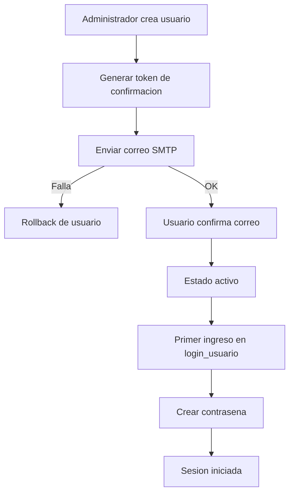

# Estructura del codigo

Fecha de actualizacion: 2026-04-13

## Objetivo
Este documento resume la estructura tecnica principal del sistema y sirve como referencia para mantenimiento y evolucion.

## Componentes principales

1. Backend (Go)
- Ruta base: backend/
- Responsabilidades:
  - Arranque de servidor y registro de rutas en main.go.
  - Logica de negocio en handlers por dominio.
  - Acceso a datos en db/.
  - Utilidades de middleware y seguridad en utils/.

2. Frontend (HTML/CSS/JS)
- Ruta base: web/
- Responsabilidades:
  - Paginas de acceso y paneles operativos.
  - Modulos por contexto (super y administrar_empresa).
  - Estilos centralizados en web/estilos.css.

3. Datos (SQLite)
- Bases:
  - backend/db/superadministrador.db
  - backend/db/empresas.db
- Criterio:
  - Superadministrador: configuraciones globales, sesiones, administradores.
  - Empresas: entidades operativas por empresa (usuarios, clientes, productos, carritos, etc.).

## Flujo de usuarios de empresa (correo + primer ingreso)

1. Un administrador de empresa crea el usuario.
2. El sistema envia correo de confirmacion.
3. Si el correo falla, el usuario se revierte y no queda registrado.
4. El usuario confirma correo desde enlace recibido.
5. Al ingresar a login_usuario por primera vez, debe crear su contrasena.
6. Desde el segundo ingreso, autentica con email + contrasena.

## Diagrama de alto nivel



## Regla de mantenimiento
Cada cambio estructural de rutas, modelos, autenticacion o base de datos debe reflejarse en este documento y en los diagramas relacionados dentro de documentos/diagramas/.

## Actualizacion 2026-04-13 (estaciones: configuracion robusta, colores centralizados y sensores)

- Frontend estaciones:
  - `web/administrar_empresa/configuracion_de_estaciones.html`:
    - centraliza la gestion de colores de estado del carrito (`color_carrito_activo`/`color_carrito_inactivo`) en esta pagina.
    - agrega parseo robusto de `estaciones_config` para tolerar configuraciones legacy serializadas.
    - mejora sincronizacion de carritos por estacion para continuar ante colisiones idempotentes por codigo/referencia/nombre.
    - valida que el `estacion_id` configurado para sensores exista dentro del rango `1..cantidad`.
  - `web/administrar_empresa/configuracion.html`:
    - retira bloque de colores de carrito para evitar duplicidad de configuracion y dejar una unica fuente operativa en estaciones.
  - `web/administrar_empresa/estaciones.html`:
    - aplica parseo robusto de configuracion y selecciona el estado mas reciente de sensor por estacion usando `last_seen`.

- QA backend de aislamiento multiempresa:
  - `backend/handlers/empresa_estacion_prefs_test.go`:
    - valida persistencia de `estaciones_config` con 10 estaciones.
    - valida aislamiento estricto por `empresa_id` en listado de preferencias.

## Actualizacion 2026-04-12 (propagacion robusta de `empresa_id` en panel administrar_empresa)

- Frontend shell:
  - `web/js/administrar_empresa.js`:
    - agrega resolucion de `empresa_id` desde URL actual, URL del parent y storage (`sessionStorage`/`localStorage`).
    - persiste contexto de empresa activa (`active_empresa_id`, `empresa_id`, `admin_empresa_id`) para iframes anidados.
    - corrige navegaciones internas de iframe que pierden `empresa_id`, reescribiendo `src` con el parámetro obligatorio.

- Frontend subpaginas operativas:
  - `web/administrar_empresa/configuracion.html`
  - `web/administrar_empresa/estaciones.html`
  - `web/administrar_empresa/configuracion_de_estaciones.html`
  - `web/administrar_empresa/inicio.html`
  - `web/administrar_empresa/auditoria.html`
  - `web/administrar_empresa/administrar_productos.html`
  - `web/administrar_empresa/sensor_puertas_mensajes.html`
    - ahora resuelven `empresa_id` desde contexto activo (URL, parent y storage), evitando falsos negativos de "empresa no seleccionada" cuando la empresa ya está abierta en el shell principal.

### Diagrama de flujo (resolucion de empresa en iframes)


## Actualizacion 2026-04-12 (login administrativo: OAuth + contrato + reCAPTCHA)

- Backend handlers:
  - `backend/handlers/auth_admin_handlers.go`:
    - `HandleGoogleLogin` fuerza `prompt=select_account consent` para evitar reutilización silenciosa de sesión Google.
    - `HandleGoogleCallback` usa `administradores.acepta_contrato` como criterio canonico y redirige a `/accept.html?payload=...` cuando falta aceptación.
  - `backend/handlers/accept_handlers.go`:
    - `AcceptCompleteHandler` valida payload cifrado, verifica reCAPTCHA en backend y solo entonces persiste aceptación + crea cookie `session_token`.
    - limpia cookie legacy `accepted_contract` para evitar señal compartida entre cuentas.

- Frontend:
  - `web/login.html` + `web/js/login.js`:
    - página exclusiva de entrada administrativa, sin modal de contrato ni auto-login.
  - `web/accept.html`:
    - pantalla dedicada para aceptar contrato y completar verificación humana.
  - `web/menu.js`:
    - se desactiva el flujo legacy de modal por querystring (no-op) para evitar doble implementación.

- QA:
  - `backend/handlers/e2e_login_acceptance_test.go` valida el flujo completo callback -> accept -> sesión -> segundo login sin contrato.
  - `backend/handlers/auth_users_carritos_test.go` valida prompt OAuth esperado.

### Diagrama de flujo (login administrativo)

```mermaid
flowchart TD
    A[login.html] --> B[/auth/google/login]
    B --> C[/auth/google/callback]
    C -->|acepta_contrato = 0| D[/accept.html?payload=...]
    D --> E[POST /accept/complete + reCAPTCHA]
    E --> F[Set acepta_contrato=1 + session_token]
    F --> G[/seleccionar_empresa.html o /super_administrador.html]
    C -->|acepta_contrato = 1| G
```

## Actualizacion 2026-04-09 (facturacion DIAN multiempresa SaaS: software compartido + credenciales por empresa)

- Backend DB:
  - `backend/db/modulos_faltantes.go`:
    - amplía `empresa_dian_configuracion` con `usar_software_compartido`, `software_id_compartido_ref` y `software_pin_compartido_ref`.
    - agrega indice `ix_dian_empresa_shared_mode` para consultas operativas del modo DIAN por empresa.

- Backend handlers:
  - `backend/handlers/modulos_faltantes.go`:
    - incorpora resolucion de software DIAN efectivo por empresa (`resolveDIANSoftwareCredentials`) con soporte a referencias seguras y fallback global por entorno (`DIAN_SHARED_SOFTWARE_ID`, `DIAN_SHARED_SOFTWARE_PIN`).
    - mantiene aislamiento multiempresa: `NIT`, `token_emisor_ref` y `certificado_clave_ref` por `empresa_id`.
    - agrega onboarding profesional por empresa con `action=guia_onboarding` y `action=validar_credenciales`.
    - agrega `action=subir_firma` para carga multipart de firma PEM y actualizacion automatica de `certificado_clave_ref` por empresa.
    - expone en respuestas `software_modo` y `software_id` efectivo para trazabilidad operacional.

- QA:
  - `backend/handlers/modulos_faltantes_test.go`:
    - agrega `TestEmpresaDIANColombiaHandlerSoftwareCompartidoMultiempresa` para validar mismo software compartido con `NIT`/token distintos por empresa.
    - agrega `TestEmpresaDIANColombiaHandlerGuiaOnboardingYValidarCredenciales` y `TestEmpresaDIANColombiaHandlerSubirFirma` para validar soporte operativo por empresa.

## Actualizacion 2026-04-09 (facturacion DIAN: envio automatizado de set de habilitacion)

- Backend handlers:
  - `backend/handlers/modulos_faltantes.go`:
    - agrega `action=enviar_set_pruebas` en `/api/empresa/facturacion_electronica/dian`.
    - automatiza distribucion por tipo documental (factura, nota debito, nota credito) y envio por lote con resumen por estado (`aceptado`, `rechazado`, `contingencia`, `pendiente`, `error`).
    - incorpora modo `simular` para validar estructura sin envio real.

- QA:
  - `backend/handlers/modulos_faltantes_test.go`:
    - agrega `TestEmpresaDIANColombiaHandlerEnviarSetPruebas` para validar envio por lote, conteo de resultados y avance de consecutivo.

## Actualizacion 2026-04-08 (alerta de inicio/reinicio de servidor)

- Backend arranque y cierre controlado:
  - `backend/main.go`:
    - registra evento operativo al iniciar (`RegisterServerStartupEvent`) usando motivo de arranque desde `PCS_SERVER_START_REASON`.
    - implementa apagado controlado por seniales (`SIGINT/SIGTERM`) y persiste motivo de parada para diferenciar cierre limpio de reinicio inesperado.

- Backend orquestacion de notificaciones runtime:
  - `backend/handlers/server_runtime_notifications.go`:
    - calcula motivo de inicio/reinicio desde estado previo (`server_runtime_state.json`) y pista de error reciente (`server.err`).
    - registra evento en DB (`super_servidor_eventos`) y en log local append-only (`server_reinicio.log`).
    - envia correo al destino configurado en `gmail.restart_alert_to` o captura notificacion en modo pruebas.

- Backend datos superadministrador:
  - `backend/db/super_servidor_eventos.go`:
    - agrega tabla `super_servidor_eventos` para trazabilidad de arranque, reinicio inesperado, correo enviado/error y metadata de runtime.

- Configuracion avanzada super:
  - `backend/handlers/usuarios_empresa.go` y `web/super/configuracion_avanzada.html`:
    - incorporan `gmail.restart_alert_to` para registrar correo destino de alertas operativas de reinicio.

- Scripts operativos:
  - `scripts/iniciar_servidor.ps1`:
    - propaga `PCS_SERVER_START_REASON=inicio_script_iniciar_servidor` para enriquecer el motivo registrado al iniciar el backend.

## Actualizacion 2026-04-08 (cifrado obligatorio de credenciales secretas en configuracion avanzada)

- Backend arranque y entorno:
  - `backend/main.go`:
    - carga variables de entorno desde `backend/.env.local` y `backend/.env` cuando no existen en el proceso.
    - asegura `CONFIG_ENC_KEY` al inicio; si no existe, la genera (32 bytes base64), la carga al proceso y la persiste en `backend/.env.local`.
    - ejecuta normalizacion de secretos para forzar cifrado en credenciales sensibles legacy almacenadas en `configuraciones`.

- Backend seguridad de respaldo/restauracion:
  - `backend/handlers/super_config_backup_handlers.go`:
    - clasifica claves sensibles (`wompi.private_key`, `wompi.integrity_key`, `gmail.smtp_app_password`, claves IA por modelo/proveedor).
    - fuerza cifrado al restaurar respaldos que traigan secretos en texto plano.
    - bloquea restauracion de secretos en texto plano si `CONFIG_ENC_KEY` no esta disponible.

- Backend exposicion segura de estado:
  - `backend/handlers/ai_config_handlers.go`, `backend/handlers/usuarios_empresa.go`, `backend/handlers/payments_handlers.go`:
    - el estado de credenciales secretas siempre se enmascara completamente (`********`), sin exponer fragmentos.

- Frontend super administrador:
  - `web/super/configuracion_avanzada.html`:
    - en el estado de DeepSeek muestra solo metadato de ultima actualizacion (fecha/hora), sin revelar fragmentos de la clave ni autor en esa linea de estado.

## Actualizacion 2026-04-08 (chat/tareas: documentos/fotos y actor usuario-admin)

- Backend handlers:
  - `backend/handlers/chat_tareas.go`:
    - resuelve actor autenticado por empresa (`usuario`, `admin` o `sistema`) para mensajes, adjuntos y tareas.
    - evita suplantacion de autor (`autor_tipo`, `autor_ref_id`, `autor_nombre`, `autor_email`) usando identidad de sesion.
    - auto-registra al emisor como participante de la conversacion para mantener trazabilidad colaborativa.
    - al crear conversaciones desde usuario, agrega automaticamente al administrador propietario de la empresa (`empresas.usuario_creador`) como participante `admin`.
    - amplía whitelist de adjuntos con formatos documentales de oficina (`doc/docx/xls/xlsx/ppt/pptx/rtf/odt/ods/odp`).

- Frontend:
  - `web/administrar_empresa/chat_y_tareas.html`:
    - amplía `accept` de archivos para documentos y fotos.
    - deriva actor de sesion y envía metadata de autor coherente para mensajes/adjuntos.
    - clasifica burbuja propia por actor efectivo en sesion.

- QA:
  - `backend/handlers/chat_tareas_test.go` (nuevo):
    - cubre autor `usuario` derivado en mensajes.
    - cubre upload de adjunto `.docx`.
    - cubre inclusion automatica de participantes usuario-admin en creacion de conversacion.

## Actualizacion 2026-04-08 (configuracion monetaria y numerica por empresa)

- Backend DB:
  - `backend/db/empresa_configuracion_avanzada.go`:
    - amplía `empresa_configuracion_avanzada` con `moneda_codigo`, `sistema_numerico`, `usar_decimales`, `cantidad_decimales`.
    - agrega normalizacion de moneda, sistema numerico y precision decimal en `Get/UpsertEmpresaConfiguracionAvanzada`.
  - `backend/db/carritos_compras.go`:
    - al crear carrito, hereda `moneda_codigo` configurada por empresa cuando el payload no envia moneda explicita.

- Integracion de arranque/migraciones:
  - `backend/main.go`:
    - registra migracion `2026-04-08-030-configuracion-monetaria-numerica`.

- Frontend:
  - `web/administrar_empresa/configuracion.html`:
    - agrega tarjeta de configuracion para moneda operativa, sistema numerico, uso de decimales y cantidad de digitos.
    - integra guardado/carga sobre `/api/empresa/configuracion_avanzada`.

## Actualizacion 2026-04-08 (chat/tareas con notas de voz + permisos por licencia)

- Backend DB:
  - `backend/db/chat_tareas.go`:
    - amplía tabla `chat_tareas` con `nota_voz_url`, `nota_voz_mime_type`, `nota_voz_tamano_bytes`, `nota_voz_duracion_segundos`.
    - agrega `SetChatTareaNotaVoz` para actualizar nota de voz por tarea y `empresa_id`.
  - `backend/db/db.go`:
    - amplía modelo/CRUD de `licencias` con `modulos_habilitados` y `super_rol_habilitado`.
    - agrega `GetLicenciaPermisoPolicyByEmpresa` para resolver política activa de licencia por empresa.

- Backend handlers/rutas:
  - `backend/handlers/chat_tareas.go`:
    - agrega endpoint `POST /api/empresa/chat_tareas/tareas/nota_voz` para upload de nota de voz por tarea.
  - `backend/handlers/empresa_permisos.go`:
    - aplica restricciones por licencia en middleware (módulos habilitados).
    - calcula `rol_efectivo` (supervisor con `super_rol_habilitado` => capacidades de `admin_empresa`).
    - amplía respuesta de `/api/empresa/permisos_contexto` con bloque `licencia` y `rol_efectivo`.
  - `backend/main.go`:
    - registra ruta `/api/empresa/chat_tareas/tareas/nota_voz`.
    - actualiza bootstrap de `licencias` y registra migración `2026-04-08-004-licencias-permisos-superrol`.

- Frontend:
  - `web/administrar_empresa/chat_y_tareas.html`:
    - agrega grabación de voz (MediaRecorder) para mensajes y tareas.
    - integra upload de nota de voz de tarea y reproducción en lista de tareas.
  - `web/super/licencias.html`:
    - agrega configuración de módulos por licencia y bandera de super rol.
  - `web/administrar_empresa/inicio.html`:
    - agrega accesos directos dinámicos por permisos efectivos/licencia.
  - `web/estilos.css`:
    - agrega estilos de notas de voz, configuración de licencia por módulos y accesos directos de inicio.

## Actualizacion 2026-04-08 (modulo soporte remoto empresarial)

- Backend DB:
  - `backend/db/soporte_remoto.go` (nuevo):
    - agrega `EnsureEmpresaSoporteRemotoSchema`.
    - crea tablas `empresa_soporte_remoto_configuracion`, `empresa_soporte_remoto_dispositivos` y `empresa_soporte_remoto_sesiones`.
    - implementa flujo de dispositivos por empresa, validacion de acceso por PIN hash, heartbeat de agente y sesiones con token temporal de visualizacion.

- Backend handlers:
  - `backend/handlers/soporte_remoto.go` (nuevo):
    - expone endpoint empresarial `/api/empresa/soporte_remoto` para configuracion, dispositivos, sesiones, aprobacion/finalizacion y resolver visualizacion.
    - expone endpoint publico `/api/public/soporte_remoto` para heartbeat y actualizacion de estado de sesion por agente/plugin.

- Integracion de arranque/rutas:
  - `backend/main.go`:
    - ejecuta `EnsureEmpresaSoporteRemotoSchema` en bootstrap.
    - registra migracion `2026-04-08-029-soporte-remoto-empresa`.
    - registra rutas `/api/empresa/soporte_remoto` y `/api/public/soporte_remoto`.
  - `backend/utils/utils.go`:
    - habilita acceso publico a `/api/public/soporte_remoto`.

- Seguridad y menu empresa:
  - `backend/handlers/empresa_permisos.go`:
    - agrega `linkSoporteRemoto` al catalogo de paginas con modulo `seguridad` y accion `A`.
  - `web/administrar_empresa.html` y `web/js/administrar_empresa.js`:
    - agregan el enlace lateral `Soporte remoto` y su control de visibilidad por permisos.

- Frontend:
  - `web/administrar_empresa/soporte_remoto.html` (nuevo):
    - panel operativo para configuracion, dispositivos, sesiones y exportes multiformato.
  - `web/administrar_empresa/soporte_remoto_view.html` (nuevo):
    - visor embebido con resolucion por `empresa_id + codigo_sesion + token`.

## Actualizacion 2026-04-08 (modulo venta digital global: super + publico)

- Backend DB:
  - `backend/db/venta_digital.go` (nuevo):
    - agrega `EnsureSuperVentaDigitalSchema` en `superadministrador.db`.
    - crea tablas `super_venta_digital_configuracion`, `super_venta_digital_items` y `super_venta_digital_ordenes`.
    - implementa ciclo de orden digital con estado de pago, referencia externa, transaction id y trazabilidad de entrega por correo.

- Backend handlers:
  - `backend/handlers/venta_digital.go` (nuevo):
    - expone endpoint super `/super/api/venta_digital` para configuracion de tienda, CRUD de catalogo, uploads y consulta de ordenes.
    - expone endpoint publico `/api/public/venta_digital` para catalogo, creacion de pago Wompi/Nequi y consulta de estado.
    - implementa entrega por correo de licencia e instrucciones cuando el pago pasa a `aprobado`.
  - `backend/handlers/payments_handlers.go`:
    - extiende `WompiWebhookHandler` para sincronizar ordenes del modulo digital y disparar la entrega automatica.

- Integracion de arranque/rutas:
  - `backend/main.go`:
    - ejecuta `EnsureSuperVentaDigitalSchema` en bootstrap.
    - registra migracion `2026-04-08-003-venta-digital-super`.
    - registra rutas `/super/api/venta_digital` y `/api/public/venta_digital`.
  - `backend/utils/utils.go`:
    - habilita acceso publico a `/venta_digital.html` y `/api/public/venta_digital`.

- Frontend:
  - `web/super/venta_digital.html` (nuevo):
    - panel super para configuracion, publicacion de productos digitales y seguimiento de ordenes.
  - `web/venta_digital.html` (nuevo):
    - tienda publica para compra directa con Wompi, correo obligatorio antes de pagar y consulta de estado de orden.
  - `web/menu.js`, `web/super_administrador.html`, `web/super/configuracion_avanzada.html`:
    - incorporan enlaces operativos al modulo de venta digital.

## Actualizacion 2026-04-08 (inicio de implementacion: permisos dinamicos por rol)

- Backend DB:
  - `backend/db/roles_permisos_usuario.go` (nuevo):
    - agrega `EnsureRolesPermisosSchema` para crear tablas `roles_de_usuario_permisos` y `roles_de_usuario_paginas_permisos` en `superadministrador.db`.
    - agrega consultas para resolver overrides por `rol_id` y por nombre de rol, con fallback seguro cuando la tabla aun no existe.
    - agrega reemplazo transaccional de matriz de permisos por rol (`ReplaceRolPermisosDeUsuario`).

- Backend handlers:
  - `backend/handlers/empresa_permisos.go`:
    - extiende `GET /api/empresa/permisos_contexto` para devolver `paginas` (mapa de visibilidad por clave de pagina).
    - agrega aplicacion de overrides dinamicos por rol en middleware (`roleAllowsModuleActionWithOverrides`).
    - mantiene politica base hardcodeada como fallback de seguridad (deny-by-default por accion no definida).
  - `backend/handlers/roles_tipos_usuario.go`:
    - agrega endpoint `GET/PUT /super/api/roles_de_usuario/permisos` para consultar/guardar matriz de permisos por rol.

- Integracion de arranque/rutas:
  - `backend/main.go`:
    - inicializa esquema de permisos dinamicos de roles al arranque.
    - registra migracion `2026-04-08-002-roles-permisos-dinamicos`.
    - registra ruta super `/super/api/roles_de_usuario/permisos`.

- Frontend:
  - `web/super/permisos_rol.html` (nuevo):
    - nueva pantalla para configurar permisos de modulo/accion y visibilidad de paginas por rol.
  - `web/super_administrador.html`:
    - agrega acceso de menu a `Permisos por rol`.
  - `web/super/roles_de_usuario.html`:
    - agrega accion directa `Permisos` por cada rol del listado.
  - `web/js/administrar_empresa.js`:
    - aplica prioridad a `permissionContext.paginas` para mostrar/ocultar enlaces del menu empresa por pagina.

## Actualizacion 2026-04-08 (backups empresariales: depuracion por fecha)

- Backend DB:
  - `backend/db/backups_empresariales.go`:
    - agrega `PurgeEmpresaDataByDateCorte` para eliminar registros por `empresa_id` con fecha <= `fecha_corte` (inclusive), usando tablas elegibles del modulo de backups.
    - incorpora resolucion de columna de fecha por tabla y resumen detallado de registros eliminados por tabla.

- Backend handlers:
  - `backend/handlers/backups_empresariales.go`:
    - agrega accion `depurar_fecha` en `/api/empresa/backups`.
    - valida `fecha_corte`, soporta `include_tables`/`exclude_tables` y crea backup previo opcional antes de ejecutar la depuracion.
  - `backend/handlers/empresa_permisos.go`:
    - clasifica `depurar_fecha|purgar_fecha|eliminar_hasta_fecha|depurar_hasta_fecha` como `permActionApprove` en modulo seguridad.

- Frontend:
  - `web/administrar_empresa/backups.html`:
    - agrega seccion "Depurar informacion por fecha" con selector de fecha de corte, filtros de tablas y confirmacion de ejecucion.

## Actualizacion 2026-04-07 (cierre modulo 37: venta publica + Wompi por empresa)

- Backend DB:
  - `backend/db/venta_publica.go` (nuevo):
    - agrega `EnsureEmpresaVentaPublicaSchema`.
    - crea tablas `empresa_venta_publica_configuracion`, `empresa_venta_publica_items` y `empresa_venta_publica_ordenes`.
    - implementa CRUD/listados de configuracion e items, resolucion por slug y ciclo de orden publica con trazabilidad de pago.

- Backend handlers:
  - `backend/handlers/venta_publica.go` (nuevo):
    - agrega endpoint empresarial `GET/POST/PUT/PATCH/DELETE /api/empresa/venta_publica` (catalogo, configuracion, ordenes, upload de imagen).
    - agrega endpoint publico `GET/POST /api/public/venta_publica` para catalogo, crear pago Nequi por Wompi y consultar estado de orden.
    - resuelve credenciales sensibles por referencia segura (`env:`, `file:`, `base64:`) para llaves privadas/integridad Wompi.

- Integracion en arranque/rutas:
  - `backend/main.go`:
    - ejecuta `EnsureEmpresaVentaPublicaSchema` durante bootstrap.
    - registra migracion `2026-04-07-028-venta-publica-wompi`.
    - registra rutas `/api/empresa/venta_publica` y `/api/public/venta_publica`.
    - agrega rewrite de ruta amigable `/{slug}/venta_publica.html` hacia `venta_publica.html`.
  - `backend/utils/utils.go`:
    - habilita acceso publico a `venta_publica.html`, `/{slug}/venta_publica.html`, `/api/public/venta_publica` y `/uploads/`.

- Frontend:
  - `web/administrar_empresa/venta_publica.html` (nuevo):
    - UI de administracion empresarial para configurar tienda publica, catalogo, upload de imagen y consulta de ordenes.
  - `web/venta_publica.html` (nuevo):
    - vitrina publica para clientes finales con carrito ligero, creacion de pago y consulta de estado.
  - `web/administrar_empresa.html` y `web/js/administrar_empresa.js`:
    - agregan `linkVentaPublica` con control de visibilidad por permisos del modulo ventas.

- Validacion tecnica:
  - `go test ./... -run "^$" -count=1` -> compilacion global backend OK.

## Actualizacion 2026-04-07 (cierre modulo 36: backups empresariales por empresa)

- Backend DB:
  - `backend/db/backups_empresariales.go`:
    - agrega `EnsureEmpresaBackupsSchema` con tablas `empresa_backups` y `empresa_backups_restauraciones`.
    - implementa construccion de snapshot empresarial (`BuildEmpresaBackupPayload`) sobre tablas con `empresa_id`.
    - implementa flujo completo de respaldo/restauracion: `CreateEmpresaBackupSnapshot`, `ListEmpresaBackups`, `GetEmpresaBackupPayloadByID`, `RestoreEmpresaBackupByID`, `SetEmpresaBackupEstadoByID`.
    - incorpora trazabilidad de hash (`hash_contenido`), alcance/version de snapshot y metadata operativa.
  - `backend/db/backups_empresariales_test.go`:
    - agrega `TestEmpresaBackupsSnapshotYRestoreFlow` y `TestEmpresaBackupsListYPayload`.

- Backend handlers:
  - `backend/handlers/backups_empresariales.go` (nuevo):
    - agrega endpoint empresarial `GET/POST/PUT/PATCH/DELETE /api/empresa/backups`.
    - acciones principales: `listar`, `crear`, `detalle`, `export`, `restaurar`, `activar/desactivar`.
    - soporta exportacion de payload completo en `json` y resumen multiformato (`csv/txt/xls/pdf`) conservando estructura y totales.
  - `backend/handlers/backups_empresariales_test.go`:
    - agrega `TestEmpresaBackupsHandlerCreateListExportRestoreYToggle` y `TestEmpresaBackupsHandlerRestoreNotFound`.
  - `backend/handlers/empresa_permisos.go`:
    - clasifica `restaurar/restore` como accion de aprobacion (`permActionApprove`) para endurecer control del modulo.

- Integracion en arranque/rutas:
  - `backend/main.go`:
    - ejecuta `EnsureEmpresaBackupsSchema` durante bootstrap.
    - registra migracion `2026-04-07-027-backups-empresariales`.
    - registra ruta protegida `/api/empresa/backups` bajo wrapper de permisos empresariales.

- Frontend empresa:
  - `web/administrar_empresa/backups.html` (nuevo):
    - incorpora UI para crear snapshots, listar historial, consultar detalle, exportar y restaurar backups por `empresa_id`.
  - `web/administrar_empresa.html` y `web/js/administrar_empresa.js`:
    - agregan enlace lateral `linkBackups` y su mapeo de permisos en modulo seguridad.
  - `web/estilos.css`:
    - agrega estilos `backups-*` para tabla, filtros, resumen y detalle responsive.

## Actualizacion 2026-04-07 (cierre modulo 35: limites por cliente + permisos finos + auditoria ampliada)

- Backend DB:
  - `backend/db/creditos.go`:
    - agrega `empresa_creditos_clientes_limites` y operaciones `Get/List/Upsert/SetEstado` para limites de credito por `empresa_id + cliente_id`.
    - incorpora validacion de limites por cliente en `CreateEmpresaCredito` y `UpdateEmpresaCredito` (tope de saldo total y maximo de creditos activos).
  - `backend/db/creditos_test.go`:
    - agrega `TestEmpresaCreditosClienteLimitesBloqueaExceso` y `TestEmpresaCreditosClienteLimitesCRUD`.

- Backend handlers:
  - `backend/handlers/creditos.go`:
    - agrega acciones `limites_cliente`, `limite_cliente`, `upsert_limite_cliente` y `eliminar_limite_cliente` en `/api/empresa/creditos`.
    - agrega validacion de permiso fino por `tipo_solicitud` de workflow en aprobacion/rechazo.
    - amplia auditoria no bloqueante para workflow de creditos, operaciones de limites y denegaciones por permiso fino.
  - `backend/handlers/creditos_test.go`:
    - agrega `TestEmpresaCreditosHandlerLimitesClienteYBloqueo` y `TestEmpresaCreditosHandlerWorkflowPermisoFinoPorTipo`.

## Actualizacion 2026-04-07 (avance modulo 35: creditos y cartera)

- Backend DB:
  - `backend/db/creditos.go` (nuevo):
    - agrega `EnsureEmpresaCreditosSchema` con tablas `empresa_creditos`, `empresa_creditos_cuotas` y `empresa_creditos_movimientos`.
    - agrega operaciones de negocio: creacion de credito, generacion automatica de cuotas, registro de abonos, consulta de estado de cuenta y resumen de cartera.
    - agrega dashboard de morosidad con alertas de proximos a vencer, vencidos y ranking (`GetEmpresaCreditosMoraDashboard`).
    - agrega workflow avanzado (`empresa_creditos_workflow`) para solicitud/aprobacion/rechazo/ejecucion de `reverso_abono` y `refinanciacion`, incluyendo historial de aprobaciones y resultado de ejecucion.
    - ajusta generacion de cuotas de refinanciacion para evitar colisiones de `numero_cuota` con historial existente.
  - `backend/db/eventos_contables.go`:
    - extiende contrato contable con modulo `creditos` y evento `credito_abono_registrado`.
    - agrega plantilla de lineas para abono de credito (caja/bancos, cartera de creditos, intereses y mora) para generacion de asientos canonicos.
  - `backend/db/creditos_test.go` (nuevo):
    - agrega `TestEmpresaCreditosFlowCrearCuotasAbonoYResumen`.
    - agrega `TestEmpresaCreditosMoraDashboard`.
    - agrega `TestEmpresaCreditosWorkflowReversoAprobadoEjecutaReversion`.
    - agrega `TestEmpresaCreditosWorkflowRefinanciacionAprobadaRegeneraCuotas`.
  - `backend/db/eventos_contables_test.go`:
    - agrega `TestProcessEmpresaEventosContablesPendientesCreditoAbonoGeneraLineasCartera`.

- Backend handlers:
  - `backend/handlers/creditos.go` (nuevo):
    - agrega endpoint empresarial `GET/POST/PUT/PATCH/DELETE /api/empresa/creditos`.
    - acciones principales: `cuotas`, `movimientos`, `estado_cuenta`, `resumen_cartera`, `reporte`, `abono`, `estado`, `activar/desactivar`.
    - agrega acciones de morosidad: `alertas`, `alertas_mora`, `morosidad`, `ranking_morosidad`.
    - agrega acciones de workflow: `workflows`, `solicitar_reverso`, `solicitar_refinanciacion`, `aprobar_workflow`, `rechazar_workflow`.
    - extiende `action=reporte` con `tipo=morosidad` para exportes multiformato de alertas/ranking.
    - integra `action=abono` con evento contable `creditos.credito_abono_registrado` y politica de asientos automaticos (`procesar_asientos`, `asientos_limit`, `max_reintentos`).
    - clasifica trazabilidad de canal de pago por abono (`caja`, `bancos`, `pasarela`).
    - mantiene exportacion multiformato consistente (`json/csv/txt/xls/pdf`).
  - `backend/handlers/empresa_permisos.go`:
    - clasifica aprobacion/rechazo de workflow de creditos como accion de aprobacion en modulo finanzas (`permActionApprove`).
  - `backend/handlers/creditos_test.go` (nuevo):
    - agrega `TestEmpresaCreditosHandlerFlujoBasico`.
    - agrega `TestEmpresaCreditosHandlerAlertasMoraYReporte`.
    - agrega `TestEmpresaCreditosHandlerAbonoIntegraContabilidadYAsientos`.
    - agrega `TestEmpresaCreditosHandlerWorkflowReversoSolicitudYAprobacion`.

- Integracion en arranque/rutas:
  - `backend/main.go`:
    - ejecuta `EnsureEmpresaCreditosSchema` durante bootstrap.
    - registra migracion `2026-04-07-026-creditos-cartera`.
    - registra ruta protegida `/api/empresa/creditos` bajo wrapper de permisos de finanzas.

- Frontend empresa (fase base):
  - `web/administrar_empresa/creditos.html` (nuevo):
    - incorpora flujo de creacion de creditos, consulta de cartera y resumen operativo por `empresa_id`.
    - incorpora panel de abonos, estado de cuenta (cuotas + movimientos) y exportacion multiformato.
    - incorpora panel de alertas/ranking de morosidad con filtros (`dias_proximos`, `top`) y exportacion de reporte de morosidad.
    - incorpora acciones de operacion rapida desde tabla (prefill de abono, estado de credito y activar/desactivar fila).
  - `web/administrar_empresa.html`:
    - agrega enlace lateral `linkCreditos` para navegacion directa al modulo.
  - `web/js/administrar_empresa.js`:
    - agrega `linkCreditos` al arreglo de links y al catalogo de permisos del menu.
    - aplica visibilidad por rol usando modulo `finanzas` y accion `C`.
  - `web/estilos.css`:
    - agrega estilos `creditos-*` para filtros, tarjetas de resumen, panel de alertas/ranking y detalle responsive.

## Actualizacion 2026-04-07 (cierre modulo 34: calculadora empresarial persistente)

- Backend DB:
  - `backend/db/calculadora_operativa.go`:
    - agrega `EnsureEmpresaCalculadoraSchema` con tablas `empresa_calculadora_configuracion` y `empresa_calculadora_operaciones`.
    - agrega capa de configuracion por empresa para integraciones opcionales (`integrar_carritos`, `integrar_cotizaciones`).
    - agrega historial operativo con etiquetas, asociaciones cliente/documento, referencias de carrito/cotizacion y filtros por rango/usuario.
  - `backend/db/calculadora_operativa_test.go`:
    - agrega `TestEmpresaCalculadoraConfiguracionYHistorialFlow`.

- Backend handlers:
  - `backend/handlers/calculadora_operativa.go`:
    - expone endpoint `/api/empresa/calculadora` con acciones `config`, `referencias`, `export`, `limpiar`, `activar/desactivar`.
    - valida asociaciones de `carrito_id`/`cotizacion_id` segun configuracion de la empresa.
    - reutiliza exportador multiformato para trazabilidad homogénea (`json/csv/txt/xls/pdf`).
  - `backend/handlers/calculadora_operativa_test.go`:
    - agrega `TestEmpresaCalculadoraHandlerConfigOperacionesFiltrosYExport`.

- Integracion en arranque/rutas:
  - `backend/main.go`:
    - ejecuta `EnsureEmpresaCalculadoraSchema` durante bootstrap.
    - registra migracion `2026-04-07-025-calculadora-operativa`.
    - registra ruta protegida `GET/POST/PUT/DELETE /api/empresa/calculadora` con wrapper de permisos de finanzas.

- Frontend empresa:
  - `web/administrar_empresa/calculadora.html`:
    - migra de historial local (`localStorage`) a historial API por empresa.
    - agrega configuracion de integraciones, metadata de operacion (etiquetas/cliente/documento), referencias de carrito/cotizacion y filtros de historial/exportacion.
  - `web/estilos.css`:
    - agrega estilos `calc-config-row`, `calc-meta-grid` y `calc-filter-row` para el nuevo flujo de captura/consulta.

## Actualizacion 2026-04-07 (cierre modulo 32: graficos y estadisticas)

- Backend de graficos:
  - `backend/handlers/graficos_estadisticas.go`:
    - incorpora cache en memoria por combinacion de `empresa_id`, rango, `top`, `max_points`, filtros y comparativo.
    - incorpora filtros avanzados `sucursal_id`, `estacion_id`, `segmento` con respuesta de cobertura por componente (`filtros.cobertura`).
    - incorpora comparativo entre periodos (`comparar`, `comparar_desde`, `comparar_hasta`) con metricas de variacion por KPI.
    - incorpora compactacion por buckets para series largas de ventas/finanzas/compras/asistencia, evitando recorte simple por cola.

- Pruebas backend:
  - `backend/handlers/graficos_estadisticas_test.go`:
    - agrega `TestEmpresaGraficosEstadisticasHandlerFiltrosComparativoYCache` para validar cache hit/miss, filtros avanzados y comparativo de periodos.

- Frontend de graficos:
  - `web/administrar_empresa/graficos_estadisticas.html`:
    - agrega controles de `sucursal_id`, `estacion_id`, `segmento`, `comparar`, `comparar_desde`, `comparar_hasta` y refresco sin cache.
    - agrega tarjetas de comparativo con variacion absoluta y porcentual por metrica.
  - `web/estilos.css`:
    - agrega estilos de comparativo/tendencia y ajustes responsive para filtros avanzados y panel de variaciones.

## Actualizacion 2026-04-07 (avance tecnico modulo 28: conciliacion bancaria automatica)

- Backend finanzas (extractos y conciliacion):
  - `backend/db/finanzas.go`:
    - agrega tabla `empresa_finanzas_bancos_movimientos` para extractos bancarios por empresa con hash idempotente y estado de conciliacion.
    - agrega indices operativos por empresa/periodo/estado de conciliacion.
  - `backend/db/finanzas_conciliacion_bancaria.go` (nuevo):
    - agrega importacion idempotente de extractos (`UpsertEmpresaFinanzasMovimientosBancarios`).
    - agrega motor de conciliacion bancaria automatica por tolerancia de dias/monto (`ConciliarEmpresaMovimientosBancariosAutomatico`).
    - agrega tablero de desviaciones por periodo (`GetEmpresaConciliacionBancariaPorPeriodo`).
  - `backend/handlers/finanzas.go`:
    - extiende `/api/empresa/finanzas/movimientos` con acciones:
      - `action=importar_extractos_bancarios` (POST, con opcion `auto_conciliar`).
      - `action=conciliar_bancaria_auto` (PUT).
      - `action=conciliacion_bancaria` y `action=conciliacion_bancaria_export` (GET).
      - `action=extractos_bancarios` (GET).
    - incorpora exportacion de desviaciones en `json/csv/txt/xls/pdf` usando el motor de exportes existente.
  - `backend/handlers/empresa_permisos.go`:
    - clasifica conciliacion bancaria automatica como accion de aprobacion en modulo finanzas.

- Pruebas:
  - `backend/db/finanzas_test.go`:
    - agrega `TestEmpresaFinanzasConciliacionBancariaAutomatica`.
  - `backend/handlers/eventos_contables_modulos_test.go`:
    - agrega `TestEmpresaFinanzasMovimientosHandlerConciliacionBancariaAutomatica`.

## Actualizacion 2026-04-07 (cierre modulo 28: politicas de cierre/reapertura con evidencia de autorizacion)

- Backend finanzas (periodos contables):
  - `backend/handlers/finanzas.go`:
    - en `PUT /api/empresa/finanzas/periodos?action=cerrar|reabrir` exige `autorizado_por`, `motivo_autorizacion` y `evidencia_autorizacion`.
    - incorpora trazabilidad en observaciones del cierre/reapertura y en el payload del evento contable (`policy_autorizacion`, `autorizado_por`, `motivo_autorizacion`, `evidencia_autorizacion`, `codigo_autorizacion`, `ejecutado_por`).
    - retorna bloque `autorizacion` en la respuesta HTTP para auditoria operativa.

- Pruebas:
  - `backend/handlers/eventos_contables_modulos_test.go`:
    - actualiza `TestEmpresaFinanzasEmiteEventosContables` para validar evidencia en payload de `periodo_contable_cerrado`.
    - agrega `TestEmpresaFinanzasPeriodosRequiereEvidenciaAutorizacion` para validar rechazo (`400`) sin evidencia obligatoria.

## Actualizacion 2026-04-07 (avance modulo 29: retencion de auditoria por modulo y severidad)

- Backend auditoria:
  - `backend/db/auditoria_empresa.go`:
    - aplica politica automatica de `retencion_dias` por combinacion de `modulo` y `severidad` cuando no se define retencion explicita en el evento.
    - infiere severidad desde metadata, `resultado` y `codigo_http` para mantener coherencia operativa en errores y acciones criticas.
    - conserva prioridad para `retencion_dias` explicita cuando el flujo la provee.
    - enriquece `metadata_json` del evento con trazabilidad de politica aplicada.

- Pruebas:
  - `backend/db/auditoria_empresa_test.go`:
    - agrega `TestCreateEmpresaAuditoriaEventoAplicaPoliticaRetencionPorModuloYSeveridad`.
    - agrega `TestCreateEmpresaAuditoriaEventoMantieneRetencionExplicita`.

## Actualizacion 2026-04-07 (cierre modulo 29: busqueda full-text y exportacion forense)

- Backend auditoria:
  - `backend/db/auditoria_empresa.go`:
    - agrega busqueda `search` full-text sobre eventos de auditoria usando FTS en SQLite, con fallback por `LIKE` para entornos sin FTS5.
    - inicializa objetos de busqueda (`empresa_auditoria_eventos_fts` + triggers de sync + backfill) para mantener indexacion consistente al crear/editar/eliminar eventos.
    - integra la estrategia FTS/fallback en listado y conteo con filtros avanzados y paginacion.
  - `backend/handlers/auditoria_empresa.go`:
    - extiende `GET /api/empresa/auditoria/eventos` con `action=export_forense|forense_export|cadena_custodia`.
    - incorpora exportacion forense en `json/csv` con cadena de custodia basica (`hash_registro`, `hash_cadena`, `hash_global`).

- Pruebas:
  - `backend/db/auditoria_empresa_test.go`:
    - agrega `TestListEmpresaAuditoriaEventosSearchFullTextConFiltros`.
  - `backend/handlers/auditoria_empresa_test.go`:
    - agrega `TestEmpresaAuditoriaEventosHandlerExportForenseJSONYCSV`.

## Actualizacion 2026-04-07 (cierre modulo 30: seguridad y permisos)

- Backend seguridad/permisos:
  - `backend/handlers/empresa_permisos.go`:
    - incorpora validacion de evidencia de aprobacion para cambios criticos de permisos en modulo seguridad (`/api/empresa/usuarios`).
    - exige `aprobado_por` y `codigo_aprobacion` antes de ejecutar cambios de permisos y propaga cabeceras de trazabilidad de aprobacion.
  - `backend/handlers/auditoria_empresa.go`:
    - agrega metadata de aprobacion en auditoria automatica (`permission_approval_required`, `permission_approved_by`, `permission_approval_code`, `permission_approval_reason`).

- Pruebas:
  - `backend/handlers/empresa_permisos_test.go`:
    - agrega validacion de matriz completa `rol/modulo/accion` para `include_matrix=1`.
    - agrega cobertura de bloqueo sin evidencia de aprobacion y exito con trazabilidad de aprobacion + metadata de auditoria.
  - `backend/main_empresa_routes_security_test.go`:
    - agrega barrido deny-by-default de rutas `/api/empresa/*` para validar wrappers obligatorios y acotar `WithEmpresaPublicScope`.

## Actualizacion 2026-04-07 (cierre tecnico modulo 27: Ventas simples por estacion)

- Backend ventas simples y metricas:
  - `backend/db/carritos_compras.go`:
    - agrega tabla `empresa_ventas_estacion_metricas` para historial operativo por estacion (`venta_pagada`, `cierre_parcial_anulado`, `sesion_recuperada`).
    - agrega `RecordCarritoStationMetric` y `ListCarritoStationMetricSummary` para registrar y consultar rendimiento por estacion.
    - agrega utilidades de identidad de estacion desde carrito y calculo de duracion de atencion (`ResolveCarritoStationIdentity`, `ResolveCarritoAttentionDurationSeconds`).
  - `backend/handlers/carritos_compras.go`:
    - agrega `GET /api/empresa/carritos_compra?action=metricas_estacion` con filtros por `empresa_id`, `estacion_id`, `days` y `limit`.
    - registra metricas en `pagar_estacion`, `anular_cierre_parcial` y `recuperar_interrumpido`.

- Frontend de estacion:
  - `web/administrar_empresa/ventas_simple.html`:
    - migra logica de negocio a script dedicado y agrega barra de estado de sincronizacion, panel de metricas y bloque de correccion post-cobro.
  - `web/js/ventas_simple.js` (nuevo):
    - implementa operacion offline por estacion con cola local y checksum SHA-256 para verificacion de integridad.
    - implementa sincronizacion segura manual/automatica al recuperar red, con reconciliacion de items sobre carrito servidor.
    - integra flujo de correccion post-cobro y consumo de metricas por estacion.
  - `web/estilos.css`:
    - agrega estilos para estado de sincronizacion (`en linea`, `offline`, `sincronizando`) y visualizacion de metricas operativas.

- Pruebas de cierre modulo 27:
  - `backend/handlers/auth_users_carritos_test.go`:
    - agrega `TestEmpresaCarritosCompraMetricasEstacionIncluyeCorrecciones` para validar venta pagada + correccion post-cobro + consulta de metricas.

## Actualizacion 2026-04-07 (cierre tecnico modulo 25: Panel ERP extendido)

- Frontend ERP por dominio:
  - `web/js/modulos_erp_extendido.js`:
    - incorpora motor de formulario guiado por modulo usando plantilla dinamica por endpoint ERP.
    - incorpora validaciones dinamicas por tipo de campo (texto, numero, fecha, email, select) y reglas cruzadas de negocio.
    - incorpora acciones rapidas parametrizadas por modulo (detalle, activar/desactivar, transiciones, utilidades de dominio y DIAN).
    - incorpora guia operativa por dominio con flujo recomendado y controles clave de operacion.
  - `web/administrar_empresa/modulos_erp_dominio.html`:
    - consolida layout operativo con secciones de guiado, acciones rapidas, guia de dominio y modo JSON avanzado opcional.
  - `web/estilos.css`:
    - agrega estilos para grilla guiada, errores en linea, panel de validacion y tarjetas de guia, con adaptacion responsive.

- Flujo funcional actualizado del modulo 25:
  1) Usuario selecciona dominio y modulo ERP.
  2) Sistema renderiza formulario guiado y acciones rapidas segun metadata del modulo.
  3) Validaciones dinamicas bloquean envios invalidos y muestran errores contextualizados.
  4) Operador puede ejecutar CRUD guiado o sincronizar payload al modo JSON avanzado para casos especiales.
  5) Guia operativa del dominio orienta el uso diario con controles de consistencia.

## Actualizacion 2026-04-07 (cierre tecnico modulo 26: Carritos de compra e items)

- Backend carritos y concurrencia multiestacion:
  - `backend/db/carritos_compras.go`:
    - agrega timeout SQLite y reintentos transaccionales (`withCarritoTxRetry`) para operaciones de items, reforzando control de stock bajo alta concurrencia multiestacion.
    - agrega `RecoverInterruptedCarritoSession` para recuperar sesiones interrumpidas sin perder items.
    - agrega `CancelCarritoPartialClosure` para anulacion parcial de cierre en ventas pagadas.
  - `backend/handlers/carritos_compras.go`:
    - agrega `action=recuperar_interrumpido` con registro en eventos contables y auditoria empresarial.
    - agrega `action=anular_cierre_parcial` con validacion de monto y trazabilidad por carrito.

- Frontend de estacion:
  - `web/administrar_empresa/carrito_de_compras.html`:
    - ajusta activacion de estacion para recuperar carritos interrumpidos sin reset de items.
    - mantiene `reset_items=1` para reinicio de sesiones pagadas, evitando perdida de informacion en interrupciones no pagadas.

- Pruebas de cierre modulo 26:
  - `backend/db/carritos_inventario_test.go`: agrega casos de concurrencia de producto, recuperacion de carrito interrumpido y anulacion parcial de cierre.
  - `backend/handlers/auth_users_carritos_test.go`: agrega casos HTTP para recuperacion con auditoria, validacion de pago mixto y anulacion parcial con auditoria.

## Actualizacion 2026-04-07 (cierre tecnico modulo 24: Documental e Integraciones)

- Backend documental:
  - `backend/handlers/modulos_faltantes.go`:
    - reemplaza la ruta generica de `documentos/gestion` por `EmpresaDocumentosGestionHandler`.
    - agrega `action=versionar` para crear versiones documentales con trazabilidad de origen y version previa historica.
    - agrega `action=versiones` para consultar historial versionado por `documento_codigo`.
    - agrega `action=repositorio` y `action=acceso` para control de acceso por rol/modulo documental.
    - reemplaza la ruta generica de `documentos/firmas` por `EmpresaDocumentosFirmasHandler` con validacion de acceso (`action=acceso`).

- Backend integraciones:
  - `backend/handlers/modulos_faltantes.go`:
    - amplía `empresaModuloIntegracionesCRUDHandler` con `action=rotar_credencial` para rotacion de referencias seguras (`env:`, `vault:`, `secret:`, etc.) sin almacenar secretos planos.
    - agrega `action=monitoreo`/`action=alertas` para sondeo de conectividad, latencia, estado y antiguedad de sincronizacion por conector.

- Seguridad y permisos:
  - `backend/handlers/empresa_permisos.go`:
    - clasifica `sync_manual`, `rotar_credencial`/`rotar_credenciales` y `versionar` como acciones criticas de aprobacion del modulo seguridad.

- Pruebas:
  - `backend/handlers/modulos_faltantes_test.go`:
    - agrega cobertura de rotacion/monitoreo en integraciones API y bancos.
    - agrega cobertura de versionado documental y control de acceso por rol.

## Actualizacion 2026-04-07 (cierre tecnico modulo 23: CRM/Produccion/Logistica)

- Backend ERP extendido (produccion y logistica):
  - `backend/handlers/modulos_faltantes.go`:
    - reemplaza la ruta generica de `produccion/ordenes` por `EmpresaProduccionOrdenesHandler`.
    - agrega `action=plan_capacidad` para consolidar carga de produccion, cumplimiento de ejecucion, desviacion contra meta diaria y alertas de atraso/sobrecapacidad.
    - reemplaza la ruta generica de `logistica/envios` por `EmpresaLogisticaEnviosHandler`.
    - agrega `action=seguimiento_hitos` para seguimiento de hitos (`fecha_programada`, `fecha_salida`, `fecha_entrega`), SLA operativo y alertas de incumplimiento.

- Backend de reportes:
  - `backend/handlers/reportes.go`:
    - extiende `operativo_cadena_cumplimiento` con metas y desviaciones por dominio:
      - `meta_cumplimiento_pct`, `desviacion_meta_pct`, `estado_meta`.
    - agrega resumen global de metas:
      - `meta_global_pct`, `desviacion_meta_global_pct`.

- Pruebas:
  - `backend/handlers/modulos_faltantes_test.go`:
    - agrega cobertura para capacidad de produccion y seguimiento de hitos logistica.
  - `backend/handlers/reportes_test.go`:
    - amplía validaciones de metas y desviaciones del dataset de cadena.

## Actualizacion 2026-04-07 (cierre tecnico modulo 22: RRHH extendido)

- Backend RRHH (modulos faltantes):
  - `backend/handlers/modulos_faltantes.go`:
    - reemplaza ruta generica de `rrhh/vacaciones_licencias` por `EmpresaRRHHVacacionesLicenciasHandler`.
    - agrega acciones `resumen_saldo`, `solicitar_aprobacion`, `aprobar`, `rechazar`, `vincular_nomina`.
    - implementa calculo de acumulado/saldo de vacaciones por `fecha_ingreso` de nomina y dias aprobados.
    - implementa aprobacion jerarquica multinivel con `aprobadores_json` e `historial_aprobaciones_json`.
    - implementa enlace de novedades RRHH a liquidaciones de nomina por periodo/solape de fechas.
  - `backend/db/modulos_faltantes.go`:
    - amplia `empresa_rrhh_vacaciones_licencias` con campos de aprobacion multinivel.
    - agrega snapshot de saldo/acumulado y campos de vinculacion a nomina.
    - agrega indices operativos para consultas por estado/nivel y nomina/periodo.
  - `backend/handlers/empresa_permisos.go`:
    - clasifica acciones RRHH (`aprobar`, `rechazar`, `vincular_nomina`) como aprobacion y acciones de inicio como actualizacion.

- Pruebas:
  - `backend/handlers/modulos_faltantes_test.go`:
    - agrega cobertura de saldo y aprobacion jerarquica multinivel.
    - agrega cobertura de vinculacion de novedades RRHH con nomina por periodo.

## Actualizacion 2026-04-07 (cierre tecnico modulo 21: inventario extendido)

- Backend inventario/compras (modulos faltantes):
  - `backend/handlers/modulos_faltantes.go`:
    - reemplaza rutas genericas de `inventario/lotes_series` y `compras/devoluciones_proveedor` por handlers especializados.
    - agrega acciones de lotes/series: `trazabilidad`, `validar_disponibilidad`, `reservar`, `vender`, `liberar_reserva`, `ajuste_entrada`, `ajuste_salida`, `devolucion_proveedor`.
    - implementa bloqueo automatico de lotes vencidos para venta/reserva con marcacion de estado y motivo.
    - agrega accion contable de devoluciones `action=contabilizar`/`action=impacto_contable` con generacion de movimiento financiero y evento contable.
  - `backend/db/modulos_faltantes.go`:
    - amplia `inventario_lotes_series` con campos de reserva/venta/bloqueo y ultima operacion.
    - crea tabla `inventario_lotes_series_movimientos` para trazabilidad completa del ciclo operativo por lote/serie.
    - amplia `empresa_devoluciones_proveedor` con metadatos de impacto contable (`impacto_contable_*`, `periodo_contable`, `contabilizado_por`, `total_reintegrado`).
  - `backend/db/eventos_contables.go`:
    - incorpora contrato `compras.devolucion_proveedor_contabilizada` y mapeo de asiento como ingreso.

- Pruebas:
  - `backend/handlers/modulos_faltantes_test.go`:
    - agrega cobertura de bloqueo automatico por vencimiento en lotes.
    - agrega cobertura de trazabilidad de operaciones reserva/venta/liberacion por lote.
    - agrega cobertura de contabilizacion completa de devolucion a proveedor.

## Actualizacion 2026-04-07 (cierre tecnico modulo 20: contabilidad operativa extendida)

- Backend finanzas (modulos faltantes):
  - `backend/handlers/modulos_faltantes.go`:
    - reemplaza rutas genericas de `plan_cuentas`, `cuentas_cobrar` y `cuentas_pagar` por handlers especializados.
    - agrega `action=plantillas` y `action=aplicar_plantilla` para inicializar plan de cuentas por tipo de empresa.
    - agrega `action=conciliar_pagos` para CxC/CxP con cruce contra `empresa_finanzas_movimientos` y persistencia de trazabilidad de conciliacion.
    - agrega `action=validar_cierre_periodo` para validar bloqueo contable por periodo.
  - `backend/db/modulos_faltantes.go`:
    - amplia tablas `empresa_plan_cuentas`, `empresa_cuentas_por_cobrar` y `empresa_cuentas_por_pagar` con metadatos de plantilla/conciliacion.
    - incorpora bloqueo retroactivo por periodo cerrado (`ErrPeriodoFinancieroCerrado`) en create/update/set_estado/delete de CxC/CxP.

- Pruebas:
  - `backend/handlers/modulos_faltantes_test.go`:
    - agrega cobertura de aplicacion de plantillas contables por tipo de empresa.
    - agrega cobertura de conciliacion automatica CxC contra pagos reales.
    - agrega cobertura de bloqueo de operaciones CxP cuando el periodo esta cerrado.

## Actualizacion 2026-04-06 (cierre tecnico modulo 19: gestion comercial extendida)

- Backend ventas y trazabilidad comercial:
  - `backend/handlers/modulos_faltantes.go`:
    - amplía `EmpresaVentasCotizacionesHandler` con acciones `convertir_pedido`, `convertir_documento_final` y `embudo`.
    - amplía `EmpresaVentasPedidosHandler` con `convertir_documento_final`.
    - implementa conversion automatica cotizacion -> pedido -> documento final con persistencia en `empresa_facturacion_documentos`.
    - implementa snapshot de embudo comercial con SLA (`cotizacion` y `pedido`) y alertas de vencimiento.
  - `backend/handlers/empresa_permisos.go`:
    - clasifica `convertir_pedido` y `convertir_documento_final` como acciones de aprobacion en modulo ventas.

- Reportes empresariales:
  - `backend/handlers/reportes.go`:
    - agrega dataset `operativo_ventas_embudo_conversion` al catalogo/suite/export.
    - habilita exportaciones del embudo en `JSON`, `CSV`, `TXT`, `XLS` y `PDF`.

- Pruebas:
  - `backend/handlers/modulos_faltantes_test.go`:
    - cobertura de conversion comercial y alertas SLA del embudo.
  - `backend/handlers/reportes_test.go`:
    - cobertura de dataset/export del embudo comercial.

## Actualizacion 2026-04-06 (cierre tecnico modulo 16: compras)

- Backend compras y persistencia documental:
  - `backend/db/documentos_transaccionales.go`:
    - amplia `empresa_compras_documentos` con aprobacion multinivel (`requiere_aprobacion`, `niveles_aprobacion_requeridos`, `nivel_aprobacion_actual`, `aprobadores_json`).
    - incorpora recepcion parcial por item y resumen consolidado (`recepcion_detalle_json`, `recepcion_resumen_json`).
    - incorpora validacion documental proveedor-factura-entrada (`validacion_documental_estado`, `proveedor_documento_ref`, `factura_documento_ref`, `entrada_documento_ref`).
  - `backend/handlers/compras.go`:
    - agrega acciones `solicitar_aprobacion`, `aprobar_compra`, `rechazar_compra`.
    - agrega `recepcionar_parcial_compra` y consolidacion de `recepcionar_compra` segun pendientes por item.
    - agrega `validar_documentos` con verificacion cruzada de proveedor y referencias documentales.
  - `backend/handlers/documentos_lifecycle.go`:
    - extiende transiciones validas de estado para aprobacion/rechazo y recepcion parcial de compras.
  - `backend/handlers/empresa_permisos.go`:
    - clasifica nuevas acciones criticas de compras en flujo de permiso de aprobacion.

- Frontend compras:
  - `web/administrar_empresa/compras.html`:
    - incorpora campos y acciones UI para aprobacion multinivel, recepcion parcial por JSON de items y validacion documental.
    - amplía filtros y KPI operativos del modulo de compras.

- Pruebas:
  - `backend/handlers/compras_documentos_test.go`:
    - cobertura de aprobacion multinivel y de recepcion parcial + validacion documental.
  - `backend/db/documentos_transaccionales_test.go`:
    - cobertura de persistencia/lectura de nuevos campos de `empresa_compras_documentos`.

## Actualizacion 2026-04-06 (cierre tecnico modulo 17: facturacion electronica)

- Persistencia y capa DB de integracion fiscal:
  - `backend/db/facturacion_electronica.go`:
    - agrega tabla `facturacion_electronica_reintentos` para cola FE por `empresa_id + tipo_documento + documento_codigo`.
    - incorpora tipos/funciones de consulta y upsert para estado de envio, intentos, contingencia y referencia externa.
  - `backend/db/eventos_contables.go`:
    - amplía contrato de eventos del modulo `facturacion` con `factura_integracion_enviada`, `factura_integracion_fallida` y `factura_contingencia_activada`.

- Backend facturacion electronica:
  - `backend/handlers/facturacion_electronica.go`:
    - agrega acciones operativas `action=reintentos`, `action=procesar_reintentos`, `action=reconciliacion`, `action=reconciliar_estados`.
    - integra despacho por proveedor (`manual`, `mock://`, `http api_base_url`) en acciones `emitir/anular/nota_credito`.
    - expone resultado `integracion_fiscal` y `cola_reintentos` en respuestas transaccionales.
    - activa contingencia automatica al superar `max_intentos` y programa `proximo_intento` cuando corresponde.
  - `backend/handlers/empresa_permisos.go`:
    - clasifica `procesar_reintentos` y `reconciliar_estados` como acciones de aprobacion cuando se ejecutan por `POST/PUT/PATCH`.

- Pruebas:
  - `backend/db/facturacion_electronica_test.go`:
    - agrega pruebas de upsert/get/list de cola FE y normalizacion `no_aplica` en sandbox.
  - `backend/handlers/facturacion_electronica_reintentos_test.go`:
    - agrega prueba de endpoints de reintentos y reconciliacion con escenarios de envio exitoso/fallido.

## Actualizacion 2026-04-06 (cierre tecnico modulo 18: facturacion electronica DIAN Colombia)

- Backend DIAN Colombia:
  - `backend/handlers/modulos_faltantes.go`:
    - amplía `EmpresaDIANColombiaHandler` con acciones reales `firmar_xml_real`, `enviar_documento_real`, `consultar_acuse_real` y `reconexion_dian`.
    - incorpora firma digital RSA-SHA256 de XML utilizando referencia segura de certificado/llave (`certificado_clave_ref`).
    - incorpora envio HTTP a DIAN por `url_dian`, lectura de token por `token_emisor_ref` y normalizacion de estados de acuse.
    - integra contingencia y reconexion operativa actualizando `estado_dian`, `ultimo_envio` y trazabilidad en `observaciones`.

- Seguridad de acceso:
  - `backend/handlers/empresa_permisos.go`:
    - clasifica nuevas acciones DIAN de escritura como acciones de aprobacion para roles con alcance de facturacion.

- Pruebas:
  - `backend/handlers/modulos_faltantes_test.go`:
    - agrega cobertura de firma+envio+acuse exitoso.
    - agrega cobertura de falla de transporte (contingencia) y recuperacion por reconexion.

## Actualizacion 2026-04-06 (cierre tecnico modulo 15: comisiones por servicio)

- Backend comisiones por servicio:
  - `backend/db/comisiones_servicio.go`:
    - agrega tabla de escalas `empresa_comisiones_servicio_escalas` para reglas por `rol_operacion` y `servicio_filtro` con `porcentaje_comision`, `tope_comision` y `prioridad`.
    - amplia `empresa_comisiones_servicio_movimientos` con trazabilidad de origen y aprobacion de ajuste manual (`origen_movimiento`, `ajuste_manual`, `ajuste_estado`, `aprobado_por`, `aprobado_en`).
    - incorpora enlace de movimientos a nomina (`liquidacion_nomina_id`, `periodo_liquidacion_*`, `liquidado_*`) y funciones de resumen/vinculo para liquidacion.

- Backend handlers de comisiones:
  - `backend/handlers/comisiones.go`:
    - agrega acciones de escalas (`escalas`, `escala`, `activar_escala`, `desactivar_escala`).
    - agrega flujo de ajuste manual con aprobacion/rechazo (`ajuste_manual`, `aprobar_ajuste`, `rechazar_ajuste`).
    - agrega `action=resumen_liquidacion` para interoperar con nomina.
  - `backend/handlers/carritos_compras.go`:
    - propaga `rol_operacion` al registro automatico para aplicar escalas/topes por item.

- Integracion con nomina:
  - `backend/db/nomina_sueldos.go`:
    - amplia liquidaciones con `comisiones_servicio_total`, `comisiones_servicio_movimientos` y `comisiones_servicio_ajustes`.
    - incluye comisiones en el devengado/neto y enlaza movimientos al generar liquidacion del periodo.

- Pruebas:
  - `backend/db/comisiones_servicio_test.go`:
    - cobertura de escalas con tope, ajustes manuales con aprobacion y vinculo a liquidacion.
  - `backend/handlers/comisiones_test.go`:
    - cobertura HTTP de escalas y aprobacion/rechazo de ajustes.
  - `backend/db/nomina_sueldos_test.go`:
    - cobertura de integracion de comisiones en liquidacion y desprendible.

## Actualizacion 2026-04-06 (avance modulo 14: propinas fiscales, ajustes y conciliacion)

- Backend propinas y conciliacion de cierres:
  - `backend/db/propinas.go`:
    - amplía configuracion con campos fiscales (`pais_fiscal`, `regimen_fiscal`, `tratamiento_fiscal`, `porcentaje_impuesto_propina`).
    - amplía movimientos con origen, bandera de ajuste manual, referencia de ajuste, `cierre_caja_id`, trazabilidad de conciliacion y snapshot fiscal (`fiscal_*`).
    - agrega `CreateEmpresaPropinaAjusteManual` para registrar ajustes positivos/negativos con validacion.
    - agrega `ConciliarEmpresaPropinasConCierreCaja` para consolidar movimientos por fecha/cierre y actualizar totales en `empresa_cierres_caja`.
  - `backend/db/finanzas.go`:
    - extiende `empresa_cierres_caja` con resumen persistido de propinas (`propinas_movimientos`, `propinas_total`, `propinas_ajustes`, `propinas_impuesto`, `propinas_neto`, `propinas_conciliado_*`).
  - `backend/handlers/finanzas.go`:
    - integra conciliacion de propinas al flujo de transicion `cerrar/aprobar` del cierre de caja.
  - `backend/handlers/propinas.go`:
    - agrega `action=ajuste_manual` con auditoria no bloqueante en `empresa_auditoria_eventos`.
    - agrega `action=conciliacion_cierre` y filtros extendidos de reporte (`origen`, `cierre_caja_id`, `solo_ajustes`).

- Frontend propinas:
  - `web/administrar_empresa/propinas.html`:
    - incorpora campos de configuracion fiscal.
    - incorpora registro UI de ajuste manual auditado.
    - incorpora ejecucion UI de conciliacion por cierre y visualizacion de resumen.
    - amplía filtros y columnas del reporte para mostrar origen/ajustes/impuesto/total fiscal.

- Pruebas:
  - `backend/handlers/propinas_test.go`:
    - agrega cobertura para `action=ajuste_manual` y `action=conciliacion_cierre` con validacion de auditoria y persistencia en cierre de caja.

## Actualizacion 2026-04-06 (avance modulo 13: codigos de descuento avanzados)

- Backend descuentos y antifraude:
  - `backend/db/codigos_descuento.go`:
    - amplia `codigos_de_descuento` con reglas de segmentacion y contexto (`segmento_cliente`, `canal_venta`, `horario_desde`, `horario_hasta`, `dias_semana`).
    - agrega controles antifraude por cliente (`max_usos_por_cliente`, `ventana_horas_fraude`).
    - incorpora tabla de trazabilidad `codigos_descuento_redenciones` con estados operativos (`aplicada`, `revertida`, `anulada`).
    - agrega resolucion contextual (`ResolveCodigoDescuentoParaMontoConContexto`) y consulta de redenciones por empresa.

- Backend carritos y ciclo de redencion:
  - `backend/db/carritos_compras.go`:
    - integra registro de redencion al cerrar carrito con codigo de descuento.
    - revierte redencion y decrementa usos al reabrir sesion de estacion.
    - anula redencion al eliminar carrito, preservando trazabilidad.
  - `backend/handlers/carritos_compras.go`:
    - valida descuentos con contexto de carrito/cliente/canal antes de cerrar pago.
  - `backend/handlers/codigos_descuento.go`:
    - extiende `action=validar` para recibir `carrito_id`, `cliente_id` y `canal_venta`.
    - agrega `action=redenciones` para listar trazabilidad de consumo/reversion/anulacion.

- Frontend codigos de descuento:
  - `web/administrar_empresa/codigos_de_descuento.html`:
    - agrega campos de reglas avanzadas (segmento, canal, horario, dias ISO).
    - agrega configuracion antifraude por cliente/ventana.
    - muestra resumen de reglas avanzadas en el listado de codigos.

- Pruebas:
  - `backend/db/codigos_descuento_test.go`:
    - agrega cobertura para canal de venta contextual.
    - agrega cobertura de antifraude por limite de uso de cliente.
    - agrega cobertura de ciclo aplicada -> revertida al reactivar carrito.

## Actualizacion 2026-04-06 (cierre modulo 12: combos de productos)

- Backend combos e inventario:
  - `backend/db/productos.go`:
    - agrega versionado de receta en `combos_productos` (`receta_version`) y metricas de costo (`costo_teorico`, `costo_real`, `variacion_costo`, `variacion_costo_porcentaje`).
    - agrega historial de receta en `combos_productos_versiones` con snapshot JSON de ingredientes por version.
    - valida costo teorico vs costo real por ingrediente antes de crear/actualizar combos.
    - bloquea discrepancias de costo fuera de umbral y combos con precio menor al costo real.
  - `backend/db/carritos_compras.go`:
    - refuerza reserva de stock con `UPDATE` atomico condicionado (`cantidad >= requerida`) para evitar sobreventa concurrente en items de tipo `combo` y `producto`.

- Frontend combos:
  - `web/administrar_empresa/combos_productos.html`:
    - muestra version de receta y metricas de costo teorico/real en el listado.
    - muestra resumen de costo en formulario de edicion para trazabilidad operativa.

- Backend pruebas:
  - `backend/db/productos_categorias_test.go`:
    - valida versionado de receta y registro de historial por actualizacion de ingredientes.
    - valida rechazo por desviacion de costo teorico vs costo real.
  - `backend/db/carritos_inventario_test.go`:
    - agrega prueba concurrente de ventas altas de combo para garantizar que no haya sobreventa de stock.

## Actualizacion 2026-04-06 (cierre modulo 11: inventario)

- Backend inventario:
  - `backend/db/productos.go`:
    - agrega configuracion de politica de costo por empresa (`promedio`/`peps`) y upsert/consulta dedicada.
    - agrega soporte de lotes/capas de costo en `inventario_costos_lotes` para operar PEPS con trazabilidad.
    - agrega conteo ciclico con ajuste auditado en `inventario_conteos_ciclicos`.
    - extiende transferencias, ajustes y cambios de producto para aplicar politica de costo activa.
    - agrega consulta de alertas operativas proactivas (quiebre/sobrestock).

- Backend handlers y rutas:
  - `backend/handlers/productos.go`:
    - extiende `EmpresaInventarioAlertasHandler` para modo proactivo (`action=proactivas`).
    - agrega `EmpresaInventarioConfiguracionHandler`.
    - agrega `EmpresaInventarioConteoCiclicoHandler`.
  - `backend/main.go`:
    - registra ruta `/api/empresa/inventario/configuracion`.
    - registra ruta `/api/empresa/inventario/conteo_ciclico`.
    - registra migracion `2026-04-06-022-inventario-costos-conteo`.

- Frontend inventario:
  - `web/administrar_empresa/administrar_productos.html`:
    - agrega panel para seleccionar/guardar politica de costo por empresa.
    - agrega formulario y tabla de conteo ciclico con variacion y ajuste asociado.
    - actualiza tabla de alertas para incluir stock maximo, exceso y accion sugerida.

- Backend pruebas:
  - `backend/db/productos_categorias_test.go`:
    - cubre politica de costo (`promedio`/`peps`), conteo ciclico auditado y alertas proactivas.
  - `backend/handlers/productos_categorias_test.go`:
    - cubre endpoints de configuracion inventario, conteo ciclico y alertas proactivas.

## Actualizacion 2026-04-06 (cierre modulo 1: autenticacion y sesiones)

- Backend autenticacion usuarios de empresa:
  - `backend/handlers/usuarios_empresa.go`:
    - login con bloqueo temporal por intentos fallidos,
    - solicitud de recuperacion de contrasena,
    - restablecimiento de contrasena con token temporal,
    - reapertura de sesion tras restablecimiento exitoso.
  - `backend/db/usuarios_empresa.go`:
    - soporte de lockout (`login_failed_*`, `login_locked_until`) y recuperacion (`password_reset_*`).

- Backend sesion global:
  - `backend/db/db.go`:
    - sesiones creadas con `fecha_fin` (expiracion de 24h),
    - revocacion explicita de token por `RevokeSessionByToken`,
    - validacion de token activo + no expirado en consultas.
  - `backend/main.go`:
    - `auth/logout` ahora revoca token en base de datos,
    - nuevas rutas publicas:
      - `/api/empresa/usuarios/solicitar_recuperacion_password`.
      - `/api/empresa/usuarios/restablecer_password`.
  - `backend/utils/utils.go`:
    - middleware permite acceso publico a las rutas de recuperacion.

- Frontend login usuario empresa:
  - `web/login_usuario.html` y `web/js/login_usuario.js`:
    - formulario para solicitar token de recuperacion,
    - formulario para restablecer contraseña con token,
    - soporte de prellenado por querystring (`email`, `token_recuperacion`).

## Actualizacion 2026-04-06 (cierre modulo 2: administracion global super)

- Backend empresas super:
  - `backend/handlers/system_empresas_handlers.go`:
    - `EmpresasHandler` ahora soporta validacion de impacto de desactivacion por empresa,
    - endpoint de impacto: `/super/api/empresas?id={id}&action=impacto_desactivacion`,
    - desactivacion con confirmacion forzada: `/super/api/empresas?id={id}&action=desactivar&force=1`,
    - reactivacion explicita: `/super/api/empresas?id={id}&action=activar&activo=1`.
  - `backend/main.go`:
    - `EmpresasHandler` se registra con `dbEmpresas` + `dbSuper` para validar licencias activas en impacto.

- Backend configuracion critica super:
  - `backend/handlers/super_config_backup_handlers.go` (nuevo):
    - `SuperConfigBackupHandler` para exportar/restaurar JSON de configuraciones criticas de Wompi, Gmail e IA.
  - `backend/main.go`:
    - ruta nueva `/super/api/config/backup`.

- Frontend super:
  - `web/js/seleccionar_empresa.js`:
    - incorpora boton por tarjeta para desactivar/reactivar empresa,
    - consulta impacto operativo y solicita confirmacion antes de desactivar.
  - `web/super/configuracion_avanzada.html`:
    - agrega bloque UI para descargar respaldo JSON y restaurar configuracion critica.

- Backend pruebas:
  - `backend/handlers/system_empresas_handlers_test.go` (nuevo):
    - valida impacto de desactivacion con/sin force,
    - valida export/restore de backup,
    - valida permisos de endpoints super por rol (super_administrador permitido, roles no super denegados).

## Actualizacion 2026-04-06 (cierre modulo 3: usuarios de empresa)

- Backend usuarios de empresa:
  - `backend/handlers/usuarios_empresa.go`:
    - nuevo endpoint de cambio autogestionado: `/api/empresa/usuarios/cambiar_password`,
    - politicas configurables de complejidad (`usuarios.password_*`),
    - validacion de rotacion opcional en login con respuesta `password_rotation_required`.
  - `backend/db/usuarios_empresa.go`:
    - consulta `password_actualizada_en` para evaluar antiguedad de contraseña.

- Backend correo en pruebas:
  - `backend/db/correo_notificaciones_prueba.go` (nuevo):
    - tabla `super_correo_notificaciones_prueba` para capturar confirmacion/restablecimiento en entorno de pruebas.
  - `backend/handlers/usuarios_empresa.go`:
    - modo pruebas de correo activable por `PCS_MAIL_TEST_MODE=1` o `gmail.smtp_test_mode=1`.

- Backend rutas:
  - `backend/main.go`:
    - registra `/api/empresa/usuarios/cambiar_password` en `WithEmpresaPublicScope`.
    - asegura esquema `super_correo_notificaciones_prueba` al iniciar.
  - `backend/utils/utils.go`:
    - declara publica la ruta `/api/empresa/usuarios/cambiar_password`.

- Frontend login usuario empresa:
  - `web/login_usuario.html` y `web/js/login_usuario.js`:
    - nuevo formulario para cambio autogestionado de contraseña,
    - manejo de flujo de rotacion obligatoria desde respuesta de login.

- Backend pruebas:
  - `backend/handlers/usuarios_empresa_seguridad_test.go` (nuevo):
    - valida cambio de contraseña,
    - valida complejidad configurable,
    - valida rotacion opcional,
    - valida captura de notificaciones de correo en modo pruebas.

## Actualizacion 2026-04-06 (cierre modulo 4: asistencia de empleados)

- Backend asistencia:
  - `backend/db/asistencia_empleados.go`:
    - agrega `empresa_asistencia_configuracion` para tolerancias y reglas de turno por `empresa_id`.
    - agrega `empresa_asistencia_periodos_cerrados` para cierre operativo y bloqueo de edicion posterior.
    - aplica validaciones de periodo cerrado y reglas de turno nocturno/cruzado en create/update/marcar/delete.
  - `backend/handlers/asistencia_empleados.go`:
    - nuevas acciones:
      - `GET/PUT /api/empresa/asistencia_empleados?action=config`.
      - `POST /api/empresa/asistencia_empleados?action=cerrar_periodo`.
      - `GET /api/empresa/asistencia_empleados?action=periodos_cerrados`.
    - responde `409` cuando un registro pertenece a periodo cerrado.

- Backend reportes:
  - `backend/handlers/reportes.go`:
    - agrega dataset `operativo_asistencia_nomina_auditoria`.
    - incorpora resumen de horas, tardanzas, ausencias, inconsistencias y completitud por empleado.
    - mantiene exportacion del dataset en `pdf/xls/csv/json/txt`.

- Frontend asistencia:
  - `web/administrar_empresa/asistencia_empleados.html`:
    - panel de configuracion de turnos/tolerancias.
    - panel de cierre de periodos y listado de cierres.
    - descarga directa del reporte de auditoria de nomina.

- Backend pruebas:
  - `backend/handlers/asistencia_empleados_test.go`:
    - cobertura de configuracion de turnos/tolerancias y bloqueo por cierre de periodo.
  - `backend/handlers/reportes_test.go`:
    - cobertura del dataset `operativo_asistencia_nomina_auditoria`.

## Actualizacion 2026-04-06 (cierre modulo 5: nomina de sueldos)

- Backend nomina:
  - `backend/db/nomina_sueldos.go`:
    - agrega `GetEmpresaNominaDesprendible` para desprendible estandar por empleado/periodo,
    - agrega `ConciliarEmpresaNominaAsistencia` para auditar y conciliar asistencia vs liquidacion,
    - soporta auto-recalculo de inconsistencias y creacion de liquidaciones faltantes cuando hay asistencia.
  - `backend/handlers/nomina_sueldos.go`:
    - nuevas acciones:
      - `GET /api/empresa/nomina?action=desprendible`.
      - `GET /api/empresa/nomina?action=conciliacion_asistencia`.
      - `POST /api/empresa/nomina?action=conciliar_asistencia`.

- Frontend nomina:
  - `web/administrar_empresa/nomina_sueldos.html`:
    - agrega controles de conciliacion (auditoria y auto-recalculo),
    - agrega generacion de desprendible por empleado/periodo,
    - agrega vista de resumen de conciliacion y panel estandar de desprendible,
    - agrega accion de desprendible desde la tabla de liquidaciones.

- Backend pruebas:
  - `backend/db/nomina_sueldos_test.go`:
    - valida formulas por pais/empresa (CO/MX + override por empresa),
    - valida desprendible y conciliacion con auto-recalculo.
  - `backend/handlers/nomina_sueldos_test.go`:
    - cubre endpoints de desprendible y conciliacion.

## Actualizacion 2026-04-06 (cierre modulo 6: registro de vehiculos)

- Backend vehiculos:
  - `backend/db/vehiculos_registro.go`:
    - agrega tabla `empresa_vehiculos_configuracion` para reglas de placa/patente por empresa (`pais_codigo`, `patente_regex`, `patente_descripcion`, `evitar_duplicado_activo`).
    - incorpora validacion de formato de placa por pais/regex configurable antes de crear o editar registros.
    - bloquea duplicidad activa por patente canonica cuando un vehiculo ya esta activo en patio para el mismo `empresa_id`.
    - agrega consulta operativa `ListEmpresaVehiculosPermanenciaReporte` con calculo de minutos/horas/dias de estancia.
  - `backend/handlers/vehiculos_registro.go`:
    - agrega acciones `GET/PUT action=config` para configurar reglas de placa por empresa.
    - agrega `GET action=permanencia` para consulta operativa de estancias.
    - mapea conflictos de duplicidad activa a HTTP `409` en crear/editar/activar.

- Backend reportes:
  - `backend/handlers/reportes.go`:
    - agrega dataset `operativo_vehiculos_permanencia` al catalogo y suite de reportes.
    - mantiene interoperabilidad de exportacion del mismo dataset en `pdf/xls/csv/json/txt`.

- Frontend vehiculos:
  - `web/administrar_empresa/vehiculos_registro.html`:
    - agrega panel de configuracion de placa/patente por pais y regex personalizada.
    - agrega vista de reporte de permanencia con resumen operativo de estancias.
    - agrega exportacion del reporte `operativo_vehiculos_permanencia` en formatos `pdf/xls/csv/json/txt`.

- Backend pruebas:
  - `backend/db/vehiculos_registro_test.go`:
    - agrega `TestEmpresaVehiculoRegistroConfigValidacionDuplicidadYPermanencia`.
  - `backend/handlers/vehiculos_registro_test.go`:
    - agrega `TestEmpresaVehiculosRegistroHandlerConfigYReportePermanencia`.
  - `backend/handlers/reportes_test.go`:
    - agrega `TestEmpresaReportesHandlerDatasetOperativoVehiculosPermanencia`.

## Actualizacion 2026-04-06 (cierre modulo 7: reservas por estacion/habitacion)

- Backend reservas:
  - `backend/db/reservas_hotel.go`:
    - refuerza anti-overbooking en ventanas solapadas por `estacion_id` y `carrito_id` asociado.
    - agrega politicas operativas automaticas:
      - expiracion avanzada de pendientes (`fecha_expiracion` + fallback por antiguedad),
      - marcacion automatica de `no_show` para reservas confirmadas fuera de tolerancia.
    - agrega `ConvertReservaHotelToCarrito` para reconversion de reserva confirmada a flujo de carrito activo.
    - extiende estados operativos de reserva con `en_curso` y `no_show`.
  - `backend/handlers/reservas_hotel.go`:
    - agrega `GET action=aplicar_politicas`.
    - agrega `PUT action=convertir_carrito`.
    - mantiene acciones previas (`listar`, `detalle`, `disponibilidad`, `confirmar_pago`, `cancelar`, `activar`, `desactivar`).

- Frontend reservas:
  - `web/administrar_empresa/reservas_hotel.html`:
    - agrega accion `Aplicar politicas` para sincronizacion operativa de reservas.
    - agrega accion `Reconver. carrito` por fila.
    - amplia filtros con estados `en_curso` y `no_show`.

- Backend pruebas:
  - `backend/db/reservas_hotel_test.go`:
    - agrega `TestReservaHotelMultiEstacionNoOverbookingYReconversion`.
    - agrega `TestReservaHotelPoliticaNoShowYExpiracionAvanzada`.
  - `backend/handlers/reservas_hotel_test.go`:
    - agrega `TestEmpresaReservasHotelHandlerPoliticasYReconversion`.

## Actualizacion 2026-04-06 (cierre modulo 8: tarifas por minutos)

- Backend tarifas por minutos:
  - `backend/db/tarifas_por_minutos.go`:
    - agrega tabla `empresa_tarifas_por_minutos_configuracion` para reglas globales por empresa:
      - `redondeo_modo`, `redondeo_unidad`, `monto_minimo_diario`, `monto_maximo_diario`.
    - agrega calculo avanzado con detalle completo (base, extra, subtotal, redondeo, ajuste y limites diarios).
    - soporta minutos consumidos fraccionarios y saltos de bloque por fraccion.
    - agrega aplicacion masiva de tarifa a todas las estaciones detectadas de la empresa.
    - agrega registro de trazabilidad contable del calculo por minutos.
  - `backend/handlers/tarifas_por_minutos.go`:
    - agrega `GET/PUT action=config` para configuracion avanzada.
    - extiende `GET action=calcular` con respuesta detallada y referencia contable (`trazabilidad_contable_id`, `documento_codigo`, `periodo_contable`).
    - agrega `PUT action=aplicar_todas_estaciones` para replicar reglas a todas las estaciones.
  - `backend/db/eventos_contables.go`:
    - extiende contrato de eventos contables con `finanzas.tarifa_por_minutos_calculada`.

- Frontend tarifas por minutos:
  - `web/administrar_empresa/tarifas_por_minutos.html`:
    - agrega panel de configuracion avanzada de redondeo y limites diarios.
    - agrega boton `Aplicar a todas las estaciones`.
    - amplía simulador con detalle de calculo y referencia documental contable.

- Backend pruebas:
  - `backend/db/tarifas_por_minutos_test.go`:
    - agrega pruebas de configuracion avanzada y limites (`minimo`/`maximo`) con fraccion.
    - agrega pruebas de aplicacion masiva de tarifas por estaciones.
    - agrega pruebas de trazabilidad contable del calculo.
  - `backend/handlers/tarifas_por_minutos_test.go`:
    - agrega cobertura de acciones `config`, `aplicar_todas_estaciones` y simulacion con trazabilidad.

## Actualizacion 2026-04-06 (cierre modulo 9: tarifas por dia)

- Backend tarifas por dia:
  - `backend/db/tarifas_por_dia.go`:
    - extiende calculo a modelo de prorrateo por ventana `hora_check_in`/`hora_check_out`.
    - expone detalle de calculo (`dias_completos`, `dias_equivalentes`, minutos/montos de prorrateo por entrada/intermedio/salida).
    - agrega aplicacion masiva de tarifa diaria a estaciones detectadas por empresa (`ApplyEmpresaTarifaPorDiaToAllStations`).
  - `backend/handlers/tarifas_por_dia.go`:
    - extiende `GET action=calcular` con detalle completo de prorrateo.
    - agrega `PUT action=aplicar_todas_estaciones` para replicar una tarifa diaria en todas las estaciones detectadas.
  - `backend/handlers/reportes.go`:
    - agrega dataset `operativo_tarifas_comparativo_estaciones`.
    - compara ingreso esperado (motor de tarifa diaria con prorrateo) vs ingreso real de carritos cerrados por estacion.
    - mantiene exportacion en formatos `pdf/xls/csv/json/txt`.

- Frontend tarifas por dia:
  - `web/administrar_empresa/tarifas_por_dia.html`:
    - agrega boton `Aplicar a todas las estaciones`.
    - amplía simulador mostrando dias equivalentes y detalle de prorrateo.
    - agrega panel de descarga del comparativo esperado vs real por estacion.

- Backend pruebas:
  - `backend/db/tarifas_por_dia_test.go`:
    - agrega cobertura de prorrateo multi-dia con cambio de tarifa.
    - agrega cobertura de aplicacion masiva en estaciones detectadas.
  - `backend/handlers/tarifas_por_dia_test.go`:
    - valida respuesta de simulacion con detalle de prorrateo.
    - valida `action=aplicar_todas_estaciones`.
  - `backend/handlers/reportes_test.go`:
    - agrega `TestEmpresaReportesHandlerDatasetOperativoTarifasComparativoEstaciones`.

## Actualizacion 2026-04-06 (cierre modulo 10: clientes)

- Backend clientes:
  - `backend/db/clientes.go`:
    - agrega deduplicacion por `documento`, `correo` y `telefono` en crear/editar por `empresa_id`.
    - incorpora error de negocio `ClienteDuplicadoError` para identificar el campo en conflicto.
  - `backend/handlers/clientes.go`:
    - mapea conflictos de deduplicacion a HTTP `409` en `POST/PUT /api/empresa/clientes`.

- Backend reportes:
  - `backend/handlers/reportes.go`:
    - agrega dataset `operativo_clientes_segmentacion_comercial` al catalogo/suite/exportaciones.
    - consolida por cliente: segmento, compras, monto, ticket, ultima compra y accion comercial sugerida.
    - mantiene exportacion en `pdf/xls/csv/json/txt`.

- Frontend clientes:
  - `web/administrar_empresa/administrar_clientes.html`:
    - agrega panel de exportacion masiva por segmento comercial.
    - habilita descarga directa del dataset de segmentacion comercial en formatos estandar.

- Backend pruebas:
  - `backend/db/clientes_test.go`:
    - agrega cobertura de deduplicacion por documento/correo/telefono en create/update.
  - `backend/handlers/clientes_test.go`:
    - agrega cobertura HTTP para conflictos de deduplicacion (`409`) en alta/edicion.
  - `backend/handlers/reportes_test.go`:
    - agrega `TestEmpresaReportesHandlerDatasetOperativoClientesSegmentacionComercial` con validacion de dataset y export CSV.

## Actualizacion 2026-04-06 (pasarela de pago unica: Wompi)

- Frontend super:
  - `web/super/configuracion_avanzada.html`:
    - se elimina la configuracion de Mercado Pago del panel avanzado de super administrador.
    - se mantiene unicamente la configuracion de Wompi (modo sandbox/real + credenciales).

- Frontend pago de licencia:
  - `web/pagar_licencia.html`:
    - se retira selector/panel de Mercado Pago.
    - se deja flujo de pago de licencia por Nequi (Wompi) y activacion manual interna para continuidad operativa.

- Backend rutas:
  - `backend/main.go`:
    - se desregistran rutas de Mercado Pago (`/super/api/config/mercadopago`, `/mercadopago/*`).
    - se conservan rutas Wompi (`/wompi/terms`, `/wompi/create_transaction_nequi`, `/wompi/transaction_status`, `/wompi/webhook`).

## Actualizacion 2026-04-06 (cierre tecnico de Mercado Pago en backend)

- Backend pagos:
  - `backend/handlers/payments_handlers.go`:
    - se retiran handlers y utilidades de Mercado Pago (checkout, configuracion, webhook y conciliacion).
    - permanece unicamente la operacion de pagos Wompi/Nequi y activacion manual interna.
  - `backend/db/db.go`:
    - se elimina la capa de persistencia de Mercado Pago (`Create/Update/List` sobre `pagos_mercadopago`).
    - se mantiene la capa activa de persistencia de Wompi (`pagos_wompi`).
  - `backend/main.go`:
    - se retira el bootstrap de creacion/migracion de `pagos_mercadopago`.
    - se conserva el bootstrap de `pagos_wompi`.
  - `backend/utils/utils.go`:
    - se elimina el prefijo `/mercadopago/` del reconocimiento de rutas API para respuestas JSON uniformes.

## Actualizacion 2026-04-06 (reportes: cierre de propinas/comisiones/facturacion/auditoria)

- Backend reportes:
  - `backend/handlers/reportes.go`:
    - agrega cuatro datasets operativos al catalogo y al switch de construccion:
      - `operativo_propinas_acumulado`,
      - `operativo_comisiones_lavador`,
      - `operativo_facturacion_trazabilidad`,
      - `operativo_auditoria_acciones`.
    - cada dataset consolida KPI por entidad operativa (usuario, lavador, tipo documental, modulo/usuario) y mantiene exportacion en `pdf/xls/csv/json/txt`.

- Backend pruebas:
  - `backend/handlers/reportes_test.go`:
    - incorpora pruebas dedicadas para los cuatro datasets nuevos.
    - extiende bootstrap con esquemas `EnsureEmpresaPropinasSchema`, `EnsureEmpresaComisionesServicioSchema` y `EnsureEmpresaAuditoriaSchema` para validar la suite de reportes completa.

- Trazabilidad de plan:
  - `documentos/modulos del proyecto.md` actualiza a estado activo los modulos `Propinas`, `Comisiones por servicio`, `Facturacion electronica` y `Auditoria empresarial`.
  - se completa el cierre de bloques pendientes de reportes operativos.

## Actualizacion 2026-04-06 (reporte compras: proveedor y recepcion vs orden)

- Backend reportes:
  - `backend/handlers/reportes.go`:
    - rediseña el dataset `operativo_compras_movimientos` para consolidar compras por proveedor usando documentos transaccionales de compras.
    - agrega KPI de ciclo documental y costo operativo:
      - `ordenes_emitidas`, `recepciones`, `contabilizaciones`,
      - `monto_ordenado`, `monto_recepcionado`, `monto_contabilizado`, `brecha_monto`,
      - cumplimiento de recepcion y cumplimiento por monto.
    - mantiene compatibilidad de exportacion del dataset en formatos de reportes (`pdf`, `xls`, `csv`, `json`, `txt`).

- Backend pruebas:
  - `backend/handlers/reportes_test.go`:
    - agrega `TestEmpresaReportesHandlerDatasetOperativoComprasMovimientos`.
    - valida consolidado por proveedor y resumen global de cumplimiento del periodo.

- Trazabilidad de plan:
  - `documentos/modulos del proyecto.md` actualiza `Compras` a estado activo en reportes con `operativo_compras_movimientos`.
  - el bloque 5 del plan secuencial de cierre de reportes queda completado para Compras.

## Actualizacion 2026-04-06 (reportes por modulos y validacion automatizada)

- Backend reportes:
  - `backend/handlers/reportes.go`:
    - se mantiene el dataset `operativo_modulos_resumen` para consolidar estado por modulo (totales, activos, rango y ultimo registro) por `empresa_id`.
    - se corrige invocacion interna de conteo (`reportesCountByEmpresa`) para compatibilidad con la firma actual y estabilidad de compilacion.

- Backend pruebas:
  - `backend/handlers/reportes_test.go`:
    - amplía preparacion de esquema de pruebas para incluir tablas ERP extendidas (`EnsureEmpresaModulosFaltantesSchema`).
    - incorpora `TestEmpresaReportesHandlerDatasetOperativoModulosResumen` para validar:
      - conteos por modulo (`registros_totales`, `registros_activos`, `registros_rango`),
      - fecha de ultimo registro,
      - consistencia del resumen global del dataset.

- Validacion:
  - corrida de `go test ./handlers -run "TestEmpresaReportesHandler" -count=1` con resultado exitoso.

## Actualizacion 2026-04-06 (reporte de reservas: ocupacion y cumplimiento)

- Backend reportes:
  - `backend/handlers/reportes.go`:
    - agrega dataset `operativo_reservas_ocupacion` para consolidar reservas por estacion/habitacion.
    - incluye metricas de cumplimiento de confirmacion, ocupacion estimada por rango, huespedes e ingresos potenciales/confirmados.

- Backend pruebas:
  - `backend/handlers/reportes_test.go`:
    - amplia el bootstrap con `EnsureEmpresaReservasHotelSchema`.
    - incorpora `TestEmpresaReportesHandlerDatasetOperativoReservasOcupacion` para validar conteos por estacion, cumplimiento e ingresos.

- Trazabilidad de plan:
  - `documentos/modulos del proyecto.md` actualiza `Reservas por estacion/habitacion` a estado activo en reportes.
  - `Pendiente Notas` registra el plan secuencial y marca reservas como primer bloque completado.

## Actualizacion 2026-04-06 (reporte de tarifas: ingresos por modelo)

- Backend reportes:
  - `backend/handlers/reportes.go`:
    - mantiene activo el dataset `operativo_tarifas_ingresos` para clasificar ventas cerradas por modelo de tarifa aplicado.
    - consolida metricas por modelo (`tarifa_por_dia`, `tarifa_por_minutos`, `sin_modelo`) con cobertura y configuracion activa por estacion.

- Backend pruebas:
  - `backend/handlers/reportes_test.go`:
    - agrega `TestEmpresaReportesHandlerDatasetOperativoTarifasIngresos`.
    - incorpora en bootstrap de pruebas los esquemas `EnsureEmpresaTarifasPorDiaSchema` y `EnsureEmpresaTarifasPorMinutosSchema`.

- Trazabilidad de plan:
  - `documentos/modulos del proyecto.md` actualiza `Tarifas por minutos/dia` a estado activo en reportes.
  - `Pendiente Notas` marca tarifas como segundo bloque completado del plan secuencial.

## Actualizacion 2026-04-06 (reporte CRM/Produccion/Logistica)

- Backend reportes:
  - `backend/handlers/reportes.go`:
    - agrega el dataset `operativo_cadena_cumplimiento`.
    - consolida por modulo (`crm_leads`, `produccion_ordenes`, `logistica_envios`) los indicadores de:
      - registros en rango,
      - estados en proceso/finalizados,
      - cumplimiento por modulo y global,
      - monto de referencia asociado.

- Backend pruebas:
  - `backend/handlers/reportes_test.go`:
    - incorpora `TestEmpresaReportesHandlerDatasetOperativoCadenaCumplimiento` para validar conversion/cumplimiento y resumen global.

- Trazabilidad de plan:
  - `documentos/modulos del proyecto.md` actualiza `CRM/Produccion/Logistica` a estado activo en reportes.
  - `Pendiente Notas` marca CRM/Produccion/Logistica como tercer bloque completado.

## Actualizacion 2026-04-06 (reporte inventario: rotacion, quiebre y valorizacion)

- Backend reportes:
  - `backend/handlers/reportes.go`:
    - extiende el dataset `operativo_inventario_bodega` con columnas operativas para:
      - riesgo de quiebre proyectado (`estado_proyeccion`, `sugerido_reposicion`),
      - rotacion/cobertura (`salida_promedio_diaria`, `dias_cobertura`, `indice_rotacion_30d`),
      - valorizacion por bodega (`valorizacion_costo`, `valorizacion_venta`).
    - incorpora en `summary` KPI de inventario y movimientos (`alertas`, `deficit`, `movimientos`, `rotacion_promedio_30d`, `cobertura_promedio_dias`, valorizacion total).

- Backend pruebas:
  - `backend/handlers/reportes_test.go`:
    - agrega `TestEmpresaReportesHandlerDatasetOperativoInventarioBodega`.
    - valida estado de stock/proyeccion, valorizacion por producto-bodega y resumen agregado del dataset.

- Trazabilidad de plan:
  - `documentos/modulos del proyecto.md` actualiza `Inventario` a estado activo en reportes.
  - `Pendiente Notas` marca Inventario como cuarto bloque completado del plan secuencial.

## Actualizacion 2026-04-06 (calculadora por empresa y navegacion)

- Frontend empresa:
  - `web/administrar_empresa/calculadora.html` (nuevo):
    - agrega utilidad operativa de calculadora para administracion diaria por empresa.
    - persiste memoria e historial por llave local aislada (`empresa_id`) para evitar mezcla de contexto entre empresas.

- Navegacion principal:
  - `web/menu.js`:
    - agrega acceso rapido `Calculadora` en menu flotante.
    - propaga `empresa_id` al enlace cuando existe contexto activo.
  - `web/administrar_empresa.html` + `web/js/administrar_empresa.js`:
    - agregan enlace lateral `Calculadora` en panel empresa.
    - integran visibilidad por permisos (`finanzas/read`) para mantener consistencia del menu.

- Estilos compartidos:
  - `web/estilos.css`:
    - agrega bloque `calc-*` para layout, teclado, display e historial de calculadora.

## Actualizacion 2026-04-06 (ERP extendido dividido por dominios)

- Frontend empresa:
  - `web/administrar_empresa/modulos_erp_extendido.html`:
    - se redefine como hub de seleccion por dominio para reducir complejidad operativa del formulario unico.
  - `web/administrar_empresa/modulos_erp_dominio.html` (nuevo):
    - concentra la operacion de cada dominio (`ventas`, `finanzas`, `inventario_compras_rrhh`, `crm`, `produccion`, `logistica`, `documental_integraciones_dian`).
    - mantiene acciones CRUD y de estado por modulo, con soporte DIAN en el dominio correspondiente.
  - `web/js/modulos_erp_extendido.js` (nuevo):
    - encapsula la logica de filtrado por dominio y el consumo de endpoints existentes sin modificar backend.

- Estilos compartidos:
  - `web/estilos.css`:
    - agrega clases `erp-domain-*` para tarjetas del hub y navegacion de dominio activa.

## Actualizacion 2026-04-06 (integraciones ejecutables y maquina de estados CRM/ventas)

- Backend handlers ERP:
  - `backend/handlers/modulos_faltantes.go`:
    - rutas de `ventas` y `crm` pasan de CRUD plano a handler especializado con maquina de estados.
    - nuevas acciones de estado por modulo: `action=estado`, `action=transiciones`, `action=transicionar`.
    - rutas de `integraciones/apis` y `integraciones/bancos` incorporan acciones ejecutables:
      - `action=health_check` (verificacion de endpoint),
      - `action=sync_manual` (ejecucion manual con actualizacion de ultima corrida),
      - `action=estado` (consulta de estado operativo por integracion).
    - se mantiene compatibilidad de CRUD base (`listar`, `detalle`, `crear`, `actualizar`, `activar/desactivar`, `eliminar`).

- Backend pruebas:
  - `backend/handlers/modulos_faltantes_test.go` (nuevo):
    - valida ciclo ejecutable de integraciones API/Bancos.
    - valida transiciones permitidas/no permitidas para cotizaciones y pipeline CRM leads.

- Frontend empresa:
  - `web/js/modulos_erp_extendido.js`:
    - agrega botones operativos por fila en los modulos de integraciones (`Health`, `Sync`, `Estado`).
    - agrega ejecucion de maquina de estados para `ventas` y `crm` (`Transiciones`, `Transicionar`) sin romper el flujo CRUD existente.

## Actualizacion 2026-04-06 (panel frontend unificado para ERP extendido)

- Frontend empresa:
  - `web/administrar_empresa/modulos_erp_extendido.html` (nuevo):
    - centraliza operacion CRUD de endpoints ERP faltantes (ventas avanzadas, contabilidad operativa, inventario lotes/series, compras devoluciones, RRHH, CRM, produccion, logistica, documental, integraciones y DIAN).
    - expone acciones por registro: `detalle`, `crear`, `actualizar`, `activar`, `desactivar`, `eliminar`.
    - integra herramientas DIAN desde la misma UI (`checklist`, `validar`, `generar_cufe_demo`, `generar_xml_demo`).
  - `web/administrar_empresa.html`:
    - agrega acceso lateral `ERP extendido` (`linkERPExtendido`) dentro del panel de empresa.
  - `web/js/administrar_empresa.js`:
    - incorpora el nuevo enlace en navegacion persistente del iframe y control de permisos por modulo/accion.

- Estilos compartidos:
  - `web/estilos.css`:
    - agrega bloque de estilos `erp-*` para layout de filtros, formulario JSON, salida operativa y tabla de resultados.

## Actualizacion 2026-04-05 (flujo de login usuario con alcance por empresa)

- Backend autenticacion empresarial:
  - `backend/handlers/usuarios_empresa.go`:
    - `sendEmpresaUsuarioConfirmationEmail` ahora construye enlaces de confirmacion y login con `empresa_id` para conservar el alcance multiempresa en primer ingreso.
    - `ConfirmarCorreoUsuarioHandler` responde con enlace de retorno a `login_usuario.html` incluyendo `empresa_id` confirmado (o recibido por query en error).

- Frontend login usuario:
  - `web/js/login_usuario.js`:
    - resuelve `empresa_id` desde querystring (`empresa_id` o `id`) y lo envia en query + body a endpoints publicos:
      - `/api/empresa/usuarios/login`
      - `/api/empresa/usuarios/establecer_password`
    - bloquea envio cuando falta `empresa_id` para evitar errores de alcance por wrapper publico.

## Actualizacion 2026-04-05 (auditoria completa de wrappers en `/api/empresa`)

- Backend rutas:
  - `backend/main.go`:
    - `/api/empresa/usuarios/login` y `/api/empresa/usuarios/establecer_password` pasan a `WithEmpresaPublicScope` para exigir alcance por `empresa_id` en endpoints publicos de autenticacion.
    - `/api/empresa/facturacion_electronica/paises_disponibles` pasa a `WithEmpresaFacturacionPermissions` para mantener consistencia con el modulo de facturacion.

- Backend middleware/routing IA:
  - `backend/handlers/empresa_permisos.go`:
    - agrega `WithEmpresaPublicScope` como wrapper de alcance empresarial sin validacion de rol para endpoints publicos.
  - `backend/handlers/chat_con_inteligencia_artificial_router.go`:
    - rutas `modelos`, `modelo_preferido`, `consultar` e `historial` quedan envueltas con `WithEmpresaSeguridadPermissions`.

- Frontend empresa:
  - `web/administrar_empresa/facturacion_electronica.html`:
    - `loadCountries()` incluye `empresa_id` al consumir `paises_disponibles` para cumplir el wrapper del endpoint.

## Actualizacion 2026-04-05 (refuerzo de alcance multiempresa en contexto)

- Backend permisos/scoping:
  - `backend/handlers/empresa_permisos.go`:
    - `WithEmpresa*Permissions` inyecta `empresaID` en `context.Context` despues de validar alcance por empresa y rol.
    - el alcance validado via middleware queda disponible para handlers sin depender exclusivamente de querystring.

- Helpers de parseo compartidos:
  - `backend/handlers/productos.go`:
    - `parseEmpresaIDQuery`, `parseInt64Query` y `parseInt64QueryOptional` priorizan `empresaID` del contexto cuando existe.
    - mantiene compatibilidad hacia atras con lectura por query para rutas sin wrapper.

- Backend pruebas:
  - `backend/handlers/empresa_permisos_test.go`:
    - agrega `TestWithEmpresaVentasPermissionsInjectsEmpresaIDContextForParsers` para validar propagacion de `empresa_id` middleware -> handler parser.

## Actualizacion 2026-04-05 (contexto de permisos por rol y modulo)

- Backend handlers:
  - `backend/handlers/empresa_permisos.go`:
    - agrega endpoint `GET /api/empresa/permisos_contexto` para exponer permisos efectivos por modulo/accion del rol autenticado.
    - incorpora salida resumida de permisos (`modulos_total`, `modulos_lectura`, `modulos_aprobacion`, `acciones_habilitadas`).
    - soporta `include_matrix=1` para devolver matriz de referencia por roles canonicos.

- Rutas y bootstrap:
  - `backend/main.go`:
    - registra `/api/empresa/permisos_contexto` bajo `WithEmpresaSeguridadPermissions` para mantener aislamiento por `empresa_id` y politicas de lectura segura.

- Backend pruebas:
  - `backend/handlers/empresa_permisos_test.go`:
    - agrega `TestEmpresaPermisosContextoHandlerRetornaPermisosPorRol`.
    - agrega `TestEmpresaPermisosContextoHandlerIncluyeMatrizRoles`.

## Actualizacion 2026-04-05 (consumo frontend de permisos_contexto en menu empresa)

- Frontend empresa:
  - `web/js/administrar_empresa.js`:
    - consume `GET /api/empresa/permisos_contexto?empresa_id={id}` para resolver visibilidad de enlaces por modulo/accion segun contexto efectivo del rol autenticado.
    - mantiene fallback local por rol para continuidad cuando el endpoint no responde.
    - publica evidencia visual de permisos activos (rol + fuente) en el sidebar.
  - `web/administrar_empresa.html`:
    - agrega bloque `menuPermsEvidence` para soporte UAT visual del Punto 3.

## Actualizacion 2026-04-05 (filtros contables en flujo de caja diario)

- Backend handlers:
  - `backend/handlers/reportes.go`:
    - extiende `contable_flujo_caja` con filtros opcionales `categoria` y `metodo_pago` recibidos por query.
    - aplica filtrado de movimientos antes de consolidar por fecha y expone filtros efectivos en el resumen (`filtro_categoria`, `filtro_metodo_pago`).

- Backend pruebas:
  - `backend/handlers/reportes_test.go`:
    - agrega `TestEmpresaReportesHandlerDatasetContableFlujoCajaFiltros` para validar agregacion diaria con segmentacion por categoria/metodo.

- Frontend empresa:
  - `web/administrar_empresa/reportes.html`:
    - agrega controles visuales de filtro contable y propagacion de parametros en las acciones `dataset` y `export` del endpoint central de reportes.

## Actualizacion 2026-04-05 (dataset contable de flujo de caja en modulo de reportes)

- Backend handlers:
  - `backend/handlers/reportes.go`:
    - agrega dataset `contable_flujo_caja` dentro de `/api/empresa/reportes`.
    - consolida movimientos financieros diarios por rango para calcular `ingresos`, `egresos`, `neto_dia` y `saldo_acumulado`.
    - agrega resumen del periodo con totales de ingresos/egresos, neto, saldo final y promedio diario.

- Backend pruebas:
  - `backend/handlers/reportes_test.go`:
    - agrega `TestEmpresaReportesHandlerDatasetContableFlujoCaja` para validar agregacion por fecha y consistencia del saldo acumulado.

## Actualizacion 2026-04-05 (dataset contable de nomina en modulo de reportes)

- Backend handlers:
  - `backend/handlers/reportes.go`:
    - agrega dataset `contable_nomina_liquidaciones` dentro de `/api/empresa/reportes`.
    - incorpora filtro `empleado_nomina_id` ademas del rango de periodo para segmentar resultados.
    - extiende exportacion de datasets con formato `pdf` para mantener paridad de salida multi-formato.

- Backend pruebas:
  - `backend/handlers/reportes_test.go`:
    - agrega cobertura de exportacion `pdf` en pruebas de contrato del endpoint de reportes.
    - agrega `TestEmpresaReportesHandlerDatasetNominaLiquidaciones` para validar filas, totales y resumen del dataset de nomina.

- Frontend empresa:
  - `web/administrar_empresa/reportes.html`:
    - agrega opcion `PDF` en selector de formato de exportacion.
  - `web/administrar_empresa/nomina_sueldos.html`:
    - agrega accion `Exportar liquidaciones` y envia solicitud a `/api/empresa/reportes?action=export` con dataset `contable_nomina_liquidaciones`.

## Actualizacion 2026-04-05 (ventas simples por estacion como carrito alterno)

- Frontend empresa:
  - `web/administrar_empresa/ventas_simple.html` (nuevo):
    - agrega flujo de venta rapida por estacion con catalogo reducido tipo supermercado,
    - permite agregar productos, ajustar cantidades, visualizar total consolidado del carrito y ejecutar cobro basico (`pagar_estacion`),
    - permite iniciar una nueva venta de estacion con `activar_estacion` y `reset_items=1`.
  - `web/administrar_empresa/configuracion_de_estaciones.html`:
    - agrega bandera por estacion `venta_simple_habilitada` en configuracion local,
    - mantiene compatibilidad con estaciones existentes y guarda nombre + modo de venta en una sola accion.
  - `web/administrar_empresa/estaciones.html`:
    - enruta cada tarjeta de estacion al flujo correspondiente:
      - `carrito_de_compras.html` (flujo completo), o
      - `ventas_simple.html` (flujo supermercado),
    - segun la bandera local configurada por estacion.

- Estilos compartidos:
  - `web/estilos.css`:
    - agrega estilos para etiqueta visual de modo por estacion en tarjetas,
    - agrega layout responsive y componentes visuales del modulo `ventas_simple`.

## Actualizacion 2026-04-05 (reporte de turno en modulo de reportes)

- Backend handlers:
  - `backend/handlers/reportes.go`:
    - se agrega dataset operativo `reporte_de_turno` dentro de `/api/empresa/reportes`.
    - se incorporan filtros de turno `usuario`, `caja_codigo`, `turno` y `cierre_id` para segmentar la operacion de caja.
    - el dataset consolida por carrito la hora de activacion (`activado_en`), hora de pago, metodo de pago y total por tipo (`producto`, `servicio`, `otros`).
    - el resumen incluye ventas por tipo, gastos de turno y calculo de `efectivo_deberia_haber` usando cierres de caja y movimientos financieros.

- Backend pruebas:
  - `backend/handlers/reportes_test.go`:
    - se agrega `TestEmpresaReportesHandlerDatasetReporteTurno` para validar filtros, filas por carrito, totales por tipo y resumen financiero del turno.

- Frontend empresa:
  - `web/administrar_empresa/reportes.html`:
    - se agregan filtros de turno (usuario, caja, turno y cierre ID) sobre la vista de datasets.
    - los filtros se envian a las acciones `dataset` y `export` de `/api/empresa/reportes` para explotar `reporte_de_turno` sin crear una pagina adicional.

## Actualizacion 2026-04-05 (modulo de tarifas por dia por estacion)

- Backend DB:
  - `backend/db/tarifas_por_dia.go` (nuevo):
    - se agrega tabla `empresa_tarifas_por_dia` para cobro diario por estacion.
    - se parametriza `hora_check_in` y `hora_check_out`.
    - se implementa calculo de dias cobrados y monto total por permanencia.
  - `backend/db/carritos_tarifa_dia.go` (nuevo):
    - se integra recálculo automático del carrito activo de estación con tarifa diaria.
    - se recalcula total de deuda en función de `activado_en` y fecha de corte.
  - `backend/db/carritos_compras.go`:
    - `RecalculateCarritoCompraTotals` delega a recálculo con tarifa diaria para mantener consistencia de `total`.

- Backend handlers:
  - `backend/handlers/tarifas_por_dia.go` (nuevo):
    - endpoint `GET/POST/PUT/DELETE /api/empresa/tarifas_por_dia`.
    - acciones `listar`, `detalle`, `aplicable`, `calcular`, `activar` y `desactivar`.
  - `backend/handlers/carritos_compras.go`:
    - al listar carritos se refresca deuda diaria para estaciones activas.
    - al pagar estación se recalcula tarifa diaria antes de validar el cobro.

- Rutas y bootstrap (`backend/main.go`):
  - se asegura esquema con `EnsureEmpresaTarifasPorDiaSchema`.
  - se registra migracion `2026-04-05-019-tarifas-por-dia`.
  - se publica `/api/empresa/tarifas_por_dia` bajo `WithEmpresaVentasPermissions`.

- Frontend empresa:
  - `web/administrar_empresa/tarifas_por_dia.html` (nuevo):
    - formulario de tarifa diaria por estación,
    - configuración de check-in/check-out,
    - simulador por rango de fechas.
  - `web/administrar_empresa.html` y `web/js/administrar_empresa.js`:
    - integración de `linkTarifasPorDia` en menú y permisos del módulo ventas.

- Pruebas:
  - `backend/db/tarifas_por_dia_test.go` valida CRUD, cálculo diario e integración con carrito.
  - `backend/handlers/tarifas_por_dia_test.go` valida contrato HTTP del módulo.
  - `backend/handlers/carritos_tarifa_por_dia_test.go` valida recálculo automático en listado de carritos.

## Actualizacion 2026-04-05 (modulo de tarifas por minutos por estacion)

- Backend DB (`backend/db/tarifas_por_minutos.go`):
  - se agrega tabla `empresa_tarifas_por_minutos` para parametrizar cobro base y bloques extra por estacion.
  - se implementa resolucion de tarifa aplicable por dia de semana (`dia_semana_desde`/`dia_semana_hasta`).
  - se implementa calculo de monto por minutos consumidos con redondeo por bloque adicional.

- Backend handlers (`backend/handlers/tarifas_por_minutos.go`):
  - nuevo endpoint `GET/POST/PUT/DELETE /api/empresa/tarifas_por_minutos`.
  - acciones operativas: `listar`, `detalle`, `aplicable`, `calcular`, `activar`, `desactivar`.

- Rutas y bootstrap (`backend/main.go`):
  - se asegura esquema con `EnsureEmpresaTarifasPorMinutosSchema`.
  - se registra migracion `2026-04-05-018-tarifas-por-minutos`.
  - se publica `/api/empresa/tarifas_por_minutos` bajo `WithEmpresaVentasPermissions`.

- Frontend empresa:
  - `web/administrar_empresa/tarifas_por_minutos.html` (nuevo):
    - formulario para tarifa base/bloque extra por estacion,
    - filtros por estacion y dia,
    - simulador de cobro por minutos consumidos.
  - integracion de menu:
    - `web/administrar_empresa.html` (`linkTarifasPorMinutos`).
    - `web/js/administrar_empresa.js` (permiso modulo `ventas`, accion `create`).

- Pruebas:
  - `backend/db/tarifas_por_minutos_test.go` valida CRUD, resolucion por dia y calculo de bloques.
  - `backend/handlers/tarifas_por_minutos_test.go` valida contrato HTTP del endpoint y simulacion de cobro.

## Actualizacion 2026-04-05 (modulo de consulta de facturas electronicas)

- Backend handlers:
  - `backend/handlers/facturacion_electronica.go`:
    - agrega `GET /api/empresa/facturacion_electronica?action=documentos` para consulta de facturas por filtros de cliente/documento/fecha/estado/tipo.
    - agrega `PUT/POST /api/empresa/facturacion_electronica?action=reenviar_correo` para reenvio manual del correo de factura.

- Backend DB:
  - `backend/db/documentos_transaccionales.go`:
    - agrega `EmpresaDocumentoFacturacionListado` y `EmpresaDocumentoFacturacionListFilter`.
    - agrega `ListEmpresaDocumentosFacturacionByEmpresa` con `LEFT JOIN clientes` para exponer datos del cliente en el listado.

- Frontend empresa:
  - `web/administrar_empresa/facturas_electronicas.html` (nuevo):
    - pagina dedicada a busqueda de facturas por empresa,
    - vista de detalle de factura,
    - accion de reenvio por correo,
    - accion de impresion.
  - `web/administrar_empresa.html`:
    - integra `linkFacturasElectronicas` en menu lateral.
  - `web/js/administrar_empresa.js`:
    - agrega `linkFacturasElectronicas` al arreglo de enlaces y al catalogo de permisos (`facturacion`, lectura).

- Pruebas:
  - `backend/db/documentos_transaccionales_test.go`:
    - agrega prueba de filtros por cliente, fecha y documento para listado de facturacion.

## Actualizacion 2026-04-05 (consolidacion de configuracion avanzada en facturacion electronica)

- Frontend empresa:
  - `web/administrar_empresa/facturacion_electronica.html` concentra ahora dos bloques en una sola pantalla:
    - configuracion FE por pais,
    - configuracion avanzada fiscal/impresion.
  - se retira la subpagina dedicada `web/administrar_empresa/configuracion_avanzada.html` para evitar duplicidad de navegacion.

- Integracion de menu:
  - `web/administrar_empresa.html` elimina `linkConfigAvanzada`.
  - `web/js/administrar_empresa.js` remueve `linkConfigAvanzada` del arreglo de enlaces y de `menuPermissionCatalog`.

- Contratos backend:
  - se conserva consumo de `GET/PUT /api/empresa/configuracion_avanzada` desde la pantalla unificada de facturacion.

## Actualizacion 2026-04-05 (modulo de comisiones por servicio por lavador)

- Backend DB (`backend/db/comisiones_servicio.go`):
  - se agregan tablas `empresa_comisiones_servicio_configuracion` y `empresa_comisiones_servicio_movimientos`.
  - se implementa configuracion por empresa con:
    - `habilitar_comisiones`,
    - `porcentaje_comision`,
    - `filtro_servicio` (por ejemplo `lavado`),
    - `aplicar_automaticamente`.
  - se implementa registro de movimientos de comision por item de servicio al cierre de carrito.
  - se implementa reporte con acumulado por lavador y detalle de movimientos.

- Backend handlers:
  - `backend/handlers/comisiones.go` (nuevo):
    - endpoint `GET/POST/PUT /api/empresa/comisiones`.
    - acciones `config`, `reporte` y `movimientos`.
  - `backend/handlers/carritos_compras.go`:
    - integra `usuario_lavador` en `action=pagar_estacion`.
    - registra comision por servicios coincidentes con el filtro configurado.
    - devuelve bloque `comision` en la respuesta de pago.

- Rutas y bootstrap (`backend/main.go`):
  - se asegura esquema con `EnsureEmpresaComisionesServicioSchema`.
  - se registra migracion `2026-04-05-016-comisiones-servicio`.
  - se publica `/api/empresa/comisiones` bajo `WithEmpresaFinanzasPermissions`.

- Frontend empresa:
  - `web/administrar_empresa/comisiones.html` (nuevo):
    - configuracion operativa de comisiones y reporte por lavador.
    - visualizacion de resumen, acumulado por lavador y movimientos.
  - `web/administrar_empresa/carrito_de_compras.html`:
    - campo `Lavador (comision)` en el cobro de estacion.
    - estimacion de comision segun configuracion activa y servicios del carrito.
  - integracion de menu:
    - `web/administrar_empresa.html` (`linkComisiones`).
    - `web/js/administrar_empresa.js` (permiso modulo `finanzas`, accion `create`).

- Pruebas:
  - `backend/db/comisiones_servicio_test.go` valida configuracion, registro y reporte.
  - `backend/handlers/comisiones_test.go` valida endpoint de configuracion y reporte.
  - `backend/handlers/auth_users_carritos_test.go` agrega integracion de pago con comision por lavador.

## Actualizacion 2026-04-05 (configuracion operativa de cobro por empresa y rol)

- Backend DB (`backend/db/configuracion_operativa.go`):
  - se agregan tablas `empresa_configuracion_operativa` y `empresa_configuracion_operativa_roles`.
  - se modelan politicas de cobro por empresa y por rol para:
    - metodos de pago (`efectivo`, `tarjeta_credito`, `tarjeta_debito`, `transferencia_bancaria`, `mixto`, `codigo_descuento`),
    - habilitacion de `propinas` y `comisiones`.
  - se implementa resolucion efectiva de permisos por rol para enforcement en tiempo de cobro.

- Backend handlers:
  - `backend/handlers/configuracion_operativa.go` (nuevo):
    - endpoint `GET/POST/PUT /api/empresa/configuracion_operativa`.
    - soporte de configuracion base y override por rol (`action=rol`).
  - `backend/handlers/carritos_compras.go`:
    - en `action=pagar_estacion` valida metodos permitidos por empresa/rol.
    - desactiva propina/comision cuando la politica operativa del rol lo exige.
  - `backend/handlers/empresa_permisos.go` y `backend/handlers/productos.go`:
    - propagan rol administrativo normalizado para consumo transversal en handlers.

- Rutas y bootstrap (`backend/main.go`):
  - se asegura esquema con `EnsureEmpresaConfiguracionOperativaSchema`.
  - se registra migracion `2026-04-05-017-configuracion-operativa-cobro`.
  - se publica `/api/empresa/configuracion_operativa` bajo permisos de ventas.

- Frontend empresa:
  - `web/administrar_empresa/configuracion.html`:
    - agrega tarjeta de configuracion operativa con checks por empresa y por rol.
    - permite guardar reglas base y overrides por rol persistidos en DB.
  - `web/administrar_empresa/carrito_de_compras.html`:
    - consulta politica operativa efectiva del rol actual.
    - habilita/deshabilita metodos de pago segun politica.
    - bloquea aplicacion de propina/comision cuando corresponde.

- Pruebas:
  - `backend/db/configuracion_operativa_test.go` valida defaults y resolucion por rol.
  - `backend/handlers/configuracion_operativa_test.go` valida contrato HTTP del endpoint.
  - `backend/handlers/auth_users_carritos_test.go` agrega cobertura de bloqueo por metodo/propina/comision segun rol.

## Actualizacion 2026-04-07 (cierre modulo 33: politicas contextuales, simulador y rollback operativo)

- Backend DB (`backend/db/configuracion_operativa.go`):
  - agrega tabla `empresa_configuracion_operativa_politicas` para reglas de cobro por contexto (`canal_venta`, `sucursal_id`, `turno`) con `prioridad`.
  - agrega tabla `empresa_configuracion_operativa_historial` para snapshots de publicacion/simulacion/rollback.
  - incorpora resolucion efectiva de permisos por contexto (`ResolveEmpresaConfiguracionOperativaConContexto`).
  - incorpora funciones de snapshot, consulta de historial y restauracion (`ApplyEmpresaConfiguracionOperativaRollback`).

- Backend handlers (`backend/handlers/configuracion_operativa.go`):
  - extiende endpoint `GET/POST/PUT /api/empresa/configuracion_operativa` con:
    - `action=politica` (publicacion de politica contextual),
    - `action=simular` (previsualizacion de permisos por contexto),
    - `action=historial` (consulta de snapshots),
    - `action=rollback` (restauracion operativa por historial_id).
  - mantiene compatibilidad del flujo base/rol y agrega registro de snapshots de trazabilidad.

- Frontend empresa:
  - `web/administrar_empresa/configuracion.html`:
    - agrega formulario de politica contextual y simulador por rol/canal/sucursal/turno.
    - agrega panel de historial operativo con seleccion de `historial_id` y ejecucion de rollback.
  - `web/estilos.css`:
    - agrega estilos del bloque extendido de configuracion operativa y tabla de historial.

- Pruebas:
  - `backend/db/configuracion_operativa_test.go`:
    - agrega `TestEmpresaConfiguracionOperativaPoliticaContextoYRollback`.
  - `backend/handlers/configuracion_operativa_test.go`:
    - agrega `TestEmpresaConfiguracionOperativaHandlerPoliticaSimulacionHistorialYRollback`.

## Actualizacion 2026-04-05 (modulo de reservas por estacion/habitacion)

- Backend DB (`backend/db/reservas_hotel.go`):
  - se agrega tabla `reservas_hotel` para control de reservas por `empresa_id` y `estacion_id`.
  - operaciones soportadas:
    - crear, listar, consultar detalle y actualizar reservas,
    - confirmar pago y cancelar reserva,
    - activar/desactivar y eliminar registro,
    - consultar disponibilidad por rango (`fecha_entrada`/`fecha_salida`) con deteccion de solapamientos.
  - incluye expiracion de reservas pendientes de pago por `fecha_expiracion`.

- Backend handlers (`backend/handlers/reservas_hotel.go`):
  - nuevo endpoint `GET/POST/PUT/DELETE /api/empresa/reservas_hotel`.
  - acciones de operacion:
    - `action=listar|detalle|disponibilidad`,
    - `action=confirmar_pago`,
    - `action=cancelar`,
    - `action=activar|desactivar`.

- Rutas y bootstrap (`backend/main.go`):
  - se asegura esquema con `EnsureEmpresaReservasHotelSchema`.
  - se registra migracion `2026-04-05-015-reservas-hotel`.
  - se publica `/api/empresa/reservas_hotel` bajo `WithEmpresaVentasPermissions`.

- Frontend empresa:
  - `web/administrar_empresa/reservas_hotel.html` (nuevo):
    - formulario de reservas por estacion con datos de cliente, fechas y monto,
    - filtros por estado/rango/busqueda,
    - consulta de disponibilidad,
    - acciones de editar, confirmar pago, cancelar, activar/desactivar y eliminar.
  - integracion de menu:
    - `web/administrar_empresa.html` (`linkReservasHotel`).
    - `web/js/administrar_empresa.js` (permiso modulo `ventas`, accion `create`).

- Pruebas:
  - `backend/db/reservas_hotel_test.go` valida CRUD, conflicto de rango, disponibilidad y ciclo de estados.
  - `backend/handlers/reservas_hotel_test.go` valida contrato HTTP y acciones del endpoint.

## Actualizacion 2026-04-05 (modulo de registro de vehiculos por empresa)

- Backend DB (`backend/db/vehiculos_registro.go`):
  - se agrega tabla `empresa_vehiculos_registro` para control operativo de ingreso/salida por `empresa_id`.
  - operaciones soportadas:
    - crear, listar y actualizar registros,
    - activar/desactivar,
    - marcar salida con fecha operativa.
  - incluye normalizacion de patente, tipo de vehiculo y estado de registro.

- Backend handlers (`backend/handlers/vehiculos_registro.go`):
  - nuevo endpoint `GET/POST/PUT/DELETE /api/empresa/vehiculos_registro`.
  - acciones de operacion:
    - `action=activar`,
    - `action=desactivar`,
    - `action=marcar_salida`.

- Rutas y bootstrap (`backend/main.go`):
  - se asegura esquema con `EnsureEmpresaVehiculosRegistroSchema`.
  - se registra migracion `2026-04-05-014-vehiculos-registro`.
  - se publica `/api/empresa/vehiculos_registro` bajo `WithEmpresaSeguridadPermissions`.

- Frontend empresa:
  - `web/administrar_empresa/vehiculos_registro.html` (nuevo):
    - formulario de registro con patente, conductor y propietario.
    - filtros operativos por patente, estado y rango de fechas.
    - acciones de editar, activar/desactivar y marcar salida.
  - integracion de menu:
    - `web/administrar_empresa.html` (`linkVehiculosRegistro`).
    - `web/js/administrar_empresa.js` (permiso modulo `seguridad`, accion `create`).

- Pruebas:
  - `backend/db/vehiculos_registro_test.go` valida CRUD y cambios de estado/salida.
  - `backend/handlers/vehiculos_registro_test.go` valida contrato HTTP y acciones del endpoint.

## Actualizacion 2026-04-05 (modulo de propinas por empresa)

- Backend DB (`backend/db/propinas.go`):
  - se agregan tablas `empresa_propinas_configuracion` y `empresa_propinas_movimientos`.
  - se implementa configuracion por empresa con:
    - `habilitar_propina`,
    - `porcentaje_propina`,
    - `modo_distribucion` (`por_usuario` o `universal`),
    - `aplicar_automaticamente`.
  - se implementa registro de movimientos de propina al cerrar ventas.
  - se implementa reporte con acumulado por usuario y distribucion universal entre usuarios activos.

- Backend handlers:
  - `backend/handlers/propinas.go` (nuevo):
    - endpoint `GET/POST/PUT /api/empresa/propinas`.
    - acciones `config`, `reporte` y `movimientos`.
  - `backend/handlers/carritos_compras.go`:
    - integra `aplicar_propina` en `action=pagar_estacion`.
    - calcula total esperado final incluyendo propina cuando aplica.
    - valida `total_pagado` contra total final y registra movimiento de propina.

- Rutas y bootstrap (`backend/main.go`):
  - se asegura esquema con `EnsureEmpresaPropinasSchema`.
  - se registra migracion `2026-04-05-013-propinas`.
  - se publica `/api/empresa/propinas` bajo `WithEmpresaFinanzasPermissions`.

- Frontend empresa:
  - `web/administrar_empresa/propinas.html` (nuevo):
    - configuracion operativa de propinas y reporte por rango.
    - visualizacion de resumen, acumulado por usuario y movimientos.
  - `web/administrar_empresa/carrito_de_compras.html`:
    - control de aplicacion de propina en el cobro de estacion.
    - desglose de total sin propina, propina y total final.
  - integracion de menu:
    - `web/administrar_empresa.html` (`linkPropinas`).
    - `web/js/administrar_empresa.js` (permiso modulo `finanzas`, accion `create`).

- Pruebas:
  - `backend/db/propinas_test.go` valida configuracion y reporte de distribucion.
  - `backend/handlers/propinas_test.go` valida endpoint de configuracion y reporte.
  - `backend/handlers/auth_users_carritos_test.go` agrega integracion de pago con propina.

## Actualizacion 2026-04-05 (robustecimiento del modulo de auditoria empresarial)

- Backend DB (`backend/db/auditoria_empresa.go`):
  - se amplian filtros de consulta con `metodo_http`, `recurso`, `endpoint`, `search` y `offset`.
  - se agrega conteo filtrado con `CountEmpresaAuditoriaEventos` para soporte de paginacion en UI.
  - se centraliza construccion de clausulas `WHERE` para mantener consistencia entre listado y conteo.
  - se agregan indices de rendimiento para consultas por `codigo_http/resultado`, `recurso_id` y `fecha_expiracion`.

- Backend handlers (`backend/handlers/auditoria_empresa.go`):
  - `GET /api/empresa/auditoria/eventos` incorpora filtros avanzados y paginacion por `limit+offset`.
  - se agrega validacion robusta de fechas (`desde`, `hasta`) y validacion de rango HTTP.
  - la respuesta incluye headers operativos: `X-Total-Count`, `X-Page-Limit`, `X-Page-Offset`.
  - `request_id` de auditoria se resuelve desde contexto de middleware para correlacion real de trazabilidad.

- Middleware de permisos (`backend/handlers/empresa_permisos.go`):
  - se registra auditoria para intentos denegados de acciones criticas (401/403/500) por modulo.
  - el evento denegado conserva `modulo`, `accion`, `codigo_http` y metadatos de request.

- Utilidades (`backend/utils/utils.go`):
  - se expone `RequestIDFromContext` para consumo transversal del `request_id` propagado por middleware.

- Frontend auditoria (`web/administrar_empresa/auditoria.html`):
  - se amplian filtros con `metodo_http`, `recurso`, `endpoint` y `busqueda libre`.
  - se agrega navegacion paginada (anterior/siguiente) basada en headers de conteo.
  - se agrega panel de detalle por evento con JSON completo para investigacion operativa.
  - se mantiene exportacion CSV/JSON sobre la pagina visible de resultados.

- Estilos (`web/estilos.css`):
  - se agregan clases para paginador y panel de detalle de auditoria sin estilos inline.

- Pruebas:
  - `backend/db/auditoria_empresa_test.go` agrega cobertura de conteo, paginacion y filtros avanzados.
  - `backend/handlers/auditoria_empresa_test.go` agrega cobertura de headers de paginacion, validacion de fecha invalida, correlacion `request_id` y auditoria de intento denegado.

## Actualizacion 2026-04-05 (facturacion electronica: envio automatico al correo del cliente)

- Backend DB (`backend/db/clientes.go`):
  - se agrega `GetClienteByID` para resolver de forma directa el correo del cliente por `empresa_id + cliente_id`.

- Backend facturacion (`backend/handlers/facturacion_electronica.go`):
  - el flujo `action=emitir` de `factura_electronica` intenta despacho automatico por SMTP hacia el correo del cliente.
  - se soporta resolucion de destinatario por:
    - `cliente_email` enviado en payload,
    - `cliente_id`/`entidad_id` consultando tabla `clientes`.
  - la emision legal no se bloquea por fallos de correo; la API retorna bloque `factura_email` con estado de intento/envio/error para trazabilidad operativa.

- Integracion de rutas (`backend/main.go`):
  - `EmpresaFacturacionElectronicaHandler` pasa a recibir `dbEmpresas` y `dbSuper` para acceder a configuracion SMTP global.

- Frontend FE (`web/administrar_empresa/facturacion_electronica.html`):
  - se agregan campos operativos para `cliente_id`, `cliente_email` y `cliente_nombre` en la emision.
  - el resultado de la operacion muestra estado del envio (`Correo enviado` / `Correo no enviado`).

- Pruebas:
  - `backend/db/clientes_test.go` agrega cobertura de `GetClienteByID`.
  - `backend/handlers/eventos_contables_modulos_test.go` agrega cobertura de respuesta `factura_email` en emision FE.

## Actualizacion 2026-04-05 (modulo de codigos de descuento y validacion de pagos en carrito)

- Backend DB (`backend/db/codigos_descuento.go`):
  - nueva tabla `codigos_de_descuento` por empresa.
  - operaciones soportadas:
    - crear, listar, consultar por id,
    - actualizar,
    - activar/desactivar,
    - eliminar,
    - validar aplicacion por monto.
  - generacion automatica de codigo promocional cuando no se envía valor manual.

- Backend carrito/pagos (`backend/db/carritos_compras.go`):
  - se agregan campos `metodo_pago` y `referencia_pago` en `carritos_compras`.
  - se normalizan metodos de pago permitidos:
    - `efectivo`,
    - `tarjeta_credito`,
    - `tarjeta_debito`,
    - `transferencia_bancaria`,
    - `mixto`,
    - `codigo_descuento`.
  - cierre de venta en estacion con consumo transaccional del uso de codigo de descuento.

- Backend handlers:
  - `backend/handlers/codigos_descuento.go` (nuevo):
    - endpoint `GET/POST/PUT/DELETE /api/empresa/codigos_de_descuento`.
    - acciones de estado y validacion (`activar`, `desactivar`, `validar`).
  - `backend/handlers/carritos_compras.go`:
    - valida metodo de pago y referencia para tarjetas y transferencia bancaria.
    - valida codigo de descuento en backend antes de cerrar el carrito.

- Rutas (`backend/main.go`):
  - se registra `/api/empresa/codigos_de_descuento` bajo `WithEmpresaVentasPermissions`.
  - se registra migracion `2026-04-05-012-codigos-descuento-pagos`.

- Frontend empresa:
  - nueva pagina `web/administrar_empresa/codigos_de_descuento.html` para CRUD de codigos promocionales.
  - `web/administrar_empresa/carrito_de_compras.html` amplía el flujo de cierre con metodo de pago, referencia y validacion de codigo.
  - integracion de menu en:
    - `web/administrar_empresa.html` (`linkCodigosDescuento`),
    - `web/js/administrar_empresa.js` (permiso modulo `ventas`, accion `create`).

- Pruebas:
  - `backend/db/codigos_descuento_test.go` valida creacion, generacion automatica y vigencia.
  - `backend/handlers/auth_users_carritos_test.go` valida rechazo de metodo invalido y consumo de usos al pagar con codigo.

## Actualizacion 2026-04-05 (modulo de combos de productos y venta compuesta)

- Backend DB (`backend/db/productos.go`):
  - se agregan entidades `ComboProducto` y `ComboProductoDetalle`.
  - se agregan tablas:
    - `combos_productos` (cabecera del combo),
    - `combos_productos_detalle` (receta por ingrediente).
  - se agregan operaciones CRUD por empresa para combos y receta:
    - crear, listar, consultar por id,
    - actualizar,
    - activar/desactivar,
    - eliminar.
  - se agrega control de consistencia para evitar cambios estructurales en combos con items activos en carritos abiertos.

- Backend inventario/carrito (`backend/db/carritos_compras.go`):
  - se extiende el flujo de reserva/liberacion de inventario para `tipo_item=combo`.
  - al agregar combo al carrito se descompone la receta y se descuenta stock por ingrediente.
  - al inactivar/reactivar/eliminar item combo se revierte o reaplica stock por ingrediente de forma transaccional.

- Backend handlers:
  - `backend/handlers/combos_productos.go` (nuevo):
    - endpoint `GET/POST/PUT/DELETE /api/empresa/combos_productos`.
    - acciones de estado por query: `action=activar` y `action=desactivar`.
  - `backend/handlers/carritos_compras.go`:
    - valida `referencia_id` obligatorio cuando `tipo_item=combo`.

- Rutas (`backend/main.go`):
  - se registra `/api/empresa/combos_productos` bajo `WithEmpresaInventarioPermissions`.

- Frontend empresa:
  - nueva pagina `web/administrar_empresa/combos_productos.html` para CRUD de combos y receta por ingredientes.
  - integracion de menu en:
    - `web/administrar_empresa.html` (`linkCombosProductos`),
    - `web/js/administrar_empresa.js` (permiso modulo `inventario`, accion `create`).
  - `web/administrar_empresa/carrito_de_compras.html` amplía el flujo para incluir `tipo_item=combo` y busqueda en catalogo inteligente de combos.

- Pruebas:
  - `backend/db/productos_categorias_test.go` agrega `TestCombosProductoCRUDConReceta`.
  - `backend/db/carritos_inventario_test.go` agrega pruebas de descuento/reversion de ingredientes y escenario de stock insuficiente en combo.

## Actualizacion 2026-04-05 (modulo de asistencia de empleados)

- Backend DB (`backend/db/asistencia_empleados.go`):
  - nueva tabla `empresa_asistencia_empleados` con control diario por empleado.
  - operaciones soportadas:
    - crear y listar asistencia por rango,
    - actualizar registro,
    - activar/desactivar,
    - eliminar,
    - marcar entrada,
    - marcar salida con calculo de horas trabajadas.

- Backend handlers (`backend/handlers/asistencia_empleados.go`):
  - nuevo endpoint `GET/POST/PUT/DELETE /api/empresa/asistencia_empleados`.
  - acciones de operacion:
    - `action=marcar_entrada`,
    - `action=marcar_salida`,
    - `action=activar`,
    - `action=desactivar`.

- Rutas (`backend/main.go`):
  - se registra `/api/empresa/asistencia_empleados` bajo `WithEmpresaSeguridadPermissions`.

- Frontend empresa:
  - nueva pagina `web/administrar_empresa/asistencia_empleados.html`.
  - integracion de menu en:
    - `web/administrar_empresa.html`,
    - `web/js/administrar_empresa.js` (`linkAsistenciaEmpleados`).

- Ayuda y operacion:
  - `web/ayuda/ayuda.html` agrega tutorial operativo del modulo.

- Pruebas:
  - `backend/handlers/asistencia_empleados_test.go` valida flujo CRUD y marcacion de entrada/salida.

## Actualizacion 2026-04-05 (modulo de nomina de sueldos integrado con asistencia)

- Backend DB (`backend/db/nomina_sueldos.go`):
  - tablas del modulo:
    - `empresa_nomina_configuracion` (parametros legales y operativos por empresa),
    - `empresa_nomina_empleados` (ficha salarial por empleado),
    - `empresa_nomina_festivos` (dias festivos para recargos),
    - `empresa_nomina_liquidaciones` (resultado por periodo y empleado).
  - calculo de nomina por periodo integrado con `empresa_asistencia_empleados`:
    - clasificacion de horas ordinarias,
    - recargo nocturno,
    - horas extras diurnas/nocturnas,
    - horas dominicales/festivas y extras dominicales,
    - consolidado de devengado, deducciones y neto a pagar.

- Backend handlers (`backend/handlers/nomina_sueldos.go`):
  - endpoint `GET/POST/PUT/DELETE /api/empresa/nomina`.
  - acciones soportadas:
    - `config`,
    - `empleados`, `empleado`, `activar_empleado`, `desactivar_empleado`,
    - `festivos`, `festivo`,
    - `liquidaciones`,
    - `calcular`.

- Rutas y bootstrap (`backend/main.go`):
  - se asegura esquema con `EnsureEmpresaNominaSchema`.
  - se registra migracion `2026-04-05-020-nomina-sueldos`.
  - se registra ruta protegida `/api/empresa/nomina` bajo `WithEmpresaFinanzasPermissions`.

- Frontend empresa:
  - nueva pagina `web/administrar_empresa/nomina_sueldos.html`.
  - integra:
    - configuracion legal de nomina,
    - CRUD de empleados de nomina,
    - gestion de festivos,
    - calculo y consulta de liquidaciones por periodo.
  - integracion de menu en:
    - `web/administrar_empresa.html` (`linkNominaSueldos`),
    - `web/js/administrar_empresa.js` (permiso `finanzas` + accion `create`).

- Pruebas:
  - `backend/db/nomina_sueldos_test.go`.
  - `backend/handlers/nomina_sueldos_test.go`.

## Actualizacion 2026-04-05 (modulo de graficos y estadisticas)

- Backend handlers (`backend/handlers/graficos_estadisticas.go`):
  - nuevo endpoint `GET /api/empresa/graficos_estadisticas`.
  - acciones soportadas:
    - `panel` (default) para tablero visual consolidado,
    - `serie` para serie puntual (`ventas`, `finanzas`, `compras`, `asistencia`),
    - `rankings` para top de productos/clientes,
    - `distribuciones` para estado de stock y asistencia,
    - `catalogo` para discovery de contrato API.
  - reutiliza el motor de reportes para evitar duplicidad de logica y mantener consistencia de KPI.

- Rutas (`backend/main.go`):
  - se registra `/api/empresa/graficos_estadisticas` bajo `WithEmpresaFinanzasPermissions`.

- Pruebas (`backend/handlers/graficos_estadisticas_test.go`):
  - cobertura de panel, serie y catalogo,
  - validacion de errores de parametros (`empresa_id`, `action`, `max_points`).

- Frontend empresa:
  - nueva pagina `web/administrar_empresa/graficos_estadisticas.html`.
  - renderiza graficos visuales por rango de fechas:
    - ventas por dia,
    - ingresos vs egresos,
    - compras por dia,
    - asistencia diaria,
    - distribuciones tipo donut,
    - rankings top productos/clientes.
  - integracion en menu y permisos:
    - `web/administrar_empresa.html` (`linkGraficosEstadisticas`),
    - `web/js/administrar_empresa.js` (catalogo por modulo `finanzas` accion `read`).
  - estilos dedicados incorporados en `web/estilos.css`.

## Actualizacion 2026-04-05 (modulo de reportes empresarial-contable-operativo escalable)

- Backend handlers (`backend/handlers/reportes.go`):
  - nuevo endpoint unificado `GET /api/empresa/reportes` orientado a datasets con acciones:
    - `catalogo` (inventario de reportes disponibles),
    - `suite` (consolidado completo por empresa),
    - `dataset` (consulta puntual por clave),
    - `tablero` (vista ejecutiva),
    - `export` (descarga por dataset/suite).
  - niveles de reporte cubiertos:
    - empresarial,
    - operativo,
    - contable.
  - formatos de exportacion habilitados: `json`, `csv`, `txt`, `xls`.

- Rutas (`backend/main.go`):
  - se registra `/api/empresa/reportes` bajo `WithEmpresaFinanzasPermissions`.

- Frontend empresa (`web/administrar_empresa/reportes.html`):
  - se agrega centro de reportes profesionales por dataset:
    - selector de dataset,
    - vista tabular dinamica,
    - resumen por dataset,
    - exportacion en varios formatos,
    - exportacion de suite completa en JSON.

- Pruebas (`backend/handlers/reportes_test.go`):
  - cobertura de contrato HTTP para `catalogo`, `suite`, `dataset` y `export`.
  - validacion de export multi-formato y rechazo de formatos invalidos.

## Actualizacion 2026-04-04 (punto 9 - modulo de compras dedicado)

- Backend DB (`backend/db/documentos_transaccionales.go`):
  - se agrega `ListEmpresaDocumentosCompraByEmpresa` para consulta operativa de documentos de compra con filtros de estado, proveedor y busqueda.
  - se agrega `SetEmpresaDocumentoCompraEstadoByCodigo` para activacion/desactivacion logica por codigo documental.

- Backend handlers (`backend/handlers/compras.go`):
  - nuevo handler dedicado `EmpresaComprasDocumentosHandler`.
  - expone ciclo documental de compras en ruta unica con acciones:
    - crear,
    - emitir_orden,
    - recepcionar_compra,
    - contabilizar_compra,
    - activar/desactivar,
    - eliminacion logica.
  - mantiene trazabilidad en `empresa_eventos_contables` para cada transicion relevante.

- Rutas (`backend/main.go`):
  - se registra `/api/empresa/compras/documentos` bajo `WithEmpresaComprasPermissions`.

- Frontend empresa (`web/administrar_empresa/compras.html`):
  - nueva pagina dedicada de compras con formulario de documento, filtros y acciones por estado documental.
  - se integra en el menu lateral via:
    - `web/administrar_empresa.html` (`linkCompras`),
    - `web/js/administrar_empresa.js` (catalogo de permisos modulo `compras`).

- Pruebas:
  - `backend/db/documentos_transaccionales_test.go` agrega prueba de listado y estado activo por codigo.
  - `backend/handlers/compras_documentos_test.go` agrega cobertura del flujo documental completo del modulo de compras.

## Actualizacion 2026-04-04 (punto 6 - gestion de clientes: perfil, historial y segmentacion)

- Backend DB (`backend/db/clientes.go`):
  - se agregan contratos analiticos:
    - `ClientePerfilComercial`,
    - `ClienteCompraHistorial`,
    - `ClienteSegmentacionResumen`.
  - se agregan consultas por empresa/cliente:
    - `GetClientePerfilComercialByEmpresa`,
    - `GetClienteHistorialComprasByEmpresa`,
    - `GetClientesSegmentacionByEmpresa`.
  - el perfil y la segmentacion se calculan con metricas de compras sobre `carritos_compras`.

- Backend handlers (`backend/handlers/clientes.go`):
  - se mantiene el endpoint unico `GET /api/empresa/clientes` y se habilitan variantes por accion:
    - `action=perfil`,
    - `action=historial`,
    - `action=segmentacion|segmentos`.
  - se agrega parseo robusto de `cliente_id` con fallback a `id` en query.

- Frontend empresa (`web/administrar_empresa/administrar_clientes.html`):
  - se agrega panel `Segmentacion de clientes (punto 6)` con consolidado por segmento.
  - se agrega panel `Perfil e historial del cliente` con detalle comercial por cliente.
  - se incorpora accion `Perfil` en cada fila para consultar y visualizar datos analiticos.

- Pruebas:
  - `backend/db/clientes_test.go` valida perfil/historial/segmentacion en capa DB.
  - `backend/handlers/clientes_test.go` valida contrato HTTP para acciones de clientes y errores esperados.

## Actualizacion 2026-04-04 (punto 7 - gestion de proveedores: catalogo, precios y condiciones)

- Backend DB (`backend/db/productos.go`):
  - se amplía el modelo `Proveedor` con:
    - `catalogo_referencia`,
    - `precio_base_referencial`,
    - `descuento_porcentaje`,
    - `plazo_pago_dias`,
    - `condicion_entrega`.
  - se actualiza la migracion segura de `proveedores` en `EnsureEmpresaProductosSchema` para soportar nuevas instalaciones y bases existentes.
  - se agregan validaciones en CRUD para rango de descuento, precio no negativo y plazo de pago no negativo.

- Backend handlers (`backend/handlers/productos.go`):
  - `POST/PUT /api/empresa/proveedores` valida los campos comerciales y retorna error de negocio en caso de payload invalido.
  - los eventos contables del modulo compras incluyen metadata comercial del proveedor para trazabilidad.

- Frontend empresa (`web/administrar_empresa/administrar_productos.html`):
  - se amplía el formulario de proveedores con campos de catalogo, precio base y condiciones de negociacion.
  - se amplía la tabla de proveedores para mostrar precio base y condiciones relevantes.
  - se agrega validacion de rango en cliente antes de enviar cambios al backend.

- Pruebas:
  - `backend/db/productos_categorias_test.go` agrega `TestProveedorCRUDIncluyeCatalogoPreciosYCondiciones`.
  - `backend/handlers/eventos_contables_modulos_test.go` extiende cobertura de proveedores y agrega validacion de payload invalido.

## Actualizacion 2026-04-04 (catalogo frontend por rol + regresion endpoints sin wrapper)

- Frontend empresa:
  - `web/js/administrar_empresa.js` incorpora un catalogo de permisos por enlace para el menu lateral.
  - El rol se obtiene desde `GET /me`, se normaliza y se aplica evaluacion por modulo/accion para ocultar opciones no autorizadas.
  - Cuando una pagina almacenada ya no es visible por permisos, el iframe cae automaticamente en la primera opcion permitida.

- Pruebas de regresion backend (sin wrapper de modulo):
  - `backend/handlers/auth_users_carritos_test.go` agrega cobertura para rechazo por `empresa_id` fuera de alcance en:
    - `POST /api/empresa/usuarios/login`.
    - `POST /api/empresa/usuarios/establecer_password`.
  - `backend/handlers/chat_con_inteligencia_artificial_controller_test.go` agrega cobertura en `ModelosHandler` para alcance por cuenta Google (`adminEmail`) fuera de alcance.

## Actualizacion 2026-04-04 (inicio punto 5 - inventario: kardex operativo + alertas de quiebre)

- Backend DB (`backend/db/productos.go`):
  - se formalizan reglas de stock en productos:
    - `stock_minimo` y `stock_maximo` no pueden ser negativos,
    - `stock_minimo` no puede superar `stock_maximo` cuando `stock_maximo > 0`.
  - se agrega `GetAlertasQuiebreByEmpresa` para listar quiebres/bajo minimo por empresa, producto y bodega.
  - se amplía `GetMovimientosByEmpresa` como kardex operativo con filtros de consulta:
    - `bodega_id` (origen o destino),
    - `tipo` de movimiento,
    - rango `desde`/`hasta` por fecha.

- Backend handlers (`backend/handlers/productos.go`):
  - nuevo endpoint `GET /api/empresa/inventario/alertas`.
  - compatibilidad adicional en existencias: `GET /api/empresa/inventario/existencias?action=alertas|alertas_quiebre|quiebre`.
  - `GET /api/empresa/inventario/movimientos` ahora admite filtros de kardex por bodega/tipo/rango con validacion de formato de fecha `YYYY-MM-DD`.

- Rutas (`backend/main.go`):
  - se registra `/api/empresa/inventario/alertas` bajo `WithEmpresaInventarioPermissions`.

- Frontend empresa (`web/administrar_empresa/administrar_productos.html`):
  - se agrega seccion visual de `Alertas de quiebre por bodega` consumiendo el endpoint de alertas.

- Pruebas:
  - `backend/handlers/productos_categorias_test.go` agrega cobertura de alertas y filtros de kardex.
  - `backend/db/productos_categorias_test.go` agrega cobertura de reglas `stock_minimo/stock_maximo`.

## Actualizacion 2026-04-04 (continuacion punto 5 - filtros operativos en UI de inventario)

- Frontend empresa (`web/administrar_empresa/administrar_productos.html`):
  - el bloque de alertas incorpora filtro por bodega con acciones `Filtrar` y `Limpiar`.
  - el bloque de movimientos (kardex) incorpora filtros por:
    - bodega,
    - tipo de movimiento,
    - rango de fechas (`desde`, `hasta`),
    junto con acciones `Filtrar` y `Limpiar`.
  - los filtros consumen directamente los endpoints ya extendidos:
    - `GET /api/empresa/inventario/alertas`,
    - `GET /api/empresa/inventario/movimientos`.

## Actualizacion 2026-04-04 (continuacion punto 5 - resumen KPI operativo de inventario)

- Backend DB (`backend/db/productos.go`):
  - se agrega `InventarioResumen` como contrato de KPI operativos de inventario.
  - se agrega `GetInventarioResumenByEmpresa` para consolidar:
    - existencias totales y cobertura por producto/bodega,
    - alertas de quiebre (`sin_stock`, `bajo_minimo`) y `deficit_total`,
    - movimientos por rango (`entrada`, `salida`, `traslado`, `ajuste`, `total`) y ultimo movimiento.

- Backend handlers (`backend/handlers/productos.go`):
  - nuevo endpoint `GET /api/empresa/inventario/resumen` con validacion de fechas `YYYY-MM-DD`.

- Rutas (`backend/main.go`):
  - se registra `/api/empresa/inventario/resumen` bajo `WithEmpresaInventarioPermissions`.

- Frontend empresa (`web/administrar_empresa/administrar_productos.html`):
  - se agregan KPI operativos en cabecera del modulo de productos:
    - alertas de inventario,
    - productos sin stock,
    - movimientos del periodo,
    - deficit total.
  - se integra carga de resumen desde backend y se sincroniza con filtros de rango del kardex.

- Pruebas:
  - `backend/handlers/productos_categorias_test.go` agrega cobertura de endpoint resumen por rango y validacion de fecha.
  - `backend/db/productos_categorias_test.go` agrega cobertura de calculo de resumen en capa DB.

## Actualizacion 2026-04-04 (continuacion punto 5 - top criticos y reposicion guiada)

- Frontend empresa (`web/administrar_empresa/administrar_productos.html`):
  - se agrega bloque `Top productos críticos (déficit)` dentro de inventario.
  - la lista se alimenta de `GET /api/empresa/inventario/alertas` y prioriza:
    - estado `sin_stock`,
    - mayor `deficit`.
  - se agrega accion `Preparar reposición` para precargar el formulario de ajuste de inventario con:
    - `producto_id`,
    - `bodega_id`,
    - `tipo=entrada`,
    - `cantidad` sugerida por deficit.

## Actualizacion 2026-04-04 (continuacion punto 5 - tendencia diaria de inventario)

- Backend DB (`backend/db/productos.go`):
  - se agrega `InventarioTendenciaDia` como contrato de serie diaria de inventario.
  - se agrega `GetInventarioTendenciaByEmpresa` para consolidar por fecha:
    - `entradas`,
    - `salidas`,
    - `traslados`,
    - `neto`,
    - `eventos`.
  - la consulta soporta filtros por `bodega_id`, `desde`, `hasta` y ventana de `dias`.

- Backend handlers (`backend/handlers/productos.go`):
  - nuevo endpoint `GET /api/empresa/inventario/tendencia` con validacion `YYYY-MM-DD` y normalizacion de `dias`.

- Rutas (`backend/main.go`):
  - se registra `/api/empresa/inventario/tendencia` bajo `WithEmpresaInventarioPermissions`.

- Frontend empresa (`web/administrar_empresa/administrar_productos.html`):
  - se agrega bloque `Tendencia diaria inventario` en el panel de movimientos.
  - la vista se sincroniza con filtros de kardex (bodega y rango) y muestra neto acumulado del periodo.

- Pruebas:
  - `backend/handlers/productos_categorias_test.go` agrega cobertura de endpoint por rango.
  - `backend/db/productos_categorias_test.go` agrega cobertura de serie diaria en capa DB.

## Actualizacion 2026-04-04 (continuacion punto 5 - balance por bodega)

- Backend DB (`backend/db/productos.go`):
  - se agrega `InventarioBalanceBodega` como contrato de balance operativo por bodega.
  - se agrega `GetInventarioBalanceBodegasByEmpresa` para consolidar por bodega:
    - entradas,
    - salidas,
    - traslados de entrada/salida y traslado neto,
    - neto final y cantidad de eventos en rango.

- Backend handlers (`backend/handlers/productos.go`):
  - nuevo endpoint `GET /api/empresa/inventario/balance_bodegas` con validacion `YYYY-MM-DD` y filtros por `bodega_id`.

- Rutas (`backend/main.go`):
  - se registra `/api/empresa/inventario/balance_bodegas` bajo `WithEmpresaInventarioPermissions`.

- Frontend empresa (`web/administrar_empresa/administrar_productos.html`):
  - se agrega bloque `Balance por bodega` dentro del panel de movimientos.
  - la vista usa filtros del kardex y muestra neto por bodega y neto acumulado del rango.

- Pruebas:
  - `backend/handlers/productos_categorias_test.go` agrega cobertura del endpoint de balance por bodega.
  - `backend/db/productos_categorias_test.go` agrega cobertura del consolidado de balance por bodega en DB.

## Actualizacion 2026-04-04 (continuacion punto 5 - proyeccion preventiva de quiebre)

- Backend DB (`backend/db/productos.go`):
  - se agrega `InventarioProyeccionQuiebre` como contrato preventivo de riesgo por producto/bodega.
  - se agrega `GetInventarioProyeccionQuiebreByEmpresa` para estimar:
    - `salida_promedio_diaria`,
    - `dias_cobertura`,
    - `estado_proyeccion`,
    - `sugerido_reposicion`.
  - la salida se ordena por severidad y prioridad operativa.

- Backend handlers (`backend/handlers/productos.go`):
  - nuevo endpoint `GET /api/empresa/inventario/proyeccion_quiebre` con validacion de `dias_ventana`, `bodega_id`, `limit` y `offset`.

- Rutas (`backend/main.go`):
  - se registra `/api/empresa/inventario/proyeccion_quiebre` bajo `WithEmpresaInventarioPermissions`.

- Frontend empresa (`web/administrar_empresa/administrar_productos.html`):
  - se agrega bloque `Proyeccion de quiebre (preventiva)` en el panel de movimientos de inventario.
  - la vista se sincroniza con filtros del kardex para ajustar la ventana de analisis.
  - se agrega accion `Preparar` para precargar reposicion preventiva en el formulario de ajuste.

- Pruebas:
  - `backend/handlers/productos_categorias_test.go` agrega cobertura del endpoint de proyeccion preventiva.
  - `backend/db/productos_categorias_test.go` agrega cobertura de priorizacion por riesgo en capa DB.

## Actualizacion 2026-04-04 (continuacion punto 5 - plan de reposicion por proveedor)

- Backend DB (`backend/db/productos.go`):
  - se agrega `InventarioPlanReposicionItem` como contrato de compra preventiva.
  - se agrega `GetInventarioPlanReposicionByEmpresa` para consolidar por proveedor:
    - cantidad sugerida,
    - costo unitario de referencia,
    - costo estimado por item,
    - prioridad por severidad de riesgo.

- Backend handlers (`backend/handlers/productos.go`):
  - nuevo endpoint `GET /api/empresa/inventario/plan_reposicion` con validacion de `dias_ventana`, `solo_riesgo`, `bodega_id`, `limit` y `offset`.

- Rutas (`backend/main.go`):
  - se registra `/api/empresa/inventario/plan_reposicion` bajo `WithEmpresaInventarioPermissions`.

- Frontend empresa (`web/administrar_empresa/administrar_productos.html`):
  - se agrega bloque `Plan de reposicion por proveedor (fase 8)` en el panel de movimientos de inventario.
  - la vista muestra costo estimado por item y resumen de costo total para el alcance filtrado.
  - se agrega accion `Preparar` para precargar reposicion preventiva desde el plan.

- Pruebas:
  - `backend/handlers/productos_categorias_test.go` agrega cobertura del endpoint de plan de reposicion.
  - `backend/db/productos_categorias_test.go` agrega cobertura de consolidado proveedor/costo en capa DB.

## Actualizacion 2026-04-04 (continuacion punto 5 - consolidado de compra por proveedor)

- Backend DB (`backend/db/productos.go`):
  - se agrega `InventarioPlanReposicionProveedorResumen` como contrato de consolidado de compra.
  - se agrega `GetInventarioPlanReposicionResumenByEmpresa` para agrupar por proveedor:
    - items,
    - productos unicos,
    - cantidad total sugerida,
    - costo total estimado,
    - severidad acumulada por riesgo.

- Backend handlers (`backend/handlers/productos.go`):
  - nuevo endpoint `GET /api/empresa/inventario/plan_reposicion_resumen` con validacion de `dias_ventana`, `solo_riesgo`, `bodega_id`, `limit` y `offset`.

- Rutas (`backend/main.go`):
  - se registra `/api/empresa/inventario/plan_reposicion_resumen` bajo `WithEmpresaInventarioPermissions`.

- Frontend empresa (`web/administrar_empresa/administrar_productos.html`):
  - se agrega bloque `Consolidado de compra por proveedor (fase 9)`.
  - desde el consolidado se filtran los items del plan de reposicion por proveedor.
  - se agrega accion `Ver todos` para restablecer la vista global del plan.

- Pruebas:
  - `backend/handlers/productos_categorias_test.go` agrega cobertura del endpoint resumen por proveedor.
  - `backend/db/productos_categorias_test.go` agrega cobertura de agrupacion por proveedor en DB.

## Actualizacion 2026-04-04 (continuacion punto 5 - borrador de orden de compra por proveedor)

- Backend DB (`backend/db/productos.go`):
  - se agregan `InventarioPlanReposicionBorradorItem` y `InventarioPlanReposicionBorradorCompra`.
  - se agrega `GetInventarioPlanReposicionBorradorByEmpresa` para construir borrador de orden de compra por proveedor con:
    - codigo sugerido de borrador,
    - detalle por producto/bodega,
    - totales de cantidad/costo,
    - conteo de severidad de riesgo.

- Backend handlers (`backend/handlers/productos.go`):
  - nuevo endpoint `GET /api/empresa/inventario/plan_reposicion_borrador` con validacion de:
    - `empresa_id`,
    - `proveedor_id`,
    - `dias_ventana`,
    - `solo_riesgo`,
    - `bodega_id`.

- Rutas (`backend/main.go`):
  - se registra `/api/empresa/inventario/plan_reposicion_borrador` bajo `WithEmpresaInventarioPermissions`.

- Frontend empresa (`web/administrar_empresa/administrar_productos.html`):
  - se agrega bloque `Borrador de orden de compra por proveedor (fase 10)`.
  - desde `Consolidado de compra por proveedor (fase 9)` se agrega accion `Borrador OC`.
  - se agrega accion `Limpiar borrador` para restablecer la vista inicial del documento.

- Pruebas:
  - `backend/handlers/productos_categorias_test.go` agrega cobertura del endpoint de borrador por proveedor.
  - `backend/db/productos_categorias_test.go` agrega cobertura de consolidado de borrador en DB.

## Actualizacion 2026-04-04 (continuacion punto 5 - emision de orden desde borrador de reposicion)

- Backend DB (`backend/db/productos.go`):
  - se agrega `InventarioPlanReposicionOrdenEmitida` como contrato de respuesta al emitir la OC.
  - se agrega `EmitirOrdenCompraDesdePlanReposicionBorrador` para:
    - tomar el borrador preventivo por proveedor,
    - validar que existan lineas sugeridas,
    - persistir la orden en `empresa_compras_documentos` con estado `emitida`.

- Backend handlers (`backend/handlers/productos.go`):
  - nuevo endpoint `POST /api/empresa/compras/plan_reposicion/emitir_orden`.
  - valida datos operativos y documentales (`empresa_id`, `proveedor_id`, `bodega_id`, `dias_ventana`, `solo_riesgo`, metadatos de documento).
  - registra evento contable `orden_compra_emitida` con `entidad_id` del documento persistido.

- Rutas (`backend/main.go`):
  - se registra `/api/empresa/compras/plan_reposicion/emitir_orden` bajo `WithEmpresaComprasPermissions`.

- Frontend empresa (`web/administrar_empresa/administrar_productos.html`):
  - en el bloque de borrador (fase 10) se agrega boton `Emitir orden`.
  - la accion emite la OC al endpoint de compras y luego refresca plan/consolidado.

- Pruebas:
  - `backend/handlers/productos_categorias_test.go` agrega cobertura del endpoint de emision.
  - `backend/db/productos_categorias_test.go` agrega cobertura de persistencia documental desde borrador.

## Actualizacion 2026-04-04 (continuacion punto 5 - ciclo documental de orden emitida desde reposicion)

- Backend DB (`backend/db/productos.go`):
  - se agrega `InventarioPlanReposicionOrdenEstadoActualizado` como contrato de salida para cambios de estado de la OC.
  - se agrega `ActualizarEstadoOrdenCompraDesdeReposicion` para transicionar documentos emitidos con:
    - `recepcionar_compra` (`emitida` -> `recepcionada`),
    - `contabilizar_compra` (`recepcionada` -> `contabilizada`).

- Backend handlers (`backend/handlers/productos.go`):
  - nuevo endpoint `POST /api/empresa/compras/plan_reposicion/actualizar_estado`.
  - valida `empresa_id`, `proveedor_id`, `documento_codigo` y `accion`.
  - registra eventos contables `compra_recepcionada` y `compra_contabilizada`.

- Rutas (`backend/main.go`):
  - se registra `/api/empresa/compras/plan_reposicion/actualizar_estado` bajo `WithEmpresaComprasPermissions`.

- Frontend empresa (`web/administrar_empresa/administrar_productos.html`):
  - el bloque de compras por reposicion pasa a `fases 10-12`.
  - se agregan botones `Recepcionar orden` y `Contabilizar orden`.
  - se agrega contexto visual del estado de la OC para seguimiento del ciclo documental.

- Pruebas:
  - `backend/handlers/productos_categorias_test.go` agrega cobertura del endpoint de actualizacion de estado por ciclo.
  - `backend/db/productos_categorias_test.go` agrega cobertura de transiciones validas/invalidas en DB.

## Actualizacion 2026-04-03 (configuracion IA en panel super)

- Backend handlers:
  - Se agrega `backend/handlers/ai_credentials_catalog.go` para definir 5 modelos IA populares y sus claves de configuracion.
  - Se agrega `backend/handlers/ai_config_handlers.go` con endpoint `GET/PUT /super/api/config/ai`.

- Integracion de chat IA:
  - `backend/handlers/chat_con_inteligencia_artificial_controller.go` ahora toma credenciales desde configuracion super por modelo/proveedor, con fallback a variables de entorno.

- Frontend super:
  - `web/super/configuracion_avanzada.html` incorpora tarjeta para guardar/editar credenciales IA con estado por modelo y registro de cuenta Google autenticada.

## Actualizacion 2026-04-03 (chat IA empresarial Gemini-only)

- Backend handlers:
  - `backend/handlers/ai_credentials_catalog.go` se simplifica a un unico modelo soportado: `google:gemini-2.0-flash`.
  - `backend/handlers/ai_config_handlers.go` conserva `GET/PUT /super/api/config/ai`, ahora con una sola credencial Gemini.
  - `backend/handlers/chat_con_inteligencia_artificial_controller.go` migra el consumo de IA a Google Generative Language API (`generateContent`).

- Frontend empresa:
  - `web/administrar_empresa/chat_con_inteligencia_artificial.html` se rediseña con experiencia visual tipo Gemini.
  - Se hace explicita la autenticacion Google y el alcance por `empresa_id` en la interfaz.

- Frontend super:
  - `web/super/configuracion_avanzada.html` simplifica la tarjeta IA a credencial unica Gemini.

## Actualizacion 2026-04-04 (permisos por rol y alcance de empresa - punto 3)

- Backend handlers:
  - Se agrega `backend/handlers/empresa_permisos.go` como middleware de autorizacion por rol y modulo.
  - Valida `empresa_id`, identidad administrativa, alcance por empresa y accion C/R/U/D/A.

- Bootstrap y rutas (`backend/main.go`):
  - Se aplica middleware a rutas criticas de:
    - ventas (`/api/empresa/carritos_compra`, `/api/empresa/carritos_compra/items`),
    - inventario (`/api/empresa/bodegas`, `categorias_productos`, `productos`, `inventario/*`, `productos/precios_historial`),
    - finanzas (`/api/empresa/finanzas/movimientos`, `configuracion`, `periodos`).

- Pruebas:
  - Se agrega `backend/handlers/empresa_permisos_test.go` con escenarios de autorizacion/denegacion por rol y alcance de empresa.

## Actualizacion 2026-04-04 (ampliacion de cobertura de permisos en rutas operativas)

- Backend handlers:
  - `backend/handlers/empresa_permisos.go` amplía modulos autorizables a `clientes`, `compras` y `facturacion`.
  - Se agregan wrappers:
    - `WithEmpresaClientesPermissions`,
    - `WithEmpresaComprasPermissions`,
    - `WithEmpresaFacturacionPermissions`.

- Bootstrap y rutas (`backend/main.go`):
  - Se extiende middleware a rutas adicionales:
    - `clientes`: `/api/empresa/clientes`.
    - `compras/proveedores`: `/api/empresa/proveedores`.
    - `facturacion`: `/api/empresa/facturacion_electronica`, `/api/empresa/facturacion_electronica/pais_detectado`.
    - `servicios`: `/api/empresa/servicios` bajo politica de inventario.

- Pruebas:
  - `backend/handlers/empresa_permisos_test.go` incorpora casos para modulos `clientes`, `compras` y `facturacion`.

## Actualizacion 2026-04-04 (cierre de rutas pendientes en permisos)

- Backend handlers:
  - `backend/handlers/empresa_permisos.go` agrega modulo `seguridad` para control de usuarios/configuracion por empresa.
  - Nuevo wrapper:
    - `WithEmpresaSeguridadPermissions`.

- Bootstrap y rutas (`backend/main.go`):
  - Se extiende middleware a rutas operativas pendientes:
    - seguridad: `/api/empresa/usuarios`, `/api/empresa/configuracion_avanzada`, `/api/empresa/roles_de_usuario`.
    - inventario: `/api/empresa/productos/imagen`, `/api/empresa/ubicacion_gps/dispositivos`, `/api/empresa/ubicacion_gps/recorridos`.
    - colaboracion (politica ventas): `/api/empresa/chat_tareas/*`.

- Pruebas:
  - `backend/handlers/empresa_permisos_test.go` agrega validaciones para modulo `seguridad` (denegacion/escritura y aprobacion/lectura).

## Actualizacion 2026-04-04 (validacion de endpoints protegidos + inicio de gestion de ventas)

- Backend seguridad (punto 3):
  - `backend/handlers/empresa_permisos_test.go` incorpora smoke tests de rutas protegidas nuevas:
    - denegacion en GPS para rol `cajero` (`/api/empresa/ubicacion_gps/dispositivos`),
    - autorizacion en chat adjunto multipart para `cajero` (`/api/empresa/chat_tareas/mensajes/adjunto`),
    - rechazo `401` en chat adjunto cuando falta autenticacion.

- Backend ventas (punto 4):
  - `backend/db/carritos_compras.go` agrega estado derivado `estado_venta` para estandarizar el ciclo operativo de ventas:
    - `venta_abierta`, `venta_cerrada`, `venta_pagada`, `venta_suspendida`.
  - `backend/handlers/carritos_compras.go` expone `estado_venta` en respuestas de acciones (`activar_estacion`, `pagar_estacion`, `activar/desactivar`, `cerrar/reabrir`).
  - `backend/handlers/carritos_compras.go` formaliza transiciones validas del ciclo de venta con respuestas de control:
    - `404` para carrito inexistente,
    - `409` para transiciones incoherentes (doble pago, reabrir pagada, activar estacion pagada sin `reset_items=1`).

- Pruebas:
  - `backend/handlers/auth_users_carritos_test.go` valida transiciones del flujo de carrito en capa HTTP (abierta, pagada, suspendida).
  - `backend/db/carritos_inventario_test.go` valida lifecycle en capa DB (abierta, cerrada, pagada, suspendida).
  - `backend/handlers/auth_users_carritos_test.go` agrega escenarios de conflicto para transiciones invalidadas.

## Actualizacion 2026-04-04 (contrato de eventos contables por modulo + trazabilidad de ventas)

- Backend DB:
  - Se agrega `backend/db/eventos_contables.go` con el contrato de eventos contables por modulo (`ventas`, `facturacion`, `compras`, `finanzas`).
  - Se crea esquema `empresa_eventos_contables` para registrar eventos de negocio listos para integracion contable.
  - Se incorporan funciones de registro y consulta:
    - `CreateEmpresaEventoContable`,
    - `ListEmpresaEventosContables`.

- Backend handlers:
  - `backend/handlers/carritos_compras.go` registra eventos contables del ciclo de venta tras acciones operativas del carrito.
  - Eventos emitidos en ventas:
    - `venta_sesion_activada`,
    - `venta_activada`,
    - `venta_suspendida`,
    - `venta_cerrada`,
    - `venta_reabierta`,
    - `venta_pagada`.

- Bootstrap (`backend/main.go`):
  - Se integra `EnsureEmpresaEventosContablesSchema`.
  - Se registra migracion `2026-04-04-007-eventos-contables`.

- Pruebas:
  - Nuevo `backend/db/eventos_contables_test.go` para validar contrato y persistencia de eventos.
  - `backend/handlers/auth_users_carritos_test.go` valida emision de `venta_pagada` en flujo HTTP de carritos.

## Actualizacion 2026-04-04 (extension de emision contable en facturacion/compras/finanzas)

- Backend DB:
  - `backend/db/eventos_contables.go` amplia contrato de eventos para operaciones reales de:
    - `facturacion`: `configuracion_facturacion_actualizada`.
    - `compras`: `proveedor_registrado`, `proveedor_actualizado`, `proveedor_activado`, `proveedor_desactivado`, `proveedor_eliminado`.

- Backend handlers:
  - Nuevo `backend/handlers/eventos_contables.go` con helper no bloqueante para registro de eventos contables reutilizable por modulo.
  - `backend/handlers/facturacion_electronica.go` emite `configuracion_facturacion_actualizada` al guardar configuracion FE por pais.
  - `backend/handlers/productos.go` (proveedores) emite eventos de compras en altas/actualizaciones/cambios de estado/eliminacion.
  - `backend/handlers/finanzas.go` emite eventos en alta de movimientos (`ingreso`/`egreso`) y en cierre/reapertura de periodos contables.
  - `backend/handlers/carritos_compras.go` mantiene eventos de ventas usando el helper comun.

- Pruebas:
  - Nuevo `backend/handlers/eventos_contables_modulos_test.go` para validar emision en modulos `facturacion`, `compras` y `finanzas`.

## Actualizacion 2026-04-04 (eventos transaccionales de factura/orden en endpoints existentes)

- Backend handlers:
  - `backend/handlers/facturacion_electronica.go` agrega acciones `action=emitir`, `action=anular` y `action=nota_credito` para registrar:
    - `factura_emitida`,
    - `factura_anulada`,
    - `nota_credito_emitida`.
  - `backend/handlers/productos.go` (`EmpresaProveedoresHandler`) agrega acciones `action=emitir_orden`, `action=recepcionar_compra`, `action=contabilizar_compra` para registrar:
    - `orden_compra_emitida`,
    - `compra_recepcionada`,
    - `compra_contabilizada`.

- Seguridad por permisos:
  - `backend/handlers/empresa_permisos.go` amplía el mapeo de acciones para compras/facturacion en operaciones transaccionales (`emitir/recepcionar/contabilizar/anular`).

- Pruebas:
  - `backend/handlers/eventos_contables_modulos_test.go` incorpora:
    - `TestEmpresaFacturacionTransaccionalEmiteEventosContables`.
    - `TestEmpresaComprasTransaccionalEmiteEventosContables`.

## Actualizacion 2026-04-04 (estandarizacion de estados en transacciones de facturacion/compras)

- Backend handlers:
  - Se agrega `backend/handlers/documentos_lifecycle.go` para centralizar reglas de transicion y normalizacion de estado documental.
  - `backend/handlers/facturacion_electronica.go` valida `estado_actual` en acciones transaccionales y responde:
    - `409` cuando la transicion no es valida,
    - `estado_anterior` y `estado_nuevo` cuando la accion es aceptada.
  - `backend/handlers/productos.go` (`EmpresaProveedoresHandler`) aplica validacion equivalente para ciclo de compras (`emitir_orden`, `recepcionar_compra`, `contabilizar_compra`).

- Trazabilidad contable:
  - Los eventos transaccionales de facturacion/compras ahora incluyen `estado_anterior` y `estado_nuevo` en el `payload_json` para auditoria de ciclo documental.

- Pruebas:
  - `backend/handlers/eventos_contables_modulos_test.go` incorpora:
    - `TestEmpresaFacturacionTransaccionalRechazaTransicionInvalida`.
    - `TestEmpresaComprasTransaccionalRechazaTransicionInvalida`.

## Actualizacion 2026-04-04 (persistencia canonica de documentos transaccionales)

- Backend DB:
  - Se agrega `backend/db/documentos_transaccionales.go` con persistencia formal para documentos de negocio en:
    - `empresa_facturacion_documentos`.
    - `empresa_compras_documentos`.
  - Se agregan funciones de consulta/upsert por llave documental (`empresa_id + tipo_documento + documento_codigo`) para estabilizar el identificador de entidad de negocio.

- Bootstrap y migraciones:
  - `backend/main.go` integra `EnsureEmpresaDocumentosTransaccionalesSchema`.
  - Se registra migracion `2026-04-04-008-documentos-transaccionales`.

- Backend handlers:
  - `backend/handlers/facturacion_electronica.go` consulta y persiste el documento canonico de facturacion antes de emitir evento.
  - `backend/handlers/productos.go` (`EmpresaProveedoresHandler`) aplica flujo equivalente para documentos de compras.
  - En ambos casos, `empresa_eventos_contables.entidad_id` queda enlazado al ID persistido en tabla documental canonica (no al ID provisional del payload).

- Pruebas:
  - Nuevo `backend/db/documentos_transaccionales_test.go` para validar upsert/lectura y estabilidad de ID documental.
  - `backend/handlers/eventos_contables_modulos_test.go` amplía validación para asegurar reutilización de `entidad_id` en transiciones del mismo documento.

## Actualizacion 2026-04-04 (inicio punto 11 - tablero minimo financiero-operativo)

- Backend DB:
  - `backend/db/finanzas.go` agrega resumen consolidado `GetEmpresaReportesTableroResumen` con KPI:
    - operativos (ventas, ticket, clientes/productos, compras),
    - financieros (ingresos, egresos, balance, periodos),
    - contables (eventos pendientes/procesados y documentos activos).
  - El resumen soporta filtros por rango de fecha (`desde`, `hasta`) para analitica de corto plazo.

- Backend handlers:
  - `backend/handlers/finanzas.go` amplía `GET /api/empresa/finanzas/movimientos` con `action=tablero|dashboard|resumen_kpi` para exponer el tablero en API.

- Frontend empresa:
  - `web/administrar_empresa/reportes.html` evoluciona de reportes solo operativos a tablero mixto (operativo + financiero + contable) en la misma vista.
  - Se incorpora consumo asíncrono del resumen y fallback visual `N/D` cuando no hay acceso al endpoint financiero.

- Pruebas:
  - `backend/db/finanzas_test.go` agrega cobertura de consolidación de KPI en `TestGetEmpresaReportesTableroResumen`.
  - `backend/handlers/eventos_contables_modulos_test.go` agrega `TestEmpresaFinanzasTableroResumenHandler` para validar contrato HTTP del nuevo `action=tablero`.

## Actualizacion 2026-04-04 (inicio punto 12 - cierres de caja por sucursal)

- Backend DB:
  - `backend/db/finanzas.go` agrega tabla `empresa_cierres_caja` y operaciones para:
    - apertura de caja por `empresa_id + sucursal_id + caja_codigo + turno`,
    - arqueo de efectivo,
    - cierre/reapertura/aprobacion con validacion de transiciones,
    - calculo de `caja_teorica`, `diferencia_caja` e `incidencia`.

- Backend handlers:
  - `backend/handlers/finanzas.go` agrega `EmpresaFinanzasCierresCajaHandler` con `GET/POST/PUT/DELETE /api/empresa/finanzas/cierres_caja`.
  - Acciones habilitadas en `PUT`:
    - `action=cerrar`,
    - `action=reabrir`,
    - `action=aprobar`,
    - `action=anular`,
    - `action=activar|desactivar`.
  - `backend/handlers/empresa_permisos.go` clasifica `action=aprobar` en finanzas como permiso de aprobacion (`A`).

- Bootstrap y rutas:
  - `backend/main.go` registra ruta `/api/empresa/finanzas/cierres_caja` bajo middleware financiero.
  - `backend/main.go` registra migracion `2026-04-04-009-cierres-caja`.

- Pruebas:
  - `backend/db/finanzas_test.go` agrega `TestEmpresaCierresCajaFlow`.
  - `backend/handlers/eventos_contables_modulos_test.go` agrega `TestEmpresaFinanzasCierresCajaHandler`.

## Actualizacion 2026-04-04 (continuacion punto 12 - UI operativa de cierres en finanzas)

- Frontend empresa:
  - `web/administrar_empresa/finanzas.html` incorpora seccion operativa de cierres de caja con:
    - formulario para apertura/actualizacion por sucursal, caja, turno y fecha,
    - calculo visual de `caja_teorica` y `diferencia_caja`,
    - filtros por estado y rango,
    - tabla con acciones de ciclo (`cerrar`, `reabrir`, `aprobar`, `anular`) y estado de registro (`activar/desactivar`, `eliminar`).
  - La vista consume el endpoint existente `GET/POST/PUT/DELETE /api/empresa/finanzas/cierres_caja` y presenta KPI de seguimiento de cajas abiertas, cierres cerrados/aprobados e incidencias.

- Validacion:
  - Diagnostico de archivo con `get_errors` sobre `web/administrar_empresa/finanzas.html` (ok).

## Actualizacion 2026-04-04 (continuacion puntos 12 y 10 - UAT de cierres + estrategia de asientos)

- Backend pruebas:
  - `backend/handlers/empresa_permisos_test.go` agrega UAT por rol para `cierres_caja`:
    - rechazo de aprobacion para `cajero`,
    - rechazo de aprobacion para `supervisor_sucursal`,
    - aprobacion permitida para `admin_empresa`.

- Documentacion funcional:
  - `documentos/matriz_roles_permisos_pos_multiempresa.md` incorpora matriz UAT de transiciones para cierres de caja con casos por rol y estado.
  - `documentos/plan_maestro_pos_multiempresa_14_puntos.md` define estrategia de procesamiento de asientos basada en:
    - consumo de `empresa_eventos_contables` pendientes,
    - resolucion canonica por `entidad_id` en documentos transaccionales,
    - idempotencia y procesamiento por lotes con trazabilidad de resultado.

- Validacion:
  - `go test ./handlers -run "TestWithEmpresaFinanzasPermissions(DeniesCajeroAprobarCierreCaja|DeniesSupervisorAprobarCierreCaja|AllowsAdminAprobarCierreCaja)" -count=1` (ok).

## Actualizacion 2026-04-04 (continuacion puntos 10 y 11 - asientos canonicos + tablero financiero)

- Backend DB:
  - `backend/db/eventos_contables.go` amplía trazabilidad de `empresa_eventos_contables` con:
    - intentos y fecha de ultimo intento,
    - error de procesamiento,
    - referencia a asiento generado.
  - Se crea `empresa_asientos_contables` como persistencia canonica de asientos con:
    - relacion por `evento_contable_id`,
    - `hash_idempotencia` unico,
    - lineas contables serializadas y control de debito/credito.
  - Se incorpora pipeline de procesamiento por lotes para eventos pendientes con marcado de resultado por evento.

- Backend handlers:
  - `backend/handlers/finanzas.go` agrega `EmpresaFinanzasAsientosContablesHandler`:
    - `GET /api/empresa/finanzas/asientos_contables`.
    - `POST/PUT action=procesar_asientos|procesar`.
  - `backend/handlers/empresa_permisos.go` clasifica `procesar_asientos` como accion de aprobacion (`A`) en modulo finanzas.

- Bootstrap y rutas (`backend/main.go`):
  - Se registra migracion `2026-04-04-010-asientos-canonicos`.
  - Se publica ruta protegida `/api/empresa/finanzas/asientos_contables`.

- Reportes y tablero:
  - `backend/db/finanzas.go` amplía `GetEmpresaReportesTableroResumen` con:
    - `estado_resultados`,
    - `balance_general`,
    - KPI contables `asientos_generados` y `asientos_monto_total`.
  - `web/administrar_empresa/reportes.html` renderiza los nuevos bloques financieros.
  - `web/administrar_empresa/finanzas.html` incorpora accion manual `Procesar eventos contables`.

- Pruebas:
  - `backend/db/eventos_contables_test.go`: `TestProcessEmpresaEventosContablesPendientesGeneraAsientosIdempotentes`.
  - `backend/db/finanzas_test.go`: `TestGetEmpresaReportesTableroResumenConAsientosCanonicos`.
  - `backend/handlers/eventos_contables_modulos_test.go`: `TestEmpresaFinanzasAsientosContablesHandlerProcesaPendientes`.
  - `backend/handlers/empresa_permisos_test.go`:
    - `TestWithEmpresaFinanzasPermissionsDeniesCajeroProcesarAsientos`.
    - `TestWithEmpresaFinanzasPermissionsAllowsContabilidadProcesarAsientos`.

- Validacion:
  - `go test ./db -run "EventosContables|ReportesTableroResumen" -count=1` (ok).
  - `go test ./handlers -run "AsientosContables|TableroResumen|WithEmpresaFinanzasPermissions" -count=1` (ok).
  - `go test ./handlers -count=1` (ok).
  - `go test ./db -count=1` (ok).

## Actualizacion 2026-04-04 (punto 15 - auditoria por empresa, base minima)

- Backend DB:
  - Nuevo `backend/db/auditoria_empresa.go` con:
    - esquema `empresa_auditoria_eventos`,
    - alta y consulta filtrable por empresa/modulo/accion/resultado/usuario/request_id/rango,
    - politica de retencion (`retencion_dias`) y purga por empresa.

- Backend handlers:
  - Nuevo `backend/handlers/auditoria_empresa.go` con endpoint:
    - `GET /api/empresa/auditoria/eventos`.
    - `PUT/POST /api/empresa/auditoria/eventos?action=retener|purgar`.
  - `backend/handlers/empresa_permisos.go` integra registro no bloqueante en middleware para acciones criticas autorizadas (`C/U/D/A`).

- Bootstrap y rutas (`backend/main.go`):
  - Se integra `EnsureEmpresaAuditoriaSchema`.
  - Se registra migracion `2026-04-04-011-auditoria-empresa`.
  - Se publica ruta protegida `/api/empresa/auditoria/eventos` con `WithEmpresaSeguridadPermissions`.

- Pruebas:
  - Nuevo `backend/db/auditoria_empresa_test.go`.
  - Nuevo `backend/handlers/auditoria_empresa_test.go`.

- Validacion:
  - `go test ./db -run "Auditoria|EventosContables|ReportesTableroResumen" -count=1` (ok).
  - `go test ./handlers -run "Auditoria|AsientosContables|WithEmpresaFinanzasPermissions" -count=1` (ok).
  - `go test ./handlers -count=1` (ok).
  - `go test ./db -count=1` (ok).

## Actualizacion 2026-04-04 (punto 15 - continuacion backlog 1/2/3)

- Cobertura automatica de auditoria por modulo:
  - `backend/handlers/empresa_permisos.go` amplia alias de acciones criticas en:
    - `ventas` (`pagar`, `suspender`, `reactivar` y variantes),
    - `compras` (`anular/cancelar` como eliminacion),
    - `facturacion` (`emitir_factura/emitir_documento` como aprobacion).

- Enriquecimiento de trazabilidad:
  - `backend/handlers/auditoria_empresa.go` agrega metadata de negocio para acciones de:
    - ventas (`carrito_id`),
    - compras (`proveedor_id`),
    - facturacion (`entidad_id`, `documento_codigo`).
  - Se amplia resolucion de `recurso_id` con llaves alternativas (`id`, `carrito_id`, `item_id`, `proveedor_id`, `entidad_id`, `sucursal_id`).

- Purga automatica de auditoria:
  - `backend/db/auditoria_empresa.go` agrega:
    - `PurgeExpiredEmpresaAuditoriaEventos`,
    - `StartEmpresaAuditoriaRetentionWorker`.
  - `backend/main.go` arranca worker de retencion de auditoria en background (intervalo 12h).

- Frontend empresa:
  - Nuevo `web/administrar_empresa/auditoria.html` para consulta filtrable y retencion manual.
  - `web/administrar_empresa.html` agrega item de menu `Auditoria`.
  - `web/js/administrar_empresa.js` incorpora `linkAuditoria` al ciclo de navegacion y restauracion de subpagina.

- Pruebas:
  - `backend/handlers/auditoria_empresa_test.go` agrega escenarios de auditoria automatica para acciones criticas en `ventas`, `compras` y `facturacion`.
  - `backend/db/auditoria_empresa_test.go` agrega prueba de purga automatica por expiracion.

- Validacion:
  - `go test ./handlers -run "Auditoria|WithEmpresa(Ventas|Compras|Facturacion|Finanzas)Permissions" -count=1` (ok).
  - `go test ./db -run "Auditoria" -count=1` (ok).
  - `go test ./handlers -count=1` (ok).
  - `go test ./db -count=1` (ok).

## Actualizacion 2026-04-04 (punto 15 - continuacion backlog inmediato 1/2)

- Exportacion directiva de auditoria:
  - `web/administrar_empresa/auditoria.html` incorpora exportacion de resultados filtrados a `CSV` y `JSON`.
  - Se soporta descarga local con nombre de archivo contextual (`empresa_id`, modulo, timestamp).

- Filtros avanzados de auditoria:
  - `backend/db/auditoria_empresa.go` amplia `EmpresaAuditoriaEventoFilter` con `recurso_id` y `codigo_http`.
  - `ListEmpresaAuditoriaEventos` agrega condiciones SQL por ambos campos.
  - `backend/handlers/auditoria_empresa.go` valida y expone `recurso_id` y `codigo_http` en `GET /api/empresa/auditoria/eventos`.
  - `web/administrar_empresa/auditoria.html` agrega campos de filtro para ambos atributos en UI.

- Pruebas:
  - `backend/db/auditoria_empresa_test.go` fortalece listado con filtros avanzados.
  - `backend/handlers/auditoria_empresa_test.go` agrega `TestEmpresaAuditoriaEventosHandlerFiltrosAvanzados`.

- Validacion:
  - `go test ./db -run "Auditoria" -count=1` (ok).
  - `go test ./handlers -run "Auditoria" -count=1` (ok).
  - `go test ./handlers -count=1` (ok).
  - `go test ./db -count=1` (ok).

## Actualizacion 2026-04-04 (punto 11 - exportacion unificada de tablero por rango)

- Capa handler de finanzas:
  - `backend/handlers/finanzas.go` incorpora `action=tablero_export` en `GET /api/empresa/finanzas/movimientos`.
  - Soporta `format=json|csv` con descarga directa (`Content-Disposition`) y payload unificado del tablero.
  - La exportacion CSV consolida metricas por bloque:
    - `operativo`,
    - `financiero`,
    - `contable`,
    - `estado_resultados`,
    - `balance_general`.

- Frontend reportes:
  - `web/administrar_empresa/reportes.html` agrega botones `Exportar tablero CSV` y `Exportar tablero JSON`.
  - La descarga respeta rango activo (`desde`, `hasta`) y `empresa_id` actual.

- Pruebas:
  - `backend/handlers/eventos_contables_modulos_test.go` agrega `TestEmpresaFinanzasTableroResumenExportHandler`.
  - Valida export JSON, export CSV y rechazo de formato invalido (`400`).

- Validacion:
  - `go test ./handlers -run "TestEmpresaFinanzasTableroResumenHandler|TestEmpresaFinanzasTableroResumenExportHandler|TestEmpresaFinanzasAsientosContablesHandlerConciliacionPeriodo" -count=1` (ok).
  - `go test ./handlers -count=1` (ok).
  - `go test ./db -count=1` (ok).

## Actualizacion 2026-04-04 (punto 10 - automatizacion por lotes de asientos)

- Politica configurable de procesamiento:
  - `backend/db/eventos_contables.go` agrega `ProcessEmpresaEventosContablesPendientesConPolitica` con soporte de limite de reintentos (`max_reintentos`).
  - Se incorporan `RunEmpresaAsientosContablesWorkerCycle` y `StartEmpresaAsientosContablesWorker` para ejecucion automatica por intervalo.
  - El filtro de pendientes considera `intentos_procesamiento < max_reintentos` cuando la politica lo define.

- Integracion de arranque:
  - `backend/main.go` arranca worker automatico de asientos en background.
  - Variables de entorno de politica:
    - `ASIENTOS_WORKER_INTERVAL_MINUTES`.
    - `ASIENTOS_WORKER_BATCH_SIZE`.
    - `ASIENTOS_WORKER_MAX_RETRIES`.

- Endpoint manual alineado:
  - `backend/handlers/finanzas.go` permite `max_reintentos` opcional en `PUT/POST /api/empresa/finanzas/asientos_contables?action=procesar_asientos`.

- Pruebas:
  - `backend/db/eventos_contables_test.go` agrega validacion de politica de reintentos.
  - `backend/handlers/eventos_contables_modulos_test.go` agrega validacion de `max_reintentos` invalido y cobertura del parametro en proceso manual.

- Validacion:
  - `go test ./db -run "EventosContables|ConPolitica|Asientos" -count=1` (ok).
  - `go test ./handlers -run "AsientosContablesHandler|FinanzasAsientos" -count=1` (ok).
  - `go test ./handlers -count=1` (ok).
  - `go test ./db -count=1` (ok).

## Actualizacion 2026-04-04 (punto 10 - conciliacion contable por periodo)

- Capa DB contable:
  - `backend/db/eventos_contables.go` agrega modelo de conciliacion por periodo:
    - `EmpresaConciliacionContableFilter`.
    - `EmpresaConciliacionContablePeriodo`.
    - `EmpresaConciliacionContableResumen`.
  - Nueva funcion `GetEmpresaConciliacionContablePorPeriodo` para consolidar eventos vs asientos por periodo y calcular estado de conciliacion (`conciliado`, `con_pendientes`, `con_descuadre`, `sin_movimientos`).

- Capa handler:
  - `backend/handlers/finanzas.go` amplia `EmpresaFinanzasAsientosContablesHandler` con accion de consulta:
    - `GET /api/empresa/finanzas/asientos_contables?action=conciliacion_periodo|conciliacion`.

- Frontend modulo finanzas:
  - `web/administrar_empresa/finanzas.html` agrega tarjeta "Conciliacion contable por periodo" con:
    - filtros (`desde`, `hasta`, `periodo`, `limit`),
    - KPIs de conciliacion,
    - tabla comparativa eventos/asientos y desfases.
  - La UI refresca conciliacion al ejecutar procesamiento manual de asientos.

- Pruebas:
  - `backend/db/eventos_contables_test.go` agrega `TestGetEmpresaConciliacionContablePorPeriodo`.
  - `backend/handlers/eventos_contables_modulos_test.go` agrega `TestEmpresaFinanzasAsientosContablesHandlerConciliacionPeriodo`.

- Validacion:
  - `go test ./db -run "EventosContables|ConPolitica|Conciliacion" -count=1` (ok).
  - `go test ./handlers -run "AsientosContablesHandler|ConciliacionPeriodo" -count=1` (ok).
  - `go test ./db -count=1` (ok).
  - `go test ./handlers -count=1` (ok).

## Indice de diagramas de referencia

- diagrama_entidad_relacion.md
- diagrama_casos_de_uso.md
- diagrama_roles_permisos.md
- diagrama_flujo_procesos.md
- diagrama_arquitectura_sistema.md

## Actualizacion 2026-04-03 (observabilidad transversal por empresa)

- Backend utilidades (`backend/utils/utils.go`):
  - `LoggingMiddleware` ahora agrega trazabilidad por request con `request_id`, `empresa_id` y latencia.
  - Se incorpora separación de logs por empresa en archivos dedicados:
    - `backend/logs/empresa_<id>.log`
    - `backend/logs/empresa_global.log` (fallback)
  - `JSONErrorMiddleware` normaliza errores API no-JSON con respuesta estructurada y metadatos de trazabilidad (`request_id` / `empresa_id`).

- Backend handlers multipart:
  - `backend/handlers/chat_tareas.go` y `backend/handlers/productos.go` fijan `X-Empresa-ID` al resolver `empresa_id` desde formulario.
  - Esto mantiene separación de logs por empresa también en endpoints de upload.

- Backend autenticación de usuarios empresa:
  - `backend/handlers/usuarios_empresa.go` aplica hardening de respuestas `500` para no exponer detalles internos.
  - Se conserva trazabilidad con logs de servidor contextualizados por empresa/usuario.

- Scripts operativos (`scripts/iniciar_servidor.ps1`):
  - Se agrega detección de caída temprana de `server.exe` durante arranque.
  - Ante fallo, se imprime diagnóstico inmediato con últimas líneas de `backend/server.err`.

## Actualizacion 2026-04-04 (modulo de finanzas multiempresa)

- Backend DB:
  - Se agrega `backend/db/finanzas.go` con el dominio financiero por empresa.
  - Nuevas tablas:
    - `empresa_finanzas_movimientos` para ingresos/egresos con comprobantes.
    - `empresa_finanzas_configuracion` para parametrizacion financiera por empresa.
  - `empresa_finanzas_configuracion` se amplía con plan de cuentas contable por empresa:
    - destino de integracion externa,
    - cuentas base de asiento,
    - mapeo de cuentas por categoria para ingresos/egresos.
  - Se normalizan validaciones de tipo (`ingreso`/`egreso`), estado (`activo`/`inactivo`/`anulado`) y codigos de comprobante.

- Backend handlers:
  - Se agrega `backend/handlers/finanzas.go` con endpoints:
    - `GET/POST/PUT/DELETE /api/empresa/finanzas/movimientos`
    - `GET/POST/PUT /api/empresa/finanzas/configuracion`

- Bootstrap y rutas:
  - `backend/main.go` integra `EnsureEmpresaFinanzasSchema` en arranque.
  - Se registra migracion `2026-04-03-003-finanzas`.
  - Se publican rutas API del modulo financiero para el panel empresarial.

- Frontend:
  - Nueva subpagina `web/administrar_empresa/finanzas.html` con:
    - configuracion financiera por empresa,
    - formulario de movimientos,
    - filtros operativos,
    - KPIs de ingresos/egresos/balance,
    - impresion de comprobantes en formato carta y POS.
    - separacion del libro en pestañas `Todos`, `Ingresos` y `Egresos`.
    - exportacion de resultados filtrados a Excel (CSV), PDF y JSON contable.
    - plantilla dedicada SIIGO en CSV para importacion de asientos.
    - exportacion de balance de prueba en CSV.
    - exportacion de estado de resultados en CSV.
    - salida JSON lista para integracion externa con resumen y asientos recomendados (debe/haber).
    - parametrizacion visual de plan de cuentas por empresa (base + categoria).
    - proyeccion de referencia por ERP destino (`generico`, `siigo`, `world_office`, `alegra`) dentro del JSON exportado.
  - Navegacion integrada en `web/administrar_empresa.html` y `web/js/administrar_empresa.js`.

- Pruebas y datos demo:
  - Nuevo archivo `backend/db/finanzas_test.go`.
  - `backend/tools/seed_motel_malibu/main.go` ahora incluye semilla financiera demo por empresa.

## Actualizacion 2026-04-04 (periodos contables + retenciones + reportes contables avanzados)

- Backend DB (`backend/db/finanzas.go`):
  - Se agrega `empresa_finanzas_periodos` para control de estado por periodo (`abierto`, `cerrado`, `inactivo`) por `empresa_id`.
  - `empresa_finanzas_movimientos` incorpora:
    - `periodo_contable`,
    - `retencion_fuente`, `retencion_ica`, `retencion_iva`, `total_retenciones`,
    - `total_neto`.
  - Se aplica bloqueo de cambios cuando el periodo está cerrado en operaciones de crear/editar/eliminar/activar/desactivar movimientos.
  - `empresa_finanzas_configuracion` incorpora cuentas de retenciones por cobrar/pagar.

- Backend handlers (`backend/handlers/finanzas.go`):
  - Se amplía filtro de movimientos por `periodo`.
  - Se agrega endpoint de periodos:
    - `GET/POST/PUT /api/empresa/finanzas/periodos`
  - Se normaliza respuesta HTTP 409 cuando el periodo del movimiento está cerrado.

- Bootstrap (`backend/main.go`):
  - Se registra migración `2026-04-03-004-finanzas-periodos-retenciones`.
  - Se publica ruta `/api/empresa/finanzas/periodos`.

- Frontend (`web/administrar_empresa/finanzas.html`):
  - Se agregan controles para cerrar/reabrir periodos contables y refrescar listado de periodos.
  - Se incorporan campos de retenciones y totales calculados (bruto, retenciones, neto) en formulario y tabla.
  - Se agregan exportaciones contables de `balance general`, `libro diario` y `libro mayor` en CSV.
  - Se integra validación local para evitar guardado cuando el periodo se encuentra cerrado.

- Endurecimiento técnico:
  - `backend/handlers/system_empresas_handlers.go` usa `net.JoinHostPort` para compatibilidad IPv6 en escaneo de puertos.
  - `scripts/iniciar_servidor.ps1` ajusta nombre de función de lectura `.env` con verbo aprobado en el script.

## Actualizacion 2026-04-04 (chat_con_inteligencia_artificial por empresa)

- Backend DB (`backend/db/chat_inteligencia_artificial.go`):
  - Se crea esquema IA empresarial con:
    - `empresa_ai_consultas` (auditoria de pregunta/respuesta/tokens por empresa),
    - `empresa_ai_uso_diario` (contador diario por empresa/proveedor/modelo).
  - Se implementan funciones para:
    - validar alcance de administracion (`CanAdminAccessEmpresaIA`),
    - construir contexto de negocio (`BuildEmpresaAIContexto`),
    - registrar consulta y consumo diario (`RegisterEmpresaAIConsulta`).

- Backend handlers:
  - Nuevo controlador `backend/handlers/chat_con_inteligencia_artificial_controller.go`:
    - catalogo de modelos famosos,
    - consulta a proveedores OpenAI/DeepSeek/Hugging Face,
    - validacion de `empresa_id`,
    - control de limite free-tier y respuesta de upgrade.
  - Nuevo router `backend/handlers/chat_con_inteligencia_artificial_router.go` con rutas:
    - `GET /api/empresa/chat_con_inteligencia_artificial/modelos`
    - `POST /api/empresa/chat_con_inteligencia_artificial/consultar`
    - `GET /api/empresa/chat_con_inteligencia_artificial/historial`

- Bootstrap (`backend/main.go`):
  - Se agrega `EnsureEmpresaAIChatSchema` en inicializacion.
  - Se registra migracion `2026-04-03-005-chat-ia-empresa`.
  - Se integra el registro modular de rutas con `RegisterEmpresaChatIARoutes`.

- Frontend:
  - Nueva subpagina `web/administrar_empresa/chat_con_inteligencia_artificial.html` con experiencia tipo chat:
    - selector de modelos,
    - conversacion y contexto operativo,
    - historial de consultas,
    - estado de consumo diario y enlace de upgrade.
  - Integracion de navegacion en `web/administrar_empresa.html` y persistencia en `web/js/administrar_empresa.js`.
  - Estilos del modulo integrados en `web/estilos.css`.

- Seguridad operacional:
  - Credenciales de IA gestionadas solo en backend por variables de entorno:
    - `OPENAI_API_KEY`
    - `DEEPSEEK_API_KEY`
    - `HUGGINGFACE_API_KEY`
  - El navegador no recibe ni expone llaves privadas.

## Actualizacion 2026-04-04 (chat IA: modelo preferido por cuenta Google)

- Backend DB (`backend/db/chat_inteligencia_artificial.go`):
  - Se agrega tabla `empresa_ai_modelo_preferido` para persistir el modelo IA preferido por `empresa_id + admin_email`.
  - Se incorporan funciones:
    - `GetEmpresaAIModeloPreferido` (lectura de preferencia),
    - `UpsertEmpresaAIModeloPreferido` (alta/actualización de preferencia).

- Backend handlers:
  - `backend/handlers/chat_con_inteligencia_artificial_controller.go`:
    - incorpora endpoint `GET/PUT /api/empresa/chat_con_inteligencia_artificial/modelo_preferido`,
    - amplía `GET /modelos` para devolver `google_account` y `modelo_preferido`,
    - registra automáticamente el modelo usado en `POST /consultar` como preferencia de la cuenta Google autenticada.
  - `backend/handlers/chat_con_inteligencia_artificial_router.go` registra la nueva ruta de preferencia.

- Frontend (`web/administrar_empresa/chat_con_inteligencia_artificial.html`):
  - Carga el modelo preferido al iniciar la pantalla.
  - Guarda automáticamente el nuevo modelo seleccionado para la cuenta Google.
  - Muestra la cuenta Google vinculada dentro del bloque de uso diario.

- Impacto funcional:
  - Se aproxima la experiencia de selección persistente de modelo al patrón de plataformas tipo ChatGPT, manteniendo aislamiento por `empresa_id`.

## Actualizacion 2026-04-03 (centro de ayuda + scanner de codigo + configuracion por empresa)

- Navegacion global:
  - `web/menu.js` agrega acceso directo a `web/ayuda/ayuda.html` desde el menu flotante.

- Frontend ayuda:
  - `web/ayuda/ayuda.html` se reestructura como centro de ayuda con menu interno y seccion de APIs principales.

- Frontend configuracion por empresa:
  - `web/administrar_empresa/configuracion.html` incorpora banderas operativas para lector de barras:
    - `lector_codigo_barras_habilitado`
    - `lector_codigo_barras_autofoco`
    - `lector_codigo_barras_acumular`
  - Estas opciones se persisten por `empresa_id` en configuracion local de empresa.

- Frontend carrito:
  - `web/administrar_empresa/carrito_de_compras.html` integra panel de escaneo tipo supermercado.
  - Permite resolver productos por `codigo_barras` o `sku`, agregar item nuevo o acumular cantidad sobre item activo existente.
  - En modo estacion respeta estado operativo activo antes de aceptar escaneos.

- Frontend reportes:
  - `web/administrar_empresa/reportes.html` agrega visibilidad de inventario actual por bodega y KPI de productos bajo minimo.

- Impacto funcional:
  - Se mejora la operacion de punto de venta multiempresa sin romper el aislamiento por `empresa_id` en configuracion y consumo de APIs.

## Actualizacion 2026-04-03 (inventario en carrito + reportes profesionales por fecha + seed comercial ampliado)

- Backend DB:
  - `backend/db/carritos_compras.go` ahora reserva inventario al agregar items de tipo producto al carrito.
  - Se libera inventario automaticamente al desactivar/eliminar items activos o al resetear carritos abiertos de estación.
  - En venta cerrada, el stock reservado se mantiene y no se revierte en el pago.

- Backend handlers:
  - `backend/handlers/carritos_compras.go` mejora respuestas para casos de stock insuficiente al crear/actualizar/activar items de carrito.

- Pruebas:
  - Nuevo archivo `backend/db/carritos_inventario_test.go` con cobertura de:
    - descuento de inventario en agregar al carrito,
    - persistencia del descuento tras pago de venta,
    - validacion de error por stock insuficiente.

- Tooling seed:
  - `backend/tools/seed_motel_malibu/main.go` amplía carga demo a 10 clientes y 10 usuarios de empresa.
  - Incluye validacion automatica de inventario (antes de agregar, despues de agregar y despues de pagar).
  - Mantiene y confirma validacion de impresion con vista previa POS/Carta.

- Frontend reportes:
  - `web/administrar_empresa/reportes.html` agrega reporte de productos y reporte de compras de productos.
  - Todos los reportes operan con filtro por fecha (rango desde/hasta) y KPIs comerciales ampliados.

## Actualizacion 2026-04-02 (reportes operativos + seed comercial Motel Malibu)

- Backend tools:
  - Se agrega `backend/tools/seed_motel_malibu/main.go` para carga demo de datos comerciales por empresa.
  - La herramienta asegura estructura base comercial, crea datos de ejemplo (productos/clientes) y genera venta de prueba cerrada.
  - Tambien consulta configuracion de impresion y ejecuta vista previa simulada de formatos POS/Carta.

- Frontend:
  - `web/administrar_empresa/reportes.html` deja de ser placeholder y pasa a modulo operativo.
  - Implementa indicadores comerciales por empresa: ventas cerradas, ventas del dia, ingresos, ticket promedio, top productos y top clientes.
  - Integra resumen de configuracion de impresion y previsualizacion de formatos.

- Impacto funcional:
  - Se habilita cierre de ciclo comercial visible para administracion de empresa: captura de venta cerrada -> consolidacion en reportes -> validacion de formato de impresion.

## Actualizacion 2026-04-01 (modularizacion tecnica)

- Backend:
  - El archivo monolitico `backend/handlers/handlers.go` se redujo y se separo en modulos por dominio:
    - `backend/handlers/auth_admin_handlers.go`
    - `backend/handlers/payments_handlers.go`
    - `backend/handlers/system_empresas_handlers.go`
  - Objetivo: aislar responsabilidades, acelerar mantenimiento y facilitar pruebas unitarias.

- Pruebas:
  - Se agrego `backend/handlers/auth_users_carritos_test.go` con pruebas reales de login/primer ingreso y flujo base de carritos.

- Frontend:
  - Se externalizaron scripts inline a `web/js/` para las pantallas clave de login y administracion:
    - `web/js/login.js`
    - `web/js/login_usuario.js`
    - `web/js/seleccionar_empresa.js`
    - `web/js/super_administrador.js`
    - `web/js/administrar_empresa.js`

## Actualizacion 2026-04-01 (fallback OAuth desde base de datos)

- Backend:
  - `backend/main.go` ahora puede resolver credenciales OAuth Google desde `superadministrador.db` (tabla `configuraciones`) cuando no son validas o no existen en entorno.
  - Se soportan aliases de claves para facilitar compatibilidad con configuraciones historicas.

- Script de arranque:
  - `scripts/iniciar_servidor.ps1` deja de bloquear el arranque cuando no hay credenciales OAuth en entorno/.env y delega la resolucion al backend.

- Impacto funcional:
  - Se restaura la continuidad del flujo de login admin/super (`/login.html` -> `/auth/google/login`) en escenarios donde la fuente operativa de credenciales es la DB.

## Actualizacion 2026-04-02 (modulo chat_y_tareas por empresa)

- Backend DB:
  - Se agrega `backend/db/chat_tareas.go` con esquema y CRUD de:
    - `chat_tareas_conversaciones`
    - `chat_tareas_participantes`
    - `chat_tareas_mensajes`
    - `chat_tareas_adjuntos`
    - `chat_tareas`
  - Integracion en arranque via `EnsureEmpresaChatTareasSchema` y registro de migracion `2026-04-02-001-chat-tareas`.

- Backend handlers:
  - Se agrega `backend/handlers/chat_tareas.go` con endpoints:
    - `GET/POST/PUT/DELETE /api/empresa/chat_tareas/conversaciones`
    - `GET/POST/PUT/DELETE /api/empresa/chat_tareas/participantes`
    - `GET/POST/PUT/DELETE /api/empresa/chat_tareas/mensajes`
    - `POST /api/empresa/chat_tareas/mensajes/adjunto`
    - `GET/POST/PUT/DELETE /api/empresa/chat_tareas/tareas`

- Frontend:
  - Nueva subpagina `web/administrar_empresa/chat_y_tareas.html`.
  - Navegacion actualizada en `web/administrar_empresa.html` y `web/js/administrar_empresa.js`.
  - Estilos responsive del modulo incorporados en `web/estilos.css`.

- Impacto funcional:
  - Se habilita colaboracion interna por empresa con chat, adjuntos de imagen/audio y seguimiento de tareas, manteniendo aislamiento por `empresa_id`.

## Actualizacion 2026-04-01 (facturacion electronica por pais + auditoria de alcance empresa)

- Backend DB:
  - Se agrega `backend/db/facturacion_electronica.go` con tabla `facturacion_electronica_pais` y CRUD por `empresa_id + pais_codigo`.
  - Se agrega `backend/db/empresa_scope.go` para asegurar referencia `empresa_id` en tablas base de `empresas.db` (`empresas`, `schema_migrations` y `tipos_de_empresas` legacy).
  - Se actualiza `backend/db/db.go` para mantener `empresa_id` autoconsistente en `empresas` (autorreferencia con `id`) al crear nuevas empresas.

- Backend handlers/rutas:
  - Se agrega `backend/handlers/facturacion_electronica.go` con endpoints:
    - `GET/POST/PUT /api/empresa/facturacion_electronica`
    - `GET /api/empresa/facturacion_electronica/pais_detectado`
    - `GET /api/empresa/facturacion_electronica/paises_disponibles`
  - Se refuerza login/primer ingreso de usuarios de empresa con lookup opcional por `empresa_id`.

- Frontend:
  - Nueva subpagina `web/administrar_empresa/facturacion_electronica.html` para configurar FE por país (CO/PA/EC).
  - Menú de `administrar_empresa` actualizado con acceso a `Facturación electrónica`.
  - `web/menu.js` ahora detecta país automáticamente (API + señales de navegador) y muestra bandera en el menú flotante.

- Validacion de alcance multiempresa:
  - Auditoría post-migración en `empresas.db`: todas las tablas no sistema quedaron con columna `empresa_id`.

## Actualizacion 2026-04-01 (colores de estado de carrito por empresa + ajustes FE)

- Backend DB:
  - `backend/db/empresa_configuracion_avanzada.go` agrega campos persistentes:
    - `color_carrito_activo`
    - `color_carrito_inactivo`
  - Se incluyen defaults y normalización HEX para evitar valores inválidos.
  - `backend/db/facturacion_electronica.go` ahora prellena configuración FE por país con datos de `empresa_configuracion_avanzada` cuando no existe registro FE por país.

- Frontend:
  - `web/administrar_empresa/estaciones.html` consulta estado operativo real de carritos por estación y aplica color dinámico de tarjeta (activo/inactivo).
  - `web/administrar_empresa/configuracion.html` incorpora tarjeta para configurar colores de estado del carrito.
  - Se robustece guardado de configuración avanzada desde `configuracion.html` con estrategia de merge para no sobrescribir campos fiscales/FE no visibles en ese formulario.
  - `web/administrar_empresa/configuracion_avanzada.html` incorpora edición de colores para mantener consistencia en guardados completos.

- Estilos:
  - `web/estilos.css` agrega estilos de estados (`station-card-active`/`station-card-inactive`) y badge visual por estado de carrito.

## Actualizacion 2026-04-01 (ciclo operativo de estaciones: inactivo -> activo -> inactivo)

- Frontend:
  - `web/administrar_empresa/configuracion_de_estaciones.html` sincroniza carritos de estación en estado base inactivo/cerrado para que el módulo inicie sin estaciones activas.
  - `web/administrar_empresa/estaciones.html` muestra fecha/hora de entrada (`activado_en`) solo cuando la estación está activa.

- Flujo funcional:
  - Al seleccionar una estación, el carrito se activa.
  - Al finalizar la compra, el carrito vuelve a inactivo/cerrado.

- Estilos:
  - `web/estilos.css` agrega estilo de marca temporal de entrada en tarjetas activas.

## Actualizacion 2026-04-01 (persistencia de subpagina al recargar F5)

- Frontend:
  - `web/js/administrar_empresa.js` conserva y restaura la última subpagina por `empresa_id` en el iframe principal.
  - `web/js/super_administrador.js` conserva y restaura la última subpagina abierta en el iframe de super administrador.
  - `web/js/seleccionar_empresa.js` conserva y restaura la última vista activa (`empresas`, `form` o `frame`).

- Impacto funcional:
  - Al recargar con F5, los paneles administrativos mantienen la misma página/vista abierta y evitan volver al estado inicial por defecto.

## Actualizacion 2026-04-01 (inactivacion masiva de carritos de estaciones + validacion E2E)

- Frontend:
  - `web/administrar_empresa/configuracion_de_estaciones.html` incorpora el boton `Inactivar carritos de estaciones`.
  - La accion lista carritos de la empresa con patron `EST-{empresa_id}-*` y fuerza estado base mediante:
    - `PUT /api/empresa/carritos_compra?action=desactivar`
    - `PUT /api/empresa/carritos_compra?action=cerrar`

- Validacion funcional ejecutada en local:
  - Flujo E2E por API completado: creacion de producto -> activacion de carrito de estacion -> adicion de item -> pago/cierre.
  - Resultado verificado: carrito finaliza en `estado=inactivo` y `estado_carrito=cerrado`.

- Alcance actual de facturacion:
  - El modulo de `facturacion_electronica` vigente gestiona configuracion por pais/empresa y ciclo transaccional de factura (`emitir`, `anular`, `nota_credito`).
  - En `action=emitir` se aplica validacion de cumplimiento normativo inicial (datos fiscales minimos, vigencia de resolucion, rango de consecutivos) y se persisten `numero_legal` + `codigo_validacion` para trazabilidad.
  - Aun no existe integracion DIAN real de generacion/firma/envio XML UBL/CUFE ni envio del XML de factura por correo en este flujo.

## Actualizacion 2026-04-04 (punto 8 - emision legal con control normativo)

- Backend DB:
  - `backend/db/facturacion_electronica.go` agrega `PrepareFacturacionDocumentoLegal` para:
    - validar configuracion legal por empresa/pais,
    - verificar vigencia de resolucion,
    - reservar consecutivo y actualizar `proximo_consecutivo`,
    - construir `numero_legal` y `codigo_validacion`.
  - `backend/db/documentos_transaccionales.go` amplia `empresa_facturacion_documentos` con:
    - `numero_legal`,
    - `codigo_validacion`,
    - `pais_codigo`,
    - `ambiente_fe`.

- Backend handlers:
  - `backend/handlers/facturacion_electronica.go` exige cumplimiento normativo en `action=emitir` y retorna `422` cuando no se cumple.
  - La respuesta de emision incluye bloque `cumplimiento_normativo` y los campos legales persistidos.

- Frontend:
  - `web/administrar_empresa/facturacion_electronica.html` incorpora bloque `Emision documental (punto 8)` para ejecutar `emitir`, `anular` y `nota_credito`, mostrando salida estructurada.

## Actualizacion 2026-04-02 (catalogo de categorias de productos multiempresa)

- Backend DB:
  - `backend/db/productos.go` incorpora tabla `categorias_productos` por `empresa_id`.
  - Se agrega `productos.categoria_id` para relación con catálogo y se mantiene `productos.categoria` como respaldo textual de compatibilidad.
  - Migración segura: se crean categorías automáticas a partir de valores legacy en `productos.categoria` y se hace backfill de `categoria_id`.

- Backend handlers/rutas:
  - `backend/handlers/productos.go` agrega endpoint CRUD:
    - `GET/POST/PUT/DELETE /api/empresa/categorias_productos`
  - `GET /api/empresa/productos` ahora acepta filtro opcional `categoria_id`.
  - `backend/main.go` registra la nueva ruta del módulo.

- Frontend:
  - `web/administrar_empresa/administrar_productos.html` agrega sección de gestión de categorías (crear/editar/activar/eliminar).
  - El formulario de productos cambia de categoría libre a selector de catálogo.
  - El listado de productos agrega columna de categoría y filtro por categoría.

- Pruebas:
  - Nuevas pruebas en `backend/db/productos_categorias_test.go`.
  - Nuevas pruebas en `backend/handlers/productos_categorias_test.go`.

## Actualizacion 2026-04-02 (modulo ubicacion_gps por empresa)

- Backend DB:
  - Se agrega `backend/db/ubicacion_gps.go` con esquema y CRUD de:
    - `empresa_gps_dispositivos`
    - `empresa_gps_recorridos`
  - Integracion en arranque via `EnsureEmpresaUbicacionGPSSchema` y migracion `2026-04-02-002-ubicacion-gps`.

- Backend handlers/rutas:
  - Se agrega `backend/handlers/ubicacion_gps.go` con endpoints:
    - `GET/POST/PUT/DELETE /api/empresa/ubicacion_gps/dispositivos`
    - `GET/POST/PUT/DELETE /api/empresa/ubicacion_gps/recorridos`

- Frontend:
  - Nueva subpagina `web/administrar_empresa/ubicacion_gps.html`.
  - Navegacion actualizada en `web/administrar_empresa.html` y `web/js/administrar_empresa.js`.
  - Estilos responsive del modulo incorporados en `web/estilos.css`.

- Impacto funcional:
  - Se habilita seguimiento de multiples dispositivos por empresa sobre mapa de codigo abierto (OpenStreetMap + Leaflet), con registro automatico de recorrido cada 10 segundos.

- Pruebas:
  - Nuevas pruebas en `backend/db/ubicacion_gps_test.go`.
  - Nuevas pruebas en `backend/handlers/ubicacion_gps_test.go`.

## Actualizacion 2026-04-06 (modulos ERP faltantes + DIAN Colombia)

- Backend DB:
  - Se agrega `backend/db/modulos_faltantes.go` con `EnsureEmpresaModulosFaltantesSchema` para crear tablas base multiempresa de:
    - ventas avanzadas (`empresa_cotizaciones_venta`, `empresa_pedidos_venta`, `empresa_devoluciones_venta`),
    - cartera/contabilidad (`empresa_plan_cuentas`, `empresa_cuentas_por_cobrar`, `empresa_cuentas_por_pagar`),
    - inventario avanzado (`inventario_lotes_series`, `empresa_devoluciones_proveedor`),
    - RRHH (`empresa_rrhh_vacaciones_licencias`),
    - CRM (`crm_leads`, `crm_interacciones`, `crm_campanas`),
    - produccion (`produccion_bom`, `produccion_bom_detalle`, `produccion_ordenes`),
    - logistica (`logistica_transportistas`, `logistica_rutas`, `logistica_envios`),
    - documental/integraciones (`empresa_documentos_gestion`, `empresa_documentos_firmas`, `empresa_integraciones_apis`, `empresa_integraciones_bancos`),
    - DIAN (`empresa_dian_configuracion`).
  - El mismo archivo incorpora funciones CRUD genericas seguras por tabla permitida:
    - `ListEmpresaGenericRows`,
    - `GetEmpresaGenericRowByID`,
    - `CreateEmpresaGenericRow`,
    - `UpdateEmpresaGenericRow`,
    - `SetEmpresaGenericRowEstado`,
    - `DeleteEmpresaGenericRow`.

- Backend handlers/rutas:
  - Se agrega `backend/handlers/modulos_faltantes.go` con `RegisterEmpresaModulosFaltantesRoutes` y handlers CRUD genericos por modulo, bajo wrappers de permisos y alcance por `empresa_id`.
  - Se publican nuevos endpoints ERP:
    - `/api/empresa/ventas/cotizaciones`, `/api/empresa/ventas/pedidos`, `/api/empresa/ventas/devoluciones`.
    - `/api/empresa/finanzas/plan_cuentas`, `/api/empresa/finanzas/cuentas_cobrar`, `/api/empresa/finanzas/cuentas_pagar`.
    - `/api/empresa/inventario/lotes_series`, `/api/empresa/compras/devoluciones_proveedor`, `/api/empresa/rrhh/vacaciones_licencias`.
    - `/api/empresa/crm/*`, `/api/empresa/produccion/*`, `/api/empresa/logistica/*`, `/api/empresa/documentos/*`, `/api/empresa/integraciones/*`.
  - Se agrega `EmpresaDIANColombiaHandler` en `/api/empresa/facturacion_electronica/dian` con:
    - `action=checklist`,
    - `action=validar`,
    - `action=generar_cufe_demo`,
    - `action=generar_xml_demo`.

- Integracion de arranque:
  - `backend/main.go` integra:
    - `EnsureEmpresaModulosFaltantesSchema(dbEmpresas)`,
    - migracion `2026-04-06-021-modulos-faltantes-erp`,
    - `handlers.RegisterEmpresaModulosFaltantesRoutes(dbEmpresas, dbSuper)`.

- Frontend ayuda:
  - `web/ayuda/ayuda.html` agrega seccion completa `menu-dian` con guia de implementacion DIAN desde cero, pasos DIAN/plataforma, configuracion en sistema, endpoints de soporte y errores frecuentes.
