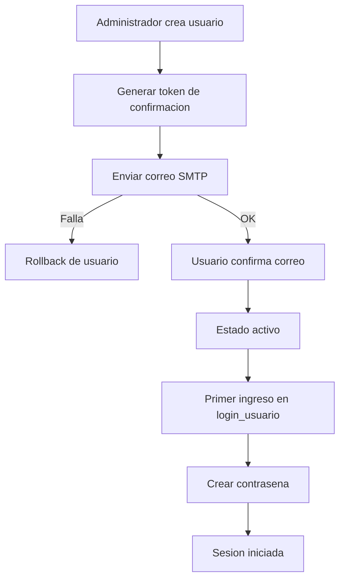

# Estructura del codigo

Fecha de actualizacion: 2026-04-04

## Objetivo
Este documento resume la estructura tecnica principal del sistema y sirve como referencia para mantenimiento y evolucion.

## Componentes principales

1. Backend (Go)
- Ruta base: backend/
- Responsabilidades:
  - Arranque de servidor y registro de rutas en main.go.
  - Logica de negocio en handlers por dominio.
  - Acceso a datos en db/.
  - Utilidades de middleware y seguridad en utils/.

2. Frontend (HTML/CSS/JS)
- Ruta base: web/
- Responsabilidades:
  - Paginas de acceso y paneles operativos.
  - Modulos por contexto (super y administrar_empresa).
  - Estilos centralizados en web/estilos.css.

3. Datos (SQLite)
- Bases:
  - backend/db/superadministrador.db
  - backend/db/empresas.db
- Criterio:
  - Superadministrador: configuraciones globales, sesiones, administradores.
  - Empresas: entidades operativas por empresa (usuarios, clientes, productos, carritos, etc.).

## Flujo de usuarios de empresa (correo + primer ingreso)

1. Un administrador de empresa crea el usuario.
2. El sistema envia correo de confirmacion.
3. Si el correo falla, el usuario se revierte y no queda registrado.
4. El usuario confirma correo desde enlace recibido.
5. Al ingresar a login_usuario por primera vez, debe crear su contrasena.
6. Desde el segundo ingreso, autentica con email + contrasena.

## Diagrama de alto nivel

## Regla de mantenimiento
Cada cambio estructural de rutas, modelos, autenticacion o base de datos debe reflejarse en este documento y en los diagramas relacionados dentro de documentos/diagramas/.

## Actualizacion 2026-04-03 (configuracion IA en panel super)

- Backend handlers:
  - Se agrega `backend/handlers/ai_credentials_catalog.go` para definir 5 modelos IA populares y sus claves de configuracion.
  - Se agrega `backend/handlers/ai_config_handlers.go` con endpoint `GET/PUT /super/api/config/ai`.

- Integracion de chat IA:
  - `backend/handlers/chat_con_inteligencia_artificial_controller.go` ahora toma credenciales desde configuracion super por modelo/proveedor, con fallback a variables de entorno.

- Frontend super:
  - `web/super/configuracion_avanzada.html` incorpora tarjeta para guardar/editar credenciales IA con estado por modelo y registro de cuenta Google autenticada.

## Actualizacion 2026-04-03 (chat IA empresarial Gemini-only)

- Backend handlers:
  - `backend/handlers/ai_credentials_catalog.go` se simplifica a un unico modelo soportado: `google:gemini-2.0-flash`.
  - `backend/handlers/ai_config_handlers.go` conserva `GET/PUT /super/api/config/ai`, ahora con una sola credencial Gemini.
  - `backend/handlers/chat_con_inteligencia_artificial_controller.go` migra el consumo de IA a Google Generative Language API (`generateContent`).

- Frontend empresa:
  - `web/administrar_empresa/chat_con_inteligencia_artificial.html` se rediseña con experiencia visual tipo Gemini.
  - Se hace explicita la autenticacion Google y el alcance por `empresa_id` en la interfaz.

- Frontend super:
  - `web/super/configuracion_avanzada.html` simplifica la tarjeta IA a credencial unica Gemini.

## Actualizacion 2026-04-04 (permisos por rol y alcance de empresa - punto 3)

- Backend handlers:
  - Se agrega `backend/handlers/empresa_permisos.go` como middleware de autorizacion por rol y modulo.
  - Valida `empresa_id`, identidad administrativa, alcance por empresa y accion C/R/U/D/A.

- Bootstrap y rutas (`backend/main.go`):
  - Se aplica middleware a rutas criticas de:
    - ventas (`/api/empresa/carritos_compra`, `/api/empresa/carritos_compra/items`),
    - inventario (`/api/empresa/bodegas`, `categorias_productos`, `productos`, `inventario/*`, `productos/precios_historial`),
    - finanzas (`/api/empresa/finanzas/movimientos`, `configuracion`, `periodos`).

- Pruebas:
  - Se agrega `backend/handlers/empresa_permisos_test.go` con escenarios de autorizacion/denegacion por rol y alcance de empresa.

## Indice de diagramas de referencia

- diagrama_entidad_relacion.md
- diagrama_casos_de_uso.md
- diagrama_roles_permisos.md
- diagrama_flujo_procesos.md
- diagrama_arquitectura_sistema.md

## Actualizacion 2026-04-03 (observabilidad transversal por empresa)

- Backend utilidades (`backend/utils/utils.go`):
  - `LoggingMiddleware` ahora agrega trazabilidad por request con `request_id`, `empresa_id` y latencia.
  - Se incorpora separación de logs por empresa en archivos dedicados:
    - `backend/logs/empresa_<id>.log`
    - `backend/logs/empresa_global.log` (fallback)
  - `JSONErrorMiddleware` normaliza errores API no-JSON con respuesta estructurada y metadatos de trazabilidad (`request_id` / `empresa_id`).

- Backend handlers multipart:
  - `backend/handlers/chat_tareas.go` y `backend/handlers/productos.go` fijan `X-Empresa-ID` al resolver `empresa_id` desde formulario.
  - Esto mantiene separación de logs por empresa también en endpoints de upload.

- Backend autenticación de usuarios empresa:
  - `backend/handlers/usuarios_empresa.go` aplica hardening de respuestas `500` para no exponer detalles internos.
  - Se conserva trazabilidad con logs de servidor contextualizados por empresa/usuario.

- Scripts operativos (`scripts/iniciar_servidor.ps1`):
  - Se agrega detección de caída temprana de `server.exe` durante arranque.
  - Ante fallo, se imprime diagnóstico inmediato con últimas líneas de `backend/server.err`.

## Actualizacion 2026-04-04 (modulo de finanzas multiempresa)

- Backend DB:
  - Se agrega `backend/db/finanzas.go` con el dominio financiero por empresa.
  - Nuevas tablas:
    - `empresa_finanzas_movimientos` para ingresos/egresos con comprobantes.
    - `empresa_finanzas_configuracion` para parametrizacion financiera por empresa.
  - `empresa_finanzas_configuracion` se amplía con plan de cuentas contable por empresa:
    - destino de integracion externa,
    - cuentas base de asiento,
    - mapeo de cuentas por categoria para ingresos/egresos.
  - Se normalizan validaciones de tipo (`ingreso`/`egreso`), estado (`activo`/`inactivo`/`anulado`) y codigos de comprobante.

- Backend handlers:
  - Se agrega `backend/handlers/finanzas.go` con endpoints:
    - `GET/POST/PUT/DELETE /api/empresa/finanzas/movimientos`
    - `GET/POST/PUT /api/empresa/finanzas/configuracion`

- Bootstrap y rutas:
  - `backend/main.go` integra `EnsureEmpresaFinanzasSchema` en arranque.
  - Se registra migracion `2026-04-03-003-finanzas`.
  - Se publican rutas API del modulo financiero para el panel empresarial.

- Frontend:
  - Nueva subpagina `web/administrar_empresa/finanzas.html` con:
    - configuracion financiera por empresa,
    - formulario de movimientos,
    - filtros operativos,
    - KPIs de ingresos/egresos/balance,
    - impresion de comprobantes en formato carta y POS.
    - separacion del libro en pestañas `Todos`, `Ingresos` y `Egresos`.
    - exportacion de resultados filtrados a Excel (CSV), PDF y JSON contable.
    - plantilla dedicada SIIGO en CSV para importacion de asientos.
    - exportacion de balance de prueba en CSV.
    - exportacion de estado de resultados en CSV.
    - salida JSON lista para integracion externa con resumen y asientos recomendados (debe/haber).
    - parametrizacion visual de plan de cuentas por empresa (base + categoria).
    - proyeccion de referencia por ERP destino (`generico`, `siigo`, `world_office`, `alegra`) dentro del JSON exportado.
  - Navegacion integrada en `web/administrar_empresa.html` y `web/js/administrar_empresa.js`.

- Pruebas y datos demo:
  - Nuevo archivo `backend/db/finanzas_test.go`.
  - `backend/tools/seed_motel_malibu/main.go` ahora incluye semilla financiera demo por empresa.

## Actualizacion 2026-04-04 (periodos contables + retenciones + reportes contables avanzados)

- Backend DB (`backend/db/finanzas.go`):
  - Se agrega `empresa_finanzas_periodos` para control de estado por periodo (`abierto`, `cerrado`, `inactivo`) por `empresa_id`.
  - `empresa_finanzas_movimientos` incorpora:
    - `periodo_contable`,
    - `retencion_fuente`, `retencion_ica`, `retencion_iva`, `total_retenciones`,
    - `total_neto`.
  - Se aplica bloqueo de cambios cuando el periodo está cerrado en operaciones de crear/editar/eliminar/activar/desactivar movimientos.
  - `empresa_finanzas_configuracion` incorpora cuentas de retenciones por cobrar/pagar.

- Backend handlers (`backend/handlers/finanzas.go`):
  - Se amplía filtro de movimientos por `periodo`.
  - Se agrega endpoint de periodos:
    - `GET/POST/PUT /api/empresa/finanzas/periodos`
  - Se normaliza respuesta HTTP 409 cuando el periodo del movimiento está cerrado.

- Bootstrap (`backend/main.go`):
  - Se registra migración `2026-04-03-004-finanzas-periodos-retenciones`.
  - Se publica ruta `/api/empresa/finanzas/periodos`.

- Frontend (`web/administrar_empresa/finanzas.html`):
  - Se agregan controles para cerrar/reabrir periodos contables y refrescar listado de periodos.
  - Se incorporan campos de retenciones y totales calculados (bruto, retenciones, neto) en formulario y tabla.
  - Se agregan exportaciones contables de `balance general`, `libro diario` y `libro mayor` en CSV.
  - Se integra validación local para evitar guardado cuando el periodo se encuentra cerrado.

- Endurecimiento técnico:
  - `backend/handlers/system_empresas_handlers.go` usa `net.JoinHostPort` para compatibilidad IPv6 en escaneo de puertos.
  - `scripts/iniciar_servidor.ps1` ajusta nombre de función de lectura `.env` con verbo aprobado en el script.

## Actualizacion 2026-04-04 (chat_con_inteligencia_artificial por empresa)

- Backend DB (`backend/db/chat_inteligencia_artificial.go`):
  - Se crea esquema IA empresarial con:
    - `empresa_ai_consultas` (auditoria de pregunta/respuesta/tokens por empresa),
    - `empresa_ai_uso_diario` (contador diario por empresa/proveedor/modelo).
  - Se implementan funciones para:
    - validar alcance de administracion (`CanAdminAccessEmpresaIA`),
    - construir contexto de negocio (`BuildEmpresaAIContexto`),
    - registrar consulta y consumo diario (`RegisterEmpresaAIConsulta`).

- Backend handlers:
  - Nuevo controlador `backend/handlers/chat_con_inteligencia_artificial_controller.go`:
    - catalogo de modelos famosos,
    - consulta a proveedores OpenAI/DeepSeek/Hugging Face,
    - validacion de `empresa_id`,
    - control de limite free-tier y respuesta de upgrade.
  - Nuevo router `backend/handlers/chat_con_inteligencia_artificial_router.go` con rutas:
    - `GET /api/empresa/chat_con_inteligencia_artificial/modelos`
    - `POST /api/empresa/chat_con_inteligencia_artificial/consultar`
    - `GET /api/empresa/chat_con_inteligencia_artificial/historial`

- Bootstrap (`backend/main.go`):
  - Se agrega `EnsureEmpresaAIChatSchema` en inicializacion.
  - Se registra migracion `2026-04-03-005-chat-ia-empresa`.
  - Se integra el registro modular de rutas con `RegisterEmpresaChatIARoutes`.

- Frontend:
  - Nueva subpagina `web/administrar_empresa/chat_con_inteligencia_artificial.html` con experiencia tipo chat:
    - selector de modelos,
    - conversacion y contexto operativo,
    - historial de consultas,
    - estado de consumo diario y enlace de upgrade.
  - Integracion de navegacion en `web/administrar_empresa.html` y persistencia en `web/js/administrar_empresa.js`.
  - Estilos del modulo integrados en `web/estilos.css`.

- Seguridad operacional:
  - Credenciales de IA gestionadas solo en backend por variables de entorno:
    - `OPENAI_API_KEY`
    - `DEEPSEEK_API_KEY`
    - `HUGGINGFACE_API_KEY`
  - El navegador no recibe ni expone llaves privadas.

## Actualizacion 2026-04-04 (chat IA: modelo preferido por cuenta Google)

- Backend DB (`backend/db/chat_inteligencia_artificial.go`):
  - Se agrega tabla `empresa_ai_modelo_preferido` para persistir el modelo IA preferido por `empresa_id + admin_email`.
  - Se incorporan funciones:
    - `GetEmpresaAIModeloPreferido` (lectura de preferencia),
    - `UpsertEmpresaAIModeloPreferido` (alta/actualización de preferencia).

- Backend handlers:
  - `backend/handlers/chat_con_inteligencia_artificial_controller.go`:
    - incorpora endpoint `GET/PUT /api/empresa/chat_con_inteligencia_artificial/modelo_preferido`,
    - amplía `GET /modelos` para devolver `google_account` y `modelo_preferido`,
    - registra automáticamente el modelo usado en `POST /consultar` como preferencia de la cuenta Google autenticada.
  - `backend/handlers/chat_con_inteligencia_artificial_router.go` registra la nueva ruta de preferencia.

- Frontend (`web/administrar_empresa/chat_con_inteligencia_artificial.html`):
  - Carga el modelo preferido al iniciar la pantalla.
  - Guarda automáticamente el nuevo modelo seleccionado para la cuenta Google.
  - Muestra la cuenta Google vinculada dentro del bloque de uso diario.

- Impacto funcional:
  - Se aproxima la experiencia de selección persistente de modelo al patrón de plataformas tipo ChatGPT, manteniendo aislamiento por `empresa_id`.

## Actualizacion 2026-04-03 (centro de ayuda + scanner de codigo + configuracion por empresa)

- Navegacion global:
  - `web/menu.js` agrega acceso directo a `web/ayuda/ayuda.html` desde el menu flotante.

- Frontend ayuda:
  - `web/ayuda/ayuda.html` se reestructura como centro de ayuda con menu interno y seccion de APIs principales.

- Frontend configuracion por empresa:
  - `web/administrar_empresa/configuracion.html` incorpora banderas operativas para lector de barras:
    - `lector_codigo_barras_habilitado`
    - `lector_codigo_barras_autofoco`
    - `lector_codigo_barras_acumular`
  - Estas opciones se persisten por `empresa_id` en configuracion local de empresa.

- Frontend carrito:
  - `web/administrar_empresa/carrito_de_compras.html` integra panel de escaneo tipo supermercado.
  - Permite resolver productos por `codigo_barras` o `sku`, agregar item nuevo o acumular cantidad sobre item activo existente.
  - En modo estacion respeta estado operativo activo antes de aceptar escaneos.

- Frontend reportes:
  - `web/administrar_empresa/reportes.html` agrega visibilidad de inventario actual por bodega y KPI de productos bajo minimo.

- Impacto funcional:
  - Se mejora la operacion de punto de venta multiempresa sin romper el aislamiento por `empresa_id` en configuracion y consumo de APIs.

## Actualizacion 2026-04-03 (inventario en carrito + reportes profesionales por fecha + seed comercial ampliado)

- Backend DB:
  - `backend/db/carritos_compras.go` ahora reserva inventario al agregar items de tipo producto al carrito.
  - Se libera inventario automaticamente al desactivar/eliminar items activos o al resetear carritos abiertos de estación.
  - En venta cerrada, el stock reservado se mantiene y no se revierte en el pago.

- Backend handlers:
  - `backend/handlers/carritos_compras.go` mejora respuestas para casos de stock insuficiente al crear/actualizar/activar items de carrito.

- Pruebas:
  - Nuevo archivo `backend/db/carritos_inventario_test.go` con cobertura de:
    - descuento de inventario en agregar al carrito,
    - persistencia del descuento tras pago de venta,
    - validacion de error por stock insuficiente.

- Tooling seed:
  - `backend/tools/seed_motel_malibu/main.go` amplía carga demo a 10 clientes y 10 usuarios de empresa.
  - Incluye validacion automatica de inventario (antes de agregar, despues de agregar y despues de pagar).
  - Mantiene y confirma validacion de impresion con vista previa POS/Carta.

- Frontend reportes:
  - `web/administrar_empresa/reportes.html` agrega reporte de productos y reporte de compras de productos.
  - Todos los reportes operan con filtro por fecha (rango desde/hasta) y KPIs comerciales ampliados.

## Actualizacion 2026-04-02 (reportes operativos + seed comercial Motel Malibu)

- Backend tools:
  - Se agrega `backend/tools/seed_motel_malibu/main.go` para carga demo de datos comerciales por empresa.
  - La herramienta asegura estructura base comercial, crea datos de ejemplo (productos/clientes) y genera venta de prueba cerrada.
  - Tambien consulta configuracion de impresion y ejecuta vista previa simulada de formatos POS/Carta.

- Frontend:
  - `web/administrar_empresa/reportes.html` deja de ser placeholder y pasa a modulo operativo.
  - Implementa indicadores comerciales por empresa: ventas cerradas, ventas del dia, ingresos, ticket promedio, top productos y top clientes.
  - Integra resumen de configuracion de impresion y previsualizacion de formatos.

- Impacto funcional:
  - Se habilita cierre de ciclo comercial visible para administracion de empresa: captura de venta cerrada -> consolidacion en reportes -> validacion de formato de impresion.

## Actualizacion 2026-04-01 (modularizacion tecnica)

- Backend:
  - El archivo monolitico `backend/handlers/handlers.go` se redujo y se separo en modulos por dominio:
    - `backend/handlers/auth_admin_handlers.go`
    - `backend/handlers/payments_handlers.go`
    - `backend/handlers/system_empresas_handlers.go`
  - Objetivo: aislar responsabilidades, acelerar mantenimiento y facilitar pruebas unitarias.

- Pruebas:
  - Se agrego `backend/handlers/auth_users_carritos_test.go` con pruebas reales de login/primer ingreso y flujo base de carritos.

- Frontend:
  - Se externalizaron scripts inline a `web/js/` para las pantallas clave de login y administracion:
    - `web/js/login.js`
    - `web/js/login_usuario.js`
    - `web/js/seleccionar_empresa.js`
    - `web/js/super_administrador.js`
    - `web/js/administrar_empresa.js`

## Actualizacion 2026-04-01 (fallback OAuth desde base de datos)

- Backend:
  - `backend/main.go` ahora puede resolver credenciales OAuth Google desde `superadministrador.db` (tabla `configuraciones`) cuando no son validas o no existen en entorno.
  - Se soportan aliases de claves para facilitar compatibilidad con configuraciones historicas.

- Script de arranque:
  - `scripts/iniciar_servidor.ps1` deja de bloquear el arranque cuando no hay credenciales OAuth en entorno/.env y delega la resolucion al backend.

- Impacto funcional:
  - Se restaura la continuidad del flujo de login admin/super (`/login.html` -> `/auth/google/login`) en escenarios donde la fuente operativa de credenciales es la DB.

## Actualizacion 2026-04-02 (modulo chat_y_tareas por empresa)

- Backend DB:
  - Se agrega `backend/db/chat_tareas.go` con esquema y CRUD de:
    - `chat_tareas_conversaciones`
    - `chat_tareas_participantes`
    - `chat_tareas_mensajes`
    - `chat_tareas_adjuntos`
    - `chat_tareas`
  - Integracion en arranque via `EnsureEmpresaChatTareasSchema` y registro de migracion `2026-04-02-001-chat-tareas`.

- Backend handlers:
  - Se agrega `backend/handlers/chat_tareas.go` con endpoints:
    - `GET/POST/PUT/DELETE /api/empresa/chat_tareas/conversaciones`
    - `GET/POST/PUT/DELETE /api/empresa/chat_tareas/participantes`
    - `GET/POST/PUT/DELETE /api/empresa/chat_tareas/mensajes`
    - `POST /api/empresa/chat_tareas/mensajes/adjunto`
    - `GET/POST/PUT/DELETE /api/empresa/chat_tareas/tareas`

- Frontend:
  - Nueva subpagina `web/administrar_empresa/chat_y_tareas.html`.
  - Navegacion actualizada en `web/administrar_empresa.html` y `web/js/administrar_empresa.js`.
  - Estilos responsive del modulo incorporados en `web/estilos.css`.

- Impacto funcional:
  - Se habilita colaboracion interna por empresa con chat, adjuntos de imagen/audio y seguimiento de tareas, manteniendo aislamiento por `empresa_id`.

## Actualizacion 2026-04-01 (facturacion electronica por pais + auditoria de alcance empresa)

- Backend DB:
  - Se agrega `backend/db/facturacion_electronica.go` con tabla `facturacion_electronica_pais` y CRUD por `empresa_id + pais_codigo`.
  - Se agrega `backend/db/empresa_scope.go` para asegurar referencia `empresa_id` en tablas base de `empresas.db` (`empresas`, `schema_migrations` y `tipos_de_empresas` legacy).
  - Se actualiza `backend/db/db.go` para mantener `empresa_id` autoconsistente en `empresas` (autorreferencia con `id`) al crear nuevas empresas.

- Backend handlers/rutas:
  - Se agrega `backend/handlers/facturacion_electronica.go` con endpoints:
    - `GET/POST/PUT /api/empresa/facturacion_electronica`
    - `GET /api/empresa/facturacion_electronica/pais_detectado`
    - `GET /api/empresa/facturacion_electronica/paises_disponibles`
  - Se refuerza login/primer ingreso de usuarios de empresa con lookup opcional por `empresa_id`.

- Frontend:
  - Nueva subpagina `web/administrar_empresa/facturacion_electronica.html` para configurar FE por país (CO/PA/EC).
  - Menú de `administrar_empresa` actualizado con acceso a `Facturación electrónica`.
  - `web/menu.js` ahora detecta país automáticamente (API + señales de navegador) y muestra bandera en el menú flotante.

- Validacion de alcance multiempresa:
  - Auditoría post-migración en `empresas.db`: todas las tablas no sistema quedaron con columna `empresa_id`.

## Actualizacion 2026-04-01 (colores de estado de carrito por empresa + ajustes FE)

- Backend DB:
  - `backend/db/empresa_configuracion_avanzada.go` agrega campos persistentes:
    - `color_carrito_activo`
    - `color_carrito_inactivo`
  - Se incluyen defaults y normalización HEX para evitar valores inválidos.
  - `backend/db/facturacion_electronica.go` ahora prellena configuración FE por país con datos de `empresa_configuracion_avanzada` cuando no existe registro FE por país.

- Frontend:
  - `web/administrar_empresa/estaciones.html` consulta estado operativo real de carritos por estación y aplica color dinámico de tarjeta (activo/inactivo).
  - `web/administrar_empresa/configuracion.html` incorpora tarjeta para configurar colores de estado del carrito.
  - Se robustece guardado de configuración avanzada desde `configuracion.html` con estrategia de merge para no sobrescribir campos fiscales/FE no visibles en ese formulario.
  - `web/administrar_empresa/configuracion_avanzada.html` incorpora edición de colores para mantener consistencia en guardados completos.

- Estilos:
  - `web/estilos.css` agrega estilos de estados (`station-card-active`/`station-card-inactive`) y badge visual por estado de carrito.

## Actualizacion 2026-04-01 (ciclo operativo de estaciones: inactivo -> activo -> inactivo)

- Frontend:
  - `web/administrar_empresa/configuracion_de_estaciones.html` sincroniza carritos de estación en estado base inactivo/cerrado para que el módulo inicie sin estaciones activas.
  - `web/administrar_empresa/estaciones.html` muestra fecha/hora de entrada (`activado_en`) solo cuando la estación está activa.

- Flujo funcional:
  - Al seleccionar una estación, el carrito se activa.
  - Al finalizar la compra, el carrito vuelve a inactivo/cerrado.

- Estilos:
  - `web/estilos.css` agrega estilo de marca temporal de entrada en tarjetas activas.

## Actualizacion 2026-04-01 (persistencia de subpagina al recargar F5)

- Frontend:
  - `web/js/administrar_empresa.js` conserva y restaura la última subpagina por `empresa_id` en el iframe principal.
  - `web/js/super_administrador.js` conserva y restaura la última subpagina abierta en el iframe de super administrador.
  - `web/js/seleccionar_empresa.js` conserva y restaura la última vista activa (`empresas`, `form` o `frame`).

- Impacto funcional:
  - Al recargar con F5, los paneles administrativos mantienen la misma página/vista abierta y evitan volver al estado inicial por defecto.

## Actualizacion 2026-04-01 (inactivacion masiva de carritos de estaciones + validacion E2E)

- Frontend:
  - `web/administrar_empresa/configuracion_de_estaciones.html` incorpora el boton `Inactivar carritos de estaciones`.
  - La accion lista carritos de la empresa con patron `EST-{empresa_id}-*` y fuerza estado base mediante:
    - `PUT /api/empresa/carritos_compra?action=desactivar`
    - `PUT /api/empresa/carritos_compra?action=cerrar`

- Validacion funcional ejecutada en local:
  - Flujo E2E por API completado: creacion de producto -> activacion de carrito de estacion -> adicion de item -> pago/cierre.
  - Resultado verificado: carrito finaliza en `estado=inactivo` y `estado_carrito=cerrado`.

- Alcance actual de facturacion:
  - El modulo de `facturacion_electronica` vigente gestiona configuracion por pais/empresa.
  - No existe aun endpoint de emision DIAN real (generacion/firma/envio XML UBL/CUFE) ni envio de XML de factura por correo en este flujo.

## Actualizacion 2026-04-02 (catalogo de categorias de productos multiempresa)

- Backend DB:
  - `backend/db/productos.go` incorpora tabla `categorias_productos` por `empresa_id`.
  - Se agrega `productos.categoria_id` para relación con catálogo y se mantiene `productos.categoria` como respaldo textual de compatibilidad.
  - Migración segura: se crean categorías automáticas a partir de valores legacy en `productos.categoria` y se hace backfill de `categoria_id`.

- Backend handlers/rutas:
  - `backend/handlers/productos.go` agrega endpoint CRUD:
    - `GET/POST/PUT/DELETE /api/empresa/categorias_productos`
  - `GET /api/empresa/productos` ahora acepta filtro opcional `categoria_id`.
  - `backend/main.go` registra la nueva ruta del módulo.

- Frontend:
  - `web/administrar_empresa/administrar_productos.html` agrega sección de gestión de categorías (crear/editar/activar/eliminar).
  - El formulario de productos cambia de categoría libre a selector de catálogo.
  - El listado de productos agrega columna de categoría y filtro por categoría.

- Pruebas:
  - Nuevas pruebas en `backend/db/productos_categorias_test.go`.
  - Nuevas pruebas en `backend/handlers/productos_categorias_test.go`.

## Actualizacion 2026-04-02 (modulo ubicacion_gps por empresa)

- Backend DB:
  - Se agrega `backend/db/ubicacion_gps.go` con esquema y CRUD de:
    - `empresa_gps_dispositivos`
    - `empresa_gps_recorridos`
  - Integracion en arranque via `EnsureEmpresaUbicacionGPSSchema` y migracion `2026-04-02-002-ubicacion-gps`.

- Backend handlers/rutas:
  - Se agrega `backend/handlers/ubicacion_gps.go` con endpoints:
    - `GET/POST/PUT/DELETE /api/empresa/ubicacion_gps/dispositivos`
    - `GET/POST/PUT/DELETE /api/empresa/ubicacion_gps/recorridos`

- Frontend:
  - Nueva subpagina `web/administrar_empresa/ubicacion_gps.html`.
  - Navegacion actualizada en `web/administrar_empresa.html` y `web/js/administrar_empresa.js`.
  - Estilos responsive del modulo incorporados en `web/estilos.css`.

- Impacto funcional:
  - Se habilita seguimiento de multiples dispositivos por empresa sobre mapa de codigo abierto (OpenStreetMap + Leaflet), con registro automatico de recorrido cada 10 segundos.

- Pruebas:
  - Nuevas pruebas en `backend/db/ubicacion_gps_test.go`.
  - Nuevas pruebas en `backend/handlers/ubicacion_gps_test.go`.
