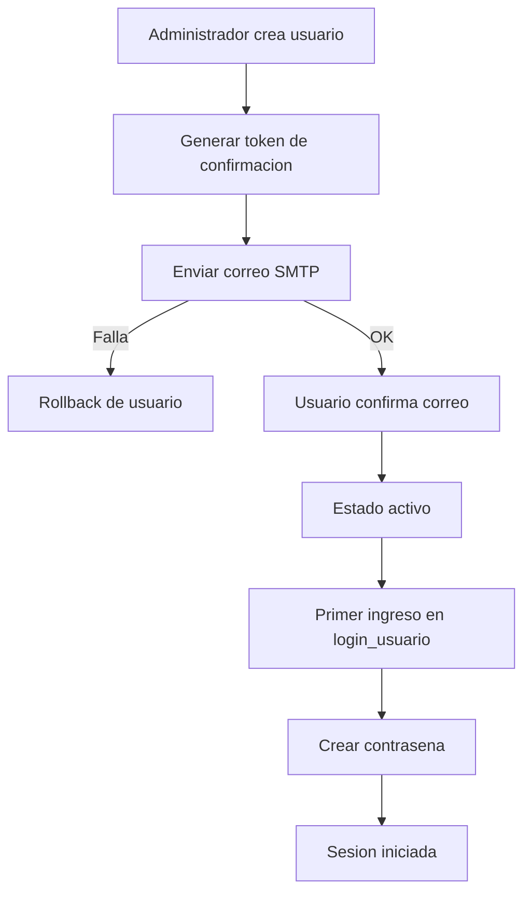

# Estructura del codigo

Fecha de actualizacion: 2026-04-01

## Objetivo
Este documento resume la estructura tecnica principal del sistema y sirve como referencia para mantenimiento y evolucion.

## Componentes principales

1. Backend (Go)
- Ruta base: backend/
- Responsabilidades:
  - Arranque de servidor y registro de rutas en main.go.
  - Logica de negocio en handlers por dominio.
  - Acceso a datos en db/.
  - Utilidades de middleware y seguridad en utils/.

2. Frontend (HTML/CSS/JS)
- Ruta base: web/
- Responsabilidades:
  - Paginas de acceso y paneles operativos.
  - Modulos por contexto (super y administrar_empresa).
  - Estilos centralizados en web/estilos.css.

3. Datos (SQLite)
- Bases:
  - backend/db/superadministrador.db
  - backend/db/empresas.db
- Criterio:
  - Superadministrador: configuraciones globales, sesiones, administradores.
  - Empresas: entidades operativas por empresa (usuarios, clientes, productos, carritos, etc.).

## Flujo de usuarios de empresa (correo + primer ingreso)

1. Un administrador de empresa crea el usuario.
2. El sistema envia correo de confirmacion.
3. Si el correo falla, el usuario se revierte y no queda registrado.
4. El usuario confirma correo desde enlace recibido.
5. Al ingresar a login_usuario por primera vez, debe crear su contrasena.
6. Desde el segundo ingreso, autentica con email + contrasena.

## Diagrama de alto nivel

## Regla de mantenimiento
Cada cambio estructural de rutas, modelos, autenticacion o base de datos debe reflejarse en este documento y en los diagramas relacionados dentro de documentos/diagramas/.

## Indice de diagramas de referencia

- diagrama_entidad_relacion.md
- diagrama_casos_de_uso.md
- diagrama_roles_permisos.md
- diagrama_flujo_procesos.md
- diagrama_arquitectura_sistema.md

## Actualizacion 2026-04-01 (modularizacion tecnica)

- Backend:
  - El archivo monolitico `backend/handlers/handlers.go` se redujo y se separo en modulos por dominio:
    - `backend/handlers/auth_admin_handlers.go`
    - `backend/handlers/payments_handlers.go`
    - `backend/handlers/system_empresas_handlers.go`
  - Objetivo: aislar responsabilidades, acelerar mantenimiento y facilitar pruebas unitarias.

- Pruebas:
  - Se agrego `backend/handlers/auth_users_carritos_test.go` con pruebas reales de login/primer ingreso y flujo base de carritos.

- Frontend:
  - Se externalizaron scripts inline a `web/js/` para las pantallas clave de login y administracion:
    - `web/js/login.js`
    - `web/js/login_usuario.js`
    - `web/js/seleccionar_empresa.js`
    - `web/js/super_administrador.js`
    - `web/js/administrar_empresa.js`

## Actualizacion 2026-04-01 (fallback OAuth desde base de datos)

- Backend:
  - `backend/main.go` ahora puede resolver credenciales OAuth Google desde `superadministrador.db` (tabla `configuraciones`) cuando no son validas o no existen en entorno.
  - Se soportan aliases de claves para facilitar compatibilidad con configuraciones historicas.

- Script de arranque:
  - `scripts/iniciar_servidor.ps1` deja de bloquear el arranque cuando no hay credenciales OAuth en entorno/.env y delega la resolucion al backend.

- Impacto funcional:
  - Se restaura la continuidad del flujo de login admin/super (`/login.html` -> `/auth/google/login`) en escenarios donde la fuente operativa de credenciales es la DB.
