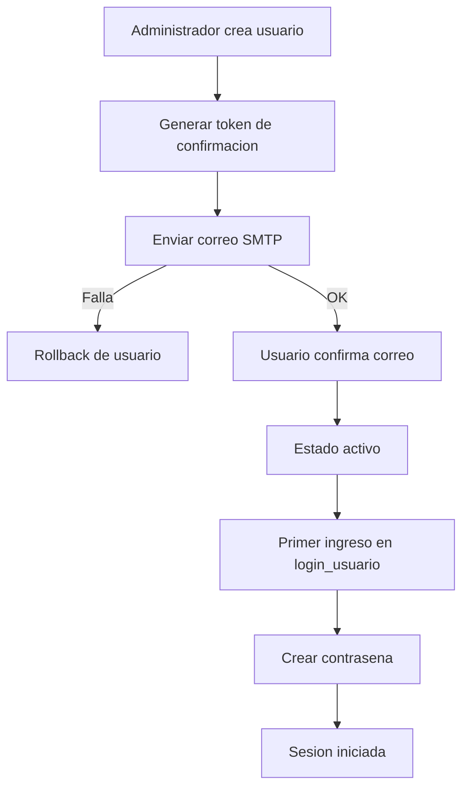

# Estructura del codigo

Fecha de actualizacion: 2026-04-02

## Objetivo
Este documento resume la estructura tecnica principal del sistema y sirve como referencia para mantenimiento y evolucion.

## Componentes principales

1. Backend (Go)
- Ruta base: backend/
- Responsabilidades:
  - Arranque de servidor y registro de rutas en main.go.
  - Logica de negocio en handlers por dominio.
  - Acceso a datos en db/.
  - Utilidades de middleware y seguridad en utils/.

2. Frontend (HTML/CSS/JS)
- Ruta base: web/
- Responsabilidades:
  - Paginas de acceso y paneles operativos.
  - Modulos por contexto (super y administrar_empresa).
  - Estilos centralizados en web/estilos.css.

3. Datos (SQLite)
- Bases:
  - backend/db/superadministrador.db
  - backend/db/empresas.db
- Criterio:
  - Superadministrador: configuraciones globales, sesiones, administradores.
  - Empresas: entidades operativas por empresa (usuarios, clientes, productos, carritos, etc.).

## Flujo de usuarios de empresa (correo + primer ingreso)

1. Un administrador de empresa crea el usuario.
2. El sistema envia correo de confirmacion.
3. Si el correo falla, el usuario se revierte y no queda registrado.
4. El usuario confirma correo desde enlace recibido.
5. Al ingresar a login_usuario por primera vez, debe crear su contrasena.
6. Desde el segundo ingreso, autentica con email + contrasena.

## Diagrama de alto nivel

## Regla de mantenimiento
Cada cambio estructural de rutas, modelos, autenticacion o base de datos debe reflejarse en este documento y en los diagramas relacionados dentro de documentos/diagramas/.

## Indice de diagramas de referencia

- diagrama_entidad_relacion.md
- diagrama_casos_de_uso.md
- diagrama_roles_permisos.md
- diagrama_flujo_procesos.md
- diagrama_arquitectura_sistema.md

## Actualizacion 2026-04-01 (modularizacion tecnica)

- Backend:
  - El archivo monolitico `backend/handlers/handlers.go` se redujo y se separo en modulos por dominio:
    - `backend/handlers/auth_admin_handlers.go`
    - `backend/handlers/payments_handlers.go`
    - `backend/handlers/system_empresas_handlers.go`
  - Objetivo: aislar responsabilidades, acelerar mantenimiento y facilitar pruebas unitarias.

- Pruebas:
  - Se agrego `backend/handlers/auth_users_carritos_test.go` con pruebas reales de login/primer ingreso y flujo base de carritos.

- Frontend:
  - Se externalizaron scripts inline a `web/js/` para las pantallas clave de login y administracion:
    - `web/js/login.js`
    - `web/js/login_usuario.js`
    - `web/js/seleccionar_empresa.js`
    - `web/js/super_administrador.js`
    - `web/js/administrar_empresa.js`

## Actualizacion 2026-04-01 (fallback OAuth desde base de datos)

- Backend:
  - `backend/main.go` ahora puede resolver credenciales OAuth Google desde `superadministrador.db` (tabla `configuraciones`) cuando no son validas o no existen en entorno.
  - Se soportan aliases de claves para facilitar compatibilidad con configuraciones historicas.

- Script de arranque:
  - `scripts/iniciar_servidor.ps1` deja de bloquear el arranque cuando no hay credenciales OAuth en entorno/.env y delega la resolucion al backend.

- Impacto funcional:
  - Se restaura la continuidad del flujo de login admin/super (`/login.html` -> `/auth/google/login`) en escenarios donde la fuente operativa de credenciales es la DB.

## Actualizacion 2026-04-02 (modulo chat_y_tareas por empresa)

- Backend DB:
  - Se agrega `backend/db/chat_tareas.go` con esquema y CRUD de:
    - `chat_tareas_conversaciones`
    - `chat_tareas_participantes`
    - `chat_tareas_mensajes`
    - `chat_tareas_adjuntos`
    - `chat_tareas`
  - Integracion en arranque via `EnsureEmpresaChatTareasSchema` y registro de migracion `2026-04-02-001-chat-tareas`.

- Backend handlers:
  - Se agrega `backend/handlers/chat_tareas.go` con endpoints:
    - `GET/POST/PUT/DELETE /api/empresa/chat_tareas/conversaciones`
    - `GET/POST/PUT/DELETE /api/empresa/chat_tareas/participantes`
    - `GET/POST/PUT/DELETE /api/empresa/chat_tareas/mensajes`
    - `POST /api/empresa/chat_tareas/mensajes/adjunto`
    - `GET/POST/PUT/DELETE /api/empresa/chat_tareas/tareas`

- Frontend:
  - Nueva subpagina `web/administrar_empresa/chat_y_tareas.html`.
  - Navegacion actualizada en `web/administrar_empresa.html` y `web/js/administrar_empresa.js`.
  - Estilos responsive del modulo incorporados en `web/estilos.css`.

- Impacto funcional:
  - Se habilita colaboracion interna por empresa con chat, adjuntos de imagen/audio y seguimiento de tareas, manteniendo aislamiento por `empresa_id`.

## Actualizacion 2026-04-01 (facturacion electronica por pais + auditoria de alcance empresa)

- Backend DB:
  - Se agrega `backend/db/facturacion_electronica.go` con tabla `facturacion_electronica_pais` y CRUD por `empresa_id + pais_codigo`.
  - Se agrega `backend/db/empresa_scope.go` para asegurar referencia `empresa_id` en tablas base de `empresas.db` (`empresas`, `schema_migrations` y `tipos_de_empresas` legacy).
  - Se actualiza `backend/db/db.go` para mantener `empresa_id` autoconsistente en `empresas` (autorreferencia con `id`) al crear nuevas empresas.

- Backend handlers/rutas:
  - Se agrega `backend/handlers/facturacion_electronica.go` con endpoints:
    - `GET/POST/PUT /api/empresa/facturacion_electronica`
    - `GET /api/empresa/facturacion_electronica/pais_detectado`
    - `GET /api/empresa/facturacion_electronica/paises_disponibles`
  - Se refuerza login/primer ingreso de usuarios de empresa con lookup opcional por `empresa_id`.

- Frontend:
  - Nueva subpagina `web/administrar_empresa/facturacion_electronica.html` para configurar FE por país (CO/PA/EC).
  - Menú de `administrar_empresa` actualizado con acceso a `Facturación electrónica`.
  - `web/menu.js` ahora detecta país automáticamente (API + señales de navegador) y muestra bandera en el menú flotante.

- Validacion de alcance multiempresa:
  - Auditoría post-migración en `empresas.db`: todas las tablas no sistema quedaron con columna `empresa_id`.

## Actualizacion 2026-04-01 (colores de estado de carrito por empresa + ajustes FE)

- Backend DB:
  - `backend/db/empresa_configuracion_avanzada.go` agrega campos persistentes:
    - `color_carrito_activo`
    - `color_carrito_inactivo`
  - Se incluyen defaults y normalización HEX para evitar valores inválidos.
  - `backend/db/facturacion_electronica.go` ahora prellena configuración FE por país con datos de `empresa_configuracion_avanzada` cuando no existe registro FE por país.

- Frontend:
  - `web/administrar_empresa/estaciones.html` consulta estado operativo real de carritos por estación y aplica color dinámico de tarjeta (activo/inactivo).
  - `web/administrar_empresa/configuracion.html` incorpora tarjeta para configurar colores de estado del carrito.
  - Se robustece guardado de configuración avanzada desde `configuracion.html` con estrategia de merge para no sobrescribir campos fiscales/FE no visibles en ese formulario.
  - `web/administrar_empresa/configuracion_avanzada.html` incorpora edición de colores para mantener consistencia en guardados completos.

- Estilos:
  - `web/estilos.css` agrega estilos de estados (`station-card-active`/`station-card-inactive`) y badge visual por estado de carrito.

## Actualizacion 2026-04-01 (ciclo operativo de estaciones: inactivo -> activo -> inactivo)

- Frontend:
  - `web/administrar_empresa/configuracion_de_estaciones.html` sincroniza carritos de estación en estado base inactivo/cerrado para que el módulo inicie sin estaciones activas.
  - `web/administrar_empresa/estaciones.html` muestra fecha/hora de entrada (`activado_en`) solo cuando la estación está activa.

- Flujo funcional:
  - Al seleccionar una estación, el carrito se activa.
  - Al finalizar la compra, el carrito vuelve a inactivo/cerrado.

- Estilos:
  - `web/estilos.css` agrega estilo de marca temporal de entrada en tarjetas activas.

## Actualizacion 2026-04-01 (persistencia de subpagina al recargar F5)

- Frontend:
  - `web/js/administrar_empresa.js` conserva y restaura la última subpagina por `empresa_id` en el iframe principal.
  - `web/js/super_administrador.js` conserva y restaura la última subpagina abierta en el iframe de super administrador.
  - `web/js/seleccionar_empresa.js` conserva y restaura la última vista activa (`empresas`, `form` o `frame`).

- Impacto funcional:
  - Al recargar con F5, los paneles administrativos mantienen la misma página/vista abierta y evitan volver al estado inicial por defecto.

## Actualizacion 2026-04-01 (inactivacion masiva de carritos de estaciones + validacion E2E)

- Frontend:
  - `web/administrar_empresa/configuracion_de_estaciones.html` incorpora el boton `Inactivar carritos de estaciones`.
  - La accion lista carritos de la empresa con patron `EST-{empresa_id}-*` y fuerza estado base mediante:
    - `PUT /api/empresa/carritos_compra?action=desactivar`
    - `PUT /api/empresa/carritos_compra?action=cerrar`

- Validacion funcional ejecutada en local:
  - Flujo E2E por API completado: creacion de producto -> activacion de carrito de estacion -> adicion de item -> pago/cierre.
  - Resultado verificado: carrito finaliza en `estado=inactivo` y `estado_carrito=cerrado`.

- Alcance actual de facturacion:
  - El modulo de `facturacion_electronica` vigente gestiona configuracion por pais/empresa.
  - No existe aun endpoint de emision DIAN real (generacion/firma/envio XML UBL/CUFE) ni envio de XML de factura por correo en este flujo.

## Actualizacion 2026-04-02 (catalogo de categorias de productos multiempresa)

- Backend DB:
  - `backend/db/productos.go` incorpora tabla `categorias_productos` por `empresa_id`.
  - Se agrega `productos.categoria_id` para relación con catálogo y se mantiene `productos.categoria` como respaldo textual de compatibilidad.
  - Migración segura: se crean categorías automáticas a partir de valores legacy en `productos.categoria` y se hace backfill de `categoria_id`.

- Backend handlers/rutas:
  - `backend/handlers/productos.go` agrega endpoint CRUD:
    - `GET/POST/PUT/DELETE /api/empresa/categorias_productos`
  - `GET /api/empresa/productos` ahora acepta filtro opcional `categoria_id`.
  - `backend/main.go` registra la nueva ruta del módulo.

- Frontend:
  - `web/administrar_empresa/administrar_productos.html` agrega sección de gestión de categorías (crear/editar/activar/eliminar).
  - El formulario de productos cambia de categoría libre a selector de catálogo.
  - El listado de productos agrega columna de categoría y filtro por categoría.

- Pruebas:
  - Nuevas pruebas en `backend/db/productos_categorias_test.go`.
  - Nuevas pruebas en `backend/handlers/productos_categorias_test.go`.

## Actualizacion 2026-04-02 (modulo ubicacion_gps por empresa)

- Backend DB:
  - Se agrega `backend/db/ubicacion_gps.go` con esquema y CRUD de:
    - `empresa_gps_dispositivos`
    - `empresa_gps_recorridos`
  - Integracion en arranque via `EnsureEmpresaUbicacionGPSSchema` y migracion `2026-04-02-002-ubicacion-gps`.

- Backend handlers/rutas:
  - Se agrega `backend/handlers/ubicacion_gps.go` con endpoints:
    - `GET/POST/PUT/DELETE /api/empresa/ubicacion_gps/dispositivos`
    - `GET/POST/PUT/DELETE /api/empresa/ubicacion_gps/recorridos`

- Frontend:
  - Nueva subpagina `web/administrar_empresa/ubicacion_gps.html`.
  - Navegacion actualizada en `web/administrar_empresa.html` y `web/js/administrar_empresa.js`.
  - Estilos responsive del modulo incorporados en `web/estilos.css`.

- Impacto funcional:
  - Se habilita seguimiento de multiples dispositivos por empresa sobre mapa de codigo abierto (OpenStreetMap + Leaflet), con registro automatico de recorrido cada 10 segundos.

- Pruebas:
  - Nuevas pruebas en `backend/db/ubicacion_gps_test.go`.
  - Nuevas pruebas en `backend/handlers/ubicacion_gps_test.go`.
