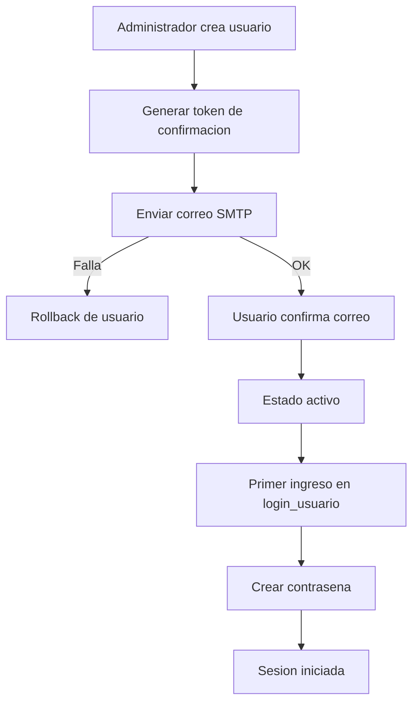

# Estructura del codigo

Fecha de actualizacion: 2026-04-04

## Objetivo
Este documento resume la estructura tecnica principal del sistema y sirve como referencia para mantenimiento y evolucion.

## Componentes principales

1. Backend (Go)
- Ruta base: backend/
- Responsabilidades:
  - Arranque de servidor y registro de rutas en main.go.
  - Logica de negocio en handlers por dominio.
  - Acceso a datos en db/.
  - Utilidades de middleware y seguridad en utils/.

2. Frontend (HTML/CSS/JS)
- Ruta base: web/
- Responsabilidades:
  - Paginas de acceso y paneles operativos.
  - Modulos por contexto (super y administrar_empresa).
  - Estilos centralizados en web/estilos.css.

3. Datos (SQLite)
- Bases:
  - backend/db/superadministrador.db
  - backend/db/empresas.db
- Criterio:
  - Superadministrador: configuraciones globales, sesiones, administradores.
  - Empresas: entidades operativas por empresa (usuarios, clientes, productos, carritos, etc.).

## Flujo de usuarios de empresa (correo + primer ingreso)

1. Un administrador de empresa crea el usuario.
2. El sistema envia correo de confirmacion.
3. Si el correo falla, el usuario se revierte y no queda registrado.
4. El usuario confirma correo desde enlace recibido.
5. Al ingresar a login_usuario por primera vez, debe crear su contrasena.
6. Desde el segundo ingreso, autentica con email + contrasena.

## Diagrama de alto nivel

## Regla de mantenimiento
Cada cambio estructural de rutas, modelos, autenticacion o base de datos debe reflejarse en este documento y en los diagramas relacionados dentro de documentos/diagramas/.

## Actualizacion 2026-04-04 (punto 9 - modulo de compras dedicado)

- Backend DB (`backend/db/documentos_transaccionales.go`):
  - se agrega `ListEmpresaDocumentosCompraByEmpresa` para consulta operativa de documentos de compra con filtros de estado, proveedor y busqueda.
  - se agrega `SetEmpresaDocumentoCompraEstadoByCodigo` para activacion/desactivacion logica por codigo documental.

- Backend handlers (`backend/handlers/compras.go`):
  - nuevo handler dedicado `EmpresaComprasDocumentosHandler`.
  - expone ciclo documental de compras en ruta unica con acciones:
    - crear,
    - emitir_orden,
    - recepcionar_compra,
    - contabilizar_compra,
    - activar/desactivar,
    - eliminacion logica.
  - mantiene trazabilidad en `empresa_eventos_contables` para cada transicion relevante.

- Rutas (`backend/main.go`):
  - se registra `/api/empresa/compras/documentos` bajo `WithEmpresaComprasPermissions`.

- Frontend empresa (`web/administrar_empresa/compras.html`):
  - nueva pagina dedicada de compras con formulario de documento, filtros y acciones por estado documental.
  - se integra en el menu lateral via:
    - `web/administrar_empresa.html` (`linkCompras`),
    - `web/js/administrar_empresa.js` (catalogo de permisos modulo `compras`).

- Pruebas:
  - `backend/db/documentos_transaccionales_test.go` agrega prueba de listado y estado activo por codigo.
  - `backend/handlers/compras_documentos_test.go` agrega cobertura del flujo documental completo del modulo de compras.

## Actualizacion 2026-04-04 (punto 6 - gestion de clientes: perfil, historial y segmentacion)

- Backend DB (`backend/db/clientes.go`):
  - se agregan contratos analiticos:
    - `ClientePerfilComercial`,
    - `ClienteCompraHistorial`,
    - `ClienteSegmentacionResumen`.
  - se agregan consultas por empresa/cliente:
    - `GetClientePerfilComercialByEmpresa`,
    - `GetClienteHistorialComprasByEmpresa`,
    - `GetClientesSegmentacionByEmpresa`.
  - el perfil y la segmentacion se calculan con metricas de compras sobre `carritos_compras`.

- Backend handlers (`backend/handlers/clientes.go`):
  - se mantiene el endpoint unico `GET /api/empresa/clientes` y se habilitan variantes por accion:
    - `action=perfil`,
    - `action=historial`,
    - `action=segmentacion|segmentos`.
  - se agrega parseo robusto de `cliente_id` con fallback a `id` en query.

- Frontend empresa (`web/administrar_empresa/administrar_clientes.html`):
  - se agrega panel `Segmentacion de clientes (punto 6)` con consolidado por segmento.
  - se agrega panel `Perfil e historial del cliente` con detalle comercial por cliente.
  - se incorpora accion `Perfil` en cada fila para consultar y visualizar datos analiticos.

- Pruebas:
  - `backend/db/clientes_test.go` valida perfil/historial/segmentacion en capa DB.
  - `backend/handlers/clientes_test.go` valida contrato HTTP para acciones de clientes y errores esperados.

## Actualizacion 2026-04-04 (punto 7 - gestion de proveedores: catalogo, precios y condiciones)

- Backend DB (`backend/db/productos.go`):
  - se amplía el modelo `Proveedor` con:
    - `catalogo_referencia`,
    - `precio_base_referencial`,
    - `descuento_porcentaje`,
    - `plazo_pago_dias`,
    - `condicion_entrega`.
  - se actualiza la migracion segura de `proveedores` en `EnsureEmpresaProductosSchema` para soportar nuevas instalaciones y bases existentes.
  - se agregan validaciones en CRUD para rango de descuento, precio no negativo y plazo de pago no negativo.

- Backend handlers (`backend/handlers/productos.go`):
  - `POST/PUT /api/empresa/proveedores` valida los campos comerciales y retorna error de negocio en caso de payload invalido.
  - los eventos contables del modulo compras incluyen metadata comercial del proveedor para trazabilidad.

- Frontend empresa (`web/administrar_empresa/administrar_productos.html`):
  - se amplía el formulario de proveedores con campos de catalogo, precio base y condiciones de negociacion.
  - se amplía la tabla de proveedores para mostrar precio base y condiciones relevantes.
  - se agrega validacion de rango en cliente antes de enviar cambios al backend.

- Pruebas:
  - `backend/db/productos_categorias_test.go` agrega `TestProveedorCRUDIncluyeCatalogoPreciosYCondiciones`.
  - `backend/handlers/eventos_contables_modulos_test.go` extiende cobertura de proveedores y agrega validacion de payload invalido.

## Actualizacion 2026-04-04 (catalogo frontend por rol + regresion endpoints sin wrapper)

- Frontend empresa:
  - `web/js/administrar_empresa.js` incorpora un catalogo de permisos por enlace para el menu lateral.
  - El rol se obtiene desde `GET /me`, se normaliza y se aplica evaluacion por modulo/accion para ocultar opciones no autorizadas.
  - Cuando una pagina almacenada ya no es visible por permisos, el iframe cae automaticamente en la primera opcion permitida.

- Pruebas de regresion backend (sin wrapper de modulo):
  - `backend/handlers/auth_users_carritos_test.go` agrega cobertura para rechazo por `empresa_id` fuera de alcance en:
    - `POST /api/empresa/usuarios/login`.
    - `POST /api/empresa/usuarios/establecer_password`.
  - `backend/handlers/chat_con_inteligencia_artificial_controller_test.go` agrega cobertura en `ModelosHandler` para alcance por cuenta Google (`adminEmail`) fuera de alcance.

## Actualizacion 2026-04-04 (inicio punto 5 - inventario: kardex operativo + alertas de quiebre)

- Backend DB (`backend/db/productos.go`):
  - se formalizan reglas de stock en productos:
    - `stock_minimo` y `stock_maximo` no pueden ser negativos,
    - `stock_minimo` no puede superar `stock_maximo` cuando `stock_maximo > 0`.
  - se agrega `GetAlertasQuiebreByEmpresa` para listar quiebres/bajo minimo por empresa, producto y bodega.
  - se amplía `GetMovimientosByEmpresa` como kardex operativo con filtros de consulta:
    - `bodega_id` (origen o destino),
    - `tipo` de movimiento,
    - rango `desde`/`hasta` por fecha.

- Backend handlers (`backend/handlers/productos.go`):
  - nuevo endpoint `GET /api/empresa/inventario/alertas`.
  - compatibilidad adicional en existencias: `GET /api/empresa/inventario/existencias?action=alertas|alertas_quiebre|quiebre`.
  - `GET /api/empresa/inventario/movimientos` ahora admite filtros de kardex por bodega/tipo/rango con validacion de formato de fecha `YYYY-MM-DD`.

- Rutas (`backend/main.go`):
  - se registra `/api/empresa/inventario/alertas` bajo `WithEmpresaInventarioPermissions`.

- Frontend empresa (`web/administrar_empresa/administrar_productos.html`):
  - se agrega seccion visual de `Alertas de quiebre por bodega` consumiendo el endpoint de alertas.

- Pruebas:
  - `backend/handlers/productos_categorias_test.go` agrega cobertura de alertas y filtros de kardex.
  - `backend/db/productos_categorias_test.go` agrega cobertura de reglas `stock_minimo/stock_maximo`.

## Actualizacion 2026-04-04 (continuacion punto 5 - filtros operativos en UI de inventario)

- Frontend empresa (`web/administrar_empresa/administrar_productos.html`):
  - el bloque de alertas incorpora filtro por bodega con acciones `Filtrar` y `Limpiar`.
  - el bloque de movimientos (kardex) incorpora filtros por:
    - bodega,
    - tipo de movimiento,
    - rango de fechas (`desde`, `hasta`),
    junto con acciones `Filtrar` y `Limpiar`.
  - los filtros consumen directamente los endpoints ya extendidos:
    - `GET /api/empresa/inventario/alertas`,
    - `GET /api/empresa/inventario/movimientos`.

## Actualizacion 2026-04-04 (continuacion punto 5 - resumen KPI operativo de inventario)

- Backend DB (`backend/db/productos.go`):
  - se agrega `InventarioResumen` como contrato de KPI operativos de inventario.
  - se agrega `GetInventarioResumenByEmpresa` para consolidar:
    - existencias totales y cobertura por producto/bodega,
    - alertas de quiebre (`sin_stock`, `bajo_minimo`) y `deficit_total`,
    - movimientos por rango (`entrada`, `salida`, `traslado`, `ajuste`, `total`) y ultimo movimiento.

- Backend handlers (`backend/handlers/productos.go`):
  - nuevo endpoint `GET /api/empresa/inventario/resumen` con validacion de fechas `YYYY-MM-DD`.

- Rutas (`backend/main.go`):
  - se registra `/api/empresa/inventario/resumen` bajo `WithEmpresaInventarioPermissions`.

- Frontend empresa (`web/administrar_empresa/administrar_productos.html`):
  - se agregan KPI operativos en cabecera del modulo de productos:
    - alertas de inventario,
    - productos sin stock,
    - movimientos del periodo,
    - deficit total.
  - se integra carga de resumen desde backend y se sincroniza con filtros de rango del kardex.

- Pruebas:
  - `backend/handlers/productos_categorias_test.go` agrega cobertura de endpoint resumen por rango y validacion de fecha.
  - `backend/db/productos_categorias_test.go` agrega cobertura de calculo de resumen en capa DB.

## Actualizacion 2026-04-04 (continuacion punto 5 - top criticos y reposicion guiada)

- Frontend empresa (`web/administrar_empresa/administrar_productos.html`):
  - se agrega bloque `Top productos críticos (déficit)` dentro de inventario.
  - la lista se alimenta de `GET /api/empresa/inventario/alertas` y prioriza:
    - estado `sin_stock`,
    - mayor `deficit`.
  - se agrega accion `Preparar reposición` para precargar el formulario de ajuste de inventario con:
    - `producto_id`,
    - `bodega_id`,
    - `tipo=entrada`,
    - `cantidad` sugerida por deficit.

## Actualizacion 2026-04-04 (continuacion punto 5 - tendencia diaria de inventario)

- Backend DB (`backend/db/productos.go`):
  - se agrega `InventarioTendenciaDia` como contrato de serie diaria de inventario.
  - se agrega `GetInventarioTendenciaByEmpresa` para consolidar por fecha:
    - `entradas`,
    - `salidas`,
    - `traslados`,
    - `neto`,
    - `eventos`.
  - la consulta soporta filtros por `bodega_id`, `desde`, `hasta` y ventana de `dias`.

- Backend handlers (`backend/handlers/productos.go`):
  - nuevo endpoint `GET /api/empresa/inventario/tendencia` con validacion `YYYY-MM-DD` y normalizacion de `dias`.

- Rutas (`backend/main.go`):
  - se registra `/api/empresa/inventario/tendencia` bajo `WithEmpresaInventarioPermissions`.

- Frontend empresa (`web/administrar_empresa/administrar_productos.html`):
  - se agrega bloque `Tendencia diaria inventario` en el panel de movimientos.
  - la vista se sincroniza con filtros de kardex (bodega y rango) y muestra neto acumulado del periodo.

- Pruebas:
  - `backend/handlers/productos_categorias_test.go` agrega cobertura de endpoint por rango.
  - `backend/db/productos_categorias_test.go` agrega cobertura de serie diaria en capa DB.

## Actualizacion 2026-04-04 (continuacion punto 5 - balance por bodega)

- Backend DB (`backend/db/productos.go`):
  - se agrega `InventarioBalanceBodega` como contrato de balance operativo por bodega.
  - se agrega `GetInventarioBalanceBodegasByEmpresa` para consolidar por bodega:
    - entradas,
    - salidas,
    - traslados de entrada/salida y traslado neto,
    - neto final y cantidad de eventos en rango.

- Backend handlers (`backend/handlers/productos.go`):
  - nuevo endpoint `GET /api/empresa/inventario/balance_bodegas` con validacion `YYYY-MM-DD` y filtros por `bodega_id`.

- Rutas (`backend/main.go`):
  - se registra `/api/empresa/inventario/balance_bodegas` bajo `WithEmpresaInventarioPermissions`.

- Frontend empresa (`web/administrar_empresa/administrar_productos.html`):
  - se agrega bloque `Balance por bodega` dentro del panel de movimientos.
  - la vista usa filtros del kardex y muestra neto por bodega y neto acumulado del rango.

- Pruebas:
  - `backend/handlers/productos_categorias_test.go` agrega cobertura del endpoint de balance por bodega.
  - `backend/db/productos_categorias_test.go` agrega cobertura del consolidado de balance por bodega en DB.

## Actualizacion 2026-04-04 (continuacion punto 5 - proyeccion preventiva de quiebre)

- Backend DB (`backend/db/productos.go`):
  - se agrega `InventarioProyeccionQuiebre` como contrato preventivo de riesgo por producto/bodega.
  - se agrega `GetInventarioProyeccionQuiebreByEmpresa` para estimar:
    - `salida_promedio_diaria`,
    - `dias_cobertura`,
    - `estado_proyeccion`,
    - `sugerido_reposicion`.
  - la salida se ordena por severidad y prioridad operativa.

- Backend handlers (`backend/handlers/productos.go`):
  - nuevo endpoint `GET /api/empresa/inventario/proyeccion_quiebre` con validacion de `dias_ventana`, `bodega_id`, `limit` y `offset`.

- Rutas (`backend/main.go`):
  - se registra `/api/empresa/inventario/proyeccion_quiebre` bajo `WithEmpresaInventarioPermissions`.

- Frontend empresa (`web/administrar_empresa/administrar_productos.html`):
  - se agrega bloque `Proyeccion de quiebre (preventiva)` en el panel de movimientos de inventario.
  - la vista se sincroniza con filtros del kardex para ajustar la ventana de analisis.
  - se agrega accion `Preparar` para precargar reposicion preventiva en el formulario de ajuste.

- Pruebas:
  - `backend/handlers/productos_categorias_test.go` agrega cobertura del endpoint de proyeccion preventiva.
  - `backend/db/productos_categorias_test.go` agrega cobertura de priorizacion por riesgo en capa DB.

## Actualizacion 2026-04-04 (continuacion punto 5 - plan de reposicion por proveedor)

- Backend DB (`backend/db/productos.go`):
  - se agrega `InventarioPlanReposicionItem` como contrato de compra preventiva.
  - se agrega `GetInventarioPlanReposicionByEmpresa` para consolidar por proveedor:
    - cantidad sugerida,
    - costo unitario de referencia,
    - costo estimado por item,
    - prioridad por severidad de riesgo.

- Backend handlers (`backend/handlers/productos.go`):
  - nuevo endpoint `GET /api/empresa/inventario/plan_reposicion` con validacion de `dias_ventana`, `solo_riesgo`, `bodega_id`, `limit` y `offset`.

- Rutas (`backend/main.go`):
  - se registra `/api/empresa/inventario/plan_reposicion` bajo `WithEmpresaInventarioPermissions`.

- Frontend empresa (`web/administrar_empresa/administrar_productos.html`):
  - se agrega bloque `Plan de reposicion por proveedor (fase 8)` en el panel de movimientos de inventario.
  - la vista muestra costo estimado por item y resumen de costo total para el alcance filtrado.
  - se agrega accion `Preparar` para precargar reposicion preventiva desde el plan.

- Pruebas:
  - `backend/handlers/productos_categorias_test.go` agrega cobertura del endpoint de plan de reposicion.
  - `backend/db/productos_categorias_test.go` agrega cobertura de consolidado proveedor/costo en capa DB.

## Actualizacion 2026-04-04 (continuacion punto 5 - consolidado de compra por proveedor)

- Backend DB (`backend/db/productos.go`):
  - se agrega `InventarioPlanReposicionProveedorResumen` como contrato de consolidado de compra.
  - se agrega `GetInventarioPlanReposicionResumenByEmpresa` para agrupar por proveedor:
    - items,
    - productos unicos,
    - cantidad total sugerida,
    - costo total estimado,
    - severidad acumulada por riesgo.

- Backend handlers (`backend/handlers/productos.go`):
  - nuevo endpoint `GET /api/empresa/inventario/plan_reposicion_resumen` con validacion de `dias_ventana`, `solo_riesgo`, `bodega_id`, `limit` y `offset`.

- Rutas (`backend/main.go`):
  - se registra `/api/empresa/inventario/plan_reposicion_resumen` bajo `WithEmpresaInventarioPermissions`.

- Frontend empresa (`web/administrar_empresa/administrar_productos.html`):
  - se agrega bloque `Consolidado de compra por proveedor (fase 9)`.
  - desde el consolidado se filtran los items del plan de reposicion por proveedor.
  - se agrega accion `Ver todos` para restablecer la vista global del plan.

- Pruebas:
  - `backend/handlers/productos_categorias_test.go` agrega cobertura del endpoint resumen por proveedor.
  - `backend/db/productos_categorias_test.go` agrega cobertura de agrupacion por proveedor en DB.

## Actualizacion 2026-04-04 (continuacion punto 5 - borrador de orden de compra por proveedor)

- Backend DB (`backend/db/productos.go`):
  - se agregan `InventarioPlanReposicionBorradorItem` y `InventarioPlanReposicionBorradorCompra`.
  - se agrega `GetInventarioPlanReposicionBorradorByEmpresa` para construir borrador de orden de compra por proveedor con:
    - codigo sugerido de borrador,
    - detalle por producto/bodega,
    - totales de cantidad/costo,
    - conteo de severidad de riesgo.

- Backend handlers (`backend/handlers/productos.go`):
  - nuevo endpoint `GET /api/empresa/inventario/plan_reposicion_borrador` con validacion de:
    - `empresa_id`,
    - `proveedor_id`,
    - `dias_ventana`,
    - `solo_riesgo`,
    - `bodega_id`.

- Rutas (`backend/main.go`):
  - se registra `/api/empresa/inventario/plan_reposicion_borrador` bajo `WithEmpresaInventarioPermissions`.

- Frontend empresa (`web/administrar_empresa/administrar_productos.html`):
  - se agrega bloque `Borrador de orden de compra por proveedor (fase 10)`.
  - desde `Consolidado de compra por proveedor (fase 9)` se agrega accion `Borrador OC`.
  - se agrega accion `Limpiar borrador` para restablecer la vista inicial del documento.

- Pruebas:
  - `backend/handlers/productos_categorias_test.go` agrega cobertura del endpoint de borrador por proveedor.
  - `backend/db/productos_categorias_test.go` agrega cobertura de consolidado de borrador en DB.

## Actualizacion 2026-04-04 (continuacion punto 5 - emision de orden desde borrador de reposicion)

- Backend DB (`backend/db/productos.go`):
  - se agrega `InventarioPlanReposicionOrdenEmitida` como contrato de respuesta al emitir la OC.
  - se agrega `EmitirOrdenCompraDesdePlanReposicionBorrador` para:
    - tomar el borrador preventivo por proveedor,
    - validar que existan lineas sugeridas,
    - persistir la orden en `empresa_compras_documentos` con estado `emitida`.

- Backend handlers (`backend/handlers/productos.go`):
  - nuevo endpoint `POST /api/empresa/compras/plan_reposicion/emitir_orden`.
  - valida datos operativos y documentales (`empresa_id`, `proveedor_id`, `bodega_id`, `dias_ventana`, `solo_riesgo`, metadatos de documento).
  - registra evento contable `orden_compra_emitida` con `entidad_id` del documento persistido.

- Rutas (`backend/main.go`):
  - se registra `/api/empresa/compras/plan_reposicion/emitir_orden` bajo `WithEmpresaComprasPermissions`.

- Frontend empresa (`web/administrar_empresa/administrar_productos.html`):
  - en el bloque de borrador (fase 10) se agrega boton `Emitir orden`.
  - la accion emite la OC al endpoint de compras y luego refresca plan/consolidado.

- Pruebas:
  - `backend/handlers/productos_categorias_test.go` agrega cobertura del endpoint de emision.
  - `backend/db/productos_categorias_test.go` agrega cobertura de persistencia documental desde borrador.

## Actualizacion 2026-04-04 (continuacion punto 5 - ciclo documental de orden emitida desde reposicion)

- Backend DB (`backend/db/productos.go`):
  - se agrega `InventarioPlanReposicionOrdenEstadoActualizado` como contrato de salida para cambios de estado de la OC.
  - se agrega `ActualizarEstadoOrdenCompraDesdeReposicion` para transicionar documentos emitidos con:
    - `recepcionar_compra` (`emitida` -> `recepcionada`),
    - `contabilizar_compra` (`recepcionada` -> `contabilizada`).

- Backend handlers (`backend/handlers/productos.go`):
  - nuevo endpoint `POST /api/empresa/compras/plan_reposicion/actualizar_estado`.
  - valida `empresa_id`, `proveedor_id`, `documento_codigo` y `accion`.
  - registra eventos contables `compra_recepcionada` y `compra_contabilizada`.

- Rutas (`backend/main.go`):
  - se registra `/api/empresa/compras/plan_reposicion/actualizar_estado` bajo `WithEmpresaComprasPermissions`.

- Frontend empresa (`web/administrar_empresa/administrar_productos.html`):
  - el bloque de compras por reposicion pasa a `fases 10-12`.
  - se agregan botones `Recepcionar orden` y `Contabilizar orden`.
  - se agrega contexto visual del estado de la OC para seguimiento del ciclo documental.

- Pruebas:
  - `backend/handlers/productos_categorias_test.go` agrega cobertura del endpoint de actualizacion de estado por ciclo.
  - `backend/db/productos_categorias_test.go` agrega cobertura de transiciones validas/invalidas en DB.

## Actualizacion 2026-04-03 (configuracion IA en panel super)

- Backend handlers:
  - Se agrega `backend/handlers/ai_credentials_catalog.go` para definir 5 modelos IA populares y sus claves de configuracion.
  - Se agrega `backend/handlers/ai_config_handlers.go` con endpoint `GET/PUT /super/api/config/ai`.

- Integracion de chat IA:
  - `backend/handlers/chat_con_inteligencia_artificial_controller.go` ahora toma credenciales desde configuracion super por modelo/proveedor, con fallback a variables de entorno.

- Frontend super:
  - `web/super/configuracion_avanzada.html` incorpora tarjeta para guardar/editar credenciales IA con estado por modelo y registro de cuenta Google autenticada.

## Actualizacion 2026-04-03 (chat IA empresarial Gemini-only)

- Backend handlers:
  - `backend/handlers/ai_credentials_catalog.go` se simplifica a un unico modelo soportado: `google:gemini-2.0-flash`.
  - `backend/handlers/ai_config_handlers.go` conserva `GET/PUT /super/api/config/ai`, ahora con una sola credencial Gemini.
  - `backend/handlers/chat_con_inteligencia_artificial_controller.go` migra el consumo de IA a Google Generative Language API (`generateContent`).

- Frontend empresa:
  - `web/administrar_empresa/chat_con_inteligencia_artificial.html` se rediseña con experiencia visual tipo Gemini.
  - Se hace explicita la autenticacion Google y el alcance por `empresa_id` en la interfaz.

- Frontend super:
  - `web/super/configuracion_avanzada.html` simplifica la tarjeta IA a credencial unica Gemini.

## Actualizacion 2026-04-04 (permisos por rol y alcance de empresa - punto 3)

- Backend handlers:
  - Se agrega `backend/handlers/empresa_permisos.go` como middleware de autorizacion por rol y modulo.
  - Valida `empresa_id`, identidad administrativa, alcance por empresa y accion C/R/U/D/A.

- Bootstrap y rutas (`backend/main.go`):
  - Se aplica middleware a rutas criticas de:
    - ventas (`/api/empresa/carritos_compra`, `/api/empresa/carritos_compra/items`),
    - inventario (`/api/empresa/bodegas`, `categorias_productos`, `productos`, `inventario/*`, `productos/precios_historial`),
    - finanzas (`/api/empresa/finanzas/movimientos`, `configuracion`, `periodos`).

- Pruebas:
  - Se agrega `backend/handlers/empresa_permisos_test.go` con escenarios de autorizacion/denegacion por rol y alcance de empresa.

## Actualizacion 2026-04-04 (ampliacion de cobertura de permisos en rutas operativas)

- Backend handlers:
  - `backend/handlers/empresa_permisos.go` amplía modulos autorizables a `clientes`, `compras` y `facturacion`.
  - Se agregan wrappers:
    - `WithEmpresaClientesPermissions`,
    - `WithEmpresaComprasPermissions`,
    - `WithEmpresaFacturacionPermissions`.

- Bootstrap y rutas (`backend/main.go`):
  - Se extiende middleware a rutas adicionales:
    - `clientes`: `/api/empresa/clientes`.
    - `compras/proveedores`: `/api/empresa/proveedores`.
    - `facturacion`: `/api/empresa/facturacion_electronica`, `/api/empresa/facturacion_electronica/pais_detectado`.
    - `servicios`: `/api/empresa/servicios` bajo politica de inventario.

- Pruebas:
  - `backend/handlers/empresa_permisos_test.go` incorpora casos para modulos `clientes`, `compras` y `facturacion`.

## Actualizacion 2026-04-04 (cierre de rutas pendientes en permisos)

- Backend handlers:
  - `backend/handlers/empresa_permisos.go` agrega modulo `seguridad` para control de usuarios/configuracion por empresa.
  - Nuevo wrapper:
    - `WithEmpresaSeguridadPermissions`.

- Bootstrap y rutas (`backend/main.go`):
  - Se extiende middleware a rutas operativas pendientes:
    - seguridad: `/api/empresa/usuarios`, `/api/empresa/configuracion_avanzada`, `/api/empresa/roles_de_usuario`.
    - inventario: `/api/empresa/productos/imagen`, `/api/empresa/ubicacion_gps/dispositivos`, `/api/empresa/ubicacion_gps/recorridos`.
    - colaboracion (politica ventas): `/api/empresa/chat_tareas/*`.

- Pruebas:
  - `backend/handlers/empresa_permisos_test.go` agrega validaciones para modulo `seguridad` (denegacion/escritura y aprobacion/lectura).

## Actualizacion 2026-04-04 (validacion de endpoints protegidos + inicio de gestion de ventas)

- Backend seguridad (punto 3):
  - `backend/handlers/empresa_permisos_test.go` incorpora smoke tests de rutas protegidas nuevas:
    - denegacion en GPS para rol `cajero` (`/api/empresa/ubicacion_gps/dispositivos`),
    - autorizacion en chat adjunto multipart para `cajero` (`/api/empresa/chat_tareas/mensajes/adjunto`),
    - rechazo `401` en chat adjunto cuando falta autenticacion.

- Backend ventas (punto 4):
  - `backend/db/carritos_compras.go` agrega estado derivado `estado_venta` para estandarizar el ciclo operativo de ventas:
    - `venta_abierta`, `venta_cerrada`, `venta_pagada`, `venta_suspendida`.
  - `backend/handlers/carritos_compras.go` expone `estado_venta` en respuestas de acciones (`activar_estacion`, `pagar_estacion`, `activar/desactivar`, `cerrar/reabrir`).
  - `backend/handlers/carritos_compras.go` formaliza transiciones validas del ciclo de venta con respuestas de control:
    - `404` para carrito inexistente,
    - `409` para transiciones incoherentes (doble pago, reabrir pagada, activar estacion pagada sin `reset_items=1`).

- Pruebas:
  - `backend/handlers/auth_users_carritos_test.go` valida transiciones del flujo de carrito en capa HTTP (abierta, pagada, suspendida).
  - `backend/db/carritos_inventario_test.go` valida lifecycle en capa DB (abierta, cerrada, pagada, suspendida).
  - `backend/handlers/auth_users_carritos_test.go` agrega escenarios de conflicto para transiciones invalidadas.

## Actualizacion 2026-04-04 (contrato de eventos contables por modulo + trazabilidad de ventas)

- Backend DB:
  - Se agrega `backend/db/eventos_contables.go` con el contrato de eventos contables por modulo (`ventas`, `facturacion`, `compras`, `finanzas`).
  - Se crea esquema `empresa_eventos_contables` para registrar eventos de negocio listos para integracion contable.
  - Se incorporan funciones de registro y consulta:
    - `CreateEmpresaEventoContable`,
    - `ListEmpresaEventosContables`.

- Backend handlers:
  - `backend/handlers/carritos_compras.go` registra eventos contables del ciclo de venta tras acciones operativas del carrito.
  - Eventos emitidos en ventas:
    - `venta_sesion_activada`,
    - `venta_activada`,
    - `venta_suspendida`,
    - `venta_cerrada`,
    - `venta_reabierta`,
    - `venta_pagada`.

- Bootstrap (`backend/main.go`):
  - Se integra `EnsureEmpresaEventosContablesSchema`.
  - Se registra migracion `2026-04-04-007-eventos-contables`.

- Pruebas:
  - Nuevo `backend/db/eventos_contables_test.go` para validar contrato y persistencia de eventos.
  - `backend/handlers/auth_users_carritos_test.go` valida emision de `venta_pagada` en flujo HTTP de carritos.

## Actualizacion 2026-04-04 (extension de emision contable en facturacion/compras/finanzas)

- Backend DB:
  - `backend/db/eventos_contables.go` amplia contrato de eventos para operaciones reales de:
    - `facturacion`: `configuracion_facturacion_actualizada`.
    - `compras`: `proveedor_registrado`, `proveedor_actualizado`, `proveedor_activado`, `proveedor_desactivado`, `proveedor_eliminado`.

- Backend handlers:
  - Nuevo `backend/handlers/eventos_contables.go` con helper no bloqueante para registro de eventos contables reutilizable por modulo.
  - `backend/handlers/facturacion_electronica.go` emite `configuracion_facturacion_actualizada` al guardar configuracion FE por pais.
  - `backend/handlers/productos.go` (proveedores) emite eventos de compras en altas/actualizaciones/cambios de estado/eliminacion.
  - `backend/handlers/finanzas.go` emite eventos en alta de movimientos (`ingreso`/`egreso`) y en cierre/reapertura de periodos contables.
  - `backend/handlers/carritos_compras.go` mantiene eventos de ventas usando el helper comun.

- Pruebas:
  - Nuevo `backend/handlers/eventos_contables_modulos_test.go` para validar emision en modulos `facturacion`, `compras` y `finanzas`.

## Actualizacion 2026-04-04 (eventos transaccionales de factura/orden en endpoints existentes)

- Backend handlers:
  - `backend/handlers/facturacion_electronica.go` agrega acciones `action=emitir`, `action=anular` y `action=nota_credito` para registrar:
    - `factura_emitida`,
    - `factura_anulada`,
    - `nota_credito_emitida`.
  - `backend/handlers/productos.go` (`EmpresaProveedoresHandler`) agrega acciones `action=emitir_orden`, `action=recepcionar_compra`, `action=contabilizar_compra` para registrar:
    - `orden_compra_emitida`,
    - `compra_recepcionada`,
    - `compra_contabilizada`.

- Seguridad por permisos:
  - `backend/handlers/empresa_permisos.go` amplía el mapeo de acciones para compras/facturacion en operaciones transaccionales (`emitir/recepcionar/contabilizar/anular`).

- Pruebas:
  - `backend/handlers/eventos_contables_modulos_test.go` incorpora:
    - `TestEmpresaFacturacionTransaccionalEmiteEventosContables`.
    - `TestEmpresaComprasTransaccionalEmiteEventosContables`.

## Actualizacion 2026-04-04 (estandarizacion de estados en transacciones de facturacion/compras)

- Backend handlers:
  - Se agrega `backend/handlers/documentos_lifecycle.go` para centralizar reglas de transicion y normalizacion de estado documental.
  - `backend/handlers/facturacion_electronica.go` valida `estado_actual` en acciones transaccionales y responde:
    - `409` cuando la transicion no es valida,
    - `estado_anterior` y `estado_nuevo` cuando la accion es aceptada.
  - `backend/handlers/productos.go` (`EmpresaProveedoresHandler`) aplica validacion equivalente para ciclo de compras (`emitir_orden`, `recepcionar_compra`, `contabilizar_compra`).

- Trazabilidad contable:
  - Los eventos transaccionales de facturacion/compras ahora incluyen `estado_anterior` y `estado_nuevo` en el `payload_json` para auditoria de ciclo documental.

- Pruebas:
  - `backend/handlers/eventos_contables_modulos_test.go` incorpora:
    - `TestEmpresaFacturacionTransaccionalRechazaTransicionInvalida`.
    - `TestEmpresaComprasTransaccionalRechazaTransicionInvalida`.

## Actualizacion 2026-04-04 (persistencia canonica de documentos transaccionales)

- Backend DB:
  - Se agrega `backend/db/documentos_transaccionales.go` con persistencia formal para documentos de negocio en:
    - `empresa_facturacion_documentos`.
    - `empresa_compras_documentos`.
  - Se agregan funciones de consulta/upsert por llave documental (`empresa_id + tipo_documento + documento_codigo`) para estabilizar el identificador de entidad de negocio.

- Bootstrap y migraciones:
  - `backend/main.go` integra `EnsureEmpresaDocumentosTransaccionalesSchema`.
  - Se registra migracion `2026-04-04-008-documentos-transaccionales`.

- Backend handlers:
  - `backend/handlers/facturacion_electronica.go` consulta y persiste el documento canonico de facturacion antes de emitir evento.
  - `backend/handlers/productos.go` (`EmpresaProveedoresHandler`) aplica flujo equivalente para documentos de compras.
  - En ambos casos, `empresa_eventos_contables.entidad_id` queda enlazado al ID persistido en tabla documental canonica (no al ID provisional del payload).

- Pruebas:
  - Nuevo `backend/db/documentos_transaccionales_test.go` para validar upsert/lectura y estabilidad de ID documental.
  - `backend/handlers/eventos_contables_modulos_test.go` amplía validación para asegurar reutilización de `entidad_id` en transiciones del mismo documento.

## Actualizacion 2026-04-04 (inicio punto 11 - tablero minimo financiero-operativo)

- Backend DB:
  - `backend/db/finanzas.go` agrega resumen consolidado `GetEmpresaReportesTableroResumen` con KPI:
    - operativos (ventas, ticket, clientes/productos, compras),
    - financieros (ingresos, egresos, balance, periodos),
    - contables (eventos pendientes/procesados y documentos activos).
  - El resumen soporta filtros por rango de fecha (`desde`, `hasta`) para analitica de corto plazo.

- Backend handlers:
  - `backend/handlers/finanzas.go` amplía `GET /api/empresa/finanzas/movimientos` con `action=tablero|dashboard|resumen_kpi` para exponer el tablero en API.

- Frontend empresa:
  - `web/administrar_empresa/reportes.html` evoluciona de reportes solo operativos a tablero mixto (operativo + financiero + contable) en la misma vista.
  - Se incorpora consumo asíncrono del resumen y fallback visual `N/D` cuando no hay acceso al endpoint financiero.

- Pruebas:
  - `backend/db/finanzas_test.go` agrega cobertura de consolidación de KPI en `TestGetEmpresaReportesTableroResumen`.
  - `backend/handlers/eventos_contables_modulos_test.go` agrega `TestEmpresaFinanzasTableroResumenHandler` para validar contrato HTTP del nuevo `action=tablero`.

## Actualizacion 2026-04-04 (inicio punto 12 - cierres de caja por sucursal)

- Backend DB:
  - `backend/db/finanzas.go` agrega tabla `empresa_cierres_caja` y operaciones para:
    - apertura de caja por `empresa_id + sucursal_id + caja_codigo + turno`,
    - arqueo de efectivo,
    - cierre/reapertura/aprobacion con validacion de transiciones,
    - calculo de `caja_teorica`, `diferencia_caja` e `incidencia`.

- Backend handlers:
  - `backend/handlers/finanzas.go` agrega `EmpresaFinanzasCierresCajaHandler` con `GET/POST/PUT/DELETE /api/empresa/finanzas/cierres_caja`.
  - Acciones habilitadas en `PUT`:
    - `action=cerrar`,
    - `action=reabrir`,
    - `action=aprobar`,
    - `action=anular`,
    - `action=activar|desactivar`.
  - `backend/handlers/empresa_permisos.go` clasifica `action=aprobar` en finanzas como permiso de aprobacion (`A`).

- Bootstrap y rutas:
  - `backend/main.go` registra ruta `/api/empresa/finanzas/cierres_caja` bajo middleware financiero.
  - `backend/main.go` registra migracion `2026-04-04-009-cierres-caja`.

- Pruebas:
  - `backend/db/finanzas_test.go` agrega `TestEmpresaCierresCajaFlow`.
  - `backend/handlers/eventos_contables_modulos_test.go` agrega `TestEmpresaFinanzasCierresCajaHandler`.

## Actualizacion 2026-04-04 (continuacion punto 12 - UI operativa de cierres en finanzas)

- Frontend empresa:
  - `web/administrar_empresa/finanzas.html` incorpora seccion operativa de cierres de caja con:
    - formulario para apertura/actualizacion por sucursal, caja, turno y fecha,
    - calculo visual de `caja_teorica` y `diferencia_caja`,
    - filtros por estado y rango,
    - tabla con acciones de ciclo (`cerrar`, `reabrir`, `aprobar`, `anular`) y estado de registro (`activar/desactivar`, `eliminar`).
  - La vista consume el endpoint existente `GET/POST/PUT/DELETE /api/empresa/finanzas/cierres_caja` y presenta KPI de seguimiento de cajas abiertas, cierres cerrados/aprobados e incidencias.

- Validacion:
  - Diagnostico de archivo con `get_errors` sobre `web/administrar_empresa/finanzas.html` (ok).

## Actualizacion 2026-04-04 (continuacion puntos 12 y 10 - UAT de cierres + estrategia de asientos)

- Backend pruebas:
  - `backend/handlers/empresa_permisos_test.go` agrega UAT por rol para `cierres_caja`:
    - rechazo de aprobacion para `cajero`,
    - rechazo de aprobacion para `supervisor_sucursal`,
    - aprobacion permitida para `admin_empresa`.

- Documentacion funcional:
  - `documentos/matriz_roles_permisos_pos_multiempresa.md` incorpora matriz UAT de transiciones para cierres de caja con casos por rol y estado.
  - `documentos/plan_maestro_pos_multiempresa_14_puntos.md` define estrategia de procesamiento de asientos basada en:
    - consumo de `empresa_eventos_contables` pendientes,
    - resolucion canonica por `entidad_id` en documentos transaccionales,
    - idempotencia y procesamiento por lotes con trazabilidad de resultado.

- Validacion:
  - `go test ./handlers -run "TestWithEmpresaFinanzasPermissions(DeniesCajeroAprobarCierreCaja|DeniesSupervisorAprobarCierreCaja|AllowsAdminAprobarCierreCaja)" -count=1` (ok).

## Actualizacion 2026-04-04 (continuacion puntos 10 y 11 - asientos canonicos + tablero financiero)

- Backend DB:
  - `backend/db/eventos_contables.go` amplía trazabilidad de `empresa_eventos_contables` con:
    - intentos y fecha de ultimo intento,
    - error de procesamiento,
    - referencia a asiento generado.
  - Se crea `empresa_asientos_contables` como persistencia canonica de asientos con:
    - relacion por `evento_contable_id`,
    - `hash_idempotencia` unico,
    - lineas contables serializadas y control de debito/credito.
  - Se incorpora pipeline de procesamiento por lotes para eventos pendientes con marcado de resultado por evento.

- Backend handlers:
  - `backend/handlers/finanzas.go` agrega `EmpresaFinanzasAsientosContablesHandler`:
    - `GET /api/empresa/finanzas/asientos_contables`.
    - `POST/PUT action=procesar_asientos|procesar`.
  - `backend/handlers/empresa_permisos.go` clasifica `procesar_asientos` como accion de aprobacion (`A`) en modulo finanzas.

- Bootstrap y rutas (`backend/main.go`):
  - Se registra migracion `2026-04-04-010-asientos-canonicos`.
  - Se publica ruta protegida `/api/empresa/finanzas/asientos_contables`.

- Reportes y tablero:
  - `backend/db/finanzas.go` amplía `GetEmpresaReportesTableroResumen` con:
    - `estado_resultados`,
    - `balance_general`,
    - KPI contables `asientos_generados` y `asientos_monto_total`.
  - `web/administrar_empresa/reportes.html` renderiza los nuevos bloques financieros.
  - `web/administrar_empresa/finanzas.html` incorpora accion manual `Procesar eventos contables`.

- Pruebas:
  - `backend/db/eventos_contables_test.go`: `TestProcessEmpresaEventosContablesPendientesGeneraAsientosIdempotentes`.
  - `backend/db/finanzas_test.go`: `TestGetEmpresaReportesTableroResumenConAsientosCanonicos`.
  - `backend/handlers/eventos_contables_modulos_test.go`: `TestEmpresaFinanzasAsientosContablesHandlerProcesaPendientes`.
  - `backend/handlers/empresa_permisos_test.go`:
    - `TestWithEmpresaFinanzasPermissionsDeniesCajeroProcesarAsientos`.
    - `TestWithEmpresaFinanzasPermissionsAllowsContabilidadProcesarAsientos`.

- Validacion:
  - `go test ./db -run "EventosContables|ReportesTableroResumen" -count=1` (ok).
  - `go test ./handlers -run "AsientosContables|TableroResumen|WithEmpresaFinanzasPermissions" -count=1` (ok).
  - `go test ./handlers -count=1` (ok).
  - `go test ./db -count=1` (ok).

## Actualizacion 2026-04-04 (punto 15 - auditoria por empresa, base minima)

- Backend DB:
  - Nuevo `backend/db/auditoria_empresa.go` con:
    - esquema `empresa_auditoria_eventos`,
    - alta y consulta filtrable por empresa/modulo/accion/resultado/usuario/request_id/rango,
    - politica de retencion (`retencion_dias`) y purga por empresa.

- Backend handlers:
  - Nuevo `backend/handlers/auditoria_empresa.go` con endpoint:
    - `GET /api/empresa/auditoria/eventos`.
    - `PUT/POST /api/empresa/auditoria/eventos?action=retener|purgar`.
  - `backend/handlers/empresa_permisos.go` integra registro no bloqueante en middleware para acciones criticas autorizadas (`C/U/D/A`).

- Bootstrap y rutas (`backend/main.go`):
  - Se integra `EnsureEmpresaAuditoriaSchema`.
  - Se registra migracion `2026-04-04-011-auditoria-empresa`.
  - Se publica ruta protegida `/api/empresa/auditoria/eventos` con `WithEmpresaSeguridadPermissions`.

- Pruebas:
  - Nuevo `backend/db/auditoria_empresa_test.go`.
  - Nuevo `backend/handlers/auditoria_empresa_test.go`.

- Validacion:
  - `go test ./db -run "Auditoria|EventosContables|ReportesTableroResumen" -count=1` (ok).
  - `go test ./handlers -run "Auditoria|AsientosContables|WithEmpresaFinanzasPermissions" -count=1` (ok).
  - `go test ./handlers -count=1` (ok).
  - `go test ./db -count=1` (ok).

## Actualizacion 2026-04-04 (punto 15 - continuacion backlog 1/2/3)

- Cobertura automatica de auditoria por modulo:
  - `backend/handlers/empresa_permisos.go` amplia alias de acciones criticas en:
    - `ventas` (`pagar`, `suspender`, `reactivar` y variantes),
    - `compras` (`anular/cancelar` como eliminacion),
    - `facturacion` (`emitir_factura/emitir_documento` como aprobacion).

- Enriquecimiento de trazabilidad:
  - `backend/handlers/auditoria_empresa.go` agrega metadata de negocio para acciones de:
    - ventas (`carrito_id`),
    - compras (`proveedor_id`),
    - facturacion (`entidad_id`, `documento_codigo`).
  - Se amplia resolucion de `recurso_id` con llaves alternativas (`id`, `carrito_id`, `item_id`, `proveedor_id`, `entidad_id`, `sucursal_id`).

- Purga automatica de auditoria:
  - `backend/db/auditoria_empresa.go` agrega:
    - `PurgeExpiredEmpresaAuditoriaEventos`,
    - `StartEmpresaAuditoriaRetentionWorker`.
  - `backend/main.go` arranca worker de retencion de auditoria en background (intervalo 12h).

- Frontend empresa:
  - Nuevo `web/administrar_empresa/auditoria.html` para consulta filtrable y retencion manual.
  - `web/administrar_empresa.html` agrega item de menu `Auditoria`.
  - `web/js/administrar_empresa.js` incorpora `linkAuditoria` al ciclo de navegacion y restauracion de subpagina.

- Pruebas:
  - `backend/handlers/auditoria_empresa_test.go` agrega escenarios de auditoria automatica para acciones criticas en `ventas`, `compras` y `facturacion`.
  - `backend/db/auditoria_empresa_test.go` agrega prueba de purga automatica por expiracion.

- Validacion:
  - `go test ./handlers -run "Auditoria|WithEmpresa(Ventas|Compras|Facturacion|Finanzas)Permissions" -count=1` (ok).
  - `go test ./db -run "Auditoria" -count=1` (ok).
  - `go test ./handlers -count=1` (ok).
  - `go test ./db -count=1` (ok).

## Actualizacion 2026-04-04 (punto 15 - continuacion backlog inmediato 1/2)

- Exportacion directiva de auditoria:
  - `web/administrar_empresa/auditoria.html` incorpora exportacion de resultados filtrados a `CSV` y `JSON`.
  - Se soporta descarga local con nombre de archivo contextual (`empresa_id`, modulo, timestamp).

- Filtros avanzados de auditoria:
  - `backend/db/auditoria_empresa.go` amplia `EmpresaAuditoriaEventoFilter` con `recurso_id` y `codigo_http`.
  - `ListEmpresaAuditoriaEventos` agrega condiciones SQL por ambos campos.
  - `backend/handlers/auditoria_empresa.go` valida y expone `recurso_id` y `codigo_http` en `GET /api/empresa/auditoria/eventos`.
  - `web/administrar_empresa/auditoria.html` agrega campos de filtro para ambos atributos en UI.

- Pruebas:
  - `backend/db/auditoria_empresa_test.go` fortalece listado con filtros avanzados.
  - `backend/handlers/auditoria_empresa_test.go` agrega `TestEmpresaAuditoriaEventosHandlerFiltrosAvanzados`.

- Validacion:
  - `go test ./db -run "Auditoria" -count=1` (ok).
  - `go test ./handlers -run "Auditoria" -count=1` (ok).
  - `go test ./handlers -count=1` (ok).
  - `go test ./db -count=1` (ok).

## Actualizacion 2026-04-04 (punto 11 - exportacion unificada de tablero por rango)

- Capa handler de finanzas:
  - `backend/handlers/finanzas.go` incorpora `action=tablero_export` en `GET /api/empresa/finanzas/movimientos`.
  - Soporta `format=json|csv` con descarga directa (`Content-Disposition`) y payload unificado del tablero.
  - La exportacion CSV consolida metricas por bloque:
    - `operativo`,
    - `financiero`,
    - `contable`,
    - `estado_resultados`,
    - `balance_general`.

- Frontend reportes:
  - `web/administrar_empresa/reportes.html` agrega botones `Exportar tablero CSV` y `Exportar tablero JSON`.
  - La descarga respeta rango activo (`desde`, `hasta`) y `empresa_id` actual.

- Pruebas:
  - `backend/handlers/eventos_contables_modulos_test.go` agrega `TestEmpresaFinanzasTableroResumenExportHandler`.
  - Valida export JSON, export CSV y rechazo de formato invalido (`400`).

- Validacion:
  - `go test ./handlers -run "TestEmpresaFinanzasTableroResumenHandler|TestEmpresaFinanzasTableroResumenExportHandler|TestEmpresaFinanzasAsientosContablesHandlerConciliacionPeriodo" -count=1` (ok).
  - `go test ./handlers -count=1` (ok).
  - `go test ./db -count=1` (ok).

## Actualizacion 2026-04-04 (punto 10 - automatizacion por lotes de asientos)

- Politica configurable de procesamiento:
  - `backend/db/eventos_contables.go` agrega `ProcessEmpresaEventosContablesPendientesConPolitica` con soporte de limite de reintentos (`max_reintentos`).
  - Se incorporan `RunEmpresaAsientosContablesWorkerCycle` y `StartEmpresaAsientosContablesWorker` para ejecucion automatica por intervalo.
  - El filtro de pendientes considera `intentos_procesamiento < max_reintentos` cuando la politica lo define.

- Integracion de arranque:
  - `backend/main.go` arranca worker automatico de asientos en background.
  - Variables de entorno de politica:
    - `ASIENTOS_WORKER_INTERVAL_MINUTES`.
    - `ASIENTOS_WORKER_BATCH_SIZE`.
    - `ASIENTOS_WORKER_MAX_RETRIES`.

- Endpoint manual alineado:
  - `backend/handlers/finanzas.go` permite `max_reintentos` opcional en `PUT/POST /api/empresa/finanzas/asientos_contables?action=procesar_asientos`.

- Pruebas:
  - `backend/db/eventos_contables_test.go` agrega validacion de politica de reintentos.
  - `backend/handlers/eventos_contables_modulos_test.go` agrega validacion de `max_reintentos` invalido y cobertura del parametro en proceso manual.

- Validacion:
  - `go test ./db -run "EventosContables|ConPolitica|Asientos" -count=1` (ok).
  - `go test ./handlers -run "AsientosContablesHandler|FinanzasAsientos" -count=1` (ok).
  - `go test ./handlers -count=1` (ok).
  - `go test ./db -count=1` (ok).

## Actualizacion 2026-04-04 (punto 10 - conciliacion contable por periodo)

- Capa DB contable:
  - `backend/db/eventos_contables.go` agrega modelo de conciliacion por periodo:
    - `EmpresaConciliacionContableFilter`.
    - `EmpresaConciliacionContablePeriodo`.
    - `EmpresaConciliacionContableResumen`.
  - Nueva funcion `GetEmpresaConciliacionContablePorPeriodo` para consolidar eventos vs asientos por periodo y calcular estado de conciliacion (`conciliado`, `con_pendientes`, `con_descuadre`, `sin_movimientos`).

- Capa handler:
  - `backend/handlers/finanzas.go` amplia `EmpresaFinanzasAsientosContablesHandler` con accion de consulta:
    - `GET /api/empresa/finanzas/asientos_contables?action=conciliacion_periodo|conciliacion`.

- Frontend modulo finanzas:
  - `web/administrar_empresa/finanzas.html` agrega tarjeta "Conciliacion contable por periodo" con:
    - filtros (`desde`, `hasta`, `periodo`, `limit`),
    - KPIs de conciliacion,
    - tabla comparativa eventos/asientos y desfases.
  - La UI refresca conciliacion al ejecutar procesamiento manual de asientos.

- Pruebas:
  - `backend/db/eventos_contables_test.go` agrega `TestGetEmpresaConciliacionContablePorPeriodo`.
  - `backend/handlers/eventos_contables_modulos_test.go` agrega `TestEmpresaFinanzasAsientosContablesHandlerConciliacionPeriodo`.

- Validacion:
  - `go test ./db -run "EventosContables|ConPolitica|Conciliacion" -count=1` (ok).
  - `go test ./handlers -run "AsientosContablesHandler|ConciliacionPeriodo" -count=1` (ok).
  - `go test ./db -count=1` (ok).
  - `go test ./handlers -count=1` (ok).

## Indice de diagramas de referencia

- diagrama_entidad_relacion.md
- diagrama_casos_de_uso.md
- diagrama_roles_permisos.md
- diagrama_flujo_procesos.md
- diagrama_arquitectura_sistema.md

## Actualizacion 2026-04-03 (observabilidad transversal por empresa)

- Backend utilidades (`backend/utils/utils.go`):
  - `LoggingMiddleware` ahora agrega trazabilidad por request con `request_id`, `empresa_id` y latencia.
  - Se incorpora separación de logs por empresa en archivos dedicados:
    - `backend/logs/empresa_<id>.log`
    - `backend/logs/empresa_global.log` (fallback)
  - `JSONErrorMiddleware` normaliza errores API no-JSON con respuesta estructurada y metadatos de trazabilidad (`request_id` / `empresa_id`).

- Backend handlers multipart:
  - `backend/handlers/chat_tareas.go` y `backend/handlers/productos.go` fijan `X-Empresa-ID` al resolver `empresa_id` desde formulario.
  - Esto mantiene separación de logs por empresa también en endpoints de upload.

- Backend autenticación de usuarios empresa:
  - `backend/handlers/usuarios_empresa.go` aplica hardening de respuestas `500` para no exponer detalles internos.
  - Se conserva trazabilidad con logs de servidor contextualizados por empresa/usuario.

- Scripts operativos (`scripts/iniciar_servidor.ps1`):
  - Se agrega detección de caída temprana de `server.exe` durante arranque.
  - Ante fallo, se imprime diagnóstico inmediato con últimas líneas de `backend/server.err`.

## Actualizacion 2026-04-04 (modulo de finanzas multiempresa)

- Backend DB:
  - Se agrega `backend/db/finanzas.go` con el dominio financiero por empresa.
  - Nuevas tablas:
    - `empresa_finanzas_movimientos` para ingresos/egresos con comprobantes.
    - `empresa_finanzas_configuracion` para parametrizacion financiera por empresa.
  - `empresa_finanzas_configuracion` se amplía con plan de cuentas contable por empresa:
    - destino de integracion externa,
    - cuentas base de asiento,
    - mapeo de cuentas por categoria para ingresos/egresos.
  - Se normalizan validaciones de tipo (`ingreso`/`egreso`), estado (`activo`/`inactivo`/`anulado`) y codigos de comprobante.

- Backend handlers:
  - Se agrega `backend/handlers/finanzas.go` con endpoints:
    - `GET/POST/PUT/DELETE /api/empresa/finanzas/movimientos`
    - `GET/POST/PUT /api/empresa/finanzas/configuracion`

- Bootstrap y rutas:
  - `backend/main.go` integra `EnsureEmpresaFinanzasSchema` en arranque.
  - Se registra migracion `2026-04-03-003-finanzas`.
  - Se publican rutas API del modulo financiero para el panel empresarial.

- Frontend:
  - Nueva subpagina `web/administrar_empresa/finanzas.html` con:
    - configuracion financiera por empresa,
    - formulario de movimientos,
    - filtros operativos,
    - KPIs de ingresos/egresos/balance,
    - impresion de comprobantes en formato carta y POS.
    - separacion del libro en pestañas `Todos`, `Ingresos` y `Egresos`.
    - exportacion de resultados filtrados a Excel (CSV), PDF y JSON contable.
    - plantilla dedicada SIIGO en CSV para importacion de asientos.
    - exportacion de balance de prueba en CSV.
    - exportacion de estado de resultados en CSV.
    - salida JSON lista para integracion externa con resumen y asientos recomendados (debe/haber).
    - parametrizacion visual de plan de cuentas por empresa (base + categoria).
    - proyeccion de referencia por ERP destino (`generico`, `siigo`, `world_office`, `alegra`) dentro del JSON exportado.
  - Navegacion integrada en `web/administrar_empresa.html` y `web/js/administrar_empresa.js`.

- Pruebas y datos demo:
  - Nuevo archivo `backend/db/finanzas_test.go`.
  - `backend/tools/seed_motel_malibu/main.go` ahora incluye semilla financiera demo por empresa.

## Actualizacion 2026-04-04 (periodos contables + retenciones + reportes contables avanzados)

- Backend DB (`backend/db/finanzas.go`):
  - Se agrega `empresa_finanzas_periodos` para control de estado por periodo (`abierto`, `cerrado`, `inactivo`) por `empresa_id`.
  - `empresa_finanzas_movimientos` incorpora:
    - `periodo_contable`,
    - `retencion_fuente`, `retencion_ica`, `retencion_iva`, `total_retenciones`,
    - `total_neto`.
  - Se aplica bloqueo de cambios cuando el periodo está cerrado en operaciones de crear/editar/eliminar/activar/desactivar movimientos.
  - `empresa_finanzas_configuracion` incorpora cuentas de retenciones por cobrar/pagar.

- Backend handlers (`backend/handlers/finanzas.go`):
  - Se amplía filtro de movimientos por `periodo`.
  - Se agrega endpoint de periodos:
    - `GET/POST/PUT /api/empresa/finanzas/periodos`
  - Se normaliza respuesta HTTP 409 cuando el periodo del movimiento está cerrado.

- Bootstrap (`backend/main.go`):
  - Se registra migración `2026-04-03-004-finanzas-periodos-retenciones`.
  - Se publica ruta `/api/empresa/finanzas/periodos`.

- Frontend (`web/administrar_empresa/finanzas.html`):
  - Se agregan controles para cerrar/reabrir periodos contables y refrescar listado de periodos.
  - Se incorporan campos de retenciones y totales calculados (bruto, retenciones, neto) en formulario y tabla.
  - Se agregan exportaciones contables de `balance general`, `libro diario` y `libro mayor` en CSV.
  - Se integra validación local para evitar guardado cuando el periodo se encuentra cerrado.

- Endurecimiento técnico:
  - `backend/handlers/system_empresas_handlers.go` usa `net.JoinHostPort` para compatibilidad IPv6 en escaneo de puertos.
  - `scripts/iniciar_servidor.ps1` ajusta nombre de función de lectura `.env` con verbo aprobado en el script.

## Actualizacion 2026-04-04 (chat_con_inteligencia_artificial por empresa)

- Backend DB (`backend/db/chat_inteligencia_artificial.go`):
  - Se crea esquema IA empresarial con:
    - `empresa_ai_consultas` (auditoria de pregunta/respuesta/tokens por empresa),
    - `empresa_ai_uso_diario` (contador diario por empresa/proveedor/modelo).
  - Se implementan funciones para:
    - validar alcance de administracion (`CanAdminAccessEmpresaIA`),
    - construir contexto de negocio (`BuildEmpresaAIContexto`),
    - registrar consulta y consumo diario (`RegisterEmpresaAIConsulta`).

- Backend handlers:
  - Nuevo controlador `backend/handlers/chat_con_inteligencia_artificial_controller.go`:
    - catalogo de modelos famosos,
    - consulta a proveedores OpenAI/DeepSeek/Hugging Face,
    - validacion de `empresa_id`,
    - control de limite free-tier y respuesta de upgrade.
  - Nuevo router `backend/handlers/chat_con_inteligencia_artificial_router.go` con rutas:
    - `GET /api/empresa/chat_con_inteligencia_artificial/modelos`
    - `POST /api/empresa/chat_con_inteligencia_artificial/consultar`
    - `GET /api/empresa/chat_con_inteligencia_artificial/historial`

- Bootstrap (`backend/main.go`):
  - Se agrega `EnsureEmpresaAIChatSchema` en inicializacion.
  - Se registra migracion `2026-04-03-005-chat-ia-empresa`.
  - Se integra el registro modular de rutas con `RegisterEmpresaChatIARoutes`.

- Frontend:
  - Nueva subpagina `web/administrar_empresa/chat_con_inteligencia_artificial.html` con experiencia tipo chat:
    - selector de modelos,
    - conversacion y contexto operativo,
    - historial de consultas,
    - estado de consumo diario y enlace de upgrade.
  - Integracion de navegacion en `web/administrar_empresa.html` y persistencia en `web/js/administrar_empresa.js`.
  - Estilos del modulo integrados en `web/estilos.css`.

- Seguridad operacional:
  - Credenciales de IA gestionadas solo en backend por variables de entorno:
    - `OPENAI_API_KEY`
    - `DEEPSEEK_API_KEY`
    - `HUGGINGFACE_API_KEY`
  - El navegador no recibe ni expone llaves privadas.

## Actualizacion 2026-04-04 (chat IA: modelo preferido por cuenta Google)

- Backend DB (`backend/db/chat_inteligencia_artificial.go`):
  - Se agrega tabla `empresa_ai_modelo_preferido` para persistir el modelo IA preferido por `empresa_id + admin_email`.
  - Se incorporan funciones:
    - `GetEmpresaAIModeloPreferido` (lectura de preferencia),
    - `UpsertEmpresaAIModeloPreferido` (alta/actualización de preferencia).

- Backend handlers:
  - `backend/handlers/chat_con_inteligencia_artificial_controller.go`:
    - incorpora endpoint `GET/PUT /api/empresa/chat_con_inteligencia_artificial/modelo_preferido`,
    - amplía `GET /modelos` para devolver `google_account` y `modelo_preferido`,
    - registra automáticamente el modelo usado en `POST /consultar` como preferencia de la cuenta Google autenticada.
  - `backend/handlers/chat_con_inteligencia_artificial_router.go` registra la nueva ruta de preferencia.

- Frontend (`web/administrar_empresa/chat_con_inteligencia_artificial.html`):
  - Carga el modelo preferido al iniciar la pantalla.
  - Guarda automáticamente el nuevo modelo seleccionado para la cuenta Google.
  - Muestra la cuenta Google vinculada dentro del bloque de uso diario.

- Impacto funcional:
  - Se aproxima la experiencia de selección persistente de modelo al patrón de plataformas tipo ChatGPT, manteniendo aislamiento por `empresa_id`.

## Actualizacion 2026-04-03 (centro de ayuda + scanner de codigo + configuracion por empresa)

- Navegacion global:
  - `web/menu.js` agrega acceso directo a `web/ayuda/ayuda.html` desde el menu flotante.

- Frontend ayuda:
  - `web/ayuda/ayuda.html` se reestructura como centro de ayuda con menu interno y seccion de APIs principales.

- Frontend configuracion por empresa:
  - `web/administrar_empresa/configuracion.html` incorpora banderas operativas para lector de barras:
    - `lector_codigo_barras_habilitado`
    - `lector_codigo_barras_autofoco`
    - `lector_codigo_barras_acumular`
  - Estas opciones se persisten por `empresa_id` en configuracion local de empresa.

- Frontend carrito:
  - `web/administrar_empresa/carrito_de_compras.html` integra panel de escaneo tipo supermercado.
  - Permite resolver productos por `codigo_barras` o `sku`, agregar item nuevo o acumular cantidad sobre item activo existente.
  - En modo estacion respeta estado operativo activo antes de aceptar escaneos.

- Frontend reportes:
  - `web/administrar_empresa/reportes.html` agrega visibilidad de inventario actual por bodega y KPI de productos bajo minimo.

- Impacto funcional:
  - Se mejora la operacion de punto de venta multiempresa sin romper el aislamiento por `empresa_id` en configuracion y consumo de APIs.

## Actualizacion 2026-04-03 (inventario en carrito + reportes profesionales por fecha + seed comercial ampliado)

- Backend DB:
  - `backend/db/carritos_compras.go` ahora reserva inventario al agregar items de tipo producto al carrito.
  - Se libera inventario automaticamente al desactivar/eliminar items activos o al resetear carritos abiertos de estación.
  - En venta cerrada, el stock reservado se mantiene y no se revierte en el pago.

- Backend handlers:
  - `backend/handlers/carritos_compras.go` mejora respuestas para casos de stock insuficiente al crear/actualizar/activar items de carrito.

- Pruebas:
  - Nuevo archivo `backend/db/carritos_inventario_test.go` con cobertura de:
    - descuento de inventario en agregar al carrito,
    - persistencia del descuento tras pago de venta,
    - validacion de error por stock insuficiente.

- Tooling seed:
  - `backend/tools/seed_motel_malibu/main.go` amplía carga demo a 10 clientes y 10 usuarios de empresa.
  - Incluye validacion automatica de inventario (antes de agregar, despues de agregar y despues de pagar).
  - Mantiene y confirma validacion de impresion con vista previa POS/Carta.

- Frontend reportes:
  - `web/administrar_empresa/reportes.html` agrega reporte de productos y reporte de compras de productos.
  - Todos los reportes operan con filtro por fecha (rango desde/hasta) y KPIs comerciales ampliados.

## Actualizacion 2026-04-02 (reportes operativos + seed comercial Motel Malibu)

- Backend tools:
  - Se agrega `backend/tools/seed_motel_malibu/main.go` para carga demo de datos comerciales por empresa.
  - La herramienta asegura estructura base comercial, crea datos de ejemplo (productos/clientes) y genera venta de prueba cerrada.
  - Tambien consulta configuracion de impresion y ejecuta vista previa simulada de formatos POS/Carta.

- Frontend:
  - `web/administrar_empresa/reportes.html` deja de ser placeholder y pasa a modulo operativo.
  - Implementa indicadores comerciales por empresa: ventas cerradas, ventas del dia, ingresos, ticket promedio, top productos y top clientes.
  - Integra resumen de configuracion de impresion y previsualizacion de formatos.

- Impacto funcional:
  - Se habilita cierre de ciclo comercial visible para administracion de empresa: captura de venta cerrada -> consolidacion en reportes -> validacion de formato de impresion.

## Actualizacion 2026-04-01 (modularizacion tecnica)

- Backend:
  - El archivo monolitico `backend/handlers/handlers.go` se redujo y se separo en modulos por dominio:
    - `backend/handlers/auth_admin_handlers.go`
    - `backend/handlers/payments_handlers.go`
    - `backend/handlers/system_empresas_handlers.go`
  - Objetivo: aislar responsabilidades, acelerar mantenimiento y facilitar pruebas unitarias.

- Pruebas:
  - Se agrego `backend/handlers/auth_users_carritos_test.go` con pruebas reales de login/primer ingreso y flujo base de carritos.

- Frontend:
  - Se externalizaron scripts inline a `web/js/` para las pantallas clave de login y administracion:
    - `web/js/login.js`
    - `web/js/login_usuario.js`
    - `web/js/seleccionar_empresa.js`
    - `web/js/super_administrador.js`
    - `web/js/administrar_empresa.js`

## Actualizacion 2026-04-01 (fallback OAuth desde base de datos)

- Backend:
  - `backend/main.go` ahora puede resolver credenciales OAuth Google desde `superadministrador.db` (tabla `configuraciones`) cuando no son validas o no existen en entorno.
  - Se soportan aliases de claves para facilitar compatibilidad con configuraciones historicas.

- Script de arranque:
  - `scripts/iniciar_servidor.ps1` deja de bloquear el arranque cuando no hay credenciales OAuth en entorno/.env y delega la resolucion al backend.

- Impacto funcional:
  - Se restaura la continuidad del flujo de login admin/super (`/login.html` -> `/auth/google/login`) en escenarios donde la fuente operativa de credenciales es la DB.

## Actualizacion 2026-04-02 (modulo chat_y_tareas por empresa)

- Backend DB:
  - Se agrega `backend/db/chat_tareas.go` con esquema y CRUD de:
    - `chat_tareas_conversaciones`
    - `chat_tareas_participantes`
    - `chat_tareas_mensajes`
    - `chat_tareas_adjuntos`
    - `chat_tareas`
  - Integracion en arranque via `EnsureEmpresaChatTareasSchema` y registro de migracion `2026-04-02-001-chat-tareas`.

- Backend handlers:
  - Se agrega `backend/handlers/chat_tareas.go` con endpoints:
    - `GET/POST/PUT/DELETE /api/empresa/chat_tareas/conversaciones`
    - `GET/POST/PUT/DELETE /api/empresa/chat_tareas/participantes`
    - `GET/POST/PUT/DELETE /api/empresa/chat_tareas/mensajes`
    - `POST /api/empresa/chat_tareas/mensajes/adjunto`
    - `GET/POST/PUT/DELETE /api/empresa/chat_tareas/tareas`

- Frontend:
  - Nueva subpagina `web/administrar_empresa/chat_y_tareas.html`.
  - Navegacion actualizada en `web/administrar_empresa.html` y `web/js/administrar_empresa.js`.
  - Estilos responsive del modulo incorporados en `web/estilos.css`.

- Impacto funcional:
  - Se habilita colaboracion interna por empresa con chat, adjuntos de imagen/audio y seguimiento de tareas, manteniendo aislamiento por `empresa_id`.

## Actualizacion 2026-04-01 (facturacion electronica por pais + auditoria de alcance empresa)

- Backend DB:
  - Se agrega `backend/db/facturacion_electronica.go` con tabla `facturacion_electronica_pais` y CRUD por `empresa_id + pais_codigo`.
  - Se agrega `backend/db/empresa_scope.go` para asegurar referencia `empresa_id` en tablas base de `empresas.db` (`empresas`, `schema_migrations` y `tipos_de_empresas` legacy).
  - Se actualiza `backend/db/db.go` para mantener `empresa_id` autoconsistente en `empresas` (autorreferencia con `id`) al crear nuevas empresas.

- Backend handlers/rutas:
  - Se agrega `backend/handlers/facturacion_electronica.go` con endpoints:
    - `GET/POST/PUT /api/empresa/facturacion_electronica`
    - `GET /api/empresa/facturacion_electronica/pais_detectado`
    - `GET /api/empresa/facturacion_electronica/paises_disponibles`
  - Se refuerza login/primer ingreso de usuarios de empresa con lookup opcional por `empresa_id`.

- Frontend:
  - Nueva subpagina `web/administrar_empresa/facturacion_electronica.html` para configurar FE por país (CO/PA/EC).
  - Menú de `administrar_empresa` actualizado con acceso a `Facturación electrónica`.
  - `web/menu.js` ahora detecta país automáticamente (API + señales de navegador) y muestra bandera en el menú flotante.

- Validacion de alcance multiempresa:
  - Auditoría post-migración en `empresas.db`: todas las tablas no sistema quedaron con columna `empresa_id`.

## Actualizacion 2026-04-01 (colores de estado de carrito por empresa + ajustes FE)

- Backend DB:
  - `backend/db/empresa_configuracion_avanzada.go` agrega campos persistentes:
    - `color_carrito_activo`
    - `color_carrito_inactivo`
  - Se incluyen defaults y normalización HEX para evitar valores inválidos.
  - `backend/db/facturacion_electronica.go` ahora prellena configuración FE por país con datos de `empresa_configuracion_avanzada` cuando no existe registro FE por país.

- Frontend:
  - `web/administrar_empresa/estaciones.html` consulta estado operativo real de carritos por estación y aplica color dinámico de tarjeta (activo/inactivo).
  - `web/administrar_empresa/configuracion.html` incorpora tarjeta para configurar colores de estado del carrito.
  - Se robustece guardado de configuración avanzada desde `configuracion.html` con estrategia de merge para no sobrescribir campos fiscales/FE no visibles en ese formulario.
  - `web/administrar_empresa/configuracion_avanzada.html` incorpora edición de colores para mantener consistencia en guardados completos.

- Estilos:
  - `web/estilos.css` agrega estilos de estados (`station-card-active`/`station-card-inactive`) y badge visual por estado de carrito.

## Actualizacion 2026-04-01 (ciclo operativo de estaciones: inactivo -> activo -> inactivo)

- Frontend:
  - `web/administrar_empresa/configuracion_de_estaciones.html` sincroniza carritos de estación en estado base inactivo/cerrado para que el módulo inicie sin estaciones activas.
  - `web/administrar_empresa/estaciones.html` muestra fecha/hora de entrada (`activado_en`) solo cuando la estación está activa.

- Flujo funcional:
  - Al seleccionar una estación, el carrito se activa.
  - Al finalizar la compra, el carrito vuelve a inactivo/cerrado.

- Estilos:
  - `web/estilos.css` agrega estilo de marca temporal de entrada en tarjetas activas.

## Actualizacion 2026-04-01 (persistencia de subpagina al recargar F5)

- Frontend:
  - `web/js/administrar_empresa.js` conserva y restaura la última subpagina por `empresa_id` en el iframe principal.
  - `web/js/super_administrador.js` conserva y restaura la última subpagina abierta en el iframe de super administrador.
  - `web/js/seleccionar_empresa.js` conserva y restaura la última vista activa (`empresas`, `form` o `frame`).

- Impacto funcional:
  - Al recargar con F5, los paneles administrativos mantienen la misma página/vista abierta y evitan volver al estado inicial por defecto.

## Actualizacion 2026-04-01 (inactivacion masiva de carritos de estaciones + validacion E2E)

- Frontend:
  - `web/administrar_empresa/configuracion_de_estaciones.html` incorpora el boton `Inactivar carritos de estaciones`.
  - La accion lista carritos de la empresa con patron `EST-{empresa_id}-*` y fuerza estado base mediante:
    - `PUT /api/empresa/carritos_compra?action=desactivar`
    - `PUT /api/empresa/carritos_compra?action=cerrar`

- Validacion funcional ejecutada en local:
  - Flujo E2E por API completado: creacion de producto -> activacion de carrito de estacion -> adicion de item -> pago/cierre.
  - Resultado verificado: carrito finaliza en `estado=inactivo` y `estado_carrito=cerrado`.

- Alcance actual de facturacion:
  - El modulo de `facturacion_electronica` vigente gestiona configuracion por pais/empresa y ciclo transaccional de factura (`emitir`, `anular`, `nota_credito`).
  - En `action=emitir` se aplica validacion de cumplimiento normativo inicial (datos fiscales minimos, vigencia de resolucion, rango de consecutivos) y se persisten `numero_legal` + `codigo_validacion` para trazabilidad.
  - Aun no existe integracion DIAN real de generacion/firma/envio XML UBL/CUFE ni envio del XML de factura por correo en este flujo.

## Actualizacion 2026-04-04 (punto 8 - emision legal con control normativo)

- Backend DB:
  - `backend/db/facturacion_electronica.go` agrega `PrepareFacturacionDocumentoLegal` para:
    - validar configuracion legal por empresa/pais,
    - verificar vigencia de resolucion,
    - reservar consecutivo y actualizar `proximo_consecutivo`,
    - construir `numero_legal` y `codigo_validacion`.
  - `backend/db/documentos_transaccionales.go` amplia `empresa_facturacion_documentos` con:
    - `numero_legal`,
    - `codigo_validacion`,
    - `pais_codigo`,
    - `ambiente_fe`.

- Backend handlers:
  - `backend/handlers/facturacion_electronica.go` exige cumplimiento normativo en `action=emitir` y retorna `422` cuando no se cumple.
  - La respuesta de emision incluye bloque `cumplimiento_normativo` y los campos legales persistidos.

- Frontend:
  - `web/administrar_empresa/facturacion_electronica.html` incorpora bloque `Emision documental (punto 8)` para ejecutar `emitir`, `anular` y `nota_credito`, mostrando salida estructurada.

## Actualizacion 2026-04-02 (catalogo de categorias de productos multiempresa)

- Backend DB:
  - `backend/db/productos.go` incorpora tabla `categorias_productos` por `empresa_id`.
  - Se agrega `productos.categoria_id` para relación con catálogo y se mantiene `productos.categoria` como respaldo textual de compatibilidad.
  - Migración segura: se crean categorías automáticas a partir de valores legacy en `productos.categoria` y se hace backfill de `categoria_id`.

- Backend handlers/rutas:
  - `backend/handlers/productos.go` agrega endpoint CRUD:
    - `GET/POST/PUT/DELETE /api/empresa/categorias_productos`
  - `GET /api/empresa/productos` ahora acepta filtro opcional `categoria_id`.
  - `backend/main.go` registra la nueva ruta del módulo.

- Frontend:
  - `web/administrar_empresa/administrar_productos.html` agrega sección de gestión de categorías (crear/editar/activar/eliminar).
  - El formulario de productos cambia de categoría libre a selector de catálogo.
  - El listado de productos agrega columna de categoría y filtro por categoría.

- Pruebas:
  - Nuevas pruebas en `backend/db/productos_categorias_test.go`.
  - Nuevas pruebas en `backend/handlers/productos_categorias_test.go`.

## Actualizacion 2026-04-02 (modulo ubicacion_gps por empresa)

- Backend DB:
  - Se agrega `backend/db/ubicacion_gps.go` con esquema y CRUD de:
    - `empresa_gps_dispositivos`
    - `empresa_gps_recorridos`
  - Integracion en arranque via `EnsureEmpresaUbicacionGPSSchema` y migracion `2026-04-02-002-ubicacion-gps`.

- Backend handlers/rutas:
  - Se agrega `backend/handlers/ubicacion_gps.go` con endpoints:
    - `GET/POST/PUT/DELETE /api/empresa/ubicacion_gps/dispositivos`
    - `GET/POST/PUT/DELETE /api/empresa/ubicacion_gps/recorridos`

- Frontend:
  - Nueva subpagina `web/administrar_empresa/ubicacion_gps.html`.
  - Navegacion actualizada en `web/administrar_empresa.html` y `web/js/administrar_empresa.js`.
  - Estilos responsive del modulo incorporados en `web/estilos.css`.

- Impacto funcional:
  - Se habilita seguimiento de multiples dispositivos por empresa sobre mapa de codigo abierto (OpenStreetMap + Leaflet), con registro automatico de recorrido cada 10 segundos.

- Pruebas:
  - Nuevas pruebas en `backend/db/ubicacion_gps_test.go`.
  - Nuevas pruebas en `backend/handlers/ubicacion_gps_test.go`.
