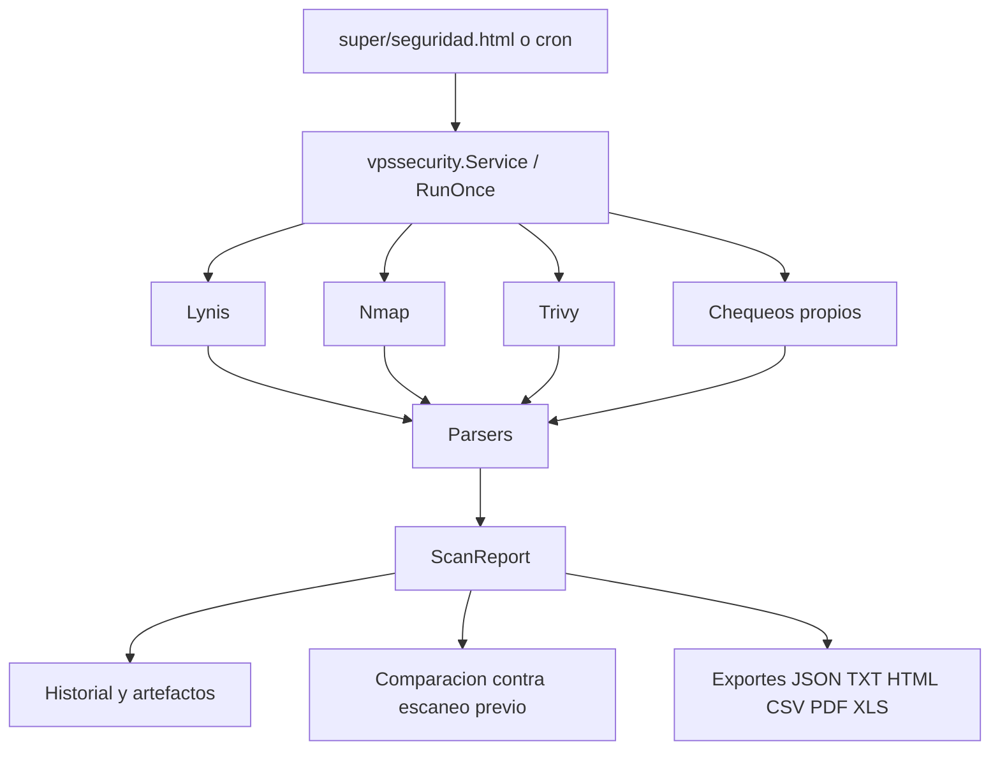
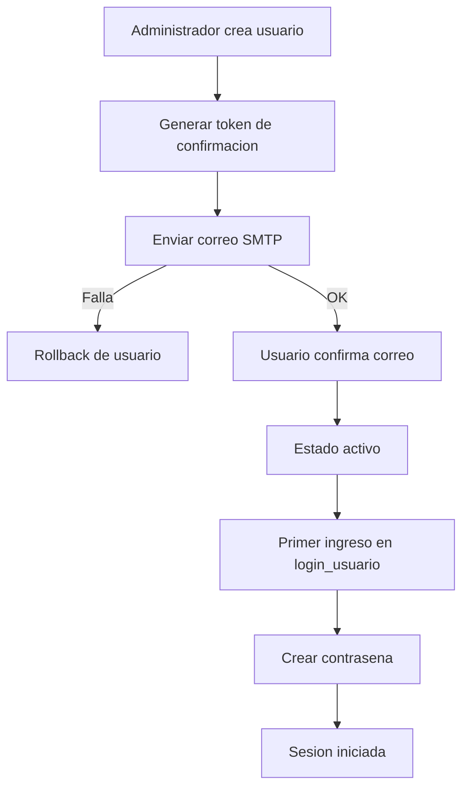
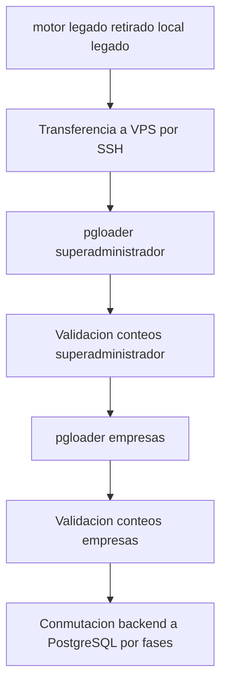
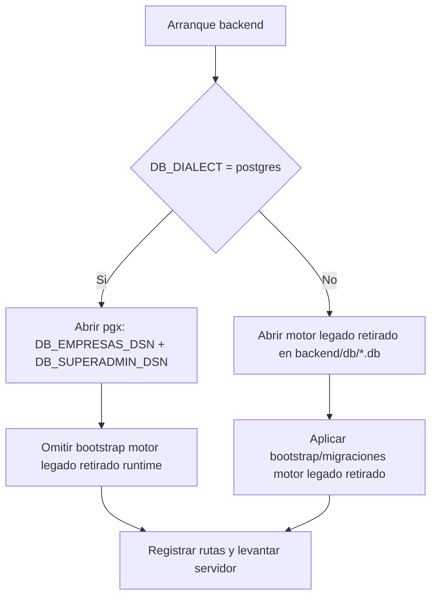
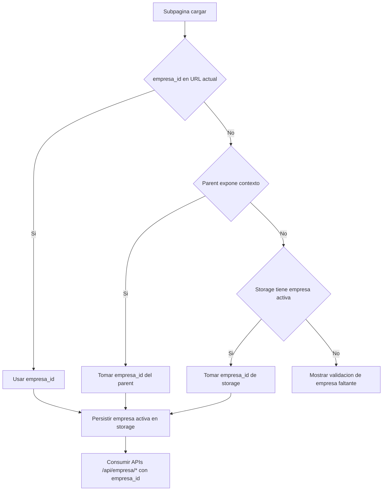

## Actualizacion 2026-05-17 (comunicaciones super unificadas)

- Frontend:
  - `web/super_administrador.html` agrupa mensajes y configuraciones de comunicacion en el modulo `Comunicaciones`.
  - El grupo enlaza mantenimiento, correos masivos, alertas sistema, Gmail SMTP, alertas de licencia y WhatsApp portal.
- Alcance:
  - No cambia handlers, endpoints, permisos ni tablas.

## Actualizacion 2026-05-17 (mantenimiento super principal)

- Backend:
  - `backend/handlers/super_mantenimiento_handlers.go` agrega `action=limpiar_viejos` sobre `/super/api/config/mantenimiento`.
  - La limpieza borra avisos desactivados o con fecha anterior al dia actual en `America/Bogota`.
- Frontend:
  - `web/super_administrador.html` muestra `Mantenimiento` como grupo propio.
  - `web/super/mantenimiento_sistema.html` expone el CRUD y el boton `Eliminar alertas viejas`.
- Flujo:
  - Super Administrador -> Mantenimiento -> Mantenimiento sistema -> administrar avisos -> limpiar viejos -> sincronizar aviso visible empresarial.

## Actualizacion 2026-05-17 (configuracion super por paginas)

- Frontend:
  - `web/super_administrador.html` agrega el grupo `Configuracion` con paginas independientes por seccion.
  - `web/super/configuracion/*.html` contiene las paginas por seccion.
  - `web/super/configuracion_avanzada.html` conserva los formularios y soporta modo aislado con `?single=1&section=...`.
- Flujo:
  - Super Administrador -> Configuracion -> pagina de seccion -> tarjeta aislada -> endpoint super existente.
- Alcance:
  - No se agregan endpoints, tablas ni dependencias.

## Actualizacion 2026-05-17 (avisos de mantenimiento super)

- Backend:
  - `backend/handlers/super_mantenimiento_handlers.go` mantiene `/super/api/config/mantenimiento` y agrega gestion de avisos individuales dentro de `mantenimiento_programado.avisos_json`.
  - `GET` devuelve `avisos_programados`; `PUT` crea/actualiza el aviso cargado; `POST action=desactivar|eliminar` cambia el estado de un aviso.
- Frontend:
  - `web/super/mantenimiento_sistema.html` muestra tabla de avisos con acciones `Cargar`, `Desactivar` y `Eliminar`.
  - `web/super_administrador.html` expone el acceso `Mantenimiento` en el submenu principal super.
  - `web/super/configuracion_avanzada.html` deja de contener la tarjeta para evitar duplicidad operativa.
- Flujo:
  - Super programa aviso -> lista JSON -> se sincroniza el primer aviso activo a las claves legacy -> empresas leen `/api/empresa/mantenimiento_programado`.
- Alcance:
  - No se agregan rutas publicas, tablas ni dependencias; `mantenimiento_activo` permanece separado del aviso programado.

## Actualizacion 2026-05-17 (carrito default en empresas antiguas)

- Backend:
  - `backend/handlers/empresa_preconfiguracion.go` mantiene el preset unico del carrito simplificado y agrega la normalizacion de `estaciones_config` ya existentes.
  - `backend/main.go` ejecuta esa normalizacion despues de asegurar el esquema de carritos.
- Flujo:
  - Arranque del servidor -> `EnsureEmpresaCarritosSchema` -> `ApplyDefaultCarritoUIToExistingEmpresaPrefs` -> filas activas de `empresa_estacion_prefs` con `clave='estaciones_config'` reciben `carrito_ui_global` simplificado.
  - Empresas activas sin `estaciones_config` reciben una preferencia base con `Estacion 1` para quedar alineadas antes de produccion.
- Alcance:
  - No se agregan rutas, tablas ni dependencias; se actualiza o crea solo el JSON de preferencias empresariales.

## Actualizacion 2026-05-17 (estaciones: primer clic solo activa)

- Frontend:
  - `web/administrar_empresa/configuracion_de_estaciones.html` agrega el check `Primer clic solo activa` en las opciones de visualizacion de tarjetas.
  - `web/administrar_empresa/estaciones.html` lee `station_card_ui.solo_activar_primer_clic` desde `estaciones_config`.
- Flujo:
  - Configuracion activa `solo_activar_primer_clic=true`.
  - Primer clic sobre estacion disponible -> `PUT /api/empresa/carritos_compra?action=activar_estacion` -> tarjeta queda ocupada sin navegar.
  - Segundo clic sobre estacion ya activa -> `carrito_de_compras.html` con `carrito_codigo` de la estacion.
- Compatibilidad:
  - `station_card_ui.abrir_carrito_al_activar=false` se interpreta como primer clic solo activa para conservar instalaciones anteriores.
- Alcance:
  - No se agregan endpoints, tablas ni dependencias; se reutilizan `empresa_estacion_prefs` y el carrito base por estacion.

## Actualizacion 2026-05-15 (venta directa: carrito 0)

- Frontend:
  - `web/administrar_empresa/carrito_de_compras.html` inicializa el modo `venta_directa` con el carrito canonico `VENTA-DIRECTA-{empresa_id}-0` cuando la URL no trae `carrito_codigo`.
  - La misma vista reutiliza carritos anteriores por codigo legacy `VENTA-DIRECTA-{empresa_id}` o `referencia_externa=CAJA_DIRECTA`.
- Flujo:
  - Menu empresarial -> `carrito_de_compras.html?modo=venta_directa&perm_page=linkVentaDirecta` -> crear/reutilizar carrito 0 -> cargar items/cobro en el nucleo unico de carrito.
- Alcance:
  - No se agregan endpoints ni tablas; el backend existente sigue recibiendo `/api/empresa/carritos_compra` y `/api/empresa/carritos_compra/items`.

## Actualizacion 2026-05-15 (empresas compartidas con alcance)

- Backend:
  - `backend/db/empresa_admin_compartida.go` conserva invitaciones y accesos, ahora con `nivel_acceso` y `modulos_permitidos`.
  - `backend/handlers/empresa_compartida_handlers.go` valida propietario, usuario invitado, nivel de acceso y modulos conocidos antes de crear, reenviar, aceptar o revocar.
  - `backend/handlers/empresa_permisos.go` aplica el alcance compartido dentro del contexto efectivo que consumen paginas y wrappers API.
- Frontend:
  - `web/editar_empresa.html` y `web/js/editar_empresa.js` muestran selector de alcance, checklist de modulos y accion para dejar de compartir.
  - `web/js/seleccionar_empresa.js` incorpora el mismo alcance en el panel rapido de compartir desde la tarjeta.
- Flujo:
  - Propietario comparte empresa -> invitacion guarda alcance -> invitado acepta -> acceso compartido materializa alcance -> permisos_contexto y wrappers limitan acciones/paginas.
- Alcance:
  - No se agregan rutas ni dependencias; se extiende el contrato JSON existente de `/super/api/empresas/compartidos` y `/api/empresa/permisos_contexto`.

## Actualizacion 2026-05-14 (centro de reportes unico)

- Frontend:
  - `web/administrar_empresa/reportes_menu.html` queda como shell de reportes con solo dos accesos: Centro de reportes y Asistente IA.
  - `web/administrar_empresa/reportes_ejecutivos.html` es la unica vista operativa de catalogo, vista previa y exportacion de datasets.
  - Se eliminan las vistas antiguas `reportes.html`, `reportes_inventario.html`, `reportes_finanzas.html` y `graficos_estadisticas.html`.
- Flujo:
  - Menu principal empresarial -> `reportes_menu.html` -> `reportes_ejecutivos.html`.
  - Accesos gerenciales -> catalogo/vista previa/exportacion dentro de `reportes_ejecutivos.html`.
- Alcance:
  - Se reutiliza `WithEmpresaReportesPermissions`, `empresa_id` y `/api/empresa/reportes`.
  - Se retira la ruta backend antigua `/api/empresa/graficos_estadisticas`; no se agregan tablas ni dependencias.

## Actualizacion 2026-05-13 (facturacion electronica: configuracion separada de pruebas)

- Frontend:
  - `web/administrar_empresa/facturacion_electronica.html` deja de mostrar el enlace `Abrir modulo DIAN / documental` y ya no contiene las tarjetas de pruebas DIAN, conexion/cola ni emision documental manual.
  - `web/administrar_empresa/facturacion_electronica_pruebas_dian.html` agrupa diagnostico DIAN, pruebas de habilitacion, activacion local de produccion, prueba/procesamiento de cola y emision documental manual.
  - `web/administrar_empresa/facturacion_electronica_menu.html` agrega la opcion `Pruebas DIAN y documentos`.
- Flujo:
  - Configuracion empresarial -> `facturacion_electronica.html`.
  - Validacion operativa DIAN/documental -> `facturacion_electronica_pruebas_dian.html`.
- Alcance:
  - No se agregan endpoints ni permisos; la subpagina reutiliza `/api/empresa/facturacion_electronica` y `/api/empresa/facturacion_electronica/dian`.

## Actualizacion 2026-05-13 (estaciones: control de aseo)

- Backend:
  - `backend/db/empresa_estacion_aseo.go` crea `empresa_estacion_aseo_eventos` y calcula `duracion_segundos` entre `sucia_desde` y `aseo_fin`.
  - `backend/handlers/empresa_estacion_prefs.go` inicia el evento cuando el carrito marca `estacion_estado_sucia=1`.
  - `backend/handlers/empresa_estacion_aseo.go` expone `/api/empresa/estacion_aseo` para contexto de usuario, reporte de aseo terminado y reporte gerencial.
- Frontend:
  - `web/administrar_empresa/administrar_usuarios.html` agrega la opcion `Control de aseo`.
  - `web/administrar_empresa/estaciones.html` cambia el clic sobre una estacion sucia para usuarios habilitados: registra el aseo y deja la estacion disponible.
  - `web/administrar_empresa/reporte_aseo_estaciones.html` muestra tiempos por estacion/aseadora.
- Flujo:
  - `carrito_de_compras.html` paga estacion -> `PUT /api/empresa/estacion_prefs` con `estacion_estado_sucia=1` -> `empresa_estacion_aseo_eventos` queda pendiente -> aseadora habilitada hace clic en la estacion sucia -> `POST /api/empresa/estacion_aseo?action=finalizar` -> se guarda duracion y se limpia el estado sucio.

## Actualizacion 2026-05-13 (venta directa y factura electronica DIAN)
- `backend/handlers/carritos_compras.go` mantiene el cierre de venta/comprobante separado del estado fiscal de la factura electronica asociada.
- Al generar factura electronica desde una venta, el flujo `registrarDocumentoVentaDesdeCarritoPagado` -> `registrarFacturaElectronicaDesdeDocumentoVenta` -> `processFacturacionIntegracionForDocumento` conserva `empresa_id`, documento origen y cola de reintentos.
- Para Colombia en ambiente `produccion`, si `integracion_fiscal.estado_envio` no queda `enviado`, la factura asociada se actualiza a `estado_documento=pendiente_emision` y `evento_ultimo=factura_integracion_fallida`; la venta/comprobante permanece emitida.
- `dispatchFacturacionProveedor` y `facturacionProveedorConnectionStatus` ya no tratan `manual`, `local` ni `interno` como proveedor valido para Colombia produccion; esas configuraciones quedan bloqueadas hasta configurar DIAN/proveedor real.
- `backend/handlers/facturacion_documentos_electronicos_test.go` cubre que solo Colombia produccion exige acuse fiscal para mantener la factura automatica como emitida.
- No se agregan tablas, rutas ni permisos; se reutilizan `empresa_facturacion_documentos` y `facturacion_electronica_reintentos`.

## Actualizacion 2026-05-13 (juegos moviles con records)
- `backend/main.go` asegura `super_juegos_records` y publica `/api/public/juegos/records` usando `backend/handlers/super_juegos.go`.
- `web/Juegos/menu_juegos.html` funciona como lobby responsive con tarjetas uniformes y portadas PNG reales en `web/img/juegos/`.
- `web/Juegos/juegos_records.js` centraliza ranking y guardado; `arcade_embed.js` orquesta iframes, controles tactiles, sonido y panel de records; `open_game_embed.js` reporta puntajes desde los juegos embebidos.
- `juegos/public/*` es el frontend del emulador web servido por `/emulador/`; ahora incorpora controles tactiles y `web/Juegos/n64/index.html` lo embebe como pantalla N64.

## Actualizacion 2026-05-13 (submenu de Configuracion super)
- `web/super/configuracion_avanzada.html` mantiene sus tarjetas de configuracion y buscador, pero el submenu interno adopta el patron de sidebar simple usado por `seleccionar_empresa.html`.
- `web/menu.js` extiende el autocierre movil de `.admin-sidebar-mobile-collapsible` para botones de seccion (`button[data-target]`), ademas de enlaces.
- No cambia el contrato de guardado de configuraciones ni las rutas `/super/api/config/*`.

## Actualizacion 2026-05-13 (tema del Explorador de Archivos super)
- `web/super/explorador_archivos.html` sincroniza el tema antes de cargar CSS usando `localStorage`/cookie `pcs_theme`.
- La hoja inline de la pagina usa variables globales (`--bg`, `--surface`, `--surface-soft`, `--border`, `--text`, `--muted`, `--accent`) para que el iframe respete claro/oscuro y variantes del super administrador.
- No cambia `GET /super/api/explorador_archivos`, ni las restricciones de solo lectura del handler.

## Actualizacion 2026-05-12 (tickets de ayuda empresariales profesionalizados)
- `web/menu.js` mantiene la accion `Crear ticket de ayuda` en el menu flotante global y ahora captura preferencia de contacto, telefono opcional, tickets recientes y contexto tecnico seguro de la pantalla activa.
- `backend/handlers/super_tickets_ayuda.go` expone detalle y mensajes propios por empresa en `/api/empresa/tickets_ayuda`, siempre validando `empresa_id` y ocultando notas internas.
- `backend/db/tickets_ayuda.go` amplia `super_tickets_ayuda` con `contacto_telefono`, `contacto_preferido` y `contexto_json`, y reabre a revision tickets cerrados cuando una empresa agrega nuevo mensaje.
- `web/super/tickets_ayuda.html` muestra triage con categoria, modulo, contacto, ruta y contexto tecnico para soporte SaaS.

## Actualizacion 2026-05-12 (mesa central de tickets de ayuda)

- `web/administrar_empresa.html` deja `Control electrico` fuera del sidebar principal y mantiene un unico acceso a Configuracion.
- `web/administrar_empresa/configuracion_menu.html` ubica `linkControlElectrico` dentro de `Estaciones, sensores y tarifas`, cargando el modulo en `configuracionContentFrame`.
- `web/administrar_empresa/configuracion.html` agrega una tarjeta del mapa ejecutivo para abrir la configuracion de Raspberry Pi, reles y salidas por estacion.

- `web/menu.js` agrega la accion `Crear ticket de ayuda` al menu flotante global. La accion detecta `empresa_id`, ruta y modulo activo, y envia la solicitud a `/api/empresa/tickets_ayuda`.
- `backend/main.go` registra `/api/empresa/tickets_ayuda` con `WithEmpresaSelfServicePermissions` y `/super/api/tickets_ayuda` para la consola central.
- `backend/handlers/super_tickets_ayuda.go` separa el flujo empresarial de creacion/listado propio y el flujo super de bandeja, detalle, respuesta y cambio de estado.
- `backend/db/tickets_ayuda.go` mantiene el esquema PostgreSQL y las operaciones sobre `super_tickets_ayuda` y `super_ticket_ayuda_mensajes`.
- `web/super/tickets_ayuda.html` consume `/super/api/tickets_ayuda` desde el iframe del panel super.

## Actualizacion 2026-05-12 (portal: seis tarjetas y carrusel)

- `web/index.html` divide las tarjetas publicas de sistemas en `primaryCards = cards.slice(0, 6)` y `carouselCards = cards.slice(6)`.
- `#portalCardsGrid` renderiza solo las 6 primeras tarjetas para mantener la portada inicial compacta.
- `#portalCardsCarouselSection` contiene una sola hilera horizontal `#portalCardsCarousel` con las tarjetas restantes y botones `#portalCarouselPrev`/`#portalCarouselNext`.
- Flujo visual: `Hero` -> grilla de 6 sistemas -> carrusel `Mas sistemas` -> seccion `Modulos del sistema`.
- Alcance: frontend puro; no agrega endpoints, tablas, permisos ni dependencias.

## Actualizacion 2026-05-12 (portal: fotos del index en landing descriptiva)

- `web/index.html` sigue usando `imagen_url` como logo de tarjeta e `imagen_secundaria_url` como foto/ilustracion principal.
- `web/descripcion_de_los_sistemas.html` ahora normaliza tambien `imagen_secundaria_url` y la renderiza como `system-detail-photo`, dejando `imagen_url` como `system-detail-logo`.
- `web/estilos.css` define tamanos responsivos para la foto y el logo en la landing descriptiva.
- Flujo: `index.html` -> `descripcion_de_los_sistemas.html?detalle_id=...` -> `GET /api/public/pagina_principal` -> tarjeta descriptiva con la misma imagen secundaria del portal.

## Actualizacion 2026-05-12 (VPS portable 100% Docker)

- `deploy/docker-compose.platform.yml` define el nucleo Docker (`postgres`, `backend`, `frontend`) y agrega perfiles `edge`/`certbot` para publicar `80/443` y administrar certificados dentro de contenedores.
- `deploy/nginx/edge-http-only.conf.template` se usa durante ACME inicial; `deploy/nginx/edge.conf.template` queda como Nginx publico HTTPS final con proxy hacia `frontend` y OnlyOffice cuando el perfil `office` esta activo.
- `deploy/scripts/vps-docker-edge-up.sh` orquesta: validar Compose -> levantar nucleo -> detener Nginx host -> iniciar edge HTTP -> emitir certificado -> recrear edge HTTPS.
- `deploy/scripts/vps-docker-edge-renew.sh` ejecuta renovacion Certbot en contenedor y recarga `pcs-edge`.
- Flujo de migracion futura: restaurar volumenes Docker + copiar `deploy/.env.platform` privado + levantar `docker compose --profile edge up -d` + apuntar DNS al nuevo VPS.

## Actualizacion 2026-05-12 (nucleo configurable por plantilla)

- `backend/db/tipo_empresa_preconfiguracion.go` agrega `TipoEmpresaPreconfigAdaptacionNucleo` dentro del template para declarar fuente unica de usuarios, productos/servicios y estaciones.
- `backend/handlers/empresa_preconfiguracion.go` persiste la adaptacion en `empresa_estacion_prefs` y agrega metadata de recurso a `estaciones_config`.
- `backend/handlers/configuracion_guiada.go` reutiliza el mismo generador de estaciones con recurso de negocio para los ajustes guiados.
- `web/super/preconfiguracion_tipos_empresa.html` muestra `Nucleo configurable` y envia `adaptacion_nucleo` al guardar una plantilla.

## Actualizacion 2026-05-12 (matriz profesional de 30 verticales)

- `backend/handlers/empresa_verticales_integracion.go` construye el contrato universal de integracion con exactamente 30 verticales canonicos: 10 clasicos reales y 20 nuevos desde `db.NuevosVerticalesTipoEmpresaCatalog()` y `db.BuildTipoEmpresaPreconfigIntegracionVertical()`.
- Los alias `consultorio_odontologico` y `taxi` quedan declarados en `fused_modules`; `turnos_atencion`/`turnos` quedan como `support_modules` cuando una plantilla los usa, no como verticales de producto.
- Los endpoints `/api/public/verticales_integracion/catalogo`, `/api/empresa/verticales_integracion/catalogo` y `/super/api/verticales_integracion/catalogo` exponen readiness profesional, flujos de ingreso, flujos de egreso y reportes financieros calculados sin crear tablas nuevas.
- `backend/db/nuevos_verticales_bootstrap.go` y `backend/db/tipo_empresa_preconfiguracion.go` propagan `financial_core_modules`, `income_flow`, `expense_flow`, `financial_tables` y `financial_reports` dentro de `integracion_vertical`.
- `web/administrar_empresa/verticales_integracion.html` es la vista de Configuracion > Adaptacion por tipo; consume la matriz, `/api/empresa/permisos_contexto` y los catalogos locales como fallback.
- `web/js/verticales_integracion_catalogo.js` conserva respaldo frontend y puede fusionar la metadata extendida que llega del backend.

## Actualizacion 2026-05-12 (Probar Gratis index)

- `web/index.html` construye el enlace de detalle hacia `/descripcion_de_los_sistemas.html`, preservando parametros comerciales y ancla por tarjeta.
- `web/descripcion_de_los_sistemas.html` queda como landing descriptiva oficial para renderizar la informacion ampliada del sistema elegido.
- `backend/main.go` conserva compatibilidad con `/descripcion_de_los_sistemas.ht`, sirviendo el HTML oficial con tipo de contenido correcto para impedir descargas.
- `backend/utils/utils.go` mantiene publicas ambas rutas exactas en `AuthMiddleware`; no hay cambios de permisos privados ni endpoints de empresa.

## Actualizacion 2026-05-12 (Centro de mando super)

- Actualizacion 2026-05-12 (super: Explorador de Archivos):
  - `backend/handlers/super_file_explorer.go` expone `GET /super/api/explorador_archivos` para listar raices, carpetas y metadata de entradas del filesystem visible para el backend.
  - `web/super/explorador_archivos.html` consume el endpoint y presenta una tabla tipo explorador con ruta editable, carpeta padre, recarga y raices disponibles.
  - `web/super_administrador.html` y `web/js/super_administrador.js` agregan la pagina al grupo Plataforma solo para la navegacion completa de `super_administrador`; el rol `control_super_administrador` no recibe este acceso.
  - Flujo: `super_administrador.html` -> `super/explorador_archivos.html` -> `GET /super/api/explorador_archivos?action=list&path=...` -> `os.ReadDir`/`os.Stat` -> JSON de metadata sin lectura de contenido ni escritura.

- `web/super_administrador.html` mantiene `web/super/licencias_resumen.html` como entrada de Centro de mando para super administrador.
- `web/super/licencias_resumen.html` se reconstruye como consola ejecutiva frontend pura, sin dependencias externas, consumiendo los contratos super existentes de metricas, PostgreSQL, alertas, errores, servidores, licencias, empresas y consumos.
- No hay rutas backend nuevas ni cambios de esquema; el flujo sigue dentro del panel super autenticado.

## Actualizacion 2026-05-11 (2FA login desde configuracion avanzada)

- `backend/handlers/admin_totp_handlers.go` centraliza `security.admin_2fa.enabled`, expone `/super/api/config/admin_2fa` y separa la activacion global del secreto TOTP por administrador.
- `backend/handlers/auth_admin_handlers.go` exige `otp_code` solo cuando la bandera global y el TOTP de la cuenta estan activos.
- `backend/handlers/recaptcha.go` publica `window.ADMIN_2FA_LOGIN_ENABLED` dentro de `/config.js` para que el login oculte/muestre el campo sin una llamada adicional.
- `web/login.html` y `web/js/login.js` mantienen oculto y deshabilitado el input `adminOtpCode` cuando la bandera global esta apagada.
- `web/super/configuracion_avanzada.html` agrega la tarjeta `2FA login`; `web/super/seguridad_2fa.html` sigue siendo la vista para generar, confirmar o desactivar el secreto TOTP de la cuenta.

## Actualizacion 2026-05-11 (catalogos publicos de verticales sin sesion)

- `backend/main.go` registra los catalogos `/api/public/verticales_nuevos/catalogo` y `/api/public/verticales_integracion/catalogo` como contratos publicos de lectura para portada, tarjetas y matriz comercial.
- `backend/utils/utils.go` permite esas dos rutas en `AuthMiddleware` sin token de sesion; los endpoints empresa y super conservan autenticacion y permisos propios.
- `backend/utils/auth_middleware_test.go` cubre ambos catalogos publicos para evitar regresiones que hagan aparecer verticales como cargados parcialmente por falta de sesion.

## Actualizacion 2026-05-11 (sincronizacion idempotente de pagos verticales)

- `backend/db/odontologia.go` agrega referencia y nombre estables para carritos generados desde pagos odontologicos cuando el pago ya tiene ID.
- `createEmpresaOdontologiaPagoCarrito` reutiliza `carritos_compras.referencia_externa` antes de crear una venta central nueva.
- `backend/db/gimnasio.go` aplica el mismo contrato para pagos de gimnasio, evitando colisiones por nombre unico en sincronizaciones repetidas.
- `backend/db/odontologia_integracion_test.go` y `backend/db/gimnasio_integracion_test.go` validan que la referencia historica use el ID del pago como llave estable.

## Actualizacion 2026-05-11 (portada index y tarjetas reales)

- `web/index.html` consume `web/js/nuevos_verticales_catalogo.js` antes de construir tarjetas publicas.
- `backend/handlers/pagina_principal_handlers.go` mantiene los defaults de `/api/public/pagina_principal` alineados con la misma oferta real cuando no existe configuracion guardada en super.
- Las tarjetas base de la portada cubren modulos reales del nucleo y transversales: POS, CRM, hotel/motel, apartamentos, propiedad horizontal, gimnasio, odontologia, drogueria/farmacia, alquileres, domicilios, taxi, turnos, carnets, produccion/MRP, compras OCR/IA, WMS, bancos/pagos, gestion documental, tickets de ayuda/calidad, tesoreria, facturacion, cierre fiscal, centros de costo, activos, cobranza, contador, certificados y AIU.
- El catalogo local de los 20 verticales nuevos agrega estado de producto (`productionMass`, `productionRank`, `decisionPreconfig`) y metadata de plantilla (`templateActivates`, `tablesTouched`, `requiredPermissions`, `saleFlow`, `reportsProduced`).
- `index.html` transforma en tarjetas publicas los 20 verticales nuevos porque todos quedan con visibilidad operativa y produccion masiva.

## Actualizacion 2026-05-11 (20 verticales nuevos reales)

- `backend/db/nuevos_verticales_bootstrap.go` declara prioridad 1-20 para todos los verticales nuevos y `EnsureNuevosVerticalesProduccionMasivaLicencias` asegura tipos, preconfiguraciones y licencias para los 20.
- `backend/handlers/empresa_verticales_nuevos.go` mantiene el contrato publico/super/empresa con `produccion_masiva`, `prioridad_produccion` e `integracion_preconfig`; agrega el alias `asegurar_20_licencias`.
- `web/super/verticales_produccion_masiva.html` gobierna los 20 verticales reales, con semaforo de listos/no listos y accion `Asegurar 20`.
- `web/js/nuevos_verticales_catalogo.js` expone los 20 como plantillas reales publicables sobre el nucleo unico.

## Actualizacion 2026-05-11 (sincronizacion segura de matriz vertical)

- El mismo contrato publica `template_activates`, `tables_touched`, `required_permissions`, `sale_flow` y `reports_produced` para convertir cada vertical visible en una plantilla auditable.
- `web/administrar_empresa/verticales_integracion.html` carga en paralelo el catalogo de verticales y `/api/empresa/permisos_contexto`; solo habilita `Sincronizar` cuando el usuario tiene pagina del vertical o permiso de creacion del modulo.
- La tabla de la pantalla muestra modulos, plantilla, tablas, permisos, flujo de venta y reportes por vertical para evitar duplicados funcionales ocultos.
- `web/estilos.css` ajusta el resumen de cinco KPIs para incluir sincronizaciones permitidas.

## Actualizacion 2026-05-11 (preconfiguracion vertical y produccion masiva)

- `backend/db/tipo_empresa_preconfiguracion.go` agrega el bloque `integracion_vertical` al template normalizado de preconfiguracion.
- `backend/db/nuevos_verticales_bootstrap.go` centraliza la decision de 20 verticales nuevos para produccion masiva.
- `backend/handlers/empresa_verticales_nuevos.go` publica `integracion_preconfig`, `produccion_masiva`, `prioridad_produccion` y `decision_preconfig` en los catalogos publico, empresa y super.
- `web/super/verticales_produccion_masiva.html` consume el catalogo super y presenta KPIs, filtros, ranking, metadata extendida y exportacion CSV para gobierno comercial.
- La misma vista calcula `Listo venta` cruzando catalogo de verticales, preconfiguraciones y licencias activas; si falta algo, muestra el pendiente por fila.
- La accion `Asegurar 20` llama `POST /super/api/verticales_nuevos/catalogoaction=asegurar_20_licencias`; `backend/handlers/empresa_verticales_nuevos.go` delega en `db.EnsureNuevosVerticalesProduccionMasivaLicencias`.
- `web/super_administrador.html` y `web/js/super_administrador.js` incorporan la vista como pagina permitida del panel principal para `super_administrador`.
- `web/super/tipos_empresas.html`, `web/super/preconfiguracion_tipos_empresa.html` y `web/super/licencias.html` aceptan filtros iniciales por `q`, `vertical` o `modulo` para abrir desde la matriz comercial sin duplicar pantallas ni datos.
- `backend/db/tipo_empresa_preconfiguracion_test.go` y `backend/handlers/empresa_verticales_nuevos_test.go` validan que existan exactamente 20 verticales masivos y que todos tengan metadata extendida.
- `documentos/plan_verticales_produccion_masiva_2026-05-11.md` registra decision comercial y plan de cierre para version masiva.

## Actualizacion 2026-05-11 (integracion profesional de verticales)

- `documentos/matriz_integracion_verticales.md` define el contrato de nucleo unico y el estado visible/oculto de cada vertical.
- `web/js/verticales_integracion_catalogo.js` alimenta la decision visual del panel empresarial para no mostrar verticales con ventas, clientes, productos o pagos duplicados.
- `web/js/administrar_empresa.js` aplica ese estado antes de permisos/licencias, por lo que una vertical pendiente queda oculta aunque exista pagina, handler o permiso.
- `backend/handlers/empresa_verticales_nuevos.go` expone metadata de integracion en los catalogos publico, empresa y super de los 20 verticales nuevos.
- No hay cambio de esquema en esta fase; la siguiente oleada debe migrar duplicados reales al nucleo PostgreSQL compartido.

## Actualizacion 2026-05-11 (gimnasio al nucleo)

- `backend/db/gimnasio.go` enlaza socios con `clientes`, planes con `servicios` y pagos con `carritos_compras`/`carrito_compra_items`.
- `EnsureEmpresaGimnasioSchema` asegura columnas de integracion antes de crear indices sobre `servicio_id`, `cliente_id` y `carrito_id`, evitando carga parcial en bases PostgreSQL existentes.
- `web/administrar_empresa/gimnasio.html` y `web/js/gimnasio.js` agregan una accion operativa para ejecutar la sincronizacion y mostrar resumen.
- `web/js/verticales_integracion_catalogo.js` marca `gimnasio` como plantilla visible integrada.

## Actualizacion 2026-05-11 (odontologia al nucleo)

- `backend/db/odontologia.go` enlaza pacientes con `clientes`, tratamientos con `servicios` y pagos con `carritos_compras`/`carrito_compra_items`.
- `EnsureEmpresaOdontologiaSchema` asegura columnas de integracion antes de crear indices sobre `cliente_id`, `servicio_id` y `carrito_id`, corrigiendo errores que hacian ver el modulo como cargado parcialmente.
- `web/administrar_empresa/consultorio_odontologico.html` y `web/js/consultorio_odontologico.js` agregan una accion operativa para ejecutar la sincronizacion y mostrar resumen.
- `web/js/verticales_integracion_catalogo.js` marca `odontologia` y `consultorio_odontologico` como plantillas visibles integradas.

## Actualizacion 2026-05-11 (parqueadero al nucleo)

- `backend/db/parqueadero.go` enlaza tickets con `clientes` opcionales, `servicios` por tipo de vehiculo y `carritos_compras`/`carrito_compra_items` al cobrar salida.
- `web/administrar_empresa/parqueadero.html` agrega una accion operativa para ejecutar la sincronizacion y mostrar resumen.
- `web/js/verticales_integracion_catalogo.js` marca `parqueadero` como plantilla visible integrada.

## Actualizacion 2026-05-11 (taxi system al nucleo)

- `backend/db/taxi_system.go` enlaza clientes/solicitudes con `clientes`, servicios de viaje con `servicios` y viajes completados con `carritos_compras`/`carrito_compra_items`.
- `web/administrar_empresa/taxi_system.html` y `web/js/taxi_system.js` agregan una accion operativa para ejecutar la sincronizacion y mostrar resumen.
- `web/js/verticales_integracion_catalogo.js` marca `taxi_system` y `taxi` como plantillas visibles integradas.

## Actualizacion 2026-05-11 (domicilios al nucleo)

- `backend/db/domicilios.go` enlaza clientes de pedidos con `clientes`, items de menu con `servicios` y pedidos entregados con `carritos_compras`/`carrito_compra_items`.
- `web/administrar_empresa/domicilios.html` y `web/js/domicilios.js` agregan una accion operativa para ejecutar la sincronizacion y mostrar resumen.
- `web/js/verticales_integracion_catalogo.js` marca `domicilios` como plantilla visible integrada.

## Actualizacion 2026-05-11 (apartamentos turisticos al nucleo)

- `backend/db/apartamentos_turisticos.go` enlaza huespedes con `clientes`, unidades con `servicios` y reservas cerradas con `carritos_compras`/`carrito_compra_items`.
- `web/administrar_empresa/apartamentos_turisticos.html` agrega una accion operativa para ejecutar la sincronizacion y mostrar resumen.
- `web/js/verticales_integracion_catalogo.js` marca `apartamentos_turisticos` como plantilla visible integrada.

## Actualizacion 2026-05-11 (propiedad horizontal al nucleo)

- `backend/db/propiedad_horizontal.go` enlaza personas con `clientes`, unidades/cargos con `servicios` y recaudos con `carritos_compras`/`carrito_compra_items`.
- `web/administrar_empresa/propiedad_horizontal.html` agrega una accion operativa para ejecutar la sincronizacion y mostrar resumen.
- `web/js/verticales_integracion_catalogo.js` marca `propiedad_horizontal` como plantilla visible integrada.

## Actualizacion 2026-05-11 (alquileres al nucleo)

- `backend/db/alquileres.go` enlaza clientes de contratos con `clientes`, activos/tarifas con `servicios` y contratos con `carritos_compras`/`carrito_compra_items`.
- `web/administrar_empresa/alquileres.html` y `web/js/alquileres.js` agregan una accion operativa para ejecutar la sincronizacion y mostrar resumen.
- `web/js/verticales_integracion_catalogo.js` marca `alquileres` como plantilla visible integrada.

## Actualizacion 2026-05-11 (drogueria/farmacia al nucleo)

- `backend/handlers/modulos_empresariales_colombia.go` sigue atendiendo `/api/empresa/drogueria_farmacia` mediante `EmpresaModuloColombiaHandler`; no se crea handler paralelo de ventas o inventario.
- `backend/db/modulos_empresariales_colombia.go` mantiene `drogueria_farmacia` como expediente sanitario sobre `empresa_modulos_colombia_*`.
- `backend/db/drogueria_farmacia_bootstrap.go` conserva licencias con `inventario`, `compras`, `ventas`, `clientes` y `facturacion` centrales.
- `web/administrar_empresa/drogueria_farmacia.html` declara que la gestion sanitaria opera sobre productos, inventario, ventas y facturacion centrales.
- `web/js/verticales_integracion_catalogo.js` marca `drogueria_farmacia` como plantilla visible integrada.

## Actualizacion 2026-05-11 (AIU construccion al nucleo)

- `backend/db/aiu_construccion.go` enlaza contratos con `clientes`/`servicios`, conceptos con `servicios` y facturas con `carritos_compras`/`carrito_compra_items`.
- `web/administrar_empresa/aiu_construccion.html` agrega accion operativa para ejecutar la sincronizacion y mostrar resumen.
- `web/js/verticales_integracion_catalogo.js` marca `aiu_construccion` como plantilla visible integrada.
- `backend/db/aiu_construccion_test.go` cubre normalizacion de codigo de integracion y referencia externa estable de factura AIU.

## Actualizacion 2026-05-11 (catalogo API de integracion vertical)

- `backend/main.go` registra `/api/public/verticales_integracion/catalogo`, `/api/empresa/verticales_integracion/catalogo` y `/super/api/verticales_integracion/catalogo`.
- `web/js/verticales_integracion_catalogo.js` permite fusionar items recibidos desde backend mediante `applyCatalogItems`.
- `web/js/administrar_empresa.js` consulta el catalogo de empresa antes de resolver permisos y usa el catalogo local si la API no responde.
- `web/administrar_empresa.html` y `web/estilos.css` agregan un indicador compacto de la matriz activa en el sidebar empresarial.
- `backend/handlers/empresa_permisos.go` y `web/js/administrar_empresa.js` registran `linkVerticalesIntegracion` bajo `seguridad:R`.
- `backend/handlers/empresa_verticales_integracion_test.go` valida que los verticales visibles no declaren duplicados del nucleo y que existan los verticales clasicos integrados.

## Actualizacion 2026-05-10 (roles finos y ayuda privada super)

- `backend/handlers/empresa_permisos.go` es la fuente canonica de modulos, acciones, paginas `link...`, wrappers empresariales y compatibilidad de licencias para los nuevos modulos finos.
- `backend/main.go` registra rutas empresariales recientes con wrappers especificos: CRM unificado, reservas hoteleras, chat/tareas, horarios, asistencia, vehiculos, hoja de vida operativa, GPS, nomina, reportes, auditoria, backups, OnlyOffice y Nextcloud.
- `web/js/administrar_empresa.js` mantiene el espejo frontend del catalogo para mostrar/ocultar botones del panel y submenus con la misma regla modulo/accion que el backend.
- `web/super_administrador.html` incluye el boton `Ayuda super administrador` hacia `/ayuda/ayuda.html`; `web/js/super_administrador.js` permite cargarlo en `contentFrame`, pero la lista limitada del rol `control_super_administrador` no lo habilita.
- `backend/utils/utils.go` conserva `/ayuda/ayuda.html` como ruta privada exclusiva de `super_administrador`; las ayudas especificas bajo `/ayuda/` siguen publicas cuando no son la ayuda administrativa completa.
- `documentos/reporte_roles_ayuda_super_2026-05-10.md` resume el contrato operativo y las pruebas recomendadas.

## Actualizacion 2026-05-10 (alertas automaticas super)

- `backend/db/super_alertas.go` concentra la persistencia del modulo de alertas globales: configuracion, historial, conteo de sesiones y conexiones PostgreSQL.
- `backend/handlers/super_alertas.go` expone `/super/api/alertas_sistema` y el worker `StartSuperAlertasWorker`, que se registra desde `backend/main.go` dentro de los procesos protegidos.
- `backend/metrics/collector.go` alimenta las metricas de disco en `metrics`; el modulo de alertas consume la ultima muestra junto con configuraciones Hostinger/Gmail existentes.
- `web/super/alertas_sistema.html` es la vista iframe del panel super y `web/super_administrador.html` agrega el enlace en Infraestructura y comunicaciones.

## Actualizacion 2026-05-05 (portal publico, carta QR y publicacion Motel Calipso)

- `web/index.html` contiene la seccion publica `Modulos del sistema` y el arreglo `fallbackCards`; ambos describen el alcance comercial actual de la plataforma: POS, estaciones, hotel/motel, gimnasio, odontologia, domicilios, taxi, turnos, control electrico, venta publica, carta QR, red social, roles/licencias y hoja de vida.
- `backend/utils/utils.go` en `AuthMiddleware` declara como publicas las rutas de carta `visualizar_productos_y_precios_publico.html` tanto directa como bajo `/{empresa_slug}/...`. Esto mantiene el contrato de solo lectura externa y evita `401` para visitantes.
- `backend/tmp_tools/seed_motel_calipso_publicacion/main.go` es un helper idempotente para publicar Motel Calipso en `empresa_venta_publica_configuracion`, `empresa_venta_publica_paginas`, `empresa_venta_publica_items` y `empresa_publicaciones_red_social`.
- `documentos/carta_publica_productos.md`, `documentos/domicilios_profesional.md` y `documentos/taxi_system_profesional.md` registran la documentacion funcional de los modulos publicos/verticales y su presencia en el portal.

## Actualizacion 2026-04-30 (pagos, chat IA, documentos y empresas compartidas)

- Checkout Epayco:
  - `backend/handlers/payments_handlers.go` intenta Smart Checkout v2 como flujo principal.
  - Si Smart Checkout no autentica y existe `epayco.customer_id`, construye un formulario clasico firmado por POST hacia `https://secure.payco.co/checkout.php`.
  - `web/pagar_licencia.html` valida que la accion sea segura y envia el formulario POST; no redirige por GET a URLs legacy que devuelven XML `AccessDenied`.
- Chat flotante IA:
  - `web/js/ai_chat_drawer.js` concentra la experiencia del chat cuadrado, robot y secretaria.
  - La secretaria IA usa avatar 3D/caricatura ejecutiva y voz efectiva `es-CO-female`; el robot conserva voz configurable por empresa.
  - La Web Speech API y el servicio de voz streaming mantienen fallback: si voz IA o microfono fallan, el chat sigue funcionando por texto.
- Empresas compartidas:
  - `backend/handlers/empresa_compartida_handlers.go` expone consulta y revocacion de administradores compartidos.
  - `web/js/editar_empresa.js` muestra dentro del lapiz de empresa los administradores compartidos y permite retirar acceso con trazabilidad.
  - `web/js/seleccionar_empresa.js` mantiene el contexto visible para propietario y receptor.
- Documentos dinamicos con IA:
  - `backend/handlers/dynamic_documents.go` expone `POST /generate` y `GET /download`.
  - El flujo recibe prompt/contenido, aplica variables y templates Go/HTML, y exporta PDF, DOCX, XLSX, HTML, TXT o JSON.
  - Las rutas quedan protegidas por sesion y guardan archivos temporales descargables por `document_id`.

## Actualizacion 2026-04-29 (navegacion empresarial por modulos)

- `web/administrar_empresa.html` mantiene el shell iframe, pero el menu lateral queda agrupado por categorias empresariales: colaboracion, operacion/ventas, inventario/compras, finanzas/cumplimiento, personas/activos, analisis/control, documentos/nube/soporte y administracion.
- `web/administrar_empresa/configuracion_menu.html` organiza las subpaginas de configuracion en base empresarial, ventas/cobro, estaciones/tarifas, fiscal/automatizacion y avanzado.
- `web/js/administrar_empresa.js` conserva la resolucion de `empresa_id`, permisos y estado activo del iframe; agrega soporte para refrescar visibilidad de grupos cuando los permisos ocultan todos los enlaces de una categoria.
- `web/estilos.css` agrega estilos compartidos para `admin-nav-grouped`, `admin-nav-group` y `admin-nav-sublist` con comportamiento responsive.

## Actualizacion 2026-04-29 (auditoria en tiempo real como contexto IA)

- Backend auditoria / IA:
  - `backend/handlers/auditoria_empresa.go` registra ahora tambien acciones de lectura (`R`) desde los wrappers `/api/empresa/*`, manteniendo la escritura de auditoria como no bloqueante.
  - `backend/db/auditoria_empresa.go` agrega constructores best-effort de contexto IA: resumen por empresa (`AUDITORIA_TIEMPO_REAL`) y resumen global para super (`AUDITORIA_GLOBAL_TIEMPO_REAL`), busqueda profunda por intencion (`AUDITORIA_BUSQUEDA_PROFUNDA` / `AUDITORIA_GLOBAL_BUSQUEDA_PROFUNDA`) y consultas DB seguras (`AUDITORIA_CONSULTAS_DB_SEGURAS` / `AUDITORIA_GLOBAL_CONSULTAS_DB_SEGURAS`), sin inyectar metadata sensible ni depender del proveedor IA.
  - `backend/db/chat_inteligencia_artificial.go` agrega lectura total controlada para el chat empresarial: inventario de tablas con `empresa_id`, columnas no sensibles y muestras SELECT parametrizadas por tabla para GPT-5.4 mini/modelo activo.
  - `backend/handlers/super_chat_ia_logica.go` y `web/super/configuracion_logica_del_chat_con_ia.html` exponen la configuracion super `ai.chat.empresa.db_query_enabled`, `ai.chat.empresa.db_query_max_tables` y `ai.chat.empresa.db_query_rows`; el acceso viene activo por defecto.
  - `backend/db/auditoria_empresa.go` crea `empresa_auditoria_ia_consultas` para auditar cada preparacion de contexto IA: modelo, usuario, hash/resumen de pregunta, filtros, resultados compactos, eventos consultados y tamano del contexto.
  - `backend/db/chat_inteligencia_artificial.go` incorpora esos bloques al contexto validado de chat empresarial y chat global, pasando el modelo real usado por el chat. Si la auditoria no existe o falla, la IA recibe una nota de limitacion y el servidor continua.
  - `backend/handlers/chat_con_inteligencia_artificial_controller.go` y `backend/handlers/chat_con_ia_global_super.go` instruyen al modelo a tratar la auditoria y las consultas seguras ya resueltas como fuente principal para actividad reciente; el modelo no debe inventar SQL ni pedir acceso directo a tablas.
- Flujo resumido:
  - Usuario opera cualquier modulo empresarial protegido -> wrapper valida `empresa_id`, rol y licencia -> auditoria registra la operacion -> chat IA consulta contexto -> el prompt incluye actividad reciente de usuarios, modulos, endpoints, errores y ultima actividad.
  - Si la pregunta menciona auditoria, usuarios, modulos, endpoints, errores o datos operativos, el backend busca eventos relevantes y ejecuta consultas parametrizadas por whitelist antes de llamar a GPT-5.4 mini/modelo activo.
  - Si la lectura DB empresarial esta activa, el backend tambien entrega a la IA `BASE_DATOS_EMPRESA_LECTURA_TOTAL` y `CONSULTAS_DB_LECTURA_TOTAL_RESUELTAS` con tablas/filas acotadas por configuracion super.
  - La IA recibe resultados ya calculados por el servidor y cada preparacion queda registrada en `empresa_auditoria_ia_consultas`.
  - Si la IA global/proveedor esta desactivado o la auditoria no esta disponible, el backend no rompe el servidor: los endpoints devuelven estado controlado o contexto degradado.

## Actualizacion 2026-04-24 (estaciones: pedidos con IA y miniaturas movil)

- Backend ventas / IA:
  - `backend/handlers/ia_pedidos_estacion.go` expone `POST /api/empresa/ia_pedidos_estacion/ejecutar` (wrapper `WithEmpresaVentasPermissions`), reutiliza credenciales y limites del chat IA por empresa y agrega items con `CreateCarritoCompraItem` tras activar sesion de carrito de estacion si aplica.
  - `backend/db/carritos_compras.go` agrega `GetCarritoCompraByCodigo` para resolver `EST-{empresa_id}-{estacion_id}`.
  - `backend/handlers/chat_con_inteligencia_artificial_router.go` registra la ruta junto al modulo existente de chat.
- Frontend:
  - `web/administrar_empresa/estacion_ia_pedidos.html` es la vista embebida (iframe) con textarea, dictado y llamada al endpoint.
  - `web/administrar_empresa/estaciones.html` y `web/administrar_empresa/configuracion_de_estaciones.html` persisten `ia_pedidos_enabled` y `ia_pedidos_placement` dentro de `estaciones_config`; boton movil alterna clase `estaciones-thumb-mobile` en la rejilla.
  - `web/estilos.css` define layout compacto en modo miniatura (tres columnas en pantallas <=640px).
- Flujo resumido:
  - Usuario habilita estacion IA -> abre estaciones -> escribe «dos cervezas mesa 5» -> backend lista estaciones y productos activos en el prompt -> modelo devuelve JSON -> servidor valida y escribe lineas en el carrito de la estacion 5.

## Actualizacion 2026-04-24 (asesor comercial: invitacion, codigo y comisiones)

- Backend super:
  - `backend/db/asesor_comercial.go` crea y regulariza `asesores_comerciales` y `asesor_comercial_comisiones` en PostgreSQL.
  - `backend/handlers/asesor_comercial.go` expone `/super/api/asesor_comercial`, `/api/asesor_comercial/aceptar` y `/api/asesor_comercial/mis_clientes`.
  - `backend/handlers/payments_handlers.go` registra comisiones al aprobar pagos Wompi/Epayco o activaciones manuales, usando codigo de asesor o asociacion vigente por empresa.
- Frontend:
  - `web/super/asesor_comercial.html` reemplaza la pagina anterior de vendedores y concentra invitacion, configuracion de comision/plazo y liquidacion.
  - `web/mis_clientes.html` se muestra en `seleccionar_empresa` solo si la cuenta tiene asesor comercial aceptado.
  - `web/pagar_licencia.html` cambia el campo comercial a `Codigo asesor comercial` y envia `asesor_id`.
- Flujo:
  - Super invita administrador -> correo con link `/api/asesor_comercial/aceptar` -> asesor acepta -> aparece `Mis clientes` -> empresa paga licencia con codigo -> se registra comision -> renovaciones dentro del plazo siguen asociadas -> super marca comision pagada.

## Actualizacion 2026-04-21 (autenticacion publica: Google reCAPTCHA reactivado y gobernado desde super)

- Backend autenticacion:
  - `backend/handlers/recaptcha.go` centraliza el estado del servicio, publica `/config.js`, persiste `security.recaptcha.enabled` en configuración super y valida tokens contra Google usando únicamente librerías estándar de Go.
  - `backend/handlers/auth_admin_handlers.go`, `backend/handlers/usuarios_empresa.go` y `backend/handlers/accept_handlers.go` pasan a exigir `recaptcha_token` en formularios públicos sensibles cuando el servicio está activo.
  - `backend/main.go` registra `/super/api/config/recaptcha` y delega `/config.js` al nuevo bootstrap público real.
- Frontend autenticacion y panel super:
  - `web/js/recaptcha_helper.js` actúa como adaptador común para login admin, registro admin, portal de usuarios empresa y aceptación de contrato.
  - `web/login.html`, `web/login_usuario.html`, `web/registrar_nuevo_usuario_administrador.html` y `web/accept.html` cargan `/config.js` y renderizan el widget solo si el backend informa que el servicio está habilitado y configurado.
  - `web/super/configuracion_avanzada.html` agrega la tarjeta de activación/desactivación global del servicio y reporta si faltan `GOOGLE_RECAPTCHA_SITE_KEY` o `GOOGLE_RECAPTCHA_SECRET_KEY`.
- Flujo:
  - `configuracion_avanzada.html` -> `GET/PUT /super/api/config/recaptcha` -> persistencia del toggle global en DB super.
  - `login.html`, `registrar_nuevo_usuario_administrador.html`, `login_usuario.html`, `accept.html` -> carga `config.js` -> render condicional del widget -> envío de `recaptcha_token` al backend -> validación remota en Google antes de crear sesión o emitir tokens de recuperación.

## Actualizacion 2026-04-24 (red social empresarial y venta publica por paginas)

- Backend red social:
  - `backend/db/red_social.go` agrega nombre de empresa en las publicaciones públicas para que el feed renderice contexto empresarial.
  - `backend/main.go` registra tambien `/api/empresa/publicaciones/` para operaciones con id.
- Backend venta publica:
  - `backend/db/venta_publica.go` agrega `empresa_venta_publica_paginas` y `pagina_id` en `empresa_venta_publica_items`.
  - `backend/handlers/venta_publica.go` agrega `action=paginas` y filtra el catálogo público por `pagina_slug`.
  - `backend/main.go` y `backend/utils/utils.go` publican `/pagar_productos_de_venta_publica.html` y `/{slug}/pagar_productos_de_venta_publica.html`.
- Frontend:
  - `web/administrar_empresa/venta_publica.html` administra tienda, páginas y productos existentes del sistema.
  - `web/venta_publica.html` muestra páginas y productos publicados con botón `Pagar`.
  - `web/pagar_productos_de_venta_publica.html` crea pagos públicos contra `/api/public/venta_publicaaction=crear_pago`.
- Flujo:
  - `administrar_empresa/venta_publica.html` -> crear página -> agregar producto existente -> `venta_publica.htmlempresa_slug=...&pagina_slug=...` -> `pagar_productos_de_venta_publica.htmlitem_id=...` -> Wompi/Epayco con credenciales propias de la empresa.

## Actualizacion 2026-04-21 (compras y finanzas: comprobantes adjuntos por empresa)

- Backend compras/finanzas:
  - `backend/main.go` registra `POST /api/empresa/compras/documentos/comprobante` bajo `WithEmpresaComprasPermissions` y `POST /api/empresa/finanzas/movimientos/comprobante` bajo `WithEmpresaFinanzasPermissions`.
  - `backend/handlers/compras.go` y `backend/handlers/finanzas.go` aceptan cargas multipart, guardan el archivo físico en `web/uploads/comprobantes/empresa_<id>/<modulo>/` y actualizan la referencia persistida del comprobante.
  - `backend/db/documentos_transaccionales.go` amplía `empresa_compras_documentos` con metadata de comprobante y `backend/db/finanzas.go` agrega helper específico para persistir la URL del soporte en movimientos financieros.
- Frontend empresa:
  - `web/administrar_empresa/compras.html` permite adjuntar soporte al crear el documento o desde el listado, y expone un botón directo para ver el comprobante guardado.
  - `web/administrar_empresa/finanzas.html` añade selector de archivo en el formulario de movimientos y muestra el adjunto en el listado y en la edición del movimiento.
- Flujo:
  - `compras.htmlempresa_id=...` -> `POST /api/empresa/compras/documentos` -> opcional `POST /api/empresa/compras/documentos/comprobante` -> persistencia de `comprobante_url` y visualización desde la tabla.
  - `finanzas.htmlempresa_id=...` -> `POST|PUT /api/empresa/finanzas/movimientos` -> opcional `POST /api/empresa/finanzas/movimientos/comprobante` -> persistencia de `comprobante_url` y visualización desde el listado.

## Actualizacion 2026-05-12 (documentos y backups locales)

- Backend documentos:
  - `backend/handlers/onlyoffice.go` agrega `action=create_local` en `/api/empresa/documentos` para generar OOXML vacio y devolverlo como descarga, sin crear archivo en `/data/empresas`.
  - `backend/handlers/onlyoffice.go` agrega `action=create_edit_local` para crear una sesion temporal editable por OnlyOffice y `action=download&delete=1` para entregar el archivo final al dispositivo eliminando la copia temporal del VPS.
  - Desde 2026-05-13 `backend/handlers/onlyoffice.go` normaliza la raiz de almacenamiento para no duplicar `empresas` y reescribe `ds_url` hacia una URL publica cuando la configuracion del Document Server usa un hostname interno Docker.
- Frontend documentos:
  - `web/administrar_empresa/documentos_onlyoffice.html` usa por defecto `Guardar en este dispositivo`; en ese modo no lista archivos del VPS ni activa upload/editor. El modo colaborativo en servidor queda opt-in.
  - Desde 2026-05-14 la misma pagina es el flujo unico: elegir tipo, crear, editar embebido y descargar al PC/celular. El wrapper `documentos_onlyoffice_menu.html` fue eliminado antes de produccion; los menus abren directo `documentos_onlyoffice.html`.
  - La carga del editor valida `DocsAPI.DocEditor` despues de traer `/web-apps/apps/api/documents/api.js`, para mostrar error operativo claro si OnlyOffice no es accesible desde el navegador.
- Backend backups:
  - `backend/handlers/backups_empresariales.go` agrega `action=exportar_local` y `action=exportar_configuracion_local`, que construyen el snapshot con `BuildEmpresaBackupPayload`/`BuildEmpresaConfigBackupPayload` y lo devuelven como attachment sin persistir historial ni copia en disco.
- Frontend backups:
  - `web/administrar_empresa/backups.html` descarga datos/configuracion al equipo y agrega programacion local por navegador para ejecutar respaldos automaticos mientras la pagina este abierta.

## Actualizacion 2026-05-13 (mantenimiento programado)

- Backend:
  - `backend/handlers/super_mantenimiento_handlers.go` mantiene el modo de bloqueo `mantenimiento_activo` y agrega configuracion `mantenimiento_programado.*` para aviso informativo.
  - `backend/main.go` registra `/api/empresa/mantenimiento_programado` con `WithEmpresaSelfServicePermissions`, separado de `/super/api/config/mantenimiento`.
- Frontend:
  - `web/super/configuracion_avanzada.html` permite activar el aviso, definir fecha, horas, zona horaria y mensaje publico.
  - `web/administrar_empresa/panel.html` muestra la franja de aviso cuando el endpoint empresarial responde `visible=true`.

## Actualizacion 2026-04-20 (backups empresariales: exporte e importacion de configuracion por empresa)

- Backend backups/configuracion:
  - `backend/db/backups_empresariales.go` agrega el alcance `configuracion_empresa`, define el inventario canonico de tablas de configuracion y persiste snapshots/importaciones con metadata del origen.
  - `backend/handlers/backups_empresariales.go` agrega `action=exportar_configuracion` y `action=importar_configuracion` para descargar un JSON canonico y restaurarlo sobre la empresa destino usando el mismo historial de backups.
- Frontend empresa:
  - `web/administrar_empresa/backups.html` incorpora la tarjeta visible de Fase 2 para exportar o importar configuracion completa desde archivo JSON, sin salir del modulo de backups.
- Flujo:
  - `backups.htmlempresa_id=...` -> `POST /api/empresa/backupsaction=exportar_configuracion` -> descarga `configuracion_empresa_<empresa>.json`.
  - `backups.htmlempresa_id=...` -> seleccionar archivo -> `POST /api/empresa/backupsaction=importar_configuracion` -> persistencia del backup importado -> restauracion sobre el `empresa_id` destino.

## Actualizacion 2026-04-20 (apariencia global, login y acceso a juegos restaurados)

- Frontend compartido:
  - `web/menu.js` deja de depender de la sola inyección del menú flotante para aplicar el tema; ahora arranca primero como gestor global de apariencia, replica `data-theme` y clases `theme-light/theme-dark` en documentos e iframes mismo-origen, y luego monta el menú flotante cuando hay sesión.
  - `web/estilos.css` alinea shells administrativos, formularios, tablas, menú flotante y páginas públicas con los seis temas disponibles (`dark`, `dark-violet`, `dark-emerald`, `light`, `light-rose`, `light-gold`).
  - `web/login_usuario.html`, `web/configuracion_de_la_cuenta.html` y `web/red_social_comercial.html` quedan dentro del mismo bootstrap visual global.
- Backend autenticación:
  - `backend/handlers/auth_admin_handlers.go` y `backend/handlers/usuarios_empresa.go` devuelven `apariencia` junto con el login exitoso para que el frontend pueda fijar el tema antes del redirect al shell autenticado.
- Frontend autenticación y juegos:
  - `web/js/login.js` y `web/js/login_usuario.js` persisten la apariencia recibida en `localStorage` y cookie ligera `pcs_theme` antes de navegar.
  - `web/Juegos/menu_juegos.html` y `web/Juegos/n64/index.html` se restauran como rutas públicas funcionales enlazadas desde el menú flotante.
- Flujo:
  - `login.html` o `login_usuario.html` -> `POST` de autenticación -> respuesta con `redirect_url` + `apariencia` -> persistencia local inmediata del tema -> redirect al panel correspondiente -> `menu.js` reaplica tema y lo sincroniza con iframes.
  - Cualquier página pública con `menu.js` -> lectura de tema local/cookie -> aplicación visual inmediata -> si existe sesión, `GET /api/user/configuracion` refresca la preferencia guardada en backend.

## Actualizacion 2026-04-20 (estaciones: especiales reordenables y nueva tarjeta Notas)

- Frontend estaciones:
  - `web/administrar_empresa/configuracion_de_estaciones.html` amplía `estaciones_config` para administrar `Caja`, `YouTube` y `Notas` como estaciones especiales con orden independiente (`before` o `after`) respecto a las estaciones numeradas.
  - `web/administrar_empresa/estaciones.html` deja de concatenar especiales en orden fijo y arma el grid con grupos `especiales antes -> estaciones normales -> especiales despues`.
  - `web/administrar_empresa/estaciones.html` agrega la tarjeta especial `Notas` con textarea operativo, temporizador programable, guardado del texto base en `estaciones_config` y alerta visual/sonora al vencerse.
  - `web/administrar_empresa/configuracion_carrito_de_compra_empresa.html` preserva los nuevos campos del JSON al guardar la configuracion global del carrito para no perder `Notas` ni el orden de las especiales.
- Estilos compartidos:
  - `web/estilos.css` incorpora el bloque visual de `.notas-station-card` y los estados de alerta `expired/blink`, manteniendo el mismo shell responsivo del grid de estaciones.
- Flujo:
  - `configuracion_de_estaciones.htmlempresa_id=...` -> `PUT /api/empresa/estacion_prefs` con `clave=estaciones_config` -> persistencia del JSON ampliado.
  - `estaciones.htmlempresa_id=...` -> carga `estaciones_config` -> renderiza `Caja`, `YouTube` y `Notas` antes o despues de las estaciones normales segun su placement -> `Notas` corre el recordatorio en navegador y usa el mismo contexto `empresa_id` sin generar carrito base adicional.

## Actualizacion 2026-04-20 (estaciones: Notas restaura runtime y soporta multiples alarmas)

- Frontend estaciones:
  - `web/administrar_empresa/estaciones.html` agrega un runtime local namespaced por `empresa_id` para la estacion especial `Notas`, con lista seleccionable de notas, `target_time_ms`, estado de alerta y repeticion automatica.
  - `web/administrar_empresa/configuracion_de_estaciones.html` agrega `notas_repeat_minutes` como default de la estacion.
  - `web/administrar_empresa/configuracion_carrito_de_compra_empresa.html` preserva el nuevo campo al guardar la configuracion global del carrito.
- Estilos compartidos:
  - `web/estilos.css` amplía la tarjeta `Notas` con listado de recordatorios, estados activos/alerta y layout responsive para varias notas dentro de la misma estacion.
- Flujo:
  - `estaciones.htmlempresa_id=...` -> carga `estaciones_config` -> restaura runtime de `Notas` desde `localStorage` aislado por empresa -> muestra varias notas con temporizador, repeticion y countdown persistente tras recarga.
  - `Guardar nota` sigue persistiendo solo la configuracion base de la estacion en `empresa_estacion_prefs`; el runtime multiple de recordatorios queda local al navegador.

### Retiro de Nextcloud y cuota DB por empresa (2026-05-12)

- `backend/main.go` ya no registra `/api/empresa/nextcloud` ni `/super/api/config/nextcloud`.
- `backend/db/nextcloud_decommission.go` retira la tabla legacy `empresa_nextcloud_accounts` y las claves `nextcloud.*` de configuracion super.
- `backend/handlers/super_limitaciones_empresa.go` usa `empresa.limitaciones.db.max_gb` como cuota maxima de base de datos por empresa, leyendo el valor legacy solo como compatibilidad.
- `backend/handlers/postgres_performance.go` agrega cuota, porcentaje y estado al ranking `action=empresas_storage`.
- El frontend retira Nextcloud de menu empresarial, modulo menu, licencias y configuracion avanzada; el Compose oficial ya no define servicios Nextcloud.

## Actualizacion 2026-05-13 (facturacion electronica: proveedores de firma digital)

- Frontend empresarial:
  - `web/administrar_empresa/facturacion_electronica.html` agrega el boton `Adquirir Firma Electronica` junto al upload de firma DIAN Colombia.
  - `web/administrar_empresa/facturacion_electronica_menu.html` expone la nueva pagina en el submenu/iframe del modulo.
  - `web/administrar_empresa/proveedores_firma_digital.html` lista proveedores externos de certificado/firma digital, iniciando con Sensiyo.
- No agrega rutas API, tablas ni permisos. La compra ocurre fuera del sistema y la carga del certificado sigue usando el endpoint existente de DIAN.

# Estructura del codigo

Fecha de actualizacion: 2026-04-18

## Actualizacion 2026-04-19 (chat y tareas: selector multiusuario y validacion estricta por empresa)

- Frontend chat/tareas:
  - `web/administrar_empresa/chat_y_tareas.html` agrega buscadores con checklist para seleccionar uno o varios usuarios activos de la empresa al crear una conversacion y para sumar varios participantes a una conversacion existente desde la misma vista.
  - `web/estilos.css` incorpora el bloque visual del selector de usuarios y deja explicito en el formulario de mensajes que se pueden adjuntar fotos, audio y documentos.
- Backend chat/tareas:
  - `backend/handlers/chat_tareas.go` normaliza participantes tipo `usuario` contra la tabla `users` de la misma `empresa_id` antes de crear conversaciones grupales o agregar participantes, bloqueando cruces entre empresas y evitando persistencia parcial por payload invalido.
  - `backend/handlers/chat_tareas_test.go` agrega regresiones para conversaciones grupales, adjuntos de imagen y rechazo de usuarios pertenecientes a otra empresa.
- Flujo:
  - `chat_y_tareas.htmlempresa_id=...` -> buscar usuarios por nombre/correo -> marcar uno o varios -> crear chat directo o grupal -> backend valida pertenencia real de cada participante a la empresa -> mensajes con fotos y documentos compartidos solo dentro del mismo contexto empresarial.

## Actualizacion 2026-04-19 (panel empresa: chat y tareas como arranque con calendario protagonista)

- Frontend panel empresa:
  - `web/administrar_empresa.html` mueve `Chat y tareas` al primer lugar del menu lateral para priorizar el modulo colaborativo dentro del shell empresarial.
  - `web/js/administrar_empresa.js` deja `chat_y_tareas.html` como subpagina inicial preferida del iframe cuando el enlace sigue visible para el rol autenticado, sin romper el fallback por permisos para otros perfiles.
- Frontend chat/tareas:
  - `web/administrar_empresa/chat_y_tareas.html` reordena la vista para que el calendario compartido quede arriba del modulo, agrega una cabecera operativa con contexto de agenda compartida por empresa y mantiene el mismo CRUD real de citas.
  - `web/estilos.css` amplifica el calendario mensual con un bloque visual prioritario, tarjetas resumen y celdas mas grandes para reforzar el uso de reuniones/citas desde la cuenta de administradora y del resto del equipo autorizado.
- Flujo:
  - `administrar_empresa.htmlempresa_id=...` -> apertura del shell -> `chat_y_tareas.htmlempresa_id=...` como inicio preferido -> calendario mensual visible en primer plano -> alta/consulta de reuniones compartidas por `empresa_id` sobre `/api/empresa/chat_tareas/citas`.

## Actualizacion 2026-04-19 (chat y tareas: dashboard principal y validaciones anti-huerfanos)

- Frontend chat/tareas:
  - `web/administrar_empresa/chat_y_tareas.html` incorpora un dashboard superior con KPIs operativos, acciones rapidas y estados vacios guiados para que la pagina funcione como home colaborativo principal de la empresa.
  - `web/estilos.css` agrega las tarjetas resumen, metadatos por panel y estados vacios enriquecidos del modulo sin alterar el wrapper general del shell.
- Backend chat/tareas:
  - `backend/handlers/chat_tareas.go` valida la existencia real de conversaciones y tareas antes de crear participantes, mensajes, tareas, citas o notas de voz, y elimina archivos subidos si la escritura en base falla despues de guardar el adjunto.
  - `backend/handlers/chat_tareas_test.go` agrega regresiones para rechazar `conversacion_id` invalidos en mensajes, tareas y citas.
- Flujo:
  - `chat_y_tareas.htmlempresa_id=...` -> tablero resumen y acciones rapidas -> creacion segura de mensajes/tareas/citas -> backend valida referencia de empresa antes de persistir -> si falla metadata de adjunto, el archivo temporal y el mensaje asociado se limpian.

## Actualizacion 2026-04-19 (carritos/estaciones: listado y metricas compatibles con PostgreSQL real)

- Backend carritos:
  - `backend/db/carritos_compras.go` deja de contar items con `COUNT(...) + GROUP BY c.id` sobre el listado principal y pasa a unir un agregado previo por `carrito_id`, evitando fallos en PostgreSQL cuando la consulta trae tambien el nombre del cliente.
  - `backend/db/carritos_compras.go` y `backend/handlers/carritos_compras.go` retiran `ROUND(..., 2)` del SQL de metricas/totales y hacen el redondeo en Go para mantener el mismo comportamiento entre motor legado retirado y PostgreSQL.
- Flujo:
  - `estaciones.html` -> `carrito_de_compras.html` -> `GET /api/empresa/carritos_comprainclude_inactive=1` vuelve a responder estable en instalaciones PostgreSQL con clientes e items y deja de disparar el mensaje visible `Error cargando carritos` por fallo del query.
  - `carrito_de_compras.html` -> `GET /api/empresa/carritos_compraaction=totales_pago` y `action=metricas_estacion` mantienen el panel operativo sin depender de firmas SQL distintas por motor.

## Actualizacion 2026-04-19 (carritos/estaciones: estado visible de error al abrir una estacion)

- Frontend carritos:
  - `web/administrar_empresa/carrito_de_compras.html` deja de mostrar solo el texto plano `Error cargando carritos` en el arranque y pasa a renderizar un estado de error contextual con traduccion segura del fallo, boton `Reintentar carga` y retorno explicito a `estaciones.html` cuando la vista se abre por estacion.
- Flujo:
  - `estaciones.html` -> `carrito_de_compras.html` -> fallo inicial de carga -> mensaje visible con contexto de la estacion + accion de reintento o regreso, sin exponer literales tecnicos como `unauthenticated` o `forbidden` al usuario final.

## Actualizacion 2026-04-19 (estaciones: reutilizacion de carritos legado al abrir una estacion)

- Frontend estaciones/carrito:
  - `web/administrar_empresa/carrito_de_compras.html` deja de asumir que el carrito de una estacion siempre existe con el codigo canonico `EST-empresa-estacion`.
  - El bootstrap del carrito unificado ahora intenta resolver primero un carrito ya existente por codigo, `referencia_externa=ESTACION_<id>` o nombre visible de la estacion antes de crear uno nuevo.
- Flujo:
  - `estaciones.html` -> `carrito_de_compras.htmlempresa_id=...&estacion_id=...&estacion_nombre=...&carrito_codigo=...` -> carga de carritos existentes -> reutilizacion de carrito legado si coincide por referencia o nombre -> activacion/recuperacion de sesion sin chocar con indices unicos por nombre/codigo.

## Actualizacion 2026-04-19 (super: plantillas de email configurables y guardado global)

- Backend super:
  - `backend/handlers/super_email_templates.go` agrega el registro de plantillas de correo, sus valores por defecto, helpers de render y el endpoint `GET/PUT /super/api/config/email_templates`.
  - `backend/main.go` registra la nueva ruta super de plantillas.
  - `backend/handlers/auth_admin_handlers.go`, `backend/handlers/usuarios_empresa.go`, `backend/handlers/payments_handlers.go` y `backend/handlers/server_runtime_notifications.go` dejan de construir correos críticos con texto fijo y pasan a usar el render centralizado configurable desde super.
- Frontend super:
  - `web/super/formato_para_emviar_email.html` agrega la nueva subpágina del panel para editar correos de confirmación, licencias y formatos recomendados.
  - `web/super_administrador.html` incorpora el acceso lateral `Formatos de email`.
  - `web/super/configuracion_avanzada.html` oculta los botones de guardado por tarjeta y concentra el persistido en un botón global arriba y otro abajo.
- Flujo:
  - `super_administrador.html` -> `formato_para_emviar_email.html` -> `GET/PUT /super/api/config/email_templates` -> persistencia en configuración super -> envío de correos reales con plantillas editadas.
  - `configuracion_avanzada.html` -> `Guardar cambios` -> persistencia secuencial de Wompi, Epayco, Gmail e IA en el mismo ciclo de guardado.

## Actualizacion 2026-04-19 (portal publico y selector: CTA seguros y menú filtrado por perfil)

- Frontend portal:
  - `web/descripcion_de_los_sistemas.ht` mantiene los enlaces internos de detalle por tarjeta, pero resuelve el CTA `Probar Gratis` con una sanitización explícita que redirige al registro público cuando el enlace configurado corresponde a una ruta protegida del panel.
- Frontend selector:
  - `web/js/seleccionar_empresa.js` consulta `/me` para cargar el perfil real del administrador y decidir la visibilidad del menú lateral.
  - `Licencias` sigue como acceso de alcance propio, mientras `Administradores` y `Reportes globales` quedan ocultos para administradores normales o super delegados; el menú sensible se oculta antes de la respuesta de `/me` para evitar exposición visual transitoria.
- Flujo:
  - `index.html` -> `descripcion_de_los_sistemas.ht#detalle` -> `Probar Gratis` -> registro público si el destino original era privado.
  - `seleccionar_empresa.html` -> carga inicial con menú sensible oculto -> `GET /me` -> reapertura selectiva de enlaces según `role` y `usuario_creador` del admin autenticado.

## Actualizacion 2026-04-19 (super/licencias: alcance delegado, backup legacy y validaciones públicas)

- Backend super:
  - `backend/handlers/system_empresas_handlers.go` valida empresas consultadas con el correo autenticado real y no con el principal resuelto como si fuera el actor, evitando que administradores delegados salten el aislamiento por portafolio.
  - `backend/db/chat_inteligencia_artificial.go` solo concede acceso global inmediato a administradores principales reales; los delegados siguen pasando por resolución de alcance por empresa.
  - `backend/handlers/postgres_performance.go` valida `action` antes del guard de motor para devolver errores de contrato estables en el panel de diagnóstico.
- Backend licencias/configuración:
  - `backend/handlers/super_config_backup_handlers.go` vuelve a admitir claves sensibles legacy de IA en exporte/restauración del backup super para mantener compatibilidad con respaldos previos.
  - `backend/handlers/payments_handlers.go` separa la visibilidad pública de Epayco del requisito de credenciales privadas usado por el flujo real de cobro.
- Flujo:
  - `super_administrador delegado` -> `GET /api/empresas/{id}` -> verificación por administrador autenticado + cadena principal/delegado -> `403` si la empresa no pertenece al portafolio permitido.
  - `panel super backup` -> exporte/restauración -> aceptación de claves sensibles actuales y legacy -> persistencia cifrada cuando aplica.
  - `portal público` -> `GET /api/public/licencias/payment_methods` -> publicación de `epayco` si existe `public_key` -> checkout interno conserva validaciones adicionales al cobrar.

## Actualizacion 2026-04-18 (carrito unificado configurable para estaciones y empresa)

- Frontend:
  - `web/administrar_empresa/carrito_de_compras.html` concentra la operacion de carrito general y de estacion, y resuelve la visibilidad de búsqueda, cliente, descuentos, impuestos, lector, propina, comisión, pago mixto, resumen total, desglose de cobro y resumen de productos a partir de `estaciones_config`.
  - `web/administrar_empresa/configuracion_de_estaciones.html` administra la configuracion global y los overrides por estacion dentro del mismo documento `estaciones_config`, manteniendo la sincronizacion de carritos base.
  - `web/administrar_empresa/configuracion_carrito_de_compra_empresa.html` edita la configuracion global del carrito unificado para toda la empresa.
  - `web/administrar_empresa/estaciones.html` abre siempre `carrito_de_compras.html` para cada estacion y `web/administrar_empresa/ventas_simple.html` solo redirige a esa ruta para no romper accesos legacy.
- Flujo:
  - `configuracion_menu.html` -> `configuracion_carrito_de_compra_empresa.html` o `configuracion_de_estaciones.html` -> `GET/PUT /api/empresa/estacion_prefsempresa_id=...` -> persistencia del JSON `estaciones_config` con `carrito_ui_global` y `carrito` por estacion.
  - `estaciones.html` -> `carrito_de_compras.htmlempresa_id=...&estacion_id=...&carrito_codigo=...` -> aplicacion de checks UI segun configuracion global/heredada de la estacion.


## Actualizacion 2026-04-18 (chat con IA: interfaz reducida en empresa y super) — obsoleta

- Nota: esta iteracion quedo reemplazada por el layout tipo Gemini (2026-04-24): sidebar, selector visible, uso diario y historial en panel lateral.

## Actualizacion 2026-04-24 (chat IA: layout tipo Gemini, sidebar y limites)

- Frontend IA:
  - `web/administrar_empresa/chat_con_inteligencia_artificial.html` y `web/super/chat_con_ia_global.html` usan rejilla `sidebar + main`: conversaciones locales (`localStorage`), historial del servidor en la barra, topbar con `<select>` de modelo y pastillas de modelo/uso, boton **Compartir** en burbujas del asistente, banner de texto ante 429 o codigos de limite.
  - Chat empresarial sin titulo largo ni tarjeta de chips Empresa/Cuenta; `web/estilos.css` incorpora `.ai-gemini-app*` y refuerzos `html.theme-light` para contraste.
- Flujo (sin cambio de API):
  - Mismos `GET/PUT .../modelos`, `.../modelo_preferido`, `POST .../consultar`, `GET .../historial`; la persistencia extra es solo cliente.

## Actualizacion 2026-04-24 (chat IA: tema del shell y sin sugerencias pill)

- Frontend IA:
  - `web/administrar_empresa/chat_con_inteligencia_artificial.html` y `web/super/chat_con_ia_global.html` ejecutan un bootstrap temprano que copia el tema desde cookie `pcs_theme` y clave `theme` de `localStorage`, fija `data-theme` en `<html>` y clases `theme-light` / `theme-dark`, alineando el iframe con el panel empresa o super.
  - Se retiran las sugerencias rapidas tipo pill bajo el formulario en ambas vistas.
  - `web/estilos.css` reemplaza fondos fijos oscuros de `.ai-gemini-*`, area de mensajes y burbujas por combinaciones basadas en variables de tema (`--bg`, `--surface`, `--accent`, etc.).
- Modulo `chat_y_tareas`:
  - Reglas `html.theme-light` refuerzan contraste de celdas del calendario, selector de participantes y tarjetas de estado frente a fondos claros.

## Actualizacion 2026-04-19 (chat IA Gemini-only y retiro de Ollama)

- Backend:
  - `backend/handlers/ai_credentials_catalog.go` deja el catálogo IA reducido a `google:gemini-2.0-flash`.
  - `backend/handlers/ai_config_handlers.go` usa la misma API de configuración avanzada para guardar la API key cifrada de Gemini, habilitar o deshabilitar el servicio y ejecutar una prueba real contra Google Gemini.
  - `backend/handlers/chat_con_inteligencia_artificial_controller.go` y `backend/handlers/chat_con_ia_global_super.go` operan sobre un único proveedor y ya no contienen la ruta local a Ollama.
- Frontend:
  - `web/super/configuracion_avanzada.html` muestra una sola tarjeta IA para Google Gemini.
  - `web/administrar_empresa/chat_con_inteligencia_artificial.html` y `web/super/chat_con_ia_global.html` fijan Gemini como modelo visible por defecto.
- Runtime:
  - `scripts/iniciar_servidor.ps1` mantiene solo el túnel PostgreSQL y deja de levantar o reescribir `OLLAMA_BASE_URL`.
  - El VPS deja de alojar `ollama.service` y el binario local asociado.

## Actualizacion 2026-04-18 (inventario/productos: compras pasa a una vista dedicada del modulo)

- Frontend productos:
  - `web/administrar_empresa/administrar_productos.html` agrega la subvista `compras` para mostrar compras preventivas y ciclo de orden por proveedor fuera de la vista principal de inventario.
  - Desde 2026-05-14 no hay wrapper intermedio: los menus abren directo `web/administrar_empresa/administrar_productos.html?view=compras` cuando necesitan la vista de compras del nucleo de productos.
- Flujo:
  - `administrar_empresa.html` -> `administrar_productos_menu.html` -> `productosContentFrame` -> `administrar_productos.htmlview=compras`.
  - `compras` concentra plan de reposicion por proveedor, consolidado de compra y borrador/ciclo de orden, mientras `productos` conserva inventario y analitica operativa.

## Actualizacion 2026-04-18 (inventario/productos: proveedores y precios salen de la vista principal)

- Frontend productos:
  - `web/administrar_empresa/administrar_productos.html` sigue siendo la fuente unica del modulo, pero ahora resuelve cinco subvistas: `productos`, `bodegas`, `categorias`, `proveedores` y `precios`.
  - Desde 2026-05-14 no hay wrappers intermedios: los menus abren directo `web/administrar_empresa/administrar_productos.html?view=proveedores|precios`, preservando `empresa_id` desde el shell/submenu.
  - `web/administrar_empresa/administrar_productos_menu.html` agrega la entrada `Proveedores` y reutiliza `Precios` para mostrar el historial real de cambios de precio en lugar de una página placeholder.
- Flujo:
  - `administrar_empresa.html` -> `administrar_productos_menu.html` -> `productosContentFrame` -> `administrar_productos.htmlview=productos|bodegas|categorias|proveedores|precios`.
  - `productos` conserva CRUD de productos y servicios, `proveedores` concentra el CRUD de proveedores y `precios` concentra el historial de cambios de precio.

## Actualizacion 2026-04-18 (chat IA: autoreparacion de esquema y timeout mayor para Ambis sobre VPS)

- Backend:
  - `backend/db/chat_inteligencia_artificial.go` deja de asumir que `super_ai_*` y `empresa_ai_*` ya existen completos en PostgreSQL; ahora repara tablas/columnas faltantes al consultar modelo preferido, uso diario, historial y auditoria de consultas.
  - `backend/handlers/chat_con_inteligencia_artificial_controller.go` amplía el timeout de las llamadas a Ollama para tolerar tiempos de inferencia más altos de `codellama:7b` cuando el backend local consume `OLLAMA_BASE_URL` apuntando al túnel del VPS.
- Testing/runtime:
  - `backend/db/chat_inteligencia_artificial_test.go` agrega regresiones para schema faltante en `super_ai_modelo_preferido`, `super_ai_uso_diario` y `super_ai_consultas`.
  - Validacion real: `GET /super/api/chat_con_ia_global/modelos` y `POST /super/api/chat_con_ia_global/consultar` vuelven a responder correctamente usando `ollama:ambis` por `http://localhost:8080`.
- Flujo:
  - `super/chat_con_ia_global.html` -> `GET /super/api/chat_con_ia_global/modelos` -> preferido recuperado aunque el esquema legacy venga incompleto -> `POST /super/api/chat_con_ia_global/consultar` -> contexto global consolidado -> llamada a Ambis con timeout mayor -> registro de consulta y uso diario.

## Actualizacion 2026-04-18 (portal publico: retiro del arcade y acceso unico N64)

- Frontend publico:
  - `web/menu.js` reemplaza el acceso `Juegos` por `Emulador N64` y enlaza directo a `/Juegos/n64/index.html`.
  - `web/Juegos/menu_juegos.html` deja de ser un lobby multi-juego y pasa a funcionar como pagina intermedia con un solo CTA hacia el emulador.
  - `web/Juegos/n64/index.html` y `web/Juegos/n64/n64-wrapper.js` conservan la experiencia movil del emulador, pero ya no se presentan como parte de un arcade mayor.
- Backend/testing:
  - `backend/handlers/auth_users_carritos_test.go` valida acceso publico para `/Juegos/n64/index.html` y elimina la dependencia de rutas de juegos retirados.
- Flujo:
  - `menu flotante` -> `Emulador N64` -> `/Juegos/n64/index.html` -> carga de ROM legal -> controles tactiles -> respaldo local del cartucho.

## Actualizacion 2026-04-18 (gobernanza documental: checklist operativa para QA y soporte)

- Documentacion general:
  - `documentos/gobernanza_tecnica/runbooks/checklist_evidencia_documental_para_qa_y_soporte.md` agrega una lista corta de validacion para incidentes o UAT sobre repositorio documental, firmas y exportes regulatorios.
  - `documentos/descripcion_del_proyecto` incorpora la regla general de que un exporte no sustituye la version vigente ni la firma asociada cuando el flujo exige evidencia formal.
- Flujo operativo:
  - `incidente documental o UAT` -> checklist breve QA/soporte -> validacion de `empresa_id`, `documento_codigo`, rol y version vigente -> si falla la conciliacion, consulta de runbooks completos y contratos tecnicos -> eventual escalamiento a backend u operacion.

## Actualizacion 2026-04-18 (chat IA: interruptor global y prueba real de servicio)

- Backend:
  - `backend/handlers/ai_config_handlers.go` agrega el flag `ai.global.enabled`, lo expone en `/super/api/config/ai` y permite una prueba real via `GET /super/api/config/aiaction=test` contra Ollama.
  - `backend/handlers/chat_con_inteligencia_artificial_controller.go` y `backend/handlers/chat_con_ia_global_super.go` bloquean catalogo, preferencia, consulta e historial cuando la IA global queda apagada desde configuracion avanzada.
- Frontend:
  - `web/super/configuracion_avanzada.html` agrega el interruptor operativo de IA y cambia el boton `Probar IA` para invocar la prueba real del backend.
- Flujo:
  - `super/configuracion_avanzada.html` -> `GET /super/api/config/ai` -> muestra estado `ai.global.enabled`.
  - `super/configuracion_avanzada.html` -> `PUT /super/api/config/ai` -> persiste encendido/apagado global.
  - `super/configuracion_avanzada.html` -> `GET /super/api/config/aiaction=test` -> backend ejecuta prueba real contra `OLLAMA_BASE_URL` o `http://127.0.0.1:11434/api/generate`.

## Actualizacion 2026-04-18 (chat IA: interruptores por proveedor)

- Backend:
  - `backend/handlers/ai_config_handlers.go` lee y escribe `ai.provider.deepseek.enabled` y `ai.provider.ollama.enabled` desde `/super/api/config/ai`.
  - `backend/handlers/chat_con_inteligencia_artificial_controller.go` y `backend/handlers/chat_con_ia_global_super.go` filtran el catálogo visible según esos switches y hacen fallback automático al primer modelo habilitado cuando el preferido quedó apagado.
- Frontend:
  - `web/super/configuracion_avanzada.html` agrega dos switches reales por proveedor: `DeepSeek Chat` y `Ambis Local`, además del switch global de servicio.
- Flujo:
  - `super/configuracion_avanzada.html` -> `PUT /super/api/config/ai` con `provider_enabled` -> persistencia de `deepseek`/`ollama`.
  - `administrar_empresa/chat_con_inteligencia_artificial.html` y `super/chat_con_ia_global.html` -> `GET .../modelos` -> reciben solo proveedores habilitados.

## Actualizacion 2026-04-18 (chat IA global para super administrador)

- Backend:
  - `backend/db/chat_inteligencia_artificial.go` agrega tablas `super_ai_consultas`, `super_ai_uso_diario` y `super_ai_modelo_preferido` para persistencia global del panel super.
  - `backend/handlers/chat_con_ia_global_super.go` expone `/super/api/chat_con_ia_global/modelos`, `/modelo_preferido`, `/consultar` y `/historial` con validacion de sesion activa y rol `super_administrador`.
  - `backend/main.go` asegura el esquema `super_ai_*` al arranque y registra el nuevo controlador super.
- Frontend:
  - `web/super/chat_con_ia_global.html` agrega el chat global con selector de modelo, sugerencias rapidas, historial y consumo diario.
  - `web/super_administrador.html` incorpora el acceso al nuevo submodulo dentro del menu lateral del panel super.
- Flujo:
  - `super_administrador.html` -> `super/chat_con_ia_global.html` -> `GET /super/api/chat_con_ia_global/modelos` -> `PUT /super/api/chat_con_ia_global/modelo_preferido` -> `POST /super/api/chat_con_ia_global/consultar` -> `GET /super/api/chat_con_ia_global/historial`.

## Actualizacion 2026-04-18 (chat IA empresarial: DeepSeek + Ambis Local sobre Ollama)

- Backend:
  - `backend/handlers/ai_credentials_catalog.go` amplia el catalogo super para incluir `ollama:ambis` como servicio local del VPS y mantiene `deepseek:deepseek-chat` como credencial cifrada.
  - `backend/handlers/ai_config_handlers.go` expone `Ambis Local` en `/super/api/config/ai` como modelo disponible sin API key y conserva el guardado cifrado solo para DeepSeek.
  - `backend/handlers/chat_con_inteligencia_artificial_controller.go` amplia el catalogo de modelos empresariales y agrega consumo de Ollama via `POST /api/generate` contra `OLLAMA_BASE_URL` o `http://127.0.0.1:11434/api/generate`.
  - El controlador mantiene validacion de cuenta Google autenticada + `empresa_id`, persistencia del modelo preferido y construccion de contexto acotado a la empresa seleccionada.
- Frontend:
  - `web/administrar_empresa/chat_con_inteligencia_artificial.html` agrega selector de modelo disponible para alternar entre DeepSeek y Ambis antes de cada consulta.
  - `web/super/configuracion_avanzada.html` muestra DeepSeek y `Ambis Local` dentro del bloque IA, aclarando que Ambis corre en el VPS por loopback y no requiere credencial desde el panel.
- Flujo:
  - `super/configuracion_avanzada.html` -> `GET /super/api/config/ai` -> DeepSeek visible con credencial cifrada + Ambis visible como servicio local.
  - `administrar_empresa/chat_con_inteligencia_artificial.htmlempresa_id=...` -> `GET /api/empresa/chat_con_inteligencia_artificial/modelos` -> usuario elige `deepseek:deepseek-chat` u `ollama:ambis` -> `PUT /api/empresa/chat_con_inteligencia_artificial/modelo_preferido` -> `POST /api/empresa/chat_con_inteligencia_artificial/consultar` -> respuesta generada solo con contexto validado de la empresa.

## Actualizacion 2026-04-18 (estaciones: tarjeta especial YouTube)

- Frontend estaciones:
  - `web/administrar_empresa/configuracion_de_estaciones.html` amplía la preferencia global `estaciones_config` con `youtube_enabled`, manteniendo el mismo almacenamiento clave/valor en `empresa_estacion_prefs`.
  - `web/administrar_empresa/estaciones.html` interpreta esa bandera y agrega una tarjeta especial `YouTube` al tablero operativo, separada de las estaciones que abren carritos o venta simple.
  - `web/administrar_empresa/youtube_station_browser.html` encapsula el iframe embebido para reutilizarlo en modo compacto dentro de la tarjeta y en modo ampliado dentro del overlay de aproximadamente `500 x 500`.
  - `web/estilos.css` incorpora el layout responsive de la tarjeta YouTube, el boton cuadrado `[]` y el overlay de ampliacion.
- Flujo:
  - `configuracion_de_estaciones.html` -> `PUT /api/empresa/estacion_prefsempresa_id=...` con `clave=estaciones_config` y `youtube_enabled=true` -> `estaciones.html` lee la misma preferencia -> renderiza la tarjeta embebida -> operador puede ampliar la vista en overlay sin cambiar de modulo.

## Actualizacion 2026-04-19 (estaciones: YouTube con referencia reproducible y fallback externo)

- Frontend estaciones:
  - `web/administrar_empresa/configuracion_de_estaciones.html` agrega un campo explícito para guardar una URL o ID de video/playlist de YouTube dentro de `youtube_query`.
  - `web/administrar_empresa/youtube_station_browser.html` deja de usar búsquedas embebidas y ahora solo carga videos o playlists válidos en `youtube-nocookie`; cuando la referencia no es embebible, muestra un estado interno y conserva el enlace externo a YouTube.
  - `web/administrar_empresa/estaciones.html` enseña la referencia configurada en la tarjeta para que la operadora vea qué fuente intenta reproducir la estación.
- Flujo:
  - `configuracion_de_estaciones.html` -> guardar `youtube_query` como URL/ID válido -> `estaciones.html` construye la tarjeta -> `youtube_station_browser.html` resuelve video/playlist embebible -> reproducción en iframe o fallback externo si solo hay texto libre.

## Actualizacion 2026-04-18 (orquestacion interna de agentes del repositorio)

- Gobernanza tecnica:
  - `.github/agents/agente_go.agent.md` se consolida como direccion principal del equipo y define a `agente_go` como punto de entrada por defecto.
  - `.github/agents/agente_backend_db.agent.md` cubre backend Go, PostgreSQL, seguridad, migraciones y reglas de negocio.
  - `.github/agents/agente_frontend_ux.agent.md` cubre HTML, CSS, JavaScript, UX operativa y experiencia responsive.
  - `.github/agents/agente_qa_operacion.agent.md` cubre pruebas, validacion end to end, runtime, despliegue y runbooks.
  - `.github/agents/README.md` documenta el protocolo de coordinacion entre los cuatro agentes.
- Flujo:
  - `tarea nueva` -> `agente_go` clasifica alcance -> delega por especialidad cuando aplica -> especialistas devuelven evidencia/cambios -> `agente_go` integra arquitectura, pruebas y documentacion -> cierre unico del trabajo.

## Actualizacion 2026-04-18 (orquestacion interna: protocolo de delegacion y plantilla modular)

- Gobernanza tecnica:
  - `.github/agents/protocolo_delegacion.md` define la matriz de decision de `agente_go` segun si una tarea es backend, frontend, operacion o transversal.
  - `.github/agents/plantilla_trabajo_por_modulo.md` define el ciclo comun de clasificacion, analisis, implementacion, validacion y cierre por modulo.
  - Los archivos de `agente_backend_db`, `agente_frontend_ux` y `agente_qa_operacion` incorporan cobertura prioritaria por modulos criticos del sistema.
- Flujo:
  - `cambio por modulo` -> `agente_go` consulta protocolo -> activa especialistas requeridos -> ejecuta plantilla comun -> consolida evidencia y trazabilidad -> cierre unico.

## Actualizacion 2026-04-18 (orquestacion interna: tabla rapida, ejemplos y cierre obligatorio en modulos criticos)

- Gobernanza tecnica:
  - `.github/agents/protocolo_delegacion.md` agrega una tabla rapida por modulo para consulta inmediata, tres ejemplos reales de delegacion y una regla de cierre mas estricta para modulos criticos.
  - `.github/agents/plantilla_trabajo_por_modulo.md` agrega ejemplos minimos de aplicacion para pagos, estaciones y autenticacion/permisos.
  - `.github/agents/agente_go.agent.md` obliga participacion multiple en modulos criticos antes del cierre.
- Flujo:
  - `cambio critico` -> `agente_go` consulta tabla rapida -> activa frentes obligatorios -> usa ejemplo de referencia si aplica -> exige evidencia completa -> cierre integrado.

## Actualizacion 2026-04-18 (orquestacion interna: semaforo ejecutivo y rechazo de cierres sin evidencia)

- Gobernanza tecnica:
  - `.github/agents/protocolo_delegacion.md` agrega un semaforo ejecutivo por modulo para clasificacion inmediata.
  - `.github/agents/agente_backend_db.agent.md`, `.github/agents/agente_frontend_ux.agent.md` y `.github/agents/agente_qa_operacion.agent.md` agregan reglas para rechazar cierres sin evidencia minima suficiente.
  - `.github/agents/plantilla_trabajo_por_modulo.md` incorpora la evidencia minima esperada por frente.
- Flujo:
  - `tarea nueva` -> `agente_go` consulta semaforo -> activa frentes -> cada especialista devuelve evidencia minima -> si falta evidencia, el frente no se considera cerrable -> `agente_go` integra y decide.

## Actualizacion 2026-04-18 (configuracion empresarial: persistencia real del bloque general)

- Backend:
  - `backend/db/empresa_configuracion_general.go` agrega el nuevo almacenamiento relacional por `empresa_id` para reglas de productos y pedidos (`imprimir_orden_servicio`, descuentos y lector de código de barras), con bootstrap default y escritura compatible con motor legado retirado/PostgreSQL mediante `insertSQLCompat`.
  - `backend/handlers/empresa_configuracion_general.go` expone `GET/PUT /api/empresa/configuracion_general` bajo el wrapper de seguridad empresarial existente.
  - `backend/handlers/empresa_configuracion_general_test.go` valida carga default y guardado real del nuevo endpoint.
  - `backend/main.go` registra el esquema `empresa_configuracion_general`, su migración y la nueva ruta autenticada.
- Frontend:
  - `web/administrar_empresa/configuracion.html` deja de persistir el bloque `Productos y pedidos` en `localStorage` y pasa a cargar/guardar por `fetch` contra `/api/empresa/configuracion_general`; la restauración de backup de ese bloque también se escribe ya en backend.
- Flujo:
  - `administrar_empresa/configuracion.html` -> `GET /api/empresa/configuracion_generalempresa_id=...` -> edición de reglas de productos/pedidos -> `PUT /api/empresa/configuracion_generalempresa_id=...` -> persistencia real por empresa.

## Actualizacion 2026-04-18 (ventas por estacion: compatibilidad PostgreSQL en carritos, metricas y documento de venta)

- Backend:
  - `backend/main.go` reescribe `DB_EMPRESAS_DSN` y `DB_SUPERADMIN_DSN` hacia `DB_VPS_LOCAL_PORT` cuando `DB_VPS_TUNNEL_ENABLED=1`, alineando el arranque normal con los scripts operativos que acceden a PostgreSQL por tunel local.
  - `backend/db/carritos_compras.go` migra las inserciones de `CreateCarritoCompra`, `CreateCarritoCompraItem` y `RecordCarritoStationMetric` a la capa portable `insertSQLCompat` / `insertTxSQLCompat`, eliminando la dependencia de `LastInsertId` cuando el runtime opera con PostgreSQL.
  - `backend/db/empresa_configuracion_avanzada.go` fuerza `EnsureEmpresaConfiguracionAvanzadaSchema` al leer o guardar la configuracion por empresa para autorreparar instalaciones legacy antes de consultar `modo_documento_venta`.
  - `backend/db/documentos_transaccionales.go` autorrepara en PostgreSQL la secuencia/default del campo `id` en `empresa_facturacion_documentos` y `empresa_compras_documentos` si la tabla fue creada desde un esquema legacy sin autoincremento real.
  - `backend/db/sql_compat.go` incorpora `EnsurePostgresPrimaryKeySequences`, que detecta tablas base con llave primaria `id` sin `nextval(...)` y recrea secuencia/default en lote para instalaciones PostgreSQL heredadas desde motor legado retirado.
  - `backend/main.go` ejecuta esa regularizacion al arrancar, tanto sobre `pcs_empresas` como sobre `pcs_superadministrador`, despues del bootstrap de esquemas y antes de exponer la API.
  - `backend/db/facturacion_electronica_test.go` agrega la regresion para una tabla legacy de `empresa_configuracion_avanzada` sin `modo_documento_venta`, verificando que la lectura regulariza el esquema y devuelve el valor por defecto.
- Flujo:
  - `arranque backend PostgreSQL` -> resolucion DSN con tunel local si aplica -> `EnsurePostgresRuntimeCompat` -> bootstrap de modulos -> `EnsurePostgresPrimaryKeySequences` en ambas bases -> los modulos transaccionales y operativos vuelven a insertar sin fallar por `id` legacy sin secuencia.
  - `PUT /api/empresa/carritos_compraaction=pagar_estacion` -> insercion portable de items/metricas en PostgreSQL -> lectura segura de configuracion avanzada -> autorreparacion puntual y global del `id` de documentos transaccionales -> emision automatica de `comprobante_pago` o `factura_electronica` sin fallar por columna ausente, por `LastInsertId` ni por `id` sin secuencia.

## Actualizacion 2026-04-18 (configuracion avanzada: boton Probar Gmail con envio real)

- Backend:
  - `backend/handlers/usuarios_empresa.go` amplía `GmailConfigHandler` con `POST /super/api/config/gmailaction=test`, que usa la configuracion SMTP guardada en PostgreSQL para enviar un correo de prueba real al buzon operativo del sistema.
  - En modo de pruebas de correo (`gmail.smtp_test_mode` o `PCS_MAIL_TEST_MODE`) el mismo flujo captura la notificacion en `super_correo_notificaciones_prueba` para permitir regresiones sin salir a Internet.
  - `backend/handlers/system_empresas_handlers_test.go` agrega una regresion que valida la respuesta JSON del action y la captura de la notificacion de prueba.
- Frontend:
  - `web/super/configuracion_avanzada.html` deja de usar `Probar Gmail` como chequeo pasivo de presencia de claves y pasa a invocar el action de prueba, mostrando el resultado real del envio.
- Flujo:
  - `/super/configuracion_avanzada.html` -> boton `Probar Gmail` -> `POST /super/api/config/gmailaction=test` -> envio SMTP real a `powerfulcontrolsystem@gmail.com` o captura en modo test -> mensaje visible en la misma tarjeta.

## Actualizacion 2026-04-18 (checkout Epayco: correo de activacion reintentable sin duplicados)

- Backend:
  - `backend/handlers/payments_handlers.go` separa la decision de enviar el correo de la condicion de “licencia recien activada”, de modo que un pago `APPROVED` pueda completar la notificacion despues si el webhook aprobó primero o el primer intento no se consolidó.
  - El mismo archivo marca en `raw_payload` los campos `licencia_activation_email_sent`, `licencia_activation_email_to` y `licencia_activation_email_sent_at` para impedir duplicados en polls o webhooks posteriores.
  - La extraccion del destinatario ahora reconoce tambien `data.customer_email` en la respuesta de validacion Epayco.
- Testing:
  - `backend/handlers/payments_handlers_test.go` agrega la regresion donde el webhook activa primero sin correo util y el `transaction_status` posterior debe enviar una sola notificacion.
- Flujo:
  - `Epayco webhook aprobado` -> licencia activa sin correo confirmado -> `GET /epayco/transaction_status` con `customer_email` valido -> correo de activacion -> marca idempotente en `raw_payload`.

## Actualizacion 2026-04-18 (checkout de licencias: total cero cambia de pasarela a activacion directa)

- Backend:
  - `backend/main.go` registra `GET /api/public/licencias/checkout_summary` para que el frontend consulte valor base, descuento, total final y si la activacion gratis sigue disponible para la empresa.
  - `backend/handlers/payments_handlers.go` centraliza el resumen de checkout, evita crear transacciones Wompi/Epayco cuando el total queda en cero y obliga a que `POST /licencias/activar_sin_pago` solo opere en ese escenario.
  - `backend/db/licencias_gratis.go` incorpora la tabla `licencias_activaciones_gratis` y el bloqueo unico por `(licencia_id, empresa_id)` para impedir reutilizar gratis la misma licencia dentro de la misma empresa.
- Frontend:
  - `web/pagar_licencia.html` agrega una tarjeta de resumen con `valor base`, `descuento` y `total`, oculta la pasarela cuando el total llega a cero y muestra el CTA `Activar licencia` con mensaje de bloqueo cuando la empresa ya consumió esa cortesia.
  - `web/elegir_licencia.html` cambia el CTA inicial a `Activar licencia` cuando el valor base ya es cero.
- Flujo:
  - `/pagar_licencia.htmllicencia_id=...&empresa_id=...` -> `GET /api/public/licencias/checkout_summary` -> si `total_value > 0`, checkout normal por pasarela; si `total_value = 0`, `POST /licencias/activar_sin_pago` -> backend marca `licencias_activaciones_gratis` y rechaza nuevas activaciones gratis para la misma empresa/licencia.

## Actualizacion 2026-04-18 (checkout de licencias: validacion de contexto esperado y empresa logica en correo)

- Backend:
  - `backend/db/db.go` agrega `GetEmpresaByScopeID`, que resuelve empresas por `id` fisico o por `empresa_id` logico, y aplica `EnsurePaymentGatewaySchema` + retry en los helpers CRUD/contexto de `pagos_epayco` y `pagos_wompi`.
  - `backend/handlers/payments_handlers.go` usa ese helper al construir el correo de activacion y compara el contexto resuelto del pago contra `licencia_id` y `empresa_id` esperados por la solicitud de `transaction_status`.
  - `backend/handlers/payments_handlers_test.go` agrega regresiones para correo con empresa logica y para rechazo de conciliacion cuando la referencia pertenece a otra empresa.
- Frontend:
  - `web/pagar_licencia.html` envia `licencia_id` y `empresa_id` en cada consulta de estado y mantiene ese contexto explicito al redirigir a la pagina de pago exitoso.
- Flujo:
  - `/pagar_licencia.htmllicencia_id=...&empresa_id=...` -> polling `/epayco/transaction_status` o `/wompi/transaction_status` con contexto esperado -> backend resuelve pago -> si el pago corresponde a otra empresa/licencia devuelve conflicto y el frontend deja de conciliar ese cobro.

## Actualizacion 2026-04-17 (arcade publico: Brigada burbujas 3D plus cierra experiencia movil)

- Frontend:
  - `web/Juegos/brigada_burbujas_3d_plus.html` amplía la shell del shooter con HUD pastel, ayudas en pantalla, indicador tactil y controles responsive para orientacion vertical.
  - El mismo archivo permite apuntar deslizando sobre el canvas y disparar con toque rapido, sin depender solo de los botones inferiores del pad.
- Flujo:
  - `/Juegos/menu_juegos.html` -> `/Juegos/brigada_burbujas_3d_plus.html` -> cuenta regresiva -> mision 3D simulada con desplazamiento por botones, giro por gestos tactiles y salida al lobby compartido.

## Actualizacion 2026-04-18 (arcade publico: Brigada burbujas 3D plus agrega arsenal, pickups y pseudo-3D reforzado)

- Frontend:
  - `web/Juegos/brigada_burbujas_3d_plus.html` incorpora un rack de arsenal con tres armas, HUD de arma activa y sector, pickups jugables, recarga por pool de municion y cambio rapido por teclado o botones tactiles.
  - El mismo archivo amplía la IA enemiga con busqueda cuando pierde linea de vision, patrulla, refuerzos del jefe final y presion mas fuerte en sectores abiertos o hibridos.
  - El render refuerza la sensacion pseudo-3D con lineas de suelo en perspectiva, pickups flotantes y arma recoloreada segun el arsenal activo.
- Flujo:
  - `/Juegos/menu_juegos.html` -> `/Juegos/brigada_burbujas_3d_plus.html` -> countdown -> campaña 3D simulada con sectores cerrados/abiertos, desbloqueo de armas por pickups, IA de asedio y salida al lobby compartido.

## Actualizacion 2026-04-18 (arcade publico: Brigada burbujas 3D plus cierra accesos tacticos moviles)

- Frontend:
  - `web/Juegos/brigada_burbujas_3d_plus.html` agrega una barra tactica movil dentro del escenario con `Espuma`, `Prisma`, `Meteor` y `Pausa`, sincronizada con el HUD del juego.
  - En pantallas pequenas el rack de arsenal externo se oculta para que el usuario no deba desplazarse verticalmente durante el combate.
- Flujo:
  - `/Juegos/brigada_burbujas_3d_plus.html` en movil -> HUD superior + barra tactica interna + pad inferior -> combate continuo sin salir del area de juego.

## Actualizacion 2026-04-18 (arcade publico: Brigada burbujas 3D plus agrega joystick tactil y fullscreen)

- Frontend:
  - `web/Juegos/brigada_burbujas_3d_plus.html` sustituye en movil el pad de desplazamiento por un joystick tactil real con movimiento libre sobre el plano del mapa.
  - El mismo archivo agrega boton de pantalla completa al quickbar y sincroniza el HUD interno con `arma` y `sector` para reducir dependencia del header externo en celular.
- Flujo:
  - `/Juegos/brigada_burbujas_3d_plus.html` en movil -> cuenta regresiva -> intento de fullscreen -> joystick izquierdo + gesto de apuntado + quickbar tactico + disparo derecho.

## Actualizacion 2026-04-18 (arcade publico: Brigada burbujas 3D plus agrega opciones tactiles persistentes)

- Frontend:
  - `web/Juegos/brigada_burbujas_3d_plus.html` agrega un panel de ajustes moviles dentro del escenario con toggles de auto-disparo y vibracion, mas sliders de sensibilidad para joystick y giro.
  - El render refuerza el feedback con screen shake y flash de disparo/dano, mientras la configuracion se conserva en `localStorage` para sesiones posteriores.
- Flujo:
  - `/Juegos/brigada_burbujas_3d_plus.html` en movil -> quickbar `Ajustes` -> panel tactil -> guardar preferencias locales -> combate con auto-disparo opcional y feedback reforzado.

## Actualizacion 2026-04-18 (arcade publico: Brigada burbujas 3D plus agrega HUD Auto y ayuda de mira)

- Frontend:
  - `web/Juegos/brigada_burbujas_3d_plus.html` eleva el auto-disparo a un boton visible del HUD movil y amplía el panel tactil con ajuste fino de impacto y ayuda suave de mira.
  - El loop de juego aplica correccion angular gradual hacia el objetivo mas cercano cuando el usuario mantiene el gesto de apuntado en movil, sin convertirlo en autoaim rigido.
- Flujo:
  - `/Juegos/brigada_burbujas_3d_plus.html` en movil -> HUD `Auto` o panel `Ajustes` -> ayuda de mira configurable + feedback graduable -> combate tactil mas rapido dentro del mismo escenario.

## Actualizacion 2026-04-18 (arcade publico: Brigada burbujas 3D plus activa preset facil por defecto)

- Frontend:
  - `web/Juegos/brigada_burbujas_3d_plus.html` agrega una migracion unica de `localStorage` para activar auto-disparo por defecto y elevar la asistencia tactil cuando existian preferencias viejas mas dificiles.
  - El mismo archivo sincroniza textos y HUD para comunicar que en movil basta con apuntar y moverse desde el arranque.
- Flujo:
  - `/Juegos/brigada_burbujas_3d_plus.html` en movil -> carga opciones guardadas -> aplica preset facil inicial si es necesario -> HUD `Auto ON` -> combate simplificado desde la primera partida.

## Actualizacion 2026-04-17 (arcade publico: Brigada burbujas 3D plus amplía campaña y combate)

- Frontend:
  - `web/Juegos/brigada_burbujas_3d_plus.html` incorpora cinco niveles, tres poderes de transformacion, proyectiles enemigos visibles y nuevos arquetipos de rival con comportamiento tactico.
  - `web/Juegos/menu_juegos.html` y `web/img/juegos/brigada_burbujas_3d.svg` actualizan la comunicacion visual del juego para reflejar poderes, campaña larga y rivales de pasarela caricaturesca adulta.
- Flujo:
  - `/Juegos/menu_juegos.html` -> `/Juegos/brigada_burbujas_3d_plus.html` -> countdown -> campaña 3D simulada con habilidades especiales, IA enemiga por roles y cierre de score en el runtime comun del arcade.

## Actualizacion 2026-04-17 (ventas por empresa: selector entre factura electronica y comprobante de pago)

- Backend:
  - `backend/db/empresa_configuracion_avanzada.go` agrega `modo_documento_venta` a la configuracion avanzada por empresa.
  - `backend/handlers/carritos_compras.go` genera automaticamente el documento de venta al cerrar `action=pagar_estacion` y respeta el modo configurado.
  - `backend/handlers/facturacion_electronica.go` ajusta el correo de reenvio para tratar `comprobante_pago` como documento comercial.
  - `backend/handlers/carrito_facturacion_impresion_test.go` valida los dos caminos documentales en la venta: `factura_electronica` y `comprobante_pago`.
- Frontend:
  - `web/administrar_empresa/configuracion.html` incorpora el selector `Documento al vender` dentro de la configuracion de impresion/factura.
  - `web/administrar_empresa/facturas_electronicas.html` amplía el historial para consultar tambien comprobantes de pago.
- Flujo:
  - `administrar_empresa/configuracion.html` -> `PUT /api/empresa/configuracion_avanzada` con `modo_documento_venta` -> `PUT /api/empresa/carritos_compraaction=pagar_estacion` -> persistencia automatica en `empresa_facturacion_documentos` como `factura_electronica` o `comprobante_pago`.

## Actualizacion 2026-04-17 (editar empresa y purga total por empresa_id)

- Backend:
  - `backend/db/empresas_delete.go` agrega `DeleteEmpresaCascade`, que recorre tablas con `empresa_id` en las bases operativa y super para purgar registros relacionados antes de borrar la empresa principal.
  - `backend/handlers/system_empresas_handlers.go` extiende `DELETE /super/api/empresas` con `action=eliminar_total|purge`, validando confirmacion por nombre exacto y devolviendo un resumen del borrado.
  - `backend/utils/utils.go` permite a `administrador` usar `PUT` y `DELETE` sobre `/super/api/empresas`, conservando el resto del panel super restringido.
  - `backend/handlers/system_empresas_handlers_test.go` agrega regresiones de purga total y de uso de `PUT/DELETE` en alcance administrativo.
- Frontend:
  - `web/editar_empresa.html` y `web/js/editar_empresa.js` crean la nueva vista dedicada para editar nombre/descripcion, consultar resumen operativo y ejecutar la eliminacion total confirmada.
  - La misma vista consulta `/super/api/licenciasscope=mine&con_empresa=1` para mostrar `Comprar licencia` cuando la empresa ya no tiene licencia vigente y registra historial vencido.
  - `web/js/seleccionar_empresa.js` agrega el CTA `Editar` en las tarjetas del selector para abrir la nueva vista.
  - `web/estilos.css` incorpora los estilos de la nueva pagina y del boton `Editar` del selector.
- Flujo:
  - `/seleccionar_empresa.html` -> boton `Editar` -> `/editar_empresa.htmlid=...` -> `GET /super/api/empresasid=...` + `action=resumen_descarga|impacto_desactivacion` -> `PUT /super/api/empresasid=...` o `DELETE /super/api/empresasid=...&action=eliminar_total`.

## Actualizacion 2026-04-17 (seleccionar empresa: estilo nuevo de tarjetas y acceso editar desde menu)

- Frontend:
  - `web/seleccionar_empresa.html` agrega la opcion lateral `Editar empresa` dentro del menu del selector.
  - `web/js/seleccionar_empresa.js` deja de renderizar el boton `Editar` en las tarjetas, conserva la posicion del texto principal y usa la empresa activa del contexto para abrir `editar_empresa.html`.
  - `web/estilos.css` rediseña las tarjetas del selector con fondos claros por tipo de negocio, insignia superior, icono decorativo y botones cuadrados en las acciones visibles.
  - `web/editar_empresa.html` y `web/js/editar_empresa.js` se simplifican a un CRUD parcial enfocado solo en editar y eliminar.
- Flujo:
  - `/seleccionar_empresa.html` -> menu lateral `Editar empresa` -> `/editar_empresa.htmlid=...` -> `GET /super/api/empresasid=...` + `action=impacto_desactivacion` -> `PUT /super/api/empresasid=...` o `DELETE /super/api/empresasid=...&action=eliminar_total`.

## Actualizacion 2026-04-17 (autenticacion administrativa: super restringido al correo reservado)

- Backend:
  - `backend/handlers/auth_admin_handlers.go` corrige el registro administrativo publico, el login por correo, el reset y el callback de Google para dejar las cuentas nuevas en rol `administrador` por defecto.
  - `backend/utils/utils.go` aplica la misma politica en `AuthMiddleware`, impidiendo que cuentas legacy o autoregistradas no reservadas mantengan acceso a `/super/*` por una promocion antigua.
  - `backend/handlers/auth_admin_handlers_test.go` y `backend/handlers/system_empresas_handlers_test.go` agregan regresiones para cuenta publica normal, cuenta Google nueva y el unico correo que conserva `super_administrador`.
- Flujo:
  - `/registrar_nuevo_usuario_administrador.html` -> `POST /super/api/administradores/register` -> cuenta nueva queda en `administrador`, excepto `powerfulcontrolsystem@gmail.com`.
  - `/auth/google/callback` -> alta/reuso de administrador -> `administrador` por defecto, excepto `powerfulcontrolsystem@gmail.com`.
  - Request a `/super/*` con cuenta no reservada -> `403`.

## Actualizacion 2026-04-17 (venta publica empresarial con Wompi y Epayco por empresa)

- Backend:
  - `backend/db/venta_publica.go` amplía el esquema `empresa_venta_publica_configuracion` con activación, modo y credenciales Epayco por `empresa_id`, y agrega lookup de órdenes públicas por `transaction_id` o `referencia_externa`.
  - `backend/handlers/venta_publica.go` reutiliza esa configuración para crear pagos públicos con `wompi_nequi` o `epayco`, publicar `payment_methods` sanitizados y consultar el estado de la orden según la pasarela elegida.
  - `backend/handlers/payments_handlers.go` y `backend/main.go` conectan `/wompi/webhook` y `/epayco/webhook` con `dbEmpresas`, para que los eventos de pago actualicen también `empresa_venta_publica_ordenes`.
- Frontend:
  - `web/administrar_empresa/configuracion.html` agrega una sección `Pasarelas de pago` para activar o desactivar Wompi/Epayco y guardar sus credenciales por empresa.
  - `web/administrar_empresa/venta_publica.html` expone la configuración completa de la tienda pública con ambos proveedores, para que guardar desde ese módulo no sobrescriba ni borre campos de la otra pasarela.
  - `web/venta_publica.html` carga las pasarelas activas por empresa, deja escoger el método y abre `Smart Checkout` de Epayco cuando aplique.
- Flujo:
  - `administrar_empresa/configuracion.html` o `administrar_empresa/venta_publica.html` -> `POST /api/empresa/venta_publicaaction=config` -> `GET /api/public/venta_publicaaction=catalogo` con `payment_methods` -> `POST /api/public/venta_publicaaction=crear_pago` -> retorno/polling -> webhook `/wompi/webhook` o `/epayco/webhook` actualiza `empresa_venta_publica_ordenes`.

## Actualizacion 2026-04-17 (seleccionar empresa: pagina dedicada para descargar informacion empresarial)

- Backend:
  - `backend/handlers/system_empresas_export.go` agrega la construccion de un snapshot integral por empresa, recorriendo tablas de la base operativa y de la base super para consolidar filas relacionadas por `empresa_id`.
  - `backend/handlers/system_empresas_handlers.go` extiende `/super/api/empresas` con `action=resumen_descarga` para vista previa y `action=exportar_informacion&format=pdf|xls|csv|json|txt` para descarga profesional multiformato.
  - `backend/handlers/system_empresas_handlers_test.go` valida el resumen consolidado y la exportacion PDF del nuevo flujo super.
- Frontend:
  - `web/js/seleccionar_empresa.js` reemplaza el modal legado de backup por navegacion directa a `descargar_informacion_de_la_empresa.html` cuando el usuario pulsa el boton de descarga en una tarjeta de empresa.
  - `web/descargar_informacion_de_la_empresa.html` y `web/js/descargar_informacion_de_la_empresa.js` crean la nueva vista de descarga con resumen ejecutivo, tablas detectadas y CTAs para PDF, Excel, CSV, JSON y TXT.
  - `web/estilos.css` incorpora la capa visual propia de la nueva pagina, reutilizando `portal-card home-offer-card` para mantener coherencia con el home del portal.
- Flujo:
  - `/seleccionar_empresa.html` -> boton `download-data` -> `/descargar_informacion_de_la_empresa.htmlempresa_id=...` -> `GET /super/api/empresasaction=resumen_descarga&id=...` -> descarga por `/super/api/empresasaction=exportar_informacion&id=...&format=...`.

## Actualizacion 2026-04-17 (descarga de empresa: alias canonico y descarga sin salir de la vista)

- Backend:
  - `backend/main.go` resuelve tambien `/descargar_informacion_de_la_empresa` hacia la misma vista HTML para evitar fallos por omitir la extension en enlaces externos o accesos manuales.
- Frontend:
  - `web/js/descargar_informacion_de_la_empresa.js` ejecuta las exportaciones con `fetch + blob`, reporta errores del backend en la misma vista y conserva al usuario dentro del flujo de descarga.
  - `web/estilos.css` aplica una capa visual oscura dedicada para esta pantalla.
- Flujo:
  - `/descargar_informacion_de_la_empresaempresa_id=...` o `/descargar_informacion_de_la_empresa.htmlempresa_id=...` -> `GET /super/api/empresasaction=resumen_descarga&id=...` -> boton de formato -> `GET /super/api/empresasaction=exportar_informacion&id=...&format=...` -> descarga local del archivo sin abandonar la vista.

## Actualizacion 2026-04-17 (checkout de licencias: resumen en tarjetas home y catalogo visible de Epayco)

- Frontend:
  - `web/pagar_licencia.html` separa el resumen del checkout en dos tarjetas tipo `portal-card home-offer-card`: una para datos de la licencia y otra para codigos de descuento / asesor comercial, manteniendo intacta la logica de Wompi y Epayco.
  - La misma vista agrega un bloque visible `Formas de pago con Epayco` dentro de la pagina para mostrar, antes de abrir el checkout, los medios digitales mas comunes publicados por esa pasarela.
  - `web/estilos.css` incorpora la capa visual del checkout con anatomia del home, chips de metadatos y una paleta propia para Epayco basada en su branding oscuro con acentos naranja/rojo.
- Flujo:
  - `/pagar_licencia.html` -> tarjeta `Licencia seleccionada` + tarjeta `Codigos de descuento` -> bloque visible de medios Epayco -> apertura de la pasarela elegida -> retorno a la misma pagina para verificacion final.

## Actualizacion 2026-04-18 (selector de empresas: tarjetas con altura uniforme)

- Frontend:
  - `web/estilos.css` fuerza `grid-auto-rows: 1fr` en el grid de empresas y sube la `min-height` de `.empresa-card`, de modo que las tarjetas del selector conserven una altura consistente entre filas.
- Flujo:
  - `/seleccionar_empresa.html` -> grid de empresas con tarjetas visualmente uniformes -> CTA por tarjeta sin saltos de altura entre empresas con distinto volumen de texto.

## Actualizacion 2026-04-17 (elegir licencia: orden ascendente por valor)

- Frontend:
  - `web/elegir_licencia.html` agrega un helper para normalizar `valor` y ordena las licencias filtradas de menor a mayor precio antes de renderizar las tarjetas.
- Flujo:
  - `/elegir_licencia.html` -> filtra licencias por tipo -> ordena por `valor` ascendente -> renderiza primero las opciones mas economicas y al final las de mayor costo.

## Actualizacion 2026-04-17 (seleccionar empresa: boton de descarga solo con icono blanco)

- Frontend:
  - `web/js/seleccionar_empresa.js` deja el boton `download-data` sin texto visible y le asigna el tooltip nativo `Descargar informacion de la empresa`.
  - `web/estilos.css` redefine ese control como un boton circular blanco con solo el icono de descarga dentro de las tarjetas de `seleccionar_empresa.html`.
- Flujo:
  - `/seleccionar_empresa.html` -> tarjetas de empresa sin licencia -> boton de descarga en modo icono -> hover del mouse muestra `Descargar informacion de la empresa`.

## Actualizacion 2026-04-17 (checkout Epayco: activacion real de licencia, correo y cierre de estados finales)

- Backend:
  - `backend/handlers/payments_handlers.go` vuelve idempotente la activacion de licencia para no reprocesar el mismo pago aprobado varias veces cuando llegan polling y webhook sobre la misma transaccion.
  - El mismo handler reutiliza un fallback comun para resolver `licencia_id` y `empresa_id` aunque Epayco entregue `x_ref_payco`/`x_transaction_id` distintos del `invoice` interno, especialmente en `/epayco/webhook`.
  - El payload guardado en `pagos_epayco` ahora conserva datos comerciales iniciales como `customer_email` al fusionarse con la validacion final, lo que permite enviar el correo de confirmacion cuando la licencia queda activa.
  - `backend/handlers/payments_handlers_test.go` agrega regresiones para aprobacion con correo capturado en modo prueba, activacion unica y fallback por `invoice` en webhook.
- Frontend:
  - `web/pagar_licencia.html` deja de reiniciar polling cuando la URL de retorno ya trae un estado final (`APPROVED`, `DECLINED`, `ERROR`, etc.), evitando que un rechazo siga viendose como `pending` al volver al formulario.
- Flujo:
  - `/pagar_licencia.html` -> retorno con estado final -> si el estado ya es definitivo, la vista cierra el pendiente y no vuelve a marcar verificacion.
  - `/epayco/transaction_status` o `/epayco/webhook` -> resolucion por `transaction/reference/invoice` -> activacion idempotente de la licencia -> correo de confirmacion al cliente con la licencia ya activa.

## Actualizacion 2026-04-17 (checkout Epayco: retorno web con referencia real y pantalla de pago exitoso)

- Frontend:
  - `web/epayco/respuesta.html` prioriza `x_ref_payco`, `x_transaction_id` y `x_response` para que el polling posterior consulte el pago real aprobado por Epayco y no un placeholder `pending` del response URL original.
  - `web/pagar_licencia.html` usa esa referencia real para reanudar la conciliacion y, cuando el backend confirma `APPROVED`, redirige a `web/epayco/pago_exitoso.html`.
  - `web/epayco/pago_exitoso.html` entrega la confirmacion comercial final y el acceso directo de vuelta a `seleccionar_empresa.html`.
- Flujo:
  - `Epayco` -> `/epayco/respuesta.html` con datos reales de pasarela -> `/pagar_licencia.html` valida estado real -> aprobado confirmado -> `/epayco/pago_exitoso.html` -> `/seleccionar_empresa.html`.

## Actualizacion 2026-04-17 (selector de empresas: excepcion controlada de operacion minima para administrador)

- Backend:
  - `backend/utils/utils.go` deja de bloquear por completo `/super/*` para el rol `administrador` y abre `GET/POST /super/api/empresas`, mas `GET /super/api/tipos_empresas` y `GET /super/api/licencias`.
  - La excepcion aplica unicamente a `administrador`; el resto de roles no-super siguen recibiendo `403`, y el resto de mutaciones del panel super siguen reservadas o controladas por alcance.
- Flujo:
  - `administrador` autenticado -> `/seleccionar_empresa.html` -> lecturas iniciales de empresas, tipos y licencias -> `POST /super/api/empresas` para alta de empresa propia -> render del selector sin error `forbidden`.

## Actualizacion 2026-04-17 (elegir licencia: tarjetas mas compactas y sin textos de estado)

- Frontend:
  - `web/elegir_licencia.html` retira de cada tarjeta los textos `Estado: Activa/Inactiva` y `Disponible para asignacion inmediata` o su variante de asignacion, dejando solo la informacion comercial necesaria antes del pago.
  - La misma vista agrega overrides locales de layout para reducir padding, tamano del icono, separaciones y alto visual de las tarjetas sin alterar el resto del home publico.
- Flujo:
  - `/elegir_licencia.html` -> listado de licencias del tipo seleccionado -> tarjetas mas compactas con descripcion, valor, duracion y CTA `Comprar licencia` -> `/pagar_licencia.html`.

## Actualizacion 2026-04-17 (navegacion general: misma pestaña por defecto)

- Frontend:
  - `web/super_administrador.html`, `web/administrar_empresa.html`, `web/js/seleccionar_empresa.js` y `web/js/administrar_empresa.js` dejan de abrir modulos operativos o cambios de contexto en una pestaña nueva; ahora reutilizan la misma ventana actual.
  - `web/super/venta_digital.html`, `web/super/pagina_principal.html`, `web/super/configuracion_avanzada.html` y `web/administrar_empresa/venta_publica.html` cambian las aperturas de vista pública para navegar en la misma pestaña, usando el contexto superior cuando la acción nace dentro de un iframe.
  - `web/administrar_empresa/administrar_clientes.html`, `web/administrar_empresa/asistencia_empleados.html`, `web/administrar_empresa/backups.html`, `web/administrar_empresa/tarifas_por_dia.html`, `web/administrar_empresa/soporte_remoto.html` y `web/super/soporte_remoto.html` eliminan aperturas innecesarias en nueva ventana para exportes, visores o navegación normal.
  - `web/login.html`, `web/registrar_nuevo_usuario_administrador.html`, `web/registrar_contrasena_usuario_de_google.html`, `web/index.html`, `web/Informacion_de_contacto.html`, `web/administrar_empresa/chat_con_inteligencia_artificial.html` y `web/administrar_empresa/chat_y_tareas.html` dejan de forzar pestaña nueva en ayudas, CTA públicos, portal de usuarios, archivos adjuntos o accesos comerciales normales.
- Descargas posteriores al ajuste:
  - `web/administrar_empresa/administrar_clientes.html`, `web/administrar_empresa/asistencia_empleados.html`, `web/administrar_empresa/backups.html`, `web/administrar_empresa/tarifas_por_dia.html` y `web/administrar_empresa/soporte_remoto.html` reemplazan la redirección de exportes por descargas silenciosas con `fetch + blob`, de modo que PDF/XLS/CSV/JSON/TXT no saquen al usuario de la vista actual.
- Excepciones conservadas:
  - Se mantienen en nueva ventana los enlaces/documentos legales (`contrato`, términos de pasarela) y los popups técnicos de impresión o vista previa documental.
- Flujo:
  - navegación normal del sistema -> misma pestaña por defecto -> solo `contrato/legal` e impresión permanecen en ventana aparte cuando su función técnica lo exige.

## Actualizacion 2026-04-17 (licencias super: valor 0 visible y editable)

- Frontend:
  - `web/super/licencias.html` deja de usar `valor || ''` y `duracion_dias || ''` al pintar la tabla y al cargar el formulario de edicion.
  - El CRUD ahora conserva `0` como un valor valido visible tanto en listado como en formulario, evitando que una licencia gratuita o una licencia con valor cero parezca vacia.
- Flujo:
  - `super/licencias.html` -> editar licencia -> escribir o conservar `0` en `Valor` -> guardar -> la tabla vuelve a mostrar `0` y la reapertura del formulario respeta el mismo valor.

## Actualizacion 2026-04-17 (licencias del selector: historial y estado con vencimiento)

- Backend:
  - `backend/db/db.go` amplía el payload de `licencias` para exponer `empresa_nombre`, `fecha_inicio` y `fecha_fin` cuando la licencia ya está asignada a una empresa, manteniendo el mismo endpoint `/super/api/licencias`.
  - `backend/handlers/payments_handlers_test.go` valida que el handler filtre por creador y devuelva fecha de inicio, fecha de vencimiento y empresa en el historial de licencias asignadas.
- Frontend:
  - `web/super/licencias.html` detecta el modo `scope=mine&con_empresa=1` y deja de mostrar el CRUD: en ese alcance presenta una vista de historial/estado con licencias pagadas o vencidas, fecha de vencimiento, filtro por empresa y acceso directo a renovar.
  - `web/estilos.css` incorpora la capa visual del historial con tarjetas de estado, resumen de activas/por vencer/vencidas y CTA de renovacion sin acciones de eliminar en esa vista.
- Flujo:
  - `seleccionar_empresa.html` -> enlace `Licencias` -> `/super/licencias.htmlscope=mine&con_empresa=1` -> historial de licencias pagadas/asignadas por empresa -> lectura del vencimiento -> `Pagar nueva licencia` si esta por vencer o ya vencio.

## Actualizacion 2026-04-17 (checkout Epayco: migracion a Smart Checkout v2)

- Backend:
  - `backend/handlers/payments_handlers.go` deja de construir `checkout.php...` y ahora autentica contra `https://apify.epayco.co/login`, crea una sesion en `https://apify.epayco.co/payment/session/create` y devuelve `sessionId` al frontend.
  - `backend/handlers/payments_handlers.go` marca Epayco como configurable solo cuando existen `epayco.public_key` y `epayco.private_key`, manteniendo `customer_id` como dato recomendado para validacion y conciliacion.
  - `backend/handlers/payments_handlers_test.go` reemplaza las aserciones del checkout legacy por pruebas del flujo Smart Checkout v2 con `sessionId`, autenticacion Basic/Bearer hacia Apify y validacion de `response` y `confirmation`.
- Frontend:
  - `web/pagar_licencia.html` carga `https://checkout.epayco.co/checkout-v2.js` bajo demanda, abre `ePayco.checkout.configure({ sessionId, type: 'standard', test })` y conserva la trazabilidad local para retomar la verificacion al volver desde la pasarela.
  - `web/super/configuracion_avanzada.html` actualiza la ayuda operativa para indicar que Smart Checkout requiere `Public Key` y `Private Key`, dejando `Customer ID` como recomendado para validaciones del webhook.
- Flujo:
  - `/pagar_licencia.html` -> `POST /epayco/create_transaction` -> backend crea sesion Smart Checkout -> frontend abre `checkout-v2.js` -> Epayco redirige a `/epayco/respuesta.html` -> `GET /epayco/transaction_status` y `/epayco/webhook` consolidan el estado real.

## Actualizacion 2026-04-17 (crear clave por correo: visibilidad de contrasena)

- Frontend:
  - `web/registrar_contrasena_usuario_de_google.html` agrega un icono de ojo dentro de los campos `Nueva contrasena` y `Confirmar contrasena`.
  - `web/js/registrar_contrasena_usuario_de_google.js` alterna entre `password` y `text` sin alterar el flujo de guardado.
  - `web/estilos.css` incorpora el contenedor y el boton incrustado para mostrar u ocultar la contrasena.
- Flujo:
  - `/registrar_contrasena_usuario_de_google.html` -> escribir contrasena -> revisar visualmente con el ojo -> `Guardar contrasena`.

## Actualizacion 2026-04-17 (elegir licencia reutiliza las tarjetas del home)

- Frontend:
  - `web/elegir_licencia.html` deja de renderizar tarjetas `offer-card` propias y reutiliza la misma estructura visual `portal-card home-offer-card` del portal principal.
  - La grilla de licencias pasa a usar `portal-home-grid`, manteniendo el flujo actual de compra hacia `pagar_licencia.html`.
- Flujo:
  - `/elegir_licencia.html` -> consulta licencias filtradas por tipo -> muestra ofertas con la misma identidad visual de `index.html` -> boton `Comprar licencia` redirige al checkout publico.

## Actualizacion 2026-04-17 (reportes globales super: eleccion explicita de una o varias empresas)

- Frontend:
  - `web/super/reportes_globales.html` agrega un selector visible de modo de eleccion (`Una empresa` o `Varias empresas`) y un resumen de la seleccion activa.
  - `web/js/super_reportes_globales.js` oculta la lista multiple cuando se trabaja con una sola empresa, usa `empresa_id` en ese caso y refresca de inmediato el reporte al cambiar la empresa unica.
  - `web/estilos.css` incorpora el bloque visual de modo de eleccion y estado de seleccion dentro del panel lateral del modulo.
- Backend/pruebas:
  - `backend/handlers/reportes_globales_test.go` cubre el filtro singular via `empresa_id` sobre `/super/api/reportes_globales`.
- Flujo:
  - `Reportes globales` -> elegir `Una empresa` o `Varias empresas` -> seleccionar empresa unica o bloque multiple -> `tablero|dataset|export` segun el alcance elegido.

## Actualizacion 2026-04-17 (login administrativo: correo y Google comparten una sola tarjeta)

- Frontend:
  - `web/login.html` mantiene el boton `Iniciar sesion con Google` y el formulario de correo dentro de la misma `card`, sin presentar el segundo bloque como formulario encapsulado independiente.
  - `web/estilos.css` sobreescribe el estilo base `.form` solo en `login.html`, quitando fondo, borde y sombra al acceso por correo y a los formularios alternos de recuperacion/reset para que la experiencia se lea como un unico panel.
- Flujo:
  - `/login.html` -> tarjeta principal unica -> acceso con Google o continuidad por correo dentro del mismo contenedor -> recuperacion/reset en la misma superficie visual.

## Actualizacion 2026-04-18 (arcade publico: Brigada burbujas 3D plus como decimo juego activo)

- Frontend del juego:
  - `web/Juegos/brigada_burbujas_3d_plus.html` agrega un shooter original con perspectiva 3D simulada por raycasting, tres mapas, enemigos caricaturescos, nucleos coleccionables, minimapa y controles tactiles apilados para movil.
  - El juego reutiliza `web/Juegos/arcade_shared.js` para nombre del jugador, sonido global, countdown inicial, cronometro de sesion y guardado local del record por slug `brigada_burbujas_3d`.
- Lobby del arcade:
  - `web/Juegos/menu_juegos.html` actualiza el tablero principal a diez juegos activos y enlaza la nueva tarjeta visual usando `web/img/juegos/brigada_burbujas_3d.svg`.
- Flujo:
  - `menu flotante` -> `/Juegos/menu_juegos.html` -> `Brigada burbujas 3D plus` -> `/Juegos/brigada_burbujas_3d_plus.html` -> countdown -> recorrido por niveles -> guardado local del record.

## Actualizacion 2026-04-17 (arcade publico movil: runtime comun de poderes y premios en 9 juegos)

- Frontend compartido:
  - `web/Juegos/arcade_shared.js` centraliza el runtime `createPowerSystem(...)` para countdown, records, sonido global, premios y una biblioteca comun de poderes reutilizable por todos los juegos activos del arcade.
  - La misma capa ajusta la economia compartida de energia y premios para que los juegos con eventos muy frecuentes no saturen demasiado rapido el rack de poderes.
  - `web/Juegos/arcade_window.css` pasa a ser la shell visual mobile-first del arcade, con layout vertical, overlays, paneles de progreso y rack comun de poderes pensado para celular en modo vertical y control tactil.
- Juegos del arcade:
  - `web/Juegos/patito_volando_plus.html`, `serpiente_pixel_plus.html`, `memoria_estelar_plus.html`, `rebote_bloques_plus.html`, `pacman_plus.html`, `tetris_plus.html`, `carton_fire_plus.html`, `ajedrez_vs_ia_plus.html` y `ajedrez_3d_plus.html` enganchan su loop local al runtime comun mediante hooks de `reset`, `pause/resume`, `tick`, `noteScore`, `noteBonus`, `noteLevel` y `finish`.
  - La integracion conserva la mecanica especifica de cada juego y superpone una capa transversal de recompensas, poderes y persistencia local del progreso.
- Lobby del arcade:
  - `web/Juegos/menu_juegos.html` funciona como tablero de entrada del progreso arcade, mostrando juegos con record, partidas guardadas, juegos del jugador actual, mejor titulo personal, ranking propio por juego y una lista movil mas descriptiva.
- Flujo:
  - `menu flotante` -> `/Juegos/menu_juegos.html` -> seleccion de cualquier juego activo -> carga del shell `arcade_window.css` + `arcade_shared.js` -> inicio de sesion arcade -> countdown/partida -> activacion de poderes y premios -> guardado local de records por slug.

## Actualizacion 2026-04-16 (reportes globales super por administrador creador)

- Backend:
  - `backend/handlers/reportes_globales.go` agrega `/super/api/reportes_globales` para exponer catalogo, tablero, dataset y exportacion multiformato de reportes globales super.
  - La ruta reutiliza los datasets del modulo empresarial de reportes y filtra las empresas por `usuario_creador` usando `adminEmailFromRequest`, evitando mezclar empresas de otros administradores.
  - `backend/db/db.go` incorpora `GetEmpresasByUsuarioCreador` y `backend/handlers/reportes_globales_test.go` valida aislamiento por creador y consolidacion de datasets.
- Frontend:
  - `web/super/reportes_globales.html` deja de ser informativa y pasa a ser una vista operativa con filtros por rango, seleccion multiple de empresas y modo consolidado o individual.
  - `web/js/super_reportes_globales.js` consume la API super, mezcla o separa reportes segun filtros y renderiza resumen ejecutivo, tabla consolidada y tarjetas individuales por empresa.
  - `web/estilos.css` agrega el shell visual del modulo.
- Flujo:
  - `seleccionar_empresa.html` -> `Reportes globales` -> `GET /super/api/reportes_globalesaction=catalogo` -> seleccion de empresas creadas por el administrador -> `tablero|dataset|export` consolidado o individual.

## Actualizacion 2026-04-17 (reportes globales super: graficos y lectura ejecutiva)

- Frontend:
  - `web/super/reportes_globales.html` agrega una franja de lectura ejecutiva global y una seccion de graficos del portafolio de empresas del administrador.
  - `web/js/super_reportes_globales.js` deriva indicadores ejecutivos desde `tablero.por_empresa`, calcula concentracion, empresa lider, empresa bajo presion y genera graficos ligeros sin dependencias externas para ingresos, balance/egresos y composicion activa/inactiva.
  - `web/estilos.css` incorpora estilos dedicados para tarjetas ejecutivas, barras comparativas y anillo de portafolio.
- Flujo:
  - `Reportes globales` -> actualizacion del tablero -> resumen ejecutivo textual + graficos comparativos -> lectura inmediata del estado consolidado antes de bajar al dataset detallado.

## Actualizacion 2026-04-16 (menu flotante publico: reserva de espacio frente a botones cercanos)

- Frontend:
  - `web/menu.js` marca `body` y `html` con `has-floating-menu` cuando el menu flotante se inyecta en la pagina.
  - `web/estilos.css` usa esa marca para reservar espacio lateral en encabezados y barras de acciones compartidas (`page-header`, `empresa-section-header`, `portal-header`, `header`) y evitar que el toggle del menu quede montado sobre botones cercanos.
- Flujo:
  - pagina publica o administrativa con sesion -> inyeccion de `floating-menu` -> activacion de `has-floating-menu` -> encabezados superiores respetan un margen de seguridad para botones y CTA cercanos al borde superior derecho.

## Actualizacion 2026-04-16 (pagina principal super: sin parpadeo inicial de cantidad falsa)

- Frontend:
  - `web/super/pagina_principal.html` deja de mostrar el valor HTML inicial `5` mientras la configuracion real aun no se ha cargado.
  - El campo `ppCantidad` arranca deshabilitado con placeholder de carga y solo se habilita cuando la API devuelve la configuracion persistida.
  - La carga del editor ahora sincroniza `cantidad` con el mayor valor entre `config.cantidad` y `config.tarjetas.length`, evitando desajustes visuales entre el editor super y las tarjetas/descripciones publicas.
- Flujo:
  - abrir `/super/pagina_principal.html` -> estado de carga del campo `Cantidad de tarjetas` -> `GET /super/api/pagina_principalaction=config` -> editor habilitado con la cantidad real persistida y tarjetas alineadas con `/index.html` y `/descripcion_de_los_sistemas.ht`.

## Actualizacion 2026-04-16 (seleccionar empresa: restauracion del formato clasico de tarjetas)

- Frontend:
  - `web/js/seleccionar_empresa.js` vuelve a construir las tarjetas de empresa con el formato historico `portal-card warm`, centrado y compacto, sin el layout enriquecido `empresa-card`.
- Flujo:
  - `seleccionar_empresa.html` -> listado agrupado por licencia -> tarjetas clasicas de empresa con nombre, observaciones y estado de licencia -> acceso al panel o a configuracion de licencia.

## Actualizacion 2026-04-16 (menu flotante publico: enlaces tactiles operativos en movil)

- Frontend:
  - `web/menu.js` elimina el cierre del panel en `touchstart` sobre `.fm-item` y mantiene el cierre en `click`, evitando que los enlaces del menu flotante pierdan la navegacion en celulares.
  - `web/estilos.css` agrega `touch-action: manipulation` al boton del menu y a cada item para mejorar la respuesta tactil.
- Flujo:
  - toque en boton del menu -> apertura del panel -> toque en enlace `.fm-item` -> navegacion normal al destino -> cierre del panel sin bloquear la accion del enlace.

## Actualizacion 2026-04-17 (portal publico de usuarios: contrato versionado y subdominio por empresa)

- Backend:
  - `backend/db/usuarios_empresa.go` centraliza `EnsureEmpresaUsuariosAuthSchema` y agrega persistencia de `acepta_contrato`, `contrato_version_aceptada` y `fecha_acepta_contrato` en `users` para motor legado retirado y PostgreSQL.
  - `backend/handlers/usuarios_empresa.go` exige contrato vigente antes de login, primer password, reset y cambio de contrasena; ademas resuelve enlaces publicos de correo hacia `https://{empresa_slug}.powerfulcontrolsystem.com/login_usuario.html` o al `dominio_publico` configurado por empresa.
  - `backend/main.go` asegura el esquema auth de usuarios al arrancar y hace que la raiz del subdominio `usuarios.powerfulcontrolsystem.com` sirva `web/login_usuario.html`.
  - `backend/handlers/auth_users_carritos_test.go` cubre aceptacion requerida de contrato, login exitoso con aceptacion y la construccion del enlace publico del subdominio.
- Frontend:
  - `web/login_usuario.html`, `web/js/login_usuario.js` y `web/estilos.css` reestructuran el portal publico de usuarios con registro por invitacion, bloque de contrato, recuperacion, reset y cambio de contrasena en una sola experiencia.
  - `web/administrar_empresa.html` y `web/js/administrar_empresa.js` agregan el acceso visible del menu lateral al portal publico de usuarios resolviendo `empresa_slug` o `dominio_publico` desde la configuracion de venta publica; `web/administrar_empresa/administrar_usuarios.html` deja de duplicar ese acceso fuera del menu.
- Flujo:
  - `administrar_empresa` o correo de invitacion -> URL publica `https://{empresa_slug}.powerfulcontrolsystem.com/login_usuario.htmlempresa_id=...` o dominio publico equivalente -> aceptacion de contrato vigente -> `/api/empresa/usuarios/login|establecer_password|restablecer_password|cambiar_password` -> `administrar_empresa.htmlid=empresa_id` con menu filtrado por rol.

## Actualizacion 2026-04-16 (estaciones: sincronizacion backend de carritos por defecto)

- Backend:
  - `backend/db/empresa_estacion_prefs.go` agrega `SyncEmpresaEstacionCarritos`, que interpreta `estaciones_config`, asegura el esquema de `carritos_compras` y crea o corrige un carrito enlazado por estacion usando `codigo=EST-empresa-estacion` y `referencia_externa=ESTACION_<id>`.
  - La sincronizacion fija el estado base `inactivo/cerrado` del carrito enlazado para que la relacion estacion-carrito exista antes de que la operacion abra la sesion.
  - `backend/handlers/empresa_estacion_prefs.go` ejecuta esa sincronizacion despues del `upsert` de `empresa_estacion_prefs` cuando la clave persistida es `estaciones_config` con `estacion_id=0`.
  - `backend/db/empresa_estacion_prefs_test.go` y `backend/handlers/empresa_estacion_prefs_test.go` cubren creacion inicial, actualizacion sin duplicados y aislamiento por `empresa_id`.
- Flujo:
  - `configuracion_de_estaciones.html` o cualquier cliente API -> `PUT /api/empresa/estacion_prefsempresa_id=...` con `clave=estaciones_config` -> `UpsertEmpresaEstacionPref` -> `SyncEmpresaEstacionCarritos` -> carritos base disponibles para `estaciones.html`, `carrito_de_compras.html` y `ventas_simple.html`.

## Actualizacion 2026-04-16 (home publico: contacto centrado debajo de las tarjetas)

- Frontend:
  - `web/index.html` deja `Registrarse o iniciar sesión` como unica accion superior y mueve `Informacion de contacto` a un bloque centrado debajo de `portalCardsGrid`.
  - `web/estilos.css` agrega `portal-contact-action` y reutiliza el estilo comercial del CTA del home para el acceso de contacto.
- Flujo:
  - `index.html` -> tarjetas dinamicas del home -> acceso `Informacion de contacto` centrado bajo el grid -> `/Informacion_de_contacto.html`.

## Actualizacion 2026-04-16 (deploy VPS: limpieza de procesos huerfanos del backend)

- Scripts de despliegue:
  - `scripts/sync_to_vps.ps1` mueve `StartLimitIntervalSec=0` a la seccion `Unit` de la unidad systemd generada para evitar el warning repetitivo de `Unknown key name`.
  - El restart remoto agrega una limpieza explicita de procesos previos que coincidan con `backend/bin/server_linux_amd64` antes de liberar el puerto y arrancar la unidad nueva.
- Flujo operativo:
  - `sync_to_vps` -> sincronizacion remota -> bootstrap -> `systemd daemon-reload` -> stop del servicio -> limpieza de binarios backend huerfanos -> liberacion de `SERVER_PORT` -> arranque del servicio nuevo -> healthcheck local `127.0.0.1:SERVER_PORT`.

## Actualizacion 2026-04-16 (checkout Epayco: alias `sambox` normalizado a sandbox)

- Backend:
  - `backend/handlers/payments_handlers.go` amplia `normalizeEpaycoMode` para aceptar `sambox` igual que `sandbox`, `test` y `pruebas`.
  - `backend/handlers/payments_handlers_test.go` agrega una regresion que valida `epayco.mode=sambox` y confirma que el checkout resultante expone `test=true`.
- Flujo:
  - `super/api/config/epayco` guarda el modo -> `POST /epayco/create_transaction` normaliza `sambox` -> `checkout.epayco.co/checkout.php...&test=true`.

## Actualizacion 2026-04-16 (arcade publico activo: ocho juegos compactos, popup fijo y pausa real)

- Frontend:
  - `web/Juegos/arcade_window.css` define la shell compacta compartida para los juegos activos del arcade, con overlays, chips, cabecera y footer unificados.
  - `web/Juegos/patito_volando_plus.html`, `web/Juegos/serpiente_pixel_plus.html`, `web/Juegos/memoria_estelar_plus.html` y `web/Juegos/rebote_bloques_plus.html` reemplazan el set activo anterior con variantes de mas progresion, vidas, bonus y poderes.
  - `web/Juegos/pacman_plus.html`, `web/Juegos/tetris_plus.html`, `web/Juegos/carton_fire_plus.html` y `web/Juegos/ajedrez_vs_ia_plus.html` amplian el arcade con nuevos generos manteniendo records compartidos y pausa real.
  - `web/Juegos/menu_juegos.html` publica solo los ocho titulos activos, elimina `pollitos`, usa popup fijo `700x700` sin barras en escritorio y conserva degradacion a pestana unica en movil.
  - `web/img/juegos/pacman.svg`, `web/img/juegos/tetris.svg`, `web/img/juegos/carton_fire.svg` y `web/img/juegos/ajedrez_vs_ia.svg` completan el nuevo set de portadas del lobby.
- Flujo:
  - `menu flotante` -> `/Juegos/menu_juegos.html` -> tarjeta del juego -> popup `700x700` o navegacion directa en movil -> juego activo con `arcade_shared.js` + pausa real + record persistente.
  - `Portal publico - Juegos` -> mismo nombre de jugador y sonido global -> records independientes por slug (`patito_volando`, `serpiente_pixel`, `memoria_estelar`, `rebote_bloques`, `pacman`, `tetris`, `carton_fire`, `ajedrez_vs_ia`).

## Actualizacion 2026-04-17 (arcade publico: Ajedrez 3D plus con cinco dificultades)

- Frontend:
  - `web/Juegos/ajedrez_3d_plus.html` agrega una nueva experiencia publica de ajedrez con tablero en perspectiva 3D simulada, cronometro arcade, cuenta regresiva de arranque y ayudas tacticas (`sugerencia`, `deshacer`, `congelar IA`).
  - El juego reutiliza `web/Juegos/arcade_shared.js` para jugador global, records locales y sonido compartido, y expone cinco niveles de dificultad (`Rookie`, `Club`, `Pro`, `Elite`, `Maestro`) variando profundidad, retardo y margen de error de la IA.
  - `web/Juegos/menu_juegos.html` publica la novena tarjeta del lobby hacia `Ajedrez 3D plus` y `web/img/juegos/ajedrez_3d.svg` añade la portada dedicada.
- Flujo:
  - `menu flotante` -> `/Juegos/menu_juegos.html` -> `Ajedrez 3D plus` -> `/Juegos/ajedrez_3d_plus.html` -> seleccion de dificultad -> cuenta regresiva -> duelo con IA y record local por slug `ajedrez_3d`.

## Actualizacion 2026-04-16 (home publico: botones superiores compactos y centrados en movil)

- Frontend:
  - `web/estilos.css` reduce el alto y el ancho util de los botones superiores del `index.html`, manteniendo tamaño uniforme entre `Registrarse o iniciar sesión` e `Informacion de contacto`.
  - El breakpoint movil del header centra ambos botones y elimina el empuje lateral del acceso de contacto.
- Flujo:
  - `index.html` -> header publico -> botones compactos de acceso/ contacto en escritorio y centrados en movil.

## Actualizacion 2026-04-16 (licencias super: valor persistente y esquema autorreparable)

- Backend:
  - `backend/db/db.go` incorpora `EnsureLicenciasSchema` para regularizar la tabla `licencias` en motor legado retirado y PostgreSQL.
  - `backend/db/sql_compat.go` amplia la deteccion de columna faltante para cubrir errores motor legado retirado del tipo `has no column named ...`, necesarios para disparar la autorreparacion.
  - `CreateLicencia`, `GetLicenciasFiltered`, `GetLicenciaByID` y `UpdateLicencia` reintentan la operacion si detectan tabla/columnas faltantes como `valor`.
  - `backend/main.go` ejecuta `EnsureLicenciasSchema(dbSuper)` durante el arranque PostgreSQL.
- Frontend:
  - `web/super/licencias.html` valida `fetch` con manejo explícito de respuestas HTTP para no ocultar fallos de persistencia al crear o editar.
- Flujo:
  - `super/licencias.html` -> `POST|PUT /super/api/licencias` -> `db.EnsureLicenciasSchema` si faltan columnas -> persistencia correcta de `valor` -> recarga del listado.

## Actualizacion 2026-04-16 (seleccionar empresa: tarjetas adaptables sin contenido cortado)

- Frontend:
  - `web/js/seleccionar_empresa.js` genera las tarjetas del panel super usando la estructura `empresa-card` con icono, chips, descripcion, metadatos y acciones.
  - `web/estilos.css` elimina el recorte del contenido interno, mantiene margenes pequenos y permite que titulos, descripciones, estados y NIT se ajusten automaticamente al espacio disponible.
- Flujo:
  - `seleccionar_empresa.html` -> `render()` -> `buildEmpresaCard()` -> tarjetas empresariales con layout flexible y contenido visible completo.

## Actualizacion 2026-04-16 (pagina principal: editor super sincroniza la cantidad real antes de renderizar)

- Frontend:
  - `web/super/pagina_principal.html` corrige `renderCardsEditor()` para usar `state.config.cantidad` antes de tocar `ppCantidad`, evitando que una carga valida de 7 tarjetas vuelva a recortarse al valor inicial `5` del input.
- Flujo:
  - `GET /super/api/pagina_principalaction=config` -> `loadConfig()` -> `renderCardsEditor()` -> se respetan todas las tarjetas persistidas en configuracion.

## Actualizacion 2026-04-16 (infraestructura publica: wildcard HTTPS manual y subdominio venta digital)

- Infraestructura:
  - `nginx` en el VPS usa el certificado wildcard emitido manualmente por `certbot` para `powerfulcontrolsystem.com` y `*.powerfulcontrolsystem.com`.
  - La renovacion del wildcard sigue un flujo manual `DNS-01` dependiente de Hostinger.
  - Se publica `venta-digital.powerfulcontrolsystem.com` como subdominio dedicado que redirige la raiz hacia `/venta_digital.html`.
- Flujo:
  - `https://venta-digital.powerfulcontrolsystem.com/` -> `302 /venta_digital.html` -> pagina publica global de venta digital.
  - La raiz generica `https://{slug}.powerfulcontrolsystem.com/` se mantiene para `venta_publica.html`.

## Actualizacion 2026-04-16 (registro administrativo: pais y ciudad en el alta)

- Backend:
  - `backend/handlers/auth_admin_handlers.go` extiende `AdminRegisterHandler` para exigir `pais` y `ciudad` junto con correo, nombre, celular y contrasena.
  - `backend/db/db.go` agrega `pais` y `ciudad` al esquema evolutivo de `administradores` y los expone en `GetAdminByEmailFull` y `UpdateAdministradorProfile`.
  - `backend/handlers/account_handlers.go` conserva compatibilidad del perfil administrativo al actualizar tambien `pais` y `ciudad`.
  - `backend/handlers/auth_admin_handlers_test.go` y `backend/db/administradores_auth_schema_test.go` cubren el nuevo alta y la presencia de las columnas evolutivas.
- Frontend:
  - `web/registrar_nuevo_usuario_administrador.html` incorpora selector de pais y campo de ciudad.
  - `web/js/registrar_nuevo_usuario_administrador.js` detecta un pais sugerido segun navegador/zona horaria, permite cambiarlo y lo envia al backend.
  - `web/estilos.css` amplia el cuadro del registro para acomodar los nuevos campos sin comprimir el formulario.
- Flujo:
  - `registrar_nuevo_usuario_administrador.html` -> `POST /super/api/administradores/register` -> persistencia de `pais/ciudad` + token de confirmacion -> correo confirmado -> login -> `seleccionar_empresa.html`.

## Actualizacion 2026-04-16 (autenticacion administrativa: regularizacion cross-db del esquema `administradores`)

- Backend:
  - `backend/db/db.go` incorpora `EnsureAdministradoresAuthSchema`, que regulariza columnas operativas y de seguridad de `administradores` en motor legado retirado y PostgreSQL.
  - `backend/main.go` sustituye el bloque inline de `PRAGMA table_info` por esa funcion reusable durante el arranque.
  - `backend/db/administradores_auth_schema_test.go` cubre la reparacion de columnas faltantes y el caso de `SetAdministradorPassword` sobre una tabla incompleta.
- Flujo:
  - `startup backend` -> `db.EnsureAdministradoresAuthSchema(dbSuper)` -> columnas de contrato, confirmacion y password garantizadas.
  - `POST /api/account/set_google_password` -> `db.SetAdministradorPassword(...)` -> si falta una columna, regulariza el esquema y reintenta antes de devolver error.

## Actualizacion 2026-04-16 (super: modulo de seguridad VPS Linux con panel, CLI y cron)

- Backend:
  - `backend/vpssecurity/config/config.go` define `Settings`, herramientas activas, cron y rutas runtime (`backend/secure/vps_security_config.json`, `backend/logs/vps_security/`).
  - `backend/vpssecurity/scanner/runner.go` orquesta Lynis, Nmap, Trivy y los chequeos propios de `backend/vpssecurity/scanner/checks.go`.
  - `backend/vpssecurity/parser/lynis.go`, `parser/nmap.go` y `parser/trivy.go` normalizan la salida de cada herramienta hacia un modelo comun de hallazgos.
  - `backend/vpssecurity/reports/report.go` genera resumen, comparacion y exportes `json/txt/html/csv/pdf/xls`; `backend/vpssecurity/logstore/store.go` persiste historial y artefactos por `scan_id`.
  - `backend/vpssecurity/service.go` expone el servicio asincrono central y `backend/handlers/security_vps_handlers.go` publica `/super/api/security/vps/config|run|status|history|report|compare`; `backend/main.go` registra el servicio y las rutas.
  - `backend/tools/vps_security_scan/main.go` permite ejecutar el mismo flujo desde consola, reutilizando `vpssecurity.RunOnce(...)`.
- Frontend:
  - `web/super/seguridad.html` deja de ser solo un monitor rapido y pasa a integrar configuracion, ejecucion de escaneo, resumen, hallazgos, comparacion e historial.
  - `web/js/super_seguridad.js` consume la API super del modulo VPS y mantiene abajo los monitores rapidos de puertos y procesos ya existentes.
- Operacion:
  - `scripts/install_vps_security_tools.sh` instala Lynis, Nmap, Trivy y prepara directorios runtime.
  - `scripts/run_vps_security_scan.sh` ejecuta el escaneo usando binario compilado o `go run`.
  - `scripts/install_vps_security_cron.sh` registra la ejecucion programada y deja traza en `backend/logs/vps_security/cron.log`.
- Flujo:
  - `super/seguridad.html` -> `POST /super/api/security/vps/run` -> `vpssecurity.Service` -> herramientas externas + chequeos propios -> historial/reportes en filesystem -> comparacion/exportes.
  - `cron` -> `scripts/run_vps_security_scan.sh` -> `backend/tools/vps_security_scan` -> `backend/logs/vps_security/runs/<scan_id>/reports/*`.



## Actualizacion 2026-04-16 (portal publico: boton de contacto anclado al extremo derecho)

- Frontend:
  - `web/index.html` marca la barra de acciones superior del home con `portal-header-actions-split`.
  - `web/estilos.css` ensancha esa fila solo para el home y empuja `Informacion de contacto` al extremo derecho sin alterar la pagina `/Informacion_de_contacto.html`.
- Flujo:
  - `index.html` -> header publico -> `Registrarse o iniciar sesión` queda a la izquierda del bloque de acciones y `Informacion de contacto` al extremo derecho de la misma fila.

## Actualizacion 2026-04-16 (login unificado sin recordar usuario/cuenta y sin login_hint)

- Backend:
  - `backend/handlers/auth_admin_handlers.go` elimina la propagacion de `login_hint` en `HandleGoogleLogin`, por lo que `/auth/google/login` inicia OAuth con parametros estables y sin depender de estado cliente por navegador/host.
  - `backend/handlers/auth_users_carritos_test.go` ajusta cobertura para validar que `login_hint` siempre se omite aunque llegue como querystring.
- Frontend:
  - `web/login.html` y `web/js/login.js` eliminan la opcion `Recordar cuenta`, su almacenamiento local y la sincronizacion de correo recordado desde sesión.
  - `web/login_usuario.html` y `web/js/login_usuario.js` eliminan `Recordar usuario` y cualquier persistencia local de correo/empresa asociada a ese comportamiento.
  - `web/menu.js`, `web/js/super_administrador.js`, `web/js/seleccionar_empresa.js`, `web/super/licencias.html` y `web/super/tipos_empresas.html` retiran limpieza/sincronizacion de `remember*`, dejando solo la logica de sesión y navegación.
- Flujo:
  - `login.html` -> `Iniciar sesión con Google` -> `/auth/google/login` (sin `login_hint`) -> `/auth/google/callback`.
  - `login_usuario.html` -> ingreso por correo/contraseña y `empresa_id` sin persistencia de usuario recordado.
  - El comportamiento queda alineado entre entorno local y VPS al depender de sesión backend + host canónico, no de estado guardado por dominio en `localStorage`.

## Actualizacion 2026-04-16 (super: tamano estimado por empresa en administracion PostgreSQL)

- Backend:
  - `backend/handlers/postgres_performance.go` extiende `/super/api/postgres/performance` con la accion `action=empresas_storage`, que recorre las tablas de `public` con columna `empresa_id` en `pcs_empresas` y suma el peso estimado por fila usando `pg_column_size(...)` para cada empresa.
  - La respuesta ordena las empresas de mayor a menor consumo y devuelve nombre, NIT, estado, filas estimadas, tablas con datos y tabla mas pesada por empresa.
  - `backend/handlers/postgres_performance_test.go` agrega cobertura para accion invalida y utilidades de formateo del nuevo bloque.
- Frontend:
  - `web/super/administrar_base_de_datos.html` agrega una tarjeta operativa con el boton `Cargar Empresas` y una tabla dedicada para listar el espacio consumido por empresa sin mezclar esta carga pesada con el auto refresco general del panel.
- Flujo:
  - `super/administrar_base_de_datos.html` -> `Cargar Empresas` -> `GET /super/api/postgres/performanceaction=empresas_storage` -> render de tabla descendente por MB estimados.

## Actualizacion 2026-04-16 (Epayco: pagina publica fija de respuesta para panel externo)

- Backend:
  - `backend/handlers/payments_handlers.go` deja de enviar a Epayco directamente a `pagar_licencia.html` y ahora genera la URL publica fija `/epayco/respuesta.html` como `response`, manteniendo `/epayco/webhook` como `confirmation`.
  - `backend/handlers/payments_handlers_test.go` ajusta la cobertura del checkout para validar la nueva URL de respuesta y el paso de `extra1`/`extra2` como respaldo de `licencia_id` y `empresa_id`.
- Frontend:
  - `web/epayco/respuesta.html` actua como landing publica de retorno desde Epayco, normaliza los parametros de la pasarela y redirige a `/pagar_licencia.html` para que el checkout retome la verificacion real del pago.
- Flujo:
  - `POST /epayco/create_transaction` -> checkout Epayco con `response=https://powerfulcontrolsystem.com/epayco/respuesta.html...` y `confirmation=https://powerfulcontrolsystem.com/epayco/webhook`.
  - `Epayco` -> `/epayco/respuesta.html` -> `/pagar_licencia.html` -> polling real con `/epayco/transaction_status`.

## Actualizacion 2026-04-16 (licencias: checkout Epayco con `p_key` y selector oculto si solo hay un metodo)

- Backend:
  - `backend/handlers/payments_handlers.go` agrega `p_key` al checkout de Epayco cuando `epayco.private_key` existe, manteniendo `public_key` y `p_cust_id_cliente` para compatibilidad operativa.
  - `backend/handlers/payments_handlers_test.go` cubre la presencia de `p_key` cuando hay llave privada y su omision cuando no esta configurada.
- Frontend:
  - `web/pagar_licencia.html` deja de renderizar el selector visual de metodos cuando solo una pasarela esta disponible y activa automaticamente ese flujo.
  - `web/pagar_licencia.html` redirige la misma pestaña al checkout de Epayco despues de guardar la referencia pendiente, evitando dejar el pago en una pestaña emergente con polling antes del retorno.
- Flujo:
  - `pagar_licencia.html` -> metodo unico disponible -> panel directo sin selector.
  - `POST /epayco/create_transaction` -> `checkout.php` con `public_key`, `p_cust_id_cliente` opcional, `p_key` opcional y callbacks HTTPS publicos -> redirect de la misma pestaña a Epayco -> `/epayco/respuesta.html` -> `pagar_licencia.html` reanuda la verificacion.

## Actualizacion 2026-04-16 (frontend de licencias y seleccion de empresa: preseleccion visible y tarjetas compactas)

- Frontend:
  - `web/pagar_licencia.html` refuerza la seleccion inicial del checkout usando el unico metodo disponible cuando solo una pasarela esta activa y mantiene el `default_method` del backend cuando hay varias opciones.
  - `web/pagar_licencia.html` incorpora el logo de Epayco en la tarjeta del selector y en el panel de pago para hacer visible la pasarela elegida antes de abrir el checkout externo.
  - `web/js/seleccionar_empresa.js` vuelve a renderizar las empresas con el estilo compacto anterior basado en `portal-card warm`, mostrando nombre, observaciones, estado de licencia y descarga de datos cuando aplica.
  - `web/estilos.css` agrega el soporte visual del logo de Epayco en checkout y deja de depender de la variante rica `empresa-card` para la seleccion de empresas.

## Actualizacion 2026-04-16 (login administrativo: registro separado y recuperacion guiada)

- Backend:
  - `backend/handlers/auth_admin_handlers.go` endurece `AdminRegisterHandler` para exigir `nombre`, `telefono` y contraseña segura, evita sobrescribir cuentas administrativas ya confirmadas y limita la recuperación de contraseña a cuentas confirmadas.
  - `backend/handlers/auth_admin_handlers.go` envía un enlace directo de recuperación hacia `/login.htmlview=reset&email=...&token_recuperacion=...`, manteniendo el token solo en la URL firmada del correo para que el usuario no deba copiarlo manualmente.
  - `backend/utils/utils.go` libera como rutas públicas `/registrar_nuevo_usuario_administrador.html` y `/auth/confirmar_admin`, corrigiendo el bloqueo previo del enlace de confirmación administrativa.
  - `backend/handlers/auth_admin_handlers_test.go` agrega cobertura del registro administrativo, login por correo, recuperación de contraseña y creación de sesión; `backend/handlers/auth_users_carritos_test.go` amplía la prueba del middleware público con la nueva página de registro y la confirmación administrativa.
- Frontend:
  - `web/login.html` elimina el campo `Nombre (para registro)` del acceso principal, centra el botón `Iniciar por correo` y agrega debajo las acciones `Registrarse` y `¿Olvidó su contraseña`.
  - `web/js/login.js` reemplaza los `prompt()` del flujo de recuperación por formularios reales para solicitar y restablecer contraseña.
  - `web/registrar_nuevo_usuario_administrador.html` y `web/js/registrar_nuevo_usuario_administrador.js` crean la nueva superficie pública de registro administrativo con `email`, `nombre completo`, `telefono`, contraseña y confirmación de contraseña.
  - `web/ayuda/login_administradores.html` documenta el doble acceso administrativo: Google y correo/clave, con registro y recuperación visibles.
- Flujo:
  - `login.html` -> `Iniciar sesión con Google` -> `/auth/google/login` -> `/auth/google/callback` -> `/accept.html` -> `/accept/complete`.
  - `login.html` -> `Registrarse` -> `registrar_nuevo_usuario_administrador.html` -> `POST /super/api/administradores/register` -> `/auth/confirmar_admin` -> `login.html`.
  - `login.html` -> `¿Olvidó su contraseña` -> `POST /super/api/administradores/solicitar_recuperacion` -> correo con enlace directo de recuperación -> `login.htmlview=reset...` -> `POST /super/api/administradores/restablecer_password` -> sesión administrativa.

## Actualizacion 2026-04-16 (login Google: registro obligatorio de clave local cuando falta password_set)

- Backend:
  - `backend/handlers/auth_admin_handlers.go` deja de enviar directamente al panel después del callback Google cuando la cuenta aún no tiene contraseña local y redirige a `/registrar_contrasena_usuario_de_google.html`.
  - `backend/handlers/accept_handlers.go` aplica la misma decisión después de aceptar contrato para que el flujo Google y el flujo aceptación mantengan una sola salida consistente.
  - `backend/handlers/account_handlers.go` agrega `/api/account/set_google_password`, endpoint autenticado que permite guardar la primera contraseña local sin exigir clave actual cuando la sesión nació por Google y `password_set` todavía está inactivo.
  - `backend/main.go` registra la nueva ruta de API protegida para creación de clave inicial.
- Frontend:
  - `web/registrar_contrasena_usuario_de_google.html` presenta el formulario dedicado para crear la contraseña local de una cuenta que ya inició sesión con Google.
  - `web/js/registrar_contrasena_usuario_de_google.js` consulta `/api/account`, valida si la cuenta ya tiene clave y envía la nueva contraseña al endpoint `/api/account/set_google_password` antes de redirigir al panel correcto.
- Flujo:
  - `login.html` -> `Iniciar sesión con Google` -> `/auth/google/callback` -> si falta contrato: `/accept.html` -> `/accept/complete` -> si `password_set = 0`: `/registrar_contrasena_usuario_de_google.html` -> `/api/account/set_google_password` -> panel final.
  - `login.html` -> `Iniciar sesión con Google` -> `/auth/google/callback` -> si contrato ya estaba aceptado y `password_set = 0`: `/registrar_contrasena_usuario_de_google.html` -> `/api/account/set_google_password` -> panel final.

## Actualizacion 2026-04-16 (arcade publico: cuenta regresiva en Patito y ajuste movil de los cinco juegos)

- Frontend:
  - `web/Juegos/arcade_shared.js` amplia la libreria comun de efectos con sonidos de cuenta regresiva para reutilizar el inicio guiado del arcade.
  - `web/Juegos/patito_volando.html` agrega una superposicion de cuenta regresiva de 5 segundos antes de iniciar la partida y bloquea la entrada hasta el despegue.
  - `web/Juegos/pollitos_cataplum.html`, `web/Juegos/serpiente_pixel.html`, `web/Juegos/memoria_estelar.html` y `web/Juegos/rebote_bloques.html` endurecen su layout para celular con shells que permiten scroll, acciones a ancho completo y overlays mas compactos.
  - `web/Juegos/serpiente_pixel.html` refuerza el feedback sonoro reproduciendo un efecto al girar mientras la partida esta activa.
- Flujo:
  - `menu_juegos.html` -> jugador abre `Patito volando` -> pantalla de instrucciones -> cuenta regresiva 5..1 -> arranque del vuelo con sonido de salida.
  - `juegos del arcade` en movil -> shell adaptable + controles tactiles/acciones apiladas -> experiencia jugable sin recorte de overlays ni botones.

## Actualizacion 2026-04-16 (frontend compartido: menu flotante y responsive movil base)

- Frontend:
  - `web/menu.js` cierra el panel del menu flotante al seleccionar una opcion navegable y tambien soporta cierre por `Escape`, evitando overlays persistentes en movil durante la navegacion.
  - `web/estilos.css` endurece la capa responsive compartida para tablas, sidebar administrativo, panel del menu flotante y CTA fijo de WhatsApp.
  - `web/login.html` corrige la carga del stylesheet compartido (`/estilos.css`) para que el login administrativo no quede sin estilos en movil ni en escritorio.
- Flujo:
  - `menu flotante` -> usuario toca opcion en movil -> panel se cierra antes de completar la navegacion -> la pagina destino queda visible sin overlay.
  - `index.html` en movil -> CTA fijo de WhatsApp pasa a la esquina inferior derecha como icono compacto -> deja libres los accesos superiores del header.

## Actualizacion 2026-04-16 (checkout de licencias: bootstrap PostgreSQL y estado pendiente estable en Epayco)

- Backend:
  - `backend/db/db.go` agrega `EnsurePaymentGatewaySchema(...)` para crear y regularizar `pagos_wompi` y `pagos_epayco` en `pcs_superadministrador` cuando el runtime es PostgreSQL.
  - `backend/main.go` ejecuta ese bootstrap justo despues de `EnsurePostgresRuntimeCompat(dbSuper)`, evitando fallos de `transaction_status` por tablas de tracking ausentes en entornos PostgreSQL.
  - `backend/handlers/payments_handlers.go` conserva el estado local `PENDING` cuando la validacion de Epayco responde el error transitorio de "datos o conexion" para una referencia recien creada con contexto pendiente.
  - `backend/handlers/payments_handlers_test.go` cubre la regresion `PENDING -> ERROR` y fija el comportamiento esperado del polling publico.
- Flujo:
  - `POST /epayco/create_transaction` -> registra referencia en `pagos_epayco` sobre PostgreSQL -> `GET /epayco/transaction_status` consulta validacion externa -> si Epayco aun no materializa la referencia pero el contexto local sigue pendiente, el backend responde `PENDING` y mantiene trazabilidad consistente.

## Actualizacion 2026-04-16 (portal publico: arcade con perfil compartido y cinco juegos)

- Frontend:
  - `web/Juegos/arcade_shared.js` agrega una capa compartida de navegador para nombre de jugador, top 5 por juego y control global de sonido.
  - `web/Juegos/menu_juegos.html` se rehace como lobby cuadrado con portadas SVG, panel de jugador, resumen de records y una tarjeta por juego publicado.
  - `web/Juegos/patito_volando.html` y `web/Juegos/pollitos_cataplum.html` adoptan la capa compartida para guardar marcador/usuario y habilitar sonido.
  - `web/Juegos/serpiente_pixel.html`, `web/Juegos/memoria_estelar.html` y `web/Juegos/rebote_bloques.html` amplian el arcade con tres mecanicas nuevas.
  - `web/img/juegos/*.svg` funciona como set de portadas cuadradas para las tarjetas del lobby.
- Flujo:
  - `menu flotante` -> `/Juegos/menu_juegos.html` -> panel de jugador + records -> tarjeta cuadrada con portada -> popup/pestana del juego -> `arcade_shared.js` guarda nombre, puntaje y sonido entre sesiones del navegador.

## Objetivo
Este documento resume la estructura tecnica principal del sistema y sirve como referencia para mantenimiento y evolucion.

## Actualizacion 2026-04-15 (alertas de reinicio del servidor: activacion configurable)

- Backend:
  - `backend/handlers/server_runtime_notifications.go` mantiene el registro automatico de inicio/reinicio en DB y log local, pero ahora consulta `gmail.restart_alert_enabled` antes de enviar correo.
  - `backend/handlers/usuarios_empresa.go` amplia `GET/PUT /super/api/config/gmail` para leer y guardar el interruptor de activacion de alertas de reinicio.
  - `backend/handlers/super_config_backup_handlers.go` incorpora `gmail.restart_alert_enabled` dentro del respaldo/restauracion de configuracion critica.
- Frontend:
  - `web/super/configuracion_avanzada.html` agrega un switch dedicado para activar o desactivar el correo automatico de inicio/reinicio sin borrar el destinatario configurado.
- Flujo:
  - `super/configuracion_avanzada.html` -> guarda `restart_alert_to` + `restart_alert_enabled` -> `backend/main.go` arranca -> `RegisterServerStartupEvent` siempre registra bitacora/log -> solo envia correo si la alerta esta habilitada.

## Actualizacion 2026-04-15 (portal publico: segundo juego de resortera en el menu de Juegos)

- Frontend:
  - `web/Juegos/menu_juegos.html` deja de asumir un solo popup fijo y ahora soporta varias tarjetas con arte y dimensiones de ventana por juego.
  - `web/Juegos/pollitos_cataplum.html` agrega un segundo juego publico, tipo resortera, con niveles cortos, puntaje, disparos limitados y control por arrastrar/soltar en mouse o tactil.
- Flujo:
  - `menu flotante` -> `/Juegos/menu_juegos.html` -> tarjeta `Pollitos al cataplum` -> popup/tabs segun dispositivo -> juego de derribo por resortera.

## Actualizacion 2026-04-15 (checkout de licencias: fallback canonico para Epayco/Wompi desde localhost)

- Backend:
  - `backend/handlers/payments_handlers.go` endurece `normalizeConfiguredBaseURL(...)` para ignorar configuraciones loopback y hace que `resolvePaymentBaseURL(...)` use `gmail.confirm_base_url`, `Origin`/`Referer`, host publicado o el dominio canonico `https://powerfulcontrolsystem.com` como ultimo recurso.
  - `backend/handlers/payments_handlers_test.go` valida el fallback canonico cuando la solicitud nace en `localhost` y la exclusion de `gmail.confirm_base_url` local.
- Flujo:
  - `checkout local/publico` -> `resolvePaymentBaseURL(...)` evita `localhost` -> `EpaycoCreateTransactionHandler` construye `response` y `confirmation` con dominio HTTPS publico valido.

## Componentes principales

1. Backend (Go)
- Ruta base: backend/
- Responsabilidades:
  - Arranque de servidor y registro de rutas en main.go.
  - Logica de negocio en handlers por dominio.
  - Acceso a datos en db/.
  - Utilidades de middleware y seguridad en utils/.

2. Frontend (HTML/CSS/JS)
- Ruta base: web/
- Responsabilidades:
  - Paginas de acceso y paneles operativos.
  - Modulos por contexto (super y administrar_empresa).
  - Estilos centralizados en web/estilos.css.

3. Datos (PostgreSQL en VPS)
- Bases operativas (PostgreSQL):
  - pcs_superadministrador
  - pcs_empresas
- Criterio:
  - Superadministrador: configuraciones globales, sesiones, administradores.
  - Empresas: entidades operativas por empresa (usuarios, clientes, productos, carritos, etc.).

## Flujo de usuarios de empresa (correo + primer ingreso)

1. Un administrador de empresa crea el usuario.
2. El sistema envia correo de confirmacion.
3. Si el correo falla, el usuario se revierte y no queda registrado.
4. El usuario confirma correo desde enlace recibido.
5. Al ingresar a login_usuario por primera vez, debe crear su contrasena.
6. Desde el segundo ingreso, autentica con email + contrasena.

## Diagrama de alto nivel



## Regla de mantenimiento
Cada cambio estructural de rutas, modelos, autenticacion o base de datos debe reflejarse en este documento y en los diagramas relacionados dentro de documentos/diagramas/.

## Actualizacion 2026-04-15 (pagina_principal super: cantidad integrada al guardado)

- Frontend:
  - `web/super/pagina_principal.html` elimina el boton separado `Aplicar cantidad`; al cambiar `ppCantidad` el editor reconstruye de inmediato las tarjetas visibles y reutiliza un unico flujo de guardado para cantidad, contenido y estilos.
  - El boton principal pasa a comunicar ese comportamiento como `Guardar cantidad y configuracion`, mientras el guardado inferior reutiliza exactamente la misma logica.
- Pruebas:
  - `backend/handlers/pagina_principal_handlers_test.go` agrega cobertura para validar que una configuracion ampliada de tarjetas se persiste y se recupera completa desde la base super.
- Flujo:
  - `cambiar cantidad` -> render inmediato de nuevas tarjetas en el editor -> `Guardar configuracion` -> persistencia en `/super/api/pagina_principalaction=config`.

## Actualizacion 2026-04-15 (portal publico: menu de juegos y Patito volando)

- Backend/seguridad:
  - `backend/utils/utils.go` amplia el whitelist publico de `AuthMiddleware` con el prefijo `/Juegos/`, de forma que el catalogo y los juegos del portal se sirvan sin requerir sesion.
  - `backend/handlers/auth_users_carritos_test.go` extiende `TestAuthMiddlewareAllowsPublicPortalPagesAssetsAndHomeCardsAPI` para validar explicitamente `/Juegos/menu_juegos.html` y `/Juegos/patito_volando.html`.
- Frontend:
  - `web/menu.js` agrega el item `Juegos` al menu flotante compartido del portal.
  - `web/Juegos/menu_juegos.html` centraliza una tarjeta por juego creado y abre el juego en popup pequeno en escritorio o en la misma pestana en movil cuando el navegador no permite ventana nueva.
  - `web/Juegos/patito_volando.html` implementa un minijuego tipo vuelo continuo con instrucciones iniciales, control unico (mantener barra espaciadora o tocar pantalla), marcador y reinicio rapido dentro de un contenedor visual cercano a `700 x 700`.
- Flujo:
  - `menu flotante` -> `/Juegos/menu_juegos.html` -> boton `Abrir ventana de juego` -> `/Juegos/patito_volando.html`.
  - En escritorio se intenta `window.open(..., width=720, height=760)` y en movil se reutiliza la misma navegacion para mantener compatibilidad tactil.

## Actualizacion 2026-04-15 (contrato versionado en super y aceptacion por version)

- Backend:
  - `backend/db/contrato_super.go` crea y mantiene `super_contrato_versiones`, siembra una version inicial cuando el entorno aun no tiene contrato y encapsula la lectura de la version vigente, historial y aceptacion por version para `administradores`.
  - `backend/handlers/super_contrato_handlers.go` expone `GET/PUT /super/api/contrato` para super administrador y `GET /api/public/contrato` para la lectura publica del contrato vigente o de una version concreta.
  - `backend/handlers/auth_admin_handlers.go` ya no considera suficiente el booleano `acepta_contrato`; compara `contrato_version_aceptada` contra la ultima version publicada antes de decidir si crea sesion o redirige a `/accept.html`.
  - `backend/handlers/accept_handlers.go` registra la version vigente aceptada justo antes de emitir la sesion administrativa.
  - `backend/main.go` asegura el esquema del contrato y registra las rutas nuevas del contrato publico y del editor super.
- Frontend:
  - `web/contrato.html` deja de ser estatico y renderiza el contrato desde `/api/public/contrato`, con soporte para abrir versiones historicas usando `version=`.
  - `web/accept.html` muestra metadata de la version vigente y enlaza al contrato publicado en base de datos.
  - `web/super/contrato.html` agrega el editor versionado para titulo, resumen, contenido, nota de aceptacion e historial de cambios.
  - `web/super_administrador.html` incorpora el acceso al nuevo modulo `Contrato` dentro del panel super.
- Flujo:
  - `super/contrato.html` -> `PUT /super/api/contrato` -> inserta una nueva fila en `super_contrato_versiones` con resumen de cambio.
  - `login.html` -> `/auth/google/callback` -> compara la version aceptada por el administrador con la version vigente.
  - Si la version aceptada es menor: `/accept.html` -> `/api/public/contrato` -> `POST /accept/complete` -> actualiza `contrato_version_aceptada` y crea la sesion.

## Actualizacion 2026-04-15 (monitor centralizado de errores y recovery global)

- Backend:
  - `backend/db/super_errores_sistema.go` agrega la tabla `super_errores_sistema`, con filtros por empresa, nivel, tipo, fecha y busqueda libre para el panel super.
  - `backend/utils/system_errors.go` introduce el monitor global de errores, la recuperacion de panicos HTTP, la sanitizacion de respuestas `5xx` para el cliente y la ejecucion protegida de procesos internos con persistencia en DB y archivo `backend/logs/system_errors.log`.
  - `backend/utils/utils.go` integra el monitor con `JSONErrorMiddleware` para registrar todos los errores HTTP relevantes y convertir errores tecnicos internos en mensajes amigables para el usuario final.
  - `backend/main.go` conecta el monitor al arranque del servidor, protege workers (`metrics`, retencion de auditoria y asientos contables) y registra el endpoint super `/super/api/errores`.
  - `backend/handlers/super_error_handlers.go` expone el monitor filtrable para `super_administrador`.
- Frontend:
  - `web/super/errores.html` agrega el tablero profesional de incidencias con filtros, resumen por severidad, paginacion y panel de detalle.
  - `web/super_administrador.html` incorpora el acceso al nuevo modulo `Errores del sistema` dentro del shell super.
- Flujo:
  - Cualquier `4xx/5xx` de API -> `JSONErrorMiddleware` -> registro central -> respuesta controlada.
  - Cualquier panic en HTTP o worker protegido -> `RecoveryMiddleware`/`RunProtectedProcess` -> registro `CRITICAL` -> continuidad del servidor o del proceso supervisor.
  - `super/errores.html` -> `GET /super/api/errores` -> consulta integral del sistema con filtros por empresa, fecha, tipo y nivel.

## Actualizacion 2026-04-15 (checkout de licencias: Epayco habilitado con Public Key y rutas realmente publicas)

- Backend:
  - `backend/handlers/payments_handlers.go` deja de exigir `epayco.private_key` para publicar Epayco como disponible y para construir el checkout actual; la disponibilidad operativa pasa a depender de `epayco.public_key` y del flag `epayco.enabled`.
  - `backend/utils/utils.go` incorpora `/api/public/licencias/payment_methods` al whitelist exacto de `AuthMiddleware`, expone tambien `/wompi/*` y `/epayco/*` sin sesion y hace que `JSONErrorMiddleware` trate `/epayco/*` como rutas API para devolver errores JSON consistentes.
  - `backend/handlers/payments_handlers_test.go`, `backend/handlers/system_empresas_handlers_test.go` y `backend/utils/utils_test.go` cubren el nuevo criterio de disponibilidad y la apertura publica de las rutas de checkout.
- Frontend:
  - `web/pagar_licencia.html` deja de mostrar un mensaje generico cuando no hay metodos disponibles y ahora explica si Epayco esta desactivado o si falta al menos la `Public Key`.
  - `web/super/configuracion_avanzada.html` aclara que la `Private Key` de Epayco es opcional para el checkout actual y que la `Public Key` es el dato minimo requerido para habilitar la pasarela en licencias.
- Flujo:
  - `super/configuracion_avanzada.html` -> guarda `epayco.enabled` + `epayco.public_key` -> `GET /api/public/licencias/payment_methods` responde sin sesion -> `web/pagar_licencia.html` muestra Epayco cuando la `Public Key` existe -> `/epayco/*` y `/wompi/*` pueden consultar/reanudar el estado del pago aunque el navegador vuelva desde la pasarela sin una sesion administrativa activa.

## Actualizacion 2026-04-15 (login admin y Gmail SMTP con edición directa)

- Frontend:
  - `web/login.html` elimina el bloque visual `Se recordará ... / Olvidar`; la opcion `Recordar cuenta` sigue operando de forma silenciosa a traves de `web/js/login.js`.
  - `web/super/configuracion_avanzada.html` deja de poner la seccion Gmail en modo solo lectura cuando ya existe configuración previa; el correo remitente y el resto de campos quedan editables directamente mientras el cifrado obligatorio esté disponible.
- Backend:
  - `backend/handlers/usuarios_empresa.go` mantiene el contrato de `GET/PUT /super/api/config/gmail`, reutilizado por la UI para actualizar correo remitente, host, puerto, URL base y correo de alertas sin rutas adicionales.
- Flujo:
  - `login.html` -> `Recordar cuenta` persiste `login_hint` sin mostrar texto auxiliar -> `/auth/google/login`.
  - `super/configuracion_avanzada.html` -> carga `/super/api/config/gmail` -> edición directa de campos Gmail -> guardado sobre la misma API.

## Actualizacion 2026-04-15 (pagina_principal: tamanos visuales configurables para home y landing)

- Backend:
  - `backend/handlers/pagina_principal_handlers.go` amplía el contrato publico/administrativo de `pagina_principal` con `estilos.index_card_size`, `estilos.index_text_size`, `estilos.landing_card_size` y `estilos.landing_text_size`, normalizados como `pequeno|mediano|grande`.
  - `backend/handlers/pagina_principal_handlers_test.go` valida que esos ajustes se normalicen y se expongan correctamente desde `/api/public/pagina_principal`.
- Frontend:
  - `web/super/pagina_principal.html` agrega selectores para controlar tamano de tarjetas y de texto tanto en `index.html` como en `/descripcion_de_los_sistemas.ht`.
  - `web/index.html` consume `payload.estilos` y aplica atributos de datos al grid del home para cambiar tamano de tarjetas y tipografia sin tocar el contenido de cada tarjeta.
  - `web/descripcion_de_los_sistemas.ht` consume los mismos ajustes visuales y los aplica a la landing descriptiva para redimensionar tarjetas y texto de forma global.
  - `web/estilos.css` incorpora reglas especificas por `data-card-size` y `data-text-size`, con compatibilidad responsive para escritorio y movil.
- Flujo:
  - `super/pagina_principal.html` -> guarda tarjetas + contenido ampliado + ajustes visuales -> `/api/public/pagina_principal` publica `tarjetas` + `estilos` -> `index.html` y `/descripcion_de_los_sistemas.ht` renderizan contenido y escala visual coherente desde la misma fuente.

## Actualizacion 2026-04-15 (portal publico: contacto comercial directo)

- Frontend:
  - `web/index.html` agrega un acceso visible a `/Informacion_de_contacto.html` dentro del encabezado publico y un CTA flotante `Contactenos` que abre WhatsApp con el numero `+573043306506`.
  - `web/Informacion_de_contacto.html` centraliza la presentacion general del sistema y los canales de contacto publico (`powerfulcontrolsystem@hmail.com` y WhatsApp `3043306506`).
  - `web/estilos.css` incorpora el estilo del boton flotante de WhatsApp y el layout responsive de la nueva pagina de contacto.
- Backend/seguridad:
  - `backend/utils/utils.go` mantiene `index.html`, `/descripcion_de_los_sistemas.ht` y `/Informacion_de_contacto.html` dentro del whitelist publico de `AuthMiddleware`, evitando exigir sesion para el portal comercial y sus paginas descriptivas.
- Flujo:
  - `index.html` -> acceso superior `Informacion de contacto` -> `/Informacion_de_contacto.html` -> CTA de correo o WhatsApp.
  - `index.html` -> CTA flotante `Contactenos` -> WhatsApp `wa.me/573043306506`.

## Actualizacion 2026-04-15 (portal publico: landing descriptiva unica por tarjetas)

- Frontend:
  - `web/index.html` deja de abrir el enlace configurado directamente en `Explorar oferta` y ahora navega a `/descripcion_de_los_sistemas.ht#<tarjeta>` usando una ancla estable por tarjeta.
  - `web/descripcion_de_los_sistemas.ht` concentra la descripcion ampliada de todas las tarjetas del portal en una sola pagina y posiciona al usuario en la seccion correspondiente segun la tarjeta presionada.
  - `web/super/pagina_principal.html` ya no configura solo el home: ahora tambien edita la etiqueta, el titular ampliado, los dos parrafos y las capacidades clave usadas por cada tarjeta en la landing descriptiva.
  - `web/estilos.css` agrega el layout visual del catalogo descriptivo, navegacion rapida por secciones y CTA publico por sistema.
- Backend/seguridad:
  - `backend/utils/utils.go` deja la landing `/descripcion_de_los_sistemas.ht` como ruta publica exacta en `AuthMiddleware`, alineando seguridad con el flujo comercial del home.
  - `backend/handlers/pagina_principal_handlers.go` expone por `/api/public/pagina_principal` tanto las tarjetas del home como el contenido ampliado consumido por la landing.
- Flujo:
  - `super/pagina_principal.html` define tarjetas + contenido ampliado + destino de `Probar Gratis` -> `index.html` muestra cards dinamicas -> `Explorar oferta` abre `/descripcion_de_los_sistemas.ht#<seccion>` -> la landing renderiza el texto extendido desde `/api/public/pagina_principal` -> `Probar Gratis` usa el enlace configurado para continuar el flujo comercial o de prueba.

## Actualizacion 2026-04-15 (checkout de licencias: disponibilidad publica ordenada)

- Backend:
  - `backend/handlers/payments_handlers.go` agrega `GET /api/public/licencias/payment_methods` para exponer al checkout de licencias las pasarelas disponibles en orden operativo (`epayco` primero, `wompi` segundo).
  - `WompiConfigHandler` ya persiste `wompi.enabled` y los handlers publicos `WompiTermsHandler` / `WompiCreateNequiTransactionHandler` bloquean uso cuando Wompi esta desactivado o sin credenciales completas.
  - `backend/main.go` registra la nueva ruta publica de disponibilidad de metodos.
- Frontend:
  - `web/pagar_licencia.html` deja de depender de tarjetas fijas y renderiza solo Epayco y Wompi segun la respuesta del backend, con Epayco arriba y Wompi debajo.
  - `web/super/configuracion_avanzada.html` permite guardar activacion/desactivacion de ambas pasarelas sin forzar reingreso de credenciales en cada ajuste.
  - `web/estilos.css` agrega estilo vertical dedicado para el selector de metodos de licencia y clases explicitas para Epayco/Wompi.
- Flujo:
  - `configuracion avanzada super` -> guarda estado `enabled`/credenciales -> `GET /api/public/licencias/payment_methods` -> `pagar_licencia.html` muestra solo pasarelas disponibles -> `WompiTermsHandler` y `WompiCreateNequiTransactionHandler` revalidan disponibilidad antes de continuar.

## Actualizacion 2026-04-15 (checkout de licencias: Epayco con dominio público y contrato de credenciales coherente)

- Backend:
  - `backend/handlers/payments_handlers.go` separa `epayco.public_key`, `epayco.private_key` y `epayco.customer_id`, manteniendo compatibilidad de lectura con `epayco.cust_id` y `epayco.key` para instalaciones previas.
  - El builder de checkout de Epayco deja de derivar `response` y `confirmation` desde `localhost`; ahora reutiliza `gmail.confirm_base_url` o el host público efectivo mediante `resolvePaymentBaseURL(...)`, y rechaza explícitamente hosts loopback para pagos externos.
  - `WompiCreateNequiTransactionHandler` usa la misma resolución de base pública para `redirect_url`, evitando callbacks locales en entornos publicados.
- Frontend:
  - `web/super/configuracion_avanzada.html` muestra y guarda `Public Key`, `Private Key` y `Customer ID (opcional)` de Epayco con etiquetas consistentes, sin confundir la llave pública con el identificador del comercio.
- Pruebas:
  - `backend/handlers/payments_handlers_test.go` valida la resolución de base pública, la canonicalización del dominio configurado y que el checkout Epayco salga con `public_key` correcta y sin `localhost`.
- Flujo:
  - `configuracion avanzada super` -> guarda llaves Epayco coherentes -> `POST /epayco/create_transaction` resuelve dominio público válido -> Epayco recibe `public_key`, `p_cust_id_cliente` opcional y callbacks HTTPS públicos -> el checkout deja de fallar por `AccessDenied` asociado a llaves/callbacks mal armados.

## Actualizacion 2026-04-15 (checkout de licencias: retorno recuperable tras volver de la pasarela)

- Backend:
  - `backend/handlers/payments_handlers.go` incorpora `buildLicenciaReturnURL(...)` para que Epayco y Wompi devuelvan a `web/pagar_licencia.html` con `provider`, `status=pending`, `reference`, `licencia_id` y `empresa_id` consistentes.
  - `WompiTransactionStatusHandler` admite `reference`/`ref` ademas de `transaction_id`; si el navegador vuelve sin identificador directo, resuelve el `transaction_id` desde `pagos_wompi` y luego consulta el estado real a la pasarela.
- Frontend:
  - `web/pagar_licencia.html` persiste el contexto pendiente en almacenamiento local, recupera el pago al regresar desde la pasarela o al recargar y reanuda el polling real en lugar de confiar solo en un `status` textual de la query string.
  - La misma vista muestra feedback claro de `aprobado`, `rechazado` o `en verificacion` y conserva `reference`/`transaction_id` en la URL para facilitar reintentos o soporte operativo.
- Pruebas:
  - `backend/handlers/payments_handlers_test.go` valida que la URL de retorno Epayco incluya el contexto esperado y que Wompi pueda resolver estado por `reference`.
- Flujo:
  - `POST /epayco/create_transaction` o `POST /wompi/create_transaction_nequi` -> pasarela externa -> retorno a `/pagar_licencia.htmlprovider=...&status=pending&reference=...&licencia_id=...&empresa_id=...` -> `web/pagar_licencia.html` recupera contexto guardado -> consulta `/epayco/transaction_status` o `/wompi/transaction_status` por `transaction_id` o `reference` -> la pagina confirma `APPROVED`/`DECLINED` con feedback consistente.

## Actualizacion 2026-04-15 (hardening login Google y cuenta recordada)

- Backend:
  - `backend/handlers/auth_admin_handlers.go` valida `login_hint` con parser de correo antes de anexarlo al redirect OAuth; si el valor no es un email valido, se omite.
- Frontend:
  - `web/js/login.js`, `web/menu.js`, `web/js/super_administrador.js` y `web/js/seleccionar_empresa.js` solo persisten `rememberedEmail` cuando el dato tiene forma valida de correo y limpian estados locales corruptos.
- Resultado operativo:
  - se evita que navegadores de escritorio con estado local contaminado envien dominios o textos arbitrarios a Google durante `/auth/google/login`.

## Actualizacion 2026-04-15 (host canónico para OAuth y carga visible en estaciones)

- Backend HTTP:
  - `backend/utils/utils.go` incorpora `CanonicalPublicHostMiddleware`, que redirige `www.powerfulcontrolsystem.com` a `https://powerfulcontrolsystem.com` antes de `AuthMiddleware` y del resto del pipeline HTTP.
  - `backend/main.go` encadena ese middleware entre logging y normalización de errores, de modo que el acceso administrativo y público ya no opere con dos hosts principales distintos en paralelo.
  - `backend/.env.example` y `scripts/sync_to_vps.ps1` alinean el valor por defecto de `GOOGLE_REDIRECT_URL` al callback canónico `https://powerfulcontrolsystem.com/auth/google/callback`.
- Resultado OAuth:
  - cuando un usuario entra por `https://www.powerfulcontrolsystem.com/login.html`, la solicitud se canonicaliza primero al dominio raíz y luego `/auth/google/login` emite un único `redirect_uri` canónico.
  - se evita mezclar `oauth_redirect_url`, `session_token` y `browser_session_active` entre `www` y el apex, que era la fuente más probable de inestabilidad tras registrar el dominio público.
- Frontend estaciones:
  - `web/administrar_empresa/estaciones.html` muestra `Cargando estaciones...` antes de renderizar la grilla y marca la vista con `aria-busy` mientras obtiene configuración, carritos y sensores.
  - ante fallos de carga, la misma vista deja un mensaje explícito en pantalla en lugar de quedar en blanco.

## Actualizacion 2026-04-15 (deploy VPS persistente y bootstrap endurecido)

- Scripts de despliegue:
  - `scripts/sync_to_vps.ps1` y `scripts/sync_to_vps.sh` dejan de relanzar el backend con `nohup` y pasan a instalar/actualizar una unidad `systemd` derivada del directorio remoto (en el VPS actual, `powerfulcontrolsystem.service`).
- Operacion VPS:
  - El servicio usa `backend/.env.local` como `EnvironmentFile`, arranca desde `backend/bin/server_linux_amd64`, registra salida en `backend/server.log` y `backend/server.err`, y queda configurado con `Restart=always` + `systemctl enable` para sobrevivir caidas del proceso y reinicios del VPS.
- Flujo operativo:
  - `sync_to_vps` sincroniza archivos, ejecuta bootstrap de entorno, detecta el gestor de paquetes remoto para instalar utilidades base cuando hay privilegios (`ca-certificates`, `curl`, `wget`, `procps`/`procps-ng`, `lsof`), fuerza la actualizacion de `SERVER_PORT`, hace `systemctl daemon-reload`, detiene residuos del backend anterior, reinicia la unidad del backend y valida salud HTTP en `127.0.0.1:SERVER_PORT` antes de dar el despliegue por exitoso.
  - El flujo emite etiquetas operativas `BOOTSTRAP_*` y `DEPLOY_*` para distinguir fallos de red, permisos, dependencias, variables de entorno y arranque del servicio con sugerencias de correccion.

## Actualizacion 2026-04-14 (OAuth Google HTTPS + login estable en VPS/local)

- Backend:
  - `backend/handlers/auth_admin_handlers.go` endurece resolucion de callback OAuth para emitir `https://<dominio>/auth/google/callback` en host publico y conservar `http://localhost:8080/auth/google/callback` en entorno local.
  - El backend emite una cookie auxiliar visible `browser_session_active=1` junto con la sesion real `session_token` (HttpOnly) para sincronizar UI sin exponer el token.
  - `backend/utils/utils.go` mantiene publico `GET /js/login.js` para evitar bloqueo de script de login sin sesion.
- Frontend:
  - `web/menu.js` y `web/js/login.js` usan la cookie visible `browser_session_active` como señal de sesion para decidir cuando consultar `/me`, evitando leer `session_token` (HttpOnly) y reduciendo respuestas `401` esperadas en consola antes de login.
  - `web/index.html` actualiza encabezado principal del portal a `Sistema de Facturación Electrónica` con subtitulo operativo.
- Flujo:
  - `/login.html` -> `/auth/google/login` (302 OAuth con callback HTTPS en VPS) -> `/auth/google/callback` -> creacion de sesion -> redireccion por rol.

## Actualizacion 2026-04-14 (checkout de licencias con Epayco completo)

- Backend:
  - `backend/handlers/payments_handlers.go` incorpora implementacion operativa de Epayco para:
    - configuracion avanzada con modo (`sandbox`/`production`) en `/super/api/config/epayco`,
    - creacion de checkout (`POST /epayco/create_transaction`),
    - consulta de estado por referencia (`GET /epayco/transaction_status`),
    - confirmacion server-to-server (`POST/GET /epayco/webhook`).
  - `backend/main.go` registra la ruta `/epayco/webhook` para confirmar pagos y activar licencias sin depender solo de polling.
- Frontend:
  - `web/pagar_licencia.html` abre el `checkout_url` retornado por backend al seleccionar Epayco y mantiene sondeo de estado para cierre automatico del flujo.
- Flujo:
  - transaccion `PENDING` -> confirmacion por webhook o polling -> estado `APPROVED` -> activacion de licencia por `licencia_id`/`empresa_id` + trazabilidad en `pagos_epayco`.

## Actualizacion 2026-04-14 (pagina principal dinamica administrada por super)

- Backend:
  - nuevo handler `backend/handlers/pagina_principal_handlers.go` para administrar tarjetas del home.
  - nueva ruta super `GET/PUT /super/api/pagina_principal` (configuracion y guardado) con listado de imagenes en `action=imagenes`.
  - nueva ruta publica `GET /api/public/pagina_principal` para consumo del `index`.
  - persistencia en `configuraciones` de `pcs_superadministrador` con claves `super.pagina_principal.cards.v1` y `super.pagina_principal.cards.v1.updated_by`.
- Frontend:
  - nueva pagina `web/super/pagina_principal.html` para configurar cantidad de tarjetas, imagen de `web/img`, titulo, descripcion y enlace.
  - `web/super_administrador.html` incorpora acceso lateral a `pagina_principal`.
  - `web/index.html` migra de tarjetas hardcodeadas a render dinamico desde API publica con fallback local.
  - `web/estilos.css` agrega estilo colorido para tarjetas del home y estilo de editor para la pagina super.
- Flujo:
  - super administrador configura tarjetas -> backend guarda en DB super -> portal publico (`/index.html`) renderiza tarjetas y boton `Explorar oferta`.

## Actualizacion 2026-04-14 (chat y tareas: agente de citas con calendario compartido)

- Backend DB:
  - `backend/db/chat_tareas.go` incorpora tabla `chat_tareas_citas` con esquema multiempresa para agenda, recordatorios y estado operativo de cita.
  - nuevas operaciones CRUD/workflow: crear, listar, editar, activar/desactivar, cancelar/completar/reprogramar y marcar recordatorio.
- Backend handlers:
  - `backend/handlers/chat_tareas.go` agrega `EmpresaChatTareasCitasHandler` para exponer `/api/empresa/chat_tareas/citas`.
  - la ruta usa `WithEmpresaVentasPermissions`, manteniendo aislamiento por `empresa_id` y visibilidad compartida para usuarios de la misma empresa.
- Frontend empresa:
  - `web/administrar_empresa/chat_y_tareas.html` agrega bloque `Agente de citas y calendario` con vista mensual grande, formulario de reunion y listado de citas.
  - se implementan recordatorios previos visibles en pantalla segun `notificar_minutos_antes` y sincronizacion periodica del calendario.
  - `web/estilos.css` incorpora estilos responsivos para calendario, tarjetas de cita y banner de recordatorio.
- Flujo:
  - administrador o usuario autorizado agenda cita -> backend la persiste en `chat_tareas_citas` por `empresa_id` -> todos los usuarios de la empresa visualizan la cita en el calendario y reciben aviso previo en pantalla.

## Actualizacion 2026-04-14 (venta publica por subdominio empresarial)

- Backend:
  - `backend/handlers/venta_publica.go` incorpora resolucion de `empresa_slug` por `Host`/`X-Forwarded-Host` para subdominios tipo `{slug}.powerfulcontrolsystem.com`, manteniendo compatibilidad con query/path.
  - `backend/main.go` enruta automaticamente `GET /` en subdominios de empresa hacia `venta_publica.html` para apertura directa de tienda.
- Frontend:
  - `web/venta_publica.html` agrega fallback de deteccion de slug por hostname cuando no viene `empresa_slug` ni patron en path.
  - `web/administrar_empresa/venta_publica.html` muestra enlace sugerido de subdominio para publicacion operativa por empresa.
- Operacion:
  - sin cambios de permisos por rol ni wrappers de seguridad; se conserva endpoint publico `/api/public/venta_publica`.

## Actualizacion 2026-04-14 (modulo de impresoras operativas por empresa)

- Backend DB:
  - nuevo modulo `backend/db/empresa_impresoras.go` con esquema y operaciones de impresoras por empresa.
  - nuevas tablas: `empresa_impresoras`, `empresa_impresoras_funcionalidades`, `empresa_impresoras_productos`.
  - logica de resolucion operativa por prioridad: `producto` -> `funcionalidad` -> `predeterminada`.
- Backend handlers:
  - nuevo archivo `backend/handlers/empresa_impresoras.go`.
  - rutas registradas en `backend/main.go`:
    - `/api/empresa/impresoras` (gestion y asignaciones; wrapper de seguridad empresa).
    - `/api/empresa/impresoras/resolver` (resolucion operativa de destino de impresion; wrapper de ventas).
  - nueva migracion de esquema: `2026-04-14-031-impresoras-operativas`.
- Frontend empresa:
  - `web/administrar_empresa/configuracion.html` incorpora tarjeta de impresoras del sistema.
  - integra CRUD de impresoras, impresora predeterminada, activacion/inactivacion, asignacion por funcionalidad y por producto.
  - `web/administrar_empresa/carrito_de_compras.html`, `web/administrar_empresa/finanzas.html` y `web/administrar_empresa/reportes.html` consumen el resolver para mostrar impresora objetivo en flujos de impresion.

## Actualizacion 2026-04-14 (super: administracion de base de datos PostgreSQL)

- Backend:
  - nuevo handler `backend/handlers/postgres_performance.go` con endpoint `GET /super/api/postgres/performance`.
  - el endpoint consolida estado de cluster, metricas por base (`pcs_superadministrador` y `pcs_empresas`), `pg_stat_bgwriter`, consultas activas prolongadas y recomendaciones automáticas para operacion.
  - el acceso queda protegido por el flujo existente de `super_administrador` para rutas `/super/*` y `/super/api/*`.
- Frontend:
  - nueva pagina `web/super/administrar_base_de_datos.html` con tablero de KPIs, tendencias, tablas operativas y exportacion JSON.
  - `web/super_administrador.html` incorpora acceso directo desde menu lateral y barra superior.
- Flujo:
  - `super_administrador.html` -> `administrar_base_de_datos.html` -> `fetch /super/api/postgres/performance` -> render de estado/recomendaciones en tiempo real.

## Actualizacion 2026-04-14 (cierre de migracion: PostgreSQL-only)

- Backend runtime:
  - `backend/main.go` queda en modo PostgreSQL-only para operacion de servidor.
  - se deshabilita explicitamente el runtime motor legado retirado y se exige `DB_EMPRESAS_DSN` + `DB_SUPERADMIN_DSN`.
- Higiene de datos legado:
  - se eliminan los archivos `backend/db/pcs_empresas` y `backend/db/pcs_superadministrador` del repositorio.
- Operacion local:
  - `scripts/iniciar_servidor.ps1` valida `DB_DIALECT=postgres` y bloquea arranques sin DSN.

## Actualizacion 2026-04-14 (OAuth callback robusto en VPS)

- Backend autenticacion Google:
  - `backend/handlers/auth_admin_handlers.go` ahora resuelve `redirect_uri` con host/protocolo de la solicitud (`X-Forwarded-Host`, `X-Forwarded-Proto`, `Host`) cuando el valor configurado no existe o apunta a loopback.
  - si la configuración heredada usa `localhost` pero la solicitud entra por host público, se reescribe automáticamente a `http(s)://<host-publico>/auth/google/callback` para evitar callbacks rotos.
  - se persiste temporalmente la URL de callback efectiva en cookie técnica (`oauth_redirect_url`) para garantizar consistencia entre `/auth/google/login` y `/auth/google/callback`.
- Resultado operativo:
  - se elimina el error de navegador `Unsafe attempt to load URL ... localhost ... from frame chrome-error://chromewebdata` en flujo OAuth desde VPS.
  - validación HTTP en producción muestra `redirect_uri=http://2.24.197.58:8080/auth/google/callback`.

## Actualizacion 2026-04-14 (OAuth runtime: prioridad entorno sobre DB)

- Backend runtime (`backend/main.go`):
  - `loadGoogleOAuthFromDB` deja de sobreescribir valores ya definidos por entorno.
  - prioridad efectiva: entorno (`GOOGLE_CLIENT_ID`, `GOOGLE_CLIENT_SECRET`, `GOOGLE_REDIRECT_URL`) -> DB (`configuraciones`) solo para completar faltantes.
- Scripts de despliegue:
  - `scripts/sync_to_vps.ps1` y `scripts/sync_to_vps.sh` incorporan propagación opcional de `GOOGLE_REDIRECT_URL` en bootstrap remoto (`backend/.env.local`).
- Resultado operativo:
  - se reduce riesgo de usar callbacks heredados no válidos en VPS por sobrescritura desde DB.
  - el bloqueo OAuth actual observado en VPS queda aislado a política/registro de `redirect_uri` en Google Cloud Console (no a salud de DB/backend).

## Actualizacion 2026-04-14 (correccion web root en VPS)

- Backend runtime (estaticos web):
  - `backend/main.go` actualiza `resolveWebDir()` para incluir rutas candidatas adicionales desde `backend/bin` hacia la raíz del proyecto (`../../web` y `../../../web`).
  - Se evita fallback indeseado a `backend/web/uploads`, que mostraba solo listado de archivos en `/`.
- Resultado operativo:
  - `index.html` y `login.html` vuelven a servirse desde `/root/powerfulcontrolsystem/web` en VPS.
  - La URL pública `http://2.24.197.58:8080/` carga el portal correctamente.

## Actualizacion 2026-04-14 (hardening deploy VPS: guard DSN postgres)

- Scripts de despliegue:
  - `scripts/sync_to_vps.ps1` y `scripts/sync_to_vps.sh` preservan configuración DB remota existente y validan el modo efectivo antes del redeploy.
  - si el modo efectivo es `postgres` y falta `DB_EMPRESAS_DSN` o `DB_SUPERADMIN_DSN`, el bootstrap aborta con `BOOTSTRAP_ERROR:POSTGRES_MISSING_DSN`.
- Resultado operativo:
  - se evita el fallo tardío `DEPLOY_ERROR:process_not_running` causado por arranque con DSN vacíos.
  - el error pasa a ser temprano, explícito y trazable en etapa de bootstrap.

## Actualizacion 2026-04-14 (fase 4 PostgreSQL - estabilizacion de salida operativa)

- Backend DB (contabilidad):
  - `backend/db/eventos_contables.go` migra consultas del worker y operaciones de asientos/eventos a wrappers SQL portables (`querySQLCompat`, `execSQLCompat`, `insertSQLCompat`) para compatibilidad real motor legado retirado/PostgreSQL.
  - se unifica insercion con retorno de `id` en PostgreSQL y manejo de colisiones de idempotencia por restriccion unica.
- Operacion VPS:
  - se reestablece `backend/.env.local` con `DB_DIALECT=postgres` y DSN no vacios para `pcs_empresas` y `pcs_superadministrador`.
  - se valida reinicio de backend en VPS y respuesta de salud `HTTP 200`.
- Resultado funcional:
  - se elimina el error operativo del worker contable en PostgreSQL (`syntax error at or near "ORDER"`) observado durante la salida controlada.

## Actualizacion 2026-04-13 (inicio de migracion motor legado retirado -> PostgreSQL en VPS)

- Infraestructura de datos en VPS:
  - se instala PostgreSQL 16 y herramienta `pgloader` en servidor remoto.
  - se aprovisionan bases `pcs_superadministrador` y `pcs_empresas`.
- Migracion por etapas con validacion:
  - Etapa 1: `pcs_superadministrador` migrada a `pcs_superadministrador`.
  - Etapa 2: `pcs_empresas` migrada a `pcs_empresas`.
  - ambas etapas con validacion de conteo por tabla (`VALIDACION_SUPER_OK`, `VALIDACION_EMPRESAS_OK`).
- Alcance de esta fase:
  - migracion de estructura + datos en VPS completada.
  - pendiente en siguiente iteracion: adaptacion de consultas del backend para conmutacion completa de runtime a PostgreSQL.

### Diagrama de flujo (migracion por etapas)



## Actualizacion 2026-04-13 (unificacion de rutas DB runtime)

- Backend runtime:
  - `backend/main.go` ahora resuelve por defecto las bases motor legado retirado en rutas canónicas dentro de `backend/db/`:
    - `backend/db/pcs_empresas`
    - `backend/db/pcs_superadministrador`
  - Si el servidor se ejecuta desde un directorio distinto, ya no crea copias en raíz o en `backend/`; mantiene una sola ubicación operativa.
- Higiene de datos locales:
  - se depuraron copias duplicadas de `.db` fuera de `backend/db/` para reducir riesgo de desalineación entre entornos local y VPS.

## Actualizacion 2026-04-14 (fase 3 PostgreSQL - autenticacion/sesiones + redeploy VPS)

- Capa DB (avance de migracion):
  - se agrega `backend/db/sql_compat.go` con compatibilidad inicial motor legado retirado/PostgreSQL para:
    - rebindeo de placeholders (`` -> `$1..$n`) bajo dialecto PostgreSQL.
    - expresiones temporales portables (`CURRENT_TIMESTAMP` vs `datetime('now','localtime')`).
    - condicion de expiracion de sesiones portable.
  - se ajustan funciones criticas de autenticacion/sesiones en `backend/db/db.go` (`UpsertUser`, `UpsertAdministrador`, `CreateSession`, `RevokeSessionByToken`, `GetSessionByToken`, `GetAdminByEmail`) para usar la capa de compatibilidad.

- Operacion de despliegue:
  - `scripts/sync_to_vps.ps1` y `scripts/sync_to_vps.sh` ahora realizan redeploy remoto automatico despues de sincronizar:
    - detienen proceso backend previo,
    - inician nueva version,
    - validan healthcheck en el puerto configurado.

## Actualizacion 2026-04-14 (fase 3 PostgreSQL - core DB de empresas/super)

- Capa DB (ampliacion de compatibilidad):
  - `backend/db/sql_compat.go` incorpora:
    - wrappers portables `querySQLCompat` y `queryTxSQLCompat`.
    - insercion portable con id (`insertSQLCompat`/`insertTxSQLCompat`) para motor legado retirado y PostgreSQL.
    - utilidades de deteccion de errores de esquema y normalizacion de definiciones de columna por dialecto.
  - `backend/db/empresa_scope.go` migra `tableExists` para PostgreSQL usando `information_schema.tables`.
  - `backend/db/productos.go` adapta `ensureColumnIfMissing` para consultar columnas por `information_schema.columns` en PostgreSQL y mantener `PRAGMA` en motor legado retirado.

- Dominio funcional migrado en `backend/db/db.go`:
  - CRUD y consultas de `licencias`, `tipos_de_empresas`, `empresas`.
  - operaciones de `pagos_wompi`, `asesores`, `asesor_comercial`, `asesor_comisiones`.
  - `configuraciones` y `metrics`.
  - todas estas rutas usan ahora placeholders y timestamps compatibles con ambos motores.

## Actualizacion 2026-04-14 (fase 3 PostgreSQL - conmutacion de runtime en VPS)

- Backend runtime:
  - `backend/main.go` incorpora seleccion de motor por entorno (`DB_DIALECT`/`DB_ENGINE`/`PCS_DB_DIALECT`).
  - en modo `postgres`, abre conexiones con driver `pgx` usando `DB_EMPRESAS_DSN` y `DB_SUPERADMIN_DSN`.
  - en modo `postgres`, omite el bootstrap motor legado retirado en arranque para evitar ejecuciones `PRAGMA`/DDL legacy no compatibles.
- Operacion de despliegue:
  - `scripts/sync_to_vps.ps1` y `scripts/sync_to_vps.sh` amplian bootstrap remoto para persistir en `backend/.env.local`:
    - `DB_DIALECT`
    - `DB_EMPRESAS_DSN`
    - `DB_SUPERADMIN_DSN`
  - el bootstrap reporta estado de variables DB criticas con `BOOTSTRAP_OK/BOOTSTRAP_WARN`.

### Diagrama de flujo (runtime dual motor legado retirado/PostgreSQL)



## Actualizacion 2026-04-13 (estaciones: configuracion robusta, colores centralizados y sensores)

- Frontend estaciones:
  - `web/administrar_empresa/configuracion_de_estaciones.html`:
    - centraliza la gestion de colores de estado del carrito (`color_carrito_activo`/`color_carrito_inactivo`) en esta pagina.
    - agrega parseo robusto de `estaciones_config` para tolerar configuraciones legacy serializadas.
    - mejora sincronizacion de carritos por estacion para continuar ante colisiones idempotentes por codigo/referencia/nombre.
    - valida que el `estacion_id` configurado para sensores exista dentro del rango `1..cantidad`.
  - `web/administrar_empresa/configuracion.html`:
    - retira bloque de colores de carrito para evitar duplicidad de configuracion y dejar una unica fuente operativa en estaciones.
  - `web/administrar_empresa/estaciones.html`:
    - aplica parseo robusto de configuracion y selecciona el estado mas reciente de sensor por estacion usando `last_seen`.
    - muestra `Cargando estaciones...` antes del render para no dejar la vista vacía mientras se cargan configuración, carritos y sensores.

- QA backend de aislamiento multiempresa:
  - `backend/handlers/empresa_estacion_prefs_test.go`:
    - valida persistencia de `estaciones_config` con 10 estaciones.
    - valida aislamiento estricto por `empresa_id` en listado de preferencias.

## Actualizacion 2026-04-12 (propagacion robusta de `empresa_id` en panel administrar_empresa)

- Frontend shell:
  - `web/js/administrar_empresa.js`:
    - agrega resolucion de `empresa_id` desde URL actual, URL del parent y storage (`sessionStorage`/`localStorage`).
    - persiste contexto de empresa activa (`active_empresa_id`, `empresa_id`, `admin_empresa_id`) para iframes anidados.
    - corrige navegaciones internas de iframe que pierden `empresa_id`, reescribiendo `src` con el parámetro obligatorio.

- Frontend subpaginas operativas:
  - `web/administrar_empresa/configuracion.html`
  - `web/administrar_empresa/estaciones.html`
  - `web/administrar_empresa/configuracion_de_estaciones.html`
  - `web/administrar_empresa/auditoria.html`
  - `web/administrar_empresa/administrar_productos.html`
  - `web/administrar_empresa/sensor_puertas_mensajes.html`
    - ahora resuelven `empresa_id` desde contexto activo (URL, parent y storage), evitando falsos negativos de "empresa no seleccionada" cuando la empresa ya está abierta en el shell principal.

### Diagrama de flujo (resolucion de empresa en iframes)



## Actualizacion 2026-04-12 (login administrativo: OAuth + contrato + reCAPTCHA)

- Backend handlers:
  - `backend/handlers/auth_admin_handlers.go`:
    - `HandleGoogleLogin` fuerza `prompt=select_account consent` para evitar reutilización silenciosa de sesión Google.
    - `HandleGoogleCallback` usa `administradores.acepta_contrato` como criterio canonico y redirige a `/accept.htmlpayload=...` cuando falta aceptación.
  - `backend/handlers/accept_handlers.go`:
    - `AcceptCompleteHandler` valida payload cifrado, verifica reCAPTCHA en backend y solo entonces persiste aceptación + crea cookie `session_token`.
    - limpia cookie legacy `accepted_contract` para evitar señal compartida entre cuentas.

- Frontend:
  - `web/login.html` + `web/js/login.js`:
    - página exclusiva de entrada administrativa, sin modal de contrato ni auto-login.
  - `web/accept.html`:
    - pantalla dedicada para aceptar contrato y completar verificación humana.
  - `web/menu.js`:
    - se desactiva el flujo legacy de modal por querystring (no-op) para evitar doble implementación.

- QA:
  - `backend/handlers/e2e_login_acceptance_test.go` valida el flujo completo callback -> accept -> sesión -> segundo login sin contrato.
  - `backend/handlers/auth_users_carritos_test.go` valida prompt OAuth esperado.

### Diagrama de flujo (login administrativo)

```mermaid
flowchart TD
    A[login.html] --> B[/auth/google/login]
    B --> C[/auth/google/callback]
    C -->|acepta_contrato = 0| D[/accept.htmlpayload=...]
    D --> E[POST /accept/complete + reCAPTCHA]
    E --> F[Set acepta_contrato=1 + session_token]
    F --> G[/seleccionar_empresa.html o /super_administrador.html]
    C -->|acepta_contrato = 1| G
```

## Actualizacion 2026-04-09 (facturacion DIAN multiempresa SaaS: software compartido + credenciales por empresa)

- Backend DB:
  - `backend/db/modulos_faltantes.go`:
    - amplía `empresa_dian_configuracion` con `usar_software_compartido`, `software_id_compartido_ref` y `software_pin_compartido_ref`.
    - agrega indice `ix_dian_empresa_shared_mode` para consultas operativas del modo DIAN por empresa.

- Backend handlers:
  - `backend/handlers/modulos_faltantes.go`:
    - incorpora resolucion de software DIAN efectivo por empresa (`resolveDIANSoftwareCredentials`) con soporte a referencias seguras y fallback global por entorno (`DIAN_SHARED_SOFTWARE_ID`, `DIAN_SHARED_SOFTWARE_PIN`).
    - mantiene aislamiento multiempresa: `NIT`, `token_emisor_ref` y `certificado_clave_ref` por `empresa_id`.
    - agrega onboarding profesional por empresa con `action=guia_onboarding` y `action=validar_credenciales`.
    - agrega `action=subir_firma` para carga multipart de firma PEM y actualizacion automatica de `certificado_clave_ref` por empresa.
    - expone en respuestas `software_modo` y `software_id` efectivo para trazabilidad operacional.

- QA:
  - `backend/handlers/modulos_faltantes_test.go`:
    - agrega `TestEmpresaDIANColombiaHandlerSoftwareCompartidoMultiempresa` para validar mismo software compartido con `NIT`/token distintos por empresa.
    - agrega `TestEmpresaDIANColombiaHandlerGuiaOnboardingYValidarCredenciales` y `TestEmpresaDIANColombiaHandlerSubirFirma` para validar soporte operativo por empresa.

## Actualizacion 2026-04-09 (facturacion DIAN: envio automatizado de set de habilitacion)

- Backend handlers:
  - `backend/handlers/modulos_faltantes.go`:
    - agrega `action=enviar_set_pruebas` en `/api/empresa/facturacion_electronica/dian`.
    - automatiza distribucion por tipo documental (factura, nota debito, nota credito) y envio por lote con resumen por estado (`aceptado`, `rechazado`, `contingencia`, `pendiente`, `error`).
    - incorpora modo `simular` para validar estructura sin envio real.

- QA:
  - `backend/handlers/modulos_faltantes_test.go`:
    - agrega `TestEmpresaDIANColombiaHandlerEnviarSetPruebas` para validar envio por lote, conteo de resultados y avance de consecutivo.

## Actualizacion 2026-04-17 (facturacion DIAN: fase 1 base UBL/XAdES + diagnostico oficial)

- Backend handlers:
  - `backend/handlers/modulos_faltantes.go`:
    - agrega `action=generar_xml_ubl_base` para producir un XML UBL 2.1 base con `UBLExtensions`, emisor, cliente y total documental.
    - agrega `action=firmar_xml_xades_base` para incrustar una firma XMLDSig/XAdES base sobre el XML generado, reutilizando `certificado_clave_ref` y certificado X.509 opcional.
    - agrega `action=diagnostico_oficial` para reportar faltantes de configuracion y brechas tecnicas frente al contrato oficial DIAN (SOAP/WSDL, ZIP, TrackId, UBL/firma final).
    - amplía `action=guia_onboarding` con la secuencia de preparacion tecnica previa al transporte oficial.

- QA:
  - `backend/handlers/modulos_faltantes_test.go`:
    - agrega `TestEmpresaDIANColombiaHandlerGenerarXMLUBLBase`.
    - agrega `TestEmpresaDIANColombiaHandlerFirmarXMLXAdESBase`.
    - agrega `TestEmpresaDIANColombiaHandlerDiagnosticoOficial`.

## Actualizacion 2026-04-08 (alerta de inicio/reinicio de servidor)

- Backend arranque y cierre controlado:
  - `backend/main.go`:
    - registra evento operativo al iniciar (`RegisterServerStartupEvent`) usando motivo de arranque desde `PCS_SERVER_START_REASON`.
    - implementa apagado controlado por seniales (`SIGINT/SIGTERM`) y persiste motivo de parada para diferenciar cierre limpio de reinicio inesperado.

- Backend orquestacion de notificaciones runtime:
  - `backend/handlers/server_runtime_notifications.go`:
    - calcula motivo de inicio/reinicio desde estado previo (`server_runtime_state.json`) y pista de error reciente (`server.err`).
    - registra evento en DB (`super_servidor_eventos`) y en log local append-only (`server_reinicio.log`).
    - envia correo al destino configurado en `gmail.restart_alert_to` o captura notificacion en modo pruebas.

- Backend datos superadministrador:
  - `backend/db/super_servidor_eventos.go`:
    - agrega tabla `super_servidor_eventos` para trazabilidad de arranque, reinicio inesperado, correo enviado/error y metadata de runtime.

- Configuracion avanzada super:
  - `backend/handlers/usuarios_empresa.go` y `web/super/configuracion_avanzada.html`:
    - incorporan `gmail.restart_alert_to` para registrar correo destino de alertas operativas de reinicio.

- Scripts operativos:
  - `scripts/iniciar_servidor.ps1`:
    - propaga `PCS_SERVER_START_REASON=inicio_script_iniciar_servidor` para enriquecer el motivo registrado al iniciar el backend.

## Actualizacion 2026-04-08 (cifrado obligatorio de credenciales secretas en configuracion avanzada)

- Backend arranque y entorno:
  - `backend/main.go`:
    - carga variables de entorno desde `backend/.env.local` y `backend/.env` cuando no existen en el proceso.
    - asegura `CONFIG_ENC_KEY` al inicio; si no existe, la genera (32 bytes base64), la carga al proceso y la persiste en `backend/.env.local`.
    - ejecuta normalizacion de secretos para forzar cifrado en credenciales sensibles legacy almacenadas en `configuraciones`.

- Backend seguridad de respaldo/restauracion:
  - `backend/handlers/super_config_backup_handlers.go`:
    - clasifica claves sensibles (`wompi.private_key`, `wompi.integrity_key`, `gmail.smtp_app_password`, claves IA por modelo/proveedor).
    - fuerza cifrado al restaurar respaldos que traigan secretos en texto plano.
    - bloquea restauracion de secretos en texto plano si `CONFIG_ENC_KEY` no esta disponible.

- Backend exposicion segura de estado:
  - `backend/handlers/ai_config_handlers.go`, `backend/handlers/usuarios_empresa.go`, `backend/handlers/payments_handlers.go`:
    - el estado de credenciales secretas siempre se enmascara completamente (`********`), sin exponer fragmentos.

- Frontend super administrador:
  - `web/super/configuracion_avanzada.html`:
    - en el estado de DeepSeek muestra solo metadato de ultima actualizacion (fecha/hora), sin revelar fragmentos de la clave ni autor en esa linea de estado.

## Actualizacion 2026-04-08 (chat/tareas: documentos/fotos y actor usuario-admin)

- Backend handlers:
  - `backend/handlers/chat_tareas.go`:
    - resuelve actor autenticado por empresa (`usuario`, `admin` o `sistema`) para mensajes, adjuntos y tareas.
    - evita suplantacion de autor (`autor_tipo`, `autor_ref_id`, `autor_nombre`, `autor_email`) usando identidad de sesion.
    - auto-registra al emisor como participante de la conversacion para mantener trazabilidad colaborativa.
    - al crear conversaciones desde usuario, agrega automaticamente al administrador propietario de la empresa (`empresas.usuario_creador`) como participante `admin`.
    - amplía whitelist de adjuntos con formatos documentales de oficina (`doc/docx/xls/xlsx/ppt/pptx/rtf/odt/ods/odp`).

- Frontend:
  - `web/administrar_empresa/chat_y_tareas.html`:
    - amplía `accept` de archivos para documentos y fotos.
    - deriva actor de sesion y envía metadata de autor coherente para mensajes/adjuntos.
    - clasifica burbuja propia por actor efectivo en sesion.

- QA:
  - `backend/handlers/chat_tareas_test.go` (nuevo):
    - cubre autor `usuario` derivado en mensajes.
    - cubre upload de adjunto `.docx`.
    - cubre inclusion automatica de participantes usuario-admin en creacion de conversacion.

## Actualizacion 2026-04-08 (configuracion monetaria y numerica por empresa)

- Backend DB:
  - `backend/db/empresa_configuracion_avanzada.go`:
    - amplía `empresa_configuracion_avanzada` con `moneda_codigo`, `sistema_numerico`, `usar_decimales`, `cantidad_decimales`.
    - agrega normalizacion de moneda, sistema numerico y precision decimal en `Get/UpsertEmpresaConfiguracionAvanzada`.
  - `backend/db/carritos_compras.go`:
    - al crear carrito, hereda `moneda_codigo` configurada por empresa cuando el payload no envia moneda explicita.

- Integracion de arranque/migraciones:
  - `backend/main.go`:
    - registra migracion `2026-04-08-030-configuracion-monetaria-numerica`.

- Frontend:
  - `web/administrar_empresa/configuracion.html`:
    - agrega tarjeta de configuracion para moneda operativa, sistema numerico, uso de decimales y cantidad de digitos.
    - integra guardado/carga sobre `/api/empresa/configuracion_avanzada`.

## Actualizacion 2026-04-08 (chat/tareas con notas de voz + permisos por licencia)

- Backend DB:
  - `backend/db/chat_tareas.go`:
    - amplía tabla `chat_tareas` con `nota_voz_url`, `nota_voz_mime_type`, `nota_voz_tamano_bytes`, `nota_voz_duracion_segundos`.
    - agrega `SetChatTareaNotaVoz` para actualizar nota de voz por tarea y `empresa_id`.
  - `backend/db/db.go`:
    - amplía modelo/CRUD de `licencias` con `modulos_habilitados` y `super_rol_habilitado`.
    - agrega `GetLicenciaPermisoPolicyByEmpresa` para resolver política activa de licencia por empresa.

- Backend handlers/rutas:
  - `backend/handlers/chat_tareas.go`:
    - agrega endpoint `POST /api/empresa/chat_tareas/tareas/nota_voz` para upload de nota de voz por tarea.
  - `backend/handlers/empresa_permisos.go`:
    - aplica restricciones por licencia en middleware (módulos habilitados).
    - calcula `rol_efectivo` (supervisor con `super_rol_habilitado` => capacidades de `admin_empresa`).
    - amplía respuesta de `/api/empresa/permisos_contexto` con bloque `licencia` y `rol_efectivo`.
  - `backend/main.go`:
    - registra ruta `/api/empresa/chat_tareas/tareas/nota_voz`.
    - actualiza bootstrap de `licencias` y registra migración `2026-04-08-004-licencias-permisos-superrol`.

- Frontend:
  - `web/administrar_empresa/chat_y_tareas.html`:
    - agrega grabación de voz (MediaRecorder) para mensajes y tareas.
    - integra upload de nota de voz de tarea y reproducción en lista de tareas.
  - `web/super/licencias.html`:
    - agrega configuración de módulos por licencia y bandera de super rol.
  - `web/administrar_empresa/administrar_productos_menu.html`:
    - queda como punto de entrada operativo por defecto del panel empresa tras retirar la antigua portada `inicio.html`.
  - `web/estilos.css`:
    - agrega estilos de notas de voz, configuración de licencia por módulos y accesos directos de inicio.

## Actualizacion 2026-04-08 (modulo soporte remoto empresarial)

- Backend DB:
  - `backend/db/soporte_remoto.go` (nuevo):
    - agrega `EnsureEmpresaSoporteRemotoSchema`.
    - crea tablas `empresa_soporte_remoto_configuracion`, `empresa_soporte_remoto_dispositivos` y `empresa_soporte_remoto_sesiones`.
    - amplía configuracion con topes `max_conexiones_mes`, `max_minutos_mes` y `max_dispositivos`.
    - implementa flujo de dispositivos por empresa, validacion de acceso por PIN hash, heartbeat de agente, calculo de consumo mensual, bloqueo automatico por plan y registro de intentos bloqueados dentro de `empresa_soporte_remoto_sesiones`.

- Backend handlers:
  - `backend/handlers/soporte_remoto.go` (nuevo):
    - expone endpoint empresarial `/api/empresa/soporte_remoto` para configuracion, dispositivos, sesiones, aprobacion/finalizacion, resolver visualizacion y devolucion de consumo/uso por empresa.
    - expone endpoint publico `/api/public/soporte_remoto` para heartbeat y actualizacion de estado de sesion por agente/plugin.
  - `backend/handlers/super_soporte_remoto.go` (nuevo):
    - expone endpoint super `/super/api/soporte_remoto` para resumen multiempresa, consulta por empresa de dispositivos/sesiones y apertura o cierre centralizado de sesiones desde la mesa tecnica.

- Integracion de arranque/rutas:
  - `backend/main.go`:
    - ejecuta `EnsureEmpresaSoporteRemotoSchema` en bootstrap.
    - registra migracion `2026-04-08-029-soporte-remoto-empresa`.
    - registra rutas `/api/empresa/soporte_remoto`, `/api/public/soporte_remoto` y `/super/api/soporte_remoto`.
  - `backend/utils/utils.go`:
    - habilita acceso publico a `/api/public/soporte_remoto`.

- Seguridad y menu empresa:
  - `backend/handlers/empresa_permisos.go`:
    - agrega `linkSoporteRemoto` al catalogo de paginas con modulo `seguridad` y accion `A`.
  - `web/administrar_empresa.html` y `web/js/administrar_empresa.js`:
    - agregan el enlace lateral `Soporte remoto` y su control de visibilidad por permisos.

- Frontend:
  - `web/administrar_empresa/soporte_remoto.html` (nuevo):
    - panel operativo para configuracion, dispositivos, sesiones, topes por plan y exportes multiformato.
  - `web/administrar_empresa/soporte_remoto_view.html` (nuevo):
    - visor embebido con resolucion por `empresa_id + codigo_sesion + token`.
  - `web/super/soporte_remoto.html` (nuevo):
    - panel tecnico central con lista de empresas, consumo mensual, cupos por plan, dispositivos, sesiones y visor embebido/reapertura en nueva pestaña.

## Actualizacion 2026-04-20 (soporte remoto publico estilo RustDesk)

- Backend DB:
  - `backend/db/soporte_remoto.go`:
    - amplía `empresa_soporte_remoto_configuracion` con URLs de descarga del servidor (`servidor_windows_url`, `servidor_linux_url`) e instrucciones públicas por empresa.
- Backend handlers:
  - `backend/handlers/soporte_remoto.go`:
    - agrega `portal_publico_url` al crear sesiones y amplía el bundle público con descargas de cliente/servidor e instrucciones visibles en `resolver_acceso_publico`.
  - `backend/handlers/super_soporte_remoto.go`:
    - agrega `action=config` para que la mesa técnica super edite la configuración pública de soporte remoto por empresa.
- Integracion de arranque/rutas:
  - `backend/utils/utils.go`:
    - habilita acceso público a `soporte_remoto_acceso.html` además de `/api/public/soporte_remoto`.
- Frontend:
  - `web/administrar_empresa/soporte_remoto.html`:
    - reorganiza el módulo para administrar host RustDesk, descargas cliente/servidor, dispositivos y portal público por sesión.
  - `web/super/soporte_remoto.html`:
    - integra en la mesa técnica la edición central de configuración pública por empresa sin salir del módulo.
  - `web/soporte_remoto_acceso.html` (nuevo):
    - página pública de acceso remoto por token con estado de sesión, descargas cliente/servidor, datos de conexión y visor web opcional.

## Actualizacion 2026-04-20.2 (soporte remoto: tope diario RustDesk)

- Backend DB:
  - `backend/db/soporte_remoto.go`:
    - agrega `max_minutos_dia_rustdesk` a la configuración empresarial y calcula consumo diario específico de sesiones RustDesk para el día operativo actual.
    - valida el tope tanto en creación directa de sesión como al pasar una sesión pendiente a `aprobada/activa`.
- Backend handlers:
  - `backend/handlers/soporte_remoto.go`:
    - devuelve `412` con resumen de uso cuando la aprobación o creación de una sesión RustDesk supera el límite diario configurado.
  - `backend/handlers/super_soporte_remoto.go`:
    - expone el nuevo campo en configuración/reportes y devuelve el mismo `412` en la mesa técnica super.
- Frontend:
  - `web/super/soporte_remoto.html`:
    - agrega el control visual del límite diario RustDesk y el KPI de consumo del día junto a los topes mensuales.

## Actualizacion 2026-04-08 (modulo venta digital global: super + publico)

- Backend DB:
  - `backend/db/venta_digital.go` (nuevo):
    - agrega `EnsureSuperVentaDigitalSchema` en `pcs_superadministrador`.
    - crea tablas `super_venta_digital_configuracion`, `super_venta_digital_items` y `super_venta_digital_ordenes`.
    - implementa ciclo de orden digital con estado de pago, referencia externa, transaction id y trazabilidad de entrega por correo.

- Backend handlers:
  - `backend/handlers/venta_digital.go` (nuevo):
    - expone endpoint super `/super/api/venta_digital` para configuracion de tienda, CRUD de catalogo, uploads y consulta de ordenes.
    - expone endpoint publico `/api/public/venta_digital` para catalogo, creacion de pago Wompi/Nequi y consulta de estado.
    - implementa entrega por correo de licencia e instrucciones cuando el pago pasa a `aprobado`.
  - `backend/handlers/payments_handlers.go`:
    - extiende `WompiWebhookHandler` para sincronizar ordenes del modulo digital y disparar la entrega automatica.

- Integracion de arranque/rutas:
  - `backend/main.go`:
    - ejecuta `EnsureSuperVentaDigitalSchema` en bootstrap.
    - registra migracion `2026-04-08-003-venta-digital-super`.
    - registra rutas `/super/api/venta_digital` y `/api/public/venta_digital`.
  - `backend/utils/utils.go`:
    - habilita acceso publico a `/venta_digital.html` y `/api/public/venta_digital`.

- Frontend:
  - `web/super/venta_digital.html` (nuevo):
    - panel super para configuracion, publicacion de productos digitales y seguimiento de ordenes.
  - `web/venta_digital.html` (nuevo):
    - tienda publica para compra directa con Wompi, correo obligatorio antes de pagar y consulta de estado de orden.
  - `web/menu.js`, `web/super_administrador.html`, `web/super/configuracion_avanzada.html`:
    - incorporan enlaces operativos al modulo de venta digital.

## Actualizacion 2026-04-08 (inicio de implementacion: permisos dinamicos por rol)

- Backend DB:
  - `backend/db/roles_permisos_usuario.go` (nuevo):
    - agrega `EnsureRolesPermisosSchema` para crear tablas `roles_de_usuario_permisos` y `roles_de_usuario_paginas_permisos` en `pcs_superadministrador`.
    - agrega consultas para resolver overrides por `rol_id` y por nombre de rol, con fallback seguro cuando la tabla aun no existe.
    - agrega reemplazo transaccional de matriz de permisos por rol (`ReplaceRolPermisosDeUsuario`).

- Backend handlers:
  - `backend/handlers/empresa_permisos.go`:
    - extiende `GET /api/empresa/permisos_contexto` para devolver `paginas` (mapa de visibilidad por clave de pagina).
    - agrega aplicacion de overrides dinamicos por rol en middleware (`roleAllowsModuleActionWithOverrides`).
    - mantiene politica base hardcodeada como fallback de seguridad (deny-by-default por accion no definida).
  - `backend/handlers/roles_tipos_usuario.go`:
    - agrega endpoint `GET/PUT /super/api/roles_de_usuario/permisos` para consultar/guardar matriz de permisos por rol.

- Integracion de arranque/rutas:
  - `backend/main.go`:
    - inicializa esquema de permisos dinamicos de roles al arranque.
    - registra migracion `2026-04-08-002-roles-permisos-dinamicos`.
    - registra ruta super `/super/api/roles_de_usuario/permisos`.

- Frontend:
  - `web/super/permisos_rol.html` (nuevo):
    - nueva pantalla para configurar permisos de modulo/accion y visibilidad de paginas por rol.
  - `web/super_administrador.html`:
    - agrega acceso de menu a `Permisos por rol`.
  - `web/super/roles_de_usuario.html`:
    - agrega accion directa `Permisos` por cada rol del listado.
  - `web/js/administrar_empresa.js`:
    - aplica prioridad a `permissionContext.paginas` para mostrar/ocultar enlaces del menu empresa por pagina.

## Actualizacion 2026-04-08 (backups empresariales: depuracion por fecha)

- Backend DB:
  - `backend/db/backups_empresariales.go`:
    - agrega `PurgeEmpresaDataByDateCorte` para eliminar registros por `empresa_id` con fecha <= `fecha_corte` (inclusive), usando tablas elegibles del modulo de backups.
    - incorpora resolucion de columna de fecha por tabla y resumen detallado de registros eliminados por tabla.

- Backend handlers:
  - `backend/handlers/backups_empresariales.go`:
    - agrega accion `depurar_fecha` en `/api/empresa/backups`.
    - valida `fecha_corte`, soporta `include_tables`/`exclude_tables` y crea backup previo opcional antes de ejecutar la depuracion.
  - `backend/handlers/empresa_permisos.go`:
    - clasifica `depurar_fecha|purgar_fecha|eliminar_hasta_fecha|depurar_hasta_fecha` como `permActionApprove` en modulo seguridad.

- Frontend:
  - `web/administrar_empresa/backups.html`:
    - agrega seccion "Depurar informacion por fecha" con selector de fecha de corte, filtros de tablas y confirmacion de ejecucion.

## Actualizacion 2026-04-07 (cierre modulo 37: venta publica + Wompi por empresa)

- Backend DB:
  - `backend/db/venta_publica.go` (nuevo):
    - agrega `EnsureEmpresaVentaPublicaSchema`.
    - crea tablas `empresa_venta_publica_configuracion`, `empresa_venta_publica_items` y `empresa_venta_publica_ordenes`.
    - implementa CRUD/listados de configuracion e items, resolucion por slug y ciclo de orden publica con trazabilidad de pago.

- Backend handlers:
  - `backend/handlers/venta_publica.go` (nuevo):
    - agrega endpoint empresarial `GET/POST/PUT/PATCH/DELETE /api/empresa/venta_publica` (catalogo, configuracion, ordenes, upload de imagen).
    - agrega endpoint publico `GET/POST /api/public/venta_publica` para catalogo, crear pago Nequi por Wompi y consultar estado de orden.
    - resuelve credenciales sensibles por referencia segura (`env:`, `file:`, `base64:`) para llaves privadas/integridad Wompi.

- Integracion en arranque/rutas:
  - `backend/main.go`:
    - ejecuta `EnsureEmpresaVentaPublicaSchema` durante bootstrap.
    - registra migracion `2026-04-07-028-venta-publica-wompi`.
    - registra rutas `/api/empresa/venta_publica` y `/api/public/venta_publica`.
    - agrega rewrite de ruta amigable `/{slug}/venta_publica.html` hacia `venta_publica.html`.
  - `backend/utils/utils.go`:
    - habilita acceso publico a `venta_publica.html`, `/{slug}/venta_publica.html`, `/api/public/venta_publica` y `/uploads/`.

- Frontend:
  - `web/administrar_empresa/venta_publica.html` (nuevo):
    - UI de administracion empresarial para configurar tienda publica, catalogo, upload de imagen y consulta de ordenes.
  - `web/venta_publica.html` (nuevo):
    - vitrina publica para clientes finales con carrito ligero, creacion de pago y consulta de estado.
  - `web/administrar_empresa.html` y `web/js/administrar_empresa.js`:
    - agregan `linkVentaPublica` con control de visibilidad por permisos del modulo ventas.

- Validacion tecnica:
  - `go test ./... -run "^$" -count=1` -> compilacion global backend OK.

## Actualizacion 2026-04-07 (cierre modulo 36: backups empresariales por empresa)

- Backend DB:
  - `backend/db/backups_empresariales.go`:
    - agrega `EnsureEmpresaBackupsSchema` con tablas `empresa_backups` y `empresa_backups_restauraciones`.
    - implementa construccion de snapshot empresarial (`BuildEmpresaBackupPayload`) sobre tablas con `empresa_id`.
    - implementa flujo completo de respaldo/restauracion: `CreateEmpresaBackupSnapshot`, `ListEmpresaBackups`, `GetEmpresaBackupPayloadByID`, `RestoreEmpresaBackupByID`, `SetEmpresaBackupEstadoByID`.
    - incorpora trazabilidad de hash (`hash_contenido`), alcance/version de snapshot y metadata operativa.
  - `backend/db/backups_empresariales_test.go`:
    - agrega `TestEmpresaBackupsSnapshotYRestoreFlow` y `TestEmpresaBackupsListYPayload`.

- Backend handlers:
  - `backend/handlers/backups_empresariales.go` (nuevo):
    - agrega endpoint empresarial `GET/POST/PUT/PATCH/DELETE /api/empresa/backups`.
    - acciones principales: `listar`, `crear`, `detalle`, `export`, `restaurar`, `activar/desactivar`.
    - soporta exportacion de payload completo en `json` y resumen multiformato (`csv/txt/xls/pdf`) conservando estructura y totales.
  - `backend/handlers/backups_empresariales_test.go`:
    - agrega `TestEmpresaBackupsHandlerCreateListExportRestoreYToggle` y `TestEmpresaBackupsHandlerRestoreNotFound`.
  - `backend/handlers/empresa_permisos.go`:
    - clasifica `restaurar/restore` como accion de aprobacion (`permActionApprove`) para endurecer control del modulo.

- Integracion en arranque/rutas:
  - `backend/main.go`:
    - ejecuta `EnsureEmpresaBackupsSchema` durante bootstrap.
    - registra migracion `2026-04-07-027-backups-empresariales`.
    - registra ruta protegida `/api/empresa/backups` bajo wrapper de permisos empresariales.

- Frontend empresa:
  - `web/administrar_empresa/backups.html` (nuevo):
    - incorpora UI para crear snapshots, listar historial, consultar detalle, exportar y restaurar backups por `empresa_id`.
  - `web/administrar_empresa.html` y `web/js/administrar_empresa.js`:
    - agregan enlace lateral `linkBackups` y su mapeo de permisos en modulo seguridad.
  - `web/estilos.css`:
    - agrega estilos `backups-*` para tabla, filtros, resumen y detalle responsive.

## Actualizacion 2026-04-07 (cierre modulo 35: limites por cliente + permisos finos + auditoria ampliada)

- Backend DB:
  - `backend/db/creditos.go`:
    - agrega `empresa_creditos_clientes_limites` y operaciones `Get/List/Upsert/SetEstado` para limites de credito por `empresa_id + cliente_id`.
    - incorpora validacion de limites por cliente en `CreateEmpresaCredito` y `UpdateEmpresaCredito` (tope de saldo total y maximo de creditos activos).
  - `backend/db/creditos_test.go`:
    - agrega `TestEmpresaCreditosClienteLimitesBloqueaExceso` y `TestEmpresaCreditosClienteLimitesCRUD`.

- Backend handlers:
  - `backend/handlers/creditos.go`:
    - agrega acciones `limites_cliente`, `limite_cliente`, `upsert_limite_cliente` y `eliminar_limite_cliente` en `/api/empresa/creditos`.
    - agrega validacion de permiso fino por `tipo_solicitud` de workflow en aprobacion/rechazo.
    - amplia auditoria no bloqueante para workflow de creditos, operaciones de limites y denegaciones por permiso fino.
  - `backend/handlers/creditos_test.go`:
    - agrega `TestEmpresaCreditosHandlerLimitesClienteYBloqueo` y `TestEmpresaCreditosHandlerWorkflowPermisoFinoPorTipo`.

## Actualizacion 2026-04-07 (avance modulo 35: creditos y cartera)

- Backend DB:
  - `backend/db/creditos.go` (nuevo):
    - agrega `EnsureEmpresaCreditosSchema` con tablas `empresa_creditos`, `empresa_creditos_cuotas` y `empresa_creditos_movimientos`.
    - agrega operaciones de negocio: creacion de credito, generacion automatica de cuotas, registro de abonos, consulta de estado de cuenta y resumen de cartera.
    - agrega dashboard de morosidad con alertas de proximos a vencer, vencidos y ranking (`GetEmpresaCreditosMoraDashboard`).
    - agrega workflow avanzado (`empresa_creditos_workflow`) para solicitud/aprobacion/rechazo/ejecucion de `reverso_abono` y `refinanciacion`, incluyendo historial de aprobaciones y resultado de ejecucion.
    - ajusta generacion de cuotas de refinanciacion para evitar colisiones de `numero_cuota` con historial existente.
  - `backend/db/eventos_contables.go`:
    - extiende contrato contable con modulo `creditos` y evento `credito_abono_registrado`.
    - agrega plantilla de lineas para abono de credito (caja/bancos, cartera de creditos, intereses y mora) para generacion de asientos canonicos.
  - `backend/db/creditos_test.go` (nuevo):
    - agrega `TestEmpresaCreditosFlowCrearCuotasAbonoYResumen`.
    - agrega `TestEmpresaCreditosMoraDashboard`.
    - agrega `TestEmpresaCreditosWorkflowReversoAprobadoEjecutaReversion`.
    - agrega `TestEmpresaCreditosWorkflowRefinanciacionAprobadaRegeneraCuotas`.
  - `backend/db/eventos_contables_test.go`:
    - agrega `TestProcessEmpresaEventosContablesPendientesCreditoAbonoGeneraLineasCartera`.

- Backend handlers:
  - `backend/handlers/creditos.go` (nuevo):
    - agrega endpoint empresarial `GET/POST/PUT/PATCH/DELETE /api/empresa/creditos`.
    - acciones principales: `cuotas`, `movimientos`, `estado_cuenta`, `resumen_cartera`, `reporte`, `abono`, `estado`, `activar/desactivar`.
    - agrega acciones de morosidad: `alertas`, `alertas_mora`, `morosidad`, `ranking_morosidad`.
    - agrega acciones de workflow: `workflows`, `solicitar_reverso`, `solicitar_refinanciacion`, `aprobar_workflow`, `rechazar_workflow`.
    - extiende `action=reporte` con `tipo=morosidad` para exportes multiformato de alertas/ranking.
    - integra `action=abono` con evento contable `creditos.credito_abono_registrado` y politica de asientos automaticos (`procesar_asientos`, `asientos_limit`, `max_reintentos`).
    - clasifica trazabilidad de canal de pago por abono (`caja`, `bancos`, `pasarela`).
    - mantiene exportacion multiformato consistente (`json/csv/txt/xls/pdf`).
  - `backend/handlers/empresa_permisos.go`:
    - clasifica aprobacion/rechazo de workflow de creditos como accion de aprobacion en modulo finanzas (`permActionApprove`).
  - `backend/handlers/creditos_test.go` (nuevo):
    - agrega `TestEmpresaCreditosHandlerFlujoBasico`.
    - agrega `TestEmpresaCreditosHandlerAlertasMoraYReporte`.
    - agrega `TestEmpresaCreditosHandlerAbonoIntegraContabilidadYAsientos`.
    - agrega `TestEmpresaCreditosHandlerWorkflowReversoSolicitudYAprobacion`.

- Integracion en arranque/rutas:
  - `backend/main.go`:
    - ejecuta `EnsureEmpresaCreditosSchema` durante bootstrap.
    - registra migracion `2026-04-07-026-creditos-cartera`.
    - registra ruta protegida `/api/empresa/creditos` bajo wrapper de permisos de finanzas.

- Frontend empresa (fase base):
  - `web/administrar_empresa/creditos.html` (nuevo):
    - incorpora flujo de creacion de creditos, consulta de cartera y resumen operativo por `empresa_id`.
    - incorpora panel de abonos, estado de cuenta (cuotas + movimientos) y exportacion multiformato.
    - incorpora panel de alertas/ranking de morosidad con filtros (`dias_proximos`, `top`) y exportacion de reporte de morosidad.
    - incorpora acciones de operacion rapida desde tabla (prefill de abono, estado de credito y activar/desactivar fila).
  - `web/administrar_empresa.html`:
    - agrega enlace lateral `linkCreditos` para navegacion directa al modulo.
  - `web/js/administrar_empresa.js`:
    - agrega `linkCreditos` al arreglo de links y al catalogo de permisos del menu.
    - aplica visibilidad por rol usando modulo `finanzas` y accion `C`.
  - `web/estilos.css`:
    - agrega estilos `creditos-*` para filtros, tarjetas de resumen, panel de alertas/ranking y detalle responsive.

## Actualizacion 2026-04-07 (cierre modulo 34: calculadora empresarial persistente)

- Backend DB:
  - `backend/db/calculadora_operativa.go`:
    - agrega `EnsureEmpresaCalculadoraSchema` con tablas `empresa_calculadora_configuracion` y `empresa_calculadora_operaciones`.
    - agrega capa de configuracion por empresa para integraciones opcionales (`integrar_carritos`, `integrar_cotizaciones`).
    - agrega historial operativo con etiquetas, asociaciones cliente/documento, referencias de carrito/cotizacion y filtros por rango/usuario.
  - `backend/db/calculadora_operativa_test.go`:
    - agrega `TestEmpresaCalculadoraConfiguracionYHistorialFlow`.

- Backend handlers:
  - `backend/handlers/calculadora_operativa.go`:
    - expone endpoint `/api/empresa/calculadora` con acciones `config`, `referencias`, `export`, `limpiar`, `activar/desactivar`.
    - valida asociaciones de `carrito_id`/`cotizacion_id` segun configuracion de la empresa.
    - reutiliza exportador multiformato para trazabilidad homogénea (`json/csv/txt/xls/pdf`).
  - `backend/handlers/calculadora_operativa_test.go`:
    - agrega `TestEmpresaCalculadoraHandlerConfigOperacionesFiltrosYExport`.

- Integracion en arranque/rutas:
  - `backend/main.go`:
    - ejecuta `EnsureEmpresaCalculadoraSchema` durante bootstrap.
    - registra migracion `2026-04-07-025-calculadora-operativa`.
    - registra ruta protegida `GET/POST/PUT/DELETE /api/empresa/calculadora` con wrapper de permisos de finanzas.

- Frontend empresa:
  - `web/administrar_empresa/calculadora.html`:
    - migra de historial local (`localStorage`) a historial API por empresa.
    - agrega configuracion de integraciones, metadata de operacion (etiquetas/cliente/documento), referencias de carrito/cotizacion y filtros de historial/exportacion.
  - `web/estilos.css`:
    - agrega estilos `calc-config-row`, `calc-meta-grid` y `calc-filter-row` para el nuevo flujo de captura/consulta.

## Actualizacion 2026-04-18 (retiro de calculadora del panel empresa)

- Frontend empresa:
  - `web/administrar_empresa.html` elimina el enlace lateral `Calculadora` del panel empresa.
  - `web/js/administrar_empresa.js` retira `linkCalculadora` del catalogo de enlaces y de permisos del menu empresarial.
  - `web/menu.js` deja de publicar acceso rapido a la calculadora en el menu flotante y elimina la propagacion de `empresa_id` hacia esa ruta.
  - `web/ayuda/ayuda.html` retira la pagina de calculadora de la guia operativa y simplifica la seccion a `ERP extendido`.
- Baja de archivo frontend:
  - `web/administrar_empresa/calculadora.html` se elimina del repositorio para evitar accesos residuales a una pantalla retirada del panel.

## Actualizacion 2026-04-07 (cierre modulo 32: graficos y estadisticas)

- Backend de graficos:
  - `backend/handlers/graficos_estadisticas.go`:
    - incorpora cache en memoria por combinacion de `empresa_id`, rango, `top`, `max_points`, filtros y comparativo.
    - incorpora filtros avanzados `sucursal_id`, `estacion_id`, `segmento` con respuesta de cobertura por componente (`filtros.cobertura`).
    - incorpora comparativo entre periodos (`comparar`, `comparar_desde`, `comparar_hasta`) con metricas de variacion por KPI.
    - incorpora compactacion por buckets para series largas de ventas/finanzas/compras/asistencia, evitando recorte simple por cola.

- Pruebas backend:
  - `backend/handlers/graficos_estadisticas_test.go`:
    - agrega `TestEmpresaGraficosEstadisticasHandlerFiltrosComparativoYCache` para validar cache hit/miss, filtros avanzados y comparativo de periodos.

- Frontend de graficos:
  - `web/administrar_empresa/graficos_estadisticas.html`:
    - agrega controles de `sucursal_id`, `estacion_id`, `segmento`, `comparar`, `comparar_desde`, `comparar_hasta` y refresco sin cache.
    - agrega tarjetas de comparativo con variacion absoluta y porcentual por metrica.
  - `web/estilos.css`:
    - agrega estilos de comparativo/tendencia y ajustes responsive para filtros avanzados y panel de variaciones.

## Actualizacion 2026-04-07 (avance tecnico modulo 28: conciliacion bancaria automatica)

- Backend finanzas (extractos y conciliacion):
  - `backend/db/finanzas.go`:
    - agrega tabla `empresa_finanzas_bancos_movimientos` para extractos bancarios por empresa con hash idempotente y estado de conciliacion.
    - agrega indices operativos por empresa/periodo/estado de conciliacion.
  - `backend/db/finanzas_conciliacion_bancaria.go` (nuevo):
    - agrega importacion idempotente de extractos (`UpsertEmpresaFinanzasMovimientosBancarios`).
    - agrega motor de conciliacion bancaria automatica por tolerancia de dias/monto (`ConciliarEmpresaMovimientosBancariosAutomatico`).
    - agrega tablero de desviaciones por periodo (`GetEmpresaConciliacionBancariaPorPeriodo`).
  - `backend/handlers/finanzas.go`:
    - extiende `/api/empresa/finanzas/movimientos` con acciones:
      - `action=importar_extractos_bancarios` (POST, con opcion `auto_conciliar`).
      - `action=conciliar_bancaria_auto` (PUT).
      - `action=conciliacion_bancaria` y `action=conciliacion_bancaria_export` (GET).
      - `action=extractos_bancarios` (GET).
    - incorpora exportacion de desviaciones en `json/csv/txt/xls/pdf` usando el motor de exportes existente.
  - `backend/handlers/empresa_permisos.go`:
    - clasifica conciliacion bancaria automatica como accion de aprobacion en modulo finanzas.

- Pruebas:
  - `backend/db/finanzas_test.go`:
    - agrega `TestEmpresaFinanzasConciliacionBancariaAutomatica`.
  - `backend/handlers/eventos_contables_modulos_test.go`:
    - agrega `TestEmpresaFinanzasMovimientosHandlerConciliacionBancariaAutomatica`.

## Actualizacion 2026-04-07 (cierre modulo 28: politicas de cierre/reapertura con evidencia de autorizacion)

- Backend finanzas (periodos contables):
  - `backend/handlers/finanzas.go`:
    - en `PUT /api/empresa/finanzas/periodosaction=cerrar|reabrir` exige `autorizado_por`, `motivo_autorizacion` y `evidencia_autorizacion`.
    - incorpora trazabilidad en observaciones del cierre/reapertura y en el payload del evento contable (`policy_autorizacion`, `autorizado_por`, `motivo_autorizacion`, `evidencia_autorizacion`, `codigo_autorizacion`, `ejecutado_por`).
    - retorna bloque `autorizacion` en la respuesta HTTP para auditoria operativa.

- Pruebas:
  - `backend/handlers/eventos_contables_modulos_test.go`:
    - actualiza `TestEmpresaFinanzasEmiteEventosContables` para validar evidencia en payload de `periodo_contable_cerrado`.
    - agrega `TestEmpresaFinanzasPeriodosRequiereEvidenciaAutorizacion` para validar rechazo (`400`) sin evidencia obligatoria.

## Actualizacion 2026-04-07 (avance modulo 29: retencion de auditoria por modulo y severidad)

- Backend auditoria:
  - `backend/db/auditoria_empresa.go`:
    - aplica politica automatica de `retencion_dias` por combinacion de `modulo` y `severidad` cuando no se define retencion explicita en el evento.
    - infiere severidad desde metadata, `resultado` y `codigo_http` para mantener coherencia operativa en errores y acciones criticas.
    - conserva prioridad para `retencion_dias` explicita cuando el flujo la provee.
    - enriquece `metadata_json` del evento con trazabilidad de politica aplicada.

- Pruebas:
  - `backend/db/auditoria_empresa_test.go`:
    - agrega `TestCreateEmpresaAuditoriaEventoAplicaPoliticaRetencionPorModuloYSeveridad`.
    - agrega `TestCreateEmpresaAuditoriaEventoMantieneRetencionExplicita`.

## Actualizacion 2026-04-07 (cierre modulo 29: busqueda full-text y exportacion forense)

- Backend auditoria:
  - `backend/db/auditoria_empresa.go`:
    - agrega busqueda `search` full-text sobre eventos de auditoria usando FTS en motor legado retirado, con fallback por `LIKE` para entornos sin FTS5.
    - inicializa objetos de busqueda (`empresa_auditoria_eventos_fts` + triggers de sync + backfill) para mantener indexacion consistente al crear/editar/eliminar eventos.
    - integra la estrategia FTS/fallback en listado y conteo con filtros avanzados y paginacion.
  - `backend/handlers/auditoria_empresa.go`:
    - extiende `GET /api/empresa/auditoria/eventos` con `action=export_forense|forense_export|cadena_custodia`.
    - incorpora exportacion forense en `json/csv` con cadena de custodia basica (`hash_registro`, `hash_cadena`, `hash_global`).

- Pruebas:
  - `backend/db/auditoria_empresa_test.go`:
    - agrega `TestListEmpresaAuditoriaEventosSearchFullTextConFiltros`.
  - `backend/handlers/auditoria_empresa_test.go`:
    - agrega `TestEmpresaAuditoriaEventosHandlerExportForenseJSONYCSV`.

## Actualizacion 2026-04-07 (cierre modulo 30: seguridad y permisos)

- Backend seguridad/permisos:
  - `backend/handlers/empresa_permisos.go`:
    - incorpora validacion de evidencia de aprobacion para cambios criticos de permisos en modulo seguridad (`/api/empresa/usuarios`).
    - exige `aprobado_por` y `codigo_aprobacion` antes de ejecutar cambios de permisos y propaga cabeceras de trazabilidad de aprobacion.
  - `backend/handlers/auditoria_empresa.go`:
    - agrega metadata de aprobacion en auditoria automatica (`permission_approval_required`, `permission_approved_by`, `permission_approval_code`, `permission_approval_reason`).

- Pruebas:
  - `backend/handlers/empresa_permisos_test.go`:
    - agrega validacion de matriz completa `rol/modulo/accion` para `include_matrix=1`.
    - agrega cobertura de bloqueo sin evidencia de aprobacion y exito con trazabilidad de aprobacion + metadata de auditoria.
  - `backend/main_empresa_routes_security_test.go`:
    - agrega barrido deny-by-default de rutas `/api/empresa/*` para validar wrappers obligatorios y acotar `WithEmpresaPublicScope`.

## Actualizacion 2026-04-07 (cierre tecnico modulo 27: Ventas simples por estacion)

- Backend ventas simples y metricas:
  - `backend/db/carritos_compras.go`:
    - agrega tabla `empresa_ventas_estacion_metricas` para historial operativo por estacion (`venta_pagada`, `cierre_parcial_anulado`, `sesion_recuperada`).
    - agrega `RecordCarritoStationMetric` y `ListCarritoStationMetricSummary` para registrar y consultar rendimiento por estacion.
    - agrega utilidades de identidad de estacion desde carrito y calculo de duracion de atencion (`ResolveCarritoStationIdentity`, `ResolveCarritoAttentionDurationSeconds`).
  - `backend/handlers/carritos_compras.go`:
    - agrega `GET /api/empresa/carritos_compraaction=metricas_estacion` con filtros por `empresa_id`, `estacion_id`, `days` y `limit`.
    - registra metricas en `pagar_estacion`, `anular_cierre_parcial` y `recuperar_interrumpido`.

- Frontend de estacion:
  - `web/administrar_empresa/ventas_simple.html`:
    - migra logica de negocio a script dedicado y agrega barra de estado de sincronizacion, panel de metricas y bloque de correccion post-cobro.
  - `web/js/ventas_simple.js` (nuevo):
    - se retira la operacion offline por estacion: ventas, facturacion y cobros requieren conexion activa con el backend.
    - la sincronizacion de carritos se mantiene como proceso servidor-servidor para asegurar consistencia, no como cola local de operacion sin internet.
    - integra flujo de correccion post-cobro y consumo de metricas por estacion.
  - `web/estilos.css`:
    - conserva visualizacion de metricas operativas y elimina el estado offline como modo de trabajo disponible para clientes.

- Pruebas de cierre modulo 27:
  - `backend/handlers/auth_users_carritos_test.go`:
    - agrega `TestEmpresaCarritosCompraMetricasEstacionIncluyeCorrecciones` para validar venta pagada + correccion post-cobro + consulta de metricas.

## Actualizacion 2026-04-07 (cierre tecnico modulo 25: Panel ERP extendido)

- Frontend ERP por dominio:
  - `web/js/modulos_erp_extendido.js`:
    - incorpora motor de formulario guiado por modulo usando plantilla dinamica por endpoint ERP.
    - incorpora validaciones dinamicas por tipo de campo (texto, numero, fecha, email, select) y reglas cruzadas de negocio.
    - incorpora acciones rapidas parametrizadas por modulo (detalle, activar/desactivar, transiciones, utilidades de dominio y DIAN).
    - incorpora guia operativa por dominio con flujo recomendado y controles clave de operacion.
  - `web/administrar_empresa/modulos_erp_dominio.html`:
    - consolida layout operativo con secciones de guiado, acciones rapidas, guia de dominio y modo JSON avanzado opcional.
  - `web/estilos.css`:
    - agrega estilos para grilla guiada, errores en linea, panel de validacion y tarjetas de guia, con adaptacion responsive.

- Flujo funcional actualizado del modulo 25:
  1) Usuario selecciona dominio y modulo ERP.
  2) Sistema renderiza formulario guiado y acciones rapidas segun metadata del modulo.
  3) Validaciones dinamicas bloquean envios invalidos y muestran errores contextualizados.
  4) Operador puede ejecutar CRUD guiado o sincronizar payload al modo JSON avanzado para casos especiales.
  5) Guia operativa del dominio orienta el uso diario con controles de consistencia.

## Actualizacion 2026-04-07 (cierre tecnico modulo 26: Carritos de compra e items)

- Backend carritos y concurrencia multiestacion:
  - `backend/db/carritos_compras.go`:
    - agrega timeout motor legado retirado y reintentos transaccionales (`withCarritoTxRetry`) para operaciones de items, reforzando control de stock bajo alta concurrencia multiestacion.
    - agrega `RecoverInterruptedCarritoSession` para recuperar sesiones interrumpidas sin perder items.
    - agrega `CancelCarritoPartialClosure` para anulacion parcial de cierre en ventas pagadas.
  - `backend/handlers/carritos_compras.go`:
    - agrega `action=recuperar_interrumpido` con registro en eventos contables y auditoria empresarial.
    - agrega `action=anular_cierre_parcial` con validacion de monto y trazabilidad por carrito.

- Frontend de estacion:
  - `web/administrar_empresa/carrito_de_compras.html`:
    - ajusta activacion de estacion para recuperar carritos interrumpidos sin reset de items.
    - mantiene `reset_items=1` para reinicio de sesiones pagadas, evitando perdida de informacion en interrupciones no pagadas.

- Pruebas de cierre modulo 26:
  - `backend/db/carritos_inventario_test.go`: agrega casos de concurrencia de producto, recuperacion de carrito interrumpido y anulacion parcial de cierre.
  - `backend/handlers/auth_users_carritos_test.go`: agrega casos HTTP para recuperacion con auditoria, validacion de pago mixto y anulacion parcial con auditoria.

## Actualizacion 2026-04-07 (cierre tecnico modulo 24: Documental e Integraciones)

- Backend documental:
  - `backend/handlers/modulos_faltantes.go`:
    - reemplaza la ruta generica de `documentos/gestion` por `EmpresaDocumentosGestionHandler`.
    - agrega `action=versionar` para crear versiones documentales con trazabilidad de origen y version previa historica.
    - agrega `action=versiones` para consultar historial versionado por `documento_codigo`.
    - agrega `action=repositorio` y `action=acceso` para control de acceso por rol/modulo documental.
    - reemplaza la ruta generica de `documentos/firmas` por `EmpresaDocumentosFirmasHandler` con validacion de acceso (`action=acceso`).

- Backend integraciones:
  - `backend/handlers/modulos_faltantes.go`:
    - amplía `empresaModuloIntegracionesCRUDHandler` con `action=rotar_credencial` para rotacion de referencias seguras (`env:`, `vault:`, `secret:`, etc.) sin almacenar secretos planos.
    - agrega `action=monitoreo`/`action=alertas` para sondeo de conectividad, latencia, estado y antiguedad de sincronizacion por conector.

- Seguridad y permisos:
  - `backend/handlers/empresa_permisos.go`:
    - clasifica `sync_manual`, `rotar_credencial`/`rotar_credenciales` y `versionar` como acciones criticas de aprobacion del modulo seguridad.

- Pruebas:
  - `backend/handlers/modulos_faltantes_test.go`:
    - agrega cobertura de rotacion/monitoreo en integraciones API y bancos.
    - agrega cobertura de versionado documental y control de acceso por rol.

## Actualizacion 2026-04-07 (cierre tecnico modulo 23: CRM/Produccion/Logistica)

- Backend ERP extendido (produccion y logistica):
  - `backend/handlers/modulos_faltantes.go`:
    - reemplaza la ruta generica de `produccion/ordenes` por `EmpresaProduccionOrdenesHandler`.
    - agrega `action=plan_capacidad` para consolidar carga de produccion, cumplimiento de ejecucion, desviacion contra meta diaria y alertas de atraso/sobrecapacidad.
    - reemplaza la ruta generica de `logistica/envios` por `EmpresaLogisticaEnviosHandler`.
    - agrega `action=seguimiento_hitos` para seguimiento de hitos (`fecha_programada`, `fecha_salida`, `fecha_entrega`), SLA operativo y alertas de incumplimiento.

- Backend de reportes:
  - `backend/handlers/reportes.go`:
    - extiende `operativo_cadena_cumplimiento` con metas y desviaciones por dominio:
      - `meta_cumplimiento_pct`, `desviacion_meta_pct`, `estado_meta`.
    - agrega resumen global de metas:
      - `meta_global_pct`, `desviacion_meta_global_pct`.

- Pruebas:
  - `backend/handlers/modulos_faltantes_test.go`:
    - agrega cobertura para capacidad de produccion y seguimiento de hitos logistica.
  - `backend/handlers/reportes_test.go`:
    - amplía validaciones de metas y desviaciones del dataset de cadena.

## Actualizacion 2026-04-07 (cierre tecnico modulo 22: RRHH extendido)

- Backend RRHH (modulos faltantes):
  - `backend/handlers/modulos_faltantes.go`:
    - reemplaza ruta generica de `rrhh/vacaciones_licencias` por `EmpresaRRHHVacacionesLicenciasHandler`.
    - agrega acciones `resumen_saldo`, `solicitar_aprobacion`, `aprobar`, `rechazar`, `vincular_nomina`.
    - implementa calculo de acumulado/saldo de vacaciones por `fecha_ingreso` de nomina y dias aprobados.
    - implementa aprobacion jerarquica multinivel con `aprobadores_json` e `historial_aprobaciones_json`.
    - implementa enlace de novedades RRHH a liquidaciones de nomina por periodo/solape de fechas.
  - `backend/db/modulos_faltantes.go`:
    - amplia `empresa_rrhh_vacaciones_licencias` con campos de aprobacion multinivel.
    - agrega snapshot de saldo/acumulado y campos de vinculacion a nomina.
    - agrega indices operativos para consultas por estado/nivel y nomina/periodo.
  - `backend/handlers/empresa_permisos.go`:
    - clasifica acciones RRHH (`aprobar`, `rechazar`, `vincular_nomina`) como aprobacion y acciones de inicio como actualizacion.

- Pruebas:
  - `backend/handlers/modulos_faltantes_test.go`:
    - agrega cobertura de saldo y aprobacion jerarquica multinivel.
    - agrega cobertura de vinculacion de novedades RRHH con nomina por periodo.

## Actualizacion 2026-04-07 (cierre tecnico modulo 21: inventario extendido)

- Backend inventario/compras (modulos faltantes):
  - `backend/handlers/modulos_faltantes.go`:
    - reemplaza rutas genericas de `inventario/lotes_series` y `compras/devoluciones_proveedor` por handlers especializados.
    - agrega acciones de lotes/series: `trazabilidad`, `validar_disponibilidad`, `reservar`, `vender`, `liberar_reserva`, `ajuste_entrada`, `ajuste_salida`, `devolucion_proveedor`.
    - implementa bloqueo automatico de lotes vencidos para venta/reserva con marcacion de estado y motivo.
    - agrega accion contable de devoluciones `action=contabilizar`/`action=impacto_contable` con generacion de movimiento financiero y evento contable.
  - `backend/db/modulos_faltantes.go`:
    - amplia `inventario_lotes_series` con campos de reserva/venta/bloqueo y ultima operacion.
    - crea tabla `inventario_lotes_series_movimientos` para trazabilidad completa del ciclo operativo por lote/serie.
    - amplia `empresa_devoluciones_proveedor` con metadatos de impacto contable (`impacto_contable_*`, `periodo_contable`, `contabilizado_por`, `total_reintegrado`).
  - `backend/db/eventos_contables.go`:
    - incorpora contrato `compras.devolucion_proveedor_contabilizada` y mapeo de asiento como ingreso.

- Pruebas:
  - `backend/handlers/modulos_faltantes_test.go`:
    - agrega cobertura de bloqueo automatico por vencimiento en lotes.
    - agrega cobertura de trazabilidad de operaciones reserva/venta/liberacion por lote.
    - agrega cobertura de contabilizacion completa de devolucion a proveedor.

## Actualizacion 2026-04-07 (cierre tecnico modulo 20: contabilidad operativa extendida)

- Backend finanzas (modulos faltantes):
  - `backend/handlers/modulos_faltantes.go`:
    - reemplaza rutas genericas de `plan_cuentas`, `cuentas_cobrar` y `cuentas_pagar` por handlers especializados.
    - agrega `action=plantillas` y `action=aplicar_plantilla` para inicializar plan de cuentas por tipo de empresa.
    - agrega `action=conciliar_pagos` para CxC/CxP con cruce contra `empresa_finanzas_movimientos` y persistencia de trazabilidad de conciliacion.
    - agrega `action=validar_cierre_periodo` para validar bloqueo contable por periodo.
  - `backend/db/modulos_faltantes.go`:
    - amplia tablas `empresa_plan_cuentas`, `empresa_cuentas_por_cobrar` y `empresa_cuentas_por_pagar` con metadatos de plantilla/conciliacion.
    - incorpora bloqueo retroactivo por periodo cerrado (`ErrPeriodoFinancieroCerrado`) en create/update/set_estado/delete de CxC/CxP.

- Pruebas:
  - `backend/handlers/modulos_faltantes_test.go`:
    - agrega cobertura de aplicacion de plantillas contables por tipo de empresa.
    - agrega cobertura de conciliacion automatica CxC contra pagos reales.
    - agrega cobertura de bloqueo de operaciones CxP cuando el periodo esta cerrado.

## Actualizacion 2026-04-06 (cierre tecnico modulo 19: gestion comercial extendida)

- Backend ventas y trazabilidad comercial:
  - `backend/handlers/modulos_faltantes.go`:
    - amplía `EmpresaVentasCotizacionesHandler` con acciones `convertir_pedido`, `convertir_documento_final` y `embudo`.
    - amplía `EmpresaVentasPedidosHandler` con `convertir_documento_final`.
    - implementa conversion automatica cotizacion -> pedido -> documento final con persistencia en `empresa_facturacion_documentos`.
    - implementa snapshot de embudo comercial con SLA (`cotizacion` y `pedido`) y alertas de vencimiento.
  - `backend/handlers/empresa_permisos.go`:
    - clasifica `convertir_pedido` y `convertir_documento_final` como acciones de aprobacion en modulo ventas.

- Reportes empresariales:
  - `backend/handlers/reportes.go`:
    - agrega dataset `operativo_ventas_embudo_conversion` al catalogo/suite/export.
    - habilita exportaciones del embudo en `JSON`, `CSV`, `TXT`, `XLS` y `PDF`.

- Pruebas:
  - `backend/handlers/modulos_faltantes_test.go`:
    - cobertura de conversion comercial y alertas SLA del embudo.
  - `backend/handlers/reportes_test.go`:
    - cobertura de dataset/export del embudo comercial.

## Actualizacion 2026-04-06 (cierre tecnico modulo 16: compras)

- Backend compras y persistencia documental:
  - `backend/db/documentos_transaccionales.go`:
    - amplia `empresa_compras_documentos` con aprobacion multinivel (`requiere_aprobacion`, `niveles_aprobacion_requeridos`, `nivel_aprobacion_actual`, `aprobadores_json`).
    - incorpora recepcion parcial por item y resumen consolidado (`recepcion_detalle_json`, `recepcion_resumen_json`).
    - incorpora validacion documental proveedor-factura-entrada (`validacion_documental_estado`, `proveedor_documento_ref`, `factura_documento_ref`, `entrada_documento_ref`).
  - `backend/handlers/compras.go`:
    - agrega acciones `solicitar_aprobacion`, `aprobar_compra`, `rechazar_compra`.
    - agrega `recepcionar_parcial_compra` y consolidacion de `recepcionar_compra` segun pendientes por item.
    - agrega `validar_documentos` con verificacion cruzada de proveedor y referencias documentales.
  - `backend/handlers/documentos_lifecycle.go`:
    - extiende transiciones validas de estado para aprobacion/rechazo y recepcion parcial de compras.
  - `backend/handlers/empresa_permisos.go`:
    - clasifica nuevas acciones criticas de compras en flujo de permiso de aprobacion.

- Frontend compras:
  - `web/administrar_empresa/compras.html`:
    - incorpora campos y acciones UI para aprobacion multinivel, recepcion parcial por JSON de items y validacion documental.
    - amplía filtros y KPI operativos del modulo de compras.

- Pruebas:
  - `backend/handlers/compras_documentos_test.go`:
    - cobertura de aprobacion multinivel y de recepcion parcial + validacion documental.
  - `backend/db/documentos_transaccionales_test.go`:
    - cobertura de persistencia/lectura de nuevos campos de `empresa_compras_documentos`.

## Actualizacion 2026-04-06 (cierre tecnico modulo 17: facturacion electronica)

- Persistencia y capa DB de integracion fiscal:
  - `backend/db/facturacion_electronica.go`:
    - agrega tabla `facturacion_electronica_reintentos` para cola FE por `empresa_id + tipo_documento + documento_codigo`.
    - incorpora tipos/funciones de consulta y upsert para estado de envio, intentos, contingencia y referencia externa.
  - `backend/db/eventos_contables.go`:
    - amplía contrato de eventos del modulo `facturacion` con `factura_integracion_enviada`, `factura_integracion_fallida` y `factura_contingencia_activada`.

- Backend facturacion electronica:
  - `backend/handlers/facturacion_electronica.go`:
    - agrega acciones operativas `action=reintentos`, `action=procesar_reintentos`, `action=reconciliacion`, `action=reconciliar_estados`.
    - integra despacho por proveedor (`manual`, `mock://`, `http api_base_url`) en acciones `emitir/anular/nota_credito`.
    - expone resultado `integracion_fiscal` y `cola_reintentos` en respuestas transaccionales.
    - activa contingencia automatica al superar `max_intentos` y programa `proximo_intento` cuando corresponde.
  - `backend/handlers/empresa_permisos.go`:
    - clasifica `procesar_reintentos` y `reconciliar_estados` como acciones de aprobacion cuando se ejecutan por `POST/PUT/PATCH`.

- Pruebas:
  - `backend/db/facturacion_electronica_test.go`:
    - agrega pruebas de upsert/get/list de cola FE y normalizacion `no_aplica` en sandbox.
  - `backend/handlers/facturacion_electronica_reintentos_test.go`:
    - agrega prueba de endpoints de reintentos y reconciliacion con escenarios de envio exitoso/fallido.

## Actualizacion 2026-04-06 (cierre tecnico modulo 18: facturacion electronica DIAN Colombia)

- Backend DIAN Colombia:
  - `backend/handlers/modulos_faltantes.go`:
    - amplía `EmpresaDIANColombiaHandler` con acciones reales `firmar_xml_real`, `enviar_documento_real`, `consultar_acuse_real` y `reconexion_dian`.
    - incorpora firma digital RSA-SHA256 de XML utilizando referencia segura de certificado/llave (`certificado_clave_ref`).
    - incorpora envio HTTP a DIAN por `url_dian`, lectura de token por `token_emisor_ref` y normalizacion de estados de acuse.
    - integra contingencia y reconexion operativa actualizando `estado_dian`, `ultimo_envio` y trazabilidad en `observaciones`.

- Seguridad de acceso:
  - `backend/handlers/empresa_permisos.go`:
    - clasifica nuevas acciones DIAN de escritura como acciones de aprobacion para roles con alcance de facturacion.

- Pruebas:
  - `backend/handlers/modulos_faltantes_test.go`:
    - agrega cobertura de firma+envio+acuse exitoso.
    - agrega cobertura de falla de transporte (contingencia) y recuperacion por reconexion.

## Actualizacion 2026-04-06 (cierre tecnico modulo 15: comisiones por servicio)

- Backend comisiones por servicio:
  - `backend/db/comisiones_servicio.go`:
    - agrega tabla de escalas `empresa_comisiones_servicio_escalas` para reglas por `rol_operacion` y `servicio_filtro` con `porcentaje_comision`, `tope_comision` y `prioridad`.
    - amplia `empresa_comisiones_servicio_movimientos` con trazabilidad de origen y aprobacion de ajuste manual (`origen_movimiento`, `ajuste_manual`, `ajuste_estado`, `aprobado_por`, `aprobado_en`).
    - incorpora enlace de movimientos a nomina (`liquidacion_nomina_id`, `periodo_liquidacion_*`, `liquidado_*`) y funciones de resumen/vinculo para liquidacion.

- Backend handlers de comisiones:
  - `backend/handlers/comisiones.go`:
    - agrega acciones de escalas (`escalas`, `escala`, `activar_escala`, `desactivar_escala`).
    - agrega flujo de ajuste manual con aprobacion/rechazo (`ajuste_manual`, `aprobar_ajuste`, `rechazar_ajuste`).
    - agrega `action=resumen_liquidacion` para interoperar con nomina.
  - `backend/handlers/carritos_compras.go`:
    - propaga `rol_operacion` al registro automatico para aplicar escalas/topes por item.

- Integracion con nomina:
  - `backend/db/nomina_sueldos.go`:
    - amplia liquidaciones con `comisiones_servicio_total`, `comisiones_servicio_movimientos` y `comisiones_servicio_ajustes`.
    - incluye comisiones en el devengado/neto y enlaza movimientos al generar liquidacion del periodo.

- Pruebas:
  - `backend/db/comisiones_servicio_test.go`:
    - cobertura de escalas con tope, ajustes manuales con aprobacion y vinculo a liquidacion.
  - `backend/handlers/comisiones_test.go`:
    - cobertura HTTP de escalas y aprobacion/rechazo de ajustes.
  - `backend/db/nomina_sueldos_test.go`:
    - cobertura de integracion de comisiones en liquidacion y desprendible.

## Actualizacion 2026-04-06 (avance modulo 14: propinas fiscales, ajustes y conciliacion)

- Backend propinas y conciliacion de cierres:
  - `backend/db/propinas.go`:
    - amplía configuracion con campos fiscales (`pais_fiscal`, `regimen_fiscal`, `tratamiento_fiscal`, `porcentaje_impuesto_propina`).
    - amplía movimientos con origen, bandera de ajuste manual, referencia de ajuste, `cierre_caja_id`, trazabilidad de conciliacion y snapshot fiscal (`fiscal_*`).
    - agrega `CreateEmpresaPropinaAjusteManual` para registrar ajustes positivos/negativos con validacion.
    - agrega `ConciliarEmpresaPropinasConCierreCaja` para consolidar movimientos por fecha/cierre y actualizar totales en `empresa_cierres_caja`.
  - `backend/db/finanzas.go`:
    - extiende `empresa_cierres_caja` con resumen persistido de propinas (`propinas_movimientos`, `propinas_total`, `propinas_ajustes`, `propinas_impuesto`, `propinas_neto`, `propinas_conciliado_*`).
  - `backend/handlers/finanzas.go`:
    - integra conciliacion de propinas al flujo de transicion `cerrar/aprobar` del cierre de caja.
  - `backend/handlers/propinas.go`:
    - agrega `action=ajuste_manual` con auditoria no bloqueante en `empresa_auditoria_eventos`.
    - agrega `action=conciliacion_cierre` y filtros extendidos de reporte (`origen`, `cierre_caja_id`, `solo_ajustes`).

- Frontend propinas:
  - `web/administrar_empresa/propinas.html`:
    - incorpora campos de configuracion fiscal.
    - incorpora registro UI de ajuste manual auditado.
    - incorpora ejecucion UI de conciliacion por cierre y visualizacion de resumen.
    - amplía filtros y columnas del reporte para mostrar origen/ajustes/impuesto/total fiscal.

- Pruebas:
  - `backend/handlers/propinas_test.go`:
    - agrega cobertura para `action=ajuste_manual` y `action=conciliacion_cierre` con validacion de auditoria y persistencia en cierre de caja.

## Actualizacion 2026-04-06 (avance modulo 13: codigos de descuento avanzados)

- Backend descuentos y antifraude:
  - `backend/db/codigos_descuento.go`:
    - amplia `codigos_de_descuento` con reglas de segmentacion y contexto (`segmento_cliente`, `canal_venta`, `horario_desde`, `horario_hasta`, `dias_semana`).
    - agrega controles antifraude por cliente (`max_usos_por_cliente`, `ventana_horas_fraude`).
    - incorpora tabla de trazabilidad `codigos_descuento_redenciones` con estados operativos (`aplicada`, `revertida`, `anulada`).
    - agrega resolucion contextual (`ResolveCodigoDescuentoParaMontoConContexto`) y consulta de redenciones por empresa.

- Backend carritos y ciclo de redencion:
  - `backend/db/carritos_compras.go`:
    - integra registro de redencion al cerrar carrito con codigo de descuento.
    - revierte redencion y decrementa usos al reabrir sesion de estacion.
    - anula redencion al eliminar carrito, preservando trazabilidad.
  - `backend/handlers/carritos_compras.go`:
    - valida descuentos con contexto de carrito/cliente/canal antes de cerrar pago.
  - `backend/handlers/codigos_descuento.go`:
    - extiende `action=validar` para recibir `carrito_id`, `cliente_id` y `canal_venta`.
    - agrega `action=redenciones` para listar trazabilidad de consumo/reversion/anulacion.

- Frontend codigos de descuento:
  - `web/administrar_empresa/codigos_de_descuento.html`:
    - agrega campos de reglas avanzadas (segmento, canal, horario, dias ISO).
    - agrega configuracion antifraude por cliente/ventana.
    - muestra resumen de reglas avanzadas en el listado de codigos.

- Pruebas:
  - `backend/db/codigos_descuento_test.go`:
    - agrega cobertura para canal de venta contextual.
    - agrega cobertura de antifraude por limite de uso de cliente.
    - agrega cobertura de ciclo aplicada -> revertida al reactivar carrito.

## Actualizacion 2026-04-06 (cierre modulo 12: combos de productos)

- Backend combos e inventario:
  - `backend/db/productos.go`:
    - agrega versionado de receta en `combos_productos` (`receta_version`) y metricas de costo (`costo_teorico`, `costo_real`, `variacion_costo`, `variacion_costo_porcentaje`).
    - agrega historial de receta en `combos_productos_versiones` con snapshot JSON de ingredientes por version.
    - valida costo teorico vs costo real por ingrediente antes de crear/actualizar combos.
    - bloquea discrepancias de costo fuera de umbral y combos con precio menor al costo real.
  - `backend/db/carritos_compras.go`:
    - refuerza reserva de stock con `UPDATE` atomico condicionado (`cantidad >= requerida`) para evitar sobreventa concurrente en items de tipo `combo` y `producto`.

- Frontend combos:
  - `web/administrar_empresa/combos_productos.html`:
    - muestra version de receta y metricas de costo teorico/real en el listado.
    - muestra resumen de costo en formulario de edicion para trazabilidad operativa.

- Backend pruebas:
  - `backend/db/productos_categorias_test.go`:
    - valida versionado de receta y registro de historial por actualizacion de ingredientes.
    - valida rechazo por desviacion de costo teorico vs costo real.
  - `backend/db/carritos_inventario_test.go`:
    - agrega prueba concurrente de ventas altas de combo para garantizar que no haya sobreventa de stock.

## Actualizacion 2026-04-06 (cierre modulo 11: inventario)

- Backend inventario:
  - `backend/db/productos.go`:
    - agrega configuracion de politica de costo por empresa (`promedio`/`peps`) y upsert/consulta dedicada.
    - agrega soporte de lotes/capas de costo en `inventario_costos_lotes` para operar PEPS con trazabilidad.
    - agrega conteo ciclico con ajuste auditado en `inventario_conteos_ciclicos`.
    - extiende transferencias, ajustes y cambios de producto para aplicar politica de costo activa.
    - agrega consulta de alertas operativas proactivas (quiebre/sobrestock).

- Backend handlers y rutas:
  - `backend/handlers/productos.go`:
    - extiende `EmpresaInventarioAlertasHandler` para modo proactivo (`action=proactivas`).
    - agrega `EmpresaInventarioConfiguracionHandler`.
    - agrega `EmpresaInventarioConteoCiclicoHandler`.
  - `backend/main.go`:
    - registra ruta `/api/empresa/inventario/configuracion`.
    - registra ruta `/api/empresa/inventario/conteo_ciclico`.
    - registra migracion `2026-04-06-022-inventario-costos-conteo`.

- Frontend inventario:
  - `web/administrar_empresa/administrar_productos.html`:
    - agrega panel para seleccionar/guardar politica de costo por empresa.
    - agrega formulario y tabla de conteo ciclico con variacion y ajuste asociado.
    - actualiza tabla de alertas para incluir stock maximo, exceso y accion sugerida.

- Backend pruebas:
  - `backend/db/productos_categorias_test.go`:
    - cubre politica de costo (`promedio`/`peps`), conteo ciclico auditado y alertas proactivas.
  - `backend/handlers/productos_categorias_test.go`:
    - cubre endpoints de configuracion inventario, conteo ciclico y alertas proactivas.

## Actualizacion 2026-04-06 (cierre modulo 1: autenticacion y sesiones)

- Backend autenticacion usuarios de empresa:
  - `backend/handlers/usuarios_empresa.go`:
    - login con bloqueo temporal por intentos fallidos,
    - solicitud de recuperacion de contrasena,
    - restablecimiento de contrasena con token temporal,
    - reapertura de sesion tras restablecimiento exitoso.
  - `backend/db/usuarios_empresa.go`:
    - soporte de lockout (`login_failed_*`, `login_locked_until`) y recuperacion (`password_reset_*`).

- Backend sesion global:
  - `backend/db/db.go`:
    - sesiones creadas con `fecha_fin` (expiracion de 24h),
    - revocacion explicita de token por `RevokeSessionByToken`,
    - validacion de token activo + no expirado en consultas.
  - `backend/main.go`:
    - `auth/logout` ahora revoca token en base de datos,
    - nuevas rutas publicas:
      - `/api/empresa/usuarios/solicitar_recuperacion_password`.
      - `/api/empresa/usuarios/restablecer_password`.
  - `backend/utils/utils.go`:
    - middleware permite acceso publico a las rutas de recuperacion.

- Frontend login usuario empresa:
  - `web/login_usuario.html` y `web/js/login_usuario.js`:
    - formulario para solicitar token de recuperacion,
    - formulario para restablecer contraseña con token,
    - soporte de prellenado por querystring (`email`, `token_recuperacion`).

## Actualizacion 2026-04-06 (cierre modulo 2: administracion global super)

- Backend empresas super:
  - `backend/handlers/system_empresas_handlers.go`:
    - `EmpresasHandler` ahora soporta validacion de impacto de desactivacion por empresa,
    - endpoint de impacto: `/super/api/empresasid={id}&action=impacto_desactivacion`,
    - desactivacion con confirmacion forzada: `/super/api/empresasid={id}&action=desactivar&force=1`,
    - reactivacion explicita: `/super/api/empresasid={id}&action=activar&activo=1`.
  - `backend/main.go`:
    - `EmpresasHandler` se registra con `dbEmpresas` + `dbSuper` para validar licencias activas en impacto.

- Backend configuracion critica super:
  - `backend/handlers/super_config_backup_handlers.go` (nuevo):
    - `SuperConfigBackupHandler` para exportar/restaurar JSON de configuraciones criticas de Wompi, Gmail e IA.
  - `backend/main.go`:
    - ruta nueva `/super/api/config/backup`.

- Frontend super:
  - `web/js/seleccionar_empresa.js`:
    - incorpora boton por tarjeta para desactivar/reactivar empresa,
    - consulta impacto operativo y solicita confirmacion antes de desactivar.
  - `web/super/configuracion_avanzada.html`:
    - agrega bloque UI para descargar respaldo JSON y restaurar configuracion critica.

- Backend pruebas:
  - `backend/handlers/system_empresas_handlers_test.go` (nuevo):
    - valida impacto de desactivacion con/sin force,
    - valida export/restore de backup,
    - valida permisos de endpoints super por rol (super_administrador permitido, roles no super denegados).

## Actualizacion 2026-04-06 (cierre modulo 3: usuarios de empresa)

- Backend usuarios de empresa:
  - `backend/handlers/usuarios_empresa.go`:
    - nuevo endpoint de cambio autogestionado: `/api/empresa/usuarios/cambiar_password`,
    - politicas configurables de complejidad (`usuarios.password_*`),
    - validacion de rotacion opcional en login con respuesta `password_rotation_required`.
  - `backend/db/usuarios_empresa.go`:
    - consulta `password_actualizada_en` para evaluar antiguedad de contraseña.

- Backend correo en pruebas:
  - `backend/db/correo_notificaciones_prueba.go` (nuevo):
    - tabla `super_correo_notificaciones_prueba` para capturar confirmacion/restablecimiento en entorno de pruebas.
  - `backend/handlers/usuarios_empresa.go`:
    - modo pruebas de correo activable por `PCS_MAIL_TEST_MODE=1` o `gmail.smtp_test_mode=1`.

- Backend rutas:
  - `backend/main.go`:
    - registra `/api/empresa/usuarios/cambiar_password` en `WithEmpresaPublicScope`.
    - asegura esquema `super_correo_notificaciones_prueba` al iniciar.
  - `backend/utils/utils.go`:
    - declara publica la ruta `/api/empresa/usuarios/cambiar_password`.

- Frontend login usuario empresa:
  - `web/login_usuario.html` y `web/js/login_usuario.js`:
    - nuevo formulario para cambio autogestionado de contraseña,
    - manejo de flujo de rotacion obligatoria desde respuesta de login.

- Backend pruebas:
  - `backend/handlers/usuarios_empresa_seguridad_test.go` (nuevo):
    - valida cambio de contraseña,
    - valida complejidad configurable,
    - valida rotacion opcional,
    - valida captura de notificaciones de correo en modo pruebas.

## Actualizacion 2026-04-06 (cierre modulo 4: asistencia de empleados)

- Backend asistencia:
  - `backend/db/asistencia_empleados.go`:
    - agrega `empresa_asistencia_configuracion` para tolerancias y reglas de turno por `empresa_id`.
    - agrega `empresa_asistencia_periodos_cerrados` para cierre operativo y bloqueo de edicion posterior.
    - aplica validaciones de periodo cerrado y reglas de turno nocturno/cruzado en create/update/marcar/delete.
  - `backend/handlers/asistencia_empleados.go`:
    - nuevas acciones:
      - `GET/PUT /api/empresa/asistencia_empleadosaction=config`.
      - `POST /api/empresa/asistencia_empleadosaction=cerrar_periodo`.
      - `GET /api/empresa/asistencia_empleadosaction=periodos_cerrados`.
    - responde `409` cuando un registro pertenece a periodo cerrado.

- Backend reportes:
  - `backend/handlers/reportes.go`:
    - agrega dataset `operativo_asistencia_nomina_auditoria`.
    - incorpora resumen de horas, tardanzas, ausencias, inconsistencias y completitud por empleado.
    - mantiene exportacion del dataset en `pdf/xls/csv/json/txt`.

- Frontend asistencia:
  - `web/administrar_empresa/asistencia_empleados.html`:
    - panel de configuracion de turnos/tolerancias.
    - panel de cierre de periodos y listado de cierres.
    - descarga directa del reporte de auditoria de nomina.

- Backend pruebas:
  - `backend/handlers/asistencia_empleados_test.go`:
    - cobertura de configuracion de turnos/tolerancias y bloqueo por cierre de periodo.
  - `backend/handlers/reportes_test.go`:
    - cobertura del dataset `operativo_asistencia_nomina_auditoria`.

## Actualizacion 2026-04-06 (cierre modulo 5: nomina de sueldos)

- Backend nomina:
  - `backend/db/nomina_sueldos.go`:
    - agrega `GetEmpresaNominaDesprendible` para desprendible estandar por empleado/periodo,
    - agrega `ConciliarEmpresaNominaAsistencia` para auditar y conciliar asistencia vs liquidacion,
    - soporta auto-recalculo de inconsistencias y creacion de liquidaciones faltantes cuando hay asistencia.
  - `backend/handlers/nomina_sueldos.go`:
    - nuevas acciones:
      - `GET /api/empresa/nominaaction=desprendible`.
      - `GET /api/empresa/nominaaction=conciliacion_asistencia`.
      - `POST /api/empresa/nominaaction=conciliar_asistencia`.

- Frontend nomina:
  - `web/administrar_empresa/nomina_sueldos.html`:
    - agrega controles de conciliacion (auditoria y auto-recalculo),
    - agrega generacion de desprendible por empleado/periodo,
    - agrega vista de resumen de conciliacion y panel estandar de desprendible,
    - agrega accion de desprendible desde la tabla de liquidaciones.

- Backend pruebas:
  - `backend/db/nomina_sueldos_test.go`:
    - valida formulas por pais/empresa (CO/MX + override por empresa),
    - valida desprendible y conciliacion con auto-recalculo.
  - `backend/handlers/nomina_sueldos_test.go`:
    - cubre endpoints de desprendible y conciliacion.

## Actualizacion 2026-04-06 (cierre modulo 6: registro de vehiculos)

- Backend vehiculos:
  - `backend/db/vehiculos_registro.go`:
    - agrega tabla `empresa_vehiculos_configuracion` para reglas de placa/patente por empresa (`pais_codigo`, `patente_regex`, `patente_descripcion`, `evitar_duplicado_activo`).
    - incorpora validacion de formato de placa por pais/regex configurable antes de crear o editar registros.
    - bloquea duplicidad activa por patente canonica cuando un vehiculo ya esta activo en patio para el mismo `empresa_id`.
    - agrega consulta operativa `ListEmpresaVehiculosPermanenciaReporte` con calculo de minutos/horas/dias de estancia.
  - `backend/handlers/vehiculos_registro.go`:
    - agrega acciones `GET/PUT action=config` para configurar reglas de placa por empresa.
    - agrega `GET action=permanencia` para consulta operativa de estancias.
    - mapea conflictos de duplicidad activa a HTTP `409` en crear/editar/activar.

- Backend reportes:
  - `backend/handlers/reportes.go`:
    - agrega dataset `operativo_vehiculos_permanencia` al catalogo y suite de reportes.
    - mantiene interoperabilidad de exportacion del mismo dataset en `pdf/xls/csv/json/txt`.

- Frontend vehiculos:
  - `web/administrar_empresa/vehiculos_registro.html`:
    - agrega panel de configuracion de placa/patente por pais y regex personalizada.
    - agrega vista de reporte de permanencia con resumen operativo de estancias.
    - agrega exportacion del reporte `operativo_vehiculos_permanencia` en formatos `pdf/xls/csv/json/txt`.

- Backend pruebas:
  - `backend/db/vehiculos_registro_test.go`:
    - agrega `TestEmpresaVehiculoRegistroConfigValidacionDuplicidadYPermanencia`.
  - `backend/handlers/vehiculos_registro_test.go`:
    - agrega `TestEmpresaVehiculosRegistroHandlerConfigYReportePermanencia`.
  - `backend/handlers/reportes_test.go`:
    - agrega `TestEmpresaReportesHandlerDatasetOperativoVehiculosPermanencia`.

## Actualizacion 2026-04-06 (cierre modulo 7: reservas por estacion/habitacion)

- Backend reservas:
  - `backend/db/reservas_hotel.go`:
    - refuerza anti-overbooking en ventanas solapadas por `estacion_id` y `carrito_id` asociado.
    - agrega politicas operativas automaticas:
      - expiracion avanzada de pendientes (`fecha_expiracion` + fallback por antiguedad),
      - marcacion automatica de `no_show` para reservas confirmadas fuera de tolerancia.
    - agrega `ConvertReservaHotelToCarrito` para reconversion de reserva confirmada a flujo de carrito activo.
    - extiende estados operativos de reserva con `en_curso` y `no_show`.
  - `backend/handlers/reservas_hotel.go`:
    - agrega `GET action=aplicar_politicas`.
    - agrega `PUT action=convertir_carrito`.
    - mantiene acciones previas (`listar`, `detalle`, `disponibilidad`, `confirmar_pago`, `cancelar`, `activar`, `desactivar`).

- Frontend reservas:
  - `web/administrar_empresa/reservas_hotel.html`:
    - agrega accion `Aplicar politicas` para sincronizacion operativa de reservas.
    - agrega accion `Reconver. carrito` por fila.
    - amplia filtros con estados `en_curso` y `no_show`.

- Backend pruebas:
  - `backend/db/reservas_hotel_test.go`:
    - agrega `TestReservaHotelMultiEstacionNoOverbookingYReconversion`.
    - agrega `TestReservaHotelPoliticaNoShowYExpiracionAvanzada`.
  - `backend/handlers/reservas_hotel_test.go`:
    - agrega `TestEmpresaReservasHotelHandlerPoliticasYReconversion`.

## Actualizacion 2026-04-06 (cierre modulo 8: tarifas por minutos)

- Backend tarifas por minutos:
  - `backend/db/tarifas_por_minutos.go`:
    - agrega tabla `empresa_tarifas_por_minutos_configuracion` para reglas globales por empresa:
      - `redondeo_modo`, `redondeo_unidad`, `monto_minimo_diario`, `monto_maximo_diario`.
    - agrega calculo avanzado con detalle completo (base, extra, subtotal, redondeo, ajuste y limites diarios).
    - soporta minutos consumidos fraccionarios y saltos de bloque por fraccion.
    - agrega aplicacion masiva de tarifa a todas las estaciones detectadas de la empresa.
    - agrega registro de trazabilidad contable del calculo por minutos.
  - `backend/handlers/tarifas_por_minutos.go`:
    - agrega `GET/PUT action=config` para configuracion avanzada.
    - extiende `GET action=calcular` con respuesta detallada y referencia contable (`trazabilidad_contable_id`, `documento_codigo`, `periodo_contable`).
    - agrega `PUT action=aplicar_todas_estaciones` para replicar reglas a todas las estaciones.
  - `backend/db/eventos_contables.go`:
    - extiende contrato de eventos contables con `finanzas.tarifa_por_minutos_calculada`.

- Frontend tarifas por minutos:
  - `web/administrar_empresa/tarifas_por_minutos.html`:
    - agrega panel de configuracion avanzada de redondeo y limites diarios.
    - agrega boton `Aplicar a todas las estaciones`.
    - amplía simulador con detalle de calculo y referencia documental contable.

- Backend pruebas:
  - `backend/db/tarifas_por_minutos_test.go`:
    - agrega pruebas de configuracion avanzada y limites (`minimo`/`maximo`) con fraccion.
    - agrega pruebas de aplicacion masiva de tarifas por estaciones.
    - agrega pruebas de trazabilidad contable del calculo.
  - `backend/handlers/tarifas_por_minutos_test.go`:
    - agrega cobertura de acciones `config`, `aplicar_todas_estaciones` y simulacion con trazabilidad.

## Actualizacion 2026-04-06 (cierre modulo 9: tarifas por dia)

- Backend tarifas por dia:
  - `backend/db/tarifas_por_dia.go`:
    - extiende calculo a modelo de prorrateo por ventana `hora_check_in`/`hora_check_out`.
    - expone detalle de calculo (`dias_completos`, `dias_equivalentes`, minutos/montos de prorrateo por entrada/intermedio/salida).
    - agrega aplicacion masiva de tarifa diaria a estaciones detectadas por empresa (`ApplyEmpresaTarifaPorDiaToAllStations`).
  - `backend/handlers/tarifas_por_dia.go`:
    - extiende `GET action=calcular` con detalle completo de prorrateo.
    - agrega `PUT action=aplicar_todas_estaciones` para replicar una tarifa diaria en todas las estaciones detectadas.
  - `backend/handlers/reportes.go`:
    - agrega dataset `operativo_tarifas_comparativo_estaciones`.
    - compara ingreso esperado (motor de tarifa diaria con prorrateo) vs ingreso real de carritos cerrados por estacion.
    - mantiene exportacion en formatos `pdf/xls/csv/json/txt`.

- Frontend tarifas por dia:
  - `web/administrar_empresa/tarifas_por_dia.html`:
    - agrega boton `Aplicar a todas las estaciones`.
    - amplía simulador mostrando dias equivalentes y detalle de prorrateo.
    - agrega panel de descarga del comparativo esperado vs real por estacion.

- Backend pruebas:
  - `backend/db/tarifas_por_dia_test.go`:
    - agrega cobertura de prorrateo multi-dia con cambio de tarifa.
    - agrega cobertura de aplicacion masiva en estaciones detectadas.
  - `backend/handlers/tarifas_por_dia_test.go`:
    - valida respuesta de simulacion con detalle de prorrateo.
    - valida `action=aplicar_todas_estaciones`.
  - `backend/handlers/reportes_test.go`:
    - agrega `TestEmpresaReportesHandlerDatasetOperativoTarifasComparativoEstaciones`.

## Actualizacion 2026-04-06 (cierre modulo 10: clientes)

- Backend clientes:
  - `backend/db/clientes.go`:
    - agrega deduplicacion por `documento`, `correo` y `telefono` en crear/editar por `empresa_id`.
    - incorpora error de negocio `ClienteDuplicadoError` para identificar el campo en conflicto.
  - `backend/handlers/clientes.go`:
    - mapea conflictos de deduplicacion a HTTP `409` en `POST/PUT /api/empresa/clientes`.

- Backend reportes:
  - `backend/handlers/reportes.go`:
    - agrega dataset `operativo_clientes_segmentacion_comercial` al catalogo/suite/exportaciones.
    - consolida por cliente: segmento, compras, monto, ticket, ultima compra y accion comercial sugerida.
    - mantiene exportacion en `pdf/xls/csv/json/txt`.

- Frontend clientes:
  - `web/administrar_empresa/administrar_clientes.html`:
    - agrega panel de exportacion masiva por segmento comercial.
    - habilita descarga directa del dataset de segmentacion comercial en formatos estandar.

- Backend pruebas:
  - `backend/db/clientes_test.go`:
    - agrega cobertura de deduplicacion por documento/correo/telefono en create/update.
  - `backend/handlers/clientes_test.go`:
    - agrega cobertura HTTP para conflictos de deduplicacion (`409`) en alta/edicion.
  - `backend/handlers/reportes_test.go`:
    - agrega `TestEmpresaReportesHandlerDatasetOperativoClientesSegmentacionComercial` con validacion de dataset y export CSV.

## Actualizacion 2026-04-06 (pasarela de pago unica: Wompi)

- Frontend super:
  - `web/super/configuracion_avanzada.html`:
    - se elimina la configuracion de Mercado Pago del panel avanzado de super administrador.
    - se mantiene unicamente la configuracion de Wompi (modo sandbox/real + credenciales).

- Frontend pago de licencia:
  - `web/pagar_licencia.html`:
    - se retira selector/panel de Mercado Pago.
    - se deja flujo de pago de licencia por Nequi (Wompi) y activacion manual interna para continuidad operativa.

- Backend rutas:
  - `backend/main.go`:
    - se desregistran rutas de Mercado Pago (`/super/api/config/mercadopago`, `/mercadopago/*`).
    - se conservan rutas Wompi (`/wompi/terms`, `/wompi/create_transaction_nequi`, `/wompi/transaction_status`, `/wompi/webhook`).

## Actualizacion 2026-04-06 (cierre tecnico de Mercado Pago en backend)

- Backend pagos:
  - `backend/handlers/payments_handlers.go`:
    - se retiran handlers y utilidades de Mercado Pago (checkout, configuracion, webhook y conciliacion).
    - permanece unicamente la operacion de pagos Wompi/Nequi y activacion manual interna.
  - `backend/db/db.go`:
    - se elimina la capa de persistencia de Mercado Pago (`Create/Update/List` sobre `pagos_mercadopago`).
    - se mantiene la capa activa de persistencia de Wompi (`pagos_wompi`).
  - `backend/main.go`:
    - se retira el bootstrap de creacion/migracion de `pagos_mercadopago`.
    - se conserva el bootstrap de `pagos_wompi`.
  - `backend/utils/utils.go`:
    - se elimina el prefijo `/mercadopago/` del reconocimiento de rutas API para respuestas JSON uniformes.

## Actualizacion 2026-04-06 (reportes: cierre de propinas/comisiones/facturacion/auditoria)

- Backend reportes:
  - `backend/handlers/reportes.go`:
    - agrega cuatro datasets operativos al catalogo y al switch de construccion:
      - `operativo_propinas_acumulado`,
      - `operativo_comisiones_lavador`,
      - `operativo_facturacion_trazabilidad`,
      - `operativo_auditoria_acciones`.
    - cada dataset consolida KPI por entidad operativa (usuario, lavador, tipo documental, modulo/usuario) y mantiene exportacion en `pdf/xls/csv/json/txt`.

- Backend pruebas:
  - `backend/handlers/reportes_test.go`:
    - incorpora pruebas dedicadas para los cuatro datasets nuevos.
    - extiende bootstrap con esquemas `EnsureEmpresaPropinasSchema`, `EnsureEmpresaComisionesServicioSchema` y `EnsureEmpresaAuditoriaSchema` para validar la suite de reportes completa.

- Trazabilidad de plan:
  - `documentos/modulos del proyecto.md` actualiza a estado activo los modulos `Propinas`, `Comisiones por servicio`, `Facturacion electronica` y `Auditoria empresarial`.
  - se completa el cierre de bloques pendientes de reportes operativos.

## Actualizacion 2026-04-06 (reporte compras: proveedor y recepcion vs orden)

- Backend reportes:
  - `backend/handlers/reportes.go`:
    - rediseña el dataset `operativo_compras_movimientos` para consolidar compras por proveedor usando documentos transaccionales de compras.
    - agrega KPI de ciclo documental y costo operativo:
      - `ordenes_emitidas`, `recepciones`, `contabilizaciones`,
      - `monto_ordenado`, `monto_recepcionado`, `monto_contabilizado`, `brecha_monto`,
      - cumplimiento de recepcion y cumplimiento por monto.
    - mantiene compatibilidad de exportacion del dataset en formatos de reportes (`pdf`, `xls`, `csv`, `json`, `txt`).

- Backend pruebas:
  - `backend/handlers/reportes_test.go`:
    - agrega `TestEmpresaReportesHandlerDatasetOperativoComprasMovimientos`.
    - valida consolidado por proveedor y resumen global de cumplimiento del periodo.

- Trazabilidad de plan:
  - `documentos/modulos del proyecto.md` actualiza `Compras` a estado activo en reportes con `operativo_compras_movimientos`.
  - el bloque 5 del plan secuencial de cierre de reportes queda completado para Compras.

## Actualizacion 2026-04-06 (reportes por modulos y validacion automatizada)

- Backend reportes:
  - `backend/handlers/reportes.go`:
    - se mantiene el dataset `operativo_modulos_resumen` para consolidar estado por modulo (totales, activos, rango y ultimo registro) por `empresa_id`.
    - se corrige invocacion interna de conteo (`reportesCountByEmpresa`) para compatibilidad con la firma actual y estabilidad de compilacion.

- Backend pruebas:
  - `backend/handlers/reportes_test.go`:
    - amplía preparacion de esquema de pruebas para incluir tablas ERP extendidas (`EnsureEmpresaModulosFaltantesSchema`).
    - incorpora `TestEmpresaReportesHandlerDatasetOperativoModulosResumen` para validar:
      - conteos por modulo (`registros_totales`, `registros_activos`, `registros_rango`),
      - fecha de ultimo registro,
      - consistencia del resumen global del dataset.

- Validacion:
  - corrida de `go test ./handlers -run "TestEmpresaReportesHandler" -count=1` con resultado exitoso.

## Actualizacion 2026-04-06 (reporte de reservas: ocupacion y cumplimiento)

- Backend reportes:
  - `backend/handlers/reportes.go`:
    - agrega dataset `operativo_reservas_ocupacion` para consolidar reservas por estacion/habitacion.
    - incluye metricas de cumplimiento de confirmacion, ocupacion estimada por rango, huespedes e ingresos potenciales/confirmados.

- Backend pruebas:
  - `backend/handlers/reportes_test.go`:
    - amplia el bootstrap con `EnsureEmpresaReservasHotelSchema`.
    - incorpora `TestEmpresaReportesHandlerDatasetOperativoReservasOcupacion` para validar conteos por estacion, cumplimiento e ingresos.

- Trazabilidad de plan:
  - `documentos/modulos del proyecto.md` actualiza `Reservas por estacion/habitacion` a estado activo en reportes.
  - `Pendiente Notas` registra el plan secuencial y marca reservas como primer bloque completado.

## Actualizacion 2026-04-06 (reporte de tarifas: ingresos por modelo)

- Backend reportes:
  - `backend/handlers/reportes.go`:
    - mantiene activo el dataset `operativo_tarifas_ingresos` para clasificar ventas cerradas por modelo de tarifa aplicado.
    - consolida metricas por modelo (`tarifa_por_dia`, `tarifa_por_minutos`, `sin_modelo`) con cobertura y configuracion activa por estacion.

- Backend pruebas:
  - `backend/handlers/reportes_test.go`:
    - agrega `TestEmpresaReportesHandlerDatasetOperativoTarifasIngresos`.
    - incorpora en bootstrap de pruebas los esquemas `EnsureEmpresaTarifasPorDiaSchema` y `EnsureEmpresaTarifasPorMinutosSchema`.

- Trazabilidad de plan:
  - `documentos/modulos del proyecto.md` actualiza `Tarifas por minutos/dia` a estado activo en reportes.
  - `Pendiente Notas` marca tarifas como segundo bloque completado del plan secuencial.

## Actualizacion 2026-04-06 (reporte CRM/Produccion/Logistica)

- Backend reportes:
  - `backend/handlers/reportes.go`:
    - agrega el dataset `operativo_cadena_cumplimiento`.
    - consolida por modulo (`crm_leads`, `produccion_ordenes`, `logistica_envios`) los indicadores de:
      - registros en rango,
      - estados en proceso/finalizados,
      - cumplimiento por modulo y global,
      - monto de referencia asociado.

- Backend pruebas:
  - `backend/handlers/reportes_test.go`:
    - incorpora `TestEmpresaReportesHandlerDatasetOperativoCadenaCumplimiento` para validar conversion/cumplimiento y resumen global.

- Trazabilidad de plan:
  - `documentos/modulos del proyecto.md` actualiza `CRM/Produccion/Logistica` a estado activo en reportes.
  - `Pendiente Notas` marca CRM/Produccion/Logistica como tercer bloque completado.

## Actualizacion 2026-04-06 (reporte inventario: rotacion, quiebre y valorizacion)

- Backend reportes:
  - `backend/handlers/reportes.go`:
    - extiende el dataset `operativo_inventario_bodega` con columnas operativas para:
      - riesgo de quiebre proyectado (`estado_proyeccion`, `sugerido_reposicion`),
      - rotacion/cobertura (`salida_promedio_diaria`, `dias_cobertura`, `indice_rotacion_30d`),
      - valorizacion por bodega (`valorizacion_costo`, `valorizacion_venta`).
    - incorpora en `summary` KPI de inventario y movimientos (`alertas`, `deficit`, `movimientos`, `rotacion_promedio_30d`, `cobertura_promedio_dias`, valorizacion total).

- Backend pruebas:
  - `backend/handlers/reportes_test.go`:
    - agrega `TestEmpresaReportesHandlerDatasetOperativoInventarioBodega`.
    - valida estado de stock/proyeccion, valorizacion por producto-bodega y resumen agregado del dataset.

- Trazabilidad de plan:
  - `documentos/modulos del proyecto.md` actualiza `Inventario` a estado activo en reportes.
  - `Pendiente Notas` marca Inventario como cuarto bloque completado del plan secuencial.

## Actualizacion 2026-04-06 (calculadora por empresa y navegacion)

- Frontend empresa:
  - `web/administrar_empresa/calculadora.html` (nuevo):
    - agrega utilidad operativa de calculadora para administracion diaria por empresa.
    - persiste memoria e historial por llave local aislada (`empresa_id`) para evitar mezcla de contexto entre empresas.

- Navegacion principal:
  - `web/menu.js`:
    - agrega acceso rapido `Calculadora` en menu flotante.
    - propaga `empresa_id` al enlace cuando existe contexto activo.
  - `web/administrar_empresa.html` + `web/js/administrar_empresa.js`:
    - agregan enlace lateral `Calculadora` en panel empresa.
    - integran visibilidad por permisos (`finanzas/read`) para mantener consistencia del menu.

- Estilos compartidos:
  - `web/estilos.css`:
    - agrega bloque `calc-*` para layout, teclado, display e historial de calculadora.

## Actualizacion 2026-04-06 (ERP extendido dividido por dominios)

- Frontend empresa:
  - `web/administrar_empresa/modulos_erp_extendido.html`:
    - se redefine como hub de seleccion por dominio para reducir complejidad operativa del formulario unico.
  - `web/administrar_empresa/modulos_erp_dominio.html` (nuevo):
    - concentra la operacion de cada dominio (`ventas`, `finanzas`, `inventario_compras_rrhh`, `crm`, `produccion`, `logistica`, `documental_integraciones_dian`).
    - mantiene acciones CRUD y de estado por modulo, con soporte DIAN en el dominio correspondiente.
  - `web/js/modulos_erp_extendido.js` (nuevo):
    - encapsula la logica de filtrado por dominio y el consumo de endpoints existentes sin modificar backend.

- Estilos compartidos:
  - `web/estilos.css`:
    - agrega clases `erp-domain-*` para tarjetas del hub y navegacion de dominio activa.

## Actualizacion 2026-04-06 (integraciones ejecutables y maquina de estados CRM/ventas)

- Backend handlers ERP:
  - `backend/handlers/modulos_faltantes.go`:
    - rutas de `ventas` y `crm` pasan de CRUD plano a handler especializado con maquina de estados.
    - nuevas acciones de estado por modulo: `action=estado`, `action=transiciones`, `action=transicionar`.
    - rutas de `integraciones/apis` y `integraciones/bancos` incorporan acciones ejecutables:
      - `action=health_check` (verificacion de endpoint),
      - `action=sync_manual` (ejecucion manual con actualizacion de ultima corrida),
      - `action=estado` (consulta de estado operativo por integracion).
    - se mantiene compatibilidad de CRUD base (`listar`, `detalle`, `crear`, `actualizar`, `activar/desactivar`, `eliminar`).

- Backend pruebas:
  - `backend/handlers/modulos_faltantes_test.go` (nuevo):
    - valida ciclo ejecutable de integraciones API/Bancos.
    - valida transiciones permitidas/no permitidas para cotizaciones y pipeline CRM leads.

- Frontend empresa:
  - `web/js/modulos_erp_extendido.js`:
    - agrega botones operativos por fila en los modulos de integraciones (`Health`, `Sync`, `Estado`).
    - agrega ejecucion de maquina de estados para `ventas` y `crm` (`Transiciones`, `Transicionar`) sin romper el flujo CRUD existente.

## Actualizacion 2026-04-06 (panel frontend unificado para ERP extendido)

- Frontend empresa:
  - `web/administrar_empresa/modulos_erp_extendido.html` (nuevo):
    - centraliza operacion CRUD de endpoints ERP faltantes (ventas avanzadas, contabilidad operativa, inventario lotes/series, compras devoluciones, RRHH, CRM, produccion, logistica, documental, integraciones y DIAN).
    - expone acciones por registro: `detalle`, `crear`, `actualizar`, `activar`, `desactivar`, `eliminar`.
    - integra herramientas DIAN desde la misma UI (`checklist`, `validar`, `generar_cufe_demo`, `generar_xml_demo`).
  - `web/administrar_empresa.html`:
    - agrega acceso lateral `ERP extendido` (`linkERPExtendido`) dentro del panel de empresa.
  - `web/js/administrar_empresa.js`:
    - incorpora el nuevo enlace en navegacion persistente del iframe y control de permisos por modulo/accion.

- Estilos compartidos:
  - `web/estilos.css`:
    - agrega bloque de estilos `erp-*` para layout de filtros, formulario JSON, salida operativa y tabla de resultados.

## Actualizacion 2026-04-05 (flujo de login usuario con alcance por empresa)

- Backend autenticacion empresarial:
  - `backend/handlers/usuarios_empresa.go`:
    - `sendEmpresaUsuarioConfirmationEmail` ahora construye enlaces de confirmacion y login con `empresa_id` para conservar el alcance multiempresa en primer ingreso.
    - `ConfirmarCorreoUsuarioHandler` responde con enlace de retorno a `login_usuario.html` incluyendo `empresa_id` confirmado (o recibido por query en error).

- Frontend login usuario:
  - `web/js/login_usuario.js`:
    - resuelve `empresa_id` desde querystring (`empresa_id` o `id`) y lo envia en query + body a endpoints publicos:
      - `/api/empresa/usuarios/login`
      - `/api/empresa/usuarios/establecer_password`
    - bloquea envio cuando falta `empresa_id` para evitar errores de alcance por wrapper publico.

## Actualizacion 2026-04-05 (auditoria completa de wrappers en `/api/empresa`)

- Backend rutas:
  - `backend/main.go`:
    - `/api/empresa/usuarios/login` y `/api/empresa/usuarios/establecer_password` pasan a `WithEmpresaPublicScope` para exigir alcance por `empresa_id` en endpoints publicos de autenticacion.
    - `/api/empresa/facturacion_electronica/paises_disponibles` pasa a `WithEmpresaFacturacionPermissions` para mantener consistencia con el modulo de facturacion.

- Backend middleware/routing IA:
  - `backend/handlers/empresa_permisos.go`:
    - agrega `WithEmpresaPublicScope` como wrapper de alcance empresarial sin validacion de rol para endpoints publicos.
  - `backend/handlers/chat_con_inteligencia_artificial_router.go`:
    - rutas `modelos`, `modelo_preferido`, `consultar` e `historial` quedan envueltas con `WithEmpresaSeguridadPermissions`.

- Frontend empresa:
  - `web/administrar_empresa/facturacion_electronica.html`:
    - `loadCountries()` incluye `empresa_id` al consumir `paises_disponibles` para cumplir el wrapper del endpoint.

## Actualizacion 2026-04-05 (refuerzo de alcance multiempresa en contexto)

- Backend permisos/scoping:
  - `backend/handlers/empresa_permisos.go`:
    - `WithEmpresa*Permissions` inyecta `empresaID` en `context.Context` despues de validar alcance por empresa y rol.
    - el alcance validado via middleware queda disponible para handlers sin depender exclusivamente de querystring.

- Helpers de parseo compartidos:
  - `backend/handlers/productos.go`:
    - `parseEmpresaIDQuery`, `parseInt64Query` y `parseInt64QueryOptional` priorizan `empresaID` del contexto cuando existe.
    - mantiene compatibilidad hacia atras con lectura por query para rutas sin wrapper.

- Backend pruebas:
  - `backend/handlers/empresa_permisos_test.go`:
    - agrega `TestWithEmpresaVentasPermissionsInjectsEmpresaIDContextForParsers` para validar propagacion de `empresa_id` middleware -> handler parser.

## Actualizacion 2026-04-05 (contexto de permisos por rol y modulo)

- Backend handlers:
  - `backend/handlers/empresa_permisos.go`:
    - agrega endpoint `GET /api/empresa/permisos_contexto` para exponer permisos efectivos por modulo/accion del rol autenticado.
    - incorpora salida resumida de permisos (`modulos_total`, `modulos_lectura`, `modulos_aprobacion`, `acciones_habilitadas`).
    - soporta `include_matrix=1` para devolver matriz de referencia por roles canonicos.

- Rutas y bootstrap:
  - `backend/main.go`:
    - registra `/api/empresa/permisos_contexto` bajo `WithEmpresaSeguridadPermissions` para mantener aislamiento por `empresa_id` y politicas de lectura segura.

- Backend pruebas:
  - `backend/handlers/empresa_permisos_test.go`:
    - agrega `TestEmpresaPermisosContextoHandlerRetornaPermisosPorRol`.
    - agrega `TestEmpresaPermisosContextoHandlerIncluyeMatrizRoles`.

## Actualizacion 2026-04-05 (consumo frontend de permisos_contexto en menu empresa)

- Frontend empresa:
  - `web/js/administrar_empresa.js`:
    - consume `GET /api/empresa/permisos_contextoempresa_id={id}` para resolver visibilidad de enlaces por modulo/accion segun contexto efectivo del rol autenticado.
    - mantiene fallback local por rol para continuidad cuando el endpoint no responde.
    - publica evidencia visual de permisos activos (rol + fuente) en el sidebar.
  - `web/administrar_empresa.html`:
    - agrega bloque `menuPermsEvidence` para soporte UAT visual del Punto 3.

## Actualizacion 2026-04-05 (filtros contables en flujo de caja diario)

- Backend handlers:
  - `backend/handlers/reportes.go`:
    - extiende `contable_flujo_caja` con filtros opcionales `categoria` y `metodo_pago` recibidos por query.
    - aplica filtrado de movimientos antes de consolidar por fecha y expone filtros efectivos en el resumen (`filtro_categoria`, `filtro_metodo_pago`).

- Backend pruebas:
  - `backend/handlers/reportes_test.go`:
    - agrega `TestEmpresaReportesHandlerDatasetContableFlujoCajaFiltros` para validar agregacion diaria con segmentacion por categoria/metodo.

- Frontend empresa:
  - `web/administrar_empresa/reportes.html`:
    - agrega controles visuales de filtro contable y propagacion de parametros en las acciones `dataset` y `export` del endpoint central de reportes.

## Actualizacion 2026-04-05 (dataset contable de flujo de caja en modulo de reportes)

- Backend handlers:
  - `backend/handlers/reportes.go`:
    - agrega dataset `contable_flujo_caja` dentro de `/api/empresa/reportes`.
    - consolida movimientos financieros diarios por rango para calcular `ingresos`, `egresos`, `neto_dia` y `saldo_acumulado`.
    - agrega resumen del periodo con totales de ingresos/egresos, neto, saldo final y promedio diario.

- Backend pruebas:
  - `backend/handlers/reportes_test.go`:
    - agrega `TestEmpresaReportesHandlerDatasetContableFlujoCaja` para validar agregacion por fecha y consistencia del saldo acumulado.

## Actualizacion 2026-04-05 (dataset contable de nomina en modulo de reportes)

- Backend handlers:
  - `backend/handlers/reportes.go`:
    - agrega dataset `contable_nomina_liquidaciones` dentro de `/api/empresa/reportes`.
    - incorpora filtro `empleado_nomina_id` ademas del rango de periodo para segmentar resultados.
    - extiende exportacion de datasets con formato `pdf` para mantener paridad de salida multi-formato.

- Backend pruebas:
  - `backend/handlers/reportes_test.go`:
    - agrega cobertura de exportacion `pdf` en pruebas de contrato del endpoint de reportes.
    - agrega `TestEmpresaReportesHandlerDatasetNominaLiquidaciones` para validar filas, totales y resumen del dataset de nomina.

- Frontend empresa:
  - `web/administrar_empresa/reportes.html`:
    - agrega opcion `PDF` en selector de formato de exportacion.
  - `web/administrar_empresa/nomina_sueldos.html`:
    - agrega accion `Exportar liquidaciones` y envia solicitud a `/api/empresa/reportesaction=export` con dataset `contable_nomina_liquidaciones`.

## Actualizacion 2026-04-05 (ventas simples por estacion como carrito alterno)

- Frontend empresa:
  - `web/administrar_empresa/ventas_simple.html` (nuevo):
    - agrega flujo de venta rapida por estacion con catalogo reducido tipo supermercado,
    - permite agregar productos, ajustar cantidades, visualizar total consolidado del carrito y ejecutar cobro basico (`pagar_estacion`),
    - permite iniciar una nueva venta de estacion con `activar_estacion` y `reset_items=1`.
  - `web/administrar_empresa/configuracion_de_estaciones.html`:
    - agrega bandera por estacion `venta_simple_habilitada` en configuracion local,
    - mantiene compatibilidad con estaciones existentes y guarda nombre + modo de venta en una sola accion.
  - `web/administrar_empresa/estaciones.html`:
    - enruta cada tarjeta de estacion al flujo correspondiente:
      - `carrito_de_compras.html` (flujo completo), o
      - `ventas_simple.html` (flujo supermercado),
    - segun la bandera local configurada por estacion.

- Estilos compartidos:
  - `web/estilos.css`:
    - agrega estilos para etiqueta visual de modo por estacion en tarjetas,
    - agrega layout responsive y componentes visuales del modulo `ventas_simple`.

## Actualizacion 2026-04-05 (reporte de turno en modulo de reportes)

- Backend handlers:
  - `backend/handlers/reportes.go`:
    - se agrega dataset operativo `reporte_de_turno` dentro de `/api/empresa/reportes`.
    - se incorporan filtros de turno `usuario`, `caja_codigo`, `turno` y `cierre_id` para segmentar la operacion de caja.
    - el dataset consolida por carrito la hora de activacion (`activado_en`), hora de pago, metodo de pago y total por tipo (`producto`, `servicio`, `otros`).
    - el resumen incluye ventas por tipo, gastos de turno y calculo de `efectivo_deberia_haber` usando cierres de caja y movimientos financieros.

- Backend pruebas:
  - `backend/handlers/reportes_test.go`:
    - se agrega `TestEmpresaReportesHandlerDatasetReporteTurno` para validar filtros, filas por carrito, totales por tipo y resumen financiero del turno.

- Frontend empresa:
  - `web/administrar_empresa/reportes.html`:
    - se agregan filtros de turno (usuario, caja, turno y cierre ID) sobre la vista de datasets.
    - los filtros se envian a las acciones `dataset` y `export` de `/api/empresa/reportes` para explotar `reporte_de_turno` sin crear una pagina adicional.

## Actualizacion 2026-04-05 (modulo de tarifas por dia por estacion)

- Backend DB:
  - `backend/db/tarifas_por_dia.go` (nuevo):
    - se agrega tabla `empresa_tarifas_por_dia` para cobro diario por estacion.
    - se parametriza `hora_check_in` y `hora_check_out`.
    - se implementa calculo de dias cobrados y monto total por permanencia.
  - `backend/db/carritos_tarifa_dia.go` (nuevo):
    - se integra recálculo automático del carrito activo de estación con tarifa diaria.
    - se recalcula total de deuda en función de `activado_en` y fecha de corte.
  - `backend/db/carritos_compras.go`:
    - `RecalculateCarritoCompraTotals` delega a recálculo con tarifa diaria para mantener consistencia de `total`.

- Backend handlers:
  - `backend/handlers/tarifas_por_dia.go` (nuevo):
    - endpoint `GET/POST/PUT/DELETE /api/empresa/tarifas_por_dia`.
    - acciones `listar`, `detalle`, `aplicable`, `calcular`, `activar` y `desactivar`.
  - `backend/handlers/carritos_compras.go`:
    - al listar carritos se refresca deuda diaria para estaciones activas.
    - al pagar estación se recalcula tarifa diaria antes de validar el cobro.

- Rutas y bootstrap (`backend/main.go`):
  - se asegura esquema con `EnsureEmpresaTarifasPorDiaSchema`.
  - se registra migracion `2026-04-05-019-tarifas-por-dia`.
  - se publica `/api/empresa/tarifas_por_dia` bajo `WithEmpresaVentasPermissions`.

- Frontend empresa:
  - `web/administrar_empresa/tarifas_por_dia.html` (nuevo):
    - formulario de tarifa diaria por estación,
    - configuración de check-in/check-out,
    - simulador por rango de fechas.
  - `web/administrar_empresa.html` y `web/js/administrar_empresa.js`:
    - integración de `linkTarifasPorDia` en menú y permisos del módulo ventas.

- Pruebas:
  - `backend/db/tarifas_por_dia_test.go` valida CRUD, cálculo diario e integración con carrito.
  - `backend/handlers/tarifas_por_dia_test.go` valida contrato HTTP del módulo.
  - `backend/handlers/carritos_tarifa_por_dia_test.go` valida recálculo automático en listado de carritos.

## Actualizacion 2026-04-05 (modulo de tarifas por minutos por estacion)

- Backend DB (`backend/db/tarifas_por_minutos.go`):
  - se agrega tabla `empresa_tarifas_por_minutos` para parametrizar cobro base y bloques extra por estacion.
  - se implementa resolucion de tarifa aplicable por dia de semana (`dia_semana_desde`/`dia_semana_hasta`).
  - se implementa calculo de monto por minutos consumidos con redondeo por bloque adicional.

- Backend handlers (`backend/handlers/tarifas_por_minutos.go`):
  - nuevo endpoint `GET/POST/PUT/DELETE /api/empresa/tarifas_por_minutos`.
  - acciones operativas: `listar`, `detalle`, `aplicable`, `calcular`, `activar`, `desactivar`.

- Rutas y bootstrap (`backend/main.go`):
  - se asegura esquema con `EnsureEmpresaTarifasPorMinutosSchema`.
  - se registra migracion `2026-04-05-018-tarifas-por-minutos`.
  - se publica `/api/empresa/tarifas_por_minutos` bajo `WithEmpresaVentasPermissions`.

- Frontend empresa:
  - `web/administrar_empresa/tarifas_por_minutos.html` (nuevo):
    - formulario para tarifa base/bloque extra por estacion,
    - filtros por estacion y dia,
    - simulador de cobro por minutos consumidos.
  - integracion de menu:
    - `web/administrar_empresa.html` (`linkTarifasPorMinutos`).
    - `web/js/administrar_empresa.js` (permiso modulo `ventas`, accion `create`).

- Pruebas:
  - `backend/db/tarifas_por_minutos_test.go` valida CRUD, resolucion por dia y calculo de bloques.
  - `backend/handlers/tarifas_por_minutos_test.go` valida contrato HTTP del endpoint y simulacion de cobro.

## Actualizacion 2026-04-05 (modulo de consulta de facturas electronicas)

- Backend handlers:
  - `backend/handlers/facturacion_electronica.go`:
    - agrega `GET /api/empresa/facturacion_electronicaaction=documentos` para consulta de facturas por filtros de cliente/documento/fecha/estado/tipo.
    - agrega `PUT/POST /api/empresa/facturacion_electronicaaction=reenviar_correo` para reenvio manual del correo de factura.

- Backend DB:
  - `backend/db/documentos_transaccionales.go`:
    - agrega `EmpresaDocumentoFacturacionListado` y `EmpresaDocumentoFacturacionListFilter`.
    - agrega `ListEmpresaDocumentosFacturacionByEmpresa` con `LEFT JOIN clientes` para exponer datos del cliente en el listado.

- Frontend empresa:
  - `web/administrar_empresa/facturas_electronicas.html` (nuevo):
    - pagina dedicada a busqueda de facturas por empresa,
    - vista de detalle de factura,
    - accion de reenvio por correo,
    - accion de impresion.
  - `web/administrar_empresa.html`:
    - integra `linkFacturasElectronicas` en menu lateral.
  - `web/js/administrar_empresa.js`:
    - agrega `linkFacturasElectronicas` al arreglo de enlaces y al catalogo de permisos (`facturacion`, lectura).

- Pruebas:
  - `backend/db/documentos_transaccionales_test.go`:
    - agrega prueba de filtros por cliente, fecha y documento para listado de facturacion.

## Actualizacion 2026-04-05 (consolidacion de configuracion avanzada en facturacion electronica)

- Frontend empresa:
  - `web/administrar_empresa/facturacion_electronica.html` concentra ahora dos bloques en una sola pantalla:
    - configuracion FE por pais,
    - configuracion avanzada fiscal/impresion.
  - se retira la subpagina dedicada `web/administrar_empresa/configuracion_avanzada.html` para evitar duplicidad de navegacion.

- Integracion de menu:
  - `web/administrar_empresa.html` elimina `linkConfigAvanzada`.
  - `web/js/administrar_empresa.js` remueve `linkConfigAvanzada` del arreglo de enlaces y de `menuPermissionCatalog`.

- Contratos backend:
  - se conserva consumo de `GET/PUT /api/empresa/configuracion_avanzada` desde la pantalla unificada de facturacion.

## Actualizacion 2026-04-05 (modulo de comisiones por servicio por lavador)

- Backend DB (`backend/db/comisiones_servicio.go`):
  - se agregan tablas `empresa_comisiones_servicio_configuracion` y `empresa_comisiones_servicio_movimientos`.
  - se implementa configuracion por empresa con:
    - `habilitar_comisiones`,
    - `porcentaje_comision`,
    - `filtro_servicio` (por ejemplo `lavado`),
    - `aplicar_automaticamente`.
  - se implementa registro de movimientos de comision por item de servicio al cierre de carrito.
  - se implementa reporte con acumulado por lavador y detalle de movimientos.

- Backend handlers:
  - `backend/handlers/comisiones.go` (nuevo):
    - endpoint `GET/POST/PUT /api/empresa/comisiones`.
    - acciones `config`, `reporte` y `movimientos`.
  - `backend/handlers/carritos_compras.go`:
    - integra `usuario_lavador` en `action=pagar_estacion`.
    - registra comision por servicios coincidentes con el filtro configurado.
    - devuelve bloque `comision` en la respuesta de pago.

- Rutas y bootstrap (`backend/main.go`):
  - se asegura esquema con `EnsureEmpresaComisionesServicioSchema`.
  - se registra migracion `2026-04-05-016-comisiones-servicio`.
  - se publica `/api/empresa/comisiones` bajo `WithEmpresaFinanzasPermissions`.

- Frontend empresa:
  - `web/administrar_empresa/comisiones.html` (nuevo):
    - configuracion operativa de comisiones y reporte por lavador.
    - visualizacion de resumen, acumulado por lavador y movimientos.
  - `web/administrar_empresa/carrito_de_compras.html`:
    - campo `Lavador (comision)` en el cobro de estacion.
    - estimacion de comision segun configuracion activa y servicios del carrito.
  - integracion de menu:
    - `web/administrar_empresa.html` (`linkComisiones`).
    - `web/js/administrar_empresa.js` (permiso modulo `finanzas`, accion `create`).

- Pruebas:
  - `backend/db/comisiones_servicio_test.go` valida configuracion, registro y reporte.
  - `backend/handlers/comisiones_test.go` valida endpoint de configuracion y reporte.
  - `backend/handlers/auth_users_carritos_test.go` agrega integracion de pago con comision por lavador.

## Actualizacion 2026-04-05 (configuracion operativa de cobro por empresa y rol)

- Backend DB (`backend/db/configuracion_operativa.go`):
  - se agregan tablas `empresa_configuracion_operativa` y `empresa_configuracion_operativa_roles`.
  - se modelan politicas de cobro por empresa y por rol para:
    - metodos de pago (`efectivo`, `tarjeta_credito`, `tarjeta_debito`, `transferencia_bancaria`, `mixto`, `codigo_descuento`),
    - habilitacion de `propinas` y `comisiones`.
  - se implementa resolucion efectiva de permisos por rol para enforcement en tiempo de cobro.

- Backend handlers:
  - `backend/handlers/configuracion_operativa.go` (nuevo):
    - endpoint `GET/POST/PUT /api/empresa/configuracion_operativa`.
    - soporte de configuracion base y override por rol (`action=rol`).
  - `backend/handlers/carritos_compras.go`:
    - en `action=pagar_estacion` valida metodos permitidos por empresa/rol.
    - desactiva propina/comision cuando la politica operativa del rol lo exige.
  - `backend/handlers/empresa_permisos.go` y `backend/handlers/productos.go`:
    - propagan rol administrativo normalizado para consumo transversal en handlers.

- Rutas y bootstrap (`backend/main.go`):
  - se asegura esquema con `EnsureEmpresaConfiguracionOperativaSchema`.
  - se registra migracion `2026-04-05-017-configuracion-operativa-cobro`.
  - se publica `/api/empresa/configuracion_operativa` bajo permisos de ventas.

- Frontend empresa:
  - `web/administrar_empresa/configuracion.html`:
    - agrega tarjeta de configuracion operativa con checks por empresa y por rol.
    - permite guardar reglas base y overrides por rol persistidos en DB.
  - `web/administrar_empresa/carrito_de_compras.html`:
    - consulta politica operativa efectiva del rol actual.
    - habilita/deshabilita metodos de pago segun politica.
    - bloquea aplicacion de propina/comision cuando corresponde.

- Pruebas:
  - `backend/db/configuracion_operativa_test.go` valida defaults y resolucion por rol.
  - `backend/handlers/configuracion_operativa_test.go` valida contrato HTTP del endpoint.
  - `backend/handlers/auth_users_carritos_test.go` agrega cobertura de bloqueo por metodo/propina/comision segun rol.

## Actualizacion 2026-04-07 (cierre modulo 33: politicas contextuales, simulador y rollback operativo)

- Backend DB (`backend/db/configuracion_operativa.go`):
  - agrega tabla `empresa_configuracion_operativa_politicas` para reglas de cobro por contexto (`canal_venta`, `sucursal_id`, `turno`) con `prioridad`.
  - agrega tabla `empresa_configuracion_operativa_historial` para snapshots de publicacion/simulacion/rollback.
  - incorpora resolucion efectiva de permisos por contexto (`ResolveEmpresaConfiguracionOperativaConContexto`).
  - incorpora funciones de snapshot, consulta de historial y restauracion (`ApplyEmpresaConfiguracionOperativaRollback`).

- Backend handlers (`backend/handlers/configuracion_operativa.go`):
  - extiende endpoint `GET/POST/PUT /api/empresa/configuracion_operativa` con:
    - `action=politica` (publicacion de politica contextual),
    - `action=simular` (previsualizacion de permisos por contexto),
    - `action=historial` (consulta de snapshots),
    - `action=rollback` (restauracion operativa por historial_id).
  - mantiene compatibilidad del flujo base/rol y agrega registro de snapshots de trazabilidad.

- Frontend empresa:
  - `web/administrar_empresa/configuracion.html`:
    - agrega formulario de politica contextual y simulador por rol/canal/sucursal/turno.
    - agrega panel de historial operativo con seleccion de `historial_id` y ejecucion de rollback.
  - `web/estilos.css`:
    - agrega estilos del bloque extendido de configuracion operativa y tabla de historial.

- Pruebas:
  - `backend/db/configuracion_operativa_test.go`:
    - agrega `TestEmpresaConfiguracionOperativaPoliticaContextoYRollback`.
  - `backend/handlers/configuracion_operativa_test.go`:
    - agrega `TestEmpresaConfiguracionOperativaHandlerPoliticaSimulacionHistorialYRollback`.

## Actualizacion 2026-04-05 (modulo de reservas por estacion/habitacion)

- Backend DB (`backend/db/reservas_hotel.go`):
  - se agrega tabla `reservas_hotel` para control de reservas por `empresa_id` y `estacion_id`.
  - operaciones soportadas:
    - crear, listar, consultar detalle y actualizar reservas,
    - confirmar pago y cancelar reserva,
    - activar/desactivar y eliminar registro,
    - consultar disponibilidad por rango (`fecha_entrada`/`fecha_salida`) con deteccion de solapamientos.
  - incluye expiracion de reservas pendientes de pago por `fecha_expiracion`.

- Backend handlers (`backend/handlers/reservas_hotel.go`):
  - nuevo endpoint `GET/POST/PUT/DELETE /api/empresa/reservas_hotel`.
  - acciones de operacion:
    - `action=listar|detalle|disponibilidad`,
    - `action=confirmar_pago`,
    - `action=cancelar`,
    - `action=activar|desactivar`.

- Rutas y bootstrap (`backend/main.go`):
  - se asegura esquema con `EnsureEmpresaReservasHotelSchema`.
  - se registra migracion `2026-04-05-015-reservas-hotel`.
  - se publica `/api/empresa/reservas_hotel` bajo `WithEmpresaVentasPermissions`.

- Frontend empresa:
  - `web/administrar_empresa/reservas_hotel.html` (nuevo):
    - formulario de reservas por estacion con datos de cliente, fechas y monto,
    - filtros por estado/rango/busqueda,
    - consulta de disponibilidad,
    - acciones de editar, confirmar pago, cancelar, activar/desactivar y eliminar.
  - integracion de menu:
    - `web/administrar_empresa.html` (`linkReservasHotel`).
    - `web/js/administrar_empresa.js` (permiso modulo `ventas`, accion `create`).

- Pruebas:
  - `backend/db/reservas_hotel_test.go` valida CRUD, conflicto de rango, disponibilidad y ciclo de estados.
  - `backend/handlers/reservas_hotel_test.go` valida contrato HTTP y acciones del endpoint.

## Actualizacion 2026-04-05 (modulo de registro de vehiculos por empresa)

- Backend DB (`backend/db/vehiculos_registro.go`):
  - se agrega tabla `empresa_vehiculos_registro` para control operativo de ingreso/salida por `empresa_id`.
  - operaciones soportadas:
    - crear, listar y actualizar registros,
    - activar/desactivar,
    - marcar salida con fecha operativa.
  - incluye normalizacion de patente, tipo de vehiculo y estado de registro.

- Backend handlers (`backend/handlers/vehiculos_registro.go`):
  - nuevo endpoint `GET/POST/PUT/DELETE /api/empresa/vehiculos_registro`.
  - acciones de operacion:
    - `action=activar`,
    - `action=desactivar`,
    - `action=marcar_salida`.

- Rutas y bootstrap (`backend/main.go`):
  - se asegura esquema con `EnsureEmpresaVehiculosRegistroSchema`.
  - se registra migracion `2026-04-05-014-vehiculos-registro`.
  - se publica `/api/empresa/vehiculos_registro` bajo `WithEmpresaSeguridadPermissions`.

- Frontend empresa:
  - `web/administrar_empresa/vehiculos_registro.html` (nuevo):
    - formulario de registro con patente, conductor y propietario.
    - filtros operativos por patente, estado y rango de fechas.
    - acciones de editar, activar/desactivar y marcar salida.
  - integracion de menu:
    - `web/administrar_empresa.html` (`linkVehiculosRegistro`).
    - `web/js/administrar_empresa.js` (permiso modulo `seguridad`, accion `create`).

- Pruebas:
  - `backend/db/vehiculos_registro_test.go` valida CRUD y cambios de estado/salida.
  - `backend/handlers/vehiculos_registro_test.go` valida contrato HTTP y acciones del endpoint.

## Actualizacion 2026-04-05 (modulo de propinas por empresa)

- Backend DB (`backend/db/propinas.go`):
  - se agregan tablas `empresa_propinas_configuracion` y `empresa_propinas_movimientos`.
  - se implementa configuracion por empresa con:
    - `habilitar_propina`,
    - `porcentaje_propina`,
    - `modo_distribucion` (`por_usuario` o `universal`),
    - `aplicar_automaticamente`.
  - se implementa registro de movimientos de propina al cerrar ventas.
  - se implementa reporte con acumulado por usuario y distribucion universal entre usuarios activos.

- Backend handlers:
  - `backend/handlers/propinas.go` (nuevo):
    - endpoint `GET/POST/PUT /api/empresa/propinas`.
    - acciones `config`, `reporte` y `movimientos`.
  - `backend/handlers/carritos_compras.go`:
    - integra `aplicar_propina` en `action=pagar_estacion`.
    - calcula total esperado final incluyendo propina cuando aplica.
    - valida `total_pagado` contra total final y registra movimiento de propina.

- Rutas y bootstrap (`backend/main.go`):
  - se asegura esquema con `EnsureEmpresaPropinasSchema`.
  - se registra migracion `2026-04-05-013-propinas`.
  - se publica `/api/empresa/propinas` bajo `WithEmpresaFinanzasPermissions`.

- Frontend empresa:
  - `web/administrar_empresa/propinas.html` (nuevo):
    - configuracion operativa de propinas y reporte por rango.
    - visualizacion de resumen, acumulado por usuario y movimientos.
  - `web/administrar_empresa/carrito_de_compras.html`:
    - control de aplicacion de propina en el cobro de estacion.
    - desglose de total sin propina, propina y total final.
  - integracion de menu:
    - `web/administrar_empresa.html` (`linkPropinas`).
    - `web/js/administrar_empresa.js` (permiso modulo `finanzas`, accion `create`).

- Pruebas:
  - `backend/db/propinas_test.go` valida configuracion y reporte de distribucion.
  - `backend/handlers/propinas_test.go` valida endpoint de configuracion y reporte.
  - `backend/handlers/auth_users_carritos_test.go` agrega integracion de pago con propina.

## Actualizacion 2026-04-05 (robustecimiento del modulo de auditoria empresarial)

- Backend DB (`backend/db/auditoria_empresa.go`):
  - se amplian filtros de consulta con `metodo_http`, `recurso`, `endpoint`, `search` y `offset`.
  - se agrega conteo filtrado con `CountEmpresaAuditoriaEventos` para soporte de paginacion en UI.
  - se centraliza construccion de clausulas `WHERE` para mantener consistencia entre listado y conteo.
  - se agregan indices de rendimiento para consultas por `codigo_http/resultado`, `recurso_id` y `fecha_expiracion`.

- Backend handlers (`backend/handlers/auditoria_empresa.go`):
  - `GET /api/empresa/auditoria/eventos` incorpora filtros avanzados y paginacion por `limit+offset`.
  - se agrega validacion robusta de fechas (`desde`, `hasta`) y validacion de rango HTTP.
  - la respuesta incluye headers operativos: `X-Total-Count`, `X-Page-Limit`, `X-Page-Offset`.
  - `request_id` de auditoria se resuelve desde contexto de middleware para correlacion real de trazabilidad.

- Middleware de permisos (`backend/handlers/empresa_permisos.go`):
  - se registra auditoria para intentos denegados de acciones criticas (401/403/500) por modulo.
  - el evento denegado conserva `modulo`, `accion`, `codigo_http` y metadatos de request.

- Utilidades (`backend/utils/utils.go`):
  - se expone `RequestIDFromContext` para consumo transversal del `request_id` propagado por middleware.

- Frontend auditoria (`web/administrar_empresa/auditoria.html`):
  - se amplian filtros con `metodo_http`, `recurso`, `endpoint` y `busqueda libre`.
  - se agrega navegacion paginada (anterior/siguiente) basada en headers de conteo.
  - se agrega panel de detalle por evento con JSON completo para investigacion operativa.
  - se mantiene exportacion CSV/JSON sobre la pagina visible de resultados.

- Estilos (`web/estilos.css`):
  - se agregan clases para paginador y panel de detalle de auditoria sin estilos inline.

- Pruebas:
  - `backend/db/auditoria_empresa_test.go` agrega cobertura de conteo, paginacion y filtros avanzados.
  - `backend/handlers/auditoria_empresa_test.go` agrega cobertura de headers de paginacion, validacion de fecha invalida, correlacion `request_id` y auditoria de intento denegado.

## Actualizacion 2026-04-05 (facturacion electronica: envio automatico al correo del cliente)

- Backend DB (`backend/db/clientes.go`):
  - se agrega `GetClienteByID` para resolver de forma directa el correo del cliente por `empresa_id + cliente_id`.

- Backend facturacion (`backend/handlers/facturacion_electronica.go`):
  - el flujo `action=emitir` de `factura_electronica` intenta despacho automatico por SMTP hacia el correo del cliente.
  - se soporta resolucion de destinatario por:
    - `cliente_email` enviado en payload,
    - `cliente_id`/`entidad_id` consultando tabla `clientes`.
  - la emision legal no se bloquea por fallos de correo; la API retorna bloque `factura_email` con estado de intento/envio/error para trazabilidad operativa.

- Integracion de rutas (`backend/main.go`):
  - `EmpresaFacturacionElectronicaHandler` pasa a recibir `dbEmpresas` y `dbSuper` para acceder a configuracion SMTP global.

- Frontend FE (`web/administrar_empresa/facturacion_electronica.html`):
  - se agregan campos operativos para `cliente_id`, `cliente_email` y `cliente_nombre` en la emision.
  - el resultado de la operacion muestra estado del envio (`Correo enviado` / `Correo no enviado`).

- Pruebas:
  - `backend/db/clientes_test.go` agrega cobertura de `GetClienteByID`.
  - `backend/handlers/eventos_contables_modulos_test.go` agrega cobertura de respuesta `factura_email` en emision FE.

## Actualizacion 2026-04-05 (modulo de codigos de descuento y validacion de pagos en carrito)

- Backend DB (`backend/db/codigos_descuento.go`):
  - nueva tabla `codigos_de_descuento` por empresa.
  - operaciones soportadas:
    - crear, listar, consultar por id,
    - actualizar,
    - activar/desactivar,
    - eliminar,
    - validar aplicacion por monto.
  - generacion automatica de codigo promocional cuando no se envía valor manual.

- Backend carrito/pagos (`backend/db/carritos_compras.go`):
  - se agregan campos `metodo_pago` y `referencia_pago` en `carritos_compras`.
  - se normalizan metodos de pago permitidos:
    - `efectivo`,
    - `tarjeta_credito`,
    - `tarjeta_debito`,
    - `transferencia_bancaria`,
    - `mixto`,
    - `codigo_descuento`.
  - cierre de venta en estacion con consumo transaccional del uso de codigo de descuento.

- Backend handlers:
  - `backend/handlers/codigos_descuento.go` (nuevo):
    - endpoint `GET/POST/PUT/DELETE /api/empresa/codigos_de_descuento`.
    - acciones de estado y validacion (`activar`, `desactivar`, `validar`).
  - `backend/handlers/carritos_compras.go`:
    - valida metodo de pago y referencia para tarjetas y transferencia bancaria.
    - valida codigo de descuento en backend antes de cerrar el carrito.

- Rutas (`backend/main.go`):
  - se registra `/api/empresa/codigos_de_descuento` bajo `WithEmpresaVentasPermissions`.
  - se registra migracion `2026-04-05-012-codigos-descuento-pagos`.

- Frontend empresa:
  - nueva pagina `web/administrar_empresa/codigos_de_descuento.html` para CRUD de codigos promocionales.
  - `web/administrar_empresa/carrito_de_compras.html` amplía el flujo de cierre con metodo de pago, referencia y validacion de codigo.
  - integracion de menu en:
    - `web/administrar_empresa.html` (`linkCodigosDescuento`),
    - `web/js/administrar_empresa.js` (permiso modulo `ventas`, accion `create`).

- Pruebas:
  - `backend/db/codigos_descuento_test.go` valida creacion, generacion automatica y vigencia.
  - `backend/handlers/auth_users_carritos_test.go` valida rechazo de metodo invalido y consumo de usos al pagar con codigo.

## Actualizacion 2026-04-05 (modulo de combos de productos y venta compuesta)

- Backend DB (`backend/db/productos.go`):
  - se agregan entidades `ComboProducto` y `ComboProductoDetalle`.
  - se agregan tablas:
    - `combos_productos` (cabecera del combo),
    - `combos_productos_detalle` (receta por ingrediente).
  - se agregan operaciones CRUD por empresa para combos y receta:
    - crear, listar, consultar por id,
    - actualizar,
    - activar/desactivar,
    - eliminar.
  - se agrega control de consistencia para evitar cambios estructurales en combos con items activos en carritos abiertos.

- Backend inventario/carrito (`backend/db/carritos_compras.go`):
  - se extiende el flujo de reserva/liberacion de inventario para `tipo_item=combo`.
  - al agregar combo al carrito se descompone la receta y se descuenta stock por ingrediente.
  - al inactivar/reactivar/eliminar item combo se revierte o reaplica stock por ingrediente de forma transaccional.

- Backend handlers:
  - `backend/handlers/combos_productos.go` (nuevo):
    - endpoint `GET/POST/PUT/DELETE /api/empresa/combos_productos`.
    - acciones de estado por query: `action=activar` y `action=desactivar`.
  - `backend/handlers/carritos_compras.go`:
    - valida `referencia_id` obligatorio cuando `tipo_item=combo`.

- Rutas (`backend/main.go`):
  - se registra `/api/empresa/combos_productos` bajo `WithEmpresaInventarioPermissions`.

- Frontend empresa:
  - nueva pagina `web/administrar_empresa/combos_productos.html` para CRUD de combos y receta por ingredientes.
  - integracion de menu en:
    - `web/administrar_empresa.html` (`linkCombosProductos`),
    - `web/js/administrar_empresa.js` (permiso modulo `inventario`, accion `create`).
  - `web/administrar_empresa/carrito_de_compras.html` amplía el flujo para incluir `tipo_item=combo` y busqueda en catalogo inteligente de combos.

- Pruebas:
  - `backend/db/productos_categorias_test.go` agrega `TestCombosProductoCRUDConReceta`.
  - `backend/db/carritos_inventario_test.go` agrega pruebas de descuento/reversion de ingredientes y escenario de stock insuficiente en combo.

## Actualizacion 2026-04-05 (modulo de asistencia de empleados)

- Backend DB (`backend/db/asistencia_empleados.go`):
  - nueva tabla `empresa_asistencia_empleados` con control diario por empleado.
  - operaciones soportadas:
    - crear y listar asistencia por rango,
    - actualizar registro,
    - activar/desactivar,
    - eliminar,
    - marcar entrada,
    - marcar salida con calculo de horas trabajadas.

- Backend handlers (`backend/handlers/asistencia_empleados.go`):
  - nuevo endpoint `GET/POST/PUT/DELETE /api/empresa/asistencia_empleados`.
  - acciones de operacion:
    - `action=marcar_entrada`,
    - `action=marcar_salida`,
    - `action=activar`,
    - `action=desactivar`.

- Rutas (`backend/main.go`):
  - se registra `/api/empresa/asistencia_empleados` bajo `WithEmpresaSeguridadPermissions`.

- Frontend empresa:
  - nueva pagina `web/administrar_empresa/asistencia_empleados.html`.
  - integracion de menu en:
    - `web/administrar_empresa.html`,
    - `web/js/administrar_empresa.js` (`linkAsistenciaEmpleados`).

- Ayuda y operacion:
  - `web/ayuda/ayuda.html` agrega tutorial operativo del modulo.

- Pruebas:
  - `backend/handlers/asistencia_empleados_test.go` valida flujo CRUD y marcacion de entrada/salida.

## Actualizacion 2026-04-05 (modulo de nomina de sueldos integrado con asistencia)

- Backend DB (`backend/db/nomina_sueldos.go`):
  - tablas del modulo:
    - `empresa_nomina_configuracion` (parametros legales y operativos por empresa),
    - `empresa_nomina_empleados` (ficha salarial por empleado),
    - `empresa_nomina_festivos` (dias festivos para recargos),
    - `empresa_nomina_liquidaciones` (resultado por periodo y empleado).
  - calculo de nomina por periodo integrado con `empresa_asistencia_empleados`:
    - clasificacion de horas ordinarias,
    - recargo nocturno,
    - horas extras diurnas/nocturnas,
    - horas dominicales/festivas y extras dominicales,
    - consolidado de devengado, deducciones y neto a pagar.

- Backend handlers (`backend/handlers/nomina_sueldos.go`):
  - endpoint `GET/POST/PUT/DELETE /api/empresa/nomina`.
  - acciones soportadas:
    - `config`,
    - `empleados`, `empleado`, `activar_empleado`, `desactivar_empleado`,
    - `festivos`, `festivo`,
    - `liquidaciones`,
    - `calcular`.

- Rutas y bootstrap (`backend/main.go`):
  - se asegura esquema con `EnsureEmpresaNominaSchema`.
  - se registra migracion `2026-04-05-020-nomina-sueldos`.
  - se registra ruta protegida `/api/empresa/nomina` bajo `WithEmpresaFinanzasPermissions`.

- Frontend empresa:
  - nueva pagina `web/administrar_empresa/nomina_sueldos.html`.
  - integra:
    - configuracion legal de nomina,
    - CRUD de empleados de nomina,
    - gestion de festivos,
    - calculo y consulta de liquidaciones por periodo.
  - integracion de menu en:
    - `web/administrar_empresa.html` (`linkNominaSueldos`),
    - `web/js/administrar_empresa.js` (permiso `finanzas` + accion `create`).

- Pruebas:
  - `backend/db/nomina_sueldos_test.go`.
  - `backend/handlers/nomina_sueldos_test.go`.

## Actualizacion 2026-04-05 (modulo de graficos y estadisticas)

- Backend handlers (`backend/handlers/graficos_estadisticas.go`):
  - nuevo endpoint `GET /api/empresa/graficos_estadisticas`.
  - acciones soportadas:
    - `panel` (default) para tablero visual consolidado,
    - `serie` para serie puntual (`ventas`, `finanzas`, `compras`, `asistencia`),
    - `rankings` para top de productos/clientes,
    - `distribuciones` para estado de stock y asistencia,
    - `catalogo` para discovery de contrato API.
  - reutiliza el motor de reportes para evitar duplicidad de logica y mantener consistencia de KPI.

- Rutas (`backend/main.go`):
  - se registra `/api/empresa/graficos_estadisticas` bajo `WithEmpresaFinanzasPermissions`.

- Pruebas (`backend/handlers/graficos_estadisticas_test.go`):
  - cobertura de panel, serie y catalogo,
  - validacion de errores de parametros (`empresa_id`, `action`, `max_points`).

- Frontend empresa:
  - nueva pagina `web/administrar_empresa/graficos_estadisticas.html`.
  - renderiza graficos visuales por rango de fechas:
    - ventas por dia,
    - ingresos vs egresos,
    - compras por dia,
    - asistencia diaria,
    - distribuciones tipo donut,
    - rankings top productos/clientes.
  - integracion en menu y permisos:
    - `web/administrar_empresa.html` (`linkGraficosEstadisticas`),
    - `web/js/administrar_empresa.js` (catalogo por modulo `finanzas` accion `read`).
  - estilos dedicados incorporados en `web/estilos.css`.

## Actualizacion 2026-04-05 (modulo de reportes empresarial-contable-operativo escalable)

- Backend handlers (`backend/handlers/reportes.go`):
  - nuevo endpoint unificado `GET /api/empresa/reportes` orientado a datasets con acciones:
    - `catalogo` (inventario de reportes disponibles),
    - `suite` (consolidado completo por empresa),
    - `dataset` (consulta puntual por clave),
    - `tablero` (vista ejecutiva),
    - `export` (descarga por dataset/suite).
  - niveles de reporte cubiertos:
    - empresarial,
    - operativo,
    - contable.
  - formatos de exportacion habilitados: `json`, `csv`, `txt`, `xls`.

- Rutas (`backend/main.go`):
  - se registra `/api/empresa/reportes` bajo `WithEmpresaFinanzasPermissions`.

- Frontend empresa (`web/administrar_empresa/reportes.html`):
  - se agrega centro de reportes profesionales por dataset:
    - selector de dataset,
    - vista tabular dinamica,
    - resumen por dataset,
    - exportacion en varios formatos,
    - exportacion de suite completa en JSON.

- Pruebas (`backend/handlers/reportes_test.go`):
  - cobertura de contrato HTTP para `catalogo`, `suite`, `dataset` y `export`.
  - validacion de export multi-formato y rechazo de formatos invalidos.

## Actualizacion 2026-04-04 (punto 9 - modulo de compras dedicado)

- Backend DB (`backend/db/documentos_transaccionales.go`):
  - se agrega `ListEmpresaDocumentosCompraByEmpresa` para consulta operativa de documentos de compra con filtros de estado, proveedor y busqueda.
  - se agrega `SetEmpresaDocumentoCompraEstadoByCodigo` para activacion/desactivacion logica por codigo documental.

- Backend handlers (`backend/handlers/compras.go`):
  - nuevo handler dedicado `EmpresaComprasDocumentosHandler`.
  - expone ciclo documental de compras en ruta unica con acciones:
    - crear,
    - emitir_orden,
    - recepcionar_compra,
    - contabilizar_compra,
    - activar/desactivar,
    - eliminacion logica.
  - mantiene trazabilidad en `empresa_eventos_contables` para cada transicion relevante.

- Rutas (`backend/main.go`):
  - se registra `/api/empresa/compras/documentos` bajo `WithEmpresaComprasPermissions`.

- Frontend empresa (`web/administrar_empresa/compras.html`):
  - nueva pagina dedicada de compras con formulario de documento, filtros y acciones por estado documental.
  - se integra en el menu lateral via:
    - `web/administrar_empresa.html` (`linkCompras`),
    - `web/js/administrar_empresa.js` (catalogo de permisos modulo `compras`).

- Pruebas:
  - `backend/db/documentos_transaccionales_test.go` agrega prueba de listado y estado activo por codigo.
  - `backend/handlers/compras_documentos_test.go` agrega cobertura del flujo documental completo del modulo de compras.

## Actualizacion 2026-04-04 (punto 6 - gestion de clientes: perfil, historial y segmentacion)

- Backend DB (`backend/db/clientes.go`):
  - se agregan contratos analiticos:
    - `ClientePerfilComercial`,
    - `ClienteCompraHistorial`,
    - `ClienteSegmentacionResumen`.
  - se agregan consultas por empresa/cliente:
    - `GetClientePerfilComercialByEmpresa`,
    - `GetClienteHistorialComprasByEmpresa`,
    - `GetClientesSegmentacionByEmpresa`.
  - el perfil y la segmentacion se calculan con metricas de compras sobre `carritos_compras`.

- Backend handlers (`backend/handlers/clientes.go`):
  - se mantiene el endpoint unico `GET /api/empresa/clientes` y se habilitan variantes por accion:
    - `action=perfil`,
    - `action=historial`,
    - `action=segmentacion|segmentos`.
  - se agrega parseo robusto de `cliente_id` con fallback a `id` en query.

- Frontend empresa (`web/administrar_empresa/administrar_clientes.html`):
  - se agrega panel `Segmentacion de clientes (punto 6)` con consolidado por segmento.
  - se agrega panel `Perfil e historial del cliente` con detalle comercial por cliente.
  - se incorpora accion `Perfil` en cada fila para consultar y visualizar datos analiticos.

- Pruebas:
  - `backend/db/clientes_test.go` valida perfil/historial/segmentacion en capa DB.
  - `backend/handlers/clientes_test.go` valida contrato HTTP para acciones de clientes y errores esperados.

## Actualizacion 2026-04-04 (punto 7 - gestion de proveedores: catalogo, precios y condiciones)

- Backend DB (`backend/db/productos.go`):
  - se amplía el modelo `Proveedor` con:
    - `catalogo_referencia`,
    - `precio_base_referencial`,
    - `descuento_porcentaje`,
    - `plazo_pago_dias`,
    - `condicion_entrega`.
  - se actualiza la migracion segura de `proveedores` en `EnsureEmpresaProductosSchema` para soportar nuevas instalaciones y bases existentes.
  - se agregan validaciones en CRUD para rango de descuento, precio no negativo y plazo de pago no negativo.

- Backend handlers (`backend/handlers/productos.go`):
  - `POST/PUT /api/empresa/proveedores` valida los campos comerciales y retorna error de negocio en caso de payload invalido.
  - los eventos contables del modulo compras incluyen metadata comercial del proveedor para trazabilidad.

- Frontend empresa (`web/administrar_empresa/administrar_productos.html`):
  - se amplía el formulario de proveedores con campos de catalogo, precio base y condiciones de negociacion.
  - se amplía la tabla de proveedores para mostrar precio base y condiciones relevantes.
  - se agrega validacion de rango en cliente antes de enviar cambios al backend.

- Pruebas:
  - `backend/db/productos_categorias_test.go` agrega `TestProveedorCRUDIncluyeCatalogoPreciosYCondiciones`.
  - `backend/handlers/eventos_contables_modulos_test.go` extiende cobertura de proveedores y agrega validacion de payload invalido.

## Actualizacion 2026-04-04 (catalogo frontend por rol + regresion endpoints sin wrapper)

- Frontend empresa:
  - `web/js/administrar_empresa.js` incorpora un catalogo de permisos por enlace para el menu lateral.
  - El rol se obtiene desde `GET /me`, se normaliza y se aplica evaluacion por modulo/accion para ocultar opciones no autorizadas.
  - Cuando una pagina almacenada ya no es visible por permisos, el iframe cae automaticamente en la primera opcion permitida.

- Pruebas de regresion backend (sin wrapper de modulo):
  - `backend/handlers/auth_users_carritos_test.go` agrega cobertura para rechazo por `empresa_id` fuera de alcance en:
    - `POST /api/empresa/usuarios/login`.
    - `POST /api/empresa/usuarios/establecer_password`.
  - `backend/handlers/chat_con_inteligencia_artificial_controller_test.go` agrega cobertura en `ModelosHandler` para alcance por cuenta Google (`adminEmail`) fuera de alcance.

## Actualizacion 2026-04-04 (inicio punto 5 - inventario: kardex operativo + alertas de quiebre)

- Backend DB (`backend/db/productos.go`):
  - se formalizan reglas de stock en productos:
    - `stock_minimo` y `stock_maximo` no pueden ser negativos,
    - `stock_minimo` no puede superar `stock_maximo` cuando `stock_maximo > 0`.
  - se agrega `GetAlertasQuiebreByEmpresa` para listar quiebres/bajo minimo por empresa, producto y bodega.
  - se amplía `GetMovimientosByEmpresa` como kardex operativo con filtros de consulta:
    - `bodega_id` (origen o destino),
    - `tipo` de movimiento,
    - rango `desde`/`hasta` por fecha.

- Backend handlers (`backend/handlers/productos.go`):
  - nuevo endpoint `GET /api/empresa/inventario/alertas`.
  - compatibilidad adicional en existencias: `GET /api/empresa/inventario/existenciasaction=alertas|alertas_quiebre|quiebre`.
  - `GET /api/empresa/inventario/movimientos` ahora admite filtros de kardex por bodega/tipo/rango con validacion de formato de fecha `YYYY-MM-DD`.

- Rutas (`backend/main.go`):
  - se registra `/api/empresa/inventario/alertas` bajo `WithEmpresaInventarioPermissions`.

- Frontend empresa (`web/administrar_empresa/administrar_productos.html`):
  - se agrega seccion visual de `Alertas de quiebre por bodega` consumiendo el endpoint de alertas.

- Pruebas:
  - `backend/handlers/productos_categorias_test.go` agrega cobertura de alertas y filtros de kardex.
  - `backend/db/productos_categorias_test.go` agrega cobertura de reglas `stock_minimo/stock_maximo`.

## Actualizacion 2026-04-04 (continuacion punto 5 - filtros operativos en UI de inventario)

- Frontend empresa (`web/administrar_empresa/administrar_productos.html`):
  - el bloque de alertas incorpora filtro por bodega con acciones `Filtrar` y `Limpiar`.
  - el bloque de movimientos (kardex) incorpora filtros por:
    - bodega,
    - tipo de movimiento,
    - rango de fechas (`desde`, `hasta`),
    junto con acciones `Filtrar` y `Limpiar`.
  - los filtros consumen directamente los endpoints ya extendidos:
    - `GET /api/empresa/inventario/alertas`,
    - `GET /api/empresa/inventario/movimientos`.

## Actualizacion 2026-04-04 (continuacion punto 5 - resumen KPI operativo de inventario)

- Backend DB (`backend/db/productos.go`):
  - se agrega `InventarioResumen` como contrato de KPI operativos de inventario.
  - se agrega `GetInventarioResumenByEmpresa` para consolidar:
    - existencias totales y cobertura por producto/bodega,
    - alertas de quiebre (`sin_stock`, `bajo_minimo`) y `deficit_total`,
    - movimientos por rango (`entrada`, `salida`, `traslado`, `ajuste`, `total`) y ultimo movimiento.

- Backend handlers (`backend/handlers/productos.go`):
  - nuevo endpoint `GET /api/empresa/inventario/resumen` con validacion de fechas `YYYY-MM-DD`.

- Rutas (`backend/main.go`):
  - se registra `/api/empresa/inventario/resumen` bajo `WithEmpresaInventarioPermissions`.

- Frontend empresa (`web/administrar_empresa/administrar_productos.html`):
  - se agregan KPI operativos en cabecera del modulo de productos:
    - alertas de inventario,
    - productos sin stock,
    - movimientos del periodo,
    - deficit total.
  - se integra carga de resumen desde backend y se sincroniza con filtros de rango del kardex.

- Pruebas:
  - `backend/handlers/productos_categorias_test.go` agrega cobertura de endpoint resumen por rango y validacion de fecha.
  - `backend/db/productos_categorias_test.go` agrega cobertura de calculo de resumen en capa DB.

## Actualizacion 2026-04-04 (continuacion punto 5 - top criticos y reposicion guiada)

- Frontend empresa (`web/administrar_empresa/administrar_productos.html`):
  - se agrega bloque `Top productos críticos (déficit)` dentro de inventario.
  - la lista se alimenta de `GET /api/empresa/inventario/alertas` y prioriza:
    - estado `sin_stock`,
    - mayor `deficit`.
  - se agrega accion `Preparar reposición` para precargar el formulario de ajuste de inventario con:
    - `producto_id`,
    - `bodega_id`,
    - `tipo=entrada`,
    - `cantidad` sugerida por deficit.

## Actualizacion 2026-04-04 (continuacion punto 5 - tendencia diaria de inventario)

- Backend DB (`backend/db/productos.go`):
  - se agrega `InventarioTendenciaDia` como contrato de serie diaria de inventario.
  - se agrega `GetInventarioTendenciaByEmpresa` para consolidar por fecha:
    - `entradas`,
    - `salidas`,
    - `traslados`,
    - `neto`,
    - `eventos`.
  - la consulta soporta filtros por `bodega_id`, `desde`, `hasta` y ventana de `dias`.

- Backend handlers (`backend/handlers/productos.go`):
  - nuevo endpoint `GET /api/empresa/inventario/tendencia` con validacion `YYYY-MM-DD` y normalizacion de `dias`.

- Rutas (`backend/main.go`):
  - se registra `/api/empresa/inventario/tendencia` bajo `WithEmpresaInventarioPermissions`.

- Frontend empresa (`web/administrar_empresa/administrar_productos.html`):
  - se agrega bloque `Tendencia diaria inventario` en el panel de movimientos.
  - la vista se sincroniza con filtros de kardex (bodega y rango) y muestra neto acumulado del periodo.

- Pruebas:
  - `backend/handlers/productos_categorias_test.go` agrega cobertura de endpoint por rango.
  - `backend/db/productos_categorias_test.go` agrega cobertura de serie diaria en capa DB.

## Actualizacion 2026-04-04 (continuacion punto 5 - balance por bodega)

- Backend DB (`backend/db/productos.go`):
  - se agrega `InventarioBalanceBodega` como contrato de balance operativo por bodega.
  - se agrega `GetInventarioBalanceBodegasByEmpresa` para consolidar por bodega:
    - entradas,
    - salidas,
    - traslados de entrada/salida y traslado neto,
    - neto final y cantidad de eventos en rango.

- Backend handlers (`backend/handlers/productos.go`):
  - nuevo endpoint `GET /api/empresa/inventario/balance_bodegas` con validacion `YYYY-MM-DD` y filtros por `bodega_id`.

- Rutas (`backend/main.go`):
  - se registra `/api/empresa/inventario/balance_bodegas` bajo `WithEmpresaInventarioPermissions`.

- Frontend empresa (`web/administrar_empresa/administrar_productos.html`):
  - se agrega bloque `Balance por bodega` dentro del panel de movimientos.
  - la vista usa filtros del kardex y muestra neto por bodega y neto acumulado del rango.

- Pruebas:
  - `backend/handlers/productos_categorias_test.go` agrega cobertura del endpoint de balance por bodega.
  - `backend/db/productos_categorias_test.go` agrega cobertura del consolidado de balance por bodega en DB.

## Actualizacion 2026-04-04 (continuacion punto 5 - proyeccion preventiva de quiebre)

- Backend DB (`backend/db/productos.go`):
  - se agrega `InventarioProyeccionQuiebre` como contrato preventivo de riesgo por producto/bodega.
  - se agrega `GetInventarioProyeccionQuiebreByEmpresa` para estimar:
    - `salida_promedio_diaria`,
    - `dias_cobertura`,
    - `estado_proyeccion`,
    - `sugerido_reposicion`.
  - la salida se ordena por severidad y prioridad operativa.

- Backend handlers (`backend/handlers/productos.go`):
  - nuevo endpoint `GET /api/empresa/inventario/proyeccion_quiebre` con validacion de `dias_ventana`, `bodega_id`, `limit` y `offset`.

- Rutas (`backend/main.go`):
  - se registra `/api/empresa/inventario/proyeccion_quiebre` bajo `WithEmpresaInventarioPermissions`.

- Frontend empresa (`web/administrar_empresa/administrar_productos.html`):
  - se agrega bloque `Proyeccion de quiebre (preventiva)` en el panel de movimientos de inventario.
  - la vista se sincroniza con filtros del kardex para ajustar la ventana de analisis.
  - se agrega accion `Preparar` para precargar reposicion preventiva en el formulario de ajuste.

- Pruebas:
  - `backend/handlers/productos_categorias_test.go` agrega cobertura del endpoint de proyeccion preventiva.
  - `backend/db/productos_categorias_test.go` agrega cobertura de priorizacion por riesgo en capa DB.

## Actualizacion 2026-04-04 (continuacion punto 5 - plan de reposicion por proveedor)

- Backend DB (`backend/db/productos.go`):
  - se agrega `InventarioPlanReposicionItem` como contrato de compra preventiva.
  - se agrega `GetInventarioPlanReposicionByEmpresa` para consolidar por proveedor:
    - cantidad sugerida,
    - costo unitario de referencia,
    - costo estimado por item,
    - prioridad por severidad de riesgo.

- Backend handlers (`backend/handlers/productos.go`):
  - nuevo endpoint `GET /api/empresa/inventario/plan_reposicion` con validacion de `dias_ventana`, `solo_riesgo`, `bodega_id`, `limit` y `offset`.

- Rutas (`backend/main.go`):
  - se registra `/api/empresa/inventario/plan_reposicion` bajo `WithEmpresaInventarioPermissions`.

- Frontend empresa (`web/administrar_empresa/administrar_productos.html`):
  - se agrega bloque `Plan de reposicion por proveedor (fase 8)` en el panel de movimientos de inventario.
  - la vista muestra costo estimado por item y resumen de costo total para el alcance filtrado.
  - se agrega accion `Preparar` para precargar reposicion preventiva desde el plan.

- Pruebas:
  - `backend/handlers/productos_categorias_test.go` agrega cobertura del endpoint de plan de reposicion.
  - `backend/db/productos_categorias_test.go` agrega cobertura de consolidado proveedor/costo en capa DB.

## Actualizacion 2026-04-04 (continuacion punto 5 - consolidado de compra por proveedor)

- Backend DB (`backend/db/productos.go`):
  - se agrega `InventarioPlanReposicionProveedorResumen` como contrato de consolidado de compra.
  - se agrega `GetInventarioPlanReposicionResumenByEmpresa` para agrupar por proveedor:
    - items,
    - productos unicos,
    - cantidad total sugerida,
    - costo total estimado,
    - severidad acumulada por riesgo.

- Backend handlers (`backend/handlers/productos.go`):
  - nuevo endpoint `GET /api/empresa/inventario/plan_reposicion_resumen` con validacion de `dias_ventana`, `solo_riesgo`, `bodega_id`, `limit` y `offset`.

- Rutas (`backend/main.go`):
  - se registra `/api/empresa/inventario/plan_reposicion_resumen` bajo `WithEmpresaInventarioPermissions`.

- Frontend empresa (`web/administrar_empresa/administrar_productos.html`):
  - se agrega bloque `Consolidado de compra por proveedor (fase 9)`.
  - desde el consolidado se filtran los items del plan de reposicion por proveedor.
  - se agrega accion `Ver todos` para restablecer la vista global del plan.

- Pruebas:
  - `backend/handlers/productos_categorias_test.go` agrega cobertura del endpoint resumen por proveedor.
  - `backend/db/productos_categorias_test.go` agrega cobertura de agrupacion por proveedor en DB.

## Actualizacion 2026-04-04 (continuacion punto 5 - borrador de orden de compra por proveedor)

- Backend DB (`backend/db/productos.go`):
  - se agregan `InventarioPlanReposicionBorradorItem` y `InventarioPlanReposicionBorradorCompra`.
  - se agrega `GetInventarioPlanReposicionBorradorByEmpresa` para construir borrador de orden de compra por proveedor con:
    - codigo sugerido de borrador,
    - detalle por producto/bodega,
    - totales de cantidad/costo,
    - conteo de severidad de riesgo.

- Backend handlers (`backend/handlers/productos.go`):
  - nuevo endpoint `GET /api/empresa/inventario/plan_reposicion_borrador` con validacion de:
    - `empresa_id`,
    - `proveedor_id`,
    - `dias_ventana`,
    - `solo_riesgo`,
    - `bodega_id`.

- Rutas (`backend/main.go`):
  - se registra `/api/empresa/inventario/plan_reposicion_borrador` bajo `WithEmpresaInventarioPermissions`.

- Frontend empresa (`web/administrar_empresa/administrar_productos.html`):
  - se agrega bloque `Borrador de orden de compra por proveedor (fase 10)`.
  - desde `Consolidado de compra por proveedor (fase 9)` se agrega accion `Borrador OC`.
  - se agrega accion `Limpiar borrador` para restablecer la vista inicial del documento.

- Pruebas:
  - `backend/handlers/productos_categorias_test.go` agrega cobertura del endpoint de borrador por proveedor.
  - `backend/db/productos_categorias_test.go` agrega cobertura de consolidado de borrador en DB.

## Actualizacion 2026-04-04 (continuacion punto 5 - emision de orden desde borrador de reposicion)

- Backend DB (`backend/db/productos.go`):
  - se agrega `InventarioPlanReposicionOrdenEmitida` como contrato de respuesta al emitir la OC.
  - se agrega `EmitirOrdenCompraDesdePlanReposicionBorrador` para:
    - tomar el borrador preventivo por proveedor,
    - validar que existan lineas sugeridas,
    - persistir la orden en `empresa_compras_documentos` con estado `emitida`.

- Backend handlers (`backend/handlers/productos.go`):
  - nuevo endpoint `POST /api/empresa/compras/plan_reposicion/emitir_orden`.
  - valida datos operativos y documentales (`empresa_id`, `proveedor_id`, `bodega_id`, `dias_ventana`, `solo_riesgo`, metadatos de documento).
  - registra evento contable `orden_compra_emitida` con `entidad_id` del documento persistido.

- Rutas (`backend/main.go`):
  - se registra `/api/empresa/compras/plan_reposicion/emitir_orden` bajo `WithEmpresaComprasPermissions`.

- Frontend empresa (`web/administrar_empresa/administrar_productos.html`):
  - en el bloque de borrador (fase 10) se agrega boton `Emitir orden`.
  - la accion emite la OC al endpoint de compras y luego refresca plan/consolidado.

- Pruebas:
  - `backend/handlers/productos_categorias_test.go` agrega cobertura del endpoint de emision.
  - `backend/db/productos_categorias_test.go` agrega cobertura de persistencia documental desde borrador.

## Actualizacion 2026-04-04 (continuacion punto 5 - ciclo documental de orden emitida desde reposicion)

- Backend DB (`backend/db/productos.go`):
  - se agrega `InventarioPlanReposicionOrdenEstadoActualizado` como contrato de salida para cambios de estado de la OC.
  - se agrega `ActualizarEstadoOrdenCompraDesdeReposicion` para transicionar documentos emitidos con:
    - `recepcionar_compra` (`emitida` -> `recepcionada`),
    - `contabilizar_compra` (`recepcionada` -> `contabilizada`).

- Backend handlers (`backend/handlers/productos.go`):
  - nuevo endpoint `POST /api/empresa/compras/plan_reposicion/actualizar_estado`.
  - valida `empresa_id`, `proveedor_id`, `documento_codigo` y `accion`.
  - registra eventos contables `compra_recepcionada` y `compra_contabilizada`.

- Rutas (`backend/main.go`):
  - se registra `/api/empresa/compras/plan_reposicion/actualizar_estado` bajo `WithEmpresaComprasPermissions`.

- Frontend empresa (`web/administrar_empresa/administrar_productos.html`):
  - el bloque de compras por reposicion pasa a `fases 10-12`.
  - se agregan botones `Recepcionar orden` y `Contabilizar orden`.
  - se agrega contexto visual del estado de la OC para seguimiento del ciclo documental.

- Pruebas:
  - `backend/handlers/productos_categorias_test.go` agrega cobertura del endpoint de actualizacion de estado por ciclo.
  - `backend/db/productos_categorias_test.go` agrega cobertura de transiciones validas/invalidas en DB.

## Actualizacion 2026-04-03 (configuracion IA en panel super)

- Backend handlers:
  - Se agrega `backend/handlers/ai_credentials_catalog.go` para definir 5 modelos IA populares y sus claves de configuracion.
  - Se agrega `backend/handlers/ai_config_handlers.go` con endpoint `GET/PUT /super/api/config/ai`.

- Integracion de chat IA:
  - `backend/handlers/chat_con_inteligencia_artificial_controller.go` ahora toma credenciales desde configuracion super por modelo/proveedor, con fallback a variables de entorno.

- Frontend super:
  - `web/super/configuracion_avanzada.html` incorpora tarjeta para guardar/editar credenciales IA con estado por modelo y registro de cuenta Google autenticada.

## Actualizacion 2026-04-03 (chat IA empresarial Gemini-only)

- Backend handlers:
  - `backend/handlers/ai_credentials_catalog.go` se simplifica a un unico modelo soportado: `google:gemini-2.0-flash`.
  - `backend/handlers/ai_config_handlers.go` conserva `GET/PUT /super/api/config/ai`, ahora con una sola credencial Gemini.
  - `backend/handlers/chat_con_inteligencia_artificial_controller.go` migra el consumo de IA a Google Generative Language API (`generateContent`).

- Frontend empresa:
  - `web/administrar_empresa/chat_con_inteligencia_artificial.html` se rediseña con experiencia visual tipo Gemini.
  - Se hace explicita la autenticacion Google y el alcance por `empresa_id` en la interfaz.

- Frontend super:
  - `web/super/configuracion_avanzada.html` simplifica la tarjeta IA a credencial unica Gemini.

## Actualizacion 2026-04-04 (permisos por rol y alcance de empresa - punto 3)

- Backend handlers:
  - Se agrega `backend/handlers/empresa_permisos.go` como middleware de autorizacion por rol y modulo.
  - Valida `empresa_id`, identidad administrativa, alcance por empresa y accion C/R/U/D/A.

- Bootstrap y rutas (`backend/main.go`):
  - Se aplica middleware a rutas criticas de:
    - ventas (`/api/empresa/carritos_compra`, `/api/empresa/carritos_compra/items`),
    - inventario (`/api/empresa/bodegas`, `categorias_productos`, `productos`, `inventario/*`, `productos/precios_historial`),
    - finanzas (`/api/empresa/finanzas/movimientos`, `configuracion`, `periodos`).

- Pruebas:
  - Se agrega `backend/handlers/empresa_permisos_test.go` con escenarios de autorizacion/denegacion por rol y alcance de empresa.

## Actualizacion 2026-04-04 (ampliacion de cobertura de permisos en rutas operativas)

- Backend handlers:
  - `backend/handlers/empresa_permisos.go` amplía modulos autorizables a `clientes`, `compras` y `facturacion`.
  - Se agregan wrappers:
    - `WithEmpresaClientesPermissions`,
    - `WithEmpresaComprasPermissions`,
    - `WithEmpresaFacturacionPermissions`.

- Bootstrap y rutas (`backend/main.go`):
  - Se extiende middleware a rutas adicionales:
    - `clientes`: `/api/empresa/clientes`.
    - `compras/proveedores`: `/api/empresa/proveedores`.
    - `facturacion`: `/api/empresa/facturacion_electronica`, `/api/empresa/facturacion_electronica/pais_detectado`.
    - `servicios`: `/api/empresa/servicios` bajo politica de inventario.

- Pruebas:
  - `backend/handlers/empresa_permisos_test.go` incorpora casos para modulos `clientes`, `compras` y `facturacion`.

## Actualizacion 2026-04-04 (cierre de rutas pendientes en permisos)

- Backend handlers:
  - `backend/handlers/empresa_permisos.go` agrega modulo `seguridad` para control de usuarios/configuracion por empresa.
  - Nuevo wrapper:
    - `WithEmpresaSeguridadPermissions`.

- Bootstrap y rutas (`backend/main.go`):
  - Se extiende middleware a rutas operativas pendientes:
    - seguridad: `/api/empresa/usuarios`, `/api/empresa/configuracion_avanzada`, `/api/empresa/roles_de_usuario`.
    - inventario: `/api/empresa/productos/imagen`, `/api/empresa/ubicacion_gps/dispositivos`, `/api/empresa/ubicacion_gps/recorridos`.
    - colaboracion (politica ventas): `/api/empresa/chat_tareas/*`.

- Pruebas:
  - `backend/handlers/empresa_permisos_test.go` agrega validaciones para modulo `seguridad` (denegacion/escritura y aprobacion/lectura).

## Actualizacion 2026-04-04 (validacion de endpoints protegidos + inicio de gestion de ventas)

- Backend seguridad (punto 3):
  - `backend/handlers/empresa_permisos_test.go` incorpora smoke tests de rutas protegidas nuevas:
    - denegacion en GPS para rol `cajero` (`/api/empresa/ubicacion_gps/dispositivos`),
    - autorizacion en chat adjunto multipart para `cajero` (`/api/empresa/chat_tareas/mensajes/adjunto`),
    - rechazo `401` en chat adjunto cuando falta autenticacion.

- Backend ventas (punto 4):
  - `backend/db/carritos_compras.go` agrega estado derivado `estado_venta` para estandarizar el ciclo operativo de ventas:
    - `venta_abierta`, `venta_cerrada`, `venta_pagada`, `venta_suspendida`.
  - `backend/handlers/carritos_compras.go` expone `estado_venta` en respuestas de acciones (`activar_estacion`, `pagar_estacion`, `activar/desactivar`, `cerrar/reabrir`).
  - `backend/handlers/carritos_compras.go` formaliza transiciones validas del ciclo de venta con respuestas de control:
    - `404` para carrito inexistente,
    - `409` para transiciones incoherentes (doble pago, reabrir pagada, activar estacion pagada sin `reset_items=1`).

- Pruebas:
  - `backend/handlers/auth_users_carritos_test.go` valida transiciones del flujo de carrito en capa HTTP (abierta, pagada, suspendida).
  - `backend/db/carritos_inventario_test.go` valida lifecycle en capa DB (abierta, cerrada, pagada, suspendida).
  - `backend/handlers/auth_users_carritos_test.go` agrega escenarios de conflicto para transiciones invalidadas.

## Actualizacion 2026-04-04 (contrato de eventos contables por modulo + trazabilidad de ventas)

- Backend DB:
  - Se agrega `backend/db/eventos_contables.go` con el contrato de eventos contables por modulo (`ventas`, `facturacion`, `compras`, `finanzas`).
  - Se crea esquema `empresa_eventos_contables` para registrar eventos de negocio listos para integracion contable.
  - Se incorporan funciones de registro y consulta:
    - `CreateEmpresaEventoContable`,
    - `ListEmpresaEventosContables`.

- Backend handlers:
  - `backend/handlers/carritos_compras.go` registra eventos contables del ciclo de venta tras acciones operativas del carrito.
  - Eventos emitidos en ventas:
    - `venta_sesion_activada`,
    - `venta_activada`,
    - `venta_suspendida`,
    - `venta_cerrada`,
    - `venta_reabierta`,
    - `venta_pagada`.

- Bootstrap (`backend/main.go`):
  - Se integra `EnsureEmpresaEventosContablesSchema`.
  - Se registra migracion `2026-04-04-007-eventos-contables`.

- Pruebas:
  - Nuevo `backend/db/eventos_contables_test.go` para validar contrato y persistencia de eventos.
  - `backend/handlers/auth_users_carritos_test.go` valida emision de `venta_pagada` en flujo HTTP de carritos.

## Actualizacion 2026-04-04 (extension de emision contable en facturacion/compras/finanzas)

- Backend DB:
  - `backend/db/eventos_contables.go` amplia contrato de eventos para operaciones reales de:
    - `facturacion`: `configuracion_facturacion_actualizada`.
    - `compras`: `proveedor_registrado`, `proveedor_actualizado`, `proveedor_activado`, `proveedor_desactivado`, `proveedor_eliminado`.

- Backend handlers:
  - Nuevo `backend/handlers/eventos_contables.go` con helper no bloqueante para registro de eventos contables reutilizable por modulo.
  - `backend/handlers/facturacion_electronica.go` emite `configuracion_facturacion_actualizada` al guardar configuracion FE por pais.
  - `backend/handlers/productos.go` (proveedores) emite eventos de compras en altas/actualizaciones/cambios de estado/eliminacion.
  - `backend/handlers/finanzas.go` emite eventos en alta de movimientos (`ingreso`/`egreso`) y en cierre/reapertura de periodos contables.
  - `backend/handlers/carritos_compras.go` mantiene eventos de ventas usando el helper comun.

- Pruebas:
  - Nuevo `backend/handlers/eventos_contables_modulos_test.go` para validar emision en modulos `facturacion`, `compras` y `finanzas`.

## Actualizacion 2026-04-04 (eventos transaccionales de factura/orden en endpoints existentes)

- Backend handlers:
  - `backend/handlers/facturacion_electronica.go` agrega acciones `action=emitir`, `action=anular` y `action=nota_credito` para registrar:
    - `factura_emitida`,
    - `factura_anulada`,
    - `nota_credito_emitida`.
  - `backend/handlers/productos.go` (`EmpresaProveedoresHandler`) agrega acciones `action=emitir_orden`, `action=recepcionar_compra`, `action=contabilizar_compra` para registrar:
    - `orden_compra_emitida`,
    - `compra_recepcionada`,
    - `compra_contabilizada`.

- Seguridad por permisos:
  - `backend/handlers/empresa_permisos.go` amplía el mapeo de acciones para compras/facturacion en operaciones transaccionales (`emitir/recepcionar/contabilizar/anular`).

- Pruebas:
  - `backend/handlers/eventos_contables_modulos_test.go` incorpora:
    - `TestEmpresaFacturacionTransaccionalEmiteEventosContables`.
    - `TestEmpresaComprasTransaccionalEmiteEventosContables`.

## Actualizacion 2026-04-04 (estandarizacion de estados en transacciones de facturacion/compras)

- Backend handlers:
  - Se agrega `backend/handlers/documentos_lifecycle.go` para centralizar reglas de transicion y normalizacion de estado documental.
  - `backend/handlers/facturacion_electronica.go` valida `estado_actual` en acciones transaccionales y responde:
    - `409` cuando la transicion no es valida,
    - `estado_anterior` y `estado_nuevo` cuando la accion es aceptada.
  - `backend/handlers/productos.go` (`EmpresaProveedoresHandler`) aplica validacion equivalente para ciclo de compras (`emitir_orden`, `recepcionar_compra`, `contabilizar_compra`).

- Trazabilidad contable:
  - Los eventos transaccionales de facturacion/compras ahora incluyen `estado_anterior` y `estado_nuevo` en el `payload_json` para auditoria de ciclo documental.

- Pruebas:
  - `backend/handlers/eventos_contables_modulos_test.go` incorpora:
    - `TestEmpresaFacturacionTransaccionalRechazaTransicionInvalida`.
    - `TestEmpresaComprasTransaccionalRechazaTransicionInvalida`.

## Actualizacion 2026-04-04 (persistencia canonica de documentos transaccionales)

- Backend DB:
  - Se agrega `backend/db/documentos_transaccionales.go` con persistencia formal para documentos de negocio en:
    - `empresa_facturacion_documentos`.
    - `empresa_compras_documentos`.
  - Se agregan funciones de consulta/upsert por llave documental (`empresa_id + tipo_documento + documento_codigo`) para estabilizar el identificador de entidad de negocio.

- Bootstrap y migraciones:
  - `backend/main.go` integra `EnsureEmpresaDocumentosTransaccionalesSchema`.
  - Se registra migracion `2026-04-04-008-documentos-transaccionales`.

- Backend handlers:
  - `backend/handlers/facturacion_electronica.go` consulta y persiste el documento canonico de facturacion antes de emitir evento.
  - `backend/handlers/productos.go` (`EmpresaProveedoresHandler`) aplica flujo equivalente para documentos de compras.
  - En ambos casos, `empresa_eventos_contables.entidad_id` queda enlazado al ID persistido en tabla documental canonica (no al ID provisional del payload).

- Pruebas:
  - Nuevo `backend/db/documentos_transaccionales_test.go` para validar upsert/lectura y estabilidad de ID documental.
  - `backend/handlers/eventos_contables_modulos_test.go` amplía validación para asegurar reutilización de `entidad_id` en transiciones del mismo documento.

## Actualizacion 2026-04-04 (inicio punto 11 - tablero minimo financiero-operativo)

- Backend DB:
  - `backend/db/finanzas.go` agrega resumen consolidado `GetEmpresaReportesTableroResumen` con KPI:
    - operativos (ventas, ticket, clientes/productos, compras),
    - financieros (ingresos, egresos, balance, periodos),
    - contables (eventos pendientes/procesados y documentos activos).
  - El resumen soporta filtros por rango de fecha (`desde`, `hasta`) para analitica de corto plazo.

- Backend handlers:
  - `backend/handlers/finanzas.go` amplía `GET /api/empresa/finanzas/movimientos` con `action=tablero|dashboard|resumen_kpi` para exponer el tablero en API.

- Frontend empresa:
  - `web/administrar_empresa/reportes.html` evoluciona de reportes solo operativos a tablero mixto (operativo + financiero + contable) en la misma vista.
  - Se incorpora consumo asíncrono del resumen y fallback visual `N/D` cuando no hay acceso al endpoint financiero.

- Pruebas:
  - `backend/db/finanzas_test.go` agrega cobertura de consolidación de KPI en `TestGetEmpresaReportesTableroResumen`.
  - `backend/handlers/eventos_contables_modulos_test.go` agrega `TestEmpresaFinanzasTableroResumenHandler` para validar contrato HTTP del nuevo `action=tablero`.

## Actualizacion 2026-04-04 (inicio punto 12 - cierres de caja por sucursal)

- Backend DB:
  - `backend/db/finanzas.go` agrega tabla `empresa_cierres_caja` y operaciones para:
    - apertura de caja por `empresa_id + sucursal_id + caja_codigo + turno`,
    - arqueo de efectivo,
    - cierre/reapertura/aprobacion con validacion de transiciones,
    - calculo de `caja_teorica`, `diferencia_caja` e `incidencia`.

- Backend handlers:
  - `backend/handlers/finanzas.go` agrega `EmpresaFinanzasCierresCajaHandler` con `GET/POST/PUT/DELETE /api/empresa/finanzas/cierres_caja`.
  - Acciones habilitadas en `PUT`:
    - `action=cerrar`,
    - `action=reabrir`,
    - `action=aprobar`,
    - `action=anular`,
    - `action=activar|desactivar`.
  - `backend/handlers/empresa_permisos.go` clasifica `action=aprobar` en finanzas como permiso de aprobacion (`A`).

- Bootstrap y rutas:
  - `backend/main.go` registra ruta `/api/empresa/finanzas/cierres_caja` bajo middleware financiero.
  - `backend/main.go` registra migracion `2026-04-04-009-cierres-caja`.

- Pruebas:
  - `backend/db/finanzas_test.go` agrega `TestEmpresaCierresCajaFlow`.
  - `backend/handlers/eventos_contables_modulos_test.go` agrega `TestEmpresaFinanzasCierresCajaHandler`.

## Actualizacion 2026-04-04 (continuacion punto 12 - UI operativa de cierres en finanzas)

- Frontend empresa:
  - `web/administrar_empresa/finanzas.html` incorpora seccion operativa de cierres de caja con:
    - formulario para apertura/actualizacion por sucursal, caja, turno y fecha,
    - calculo visual de `caja_teorica` y `diferencia_caja`,
    - filtros por estado y rango,
    - tabla con acciones de ciclo (`cerrar`, `reabrir`, `aprobar`, `anular`) y estado de registro (`activar/desactivar`, `eliminar`).
  - La vista consume el endpoint existente `GET/POST/PUT/DELETE /api/empresa/finanzas/cierres_caja` y presenta KPI de seguimiento de cajas abiertas, cierres cerrados/aprobados e incidencias.

- Validacion:
  - Diagnostico de archivo con `get_errors` sobre `web/administrar_empresa/finanzas.html` (ok).

## Actualizacion 2026-04-04 (continuacion puntos 12 y 10 - UAT de cierres + estrategia de asientos)

- Backend pruebas:
  - `backend/handlers/empresa_permisos_test.go` agrega UAT por rol para `cierres_caja`:
    - rechazo de aprobacion para `cajero`,
    - rechazo de aprobacion para `supervisor_sucursal`,
    - aprobacion permitida para `admin_empresa`.

- Documentacion funcional:
  - `documentos/matriz_roles_permisos_pos_multiempresa.md` incorpora matriz UAT de transiciones para cierres de caja con casos por rol y estado.
  - El plan maestro historico de 14/15 puntos definio la estrategia de procesamiento de asientos, hoy conservada en la documentacion canonica de arquitectura, base de datos y modulos, basada en:
    - consumo de `empresa_eventos_contables` pendientes,
    - resolucion canonica por `entidad_id` en documentos transaccionales,
    - idempotencia y procesamiento por lotes con trazabilidad de resultado.

- Validacion:
  - `go test ./handlers -run "TestWithEmpresaFinanzasPermissions(DeniesCajeroAprobarCierreCaja|DeniesSupervisorAprobarCierreCaja|AllowsAdminAprobarCierreCaja)" -count=1` (ok).

## Actualizacion 2026-04-04 (continuacion puntos 10 y 11 - asientos canonicos + tablero financiero)

- Backend DB:
  - `backend/db/eventos_contables.go` amplía trazabilidad de `empresa_eventos_contables` con:
    - intentos y fecha de ultimo intento,
    - error de procesamiento,
    - referencia a asiento generado.
  - Se crea `empresa_asientos_contables` como persistencia canonica de asientos con:
    - relacion por `evento_contable_id`,
    - `hash_idempotencia` unico,
    - lineas contables serializadas y control de debito/credito.
  - Se incorpora pipeline de procesamiento por lotes para eventos pendientes con marcado de resultado por evento.

- Backend handlers:
  - `backend/handlers/finanzas.go` agrega `EmpresaFinanzasAsientosContablesHandler`:
    - `GET /api/empresa/finanzas/asientos_contables`.
    - `POST/PUT action=procesar_asientos|procesar`.
  - `backend/handlers/empresa_permisos.go` clasifica `procesar_asientos` como accion de aprobacion (`A`) en modulo finanzas.

- Bootstrap y rutas (`backend/main.go`):
  - Se registra migracion `2026-04-04-010-asientos-canonicos`.
  - Se publica ruta protegida `/api/empresa/finanzas/asientos_contables`.

- Reportes y tablero:
  - `backend/db/finanzas.go` amplía `GetEmpresaReportesTableroResumen` con:
    - `estado_resultados`,
    - `balance_general`,
    - KPI contables `asientos_generados` y `asientos_monto_total`.
  - `web/administrar_empresa/reportes.html` renderiza los nuevos bloques financieros.
  - `web/administrar_empresa/finanzas.html` incorpora accion manual `Procesar eventos contables`.

- Pruebas:
  - `backend/db/eventos_contables_test.go`: `TestProcessEmpresaEventosContablesPendientesGeneraAsientosIdempotentes`.
  - `backend/db/finanzas_test.go`: `TestGetEmpresaReportesTableroResumenConAsientosCanonicos`.
  - `backend/handlers/eventos_contables_modulos_test.go`: `TestEmpresaFinanzasAsientosContablesHandlerProcesaPendientes`.
  - `backend/handlers/empresa_permisos_test.go`:
    - `TestWithEmpresaFinanzasPermissionsDeniesCajeroProcesarAsientos`.
    - `TestWithEmpresaFinanzasPermissionsAllowsContabilidadProcesarAsientos`.

- Validacion:
  - `go test ./db -run "EventosContables|ReportesTableroResumen" -count=1` (ok).
  - `go test ./handlers -run "AsientosContables|TableroResumen|WithEmpresaFinanzasPermissions" -count=1` (ok).
  - `go test ./handlers -count=1` (ok).
  - `go test ./db -count=1` (ok).

## Actualizacion 2026-04-04 (punto 15 - auditoria por empresa, base minima)

- Backend DB:
  - Nuevo `backend/db/auditoria_empresa.go` con:
    - esquema `empresa_auditoria_eventos`,
    - alta y consulta filtrable por empresa/modulo/accion/resultado/usuario/request_id/rango,
    - politica de retencion (`retencion_dias`) y purga por empresa.

- Backend handlers:
  - Nuevo `backend/handlers/auditoria_empresa.go` con endpoint:
    - `GET /api/empresa/auditoria/eventos`.
    - `PUT/POST /api/empresa/auditoria/eventosaction=retener|purgar`.
  - `backend/handlers/empresa_permisos.go` integra registro no bloqueante en middleware para acciones criticas autorizadas (`C/U/D/A`).

- Bootstrap y rutas (`backend/main.go`):
  - Se integra `EnsureEmpresaAuditoriaSchema`.
  - Se registra migracion `2026-04-04-011-auditoria-empresa`.
  - Se publica ruta protegida `/api/empresa/auditoria/eventos` con `WithEmpresaSeguridadPermissions`.

- Pruebas:
  - Nuevo `backend/db/auditoria_empresa_test.go`.
  - Nuevo `backend/handlers/auditoria_empresa_test.go`.

- Validacion:
  - `go test ./db -run "Auditoria|EventosContables|ReportesTableroResumen" -count=1` (ok).
  - `go test ./handlers -run "Auditoria|AsientosContables|WithEmpresaFinanzasPermissions" -count=1` (ok).
  - `go test ./handlers -count=1` (ok).
  - `go test ./db -count=1` (ok).

## Actualizacion 2026-04-04 (punto 15 - continuacion backlog 1/2/3)

- Cobertura automatica de auditoria por modulo:
  - `backend/handlers/empresa_permisos.go` amplia alias de acciones criticas en:
    - `ventas` (`pagar`, `suspender`, `reactivar` y variantes),
    - `compras` (`anular/cancelar` como eliminacion),
    - `facturacion` (`emitir_factura/emitir_documento` como aprobacion).

- Enriquecimiento de trazabilidad:
  - `backend/handlers/auditoria_empresa.go` agrega metadata de negocio para acciones de:
    - ventas (`carrito_id`),
    - compras (`proveedor_id`),
    - facturacion (`entidad_id`, `documento_codigo`).
  - Se amplia resolucion de `recurso_id` con llaves alternativas (`id`, `carrito_id`, `item_id`, `proveedor_id`, `entidad_id`, `sucursal_id`).

- Purga automatica de auditoria:
  - `backend/db/auditoria_empresa.go` agrega:
    - `PurgeExpiredEmpresaAuditoriaEventos`,
    - `StartEmpresaAuditoriaRetentionWorker`.
  - `backend/main.go` arranca worker de retencion de auditoria en background (intervalo 12h).

- Frontend empresa:
  - Nuevo `web/administrar_empresa/auditoria.html` para consulta filtrable y retencion manual.
  - `web/administrar_empresa.html` agrega item de menu `Auditoria`.
  - `web/js/administrar_empresa.js` incorpora `linkAuditoria` al ciclo de navegacion y restauracion de subpagina.

- Pruebas:
  - `backend/handlers/auditoria_empresa_test.go` agrega escenarios de auditoria automatica para acciones criticas en `ventas`, `compras` y `facturacion`.
  - `backend/db/auditoria_empresa_test.go` agrega prueba de purga automatica por expiracion.

- Validacion:
  - `go test ./handlers -run "Auditoria|WithEmpresa(Ventas|Compras|Facturacion|Finanzas)Permissions" -count=1` (ok).
  - `go test ./db -run "Auditoria" -count=1` (ok).
  - `go test ./handlers -count=1` (ok).
  - `go test ./db -count=1` (ok).

## Actualizacion 2026-04-04 (punto 15 - continuacion backlog inmediato 1/2)

- Exportacion directiva de auditoria:
  - `web/administrar_empresa/auditoria.html` incorpora exportacion de resultados filtrados a `CSV` y `JSON`.
  - Se soporta descarga local con nombre de archivo contextual (`empresa_id`, modulo, timestamp).

- Filtros avanzados de auditoria:
  - `backend/db/auditoria_empresa.go` amplia `EmpresaAuditoriaEventoFilter` con `recurso_id` y `codigo_http`.
  - `ListEmpresaAuditoriaEventos` agrega condiciones SQL por ambos campos.
  - `backend/handlers/auditoria_empresa.go` valida y expone `recurso_id` y `codigo_http` en `GET /api/empresa/auditoria/eventos`.
  - `web/administrar_empresa/auditoria.html` agrega campos de filtro para ambos atributos en UI.

- Pruebas:
  - `backend/db/auditoria_empresa_test.go` fortalece listado con filtros avanzados.
  - `backend/handlers/auditoria_empresa_test.go` agrega `TestEmpresaAuditoriaEventosHandlerFiltrosAvanzados`.

- Validacion:
  - `go test ./db -run "Auditoria" -count=1` (ok).
  - `go test ./handlers -run "Auditoria" -count=1` (ok).
  - `go test ./handlers -count=1` (ok).
  - `go test ./db -count=1` (ok).

## Actualizacion 2026-04-04 (punto 11 - exportacion unificada de tablero por rango)

- Capa handler de finanzas:
  - `backend/handlers/finanzas.go` incorpora `action=tablero_export` en `GET /api/empresa/finanzas/movimientos`.
  - Soporta `format=json|csv` con descarga directa (`Content-Disposition`) y payload unificado del tablero.
  - La exportacion CSV consolida metricas por bloque:
    - `operativo`,
    - `financiero`,
    - `contable`,
    - `estado_resultados`,
    - `balance_general`.

- Frontend reportes:
  - `web/administrar_empresa/reportes.html` agrega botones `Exportar tablero CSV` y `Exportar tablero JSON`.
  - La descarga respeta rango activo (`desde`, `hasta`) y `empresa_id` actual.

- Pruebas:
  - `backend/handlers/eventos_contables_modulos_test.go` agrega `TestEmpresaFinanzasTableroResumenExportHandler`.
  - Valida export JSON, export CSV y rechazo de formato invalido (`400`).

- Validacion:
  - `go test ./handlers -run "TestEmpresaFinanzasTableroResumenHandler|TestEmpresaFinanzasTableroResumenExportHandler|TestEmpresaFinanzasAsientosContablesHandlerConciliacionPeriodo" -count=1` (ok).
  - `go test ./handlers -count=1` (ok).
  - `go test ./db -count=1` (ok).

## Actualizacion 2026-04-04 (punto 10 - automatizacion por lotes de asientos)

- Politica configurable de procesamiento:
  - `backend/db/eventos_contables.go` agrega `ProcessEmpresaEventosContablesPendientesConPolitica` con soporte de limite de reintentos (`max_reintentos`).
  - Se incorporan `RunEmpresaAsientosContablesWorkerCycle` y `StartEmpresaAsientosContablesWorker` para ejecucion automatica por intervalo.
  - El filtro de pendientes considera `intentos_procesamiento < max_reintentos` cuando la politica lo define.

- Integracion de arranque:
  - `backend/main.go` arranca worker automatico de asientos en background.
  - Variables de entorno de politica:
    - `ASIENTOS_WORKER_INTERVAL_MINUTES`.
    - `ASIENTOS_WORKER_BATCH_SIZE`.
    - `ASIENTOS_WORKER_MAX_RETRIES`.

- Endpoint manual alineado:
  - `backend/handlers/finanzas.go` permite `max_reintentos` opcional en `PUT/POST /api/empresa/finanzas/asientos_contablesaction=procesar_asientos`.

- Pruebas:
  - `backend/db/eventos_contables_test.go` agrega validacion de politica de reintentos.
  - `backend/handlers/eventos_contables_modulos_test.go` agrega validacion de `max_reintentos` invalido y cobertura del parametro en proceso manual.

- Validacion:
  - `go test ./db -run "EventosContables|ConPolitica|Asientos" -count=1` (ok).
  - `go test ./handlers -run "AsientosContablesHandler|FinanzasAsientos" -count=1` (ok).
  - `go test ./handlers -count=1` (ok).
  - `go test ./db -count=1` (ok).

## Actualizacion 2026-04-04 (punto 10 - conciliacion contable por periodo)

- Capa DB contable:
  - `backend/db/eventos_contables.go` agrega modelo de conciliacion por periodo:
    - `EmpresaConciliacionContableFilter`.
    - `EmpresaConciliacionContablePeriodo`.
    - `EmpresaConciliacionContableResumen`.
  - Nueva funcion `GetEmpresaConciliacionContablePorPeriodo` para consolidar eventos vs asientos por periodo y calcular estado de conciliacion (`conciliado`, `con_pendientes`, `con_descuadre`, `sin_movimientos`).

- Capa handler:
  - `backend/handlers/finanzas.go` amplia `EmpresaFinanzasAsientosContablesHandler` con accion de consulta:
    - `GET /api/empresa/finanzas/asientos_contablesaction=conciliacion_periodo|conciliacion`.

- Frontend modulo finanzas:
  - `web/administrar_empresa/finanzas.html` agrega tarjeta "Conciliacion contable por periodo" con:
    - filtros (`desde`, `hasta`, `periodo`, `limit`),
    - KPIs de conciliacion,
    - tabla comparativa eventos/asientos y desfases.
  - La UI refresca conciliacion al ejecutar procesamiento manual de asientos.

- Pruebas:
  - `backend/db/eventos_contables_test.go` agrega `TestGetEmpresaConciliacionContablePorPeriodo`.
  - `backend/handlers/eventos_contables_modulos_test.go` agrega `TestEmpresaFinanzasAsientosContablesHandlerConciliacionPeriodo`.

- Validacion:
  - `go test ./db -run "EventosContables|ConPolitica|Conciliacion" -count=1` (ok).
  - `go test ./handlers -run "AsientosContablesHandler|ConciliacionPeriodo" -count=1` (ok).
  - `go test ./db -count=1` (ok).
  - `go test ./handlers -count=1` (ok).

## Indice de diagramas de referencia

- diagrama_entidad_relacion.md
- diagrama_entidad_relacion.svg
- docker_vps_estructura.svg

Nota:
- Los nombres historicos `diagrama_casos_de_uso.md`, `diagrama_roles_permisos.md`, `diagrama_flujo_procesos.md`, `diagrama_arquitectura_sistema.md` y `versionado.md` ya no se conservan como artefactos vigentes en `documentos/diagramas`.
- La referencia canonica actual para relaciones de datos es `diagrama_entidad_relacion.md` junto con `documentos/estructura_bd.md`.

## Actualizacion 2026-04-03 (observabilidad transversal por empresa)

- Backend utilidades (`backend/utils/utils.go`):
  - `LoggingMiddleware` ahora agrega trazabilidad por request con `request_id`, `empresa_id` y latencia.
  - Se incorpora separación de logs por empresa en archivos dedicados:
    - `backend/logs/empresa_<id>.log`
    - `backend/logs/empresa_global.log` (fallback)
  - `JSONErrorMiddleware` normaliza errores API no-JSON con respuesta estructurada y metadatos de trazabilidad (`request_id` / `empresa_id`).

- Backend handlers multipart:
  - `backend/handlers/chat_tareas.go` y `backend/handlers/productos.go` fijan `X-Empresa-ID` al resolver `empresa_id` desde formulario.
  - Esto mantiene separación de logs por empresa también en endpoints de upload.

- Backend autenticación de usuarios empresa:
  - `backend/handlers/usuarios_empresa.go` aplica hardening de respuestas `500` para no exponer detalles internos.
  - Se conserva trazabilidad con logs de servidor contextualizados por empresa/usuario.

- Scripts operativos (`scripts/iniciar_servidor.ps1`):
  - Se agrega detección de caída temprana de `server.exe` durante arranque.
  - Ante fallo, se imprime diagnóstico inmediato con últimas líneas de `backend/server.err`.

## Actualizacion 2026-04-04 (modulo de finanzas multiempresa)

- Backend DB:
  - Se agrega `backend/db/finanzas.go` con el dominio financiero por empresa.
  - Nuevas tablas:
    - `empresa_finanzas_movimientos` para ingresos/egresos con comprobantes.
    - `empresa_finanzas_configuracion` para parametrizacion financiera por empresa.
  - `empresa_finanzas_configuracion` se amplía con plan de cuentas contable por empresa:
    - destino de integracion externa,
    - cuentas base de asiento,
    - mapeo de cuentas por categoria para ingresos/egresos.
  - Se normalizan validaciones de tipo (`ingreso`/`egreso`), estado (`activo`/`inactivo`/`anulado`) y codigos de comprobante.

- Backend handlers:
  - Se agrega `backend/handlers/finanzas.go` con endpoints:
    - `GET/POST/PUT/DELETE /api/empresa/finanzas/movimientos`
    - `GET/POST/PUT /api/empresa/finanzas/configuracion`

- Bootstrap y rutas:
  - `backend/main.go` integra `EnsureEmpresaFinanzasSchema` en arranque.
  - Se registra migracion `2026-04-03-003-finanzas`.
  - Se publican rutas API del modulo financiero para el panel empresarial.

- Frontend:
  - Nueva subpagina `web/administrar_empresa/finanzas.html` con:
    - configuracion financiera por empresa,
    - formulario de movimientos,
    - filtros operativos,
    - KPIs de ingresos/egresos/balance,
    - impresion de comprobantes en formato carta y POS.
    - separacion del libro en pestañas `Todos`, `Ingresos` y `Egresos`.
    - exportacion de resultados filtrados a Excel (CSV), PDF y JSON contable.
    - plantilla dedicada SIIGO en CSV para importacion de asientos.
    - exportacion de balance de prueba en CSV.
    - exportacion de estado de resultados en CSV.
    - salida JSON lista para integracion externa con resumen y asientos recomendados (debe/haber).
    - parametrizacion visual de plan de cuentas por empresa (base + categoria).
    - proyeccion de referencia por ERP destino (`generico`, `siigo`, `world_office`, `alegra`) dentro del JSON exportado.
  - Navegacion integrada en `web/administrar_empresa.html` y `web/js/administrar_empresa.js`.

- Pruebas y datos demo:
  - Nuevo archivo `backend/db/finanzas_test.go`.
  - `backend/tools/seed_motel_malibu/main.go` ahora incluye semilla financiera demo por empresa.

## Actualizacion 2026-04-04 (periodos contables + retenciones + reportes contables avanzados)

- Backend DB (`backend/db/finanzas.go`):
  - Se agrega `empresa_finanzas_periodos` para control de estado por periodo (`abierto`, `cerrado`, `inactivo`) por `empresa_id`.
  - `empresa_finanzas_movimientos` incorpora:
    - `periodo_contable`,
    - `retencion_fuente`, `retencion_ica`, `retencion_iva`, `total_retenciones`,
    - `total_neto`.
  - Se aplica bloqueo de cambios cuando el periodo está cerrado en operaciones de crear/editar/eliminar/activar/desactivar movimientos.
  - `empresa_finanzas_configuracion` incorpora cuentas de retenciones por cobrar/pagar.

- Backend handlers (`backend/handlers/finanzas.go`):
  - Se amplía filtro de movimientos por `periodo`.
  - Se agrega endpoint de periodos:
    - `GET/POST/PUT /api/empresa/finanzas/periodos`
  - Se normaliza respuesta HTTP 409 cuando el periodo del movimiento está cerrado.

- Bootstrap (`backend/main.go`):
  - Se registra migración `2026-04-03-004-finanzas-periodos-retenciones`.
  - Se publica ruta `/api/empresa/finanzas/periodos`.

- Frontend (`web/administrar_empresa/finanzas.html`):
  - Se agregan controles para cerrar/reabrir periodos contables y refrescar listado de periodos.
  - Se incorporan campos de retenciones y totales calculados (bruto, retenciones, neto) en formulario y tabla.
  - Se agregan exportaciones contables de `balance general`, `libro diario` y `libro mayor` en CSV.
  - Se integra validación local para evitar guardado cuando el periodo se encuentra cerrado.

- Endurecimiento técnico:
  - `backend/handlers/system_empresas_handlers.go` usa `net.JoinHostPort` para compatibilidad IPv6 en escaneo de puertos.
  - `scripts/iniciar_servidor.ps1` ajusta nombre de función de lectura `.env` con verbo aprobado en el script.

## Actualizacion 2026-04-04 (chat_con_inteligencia_artificial por empresa)

- Backend DB (`backend/db/chat_inteligencia_artificial.go`):
  - Se crea esquema IA empresarial con:
    - `empresa_ai_consultas` (auditoria de pregunta/respuesta/tokens por empresa),
    - `empresa_ai_uso_diario` (contador diario por empresa/proveedor/modelo).
  - Se implementan funciones para:
    - validar alcance de administracion (`CanAdminAccessEmpresaIA`),
    - construir contexto de negocio (`BuildEmpresaAIContexto`),
    - registrar consulta y consumo diario (`RegisterEmpresaAIConsulta`).

- Backend handlers:
  - Nuevo controlador `backend/handlers/chat_con_inteligencia_artificial_controller.go`:
    - catalogo de modelos famosos,
    - consulta a proveedores OpenAI/DeepSeek/Hugging Face,
    - validacion de `empresa_id`,
    - control de limite free-tier y respuesta de upgrade.
  - Nuevo router `backend/handlers/chat_con_inteligencia_artificial_router.go` con rutas:
    - `GET /api/empresa/chat_con_inteligencia_artificial/modelos`
    - `POST /api/empresa/chat_con_inteligencia_artificial/consultar`
    - `GET /api/empresa/chat_con_inteligencia_artificial/historial`

- Bootstrap (`backend/main.go`):
  - Se agrega `EnsureEmpresaAIChatSchema` en inicializacion.
  - Se registra migracion `2026-04-03-005-chat-ia-empresa`.
  - Se integra el registro modular de rutas con `RegisterEmpresaChatIARoutes`.

- Frontend:
  - Nueva subpagina `web/administrar_empresa/chat_con_inteligencia_artificial.html` con experiencia tipo chat:
    - selector de modelos,
    - conversacion y contexto operativo,
    - historial de consultas,
    - estado de consumo diario y enlace de upgrade.
  - Integracion de navegacion en `web/administrar_empresa.html` y persistencia en `web/js/administrar_empresa.js`.
  - Estilos del modulo integrados en `web/estilos.css`.

- Seguridad operacional:
  - Credenciales de IA gestionadas solo en backend por variables de entorno:
    - `OPENAI_API_KEY`
    - `DEEPSEEK_API_KEY`
    - `HUGGINGFACE_API_KEY`
  - El navegador no recibe ni expone llaves privadas.

## Actualizacion 2026-04-04 (chat IA: modelo preferido por cuenta Google)

- Backend DB (`backend/db/chat_inteligencia_artificial.go`):
  - Se agrega tabla `empresa_ai_modelo_preferido` para persistir el modelo IA preferido por `empresa_id + admin_email`.
  - Se incorporan funciones:
    - `GetEmpresaAIModeloPreferido` (lectura de preferencia),
    - `UpsertEmpresaAIModeloPreferido` (alta/actualización de preferencia).

- Backend handlers:
  - `backend/handlers/chat_con_inteligencia_artificial_controller.go`:
    - incorpora endpoint `GET/PUT /api/empresa/chat_con_inteligencia_artificial/modelo_preferido`,
    - amplía `GET /modelos` para devolver `google_account` y `modelo_preferido`,
    - registra automáticamente el modelo usado en `POST /consultar` como preferencia de la cuenta Google autenticada.
  - `backend/handlers/chat_con_inteligencia_artificial_router.go` registra la nueva ruta de preferencia.

- Frontend (`web/administrar_empresa/chat_con_inteligencia_artificial.html`):
  - Carga el modelo preferido al iniciar la pantalla.
  - Guarda automáticamente el nuevo modelo seleccionado para la cuenta Google.
  - Muestra la cuenta Google vinculada dentro del bloque de uso diario.

- Impacto funcional:
  - Se aproxima la experiencia de selección persistente de modelo al patrón de plataformas tipo ChatGPT, manteniendo aislamiento por `empresa_id`.

## Actualizacion 2026-04-03 (centro de ayuda + scanner de codigo + configuracion por empresa)

- Navegacion global:
  - `web/menu.js` agrega acceso directo a `web/ayuda/ayuda.html` desde el menu flotante.

- Frontend ayuda:
  - `web/ayuda/ayuda.html` se reestructura como centro de ayuda con menu interno y seccion de APIs principales.

- Frontend configuracion por empresa:
  - `web/administrar_empresa/configuracion.html` incorpora banderas operativas para lector de barras:
    - `lector_codigo_barras_habilitado`
    - `lector_codigo_barras_autofoco`
    - `lector_codigo_barras_acumular`
  - Estas opciones se persisten por `empresa_id` en configuracion local de empresa.

- Frontend carrito:
  - `web/administrar_empresa/carrito_de_compras.html` integra panel de escaneo tipo supermercado.
  - Permite resolver productos por `codigo_barras` o `sku`, agregar item nuevo o acumular cantidad sobre item activo existente.
  - En modo estacion respeta estado operativo activo antes de aceptar escaneos.

- Frontend reportes:
  - `web/administrar_empresa/reportes.html` agrega visibilidad de inventario actual por bodega y KPI de productos bajo minimo.

- Impacto funcional:
  - Se mejora la operacion de punto de venta multiempresa sin romper el aislamiento por `empresa_id` en configuracion y consumo de APIs.

## Actualizacion 2026-04-03 (inventario en carrito + reportes profesionales por fecha + seed comercial ampliado)

- Backend DB:
  - `backend/db/carritos_compras.go` ahora reserva inventario al agregar items de tipo producto al carrito.
  - Se libera inventario automaticamente al desactivar/eliminar items activos o al resetear carritos abiertos de estación.
  - En venta cerrada, el stock reservado se mantiene y no se revierte en el pago.

- Backend handlers:
  - `backend/handlers/carritos_compras.go` mejora respuestas para casos de stock insuficiente al crear/actualizar/activar items de carrito.

- Pruebas:
  - Nuevo archivo `backend/db/carritos_inventario_test.go` con cobertura de:
    - descuento de inventario en agregar al carrito,
    - persistencia del descuento tras pago de venta,
    - validacion de error por stock insuficiente.

- Tooling seed:
  - `backend/tools/seed_motel_malibu/main.go` amplía carga demo a 10 clientes y 10 usuarios de empresa.
  - Incluye validacion automatica de inventario (antes de agregar, despues de agregar y despues de pagar).
  - Mantiene y confirma validacion de impresion con vista previa POS/Carta.

- Frontend reportes:
  - `web/administrar_empresa/reportes.html` agrega reporte de productos y reporte de compras de productos.
  - Todos los reportes operan con filtro por fecha (rango desde/hasta) y KPIs comerciales ampliados.

## Actualizacion 2026-04-02 (reportes operativos + seed comercial Motel Malibu)

- Backend tools:
  - Se agrega `backend/tools/seed_motel_malibu/main.go` para carga demo de datos comerciales por empresa.
  - La herramienta asegura estructura base comercial, crea datos de ejemplo (productos/clientes) y genera venta de prueba cerrada.
  - Tambien consulta configuracion de impresion y ejecuta vista previa simulada de formatos POS/Carta.

- Frontend:
  - `web/administrar_empresa/reportes.html` deja de ser placeholder y pasa a modulo operativo.
  - Implementa indicadores comerciales por empresa: ventas cerradas, ventas del dia, ingresos, ticket promedio, top productos y top clientes.
  - Integra resumen de configuracion de impresion y previsualizacion de formatos.

- Impacto funcional:
  - Se habilita cierre de ciclo comercial visible para administracion de empresa: captura de venta cerrada -> consolidacion en reportes -> validacion de formato de impresion.

## Actualizacion 2026-04-01 (modularizacion tecnica)

- Backend:
  - El archivo monolitico `backend/handlers/handlers.go` se redujo y se separo en modulos por dominio:
    - `backend/handlers/auth_admin_handlers.go`
    - `backend/handlers/payments_handlers.go`
    - `backend/handlers/system_empresas_handlers.go`
  - Objetivo: aislar responsabilidades, acelerar mantenimiento y facilitar pruebas unitarias.

- Pruebas:
  - Se agrego `backend/handlers/auth_users_carritos_test.go` con pruebas reales de login/primer ingreso y flujo base de carritos.

- Frontend:
  - Se externalizaron scripts inline a `web/js/` para las pantallas clave de login y administracion:
    - `web/js/login.js`
    - `web/js/login_usuario.js`
    - `web/js/seleccionar_empresa.js`
    - `web/js/super_administrador.js`
    - `web/js/administrar_empresa.js`

## Actualizacion 2026-04-01 (fallback OAuth desde base de datos)

- Backend:
  - `backend/main.go` ahora puede resolver credenciales OAuth Google desde `pcs_superadministrador` (tabla `configuraciones`) cuando no son validas o no existen en entorno.
  - Se soportan aliases de claves para facilitar compatibilidad con configuraciones historicas.

- Script de arranque:
  - `scripts/iniciar_servidor.ps1` deja de bloquear el arranque cuando no hay credenciales OAuth en entorno/.env y delega la resolucion al backend.

- Impacto funcional:
  - Se restaura la continuidad del flujo de login admin/super (`/login.html` -> `/auth/google/login`) en escenarios donde la fuente operativa de credenciales es la DB.

## Actualizacion 2026-04-02 (modulo chat_y_tareas por empresa)

- Backend DB:
  - Se agrega `backend/db/chat_tareas.go` con esquema y CRUD de:
    - `chat_tareas_conversaciones`
    - `chat_tareas_participantes`
    - `chat_tareas_mensajes`
    - `chat_tareas_adjuntos`
    - `chat_tareas`
  - Integracion en arranque via `EnsureEmpresaChatTareasSchema` y registro de migracion `2026-04-02-001-chat-tareas`.

- Backend handlers:
  - Se agrega `backend/handlers/chat_tareas.go` con endpoints:
    - `GET/POST/PUT/DELETE /api/empresa/chat_tareas/conversaciones`
    - `GET/POST/PUT/DELETE /api/empresa/chat_tareas/participantes`
    - `GET/POST/PUT/DELETE /api/empresa/chat_tareas/mensajes`
    - `POST /api/empresa/chat_tareas/mensajes/adjunto`
    - `GET/POST/PUT/DELETE /api/empresa/chat_tareas/tareas`

- Frontend:
  - Nueva subpagina `web/administrar_empresa/chat_y_tareas.html`.
  - Navegacion actualizada en `web/administrar_empresa.html` y `web/js/administrar_empresa.js`.
  - Estilos responsive del modulo incorporados en `web/estilos.css`.

- Impacto funcional:
  - Se habilita colaboracion interna por empresa con chat, adjuntos de imagen/audio y seguimiento de tareas, manteniendo aislamiento por `empresa_id`.

## Actualizacion 2026-04-01 (facturacion electronica por pais + auditoria de alcance empresa)

- Backend DB:
  - Se agrega `backend/db/facturacion_electronica.go` con tabla `facturacion_electronica_pais` y CRUD por `empresa_id + pais_codigo`.
  - Se agrega `backend/db/empresa_scope.go` para asegurar referencia `empresa_id` en tablas base de `pcs_empresas` (`empresas`, `schema_migrations` y `tipos_de_empresas` legacy).
  - Se actualiza `backend/db/db.go` para mantener `empresa_id` autoconsistente en `empresas` (autorreferencia con `id`) al crear nuevas empresas.

- Backend handlers/rutas:
  - Se agrega `backend/handlers/facturacion_electronica.go` con endpoints:
    - `GET/POST/PUT /api/empresa/facturacion_electronica`
    - `GET /api/empresa/facturacion_electronica/pais_detectado`
    - `GET /api/empresa/facturacion_electronica/paises_disponibles`
  - Se refuerza login/primer ingreso de usuarios de empresa con lookup opcional por `empresa_id`.

- Frontend:
  - Nueva subpagina `web/administrar_empresa/facturacion_electronica.html` para configurar FE por país (CO/PA/EC).
  - Menú de `administrar_empresa` actualizado con acceso a `Facturación electrónica`.
  - `web/menu.js` ahora detecta país automáticamente (API + señales de navegador) y muestra bandera en el menú flotante.

- Validacion de alcance multiempresa:
  - Auditoría post-migración en `pcs_empresas`: todas las tablas no sistema quedaron con columna `empresa_id`.

## Actualizacion 2026-04-01 (colores de estado de carrito por empresa + ajustes FE)

- Backend DB:
  - `backend/db/empresa_configuracion_avanzada.go` agrega campos persistentes:
    - `color_carrito_activo`
    - `color_carrito_inactivo`
  - Se incluyen defaults y normalización HEX para evitar valores inválidos.
  - `backend/db/facturacion_electronica.go` ahora prellena configuración FE por país con datos de `empresa_configuracion_avanzada` cuando no existe registro FE por país.

- Frontend:
  - `web/administrar_empresa/estaciones.html` consulta estado operativo real de carritos por estación y aplica color dinámico de tarjeta (activo/inactivo).
  - `web/administrar_empresa/configuracion.html` incorpora tarjeta para configurar colores de estado del carrito.
  - Se robustece guardado de configuración avanzada desde `configuracion.html` con estrategia de merge para no sobrescribir campos fiscales/FE no visibles en ese formulario.
  - `web/administrar_empresa/configuracion_avanzada.html` incorpora edición de colores para mantener consistencia en guardados completos.

- Estilos:
  - `web/estilos.css` agrega estilos de estados (`station-card-active`/`station-card-inactive`) y badge visual por estado de carrito.

## Actualizacion 2026-04-01 (ciclo operativo de estaciones: inactivo -> activo -> inactivo)

- Frontend:
  - `web/administrar_empresa/configuracion_de_estaciones.html` sincroniza carritos de estación en estado base inactivo/cerrado para que el módulo inicie sin estaciones activas.
  - `web/administrar_empresa/estaciones.html` muestra fecha/hora de entrada (`activado_en`) solo cuando la estación está activa.

- Flujo funcional:
  - Al seleccionar una estación, el carrito se activa.
  - Al finalizar la compra, el carrito vuelve a inactivo/cerrado.

- Estilos:
  - `web/estilos.css` agrega estilo de marca temporal de entrada en tarjetas activas.

## Actualizacion 2026-04-01 (persistencia de subpagina al recargar F5)

- Frontend:
  - `web/js/administrar_empresa.js` conserva y restaura la última subpagina por `empresa_id` en el iframe principal.
  - `web/js/super_administrador.js` conserva y restaura la última subpagina abierta en el iframe de super administrador.
  - `web/js/seleccionar_empresa.js` conserva y restaura la última vista activa (`empresas`, `form` o `frame`).

- Impacto funcional:
  - Al recargar con F5, los paneles administrativos mantienen la misma página/vista abierta y evitan volver al estado inicial por defecto.

## Actualizacion 2026-04-01 (inactivacion masiva de carritos de estaciones + validacion E2E)

- Frontend:
  - `web/administrar_empresa/configuracion_de_estaciones.html` incorpora el boton `Inactivar carritos de estaciones`.
  - La accion lista carritos de la empresa con patron `EST-{empresa_id}-*` y fuerza estado base mediante:
    - `PUT /api/empresa/carritos_compraaction=desactivar`
    - `PUT /api/empresa/carritos_compraaction=cerrar`

- Validacion funcional ejecutada en local:
  - Flujo E2E por API completado: creacion de producto -> activacion de carrito de estacion -> adicion de item -> pago/cierre.
  - Resultado verificado: carrito finaliza en `estado=inactivo` y `estado_carrito=cerrado`.

- Alcance actual de facturacion:
  - El modulo de `facturacion_electronica` vigente gestiona configuracion por pais/empresa y ciclo transaccional de factura (`emitir`, `anular`, `nota_credito`).
  - En `action=emitir` se aplica validacion de cumplimiento normativo inicial (datos fiscales minimos, vigencia de resolucion, rango de consecutivos) y se persisten `numero_legal` + `codigo_validacion` para trazabilidad.
  - Aun no existe integracion DIAN real de generacion/firma/envio XML UBL/CUFE ni envio del XML de factura por correo en este flujo.

## Actualizacion 2026-04-04 (punto 8 - emision legal con control normativo)

- Backend DB:
  - `backend/db/facturacion_electronica.go` agrega `PrepareFacturacionDocumentoLegal` para:
    - validar configuracion legal por empresa/pais,
    - verificar vigencia de resolucion,
    - reservar consecutivo y actualizar `proximo_consecutivo`,
    - construir `numero_legal` y `codigo_validacion`.
  - `backend/db/documentos_transaccionales.go` amplia `empresa_facturacion_documentos` con:
    - `numero_legal`,
    - `codigo_validacion`,
    - `pais_codigo`,
    - `ambiente_fe`.

- Backend handlers:
  - `backend/handlers/facturacion_electronica.go` exige cumplimiento normativo en `action=emitir` y retorna `422` cuando no se cumple.
  - La respuesta de emision incluye bloque `cumplimiento_normativo` y los campos legales persistidos.

- Frontend:
  - `web/administrar_empresa/facturacion_electronica.html` incorpora bloque `Emision documental (punto 8)` para ejecutar `emitir`, `anular` y `nota_credito`, mostrando salida estructurada.

## Actualizacion 2026-04-02 (catalogo de categorias de productos multiempresa)

- Backend DB:
  - `backend/db/productos.go` incorpora tabla `categorias_productos` por `empresa_id`.
  - Se agrega `productos.categoria_id` para relación con catálogo y se mantiene `productos.categoria` como respaldo textual de compatibilidad.
  - Migración segura: se crean categorías automáticas a partir de valores legacy en `productos.categoria` y se hace backfill de `categoria_id`.

- Backend handlers/rutas:
  - `backend/handlers/productos.go` agrega endpoint CRUD:
    - `GET/POST/PUT/DELETE /api/empresa/categorias_productos`
  - `GET /api/empresa/productos` ahora acepta filtro opcional `categoria_id`.
  - `backend/main.go` registra la nueva ruta del módulo.

- Frontend:
  - `web/administrar_empresa/administrar_productos.html` agrega sección de gestión de categorías (crear/editar/activar/eliminar).
  - El formulario de productos cambia de categoría libre a selector de catálogo.
  - El listado de productos agrega columna de categoría y filtro por categoría.

- Pruebas:
  - Nuevas pruebas en `backend/db/productos_categorias_test.go`.
  - Nuevas pruebas en `backend/handlers/productos_categorias_test.go`.

## Actualizacion 2026-04-02 (modulo ubicacion_gps por empresa)

- Backend DB:
  - Se agrega `backend/db/ubicacion_gps.go` con esquema y CRUD de:
    - `empresa_gps_dispositivos`
    - `empresa_gps_recorridos`
  - Integracion en arranque via `EnsureEmpresaUbicacionGPSSchema` y migracion `2026-04-02-002-ubicacion-gps`.

- Backend handlers/rutas:
  - Se agrega `backend/handlers/ubicacion_gps.go` con endpoints:
    - `GET/POST/PUT/DELETE /api/empresa/ubicacion_gps/dispositivos`
    - `GET/POST/PUT/DELETE /api/empresa/ubicacion_gps/recorridos`

- Frontend:
  - Nueva subpagina `web/administrar_empresa/ubicacion_gps.html`.
  - Navegacion actualizada en `web/administrar_empresa.html` y `web/js/administrar_empresa.js`.
  - Estilos responsive del modulo incorporados en `web/estilos.css`.

- Impacto funcional:
  - Se habilita seguimiento de multiples dispositivos por empresa sobre mapa de codigo abierto (OpenStreetMap + Leaflet), con registro automatico de recorrido cada 10 segundos.

- Pruebas:
  - Nuevas pruebas en `backend/db/ubicacion_gps_test.go`.
  - Nuevas pruebas en `backend/handlers/ubicacion_gps_test.go`.

## Actualizacion 2026-04-06 (modulos ERP faltantes + DIAN Colombia)

- Backend DB:
  - Se agrega `backend/db/modulos_faltantes.go` con `EnsureEmpresaModulosFaltantesSchema` para crear tablas base multiempresa de:
    - ventas avanzadas (`empresa_cotizaciones_venta`, `empresa_pedidos_venta`, `empresa_devoluciones_venta`),
    - cartera/contabilidad (`empresa_plan_cuentas`, `empresa_cuentas_por_cobrar`, `empresa_cuentas_por_pagar`),
    - inventario avanzado (`inventario_lotes_series`, `empresa_devoluciones_proveedor`),
    - RRHH (`empresa_rrhh_vacaciones_licencias`),
    - CRM (`crm_leads`, `crm_interacciones`, `crm_campanas`),
    - produccion (`produccion_bom`, `produccion_bom_detalle`, `produccion_ordenes`),
    - logistica (`logistica_transportistas`, `logistica_rutas`, `logistica_envios`),
    - documental/integraciones (`empresa_documentos_gestion`, `empresa_documentos_firmas`, `empresa_integraciones_apis`, `empresa_integraciones_bancos`),
    - DIAN (`empresa_dian_configuracion`).
  - El mismo archivo incorpora funciones CRUD genericas seguras por tabla permitida:
    - `ListEmpresaGenericRows`,
    - `GetEmpresaGenericRowByID`,
    - `CreateEmpresaGenericRow`,
    - `UpdateEmpresaGenericRow`,
    - `SetEmpresaGenericRowEstado`,
    - `DeleteEmpresaGenericRow`.

- Backend handlers/rutas:
  - Se agrega `backend/handlers/modulos_faltantes.go` con `RegisterEmpresaModulosFaltantesRoutes` y handlers CRUD genericos por modulo, bajo wrappers de permisos y alcance por `empresa_id`.
  - Se publican nuevos endpoints ERP:
    - `/api/empresa/ventas/cotizaciones`, `/api/empresa/ventas/pedidos`, `/api/empresa/ventas/devoluciones`.
    - `/api/empresa/finanzas/plan_cuentas`, `/api/empresa/finanzas/cuentas_cobrar`, `/api/empresa/finanzas/cuentas_pagar`.
    - `/api/empresa/inventario/lotes_series`, `/api/empresa/compras/devoluciones_proveedor`, `/api/empresa/rrhh/vacaciones_licencias`.
    - `/api/empresa/crm/*`, `/api/empresa/produccion/*`, `/api/empresa/logistica/*`, `/api/empresa/documentos/*`, `/api/empresa/integraciones/*`.
  - Se agrega `EmpresaDIANColombiaHandler` en `/api/empresa/facturacion_electronica/dian` con:
    - `action=checklist`,
    - `action=validar`,
    - `action=generar_cufe_demo`,
    - `action=generar_xml_demo`.

- Integracion de arranque:
  - `backend/main.go` integra:
    - `EnsureEmpresaModulosFaltantesSchema(dbEmpresas)`,
    - migracion `2026-04-06-021-modulos-faltantes-erp`,
    - `handlers.RegisterEmpresaModulosFaltantesRoutes(dbEmpresas, dbSuper)`.

- Frontend ayuda:
  - `web/ayuda/ayuda.html` agrega seccion completa `menu-dian` con guia de implementacion DIAN desde cero, pasos DIAN/plataforma, configuracion en sistema, endpoints de soporte y errores frecuentes.

## Actualizacion 2026-05-03 - Flujo estaciones, carrito y ayuda

Flujo operativo documentado: `configuracion_de_estaciones.html` guarda `card_size=auto_text`; `estaciones.html` aplica `station-size-auto_text`, calcula `--station-card-auto-height` con la tarjeta mas alta y mantiene todas las tarjetas con altura uniforme; `carrito_de_compras.html` ejecuta el pago y vuelve a `estaciones.html` mediante `buildStationsURL()`; `panel.html` renderiza `USD / COP` como primer indicador de mercado.

La ayuda funcional se actualiza en `web/ayuda/ayuda.html` y el estado compacto de modulos queda en `documentos/reporte_estado_modulos_2026-05-03.md`.
## Actualizacion 2026-05-12 - Logo empresarial compartido

- `web/administrar_empresa/configuracion.html` agrega la seccion `Identidad visual`, que guarda `logo_url` y `mostrar_logo` en la configuracion avanzada de la empresa.
- `web/administrar_empresa/panel.html` consulta `/api/empresa/configuracion_avanzada` y muestra el logo con dimensiones fijas dentro de la columna izquierda del hero, sin tocar la tarjeta de clima.
- `backend/handlers/empresa_configuracion_avanzada.go` incorpora el upload multipart de logo, con limite de 5 MB y almacenamiento en `web/uploads/empresa_logos/empresa_<id>/`.
- `backend/main.go` registra `/api/empresa/configuracion_avanzada/logo` bajo `WithEmpresaSeguridadPermissions`.

## Actualizacion 2026-05-13 - Alertas de vencimiento de licencias

- Backend DB: `backend/db/licencias_vencimiento_notificaciones.go` crea `licencia_vencimiento_notificaciones` y lista licencias base/adicionales proximas a vencer cruzando `pcs_superadministrador` con `pcs_empresas` para resolver administrador principal.
- Backend handlers: `backend/handlers/licencias_vencimiento_alertas.go` publica `/super/api/licencias/vencimiento_alertas`, ejecuta vista previa/envio manual y arranca `licencias.vencimiento_alertas_worker` cada 12 horas.
- Plantillas: `backend/handlers/super_email_templates.go` agrega `licencia_expiry_warning` reutilizable desde configuracion de correos.
- Frontend: `web/super/configuracion_avanzada.html` agrega la tarjeta `Alertas de vencimiento de licencias` dentro de Comunicaciones.

## Actualizacion 2026-05-13 - Corte automatico de turno de caja

- Frontend:
  - `web/administrar_empresa/corte_de_caja.html` agrega `btnCorteAutomatico`.
  - `generarCorteAutomatico()` llama `GET /api/empresa/corte_caja?action=mi_caja_actual&solo_usuario_actual=1`.
  - El resultado `caja_actual` autocompleta `desde`, `hasta`, `usuario`, `caja_codigo`, `turno`, `apertura_efectivo` y deja listo `cierre_caja_id` para guardar el cierre del turno correcto.
  - El acceso desde `web/administrar_empresa/estaciones.html` conserva `auto_generar=1`, pero ahora dispara el corte automatico por apertura de caja en vez de usar medianoche.
- Backend:
  - `cerrarCorteCaja` mantiene el cierre historico por creacion cuando no hay `cierre_caja_id`.
  - Cuando recibe `cierre_caja_id`, actualiza la caja abierta existente a `cerrado` mediante `SetEmpresaCierreCajaEstado`, evitando duplicar cierres.
- Datos:
  - Sin nuevas tablas ni dependencias.
  - El alcance sigue atado a `empresa_id` y al usuario autenticado por `adminEmailFromRequest`.

## Actualizacion 2026-05-13 - Ultimos movimientos de caja por usuario actual

- Backend:
  - `backend/handlers/corte_caja.go` agrega el modo `GET /api/empresa/corte_caja?action=mi_caja_actual`.
  - El modo resuelve la caja abierta con `empresa_id`, `usuario_creador` igual al usuario autenticado, `caja_codigo` opcional, `turno` opcional y `cierre_caja_id` opcional.
  - El reporte resultante filtra ventas, productos vendidos y movimientos financieros por `cierre_caja_id`, `caja_codigo` y usuario para evitar mezclar cajas de otros usuarios.
- Frontend:
  - `web/administrar_empresa/estaciones.html` envia `solo_usuario_actual=1` y `mi_caja_actual=1` desde `Ver ultimos movimientos`.
  - `web/administrar_empresa/ultimos_movimientos_de_caja.html` consume el corte acotado y muestra contexto de caja/turno/usuario/apertura, productos vendidos, ventas/facturas y movimientos financieros.
- Datos/permisos:
  - No se agregan tablas ni dependencias.
  - Se mantiene el aislamiento por `empresa_id` y los permisos existentes de finanzas/corte de caja.

## Actualizacion 2026-05-13 - Correos masivos globales

- Backend DB: `backend/db/super_correos_masivos.go` crea `super_correos_masivos` y `super_correos_masivos_destinatarios` para historial de campanas, resultados por destinatario y modo prueba.
- Backend handlers: `backend/handlers/super_correos_masivos.go` publica `/super/api/correos_masivos`, resuelve administradores y usuarios de empresa, deduplica emails, valida payload y envia por SMTP existente.
- Frontend: `web/super/correos_masivos.html` agrega consola de previsualizacion, formulario de comunicado, confirmacion de envio e historial; `web/super_administrador.html` y `web/js/super_administrador.js` incorporan la opcion al menu super.

## Actualizacion 2026-05-13 - Cajas simultaneas por licencia

- Backend DB: `backend/db/db.go` agrega `max_cajas_simultaneas` a `licencias` y `backend/db/finanzas.go` expone conteo de cajas abiertas activas por `empresa_id`.
- Backend handlers: `/api/empresa/finanzas/cierres_caja` recibe `dbSuper` para resolver la licencia activa y bloquear aperturas/reaperturas cuando se supera el cupo.
- Carrito/ventas: `carritos_compras` y metricas de estacion guardan `cierre_caja_id`, `caja_codigo`, `caja_turno` y sucursal para separar arqueos.
- Frontend: `web/super/licencias.html` administra el cupo y `web/administrar_empresa/carrito_de_compras.html` exige seleccionar caja abierta antes de cobrar.
